---


## 1. Local Area Network (LAN) and Virtual Machine Provisioning {#3617b0eb61a480bdabc1d8e091a5cc66}


### 1.1. Configuring VMnet2 (LAN) and VMnet3 (SIEM) in the VMware Virtual Network Editor {#3617b0eb61a48063bae3e962e5c0e340}


We need to create two distinct network segments for the LAN and the SIEM. In this setup, VMnet2 and VMnet3 will function as virtual switches.

- Navigate to the top menu bar and select **Edit → Virtual Network Editor...**
- Click the **Add Network...** button → Select **VMnet2** → Click **OK**.

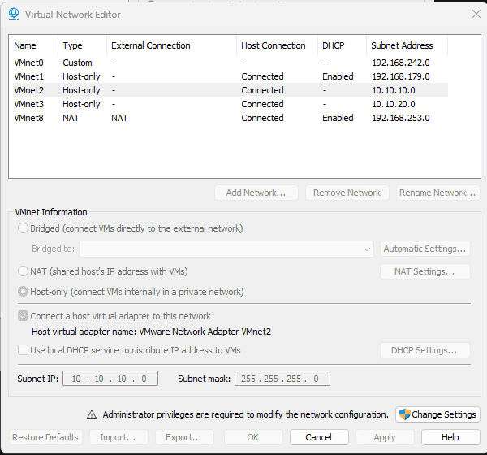


Repeat the exact same process to create **VMnet3**.


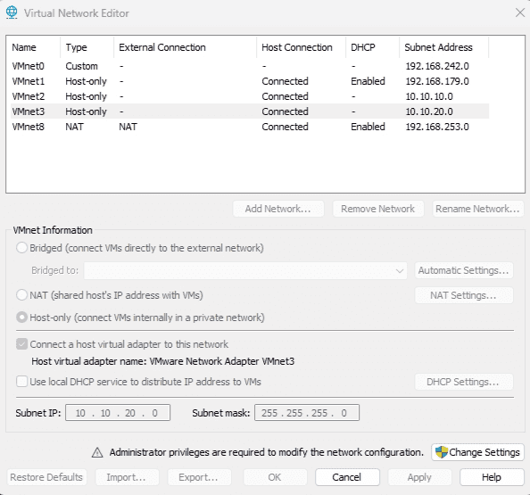


### 1.2. Deploying pfSense {#3617b0eb61a4801d9ec0eae97931bd09}

- Navigate to `https://repo.ialab.dsu.edu/pfsense/` to download **pfSense 2.7.1**. _(Note: Versions 2.8 and above require the use of the newer Netgate installer)._
- Extract the downloaded file and configure it as a new virtual machine within VMware.

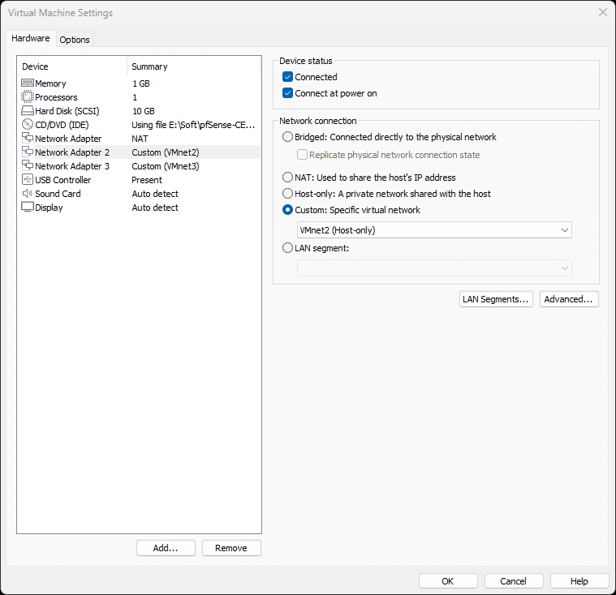


**Crucial Step:** Ensure the VM is configured with **three** network adapters:

- Adapter 1 (WAN): Bridged or NAT to connect to the external Internet.
- Adapter 2 (LAN): Assigned to the custom **VMnet2** created earlier.
- Adapter 3 (SIEM): Assigned to the custom **VMnet3** created earlier.

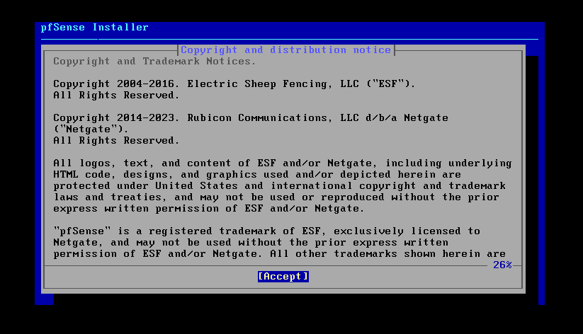


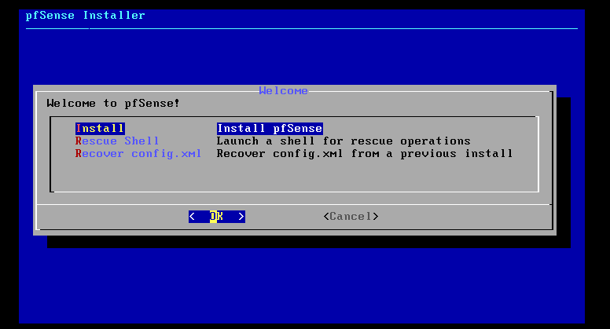


During the installation, select the **MBR** partition scheme to ensure compatibility with BIOS firmware.


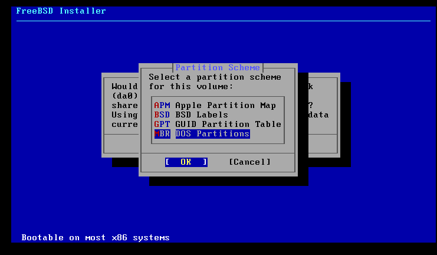


### 1.3. Interface Configuration {#3617b0eb61a480b99665d86670096c3b}


Upon completing the installation and rebooting, you will be presented with the pfSense console menu featuring 16 options:


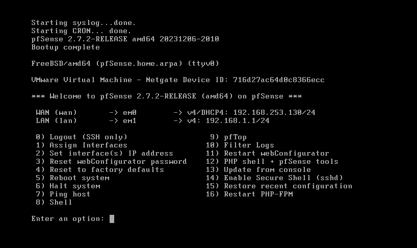

- Press **1 (Assign Interfaces)** and hit **Enter**.
- When prompted with _"Should VLANs be set up now?"_ type **n** and hit **Enter**.
- _Enter the WAN interface name..._ type **em0** and hit **Enter**.
- _Enter the LAN interface name..._ type **em1** and hit **Enter**.
- _Enter the Optional 1 interface name..._ type **em2** and hit **Enter**. (This interface serves as our SIEM Zone).
- _Do you want to proceed?_ type **y** and hit **Enter**.

### Assigning IP Addresses for LAN and SIEM {#3617b0eb61a48022bb79dab6fd007f53}


**Configuring the LAN Interface:**

1. Press **2 (Set interface(s) IP address)** and hit **Enter**.
2. Select option **2 (LAN)** and hit **Enter**.
3. _Configure IPv4 address LAN interface via DHCP?_ Type **n**.
4. _Enter the new LAN IPv4 address:_ Type **10.10.10.1** (This assigns the IP to the `em1` interface).
5. _Subnet bit count:_ Type **24** and hit **Enter**.
6. (Press **Enter** to skip Gateway and IPv6 configurations).
7. _Do you want to enable the DHCP server on LAN?_ Type **y** and hit **Enter**. (This allows pfSense to lease IP addresses to our Windows machines).
8. _Start address:_ Type **10.10.10.100** and hit **Enter**.
9. _End address:_ Type **10.10.10.200** and hit **Enter**.
10. _Do you want to revert to HTTP..._ Type **n** and hit **Enter**.

**Host Machine Configuration Adjustment:**
Return to your physical host machine and run the `ipconfig` command.

- We must manually modify the IP address of the host machine's VMware network adapter to **10.10.10.2** to prevent IP conflicts, ensuring **10.10.10.1** is exclusively reserved for the pfSense gateway.

```c++
Ethernet adapter VMware Network Adapter VMnet2:

   Connection-specific DNS Suffix  . :
   Link-local IPv6 Address . . . . . : fe80::955f:54b5:d17a:9bfe%52
   IPv4 Address. . . . . . . . . . . : 10.10.10.1
   Subnet Mask . . . . . . . . . . . : 255.255.255.0
   Default Gateway . . . . . . . . . :
```


Test the connection by logging into the pfSense WebGUI at `10.10.10.1`.


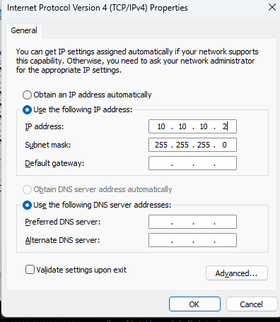


Login to 10.10.10.1


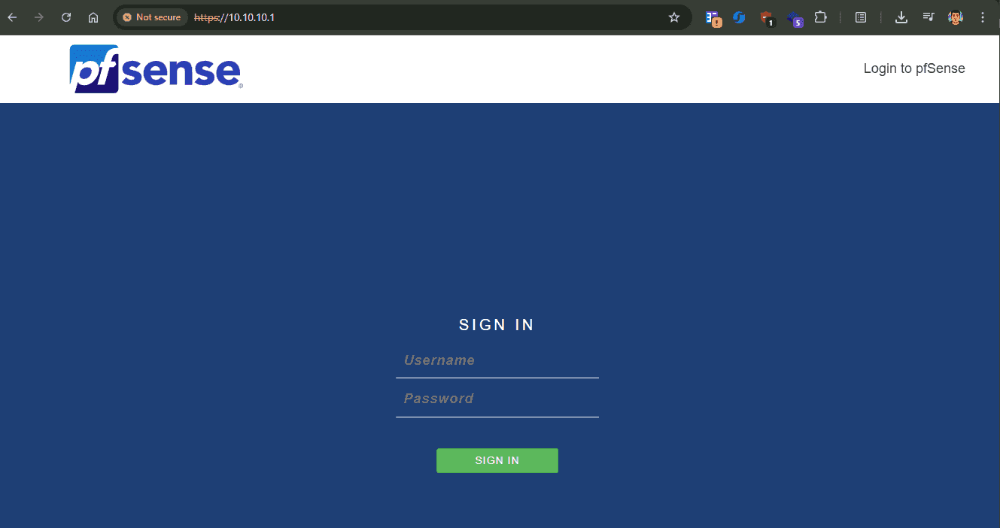


Same method applied with SIEM


**Testing Connectivity:**


From the host machine, you can successfully ping 10.10.10.1. However, pinging 10.10.20.1 will fail by default due to pfSense's restrictive baseline firewall rules.


```c++
PS E:\Soft> ping 10.10.10.1

Pinging 10.10.10.1 with 32 bytes of data:
Reply from 10.10.10.1: bytes=32 time<1ms TTL=64
Reply from 10.10.10.1: bytes=32 time<1ms TTL=64
Reply from 10.10.10.1: bytes=32 time<1ms TTL=64
Reply from 10.10.10.1: bytes=32 time<1ms TTL=64

Ping statistics for 10.10.10.1:
    Packets: Sent = 4, Received = 4, Lost = 0 (0% loss),
Approximate round trip times in milli-seconds:
    Minimum = 0ms, Maximum = 0ms, Average = 0ms
PS E:\Soft> ping 10.10.20.1

Pinging 10.10.20.1 with 32 bytes of data:
Request timed out.
```


## 2. Provisioning Windows Server 2022 (DC01) and IT Workstation (WS01) {#3617b0eb61a48073b640c150875bb643}


### 2.1. Domain Controller - DC01 (10.10.10.10) {#3617b0eb61a4806a9092dd2c42c561c8}

- **Windows Server 2022:** An enterprise-grade operating system designed to host enterprise services and manage multiple concurrent users.
- **Active Directory (AD):** A centralized database containing network objects such as employees (Users), devices (Computers), and departments (Organizational Units - OUs). It also houses Group Policy Objects (GPOs), which dictate corporate security policies.
- **Domain Controller (DC01):** The primary server actively hosting the Active Directory database.

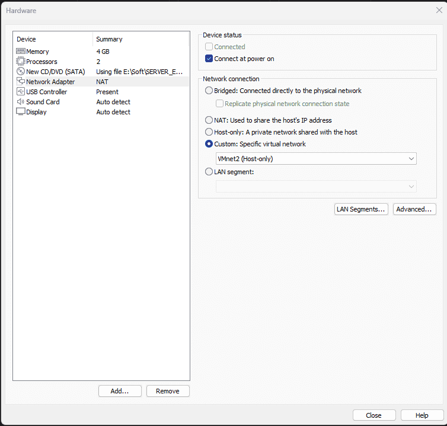

- Assign a static IP address to the server: **10.10.10.10/24**, with a default gateway of **10.10.10.1** (the pfSense firewall).
- **Critical Note:** The DNS server for the DC must be configured to point to itself using the loopback address: **127.0.0.1**.

### Promoting the Server to a Domain Controller {#3567b0eb61a4804b8a03d35753b3b18a}


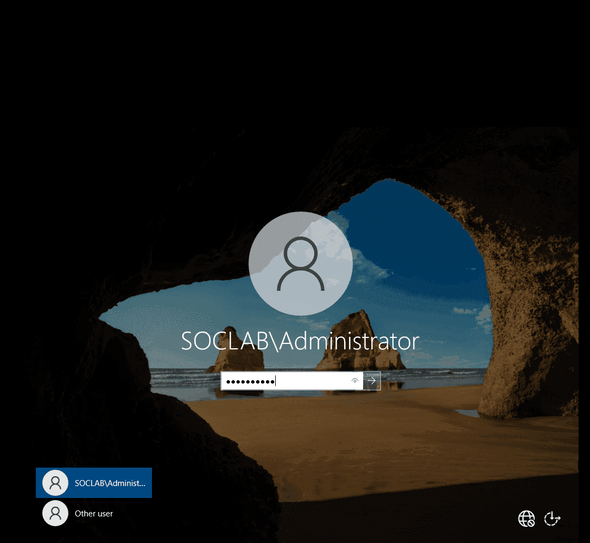


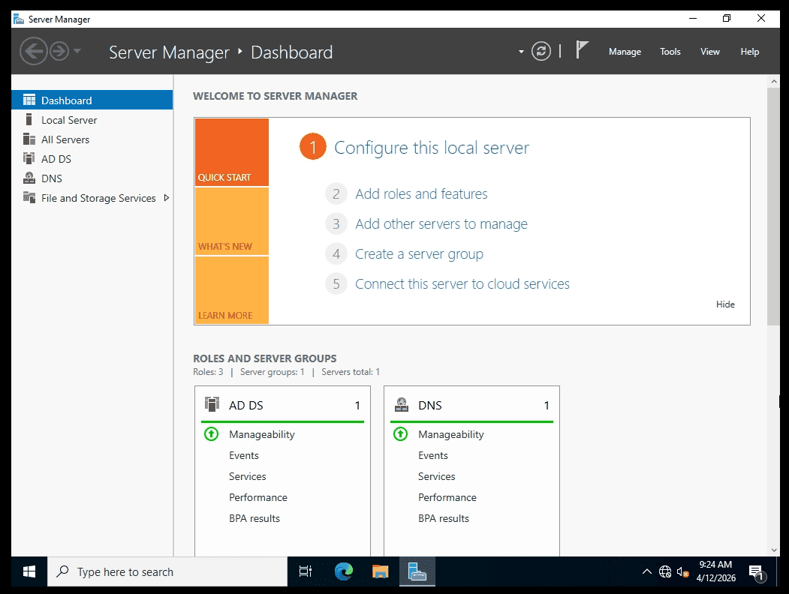


**Creating an Organizational Unit (OU) via ADUC:**
We will create an OU to manage our IT Workstation (WS01) later.

1. Open **Server Manager**, navigate to **Tools**, and select **Active Directory Users and Computers (ADUC)**.
2. Expand the domain tree (`soclab.local`).
3. Right-click, select New, and create a new **Organizational Unit (OU)** named `SOC_Lab`.

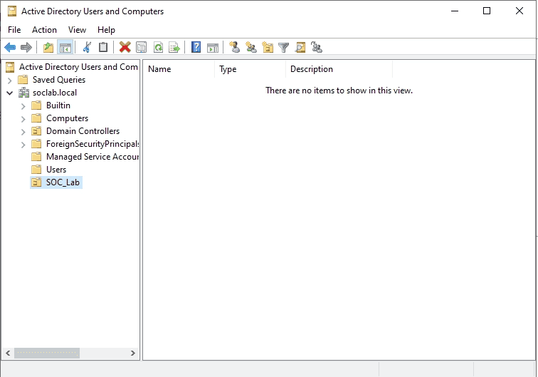


### 2.2. IT Workstation - WS01 (10.10.10.15) {#3617b0eb61a480b28a5ccd36d230d616}

1. Configure the VM's network adapter to connect to **VMnet2 (LAN)**.
2. Assign the static IP **10.10.10.15** and ensure its DNS server points directly to the Domain Controller (**10.10.10.10**).


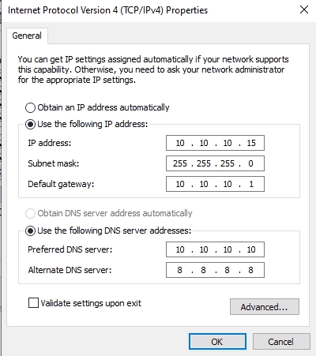


**Verifying Connectivity:**


Test communication with the Domain Controller:


```c++
PS C:\Users\cuong_nguyen> ping 10.10.10.10
Pinging 10.10.10.10 with 32 bytes of data:
Reply from 10.10.10.10: bytes=32 time<1ms TTL=128
Reply from 10.10.10.10: bytes=32 time<1ms TTL=128
Reply from 10.10.10.10: bytes=32 time<1ms TTL=128
```


Perform an `nslookup` against the domain:


```c++
PS C:\Users\cuong_nguyen> nslookup soclab.local
Server:  UnKnown
Address:  10.10.10.10

Name:    soclab.local
Address:  10.10.10.10
```


_Note: Currently, the reverse lookup zone is unconfigured, which is why the server name resolves as "Unknown". We will fix this by configuring the DNS reverse lookup zone on DC01._


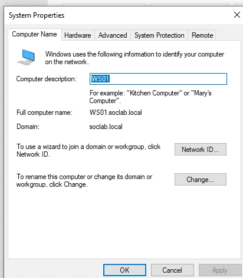


**Joining the Domain:**
Rename the workstation and join it to the `soclab.local` domain via System Properties.


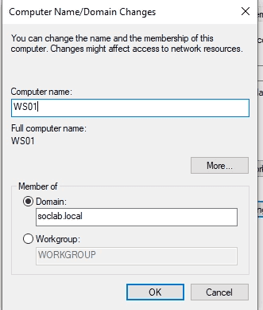


**Configuring the Reverse Lookup Zone on DC01 (DNS Resolution):**

1. On **DC01**, open **Server Manager** → **Tools** → **DNS**.
2. Right-click **Reverse Lookup Zones** and select **New Zone**.
3. Select **IPv4 Reverse Lookup Zone** and click Next.
4. In the Network ID field, enter your subnet: **10.10.10**. Click Next.
5. Leave the default setting to _Allow only secure dynamic updates_, then click Finish.

**Updating the Pointer (PTR) Record:**

1. Navigate to **Forward Lookup Zones** → `soclab.local`.
2. Locate the A record for **DC01** (IP 10.10.10.10).
3. Double-click the record and ensure the **"Update associated pointer (PTR) record"** box is checked.

Verify the resolution again on WS01:


```c++
PS C:\Users\cuong_nguyen> nslookup soclab.local
Server:  dc01.soclab.local
Address:  10.10.10.10

Name:    soclab.local
Address:  10.10.10.10
```


### **Finalizing AD Organization** {#3567b0eb61a480fe85fbdca569359042}


Return to Active Directory Users and Computers (ADUC) on the Domain Controller.
Move the newly joined **WS01** computer object from the default Computers container into the dedicated**`SOC_Lab`**Organizational Unit.


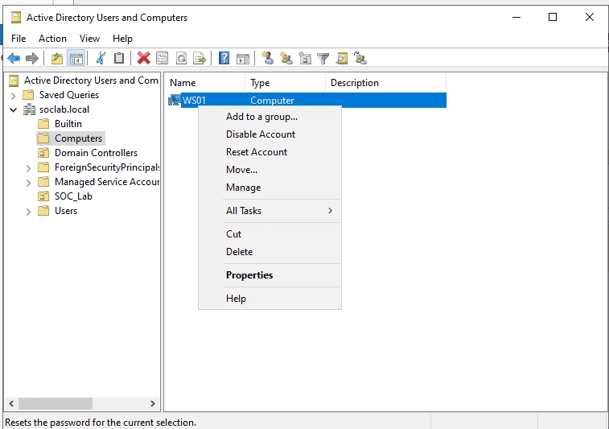

