---


## 1. Installing Suricata on pfSense {#3617b0eb61a480d2a908ca229953e149}


### 1.1. Package Installation: {#3617b0eb61a4805e9e67e331070ddc0e}

- Log into pfSense.
- Navigate to **System → Package Manager → Available Packages**.
- Search for **Suricata** and click **Install**.

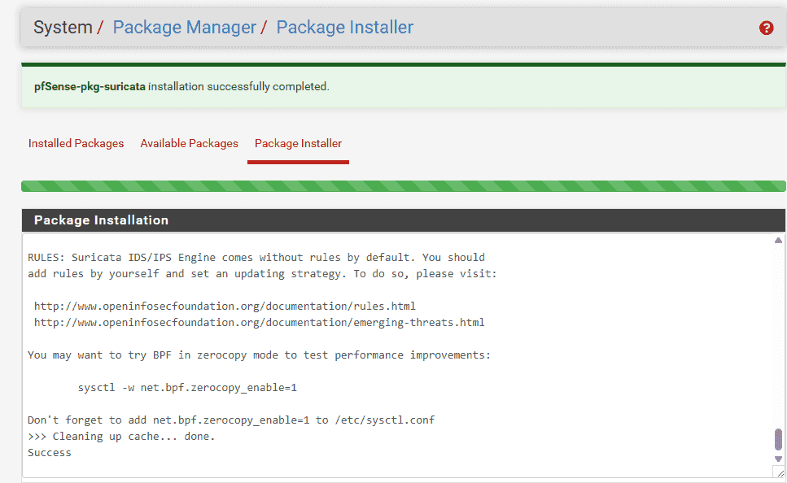


**Configuring Global Settings (Downloading Rulesets):**

- Navigate to **Services → Suricata → Global Settings**.
- Under the **Rules Update Settings** section, check the box for:
	- `Install Emerging Threats rules (ET Open)`
- Set the **Update Interval** to **12-Hours**.
- Save the configuration, then switch to the **Updates** tab and click **Update** to force an immediate download of the rulesets.

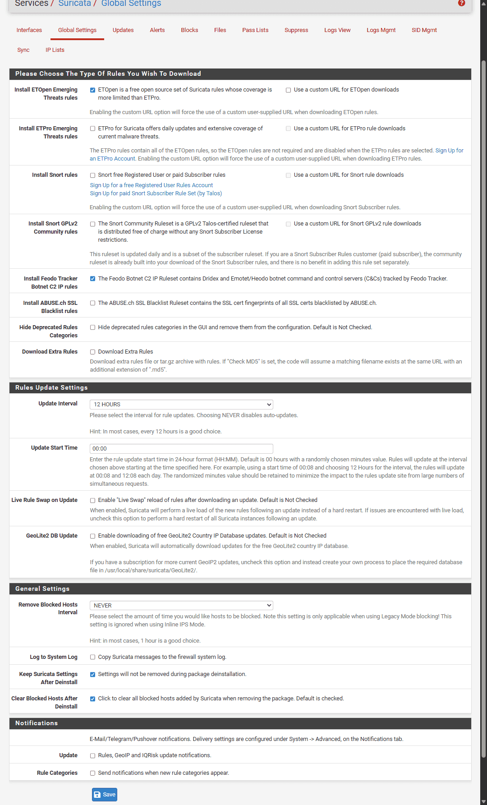


### 1.2. Attaching Suricata to the LAN Interface: {#3617b0eb61a480678542cd72337941e2}

- Switch to the **Interfaces** tab and click **Add**.
- **Interface:** Select **LAN** (This is the network segment containing DC01 and WS01).
- Under the **Alert Settings** section: Check **Send Alerts to System Log**.
- Additionally, enable **EVE JSON log**: This is the standard log format required for seamless ingestion into Splunk.

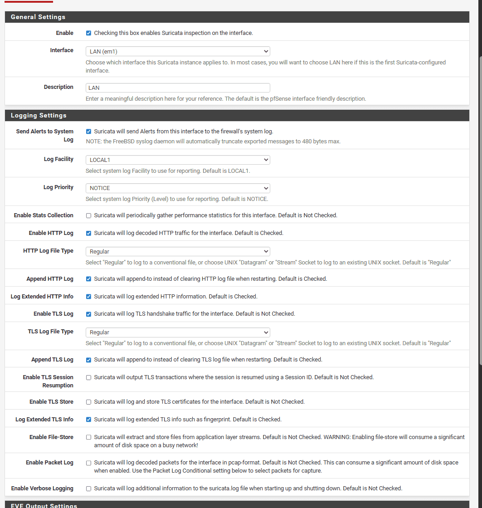


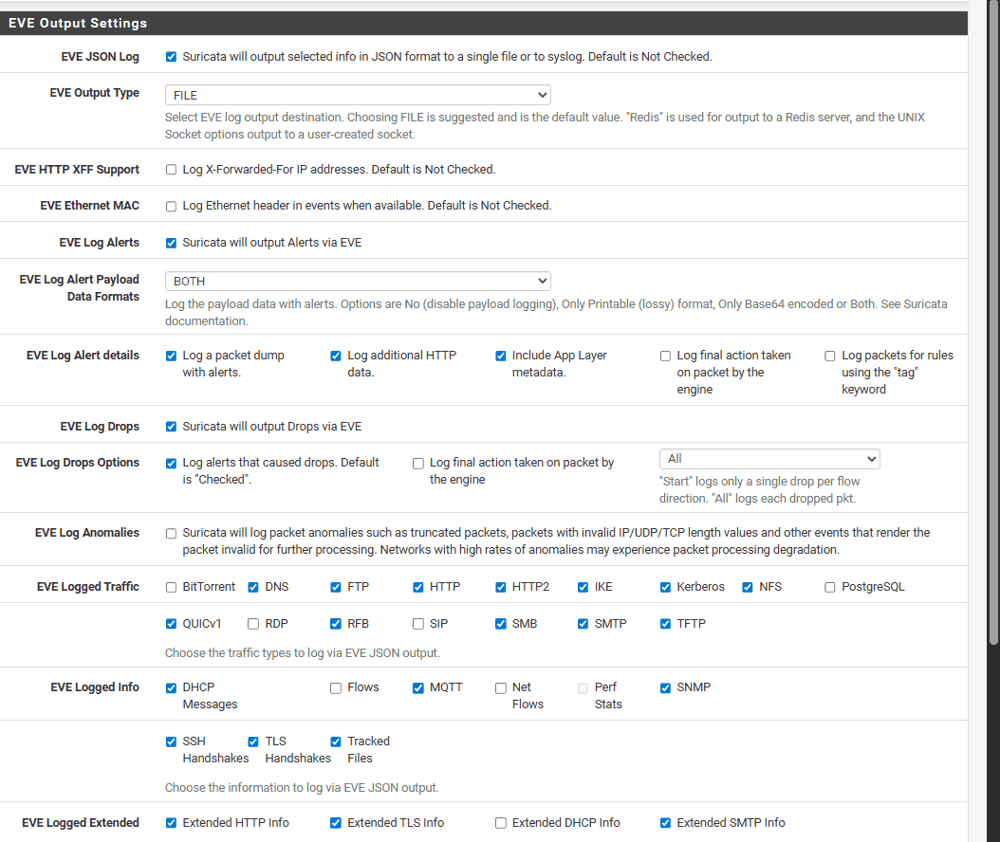

- **Save** the configuration.
- Switch to the **LAN Categories** tab and click **Select All** to enable all the recently downloaded rules (Note: These can be fine-tuned later to reduce noise and false positives).
- Return to the **Interfaces** tab and click the **Play** icon to start the Suricata service on the LAN interface.

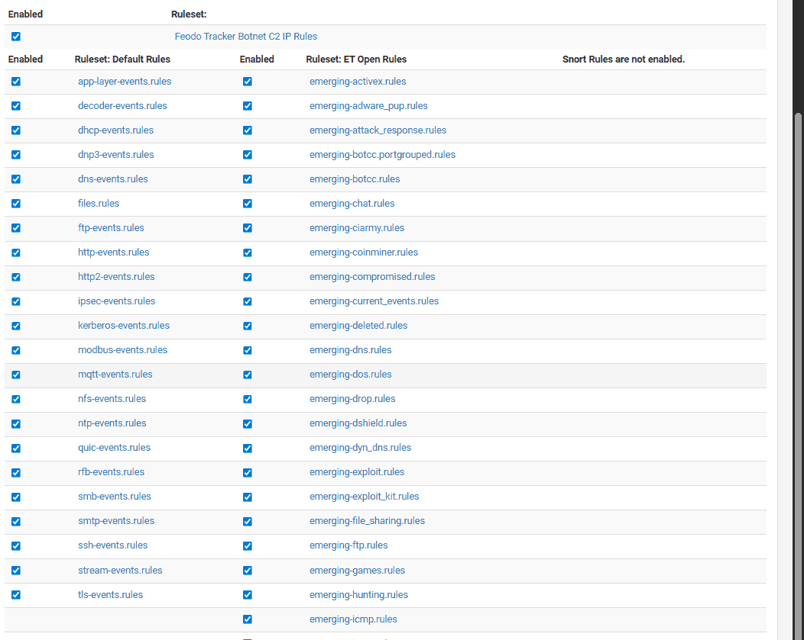


## 2. Configuring Log Forwarding from pfSense to Splunk {#3617b0eb61a480ee8ca5c680a942ff39}


Instead of installing the Splunk Universal Forwarder directly on pfSense (which is highly complex and prone to breaking), we will utilize the traditional **syslog-ng** service.


### 2.1. On pfSense (Configuring syslog-ng) {#3617b0eb61a48088a6cbc9be68769820}


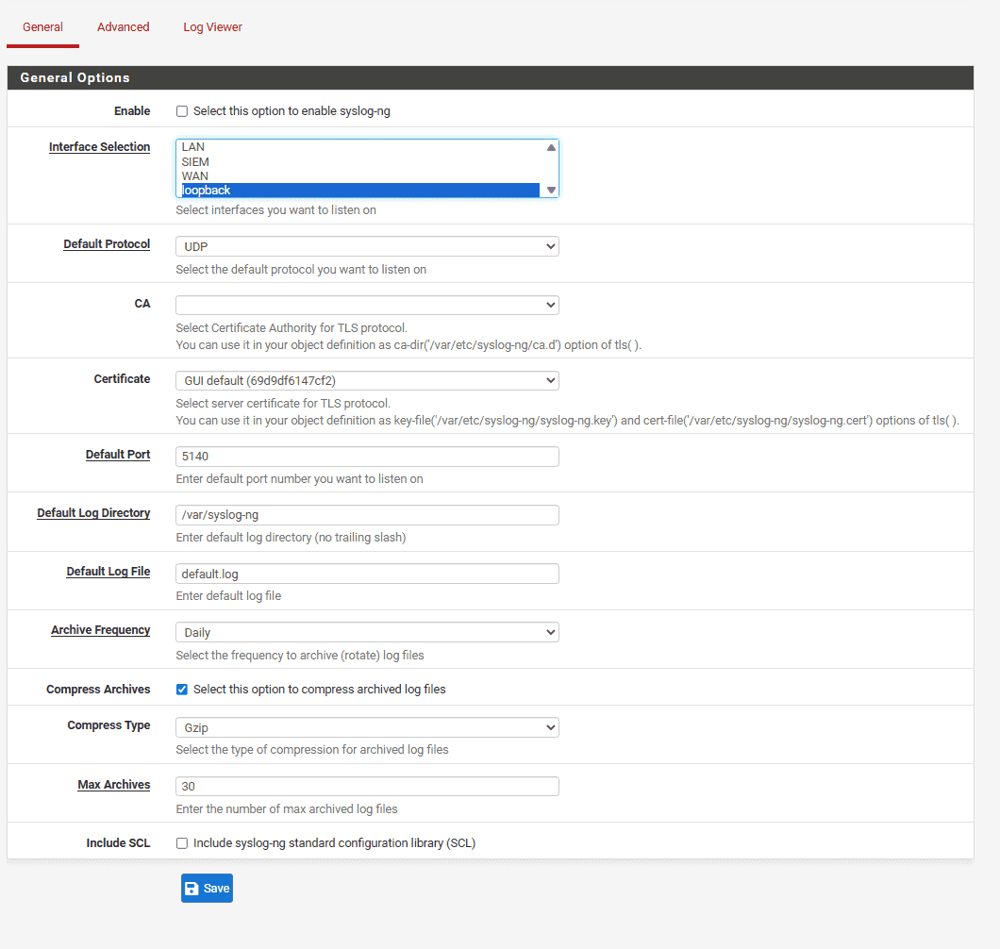

- Leave the General Options at their defaults as we do not need to modify this section. Selecting `loopback` simply instructs the service to listen on its own internal interface.

~~**Method 1: Using TCP Port 515 (Deprecated)**~~

- In Splunk, navigate to **Settings → Data Inputs**.
- During the configuration step (**Set Sourcetype**), you must select `_json` (located under the **Structured** group). This configuration allows Splunk to accurately parse and extract the JSON fields immediately upon ingestion.
- _Note:_ When initially deploying your Splunk Docker container, you must ensure port 515 is exposed.

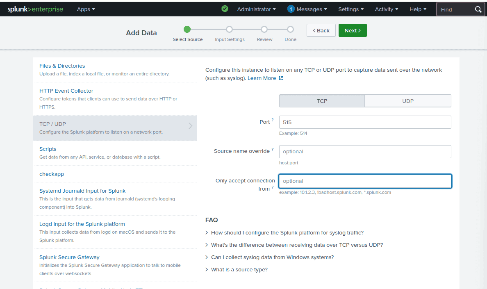


Create a new index named `suricata_ids` and assign the host value as `pfsense_suricata`.


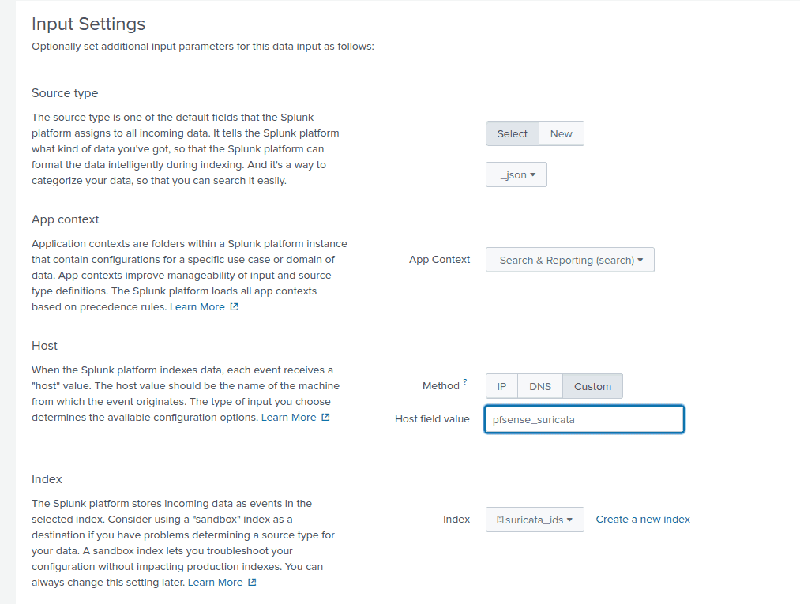


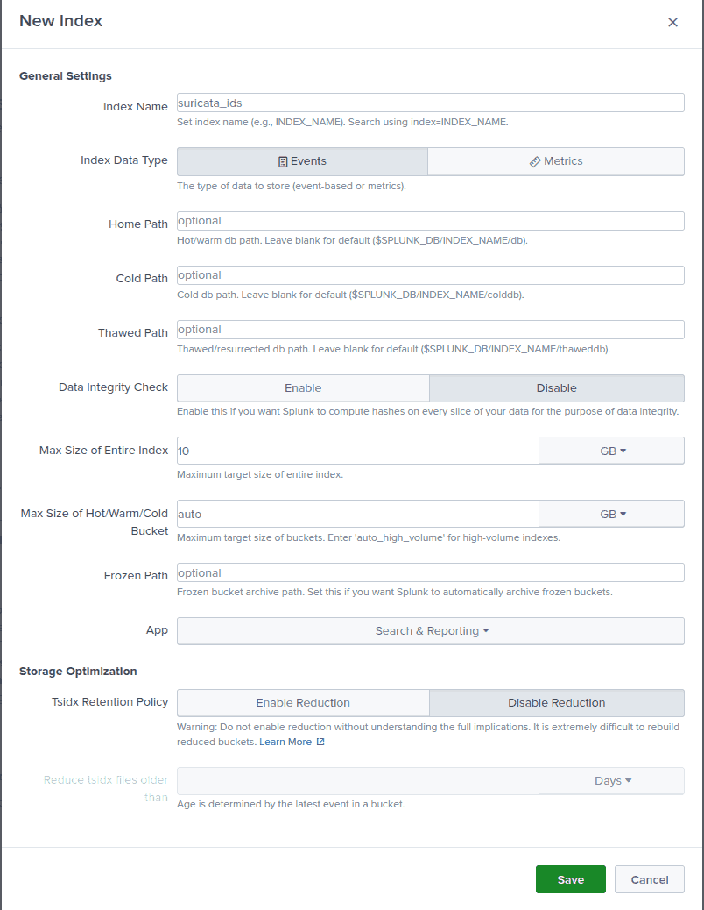


**Method 2: Using HEC (HTTP Event Collector) for highly efficient log parsing**


[https://www.unsafehex.com/index.php/2023/10/11/forward-pfsense-suricata-splunk/](https://www.unsafehex.com/index.php/2023/10/11/forward-pfsense-suricata-splunk/)


**Step 1: Enable the HEC Port on Splunk**
First, we need to open port 8088 and generate an authentication Token to grant pfSense the required permissions to push data.

1. On the Splunk Web interface, navigate to **Settings → Data Inputs → HTTP Event Collector**.
2. In the top right corner, click **Global Settings** → Select **Enabled** → Click **Save**.
3. Click the green **New Token** button:
	- **Name:** Set this to `suricata_hec`.
	- Click **Next**.
	- **Index:** Create a new index named `suricata`.
	- Click **Review** → **Submit**.
4. Securely copy and save the generated token.

**Step 2: Create Source, Destination, and Log Mappings on pfSense**
Open pfSense, navigate to **Services → Syslog-ng → Advanced tab**. You will click **Add** consecutively to create the following three configuration Objects:


**1. Source Object (Reads the** **`eve.json`** **file directly):**

- **Object Name:** `s_suricata_eve`
- **Object Type:** Source
- **Object Parameters:**

```sql
{wildcard-file( base-dir("/var/log/suricata/") filename-pattern("eve.json") recursive(yes) flags(no-parse) ); };
```


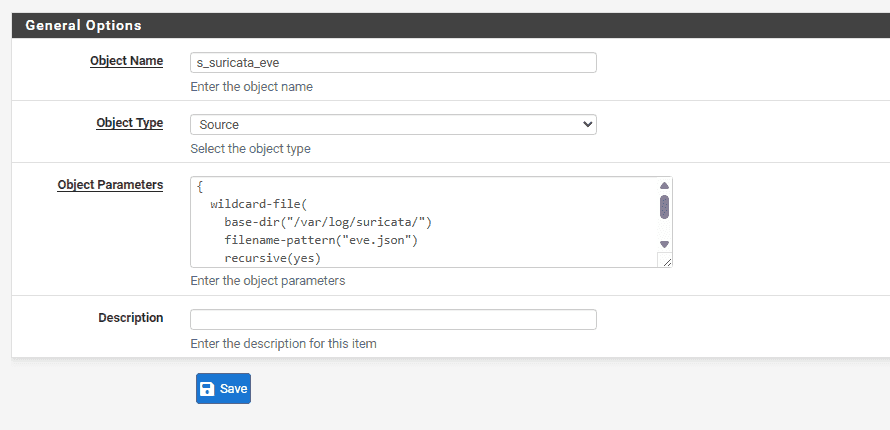


**2. Destination Object (Forwards to Splunk HEC):**

- **Object Name:** `d_splunk_hec`
- **Object Type:** Destination
- **Object Parameters:** _(Copy the code block below, ensuring you replace the IP address with your Splunk IP and the password field with the Token you generated in Step 1)_:

```sql
{ http(url("https://10.10.20.30:8088/services/collector/event") method("POST") user_agent("syslog-ng") user("user") password("REDACTED") peer-verify(no) body("{ \"time\": ${S_UNIXTIME}, \"host\": \"${HOST}\", \"source\": \"suricata\", \"sourcetype\": \"_json\", \"index\": \"suricata\", \"event\": ${MSG} }\n") ); }; 
```


Note: The `password` value is the exact token string generated when you configured the HEC input on port 8088 in Splunk.


3. Log Object (Links the Source to the Destination):

- Object Name: `l_suricata_to_splunk`
- Object Type: `Log`
- Object Parameters:Plaintext

	```sql
	{ source(s_suricata_eve); destination(d_splunk_hec); };
	```


**Step 3: Restart Services**
Navigate to **Status → Services** in pfSense, locate both the `syslog-ng` and `suricata` services, and restart them to apply the new configurations.


---


### 2.2. System Verification {#3617b0eb61a48029901bfeccf59b1236}


**Triggering an Alert:**
Run the following command from your workstation (WS01):


```powershell
PS C:\\Users\\cuong_nguyen> curl <http://testmyids.com>
uid=0(root) gid=0(root) groups=0(root)
```


**Verification on pfSense:**

- Navigate to **Services → Suricata → Alerts**.

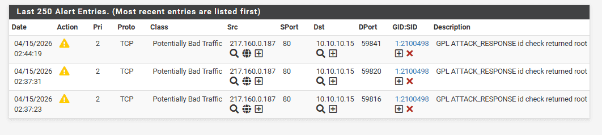


**Verification on Splunk:**

- Open the Search & Reporting app and run the following SPL query:

```c++
index="suricata_ids"
```


_(Results when using TCP port 515)_


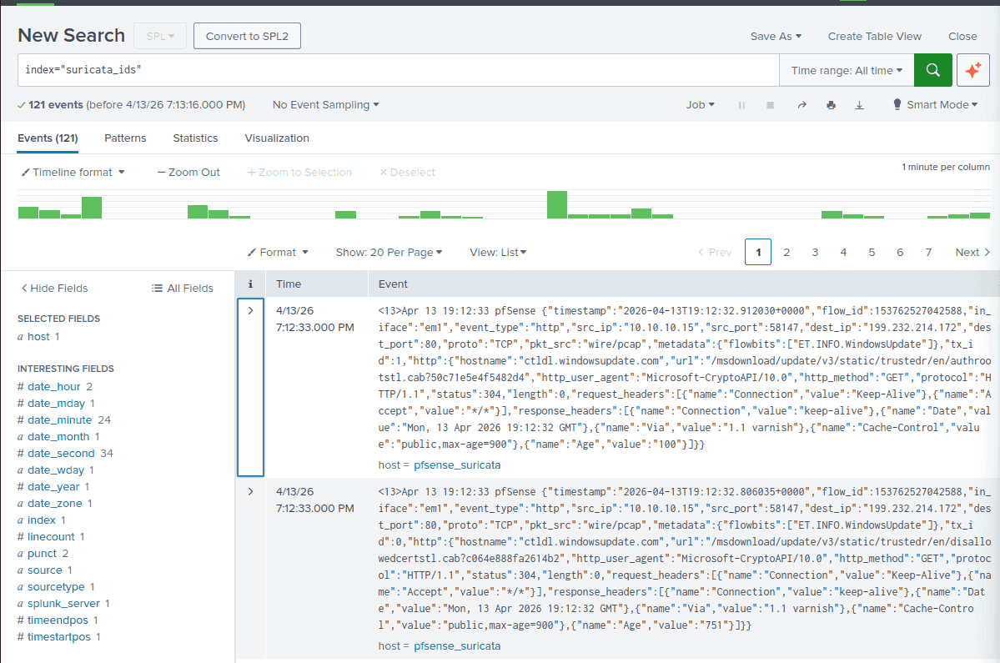


(Results after transitioning to HEC port 8088)


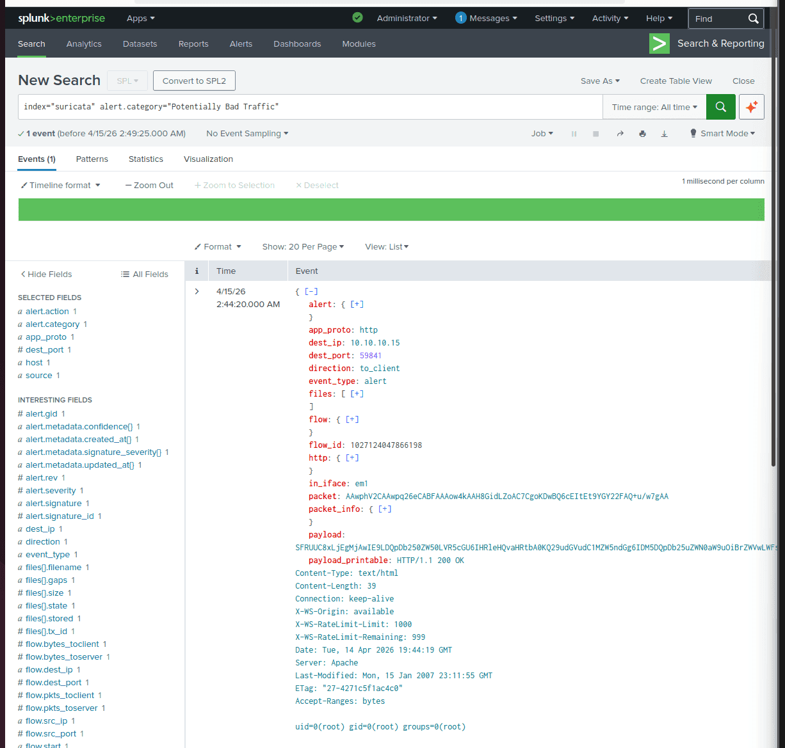


:::tip

**Crucial Note Regarding Timestamps:** By default, the system time on pfSense operates in UTC-0, which will cause timestamp discrepancies in your SIEM. You must navigate to **System → General Setup** and adjust the timezone configuration to Vietnam (`Asia/Ho_Chi_Minh`) to ensure accurate log correlation.

:::


