---


## 1. Configuring GPOs for Advanced Log Collection {#3617b0eb61a480c683fdcd6fe75b450d}


In addition to the natively enabled logs:

- **4624 (Successful Logon):** Indicates a successful user logon (generates significant noise; requires careful filtering).
- **4625 (Failed Logon):** Indicates an incorrect password attempt (useful for detecting brute-force attacks).
- **4634 / 4647 (Logoff):** Indicates a user logoff.
- **4672 (Special Privileges Assigned):** Indicates an administrator-level account logon (frequently generated when attackers execute Pass-the-Hash techniques).
- **4720, 4722, 4724:** Account management logs on the Domain Controller (User creation, User activation, Password resets).

We must also enable several critical Event IDs:

- **4688:** A new process has been created.
- **4104 (Script Block Logging) & 4103 (Module Logging):** Records each executed PowerShell cmdlet and its returned output. This is highly valuable when attackers utilize obfuscated scripts.
- **4698:** A new scheduled task was created on the system (crucial for monitoring persistence mechanisms).
- **5145:**  A network share object was checked to see whether client can be granted desired access.

### 1.1. Establishing a Dedicated Audit Policy {#3617b0eb61a4806f9fb9d3e5e8b8b505}

1. On the **DC01** machine, open **Server Manager**.
2. Click on **Tools** (top right corner) → Select **Group Policy Management**.
3. Once the Group Policy Management window opens, expand the nodes sequentially: **Forest:** **`soclab.local`** → **Domains** → **`soclab.local`**.
4. Locate the **SOC_Lab** Organizational Unit (OU).
5. Right-click on **SOC_Lab** and select the first option: **Create a GPO in this domain, and Link it here...**
6. Name the GPO: **`SOC_Audit_Policy`**.

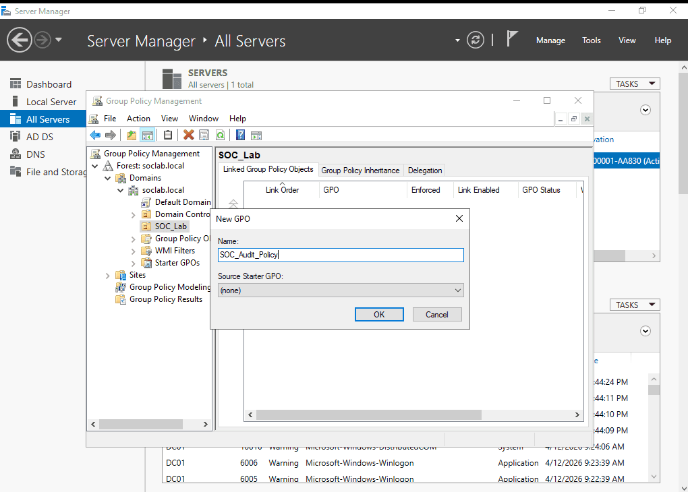


### 1.2. Enabling Required Event IDs {#3617b0eb61a480aa804cf91191a7eb80}


**Enabling PowerShell Logging (Event 4104)**


Reference: [https://www.iblue.team/incident-response-1/logging-powershell-activities](https://www.iblue.team/incident-response-1/logging-powershell-activities)

1. Navigate through the directory tree: **Computer Configuration → Policies → Administrative Templates → Windows Components → Windows PowerShell**.
2. In the right pane, double-click on **Turn on PowerShell Script Block Logging**.
3. Select **Enabled**. Click **OK**.

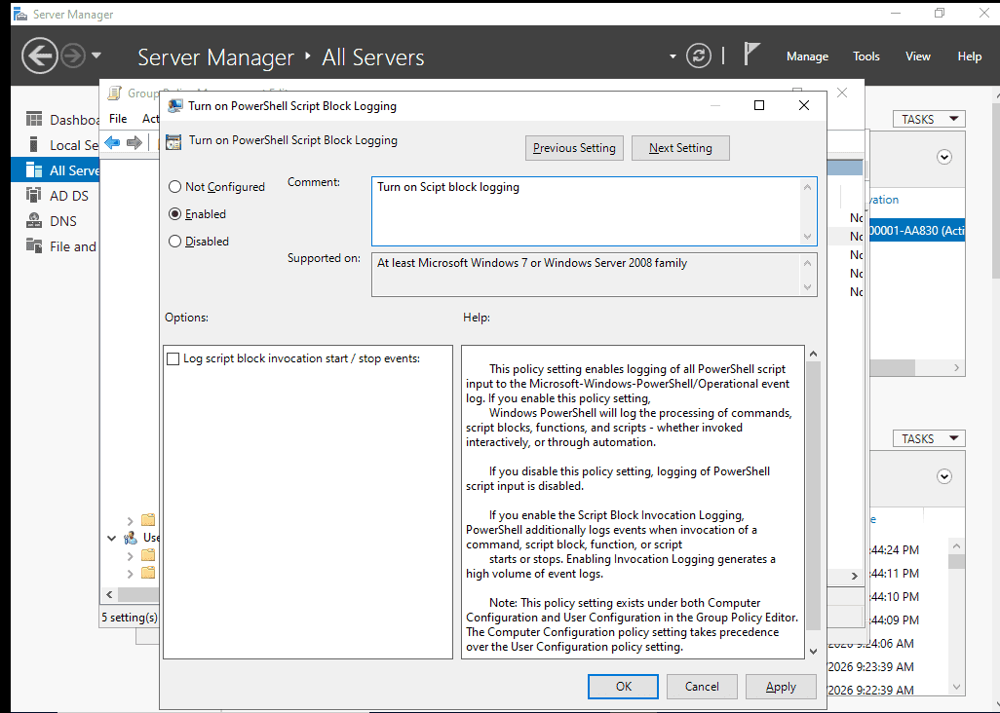


**Enabling Process Creation Auditing (with Command Line logging)**
This configuration must be applied in two separate locations:

- **Location 1 (Enable Process Tracking):**
	- Navigate to: **Computer Configuration → Policies → Windows Settings → Security Settings → Advanced Audit Policy Configuration → Audit Policies → Detailed Tracking**.
	- Double-click on **Audit Process Creation**. Check both the **Success** and **Failure** boxes. Click **OK**.

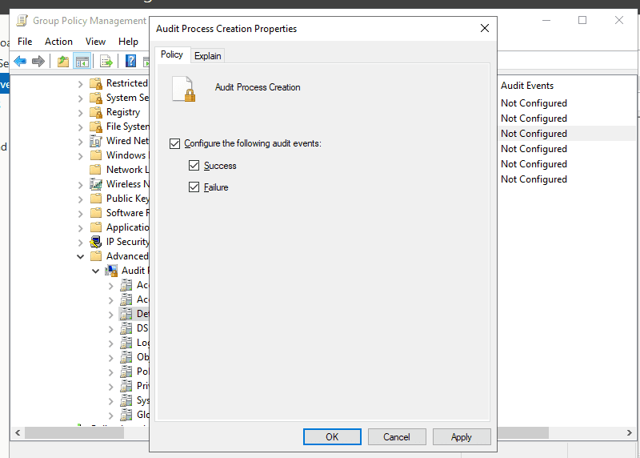


**Location 2 (Force Windows to log command-line arguments):**

- Navigate to: **Computer Configuration → Policies → Administrative Templates → System → Audit Process Creation**.
- Double-click on **Include command line in process creation events**.
- Select **Enabled**. Click **OK**.

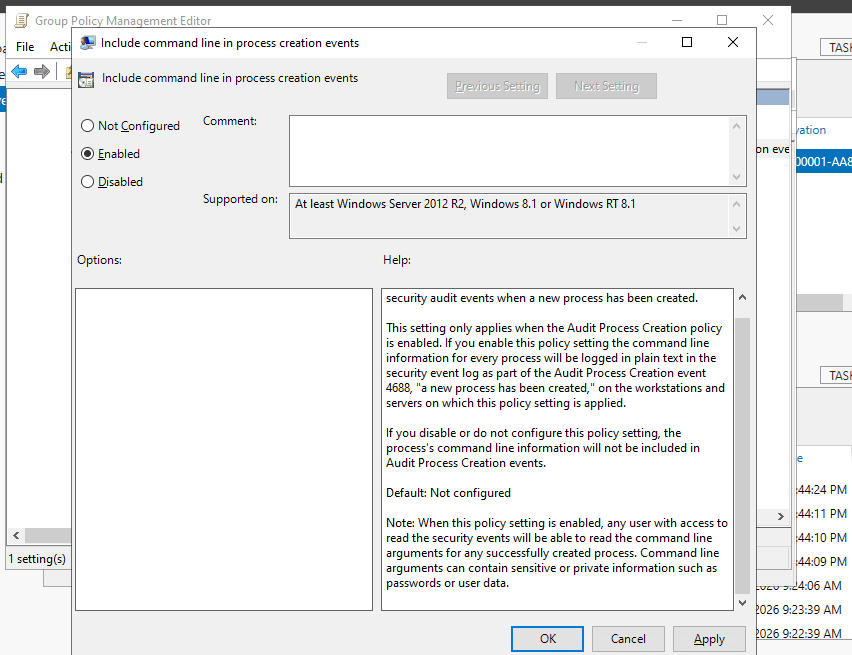


**Enabling Scheduled Task Logging (Event 4698)**

1. Open Group Policy Management on DC01.
2. Locate the **SOC_Lab** OU → Right-click on **`SOC_Audit_Policy`** → Select **Edit...**
3. In the Group Policy Management Editor, navigate to: **Computer Configuration → Policies → Windows Settings → Security Settings → Advanced Audit Policy Configuration → Audit Policies → Object Access**.
4. In the right pane, double-click the policy named: **Audit Other Object Access Events**.
5. Check both the **Success** and **Failure** boxes. Click **OK**.

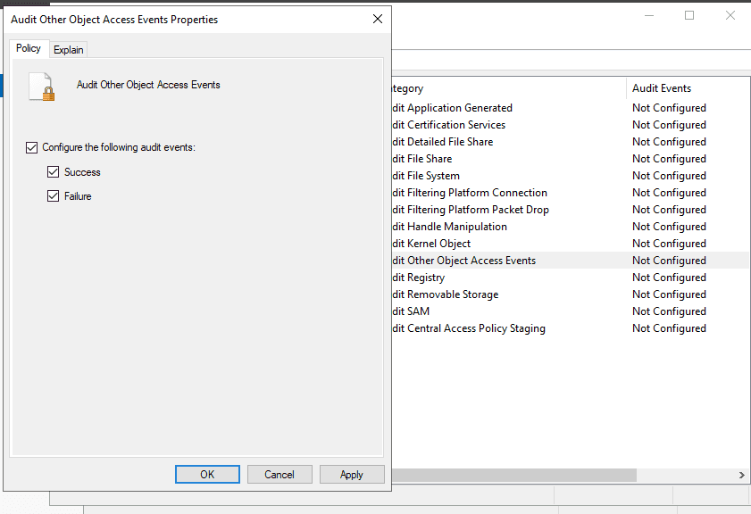


:::tip

Enabling this policy captures not only Event 4698 (Task Created) but also 4699 (Task Deleted) and 4702 (Task Updated).

:::


---


**Enable Event ID 5145 logging:**

1. Open Group Policy Management on DC01.
2. Locate the **SOC_Lab** OU → Right-click on **`SOC_Audit_Policy`** → Select **Edit...**
3. Navigate to: **Computer Configuration → Policies → Windows Settings → Security Settings →** `Advanced Audit Policy Configuration` &gt; `Audit Policies` &gt; `Object Access`.
4. Enable **`Audit Detailed File Share`** for _Success_, _Failure_, or _Both_.
5. Run `gpupdate /force` in an elevated command prompt to apply the policy

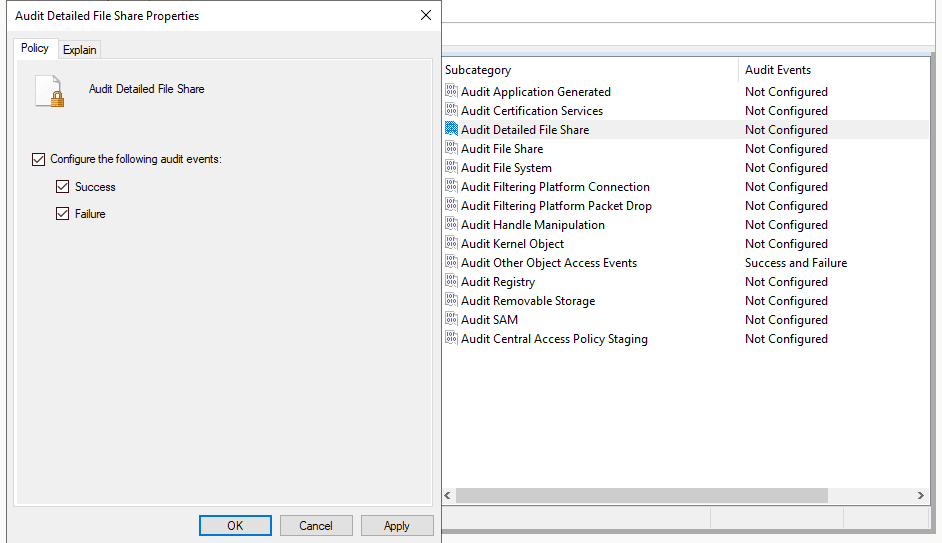


### 1.3. Forcing GPO Updates on WS01 {#3617b0eb61a480928597c44fb64ce2d6}

1. Open the console for the **WS01** virtual machine.
2. Open Command Prompt (Run as Administrator), execute the following command, and press Enter:

```c++
**gpupdate /force
Computer Policy update has completed successfully.
User Policy update has completed successfully.**
```


**Verification**


We will test to see if the logging is actively recording:


```c++
PS C:\Users\cuong_nguyen> net user

User accounts for \\WS01

-------------------------------------------------------------------------------
Administrator            cuong_nguyen             DefaultAccount
defaultuser0             Guest                    WDAGUtilityAccount
The command completed successfully.
```


For Scheduled Tasks:


```c++
schtasks /create /tn "APT29_Persistence" /tr "calc.exe" /sc daily /st 12:00
```


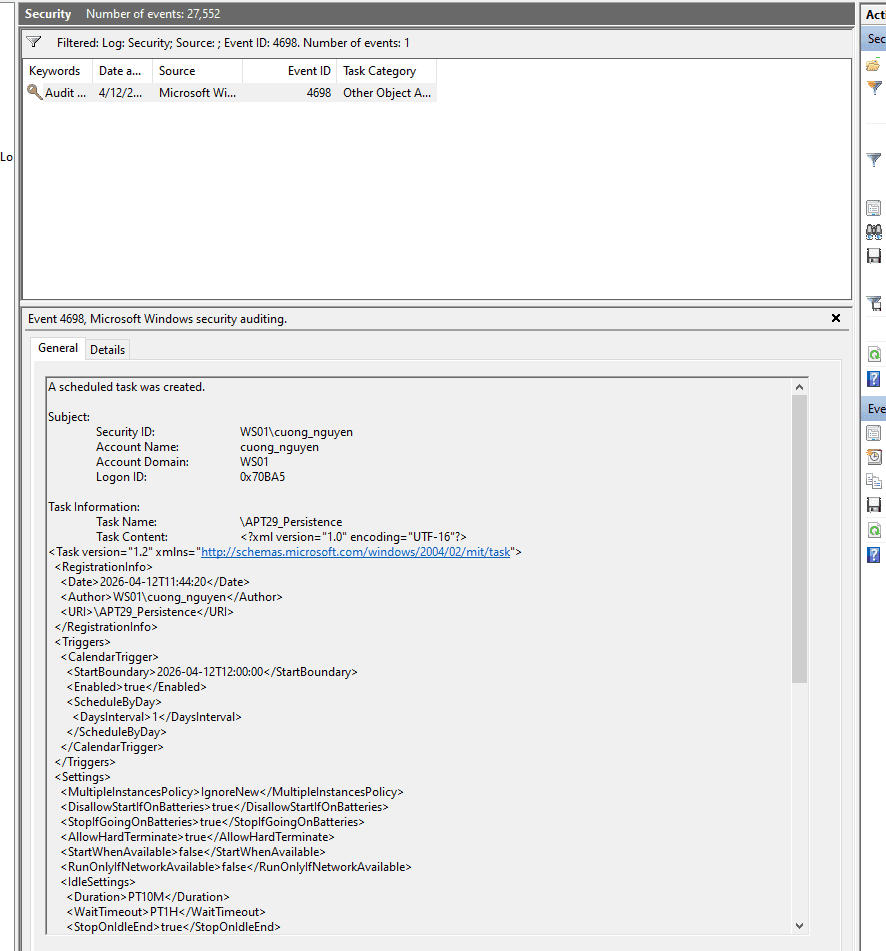


### 1.4. Linking the Domain Controllers to the SOC_Audit_Policy {#3617b0eb61a480dea11fee0b809538c2}


To ensure DC01 is audited under the exact same rules as WS01, we must link the Domain Controllers OU to our newly created policy.


### 1.5 Enable SMB and file sharing {#3627b0eb61a480fb8452c8789ea7d77c}


**Step 1: Enable SMB through Windows Firewall**


To allow PsExec and SMB traffic (Port 445), you must open the firewall ports on all target machines.

1. **Create a New GPO**: create new OU named: `Enable_SMB_Sharing`.

	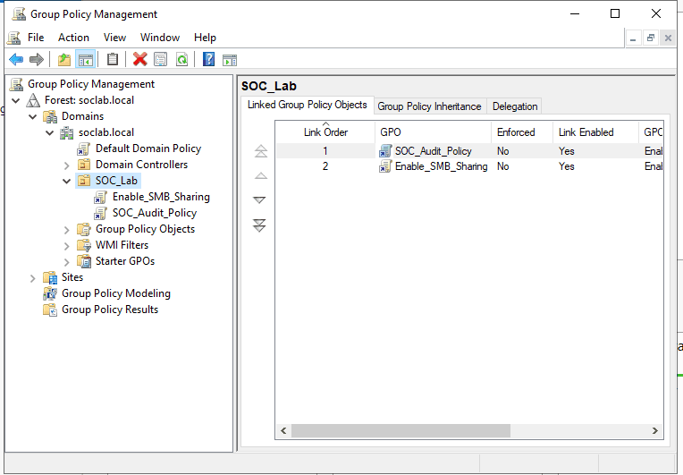

2. **Edit the GPO**: Right-click the new GPO and select **Edit**.
3. **Navigate to Firewall Rules**:
	- `Computer Configuration` -> `Policies` -> `Windows Settings` -> `Security Settings` -> `Windows Defender Firewall with Advanced Security`.
4. **Create Inbound Rule**:
	- Right-click **Inbound Rules** -> **New Rule...**
	- Select **Predefined**: Choose **File and Printer Sharing**.
	- Click **Next**, ensure all rules in the list are checked, and select **Allow the connection**.
	- Click **Finish**.

	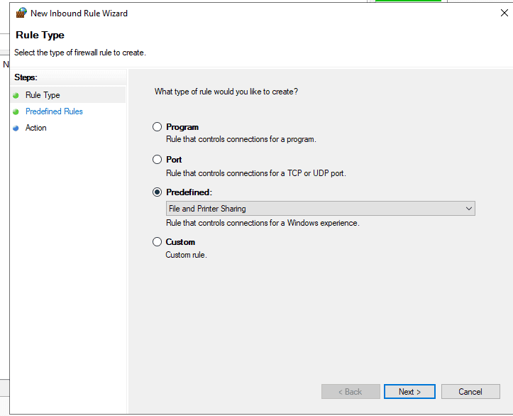


	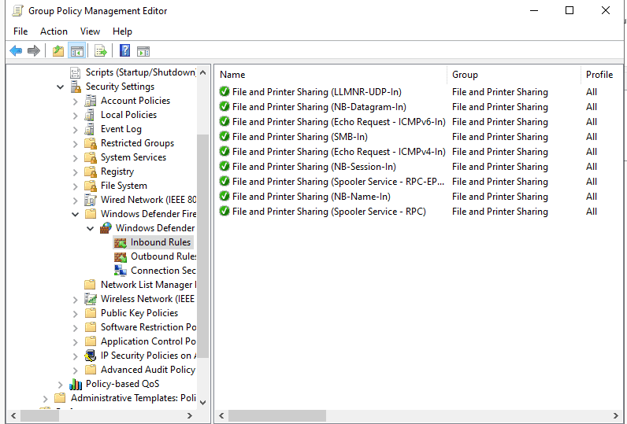


---


**Step 2: Enable the "Server" Service**


SMB requires the "Server" service to be running.

1. In the same GPO Editor, navigate to:
	- `Computer Configuration` -> `Policies` -> `Windows Settings` -> `Security Settings` -> `System Services`.
2. Locate **Server** (also known as `LanmanServer`).

	The **LanmanServer** (officially named the "Server" service) is **a core Windows service responsible for file, printer, and named-pipe sharing over a local network**.

3. Double-click it, check **Define this policy setting**, and set the startup mode to **Automatic**.

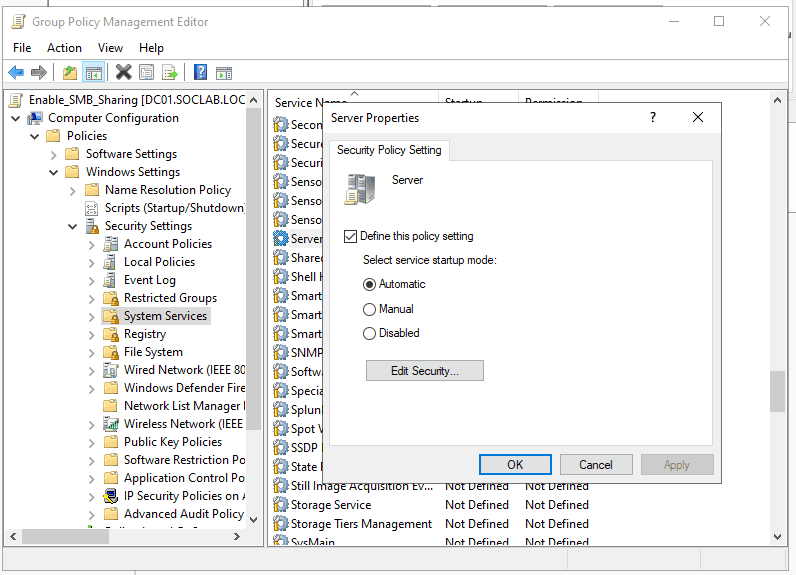


---


**Step 3: Creating a Shared Folder via GPO**


This will automatically create and share a folder on the target machines.


Create a shared folder:

- First navigate to: `Computer Configuration` -&gt; `Preferences` -&gt; `Windows Settings` -&gt;  Folders
- Create a folder with these following properties

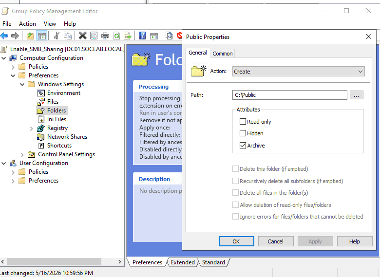


Create a network share:

1. Navigate to:
	- `Computer Configuration` -> `Preferences` -> `Windows Settings` -> `Network Shares`.
2. Right-click -&gt; **New** -&gt; Network Share.
3. **Action**: Create.
4. **Share path**: C:\Public
5. **Share name**: PublicData
6. Under the **Permissions** tab, add the desired groups (e.g., `Authenticated Users`) and set permissions to **Read** or **Change**.

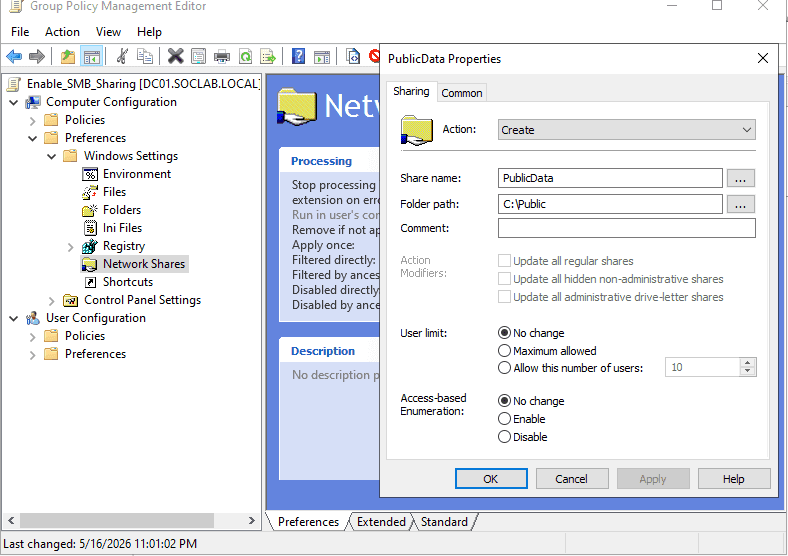


---


**Step 4: Enable Administrative Shares**

1. Navigate to:
	- `Computer Configuration` -> `Preferences` -> `Windows Settings` -> `Registry`.
2. Right-click -&gt; **New** -&gt; **Registry Item**.
3. **Hive**: `HKEY_LOCAL_MACHINE`.
4. **Key Path**: `SYSTEM\CurrentControlSet\Services\LanmanServer\Parameters`.
5. **Value Name**: `AutoShareServer` (for Windows Server) or `AutoShareWks` (for Windows Workstations).
6. **Value Type**: `REG_DWORD`.
7. **Value Data**: `1`.

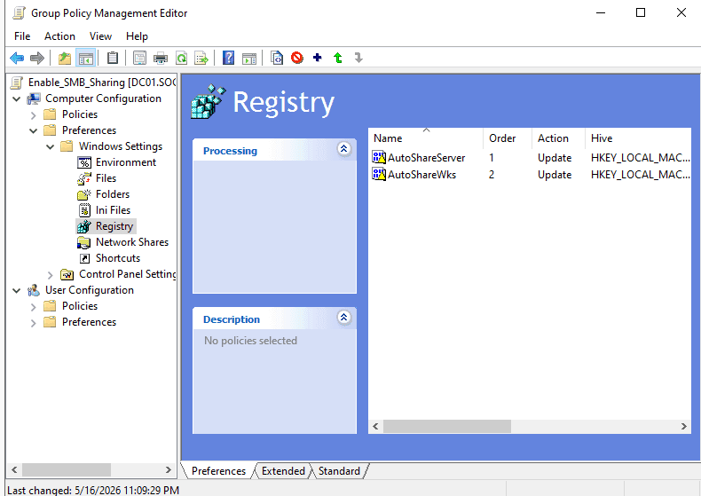


Same as we did with SOC_Audit_Policy,  we must link the Domain Controllers OU to the newly created Enable_SMB_Share OU.


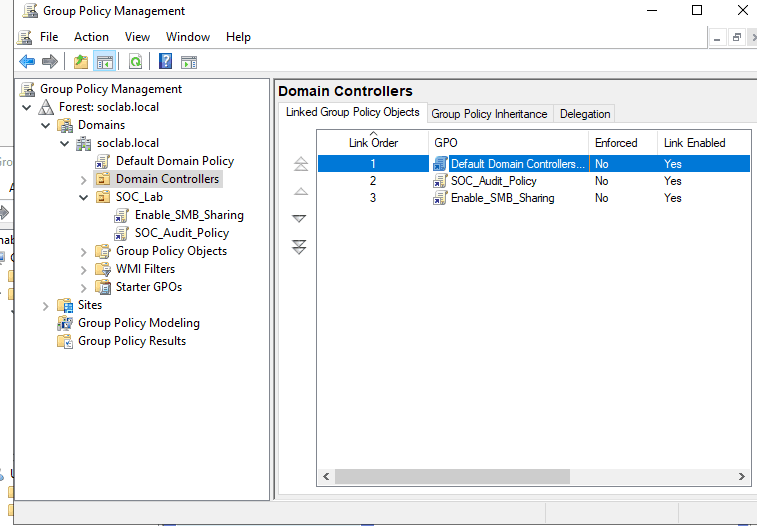


---


**Final Step: Update Policy**


After configuring,  run the following command in a CMD/PowerShell window on both DC01 and WS01 to apply the changes immediately 
`gpupdate /force`


Test the SMB connection between WS01 and DC01


```sql
PS C:\Windows\system32> Test-NetConnection -ComputerName DC01 -Port 445                                                                                                                                                                                                                                                 ComputerName     : DC01
RemoteAddress    : 10.10.10.10
RemotePort       : 445
InterfaceAlias   : Ethernet0
SourceAddress    : 10.10.10.15
TcpTestSucceeded : True
```


## 2. Configuring Sysmon {#3617b0eb61a480ac86efdeb30c1b3232}


System Monitor (Sysmon) is a Windows system service and device driver that, once installed on a system, remains resident across system reboots to monitor and log system activity to the Windows event log. It provides detailed information about process creations, network connections, and changes to file creation time.

- Download the Sysmon tool from the official Microsoft Sysinternals page: `https://learn.microsoft.com/en-us/sysinternals/downloads/sysmon`
- **Configuration:** We will utilize the `sysmon-modular` configuration instead of `SwiftOnSecurity` because it offers native MITRE ATT&CK mapping and customizable scalability: `https://github.com/olafhartong/sysmon-modular`

We will perform a test installation on WS01 first to prevent any potential disruptions on the Domain Controller.


```c++
.\Sysmon64.exe -accepteula -i sysmonconfig.xml

System Monitor v15.20 - System activity monitor
By Mark Russinovich and Thomas Garnier
Copyright (C) 2014-2026 Microsoft Corporation
Using libxml2. libxml2 is Copyright (C) 1998-2012 Daniel Veillard. All Rights Reserved.
Sysinternals - www.sysinternals.com

Loading configuration file with schema version 4.90
Sysmon schema version: 4.91
Configuration file validated.
Sysmon64 installed.
SysmonDrv installed.
Starting SysmonDrv.
SysmonDrv started.
Starting Sysmon64..
Sysmon64 started.
```


### Operation Check {#3417b0eb61a4802cadede995cc61924e}


```c++
PS C:\Users\cuong_nguyen\Desktop\Sysmon> net user

User accounts for \\WS01

-------------------------------------------------------------------------------
Administrator            cuong_nguyen             DefaultAccount
defaultuser0             Guest                    WDAGUtilityAccount
The command completed successfully.
```


```c++
Process Create:
RuleName: technique_id=T1018,technique_name=Remote System Discovery
UtcTime: 2026-04-13 04:39:55.397
ProcessGuid: {dd1c2221-739b-69dc-db02-000000000d00}
ProcessId: 2636
Image: C:\Windows\System32\net.exe
FileVersion: 10.0.19041.1 (WinBuild.160101.0800)
Description: Net Command
Product: Microsoft® Windows® Operating System
Company: Microsoft Corporation
OriginalFileName: net.exe
CommandLine: "C:\Windows\system32\net.exe" user
CurrentDirectory: C:\Users\cuong_nguyen\Desktop\Sysmon\
User: WS01\cuong_nguyen
LogonGuid: {dd1c2221-cca6-69db-a50b-070000000000}
LogonId: 0x70BA5
TerminalSessionId: 1
IntegrityLevel: High
Hashes: SHA1=88B101598CC6726B7A57D02B1FA95BE1B272A821,MD5=0BD94A338EEA5A4E1F2830AE326E6D19,SHA256=9F376759BCBCD705F726460FC4A7E2B07F310F52BAA73CAAAAA124FDDBDF993E,IMPHASH=57F0C47AE2A1A2C06C8B987372AB0B07
ParentProcessGuid: {dd1c2221-7324-69dc-c802-000000000d00}
ParentProcessId: 3888
ParentImage: C:\Program Files\PowerShell\7\pwsh.exe
ParentCommandLine: "C:\Program Files\PowerShell\7\pwsh.exe" -NoExit -RemoveWorkingDirectoryTrailingCharacter -WorkingDirectory "C:\Users\cuong_nguyen\Desktop\Sysmon!" -Command "$host.UI.RawUI.WindowTitle = 'PowerShell 7 (x64)'"
ParentUser: WS01\cuong_nguyen
```


**Repeat this identical installation process on DC01.**


:::tip

_Note: In an enterprise environment, you could create a shared folder, write a deployment script to check endpoint compliance, and utilize GPOs to install Sysmon automatically across all workstations.\_

:::


## 3. Setting Up the SIEM System - 10.10.20.30 {#3617b0eb61a4805faa1ce976b07dbe29}


### 3.1. Creating the SIEM Virtual Machine {#3617b0eb61a480f6bd04d6b9e90ab2bc}


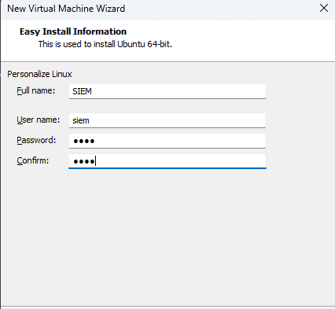


Ensure the Network Adapter is connected to **VMnet3**.


### 3.2. IP Configuration {#3617b0eb61a4804aaf13dc5ac0f3298e}

- Configure the IPv4 settings to match the subnet of the pfSense interface connected to VMnet3.
- Set the DNS servers to point to DC01 (`10.10.10.10`) and Google (`8.8.8.8`).

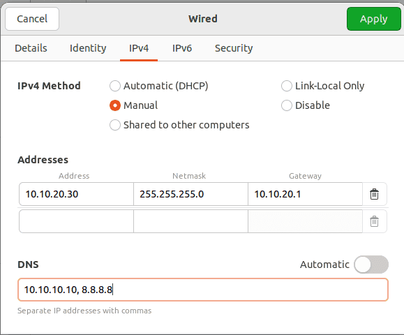


### 3.3. Deploying the Splunk Server (via Docker) {#3617b0eb61a48042bcdfe90e9b7252c8}


Official Documentation: [https://help.splunk.com/en/splunk-enterprise/get-started/install-and-upgrade/10.0/install-splunk-enterprise-in-virtual-and-containerized-environments/deploy-and-run-splunk-enterprise-inside-a-docker-container](https://help.splunk.com/en/splunk-enterprise/get-started/install-and-upgrade/10.0/install-splunk-enterprise-in-virtual-and-containerized-environments/deploy-and-run-splunk-enterprise-inside-a-docker-container)


```c++
sudo apt update
sudo apt install docker.io -y
sudo systemctl enable docker
sudo systemctl start docker
```


**Configuring Persistent Storage for Splunk:**


```c++
mkdir ~/Desktop/splunk_backup
```


_Setup Note:_ We preemptively mount storage to `~/Desktop/splunk_backup`. This ensures that if an installation error occurs and the Docker container needs to be recreated, the Splunk configurations and indexed data remain safely intact on the host.


**Network Port Definitions:**

- **Port 8000:** Web Interface (GUI)
- **Port 9997:** Ingestion port receiving data from Splunk Universal Forwarders (SUFs) on DC01 and WS01
- ~~**Port 515:**~~ ~~Ingestion from Suricata (Deprecated)~~
- **Port 8088:** Ingestion from Suricata (via HTTP Event Collector - HEC)

```c++
sudo docker run -d \
-p 8000:8000 -p 9997:9997 -p 515:515 -p 8088:8088 \
-e SPLUNK_START_ARGS=--accept-license \
-e SPLUNK_GENERAL_TERMS=--accept-sgt-current-at-splunk-com \
-e SPLUNK_PASSWORD=Password1! \
--name splunk_server \
--memory="4g" \
-v ~/Desktop/splunk_backup/var:/opt/splunk/var \
-v ~/Desktop/splunk_backup/etc:/opt/splunk/etc \
--restart unless-stopped \
splunk/splunk:latest
```


```c++
sudo docker start splunk_server
```


## 4. Configuring the Splunk Universal Forwarder on DC01 and WS01 {#3617b0eb61a4806ea57dc376efbb265d}


### 4.1. Installation on DC01 and WS01 {#3617b0eb61a48041a75bfcaded81074c}


Follow the official deployment guide at: [https://help.splunk.com/en/splunk-cloud-platform/forward-and-process-data/universal-forwarder-manual/9.4/install-the-universal-forwarder/install-a-windows-universal-forwarder](https://help.splunk.com/en/splunk-cloud-platform/forward-and-process-data/universal-forwarder-manual/9.4/install-the-universal-forwarder/install-a-windows-universal-forwarder)


Locate and edit the `inputs.conf` file at:
`C:\Program Files\SplunkUniversalForwarder\etc\system\local\inputs.conf`


Configure it to exclusively collect Security, System, Sysmon, and PowerShell logs as previously defined:


```c++
[WinEventLog://Security]
disabled = false
index = windows_security

[WinEventLog://System]
disabled = false
index = windows_syslog

[WinEventLog://Microsoft-Windows-Sysmon/Operational]
disabled = false
index = sysmon
renderXml = 0

[WinEventLog://Microsoft-Windows-PowerShell/Operational]
disabled = false
index = powershell
whitelist = 4103,4104
```


Afterward, restart the Splunk Forwarder service to apply the changes:


```c++
net stop SplunkForwarder
net start SplunkForwarder
```


### 4.2. Configuration on the Splunk Server {#3617b0eb61a4809c838bd5d29e4b3680}

1. Log into the Splunk Web Interface at `http://10.10.20.30:8000`
2. Navigate to **Settings → Forwarding and receiving → Configure receiving**.
3. Add a new listening port: **9997**.


**Create Indexes matching** **`inputs.conf`****:**

1. Navigate to **Settings → Indexes → New Index**.
2. Create indexes identically matching your forwarder config (e.g., `windows_syslog`, `sysmon`, `powershell`, `windows_security`).
3. Repeat this process for all remaining indexes.

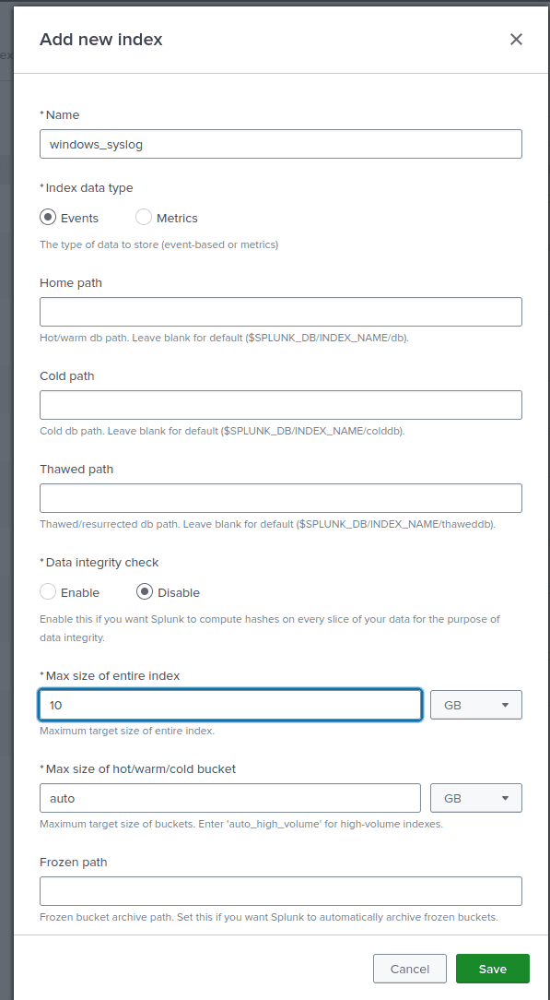


### Results: {#3417b0eb61a48042baf0f8a0ecd7d9d4}


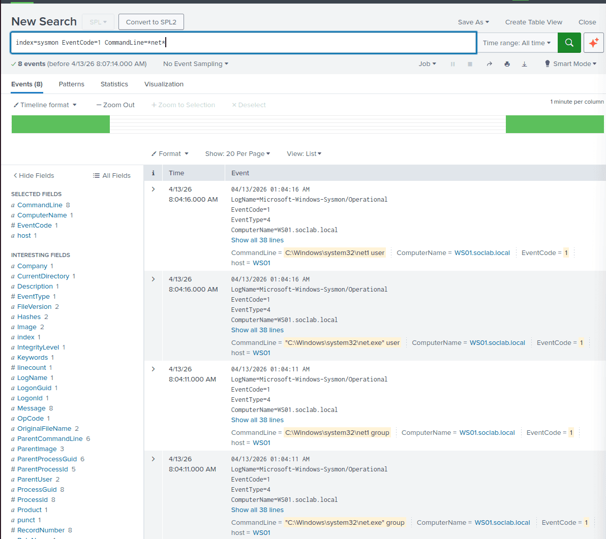


## Time Synchronization Across the SOC Environment {#3617b0eb61a48089955dfa3261ff3eb3}


**On the SIEM (Ubuntu):**


```sql
sudo timedatectl set-timezone Asia/Ho_Chi_Minh
```


_(Perform equivalent timezone configurations natively on DC01 and WS01)._


**Within Splunk Web:**

- Click on your **Administrator** profile name (top right corner) &gt; **User Settings**.
- Under the **Time zone** dropdown, select `(GMT+07:00) Bangkok, Hanoi, Jakarta` instead of Default.

### Configuring the Domain Controller (DC01) as the Primary Time Server {#3617b0eb61a480fb8abefb7cf62a421d}


Now, we will configure DC01 to fetch standard time from reliable external Internet sources (e.g., `pool.ntp.org`), effectively establishing it as the authoritative internal time server for the entire LAN.

1. Log into **DC01** with Administrator privileges.
2. Open PowerShell (Run as Administrator).

```sql
w32tm /config /manualpeerlist:"time.google.com,0x8 time.windows.com,0x8" /syncfromflags:manual /reliable:yes /update
w32tm /resync /force
```


### Forcing the Workstation (WS01) to Synchronize Time with DC01 {#3617b0eb61a4807a90d1cde9549a7406}


Domain-joined workstations are designed to automatically synchronize their time with the Domain Controller. However, due to previous misconfigurations, this sync process may be stalled. We will manually force a resynchronization.

1. Log into **WS01** with Administrator privileges.
2. Open PowerShell (Run as Administrator).
3. Execute the following commands:

```sql
w32tm /config /syncfromflags:domhier /update
```


_(This command forces WS01 to retrieve its time according to the active domain hierarchy—specifically, from DC01)._


PowerShell


```sql
net stop w32time
net start w32time
w32tm /resync
```


If successful, the time on WS01 will immediately align with DC01 precisely to the second.


---


## 5. Introducing a Weak Registry Configuration (For Privilege Escalation Simulation) {#3617b0eb61a480729babed92130b2346}


**Scenario Context:** The corporate IT Administrator creates a background service running as `SYSTEM` to handle automatic software updates. However, they mistakenly grant standard user accounts (Users) permission to modify the service's registry configuration.


On WS01, open an Administrator Command Prompt and create a service named `SOCUpdater` executing with `NT AUTHORITY\SYSTEM` privileges, pointing to the `ping.exe` command (simulating a legitimate software update executable):


DOS


```sql
sc create SOCUpdater binpath= "C:\Windows\System32\ping.exe" start= auto obj= "LocalSystem"
sc failure SOCUpdater reset= 0 actions= restart/1600
```


**1. Assigning Vulnerable Registry Permissions:**

- Press the Windows key, type `regedit`, and open the **Registry Editor** (Run as Administrator).
- Navigate to the following path:
`HKEY_LOCAL_MACHINE\SYSTEM\CurrentControlSet\Services\SOCUpdater`
- Right-click the `SOCUpdater` key in the left pane and select **Permissions...**
- In the resulting dialog, select the **Users** group (`WS01\Users`).
- In the permissions box below, check the **Allow** box next to **Full Control**.
- Click **OK** and close the Registry Editor.


