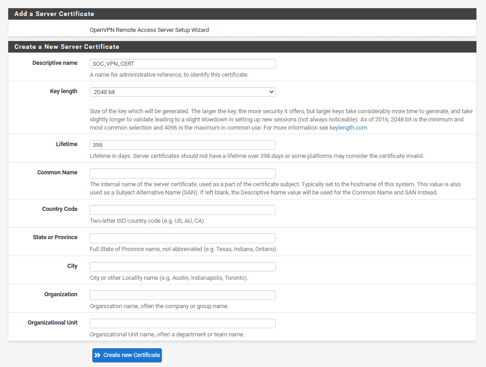
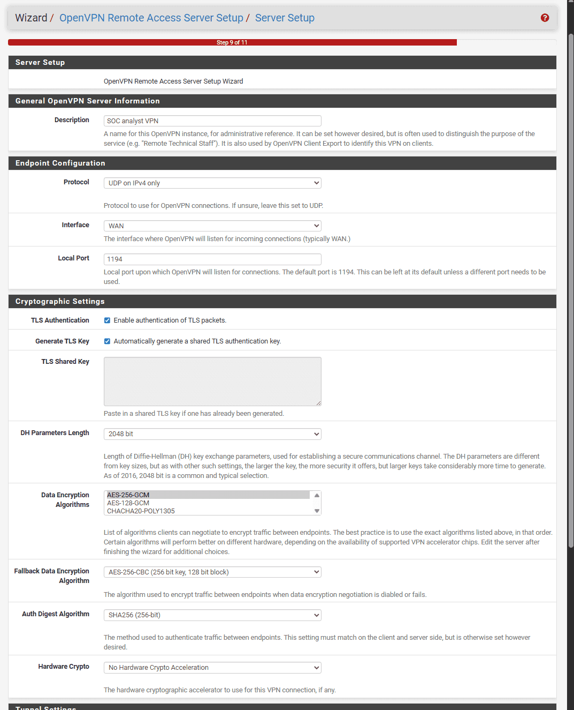
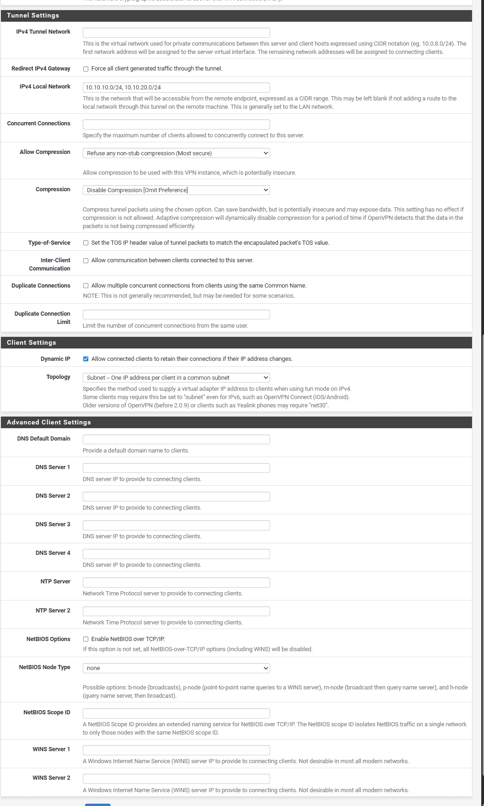
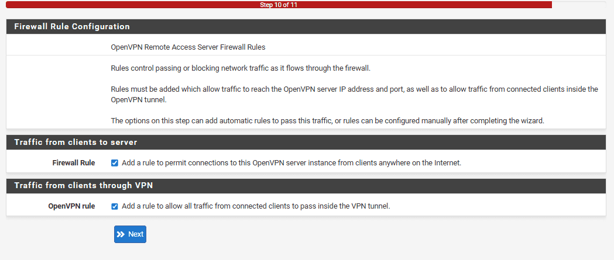
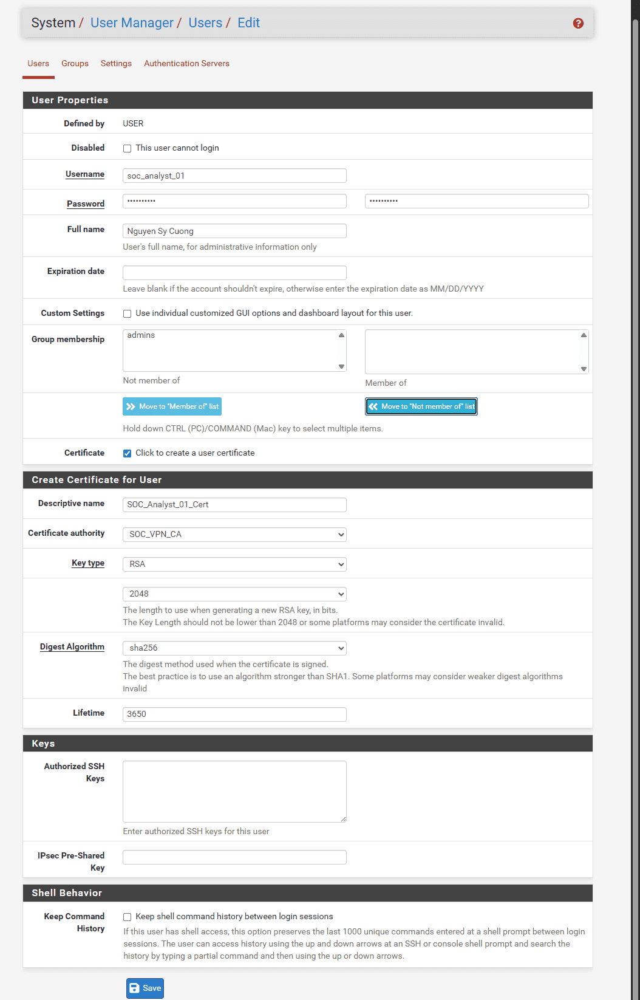
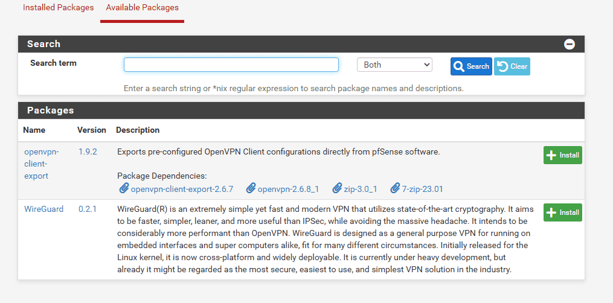
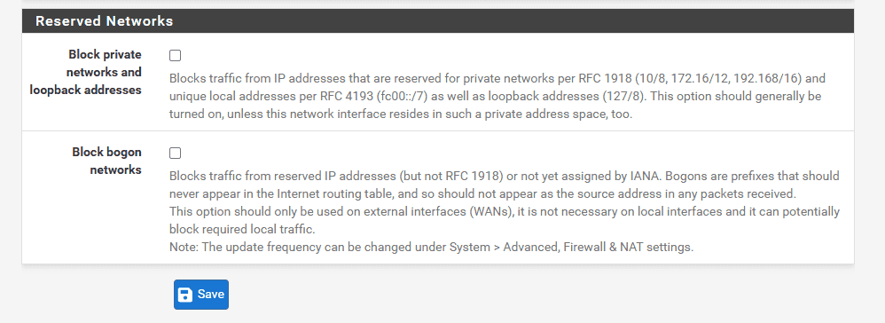
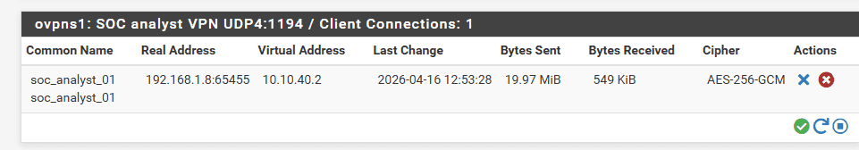

<!-- notion-metadata-start -->
*📅 Published: 2026-04-16 01:56 | 🔄 Last Updated: 2026-05-16 02:04*
<!-- notion-metadata-end -->
---

## Configuring OpenVPN on pfSense {#3617b0eb61a48039b246d1d6c8118657}

### Step 1: Create the OpenVPN Server via the Wizard (on pfSense) {#3617b0eb61a4809d894def1fe7d8acb0}

1. Log into the pfSense WebGUI.
2. From the top menu, navigate to **VPN &gt; OpenVPN &gt; Wizards**.
3. **Type of Server:** Select **Local User Access** (authentication using accounts created on pfSense), then click **Next**.
4. **Certificate Authority (CA):**
	- **Descriptive Name:** Enter `SOC_VPN_CA`, then click **Add new CA**.
	- Randomize Serial: for security purpose
	- Key length (2048 bit): RSA key length
	- Lifetime (3650 days): CA lifetime

		

5. Server Certificate (Chứng chỉ của Server):
	- Descriptive Name: Gõ `SOC_VPN_Cert` -> Bấm _Add new Certificate_.

	

6. Server Setup
	- **Interface:** Select **WAN** (to accept inbound connections from the Internet).
	- **Protocol:** Select **UDP on IPv4** (faster and standard for VPNs).
	- **Local Port:** `1194` (the default OpenVPN port).

	

	- **Tunnel Network:** (The virtual subnet assigned to connected clients). Enter `10.10.30.0/24`.
	- **Local Network:** (The internal LAN subnets you want the VPN to access). Enter `10.10.10.0/24, 10.10.20.0/24`.

	

	- **DNS Default Domain:** Enter `soclab.local`.
	- **DNS Server 1:** Enter the IP address of DC01 (`10.10.10.10`), then click **Next**.
7. **Firewall Rules:** Check both the **Firewall Rule** and **OpenVPN rule** boxes to allow pfSense to automatically open the required ports. Click **Next**, then **Finish**.

Traffic from clients to server: mặc định pfSense chặn kết nối từ Internet vào mạng nội bộ. Tick này để pfsense cho phép cổng 1194 đã thiết lập trước đó cho lưu lượng UDP vào

Traffic from clients through VPN: khi laptop kết nối thành công thì nó sẽ được cấp một IP ảo, đứng trong OpenVPN. Nếu không có rule này thì nó sẽ bị đứng đó và không đi đâu được.

---

### Step 2: Create a User Account for the SOC Analyst {#3617b0eb61a4806bab26d66416594afa}

1. Navigate to **System &gt; User Manager**.
2. Click the **+ Add** button to create a new user.
3. **Username:** `soc_analyst`
4. **Password:** Set a secure password (e.g., `P@ssw0rd123`).
5. Check the box for **Click to create a user certificate**.
	- **Descriptive Name:** Enter `Analyst_Cert`.
	- **Certificate Authority:** Select the `SOC_VPN_CA` created in Step 1.
	- **Key length:** `2048`.
6. Click **Save**.

---

### Step 3: Export the VPN Client Configuration (Client Export) {#3617b0eb61a4805f8bf8e5289dd7072b}

1. Navigate to **System &gt; Package Manager &gt; Available Packages**.
2. Search for and install the package named `openvpn-client-export`.

	

3. Once installed, navigate to **VPN &gt; OpenVPN &gt; Client Export**.
4. Scroll down to the **OpenVPN Clients** section. You will see the `soc_analyst` user you just created.
5. Under **Inline Configurations**, select **Most Clients** (to download the `.ovpn` configuration file to your local machine).

---

### **Step 4: Download the Configuration File and Connect (On the SOC Laptop)** {#3617b0eb61a4804db631e1e8f9521c4f}

**Within the pfSense WebGUI:**

1. Navigate to **VPN** &gt; **OpenVPN**, then select the **Client Export** tab.
2. Scroll to the bottom of the page to locate the user list and find the entry for `soc_analyst_01`.
3. In the right-hand column, click the **Inline Configurations: OpenVPN Connect (iOS/Android/Windows/Mac)** button. This will initiate the download of an `.ovpn` file to your local machine.
	- _Alternative:_ You may also select **Inline Configuration: Most Clients**.

> **Important Note for Local Testing:**  
> If you are testing this VPN connection within a local network environment, you must log into the pfSense WebGUI, navigate to **Interfaces** &gt; **WAN**, and uncheck the option that blocks private networks and loopback addresses. By default, pfSense blocks traffic from private IP ranges (such as `192.168.x.x`), which will prevent your local test connection from succeeding.

### **Step 5: Configure Port Forwarding in VMware (Host PC)** {#3617b0eb61a4800d9135d9e21ec80f62}

1. Open the **Virtual Network Editor** (run as Administrator).
2. Select the **VMnet8 (NAT)** network, then click the **NAT Settings...** button.
3. In the Port Forwarding section, click **Add...**:
	- **Host port:** `1194`
	- **Type:** `UDP`
	- **Virtual machine IP address:** `192.168.253.130` (the WAN IP currently assigned to the pfSense instance).
	- **Virtual machine port:** `1194`
4. Click **OK** and then **Apply** to save the configuration.

### **Step 6: Configure a Windows Firewall Rule for UDP Port 1194** {#3617b0eb61a48067bfc1d548b9b7731b}

1. On the host PC, press the Windows key, search for **Windows Defender Firewall with Advanced Security**, and open the application.
2. Select **Inbound Rules** from the left pane, then click **New Rule...** in the right pane.
3. Select **Port** as the rule type and click **Next**.
4. Select **UDP**, enter `1194` in the specific local ports field, and click **Next**.
5. Select **Allow the connection**, click **Next**, ensure all three network profiles (**Domain, Private, and Public**) are checked, and click **Next**.
6. Name the rule `OpenVPN_Inbound` and click **Finish**.

### **Step 7: Establish the Connection** {#3617b0eb61a480f39a9dc8fea826d5d2}

Download and install **Tunnelblick**, import the `.ovpn` profile that was downloaded in Step 4, and initiate the connection to verify the setup:

:::tip

**Note:** This specific OpenVPN configuration is designed for a local network lab environment, meaning the SOC Analyst's laptop and the host PC reside on the same subnet (e.g., `192.168.1.x`). The host PC forwards the OpenVPN connection (UDP/1194) from the laptop to the pfSense virtual machine via port forwarding. The OpenVPN service on pfSense then handles the authentication and bridges the connection to the internal LAN/SIEM network.
In a real-world scenario, however, a SOC Analyst connects remotely from an entirely different external network.

The fundamental process flows as follows:

- **Initialization:** The analyst launches the OpenVPN client. The configuration file points to the organization's public IP address (the single point of contact exposed to the Internet).

- **Arrival at the Edge Router:** The UDP/1194 connection request arrives at the WAN port of the company's edge router or modem.

- **Port Forwarding:** The company router is configured with a pre-defined NAT rule: "Forward any incoming traffic on UDP port 1194 directly to the internal IP address of the pfSense firewall situated behind it."
_(Note: This conceptually mirrors the port forwarding step configured earlier in VMware)._

- **Authentication:** pfSense receives the forwarded packet and verifies the provided Client Certificate and User Credentials. Upon successful validation, pfSense establishes the secure VPN tunnel.

- **IP Assignment & Access:** pfSense assigns an internal virtual IP address (e.g., `10.10.40.2`) to the laptop. At this stage, the laptop functions as if it were physically plugged directly into the company's internal network switch.

:::

## The VPN Connection Process (The Core of TLS) {#3617b0eb61a48071a110d2835eb8fff1}

a. **Negotiation:** Both endpoints (the server and the laptop) exchange initial parameters, negotiating the TLS version, selecting a cipher suite, and exchanging randomly generated values.

b. **Server Certificate Exchange:** The server sends its certificate to the analyst's machine. This certificate contains the server's identity information and its Public Key. Crucially, this certificate is digitally signed by a trusted Certificate Authority (CA).

c. **Client Certificate Exchange:** The analyst's machine also possesses a configured certificate (signed by the same CA) and presents it to the server for mutual authentication.

d. **Verification:** Both parties verify each other's certificates by checking the digital signature using the CA's public key. If the signatures are valid and trusted, the handshake proceeds.

e. **Session Key Generation:** Using a key exchange mechanism (combining public and private parameters), both sides independently derive an identical symmetric session key. This shared session key is then used with a fast symmetric algorithm (like AES-256-GCM) to encrypt the actual data tunnel for the duration of the session.

---

## The Role of the CA in Preventing Man-in-the-Middle (MITM) Attacks {#3617b0eb61a480cab098d59b439d1bdd}

- **Without a CA:** When the analyst sends their certificate to the server, an attacker positioned in the middle could intercept it, substitute their own public key, and forward it to the server. The server, unknowingly, would encrypt data using the attacker's key. The attacker intercepts it, decrypts it, reads the traffic, re-encrypts it with the analyst's actual key, and forwards it. Neither endpoint realizes the connection is compromised.
- **With a CA:** The CA acts as the strict "Root of Trust." Both endpoint certificates are cryptographically signed by the CA. To verify identity, each side checks the signature using the CA's known public key. If an attacker intercepts and substitutes their own key, they cannot forge the CA's signature. The verification fails immediately, and the connection is dropped.

---

## The 4 Core Components of the SOC Analyst's VPN Configuration File (.ovpn) {#3617b0eb61a48065a6f7fec38f6fe4aa}

- `<ca>` **(CA Certificate):** Contains the Public Key of the Certificate Authority. The laptop uses this to verify the digital signature on the Server's Certificate, proving the server is authentic and trusted.
- `<cert>` **(Client Certificate):** Contains the SOC Analyst's Public Key, coupled with the CA's digital signature verifying your identity. The client presents this to the Server to prove who they are.
- `<key>` **(Client Private Key):** Contains the SOC Analyst's highly sensitive Private Key. This is used for cryptographic proof of identity and securely exchanging the session keys.
- `<tls-auth>` **(2048-bit OpenVPN static key):** An HMAC pre-shared key (PSK) used to verify data integrity (ensuring it hasn't been tampered with). It forces unauthorized packets to be dropped before TLS processing even begins, acting as a robust defense against port scanning and DoS attacks.
