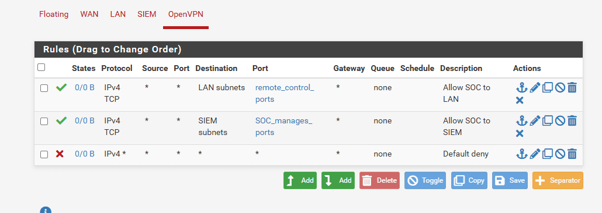
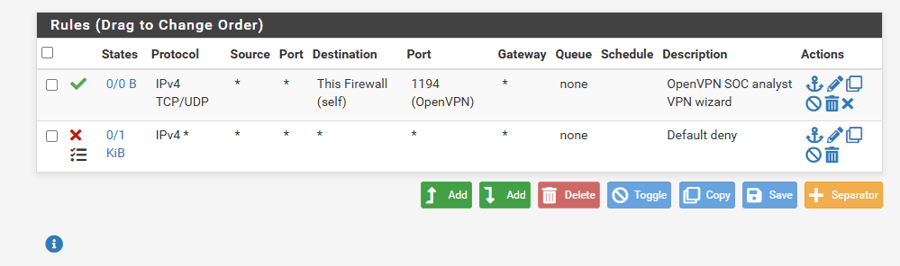

<!-- notion-metadata-start -->
*📅 Published: 2026-05-04 13:37 | 🔄 Last Updated: 2026-05-30 12:28*
<!-- notion-metadata-end -->
---

During the initial setup of a SOC environment, firewall rules are temporarily set to a default "allow all" policy to ensure basic network connectivity. However, to align with industry standards and real-world deployment practices, a "default deny" policy must ultimately be implemented, permitting only essential traffic to traverse the network.

:::tip

**Ingress filtering principle:** A rule applied to a specific interface only inspects incoming packets on that port to prevent overlapping configurations. For example, a rule on the LAN interface should exclusively govern traffic originating from LAN subnets.
Because pfSense operates as a **stateful firewall**, it actively tracks connection states. Therefore, a single outbound rule is sufficient to automatically allow the corresponding inbound return traffic, even without an explicit inbound rule on the internal interface. This eliminates the need to configure redundant rules (one for outbound and one for inbound across different interfaces), as would be necessary with a stateless firewall.

:::

## LAN {#3567b0eb61a480d8833ed2275d5d7fbd}

web_dns_time_ports comprises of 123, 53, 80, 443

## SIEM {#3567b0eb61a480fe97cae4e3d85678cd}

## OpenVPN {#3567b0eb61a4802ba959dbf54d592b37}

- remote_control_ports: 3389 (RDP), 5985, 5986 (WinRM)
- SOC_manages_ports: 22 (ssh), 8000 (splunk)

## WAN {#3567b0eb61a480498047d11e104e4c45}

:::tip

In enterprise network, the DC01 is placed in isolated VLAN. In that scenario, we need to enable these ports:
- Port 88 (TCP/UDP) - Kerberos: authentication service - when WS01’s user enters credential and access the domain, the machine obtains a TGT.

- Port 389 and 636 (TCP/UDP) - LDAP (Lightweight Directory Access Protocol): Endpoints and services use LDAP to query the DC for information (SIEM log enrichment)

- Port 445 (TCP) - SMB (Server Message Block):  used to access the `SYSVOL` and `Netlogon` shares on the DC, which is how endpoints download and apply Group Policy Objects (GPOs) and logon scripts.

:::

