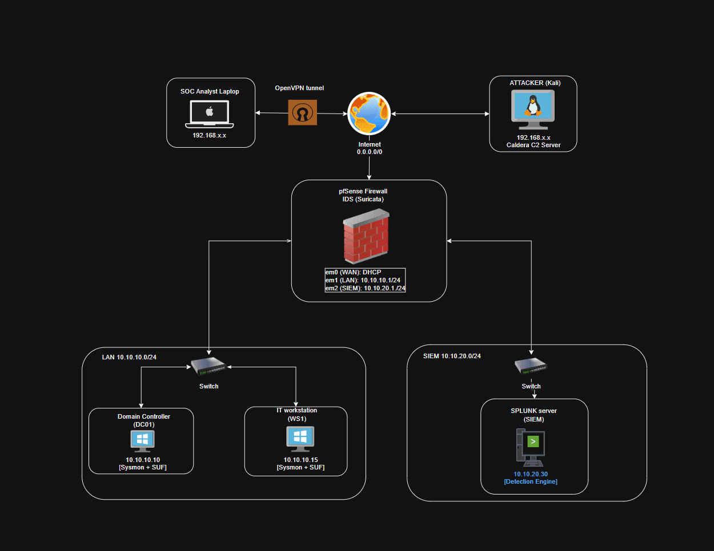
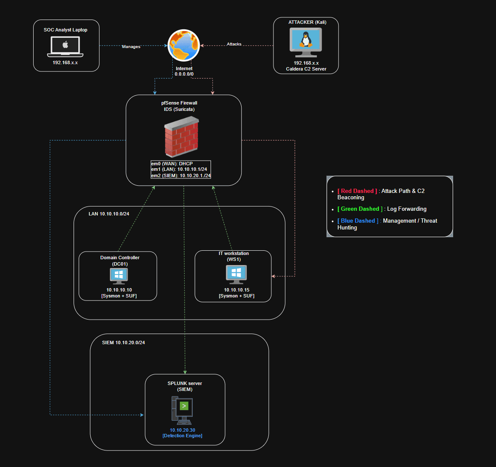

---

## Physical Infrastructure & Network Topology {#3677b0eb61a4802f86aef08b7a6c354c}

**Gateway**: The edge of the network is managed by a pfSense firewall, which is responsible for network segmentation and acts as the primary DHCP server. To provide network-level visibility, Suricata is integrated into the firewall to function as an Intrusion Detection System (IDS).

**LAN Segment (10.10.10.0/24)**: Simulates a standard enterprise operational environment.

- **DC01 (10.10.10.10)**: Windows Server acting as Active Directory Domain Controller and centralized file server.
- **WS01 (10.10.10.15)**: Windows 10 IT Workstation representing a standard corporate endpoint.
- **Instrumentation**: Both systems are instrumented with Sysmon and Splunk Universal Forwarders (SUF).

**Security Operations (SIEM) Zone (10.10.20.0/24)**: This zone hosts the containerized Splunk Server at 10.10.20.30, which acts as the detection engine for the environment.

**Internet (0.0.0.0/0)**:

- **Attacker**: Kali Linux machine acting as adversarial infrastructure, utilizing Caldera (Mythic C2) to launch external payloads.
- **Defense**: Defensive operations are facilitated through a SOC Analyst Laptop, which securely bridges into the environment via an OpenVPN management tunnel.

### 2. Logical Architecture & Data Flows {#3677b0eb61a48045bd20cd311954b5e1}

- **Adversary Simulation & C2 Beaconing (Red Dashed Path)**: Represents the active exploitation and Command and Control (C2) communication. Traffic originates from the external Kali Linux attacker machine, passes through the pfSense firewall, and establishes a connection with the target IT Workstation (WS01).
- **Telemetry & Log Ingestion (Green Dashed Path)**: Represents the security monitoring pipeline. The Splunk Universal Forwarders (SUF) deployed on the Domain Controller (DC01) and the endpoint (WS01) actively harvest system logs, Active Directory events, and Sysmon telemetry and forward to Splunk server in the SIEM segment.
- **SOC Management & Threat Hunting (Blue Dashed Path)**: Dictates the defensive operational workflow. The SOC Analyst utilizes the established OpenVPN connection to securely access the internal infrastructure. From this vantage point, the analyst queries the Splunk Detection Engine to investigate anomalies, build correlation rules, and actively hunt for the threat behaviors generated by the external C2 server.
