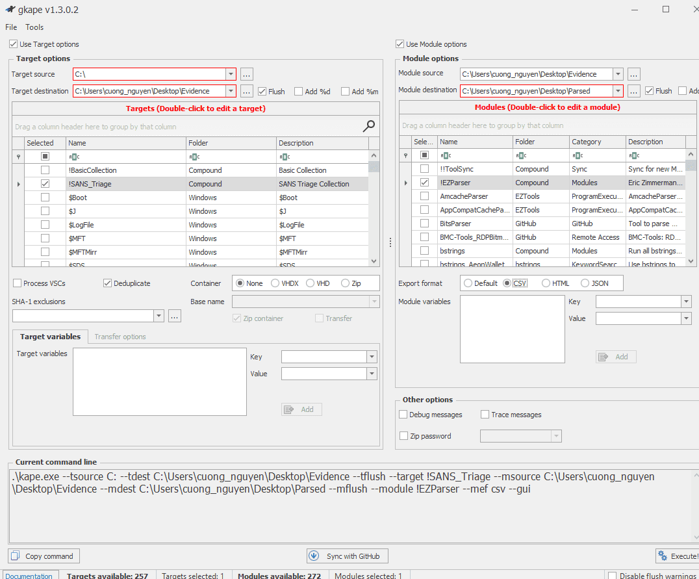
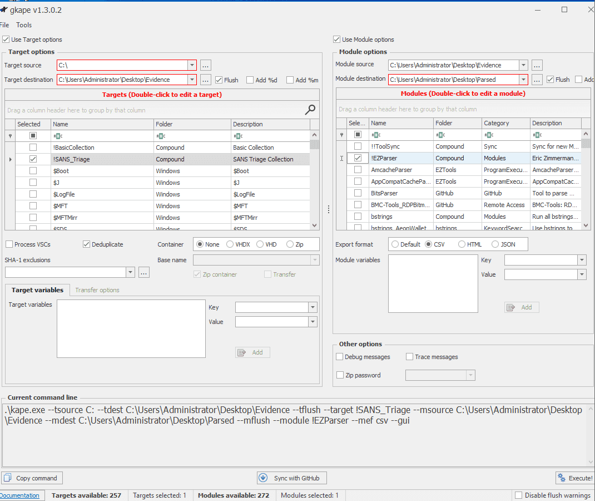
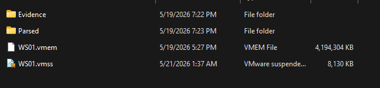
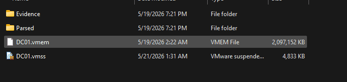

<!-- notion-metadata-start -->
*📅 Published: 2026-05-19 16:58 | 🔄 Last Updated: 2026-05-22 12:33*
<!-- notion-metadata-end -->
---

## Memory collection {#3657b0eb61a48033b492fb2b76025a27}

Because the lab is built based on VMware infrastructure, to collect memory from lab’s hosts, it’s easier to just copy the .vmem and .vmss from the host folders.

In real-world scenarios, it’s preferable to use professional data acquisition tools such as: DumpIt, or Belkasoft RAM Capturer,…

## Disk collection {#3657b0eb61a480ae8f1ffca89dc69d6a}

For simplicity and because i won’t use autopsy to reconstruct files, so i would use KAPE on WS01 and for disk acquisition.

:::tip

The best practice is to use a USB with portable KAPE installed, and load the extracted evidence to the USB itself

:::

The same process is applied for DC01

All the evidence are collected!  Let’s head to the core part of the project

