---


:::tip

Since we’ve already discovered the whole threat actor’s attack chain, memory and disk forensics are executed to further prove attacker’s malicious actions.

:::


## **Memory Forensics (RAM)** {#3677b0eb61a480f1b56fd1c3b1702aa5}


### WS01 {#3677b0eb61a480b790e6eae12b8770b2}


Use the basic triage info, pslist, pstree, netscan


```sql
vol3 -f WS01.vmem windows.info                                  

Volatility 3 Framework 2.28.0
Progress:  100.00               PDB scanning finished                        
Variable        Value

Kernel Base     0xf80608800000
DTB     0x1ae000
Symbols file:///opt/volatility3/volatility3/symbols/windows/ntkrnlmp.pdb/14543CB2975093F0248AADB430FA1E09-1.json.xz
Is64Bit True
IsPAE   False
layer_name      0 WindowsIntel32e
memory_layer    1 VmwareLayer
base_layer      2 FileLayer
meta_layer      2 FileLayer
KdVersionBlock  0xf8060940f3f0
Major/Minor     15.19041
MachineType     34404
KeNumberProcessors      4
SystemTime      2026-05-19 12:41:07+00:00
NtSystemRoot    C:\Windows
NtProductType   NtProductWinNt
NtMajorVersion  10
NtMinorVersion  0
PE MajorOperatingSystemVersion  10
PE MinorOperatingSystemVersion  0
PE Machine      34404
PE TimeDateStamp        Thu Oct 28 06:23:21 2066

```


We can deduce some useful information about the system: 

- SystemTime      2026-05-19 12:41:07+00:00: the evidence is collected at  `19:41:09`
- The system is running:  Win 10 - 64 bit
- Major/Minor: 15.19041: OS minor version paired with Windows 10 build 19041 (Version 2004)

Inspecting the result from `pslist` plugin reveals that 2 malicious windupdate.exe

- pid: 12012 was spawned at `18:31:03.000000 UTC +7:00`
- pid: 8068 was spawned at `18:35:26.000000 UTC +7:00` - the privileged process

which matches the findings in Splunk SQL.


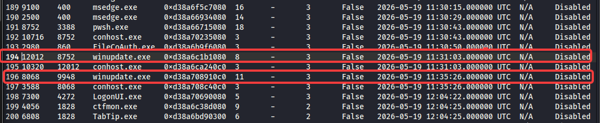


---


`Pstree` can signify the anomly in process genealogy and the command line that the process executed


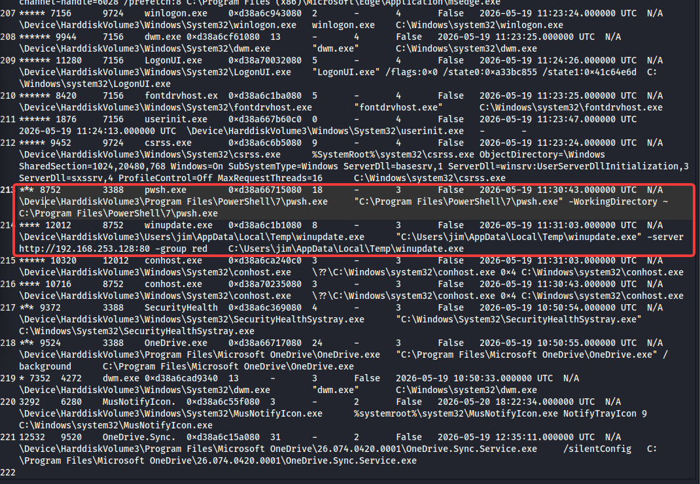


As expected pwsh.exe spawned `winupdate.exe`, which in turn create beaconing connection to `http://192.168.253.128:80` 


---


netscan plugin also indicates the same result:


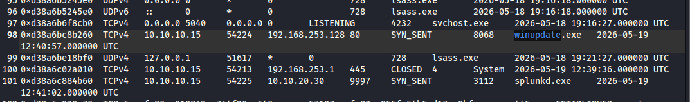


A quick check with winupdate.exe’s mutant, which manages windows object’s access to shared resource.

- Malware frequently creates named mutants to ensure only one instance of malicious code runs on a infected machine to prevent system crashing from duplicated infection.
- So genrally mutant can be considered as malware signature

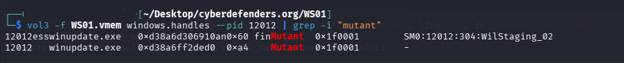


I did a google search and found out at [https://github.com/albertzsigovits/malware-mutex/tree/main](https://github.com/albertzsigovits/malware-mutex/tree/main)


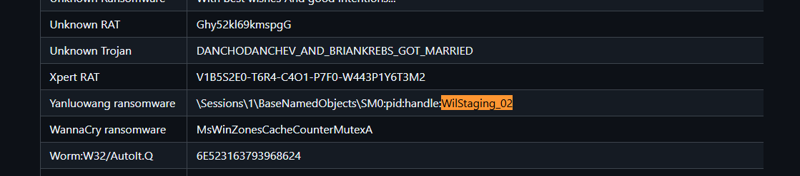


It’s quite interesting because in this lab, i use caldera agent to infect the system


---


Dump the process file and caculate the hash:


```sql
vol3 -f DC01.vmem -o dump12012  windows.dumpfiles --pid 12012
```


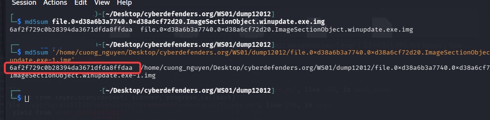


> `6af2f729c0b28394da3671dfda8ffdaa` winupdate.exe. The hash is different from what we’ve found on Splunk, because while the file on disk remains a static sequence of bytes, the version in RAM undergoes several structural modifications by the Windows loader that permanently alter its cryptographic hash. 


---


I tried to dump the winupdate.exe’s memory and used strings to extract hard code information


```sql

strings -a pid.12012.dmp > 12012strings_dump.txt
strings -a -el  pid.12012.dmp >> 12012strings_dump.txt
```


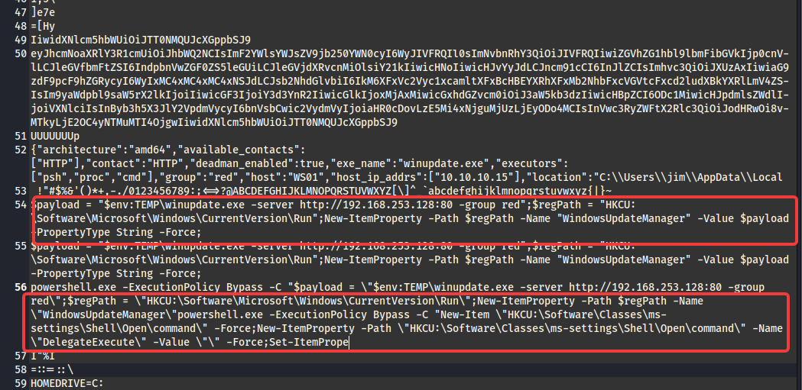


---


Now we take a look at dllist, ldrmodules


No sign of DKOM


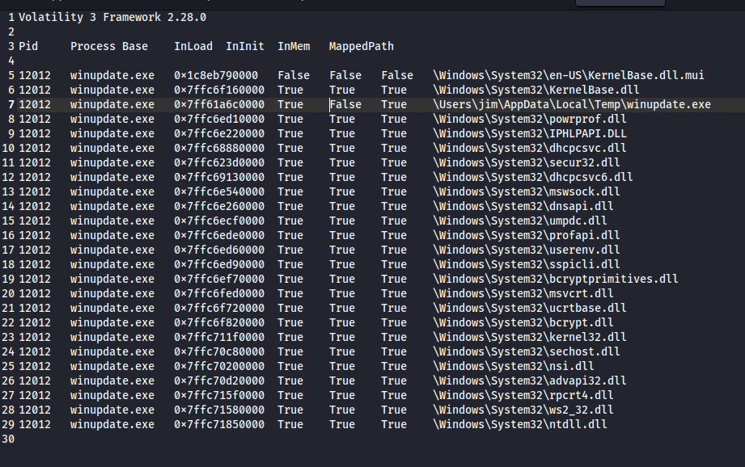


Or neither sign of DLL injection/sideloading


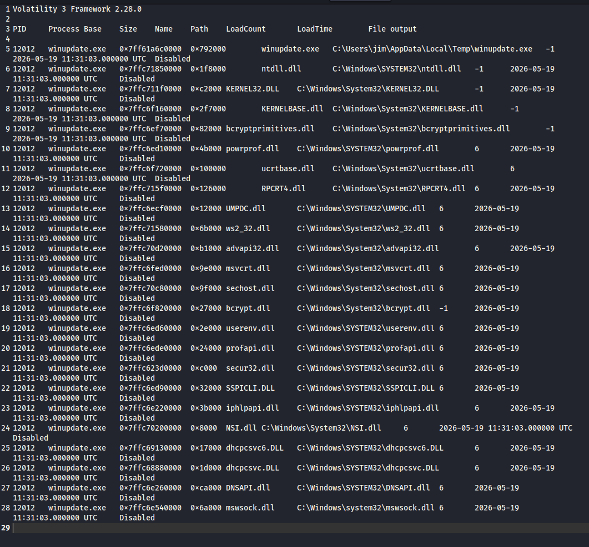


### DC01 {#3677b0eb61a480b09478ebf8787b87cb}


The winupdate.exe on DC01 is basically the same Sandcat agent with one deployed on WS01, so we won’t waste time replicating the process above.


## **Disk Forensics** {#3677b0eb61a480c68159e762b7c016b8}


### 1. Validating Ransom encryption and Timestomping (The `$MFT`) {#3677b0eb61a480479af0e98ad7a57f9c}


At `19:00:13`, the attacker used PowerShell to timestomp the `.ransom` files, changing their timestamps to `01/01/2010`.


On DC01, reviewing the ransomed pdf files reveals the timestomping malicious action


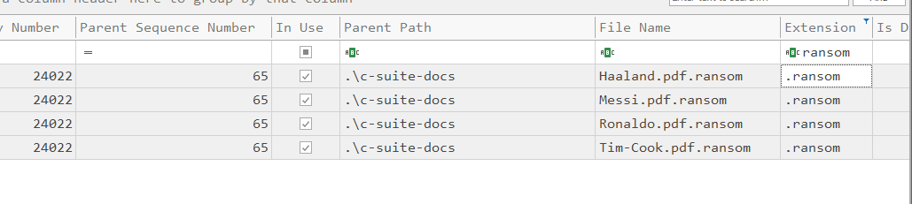


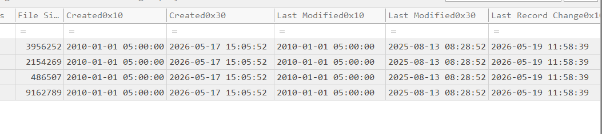


The creation, modified and acccessed time has been modified back to `2010-01-01 05:00:00` to hinder the investigator.


In the Windows NTFS file system, `$STANDARD_INFORMATION (0x10)` and `$FILE_NAME (0x30)` are two separate metadata attributes within the Master File Table (MFT) that track file properties. The main difference lies in modification accessibility; `$STANDARD_INFORMATION` can be easily changed by user-level APIs (which makes it vulnerable to tampering), while `$FILE_NAME` can only be updated by the operating system kernel.


⇒ the `$FILE_NAME (0x30)`  timestamp is the original timestamp of these pdf files, which dated in 2026 not 2010


UsnJrnl entries also indicate the pdf files was appended `ransom` extension.


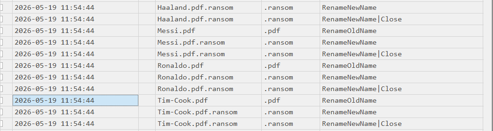


### **2. Tracing the UAC Bypass & Persistence (Registry Hives)** {#3677b0eb61a48000bbf1f733df6951b8}

- **Run Keys:** Parse `NTUSER.DAT` for the user `jim` on WS01. Navigate to `Software\Microsoft\Windows\CurrentVersion\Run` to confirm the presence of the `WindowsUpdateManager` key created at `18:33:32`.

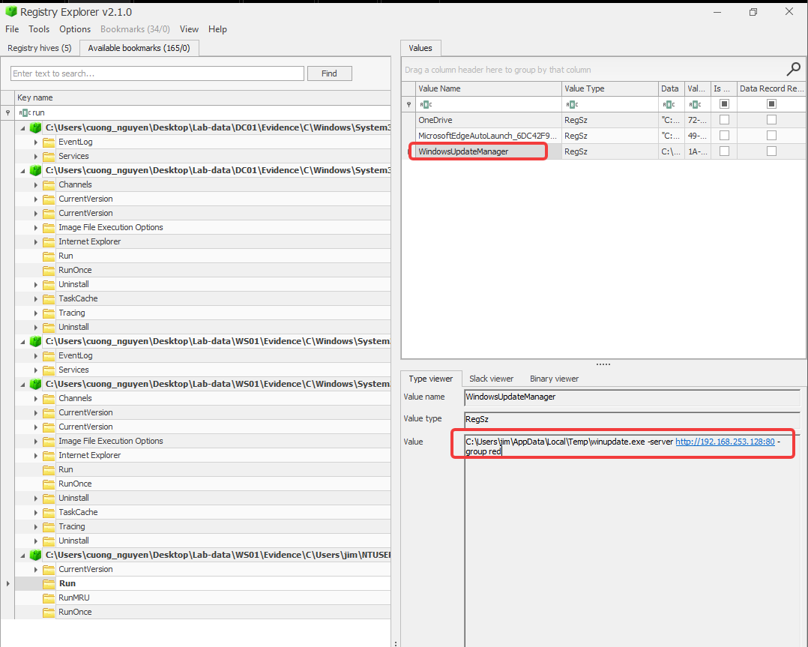

- **Fodhelper Bypass:** The attacker created and then deleted the `ms-settings` key for the UAC bypass. By navigating to jim’s `UsrClass.dat` and open with registry explorer, i also retrieved the delete `DelegateExecute` key attacker user for privilege Escalation

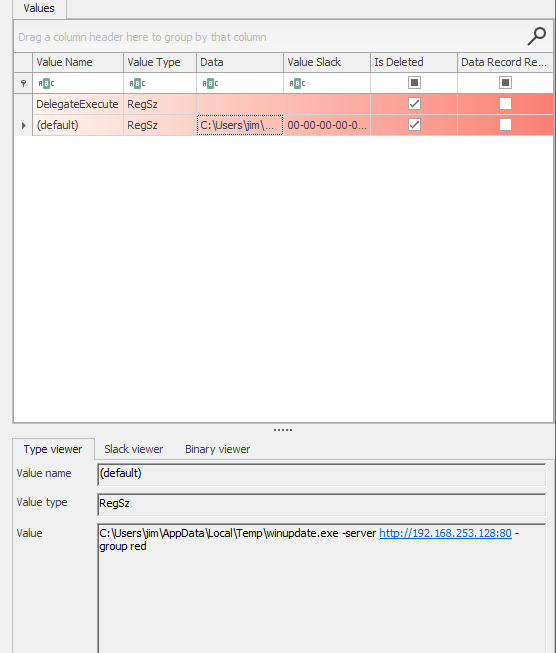


### **3. Uncovering WMI Persistence (OBJECTS.DATA)** {#3677b0eb61a4804e8fd5d625b2052c06}


At `18:44:41` on DC01, the attacker established WMI persistence. Sysmon caught the event, but you can also prove it natively on disk.

- The WMI repository located at `C:\Windows\System32\wbem\Repository\OBJECTS.DATA`.
- I used custom [https://github.com/AndrewRathbun/WMI-Parser](https://github.com/AndrewRathbun/WMI-Parser) to parse the WMI dababase resulting in:

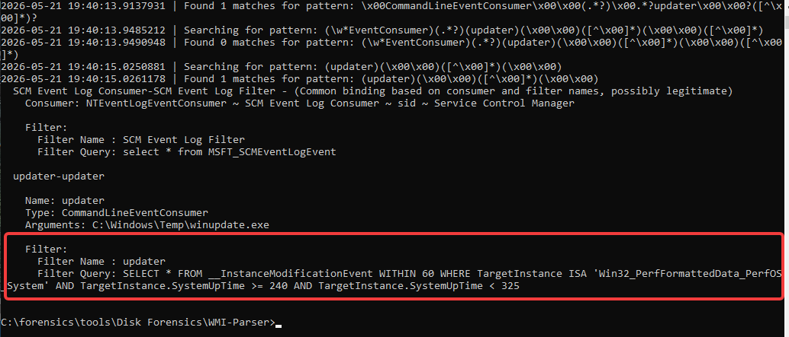


### **4. Evidence of Execution (Amcache & Prefetch)**. {#3677b0eb61a48083b97bc4abe1bf20a1}


On DC01, using Amcache we can prove that winupdate.exe exist on the host at `C:\Windows\temp`


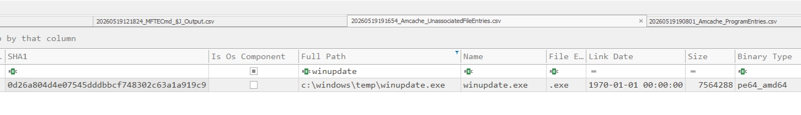


Checking the prefetch on WS01 confirms that `winupdate.exe`, `PsExec64.exe`, `curl.exe`  and other executables involved in attacker intrusion.


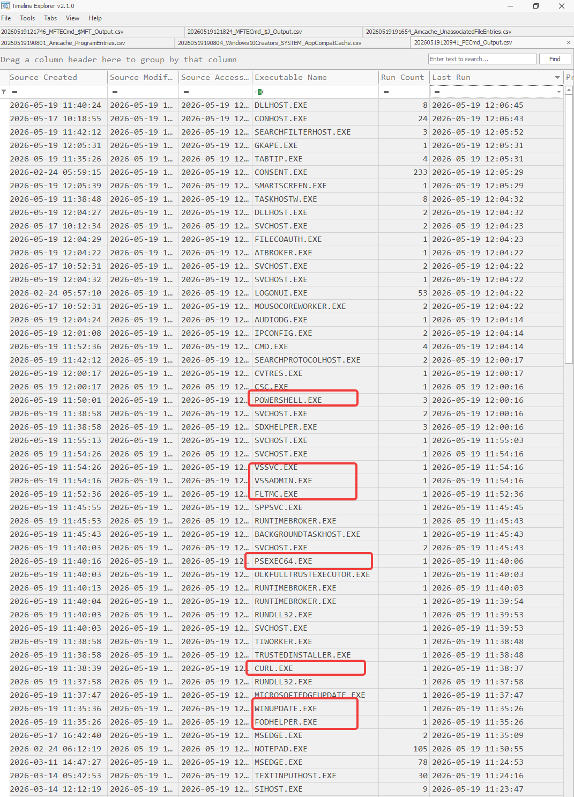

