# 1. Thiết lập LAN, máy ảo {#3567b0eb61a4801da020d754d15b9181}


## 1.1. Thiết lập **VMnet2 (LAN)** và **VMnet3 (SIEM)** trong VMware Virtual Network Editor {#3567b0eb61a4809cb7cfc9a6af67ab75}


Tạo 2 segment mạng LAN và SIEM. VMnet2, VMnet3 đóng vai trò là switch ảo


Trên thanh menu trên cùng, chọn **Edit** -&gt; **Virtual Network Editor...**


Click nút **Add Network...** -&gt; Chọn **VMnet2** -&gt; OK.


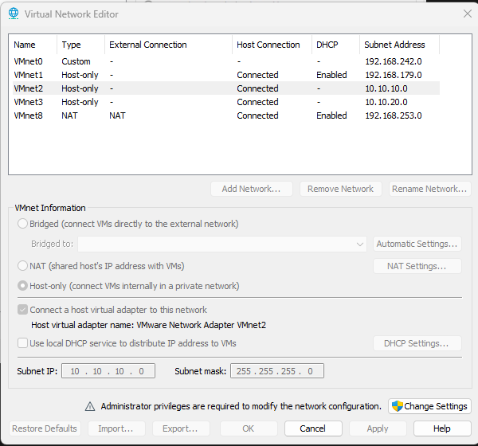


Tương tự với VMnet3


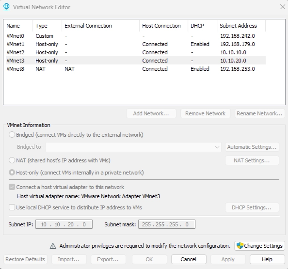


## 1.2. Thiết lập pfSense {#3567b0eb61a480e7a3eafb206e572cc0}


Truy cập https://repo.ialab.dsu.edu/pfsense/ để tải pfSense 2.7.1 .Vì từ 2.8 phải sử dụng netgate installer


Bung file nén và thiết lập như một máy ảo trên windows 


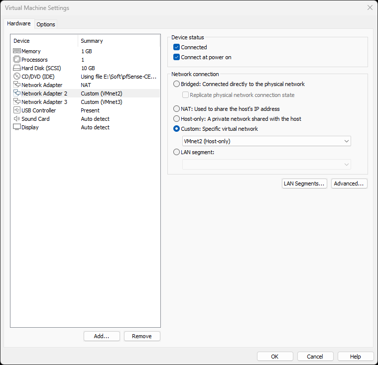


Lưu ý thiết lập 1 network adapter kết nối ra internet và 2 adapter kết nối tới 2 LAN VMnet2 và VMnet3 mà chúng ta đã tạo ở trên


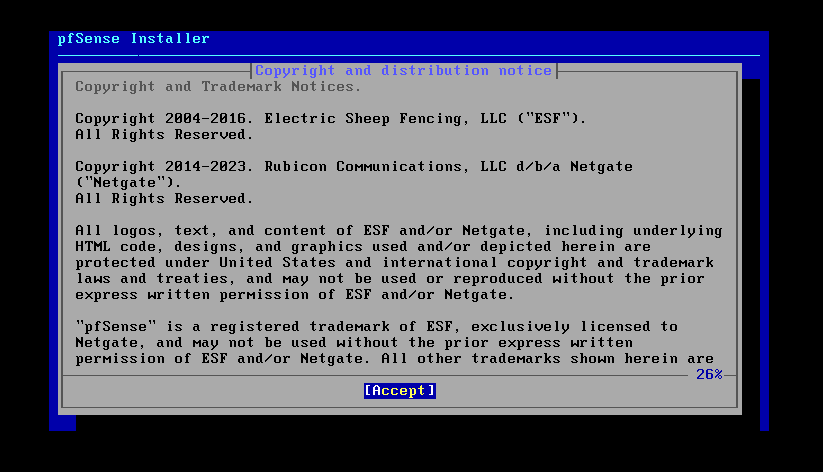


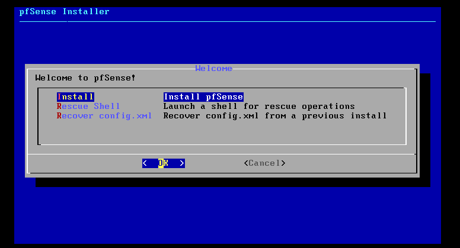


Chọn MBR cho tương thích với firmware BIOS


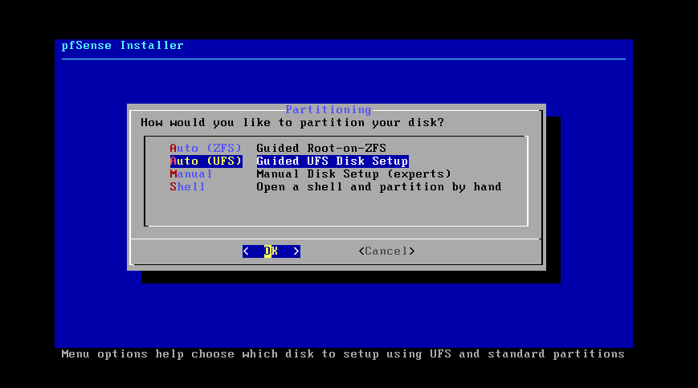


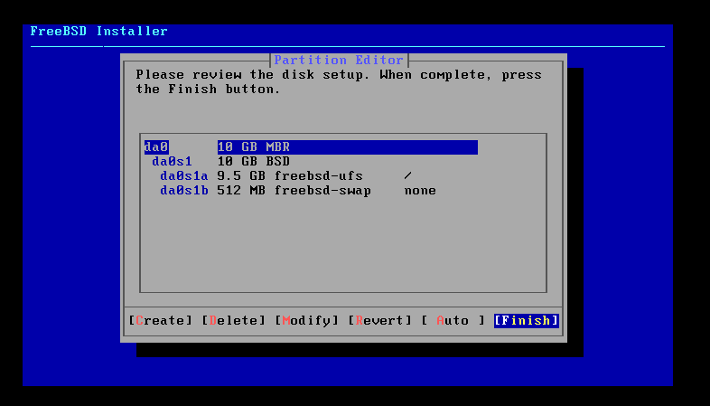


### Configure interfaces {#3567b0eb61a480c08147d08b219efcc1}


Sau khi boot lên thì xuất hiện bảng 16 options như hình:


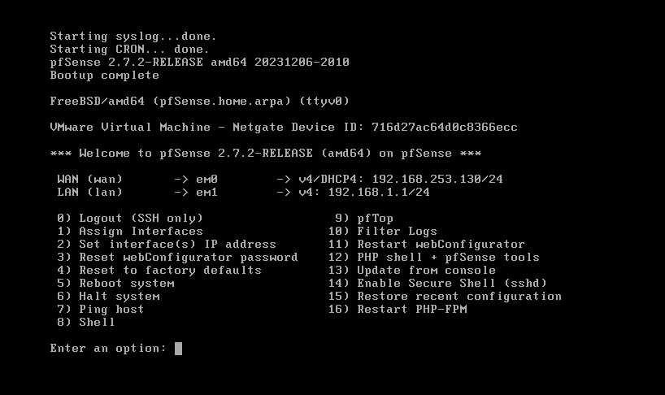

- Gõ phím 1 (Assign Interfaces) -&gt; Nhấn Enter.
- Nó hỏi `Should VLANs be set up now?` -&gt; Gõ n -&gt; Enter.
- `Enter the WAN interface name...` -&gt; Gõ em0 -&gt; Enter.
- `Enter the LAN interface name...` -&gt; Gõ em1 -&gt; Enter.
- `Enter the Optional 1 interface name...` -&gt; Gõ em2 -&gt; Enter. (Đây chính là SIEM Zone).
- `Do you want to proceed?` -&gt; Gõ y -&gt; Enter.

### Đặt lại IP cho LAN và SIEM {#3567b0eb61a4803b8689c3a109d75e11}


LAN

- Gõ phím 2 (Set interface(s) IP address) -&gt; Enter.
- Chọn số 2 (LAN) -&gt; Enter.
- `Configure IPv4 address LAN interface via DHCP?` -&gt; Gõ n
- `Enter the new LAN IPv4 address` -&gt; Gõ `10.10.10.1`  đây là IP của interface em1 này
- `Subnet bit count` -&gt; Gõ `24` -&gt; Enter.
- (Ấn Enter bỏ qua Gateway và IPv6).
- `Do you want to enable the DHCP server on LAN?` -&gt; Gõ `y` -&gt; Enter. (Đây là để pfSense cấp IP cho máy Windows của bạn).
- `Start address` -&gt; Gõ `10.10.10.100` -&gt; Enter.
- `End address` -&gt; Gõ `10.10.10.200` -&gt; Enter.
- `Do you want to revert to HTTP...?` -&gt; Gõ `n` -&gt; Enter.

Quay lại máy chính chạy lệnh ipconfig


```c++
Ethernet adapter VMware Network Adapter VMnet2:

   Connection-specific DNS Suffix  . :
   Link-local IPv6 Address . . . . . : fe80::955f:54b5:d17a:9bfe%52
   IPv4 Address. . . . . . . . . . . : 10.10.10.1
   Subnet Mask . . . . . . . . . . . : 255.255.255.0
   Default Gateway . . . . . . . . . :
```


Ta phải sửa ip của interface trên máy chính thành 10.10.10.2 để nhường 10.10.10.1 cho pfSense


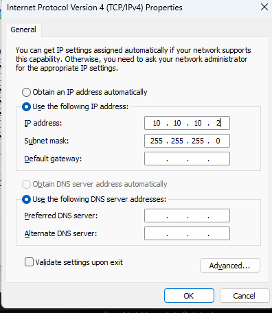


Test thử và đăng nhập vào 10.10.10.1


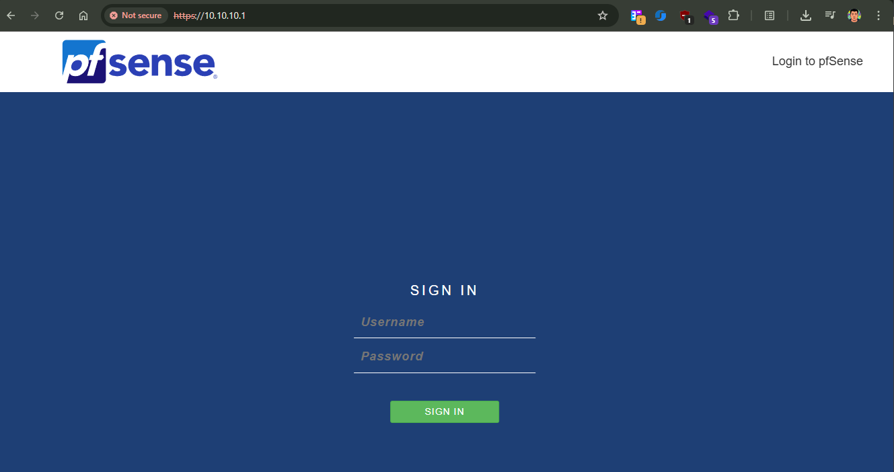


Tương tự với SIEM


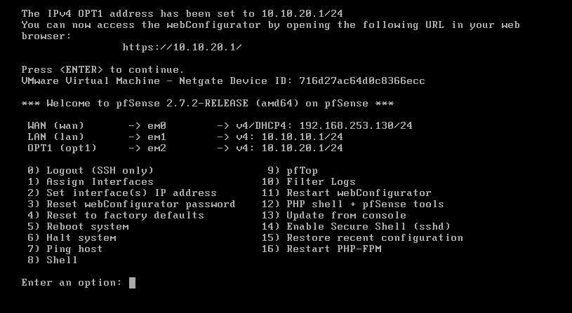


Từ máy chính ta có thể ping về 10.10.10.1 nhưng 10.10.20.1 thì không được do quản lý của pfSense


```c++
PS E:\Soft> ping 10.10.10.1

Pinging 10.10.10.1 with 32 bytes of data:
Reply from 10.10.10.1: bytes=32 time<1ms TTL=64
Reply from 10.10.10.1: bytes=32 time<1ms TTL=64
Reply from 10.10.10.1: bytes=32 time<1ms TTL=64
Reply from 10.10.10.1: bytes=32 time<1ms TTL=64

Ping statistics for 10.10.10.1:
    Packets: Sent = 4, Received = 4, Lost = 0 (0% loss),
Approximate round trip times in milli-seconds:
    Minimum = 0ms, Maximum = 0ms, Average = 0ms
PS E:\Soft> ping 10.10.20.1

Pinging 10.10.20.1 with 32 bytes of data:
Request timed out.
```


Ta có thể điều chỉnh bằng cách thêm rule trong firewall


# 2. Cài windows server 22 (DC01) - domain controller và IT workstation (WS01) {#3567b0eb61a4809baa8ec6ba4e0f0c51}


## 2.1. DC01 (10.10.10.10) {#3567b0eb61a48008a24cf4aae26dec3b}

- Windows server 2022: là hệ điều hành thiết kế để phục vụ nhiều người, chứa các công cụ doanh nghiệp
- AD là một cơ sở dữ liệu khổng lồ chứa thông tin về mọi thứ trong mạng: Danh sách nhân viên (Users), danh sách máy tính (Computers), và các phòng ban (Organizational Units - OUs). Đồng thời, nó chứa cả Group Policy (GPO) - Bản nội quy công ty.
- Domain Controller (DC01) chính là cái máy chủ (Server) đang chạy cơ sở dữ liệu AD

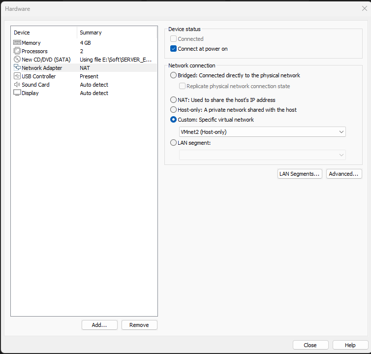

- Đổi IP thành 10.10.10.10/24, default gateway: 10.10.10.1 là Ip của pfSense
	- Lưu ý DNS của DC phải trỏ về chính nó: 127.0.0.1

### Nâng cấp lên domain controller {#3567b0eb61a4804b8a03d35753b3b18a}


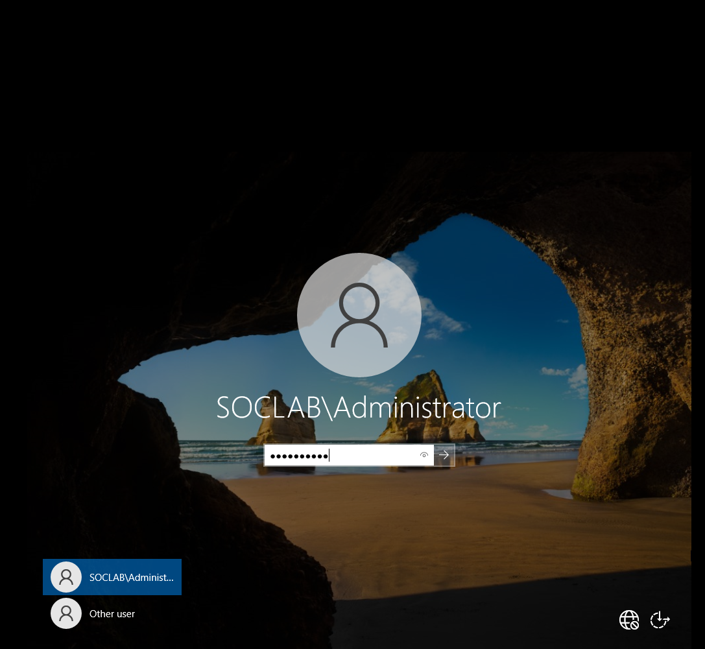


Sau khi trở thành DC thì 


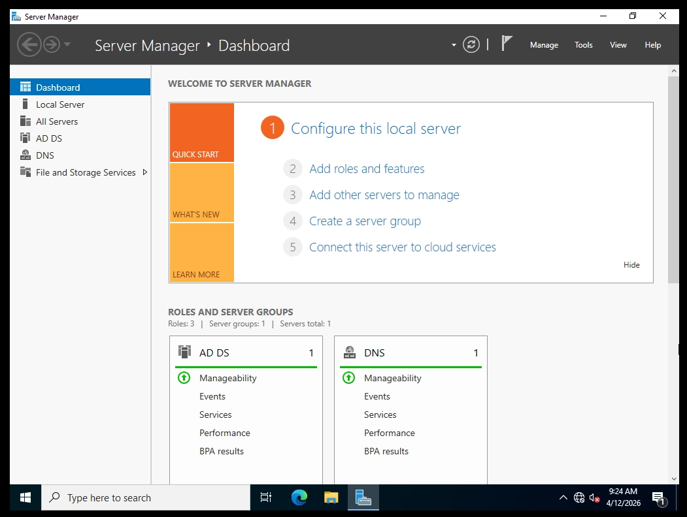


Thêm người dùng vào ADUC để sau thêm WS01 vào

- Vào Tools -&gt; Active Directory Users and Computers (viết tắt là ADUC).
- Bung cái tên miền `soclab.local`
- Tạo một Organizational Unit (OU) mới tên là `SOC_Lab`

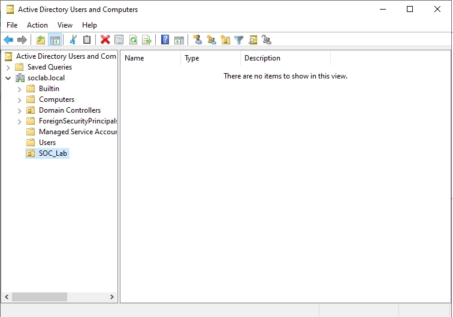


## 2.2. WS01 (IT workstation): 10.10.10.15 {#3567b0eb61a48069ba6edad934bc2e43}


Chuyển sang VMnet2 (LAN) và thiết lập ip phù hợp cùng với DNS đi qua DC01


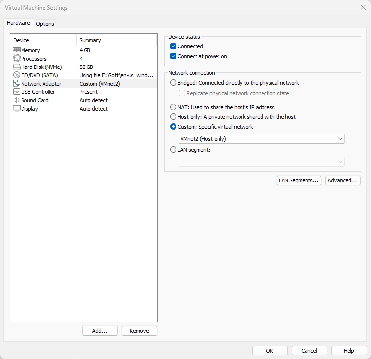


Thiết lập IP tương ứng theo thiết kế:


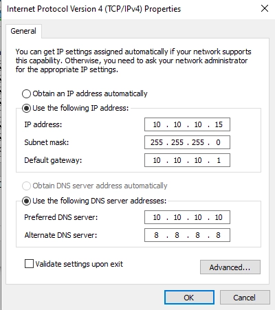


Thử ping sang 10.10.10.10


```c++
PS C:\Users\cuong_nguyen> ping 10.10.10.10
Pinging 10.10.10.10 with 32 bytes of data:
Reply from 10.10.10.10: bytes=32 time<1ms TTL=128
Reply from 10.10.10.10: bytes=32 time<1ms TTL=128
Reply from 10.10.10.10: bytes=32 time<1ms TTL=128
```


Và thực hiện nslookup sang soclab


```c++
PS C:\Users\cuong_nguyen> nslookup soclab.local
Server:  UnKnown
Address:  10.10.10.10

Name:    soclab.local
Address:  10.10.10.10
```


Hiện tại reverse lookup trên máy ws01 chưa có tên ta phải forward lookup soclab.local là 10.10.10.10


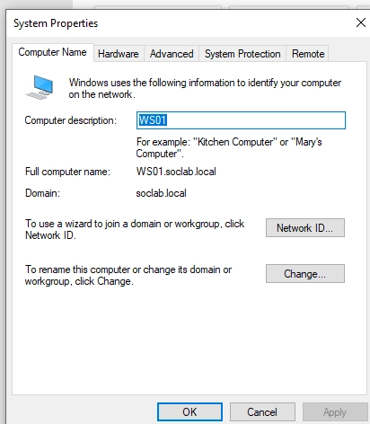


Đổi tên và chuyển domain


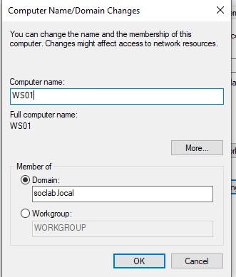


### Sửa reverse lookup zone trên DC01 - để dịch ngược lại DNS {#3567b0eb61a48021ab66e701c747c26d}

- Vào reverse look up zone
	- Server Manager → Tools → DNS
	- Reverse lookup zone → new zone
	- Nhấn next → ipv4 reverse lookup zone
	- Ở ô Network ID, bạn gõ dải mạng của mình vào: `10.10.10` Bấm Next.
	- Để mặc định _Allow only secure dynamic updates_ -> Finish.
- Khai báo tên cho số IP 10.10.10.10
	- Forward Lookup Zones → soclab.local
	- Nhìn bảng A record mang tên DC01 mang IP `10.10.10.10`
	- Nhấn đúp vào ô và chọn Update associated pointer record

```c++
PS C:\Users\cuong_nguyen> nslookup soclab.local
Server:  dc01.soclab.local
Address:  10.10.10.10

Name:    soclab.local
Address:  10.10.10.10
```


### Di chuyển WS01 vào Organizational Unit SOC_Lab {#3567b0eb61a480fe85fbdca569359042}


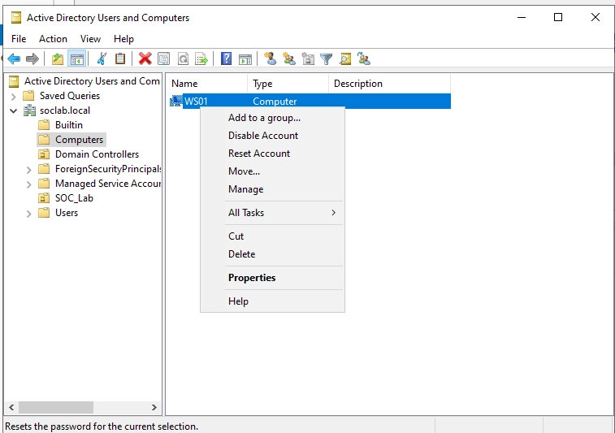

