# 1. Cấu hình GPO để thu thập các log nâng cao {#3407b0eb61a48064b2f8d4add4eb3452}


Ngoài những log đã bật sẵn:

- 4624 (Successful Logon): Ai đó đăng nhập thành công vào máy (rất nhiều log rác, cần lọc kỹ).
- 4625 (Failed Logon): Đăng nhập sai mật khẩu (Dùng để phát hiện Brute-force).
- 4634 / 4647 (Logoff): Người dùng đăng xuất.
- 4672 (Special Privileges Assigned): Một tài khoản có quyền Admin vừa đăng nhập (Hacker dùng Pass-the-Hash thường sinh ra log này).
- 4720, 4722, 4724: Log quản lý tài khoản trên DC (Tạo mới user, Kích hoạt user, Đổi mật khẩu).

Còn phải bật một số event ID quan trọng: 

- 4688: a new process has been created
- 4104: script block logging, 4103 ghi lại từng lệnh (cmdlet) được thực thi và kết quả trả về. Rất hữu ích khi hacker dùng script làm rối mã (Obfuscation).
- 4698: a new scheduled task was created on the system - phục vụ kiểm tra persistence

## 1.1. Thiết lập một audit policy riêng {#3407b0eb61a480bcbc10d8a337e39021}

1. Trên máy DC01, mở Server Manager.
2. Nhấn vào Tools (góc trên bên phải) -&gt; Chọn Group Policy Management. Khi cửa sổ Group Policy Management mở ra:
3. Bung lần lượt các mũi tên: Forest: soclab.local -&gt; Domains -&gt; soclab.local.
4. Tìm đến thư mục SOC_Lab
5. Chuột phải vào chữ SOC_Lab -&gt; Chọn dòng đầu tiên: Create a GPO in this domain, and Link it here...
6. Đặt tên cho GPO: `SOC_Audit_Policy`


## 1.2. Bật các EventID cần thiết {#3407b0eb61a4804ba1a5e06ced016847}


[https://www.iblue.team/incident-response-1/logging-powershell-activities](https://www.iblue.team/incident-response-1/logging-powershell-activities)


### Bật Log PowerShell (Event 4104) {#3407b0eb61a4800fa714c33ee03b729f}

1. Đi theo cây thư mục: `Computer Configuration` -&gt; `Policies` -&gt; `Administrative Templates` -&gt; `Windows Components` -&gt; `Windows PowerShell`.
2. Ở bảng bên phải, nhấp đúp vào Turn on PowerShell Script Block Logging.
3. Chọn Enabled. Nhấn OK.

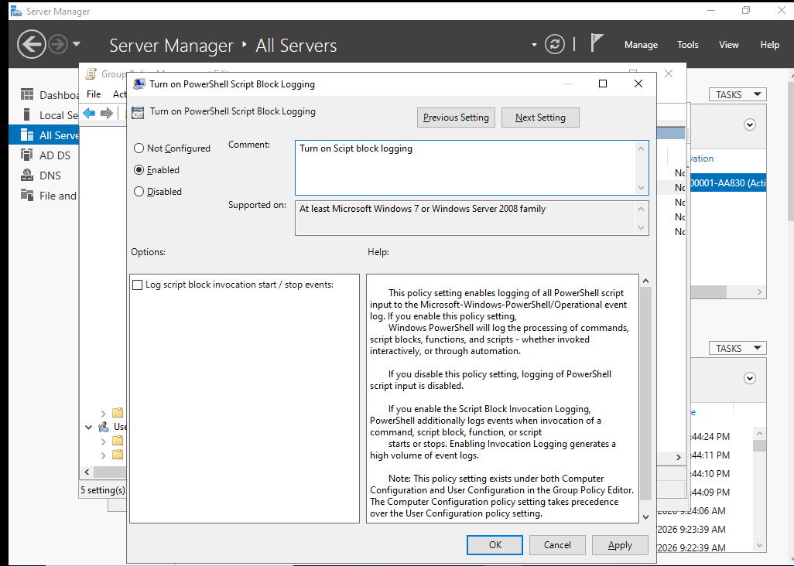


### **Bật process creation (có lưu commandline)** {#3407b0eb61a480a3943dffd644082882}


Cái này cần thiết lập ở 2 nơi:

- Nơi 1 (Bật tính năng theo dõi Tiến trình):
	- Đi theo: `Computer Configuration` -> `Policies` -> `Windows Settings` -> `Security Settings` -> `Advanced Audit Policy Configuration` -> `Audit Policies` -> `Detailed Tracking`.
	- Nhấp đúp vào Audit Process Creation. Tích chọn cả 2 ô Success và Failure. Nhấn OK.

	

- Nơi 2 (Bắt buộc Windows phải ghi lại cả dòng lệnh người dùng gõ):
	- Đi theo: `Computer Configuration` -> `Policies` -> `Administrative Templates` -> `System` -> `Audit Process Creation`.
	- Nhấp đúp vào Include command line in process creation events.
	- Chọn Enabled. Nhấn OK.

	


### **Bật log 4698** {#3407b0eb61a480b38d0ec3b77fea4e9f}

1. Mở Group Policy Management trên DC01.
2. Tìm đến OU SOC_Lab -&gt; Chuột phải vào cái `SOC_Audit_Policy` của bạn -&gt; Chọn Edit...
3. Trong bảng Editor
	- `Computer Configuration` -> `Policies` -> `Windows Settings` -> `Security Settings` -> `Advanced Audit Policy Configuration` -> `Audit Policies` -> `Object Access`.
4. Ở bảng bên phải, nhấp đúp vào chính sách có tên: `Audit Other Object Access Events`.
5. Tích chọn cả 2 ô Success và Failure. Nhấn OK.


:::tip

Thao tác bật này giúp log lại không chỉ 4698 mà còn 4699 (xóa task) và 4702 (sửa task)

:::


## **1.3. Update GPO**  để ép máy WS01 nhận luật {#3407b0eb61a48004afeaefbfc515f8c4}

1. Mở màn hình máy ảo WS01.
2. Mở CMD (Quyền Admin), gõ lệnh: `gpupdate /force` rồi Enter.

```c++
**gpupdate /force
Computer Policy update has completed successfully.
User Policy update has completed successfully.**
```


### Kiểm tra {#3417b0eb61a4805bbd61fd8717a556db}


Ta thử kiểm tra xem đã ghi nhận logging chưa:


```c++
PS C:\Users\cuong_nguyen> net user

User accounts for \\WS01

-------------------------------------------------------------------------------
Administrator            cuong_nguyen             DefaultAccount
defaultuser0             Guest                    WDAGUtilityAccount
The command completed successfully.
```


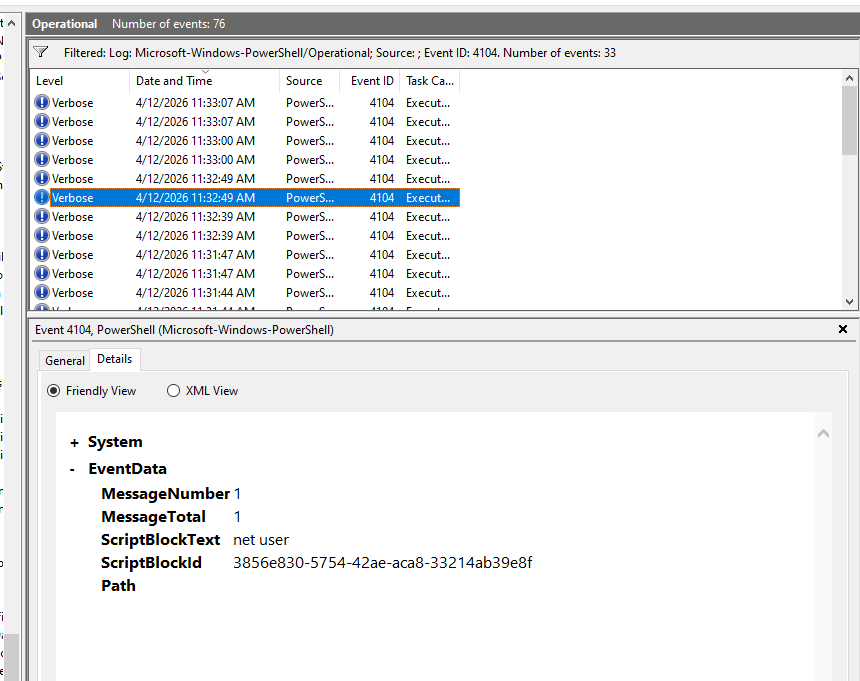


Đối với scheduled task


```c++
schtasks /create /tn "APT29_Persistence" /tr "calc.exe" /sc daily /st 12:00
```


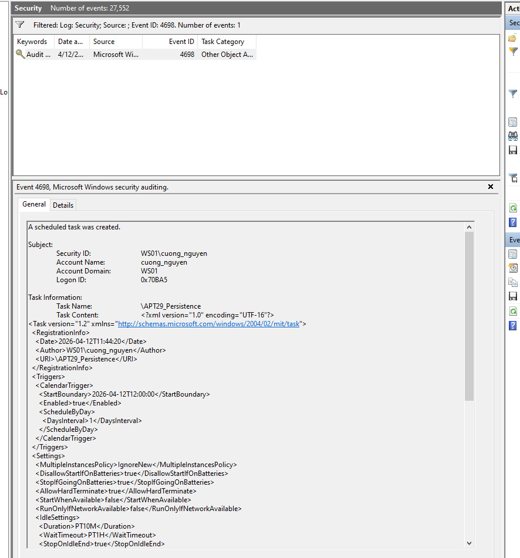


## 1.4. Link group domain controller với SOC_audit_policy {#3417b0eb61a4807ba4cded051eb4f81f}


Để DC01 được audit như WS01 ta link domain controller với policy đã tạo


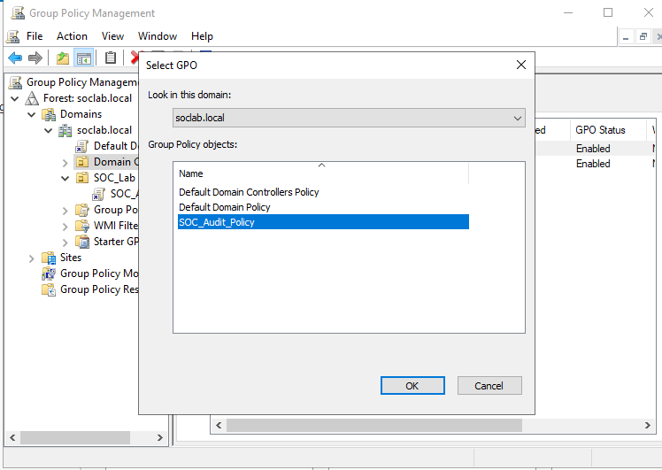


# 2. Cấu hình sysmon {#3417b0eb61a480969352d6b55edb8019}


> _System Monitor_ (_Sysmon_) is a Windows system service and device driver that, once installed on a system, remains resident across system reboots to monitor and log system activity to the Windows event log. It provides detailed information about process creations, network connections, and changes to file creation time  
> 

- Công cụ sysmon tại trang chính thức Microsoft [https://learn.microsoft.com/en-us/sysinternals/downloads/sysmon](https://learn.microsoft.com/en-us/sysinternals/downloads/sysmon)
- Config: sử dụng sysmon-modular thay vì SwiftOnSecurity vì có mapping MITRE ATT&CK và tùy biến scalability: [https://github.com/olafhartong/sysmon-modular](https://github.com/olafhartong/sysmon-modular)

Ta cài đặt thử trước trên WS01 để tránh trường hợp xảy ra lỗi trên DC01


```c++
.\Sysmon64.exe -accepteula -i sysmonconfig.xml

System Monitor v15.20 - System activity monitor
By Mark Russinovich and Thomas Garnier
Copyright (C) 2014-2026 Microsoft Corporation
Using libxml2. libxml2 is Copyright (C) 1998-2012 Daniel Veillard. All Rights Reserved.
Sysinternals - www.sysinternals.com

Loading configuration file with schema version 4.90
Sysmon schema version: 4.91
Configuration file validated.
Sysmon64 installed.
SysmonDrv installed.
Starting SysmonDrv.
SysmonDrv started.
Starting Sysmon64..
Sysmon64 started.
```


### Kiểm tra hoạt động {#3417b0eb61a4802cadede995cc61924e}


```c++
PS C:\Users\cuong_nguyen\Desktop\Sysmon> net user

User accounts for \\WS01

-------------------------------------------------------------------------------
Administrator            cuong_nguyen             DefaultAccount
defaultuser0             Guest                    WDAGUtilityAccount
The command completed successfully.
```


```c++
Process Create:
RuleName: technique_id=T1018,technique_name=Remote System Discovery
UtcTime: 2026-04-13 04:39:55.397
ProcessGuid: {dd1c2221-739b-69dc-db02-000000000d00}
ProcessId: 2636
Image: C:\Windows\System32\net.exe
FileVersion: 10.0.19041.1 (WinBuild.160101.0800)
Description: Net Command
Product: Microsoft® Windows® Operating System
Company: Microsoft Corporation
OriginalFileName: net.exe
CommandLine: "C:\Windows\system32\net.exe" user
CurrentDirectory: C:\Users\cuong_nguyen\Desktop\Sysmon\
User: WS01\cuong_nguyen
LogonGuid: {dd1c2221-cca6-69db-a50b-070000000000}
LogonId: 0x70BA5
TerminalSessionId: 1
IntegrityLevel: High
Hashes: SHA1=88B101598CC6726B7A57D02B1FA95BE1B272A821,MD5=0BD94A338EEA5A4E1F2830AE326E6D19,SHA256=9F376759BCBCD705F726460FC4A7E2B07F310F52BAA73CAAAAA124FDDBDF993E,IMPHASH=57F0C47AE2A1A2C06C8B987372AB0B07
ParentProcessGuid: {dd1c2221-7324-69dc-c802-000000000d00}
ParentProcessId: 3888
ParentImage: C:\Program Files\PowerShell\7\pwsh.exe
ParentCommandLine: "C:\Program Files\PowerShell\7\pwsh.exe" -NoExit -RemoveWorkingDirectoryTrailingCharacter -WorkingDirectory "C:\Users\cuong_nguyen\Desktop\Sysmon!" -Command "$host.UI.RawUI.WindowTitle = 'PowerShell 7 (x64)'"
ParentUser: WS01\cuong_nguyen
```


Làm tương tự trên DC01


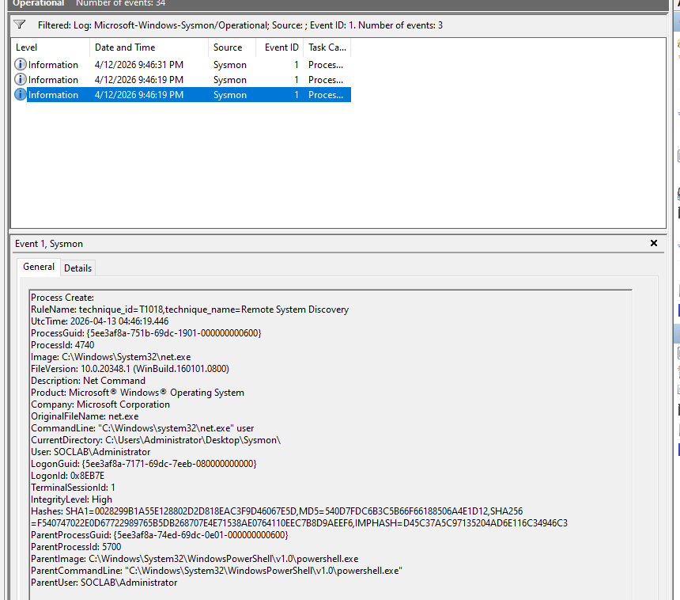


:::tip

Có thể tạo shared folder, viết một script kiểm tra trên các máy trạm (nếu chưa có sysmon) và cài đặt sysmon, sau đó dùng GPO để áp policy này tới các máy

:::


# 3. Thiết lập hệ thống SIEM - 10.10.20.30 {#3417b0eb61a480a4a025fa0c2d0886c1}


## 3..1. Tạo máy ảo SIEM {#3417b0eb61a480a4bcc9cdcb7408017b}


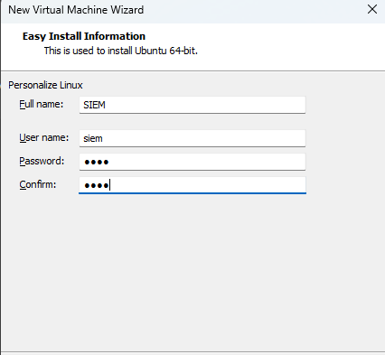


Cho kết nối với VMnet3


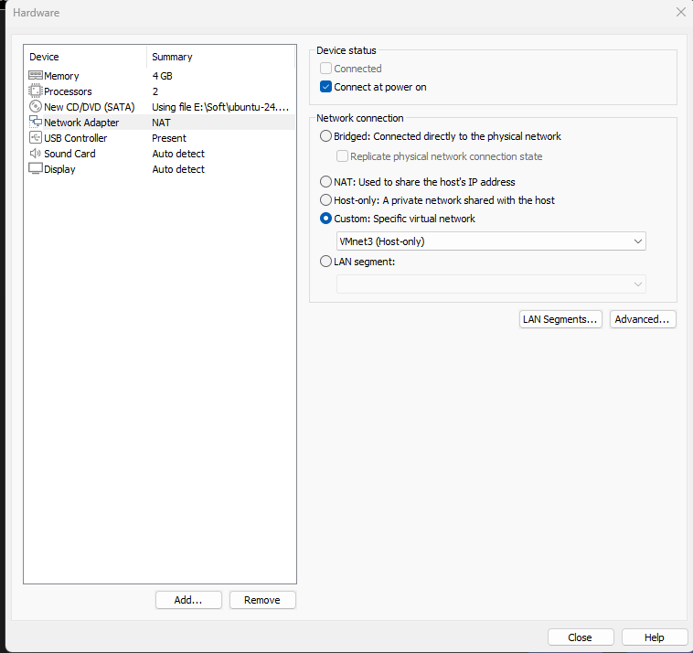


## 3.2. Thiết lập IP {#3417b0eb61a480d1abdace54fbc5c3bc}

- Tương tự kết nối với IP của pfSense nối với VMnet3
- DNS là của DC01 và google


## 3.3. Thiết lập splunk server (docker) {#3417b0eb61a4805a890ee5d9d0229c2d}


[https://help.splunk.com/en/splunk-enterprise/get-started/install-and-upgrade/10.0/install-splunk-enterprise-in-virtual-and-containerized-environments/deploy-and-run-splunk-enterprise-inside-a-docker-container](https://help.splunk.com/en/splunk-enterprise/get-started/install-and-upgrade/10.0/install-splunk-enterprise-in-virtual-and-containerized-environments/deploy-and-run-splunk-enterprise-inside-a-docker-container)


```c++
sudo apt update
sudo apt install docker.io -y
sudo systemctl enable docker
sudo systemctl start docker
```


Thiết lập lưu trữ cho docker splunk


```c++
mkdir ~/Desktop/splunk_backup
```


Cài đặt: lưu trữ sẵn tại ~/Desktop/splunk_backup để tránh trường hợp cài đặt lỗi, cần cài đặt lại docker thì mất config, data trên splunk

- Port 8000: giao diện
- Port 9997: nhận dữ liệu từ SUF các máy DC01, WS01
- ~~Port 515: nhận dữ liệu từ Suricata (deprecated)~~
- Port 8088: nhận dữ liệu từ Suricata (với HEC)

```c++
sudo docker run -d \
-p 8000:8000 -p 9997:9997 -p 515:515 -p 8088:8088 \
-e SPLUNK_START_ARGS=--accept-license \
-e SPLUNK_GENERAL_TERMS=--accept-sgt-current-at-splunk-com \
-e SPLUNK_PASSWORD=Password1! \
--name splunk_server \
--memory="4g" \
-v ~/Desktop/splunk_backup/var:/opt/splunk/var \
-v ~/Desktop/splunk_backup/etc:/opt/splunk/etc \
--restart unless-stopped \
splunk/splunk:latest
```


```c++
sudo docker start splunk_server
```


# 4. Thiết lập Splunk universal forwarder trên DC01 và WS01 {#3417b0eb61a480a08ee4eff62dabcee9}


## 4.1. DC01 và WS01 {#3417b0eb61a4806e8647f527088611c0}


Thực hiện theo hướng dẫn tại


[https://help.splunk.com/en/splunk-cloud-platform/forward-and-process-data/universal-forwarder-manual/9.4/install-the-universal-forwarder/install-a-windows-universal-forwarder#id_97c49283_f5a8_4748_9e3e_87ca9b57633d--en__Install_a_Windows_universal_forwarder_from_the_command_line](https://help.splunk.com/en/splunk-cloud-platform/forward-and-process-data/universal-forwarder-manual/9.4/install-the-universal-forwarder/install-a-windows-universal-forwarder#id_97c49283_f5a8_4748_9e3e_87ca9b57633d--en__Install_a_Windows_universal_forwarder_from_the_command_line)


file inputs.conf C:\Program Files\SplunkUniversalForwarder\etc\system\local\inputs.conf


Chỉ thu thập security, system log, sysmon và powershell như đã quy định ở trên


```c++
[WinEventLog://Security]
disabled = false
index = windows_security

[WinEventLog://System]
disabled = false
index = windows_syslog

[WinEventLog://Microsoft-Windows-Sysmon/Operational]
disabled = false
index = sysmon
renderXml = 0

[WinEventLog://Microsoft-Windows-PowerShell/Operational]
disabled = false
index = powershell
whitelist = 4103,4104
```


Sau đó tắt và khởi động lại SplunkForwarder


```c++
net stop SplunkForwarder
net start SplunkForwarder
```


## 4.2. Thiết lập trên splunk server {#3417b0eb61a48024a90ac8db3b300b83}

- Đăng nhập vào giao diện Web `http://10.10.20.10:8000`
- Vào Settings -&gt; Forwarding and receiving -&gt; Configure receiving.
- Mở cổng `9997`

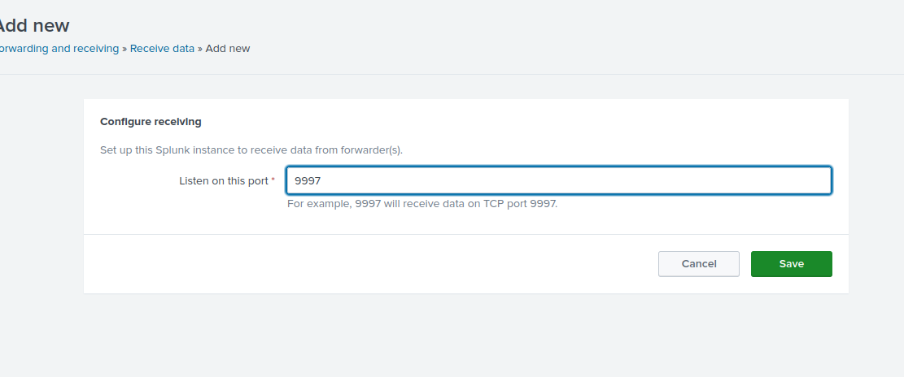


### Tạo index như trong inputs.conf {#3417b0eb61a480c484a7ec492924af8a}

- Vào setting → indexes → add index

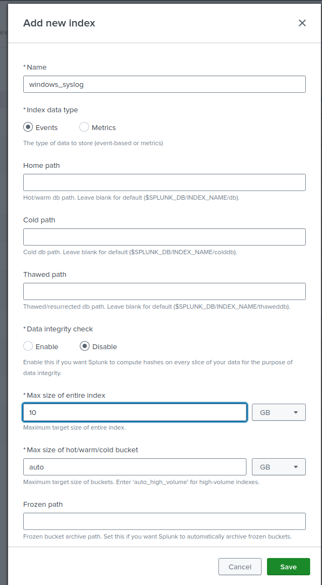

- Tương tự với các index còn lại

### Kết quả {#3417b0eb61a48042baf0f8a0ecd7d9d4}


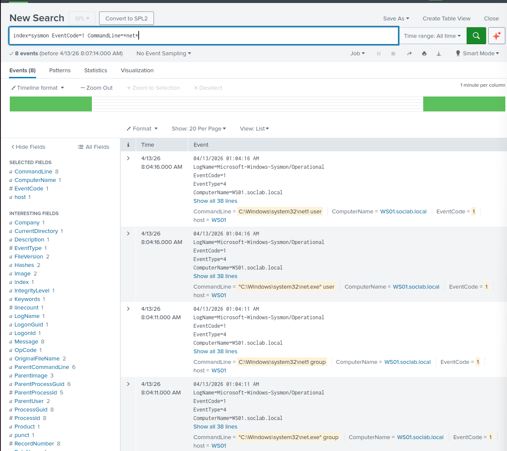


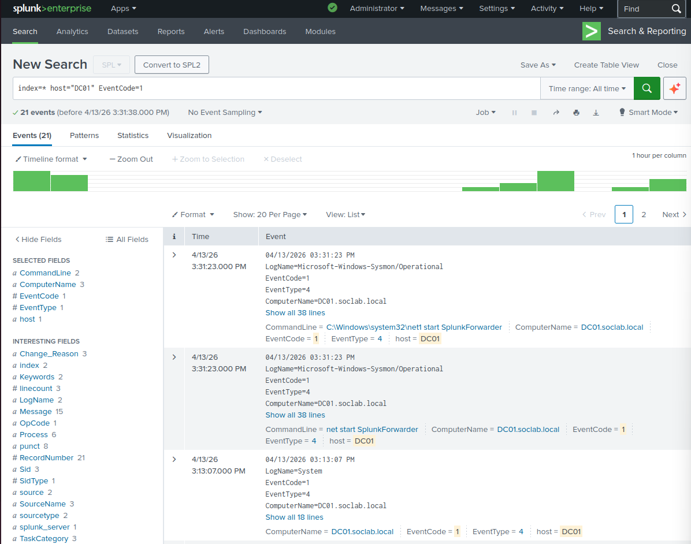


:::tip

Về đồng bộ giờ trên hệ thống SOC
- Trên SIEM: sudo timedatectl set-timezone Asia/Ho_Chi_Minh

- Tương tự trên DC01, WS01

- Trên Splunk:

:::


### Cấu hình Domain Controller (DC01) làm máy chủ thời gian {#3457b0eb61a4804fa977f8922faec7fe}


Bây giờ, chúng ta sẽ cấu hình để DC01 vươn ra ngoài Internet lấy giờ chuẩn từ các nguồn uy tín (như pool.ntp.org), và sau đó trở thành máy chủ thời gian nội bộ cho toàn mạng LAN.

1. Đăng nhập vào máy **DC01** với quyền Administrator.
2. Mở **PowerShell** (Run as Administrator).

w32tm /config /manualpeerlist:"[time.google.com](http://time.google.com/),0x8 [time.windows.com](http://time.windows.com/),0x8" /syncfromflags:manual /reliable:yes /update


w32tm /resync /force


### Bước 3: Ép máy trạm (WS01) đồng bộ giờ với DC01 {#3457b0eb61a480d98a07c27c3a9931e1}


Máy trạm trong Domain mặc định sẽ tự động tìm đến Domain Controller để lấy giờ. Tuy nhiên, do lúc trước bị lỗi, có thể nó đang bị "kẹt". Chúng ta sẽ ép nó đồng bộ lại.

1. Đăng nhập vào máy **WS01** với quyền Administrator.
2. Mở **PowerShell** (Run as Administrator).
3. Chạy các lệnh sau:
	- `w32tm /config /syncfromflags:domhier /update`_(Lệnh này ép WS01 phải lấy giờ theo kiến trúc phân cấp của Domain - tức là lấy từ DC01)_
	- `net stop w32time`
	- `net start w32time`
	- `w32tm /resync`

Nếu thành công, giờ trên WS01 sẽ lập tức khớp chính xác từng giây với DC01.


# 5. Tạo một lỗ hổng trên registry (weak registry configuration - phục vụ privEsc) {#3497b0eb61a48052880afaba99eb93b9}


IT Admin của công ty tạo ra một Service (Dịch vụ ngầm) chạy bằng quyền SYSTEM để tự động cập nhật phần mềm, nhưng lại lỡ tay set quyền cho phép nhân viên (Users) được phép sửa cấu hình của Service đó trong Registry.


Trên WS01, tạo một service SOCUpdater với quyền NT AUTHORITY\SYSTEM trỏ tới lệnh ping.exe (Giả lập một lệnh update phần mềm trong thực tế)


`sc create SOCUpdater binpath= "C:\Windows\System32\ping.exe" start= auto obj= "LocalSystem"`


`sc failure SOCUpdater reset= 0 actions= restart/1000`

1. **Cấp quyền sai trong Registry:** * Bấm phím Windows, gõ `regedit` và mở Registry Editor lên (vẫn bằng quyền Admin).
	- Điều hướng theo đường dẫn sau:
	`HKEY_LOCAL_MACHINE\SYSTEM\CurrentControlSet\Services\SOCUpdater`
	- Chuột phải vào thư mục **SOCUpdater** ở cột bên trái -> Chọn **Permissions...**
	- Trong bảng hiện ra, bấm vào nhóm **Users (WS01\Users)**.
	- Nhìn xuống ô bên dưới, tích vào cột **Allow** ở dòng **Full Control**.
	- Bấm **OK** và đóng Registry lại.

	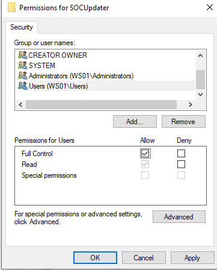

