# 1. Cài đặt suricata trên pfSense {#3417b0eb61a480d2b5d6fcfaa00d0286}


### 1.1. Cài đặt Package: {#3417b0eb61a480b181b3f931664f6fd5}

- Đăng nhập vào pfSense.
- Truy cập `System` &gt; `Package Manager` &gt; `Available Packages`.
- Tìm `Suricata` và nhấn Install.

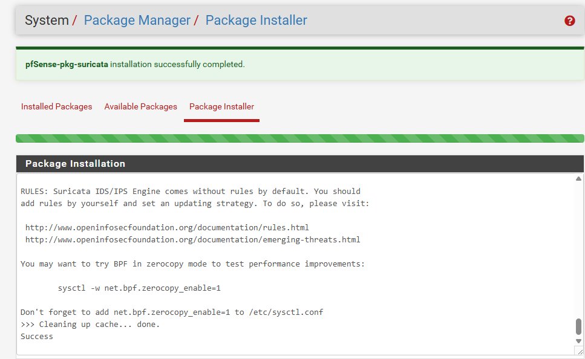


Cấu hình Global Settings (Tải Ruleset):

- Truy cập `Services` &gt; `Suricata` &gt; `Global Settings`.
- Trong phần Rules Update Settings, tích chọn:
	- Install Emerging Threats rules (ET Open)
- Đặt Update Interval là `12-Hours`.
- Lưu lại, sau đó chuyển sang tab Updates và nhấn Update để tải rules về ngay lập tức

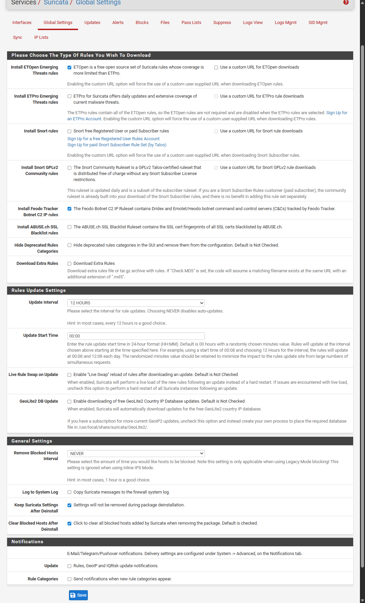


### 1.2. Gắn Suricata vào cổng LAN: {#3417b0eb61a48000917ec3b9e188e5a3}

- Chuyển sang tab Interfaces &gt; Nhấn Add.
- Interface: Chọn `LAN` (Mạng chứa DC01 và WS1 của bạn).
- Trong phần Alert Settings: Tích chọn Send Alerts to System Log.
- Chọn thêm EVE JSON log: là chuẩn để ingest vào SPLUNK

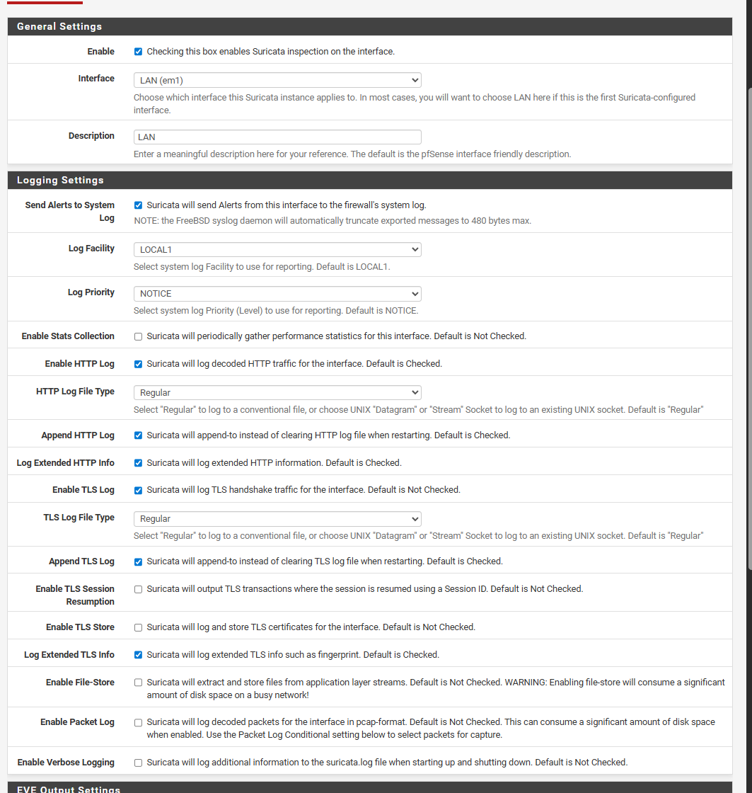


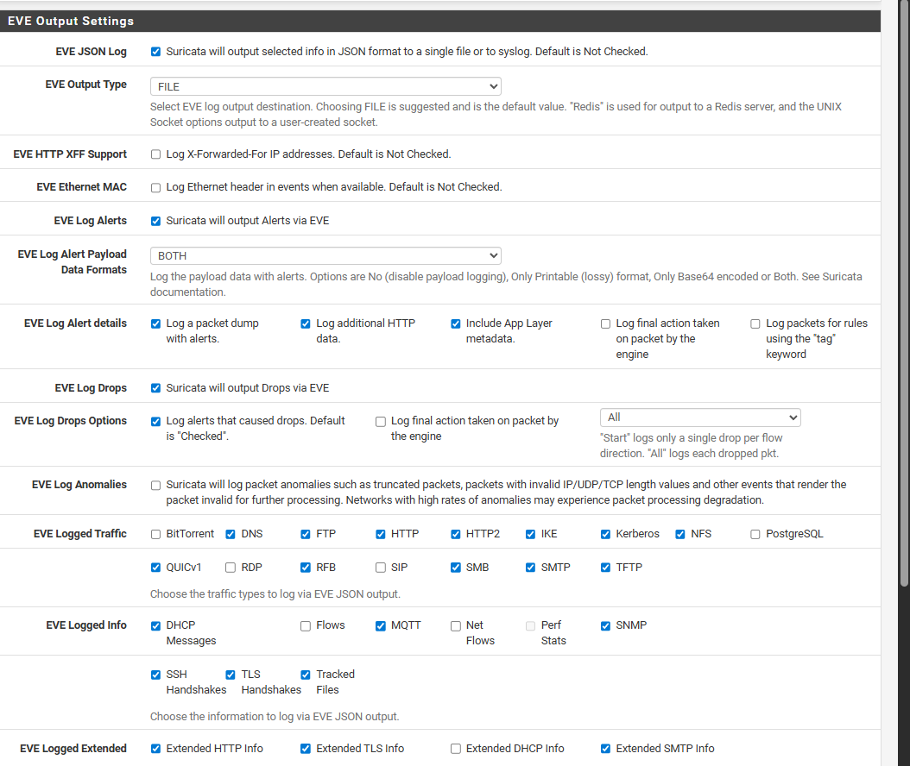

- Lưu lại. Chuyển sang tab LAN Categories, nhấn Select All để bật tất cả các rule vừa tải về (sau này có thể tinh chỉnh sau để giảm nhiễu).
- Quay lại tab Interfaces và nhấn icon Play để khởi động Suricata trên cổng LAN.

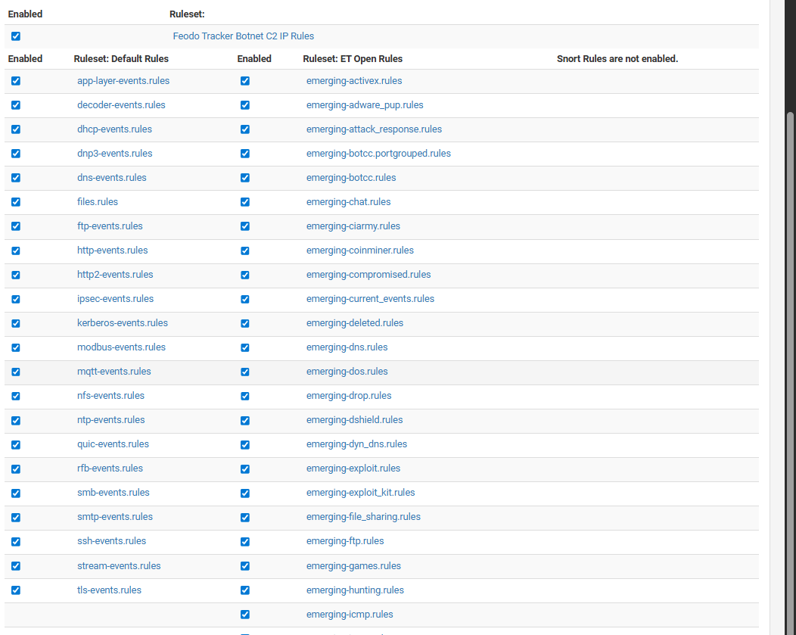


# 2. Cấu hình Log Forwarding từ pfSense về Splunk {#3417b0eb61a48045b7a6d9863bf6226c}


Thay vì cài Universal Forwarder lên pfSense (rất phức tạp và dễ lỗi), chúng ta sẽ dùng giao thức Syslog truyền thống.


## 2.1. Trên pfSense (Cấu hình syslog-ng) {#3417b0eb61a480e39277ff056fdd324c}


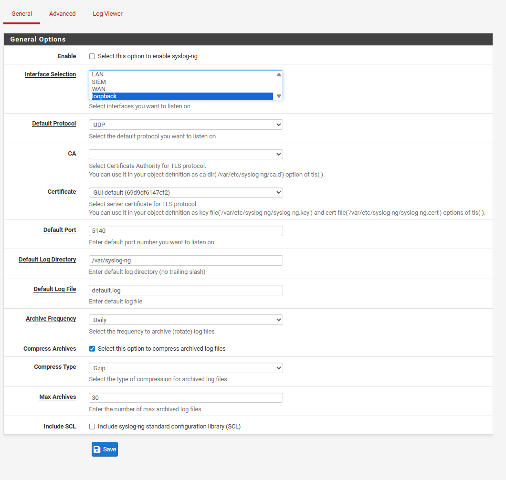


Giữ nguyên vì không dùng phần general. Loopback là để nghe trên chính nó


### ~~Cách 1: dùng port 515 TCP (deprecated)~~ {#3417b0eb61a48060875fdf35a87e4492}

- `Settings` &gt; `Data Inputs`.
- Ở bước cấu hình (Set Sourcetype), bắt buộc chọn `_json` (nằm trong nhóm Structured). Cấu hình này giúp Splunk hiểu và bóc tách dữ liệu ngay lập tức.
- Khi tạo splunk phải có port 515 này

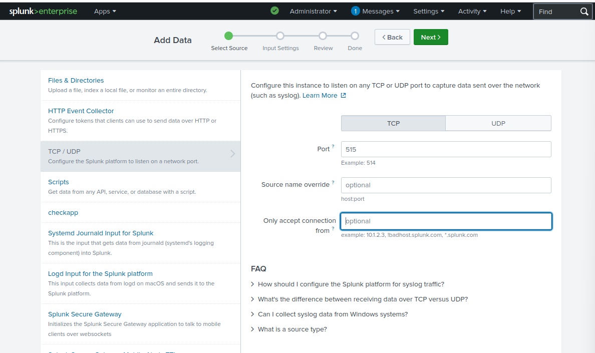


Tạo một index mới là suricata_ids, host=”pfsense_suricata”


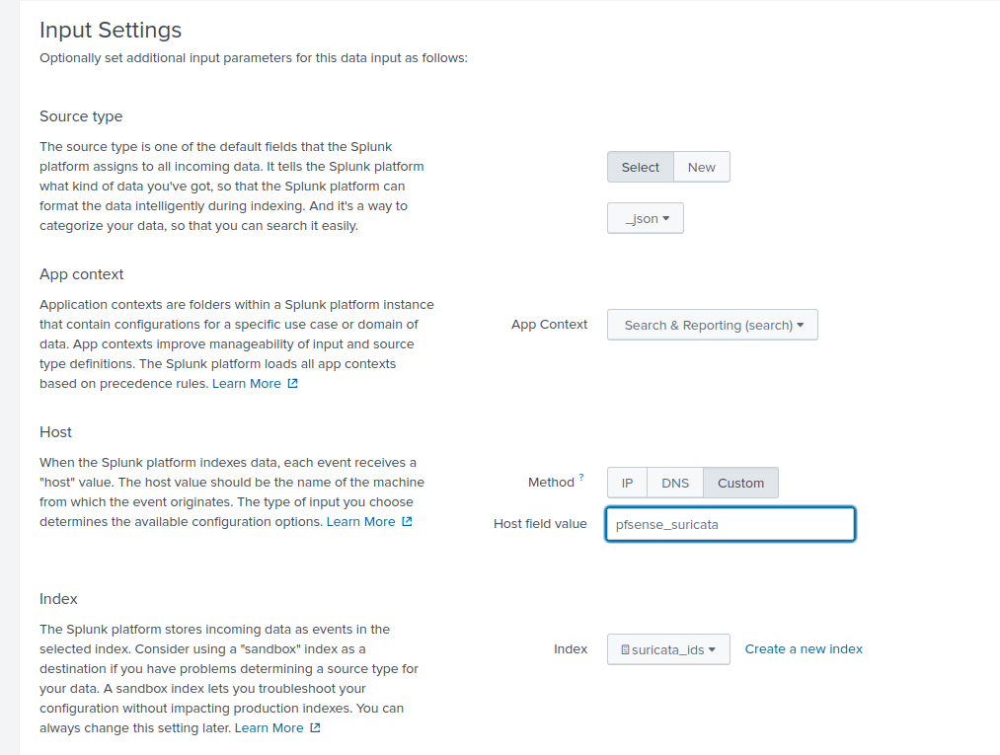


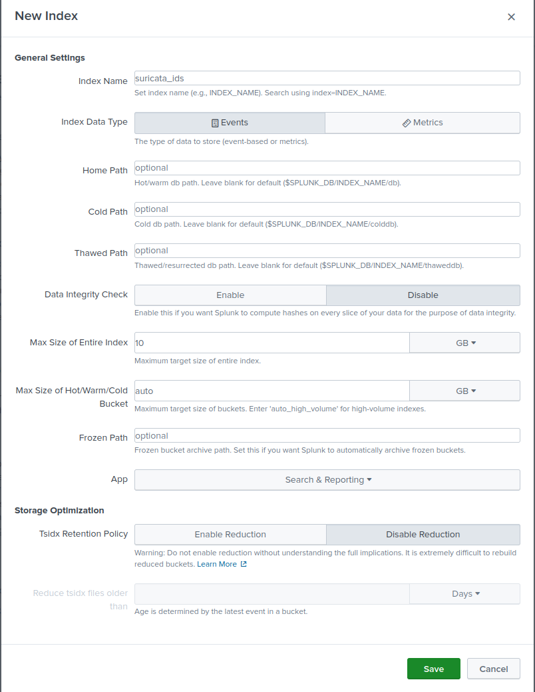


### Cách 2: sử dụng HEC (HTTP event collector) để parse log hiệu quả hơn {#3427b0eb61a48047b666e87b85e096c5}


[https://www.unsafehex.com/index.php/2023/10/11/forward-pfsense-suricata-splunk/](https://www.unsafehex.com/index.php/2023/10/11/forward-pfsense-suricata-splunk/)


Bước 1: Mở port HEC trên Splunk


Đầu tiên, mở cửa cổng 8088 và lấy mã vé (Token) để pfSense có quyền gửi dữ liệu vào.

1. Lên giao diện Web của Splunk, chọn Settings &gt; Data Inputs &gt; HTTP Event Collector.
2. Ở góc trên cùng bên phải, bấm vào Global Settings -&gt; Chọn Enabled -&gt; Bấm Save.
3. Bấm vào nút màu xanh New Token:
	- Name: Đặt là `suricata_hec`
	- Bấm Next.
	- Index: tạo index mới là suricata
	- Bấm Review -> Submit.
4. Lưu token lại

Bước 2: tạo source, destination, log trên pfsense


Mở pfSense, vào Services &gt; Syslog-ng &gt; tab Advanced. Lần lượt ấn nút Add để tạo 3 khối (Object) sau:


	1. Khối Nguồn (Đọc trực tiếp file eve.json)

	- Object Name: `s_suricata_eve`
	- Object Type: `Source`
	- Object Parameters:

		`{ wildcard-file( base-dir("/var/log/suricata/") filename-pattern("eve.json") recursive(yes) flags(no-parse) ); };`


	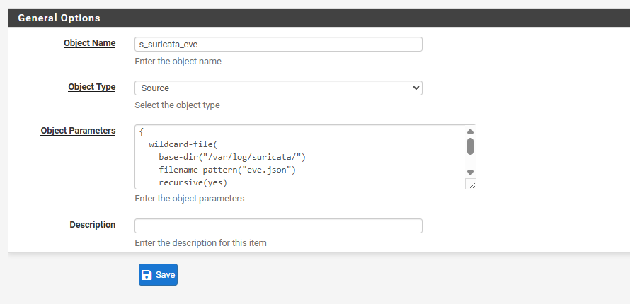


	2. Khối Đích (Gửi đến Splunk HEC)

	- Object Name: `d_splunk_hec`
	- Object Type: `Destination`
	- Object Parameters: (Bạn copy khối lệnh dưới đây, nhưng nhớ thay IP của Splunk và cái mã Token bạn vừa lấy ở Bước 1 vào nhé):Plaintext

		`{ http(url("https://10.10.20.30:8088/services/collector/event") method("POST") user_agent("syslog-ng") user("user") password("REDACTED") peer-verify(no) body("{ \"time\": ${S_UNIXTIME}, \"host\": \"${HOST}\", \"source\": \"suricata\", \"sourcetype\": \"_json\", \"index\": \"suricata\", \"event\": ${MSG} }\n") ); };` 


		Password là token được tạo ra khi thêm index ở bước mở port HEC 8088 trên splunk


	3. Khối Nối (Nối Nguồn và Đích lại với nhau)

	- Object Name: `l_suricata_to_splunk`
	- Object Type: `Log`
	- Object Parameters:Plaintext

		`{ source(s_suricata_eve); destination(d_splunk_hec); };`


Bước 3: Vào Status &gt; Services, tìm dịch vụ `syslog-ng` , `suricata` và reset chúng


---


## 2.2. Kiểm tra hệ thống {#3417b0eb61a48046a294d5a079ce6a88}


```c++
PS C:\Users\cuong_nguyen> curl http://testmyids.com
uid=0(root) gid=0(root) groups=0(root)
```


### Kiểm tra trên pfSense: {#3417b0eb61a480c4949fed4088e5fc7e}

- Truy cập `Services` &gt; `Suricata` &gt; `Alerts`

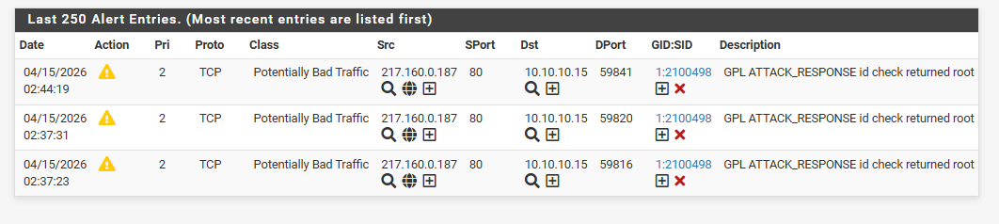


### **Kiểm tra trên Splunk** {#3417b0eb61a48071a0c3d45cd3a70fba}


Splunk SPL


```c++
index="suricata_ids"
```


Sử dụng TCP port 515


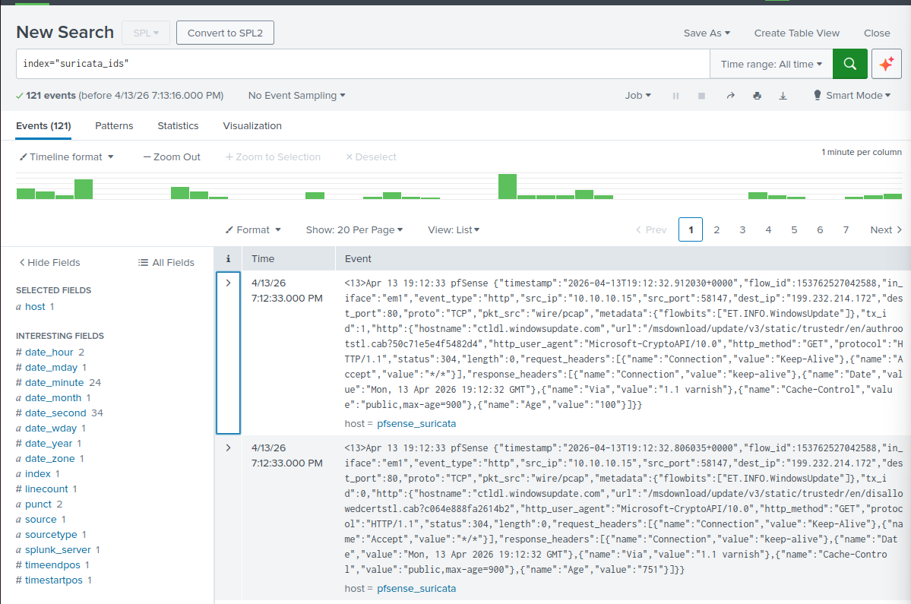


Kết quả sau khi sử dụng HEC port 8088


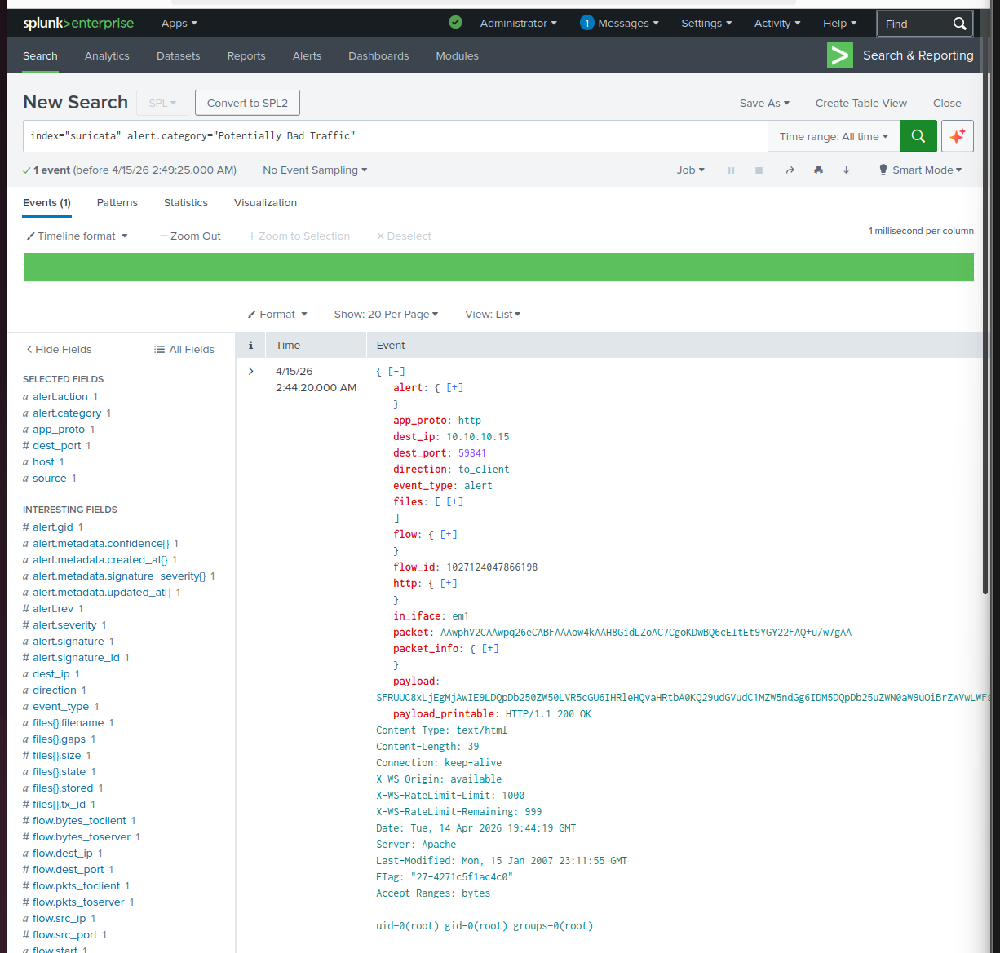


:::tip

Lưu ý: thời gian trên pfSense dùng UTC-0 nên lệch thời gian. Phải vào system → global setting và chọn múi giờ VN

:::


