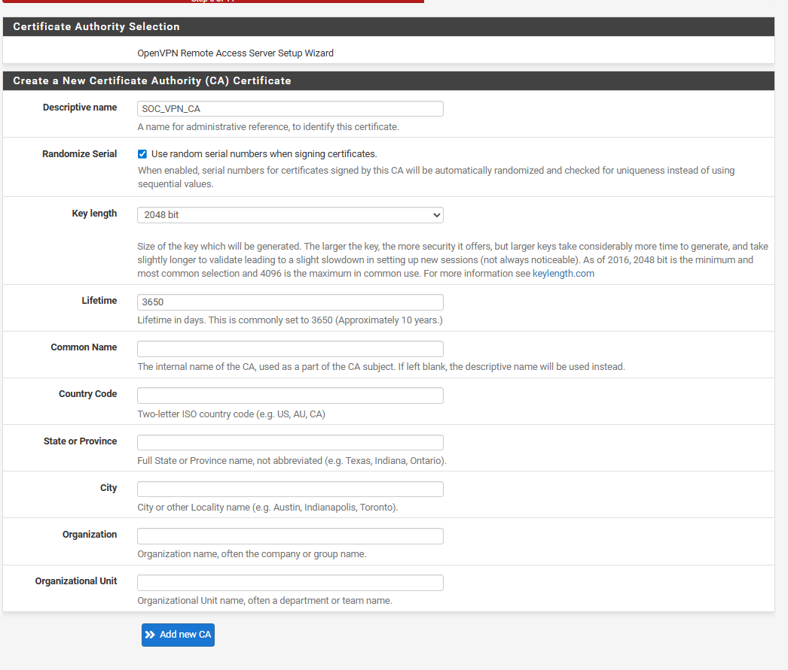
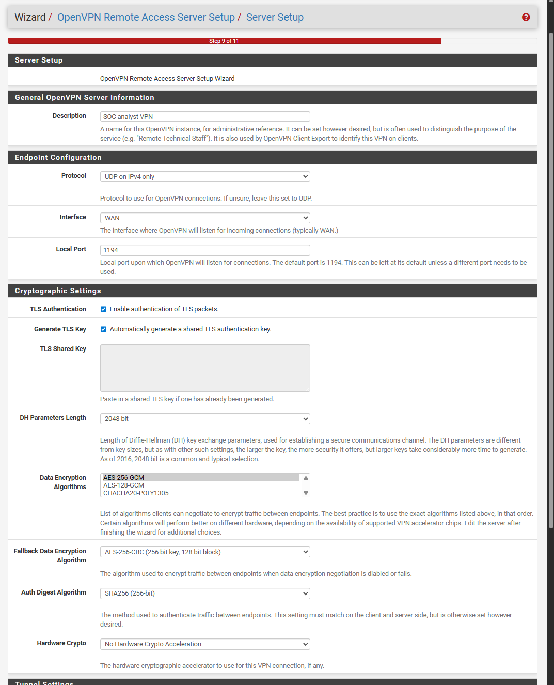
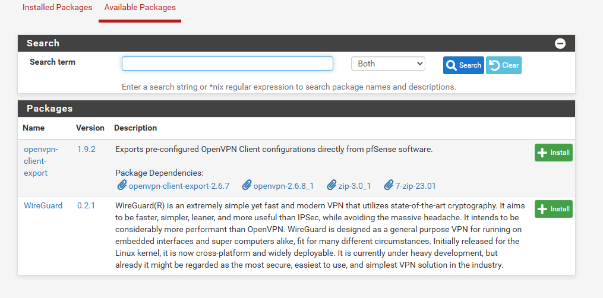
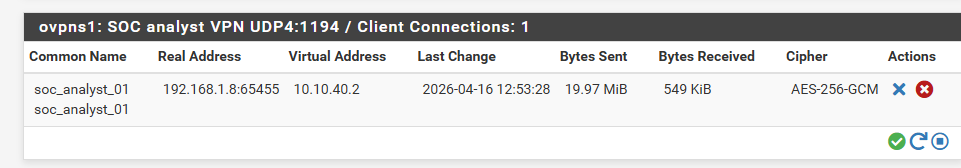
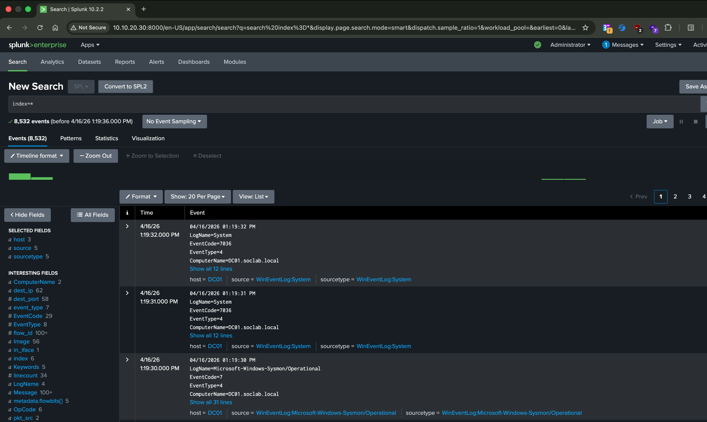

### Bước 1: Dùng wizard tạo OpenVPN Server (Trên pfSense) {#3437b0eb61a480808b91f739fe6c75e6}

1. Đăng nhập vào giao diện Web của pfSense.
2. Trên thanh menu, chọn VPN &gt; OpenVPN &gt; Wizards.
3. Type of Server: Chọn Local User Access (Xác thực bằng tài khoản tạo trên pfSense) -&gt; Bấm _Next_.
4. Certificate Authority (CA - Trạm cấp chứng chỉ):
	- Descriptive Name: Gõ `SOC_VPN_CA` -> Bấm _Add new CA_.

	

	- Descriptive name (`SOC_VPN_CA`): tên hiển thị
	- Randomize Serial:
	- Key length (2048 bit): độ dài khóa RSA
	- Lifetime (3650 days): thời hạn CA
	- Do lab cá nhân nên không cần điền những thông tin về công ty
5. Server Certificate (Chứng chỉ của Server):
	- Descriptive Name: Gõ `SOC_VPN_Cert` -> Bấm _Add new Certificate_.

	

6. Server Setup
	- Interface (WAN): Bạn đang bảo pfSense hãy "vểnh tai" lên nghe ở cổng kết nối với Internet.
	- Protocol (UDP) & Port (1194): UDP là giao thức truyền tải siêu tốc (không cần bắt tay rườm rà như TCP). 1194 là số nhà mặc định của OpenVPN. Khi máy SOC ở quán cafe muốn kết nối, nó sẽ tìm đến IP WAN của bạn và gõ cửa số 1194.
	- Data Encryption Algorithms (AES-256-GCM): Đây là "tiêu chuẩn vàng" của quân đội và chính phủ. GCM (Galois/Counter Mode) không chỉ mã hóa dữ liệu mà còn tự động kiểm tra xem gói tin có bị hacker sửa đổi dọc đường hay không. Nó cực kỳ an toàn và xử lý rất nhẹ nhàng.

	

	Nhóm Định tuyến mạng (Sự khác biệt cốt lõi nhất)

	Đây là phần dễ gây nhầm lẫn nhất đối với người mới làm mạng, và cũng là phần quan trọng nhất để hiểu mô hình của bạn:

	- **IPv4 Tunnel Network (****`10.10.40.0/24`** **):** Một dải mạng khác với SIEM, LAN để gán cho Laptop mỗi khi đăng nhập vào mạng
	- **IPv4 Local Network (****`10.10.10.0/24, 10.10.20.0/24`****):** Chỉ định dải mạng cụ thể để vào được VPN

	

	1. Client Settings (Cài đặt hành vi của Client)

	Phần này định hình cách máy Laptop SOC sẽ cư xử khi đường truyền mạng vật lý thay đổi.

	- Dynamic IP (Tích chọn): dù IP có thay đổi thì vẫn được truy nhập VPN trong phiên đó
	- Topology (Subnet): Cách pfSense phát IP cho máy tính, một ip cho một client

	2. Advanced Client Settings

	- Vấn đề: Ở quán cafe, máy bạn dùng DNS của Google (8.8.8.8) hoặc của nhà mạng. Nếu bạn gõ địa chỉ IP `10.10.20.30` (Splunk), đường hầm VPN hiểu và dẫn bạn đi. NHƯNG, nếu bạn gõ tên miền nội bộ `http://splunk.soc.local`   thì sẽ không thấy. Do DNS của google không có cái này
	- Giải pháp (DNS Server 1 & 2): Nếu mạng LAN của bạn có một con máy chủ Domain Controller (DC01 - `10.10.10.10`) kiêm luôn chức năng phân giải tên miền (DNS Server). Bạn sẽ gõ `10.10.10.10` vào ô DNS Server 1.
		- _Tác dụng:_ pfSense sẽ "ép" máy Laptop SOC phải dùng danh bạ nội bộ của công ty. Từ đó, bạn ngồi ở nhà nhưng vẫn có thể gõ `splunk.soc.local` hay `dc01.soc.local` truy cập trơn tru như đang ngồi ở văn phòng.
	- DNS Default Domain: Bạn có thể điền tên miền gốc của công ty (ví dụ: `soc.local`). Khi đó, bạn chỉ cần gõ chữ `splunk` lên trình duyệt, máy tính sẽ tự động nối đuôi thành `splunk.soc.local`.
	- NTP Server: Ép máy trạm đồng bộ giờ với máy chủ công ty (Rất quan trọng trong SOC để log của các máy trạm gửi về không bị sai lệch ngày giờ).
7. Firewall Rule Configuration: * Tích chọn CẢ 2 Ô: `Firewall Rule` và `OpenVPN rule`. (pfSense sẽ tự động mở cửa cho bạn, bạn không cần tự cấu hình tay). -&gt; Bấm _Next_ -&gt; _Finish_.

Traffic from clients to server: mặc định pfSense chặn kết nối từ Internet vào mạng nội bộ. Tick này để pfsense cho phép cổng 1194 đã thiết lập trước đó cho lưu lượng UDP vào

Traffic from clients through VPN: khi laptop kết nối thành công thì nó sẽ được cấp một IP ảo, đứng trong OpenVPN. Nếu không có rule này thì nó sẽ bị đứng đó và không đi đâu được.

---

### Bước 2: Tạo thẻ nhân viên (User & Certificate) cho SOC Analyst {#3437b0eb61a4808c9329c43445720005}

Server đã có, giờ chúng ta cần cấp tài khoản và chứng chỉ bảo mật cho chiếc Laptop SOC.

1. Vào System &gt; User Manager &gt; Bấm Add.
2. Username: `soc_analyst_01`
3. Password: Điền mật khẩu an toàn của bạn.
4. Kéo xuống phần Cryptographic Keys:
	- Tích vào ô Click to create a user certificate.
	- _Descriptive Name:_ `SOC_Analyst_01_Cert`.
	- _Certificate authority:_ Chọn cái `SOC_VPN_CA` bạn vừa tạo ở Bước 1.
5. Bấm Save.

---

### Bước 3: Cài đặt công cụ trích xuất cấu hình (Client Export) {#3437b0eb61a4803b8f33fc5fdde976a0}

1. Vào System &gt; Package Manager &gt; tab Available Packages.
2. Tìm kiếm gói có tên: `openvpn-client-export`.
3. Bấm Install &gt; Confirm và đợi hệ thống cài đặt xong

---

### Bước 4: Tải file cấu hình và Kết nối (Trên Laptop SOC) {#3437b0eb61a48083a403decf29e051d9}

**Trên pfSense:**

1. Vào lại **VPN** &gt; **OpenVPN** &gt; tab **Client Export**.
2. Cuộn xuống dưới cùng, bạn sẽ thấy danh sách User. Tìm dòng `soc_analyst_01`.
3. Nhìn sang cột bên phải, bấm vào nút **Inline Configurations: OpenVPN Connect (iOS/Android/Windows/Mac)**. Một file `.ovpn` sẽ được tải về máy.
4. Chọn Inline configuration: Most Clients

Lưu ý phải vào Web pfSense, vào Interfaces &gt; WAN bỏ tích chặn nếu muốn test trong mạng local (vì chặn IP dải 192.168.x.x)

### Bước 5: Cấu hình Port Forwarding trên VMware (PC) {#3447b0eb61a4801db0f0cb2dbfa5b720}

1. Mở Virtual Network Editor (bằng quyền Admin).
2. Chọn dòng VMnet8 (NAT) &gt; Bấm nút NAT Settings...
3. Trong bảng _Port Forwarding_, bấm Add...:
	- Host port: `1194`
	- Type: `UDP`
	- Virtual machine IP address: `192.168.253.130` (IP WAN của pfSense vừa nhận).
	- Virtual machine port: `1194`
4. Bấm OK và Apply để lưu lại.

### Bước 6: Thiết lập rule cho phép UDP port 1194 {#3447b0eb61a48029971ef56ff2d242ac}

1. Trên máy PC, bấm phím Windows, gõ **Firewall with Advanced Security** và mở nó lên.
2. Chọn **Inbound Rules** (bên trái) &gt; **New Rule...** (bên phải).
3. Chọn **Port** &gt; Next.
4. Chọn **UDP** và gõ vào ô cổng: **`1194`** &gt; Next.
5. Chọn **Allow the connection** &gt; Next &gt; Tích hết 3 ô (Domain, Private, Public) &gt; Next.
6. Đặt tên là `OpenVPN_Inbound` rồi bấm **Finish**.

### Bước 7: Kết nối {#3447b0eb61a480b6b178c9fb0fcf8820}

Tải Tunnel blick, add profile .ovpn đã tải ở bước 4 và xem thành quả: 

:::tip

Lưu ý: quá trình thiết lập OpenVPN này để thực hiện trong mạng nội bộ tức là Laptop của SOC analyst và PC cùng một dải mạng (192.168.1.x). Khi PC sẽ đẩy kết nối openVPN (UDP/1194) từ laptop qua port forwarding tới pfSense. OpenVPN trên pfSense sẽ thực hiện xác thực và kết nối vào LAN/SIEM. Còn trong thực tế, SOC analyst sẽ kết nối từ xa (một dải mạng khác), quá trình cơ bản sẽ như sau:
1. Khởi tạo: Analyst mở OpenVPN, file cấu hình trỏ đến IP Public của công ty (địa chỉ duy nhất lộ diện trên Internet).

2. Gõ cửa Modem: Gói tin UDP/1194 đập vào cổng WAN của Modem công ty.

3. Chuyển hướng (The Forwarding): Modem công ty có một luật (Rule) đã cài sẵn: _"Bất cứ ai gõ cửa 1194, hãy đẩy thẳng vào IP nội bộ của con pfSense nằm ở phía sau"_.

4. Xác thực: pfSense nhận gói tin, kiểm tra Chứng chỉ (Certificate) và Mật khẩu (User Auth). Nếu khớp, pfSense "mở hầm" VPN.

5. Cấp phép: pfSense cấp cho Laptop một IP nội bộ (ví dụ `10.10.40.2`). Lúc này Laptop coi như đang cắm dây mạng trực tiếp vào switch của công ty.

:::

# Tóm tắt lại quy trình OpenVPN {#3507b0eb61a480b7a7a8fb8a3bab5aa0}

1. Khi tạo cấu hình trên pfsense:
	1. CA tạo cert cho server: dùng public key của server + thông tin (công ty, loại khóa, ngày hết hạn,…) và mã hóa bằng private key của CA → tạo ra cert
	2. Tương tự tạo cert cho SOC analyst
2. Kết nối thực tế
	1. Laptop gửi tới server
	2. Server gửi cert SOC_VPN_cert
	3. Client gửi SOC_analyst_cert
	4. Hai bên giải mã bằng public key của CA → phát hiện chuẩn thì kết nối.
	5. Sau đó kết hợp public key bên này + private key bên kia tạo ra khóa phiên như nhau để trao đổi trong phiên đó, sau đó dùng AES 256 -GCM để mã hóa đường truyền

:::tip

Việc CA đứng giữa để chống tấn công MITM:
- Nếu không có CA: khi máy tính của analyst gửi tới server cái cert, hacker đứng giữa lấy public key của analyst và mở cửa lấy thông tin, đồng thời mã hóa lại bằng private key của hắn, sau đó gửi lại cho server. Server không biết và mở ra vẫn thấy thông tin của analyst nên mở cửa kết nối, hacker nằm giữa lấy được thông tin. Tương tự với chiều server tới laptop

- Nếu có CA: đóng vai trò là root of trust. Cert 2 phía phải dùng public key của CA để mở. Nếu hacker đứng giữa dùng public key của hắn để ký thì bị phát hiện ngay lập tức và từ chối.

:::

### 4 trường của thông tin trong file cấu hình của SOC_analyst {#3507b0eb61a4807a84f1d5b7147c9db1}

- **`<ca>`** **(CA Certificate):** Chứa **Public Key của CA**. Laptop sẽ dùng cái này để kiểm tra chữ ký trên Certificate của Server xem có đúng là hàng chính chủ không.
- **`<cert>`** **(Client Certificate):** Chứa **Public Key của SOC Analyst** cùng với chữ ký (digital signature) của CA xác nhận danh tính của bạn. Bạn sẽ gửi cái này cho Server.
- **`<key>`** **(Client Private Key):** Chứa **Private Key của SOC Analyst**.
- `<tls-auth>` 2048 bit OpenVPN static key: đây là pre share key của hmac để kiểm tra tính toàn vẹn của thông điệp, và để drop những gói tin không có mã hóa key này (bảo mật lớp đầu)
