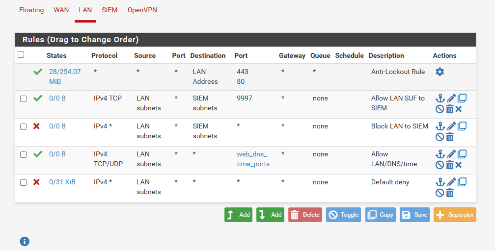
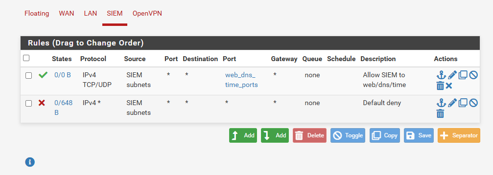
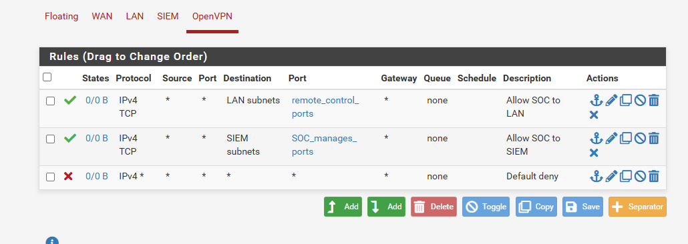

Khi thực hiện thiết lập hệ thống SOC, rule firewall được để default “allow all” để đảm bảo thông mạng giai đoạn ban đầu. Để đúng chuẩn, giống với thực tế, ta phải thực hiện default deny, chỉ cho những lưu lượng cần thiết được lưu thông trong hệ thống

:::tip

- Quy tắc ingress filtering: rule ở interface nào thì chỉ kiểm tra gói tin đi vào ở cổng đó mà thôi để tránh chồng chéo

- Do pfSense là tường lửa stateful, có ghi nhớ trạng thái nên chỉ cần một rule outbound chẳng hạn sẽ cho inbound dù interface bên trong không có rule cho phép điều đó.

- Tránh việc phải viết 2 rule vừa cho phép ra vừa cho phép vào ở 2 interface khác nhau như trong trường hợp stateless firewall

:::

# LAN {#3457b0eb61a4809cb044c52467ef7342}

web_dns_time_ports bao gồm 53, 80, 443

# SIEM {#3457b0eb61a480038ff3e0b9bd060728}

# OpenVPN {#3457b0eb61a48003bbd5fb90604d4092}

- remote_control_ports: 3389 (RDP), 5585 (WinRM)
- SOC_manages_ports: 22 (ssh), 8000 (splunk)

# WAN {#3457b0eb61a480a881a8cb988fc42cb7}

