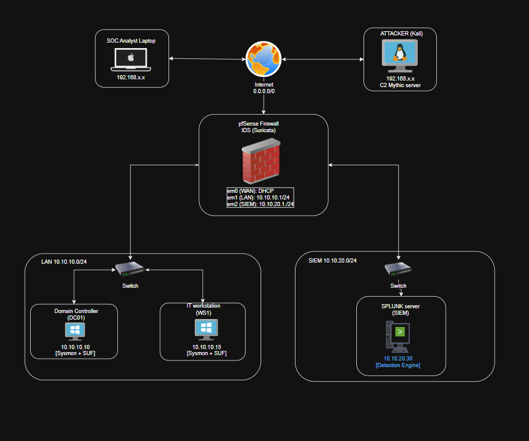
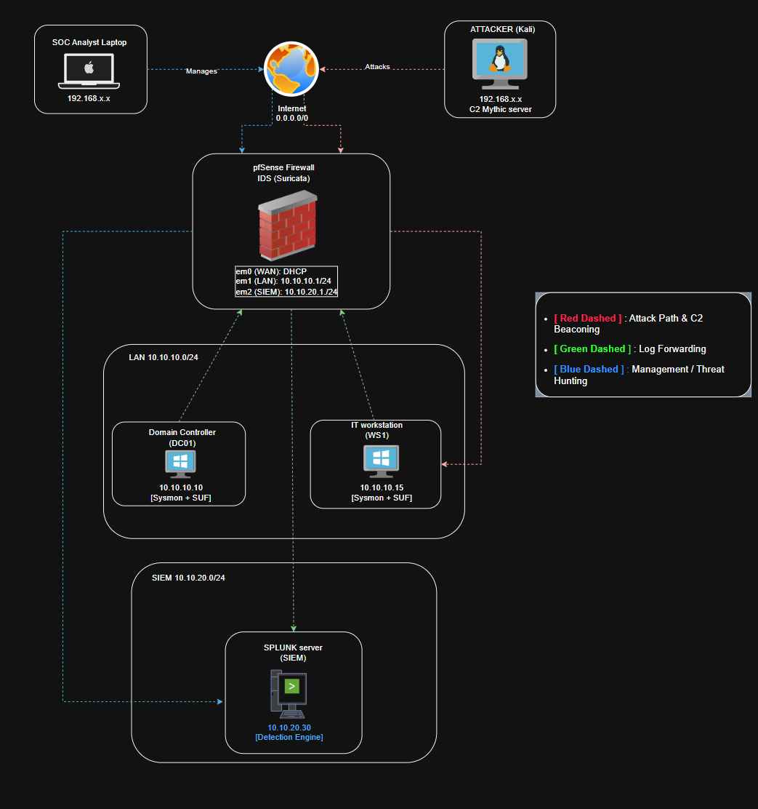

# Thiết kế hạ tầng {#33e7b0eb61a480e1b3a1da8466a96c24}

### Firewall {#33e7b0eb61a4805bb540f9576751f25f}

- Sử dụng pfSense đóng vai trò cấp IP và chia dải mạng
- Suricata với vai trò là IDS
- OpenVPN để làm tunnel cho luồng điều khiển

### LAN {#33e7b0eb61a4801b93baf8f075436a90}

- 1 windows server core (DC): quản lý domain, gộp luôn vai trò file server
- 1 windows 10 (IT workstation): máy trạm doanh nghiệp

### BlueTeam {#33e7b0eb61a480f68955e0e220f96722}

- Splunk server (containerized)

### Vùng internet: {#33e7b0eb61a480cc9753dd2226e10959}

- 1 máy kali linux: cài đặt atomic redteam hoặc caldera để đứng từ ngoài bắn payload vào

### Physical diagram {#3437b0eb61a480e789a4d3c36ca339c0}

### Logical diagram {#3437b0eb61a480b2b40df968fb856a21}

# 🎯 Kịch bản Giả lập APT29 & DFIR Playbook (11 Phases) {#33e7b0eb61a480edb8a5e097467bfeb3}

**Mô tả:** Tài liệu này ánh xạ chuỗi tấn công (Kill-chain) của chiến dịch mô phỏng APT29 vào framework MITRE ATT&CK. Kịch bản đã được tối ưu hóa cho kiến trúc Lab tinh gọn (Gồm 1 IT Workstation - WS01 và 1 Domain Controller - DC01) nhưng vẫn giữ nguyên vẹn bản chất của các kỹ thuật tấn công APT.

### Giai đoạn 1: Xâm nhập ban đầu & Thực thi (Initial Access & Execution) {#3497b0eb61a4803a9432f788992691ca}

_Kẻ tấn công lừa nạn nhân tải và thực thi mã độc tại máy trạm._

| **Step** | **Giai đoạn (Tactic)** | **Mã Kỹ Thuật** | **Tên Kỹ Thuật**                   | **Hành động trong Lab (Procedure)**                                                                                 | **Nguồn Log / Event ID kỳ vọng**                                                |
| -------- | ---------------------- | --------------- | ---------------------------------- | ------------------------------------------------------------------------------------------------------------------- | ------------------------------------------------------------------------------- |
| 1        | Initial Access         | **T1204.002**   | **User Execution: Malicious File** | User Jim truy cập web (Kali IP), tải file paycheck.rar về ổ cứng, giải nén và click đúp vào file mồi nhử bên trong. | fSense (Firewall logs), Suricata (HTTP Logs), **Sysmon EID 11 - file creation** |
| 2        | Execution              | T1059.001       | PowerShell / CMD                   | Lệnh ẩn kích hoạt tải và thực thi Agent (winupdate.exe) từ máy Kali xuống thư mục %TEMP%.                           | Sysmon EID 1 (Process Create), WinEvent 4104 (Script Block Logging)             |

### Giai đoạn 2: Bám rễ & Kết nối (Persistence & C2) {#3497b0eb61a480e8a9add097294734f0}

_Thiết lập đường hầm giao tiếp và đảm bảo mã độc sống sót qua các lần khởi động lại._

| **Step** | **Giai đoạn (Tactic)** | **Mã Kỹ Thuật** | **Tên Kỹ Thuật**  | **Hành động trong Lab (Procedure)**                                                       | **Nguồn Log / Event ID kỳ vọng**                |
| -------- | ---------------------- | --------------- | ----------------- | ----------------------------------------------------------------------------------------- | ----------------------------------------------- |
| 3        | Persistence            | T1547.001       | Registry Run Keys | Mã độc tự động ghi đường dẫn của nó vào một registry được config                          | Sysmon EID 12, 13, 14 (Registry Event)          |
| 4        | Command & Control      | T1071.001       | Web Protocols     | Tiến trình mã độc trên WS01 liên tục gọi về Mythic C2 (Kali) qua cổng 80/443 (Beaconing). | Suricata IDS, Sysmon EID 3 (Network Connection) |

### Giai đoạn 3: Leo quyền & Đánh cắp danh tính (PrivEsc & Credential) {#3497b0eb61a480b6931dd9a847a7aec7}

_Chiếm quyền cao nhất trên WS01 để bới móc bộ nhớ._

| **Step** | **Giai đoạn (Tactic)**   | **Mã Kỹ Thuật** | **Tên Kỹ Thuật**                                                 | **Hành động trong Lab (Procedure)**                                                                                                                  | **Nguồn Log / Event ID kỳ vọng**                                                                              |
| -------- | ------------------------ | --------------- | ---------------------------------------------------------------- | ---------------------------------------------------------------------------------------------------------------------------------------------------- | ------------------------------------------------------------------------------------------------------------- |
| **5**    | **Privilege Escalation** | **T1574.011**   | **Hijack Execution Flow: Service Registry Permissions Weakness** | Lợi dụng quyền Full Control trên Registry key của service `SOCUpdater`, thay đổi `ImagePath` trỏ về mã độc để chiếm quyền **SYSTEM** sau khi reboot. | **Sysmon EID 13** (Registry Value Set), WinEvent 4688/Sysmon EID 1 (Tiến trình mã độc chạy dưới quyền SYSTEM) |
| 6        | Credential Access        | T1003.001       | LSASS Memory                                                     | Dùng Mimikatz (chạy trên RAM qua Mythic), Attacker đọc tiến trình `lsass.exe` để lấy NTLM Hash của Domain Admin.                                     | **Sysmon EID 10** (Process Access targeting lsass.exe)                                                        |

### Giai đoạn 4: Lây lan & Thu thập (Lateral Movement & Collection) {#3497b0eb61a480e4bd35ed0a2049264d}

_Sử dụng "chìa khóa" vừa trộm được để mở cửa máy chủ DC01._

| **Step** | **Giai đoạn (Tactic)** | **Mã Kỹ Thuật** | **Tên Kỹ Thuật**          | **Hành động trong Lab (Procedure)**                                                                                     | **Nguồn Log / Event ID kỳ vọng**                                   |
| -------- | ---------------------- | --------------- | ------------------------- | ----------------------------------------------------------------------------------------------------------------------- | ------------------------------------------------------------------ |
| 7        | Discovery              | T1135           | Network Share Discovery   | Đứng từ WS01, Attacker rà quét IP và phát hiện máy chủ DC01 chứa AD và thư mục chia sẻ.                                 | Sysmon EID 1 (Process Create: net.exe, ping.exe)                   |
| 8        | Lateral Movement       | T1021.006       | Windows Remote Management | Dùng kỹ thuật **Pass-the-Hash** (Evil-WinRM / PsExec), Attacker nhảy thẳng vào DC01 bằng Hash mà không cần mật khẩu rõ. | WinEvent 4624 (Logon Type 3 trên DC01), Sysmon EID 1/3 (trên DC01) |
| 9        | Collection             | T1039           | Data from Network Drive   | Attacker chui vào các thư mục nhạy cảm trên DC01, nén chúng lại thành `backup.zip`.                                     | Sysmon EID 11 (FileCreate trên DC01)                               |

### Giai đoạn 5: Tống tiền (Exfiltration & Impact) {#3497b0eb61a480fe826ae2741973019f}

_Rút dữ liệu về sào huyệt và hủy diệt hệ thống._

| **Step** | **Giai đoạn (Tactic)** | **Mã Kỹ Thuật** | **Tên Kỹ Thuật**          | **Hành động trong Lab (Procedure)**                                                            | **Nguồn Log / Event ID kỳ vọng**                                        |
| -------- | ---------------------- | --------------- | ------------------------- | ---------------------------------------------------------------------------------------------- | ----------------------------------------------------------------------- |
| 10       | Exfiltration           | T1041           | Exfil Over C2 Channel     | File `backup.zip` từ DC01 được kéo ngược về máy Kali thông qua chính đường hầm Mythic.         | Suricata IDS (Phát hiện Data Transfer dung lượng lớn bất thường)        |
| 11       | Impact                 | T1486           | Data Encrypted for Impact | Mã hóa dữ liệu trên DC01/WS01 và chạy lệnh xóa bản sao lưu (Shadow Copies) để chống khôi phục. | Sysmon EID 1 (vssadmin.exe delete shadows), Sysmon EID 11 (Mass Rename) |

### Bảng Kế Hoạch Điều Tra (DFIR Forensics Plan) {#3497b0eb61a4807f92b4d21e75d96b46}

_Khi sự cố kết thúc, bạn chuyển sang chế độ Blue Team để mổ xẻ các bằng chứng (Artifacts) thu được từ WS01._

| **Giai đoạn tấn công** | **Trọng tâm phân tích**    | **Công cụ sử dụng (Lab Toolkit)** | **Bằng chứng (Artifacts) mục tiêu**                                                              |
| ---------------------- | -------------------------- | --------------------------------- | ------------------------------------------------------------------------------------------------ |
| **Execution**          | Program Execution Analysis | PECmd (Eric Zimmerman)            | **Prefetch files**: Xác định chính xác giờ phút mã độc thực thi và số lần chạy.                  |
| **Persistence**        | Autostart Analysis         | Autoruns, Registry Explorer       | **Run Keys, Scheduled Tasks**: Bóc tách cách mã độc tự khởi động lại.                            |
| **Credential**         | Memory Forensics           | Volatility 3                      | **LSASS Memory dump**: Dò tìm dấu vết của Mimikatz/Apollo nằm sót lại trên RAM.                  |
| **Lateral Mov.**       | Log Analysis (Offline)     | Event Log Explorer, Splunk        | **WinEvent 4624 Logon Type 3**: Lọc các phiên đăng nhập mạng bất thường từ WS01 sang DC01.       |
| **Impact**             | File System Forensics      | MFTExplorer, Autopsy              | **$MFT, $LogFile, $UsnJrnl**: Khôi phục dấu vết xóa file, đổi tên file hàng loạt của Ransomware. |

