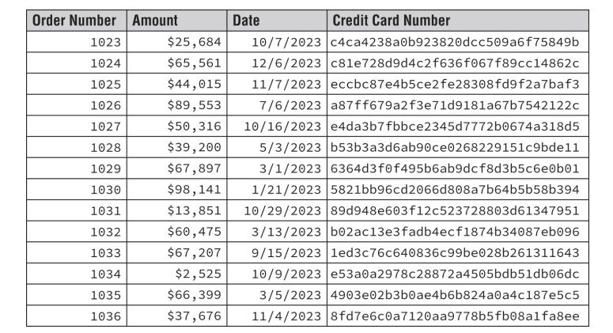

<!-- notion-metadata-start -->
*📅 Published: 2025-09-26 22:57 | 🔄 Last Updated: 2026-05-08 11:40*
<!-- notion-metadata-end -->
1. The organization that Chris works for has disabled automatic updates. What is the most common reason for disabling automatic updates for organizational systems?

A. To avoid disruption of the work process for office workers

B. To prevent security breaches due to malicious patches and updates

C. To avoid issues with problematic patches and updates

D. All of the above

2. Which of the following is the least volatile according to the forensic order of volatility?

A. The system's routing table

B. Logs

C. Temp files

D. CPU registers

3. Ed wants to trick a user into connecting to his evil twin access point (AP). What type of attack should he conduct to increase his chances of the user connecting to it?

A. A disassociation attack

B. An application denial-of-service attack

C. A known plain-text attack

D. A network denial-of-service attack

4. What term is used to describe wireless site surveys that show the relative power of access points on a diagram of the building or facility?

A. Signal surveys

B. db maps

C. AP topologies

D. Heatmaps

5. What hardware device is used to create the hardware root of trust for modern desktops and laptops?

A. System memory

B. A HSM

C. The CPU

D. The TPM

6. Angela wants to prevent users in her organization from changing their passwords repeatedly after they have been changed so that they cannot reuse their current password. What two password security settings does she need to implement to make this occur?

A. Set a password history and a minimum password age.

B. Set a password history and a complexity setting.

C. Set a password minimum and maximum age.

D. Set password complexity and maximum age.

7. Chris wants to establish a backup site that is fully ready to take over for full operations for his organization at any time. What type of site should he set up?

A. A cold site

B. A clone site

C. A hot site

D. A ready site

8. Which of the following is not a common constraint of embedded and specialized systems?

A. Computational power

B. Overly complex firewall settings

C. Lack of network connectivity

D. Inability to patch

9. Gary is reviewing his system's SSH logs and sees logins for the user named “Gary” with passwords like password1, password2 … PassworD. What type of attack has Gary discovered?

A. A dictionary attack

B. A rainbow table attack

C. A pass-the-hash attack

D. A password spraying attack

10. Kathleen wants to set up a system that allows access into a highsecurity zone from a low-security zone. What type of solution should she configure?

A. VDI

B. A container

C. A screened subnet

D. A jump server

11. Derek's organization is worried about a disgruntled employee publishing sensitive business information. What type of threat should Derek work to protect against?

A. Shoulder surfing

B. Social engineering

C. Insider threats

D. Phishing

12. Jeff is concerned about the effects that a ransomware attack might have on his organization and is designing a backup methodology that would allow the organization to quickly restore data after such an attack. What type of control is Jeff implementing?

A. Corrective

B. Preventive

C. Detective

D. Deterrent

13. Samantha is investigating a cybersecurity incident where an internal user used his computer to participate in a denial-ofservice attack against a third party. What type of policy was most likely violated?

A. BPA

B. SLA

C. AUP

D. MOU

14. Jean recently completed the user acceptance testing process and is getting her code ready to deploy. What environment should house her code before it is released for use?

A. Test

B. Production

C. Development

D. Staging

15. Rob has created a document that describes how staff in his organization can use organizationally owned devices, including if and when personal use is allowed. What type of policy has Rob created?

A. A change management policy

B. An acceptable use policy

C. An access control policy

D. A playbook

16. Oren obtained a certificate for his domain covering *.acmewidgets.net. Which one of the following domains would not be covered by this certificate?

A. www.acmewidgets.net

B. acmewidgets.net

C. test.mail.acmewidgets.net

D. mobile.acmewidgets.net

17. Richard is sending a message to Grace and would like to apply a

digital signature to the message before sending it. What key

should he use to create the digital signature?

A. Richard's private key

B. Richard's public key

C. Grace's private key

D. Grace's public key

18. Stephanie is reviewing a customer transaction database and comes across the data table shown here. What data minimization technique has most likely been used to obscure the credit card information in this table?

A. Destruction

B. Masking

C. Hashing

D. Tokenization

19. Andrew is working with his financial team to purchase a cybersecurity insurance policy to cover the financial impact of a data breach. What type of risk management strategy is he using?

A. Risk avoidance

B. Risk transference

C. Risk acceptance

D. Risk mitigation

20. Shelly is writing a document that describes the steps that incident response teams will follow upon first notice of a potential incident. What type of document is she creating?

A. Guideline

B. Standard

C. Procedure

D. Polic

## Answer sheet {#35a7b0eb61a480fe955ed950ecbc2cf3}

| 1 C  | 2 B  | 3 A  | 4 D  | 5 D  |
| ---- | ---- | ---- | ---- | ---- |
| 6 A  | 7 C  | 8 B  | 9 A  | 10 D |
| 11 C | 12 A | 13 C | 14 D | 15 B |
| 16 C | 17 A | 18 C | 19 B | 20 C |

