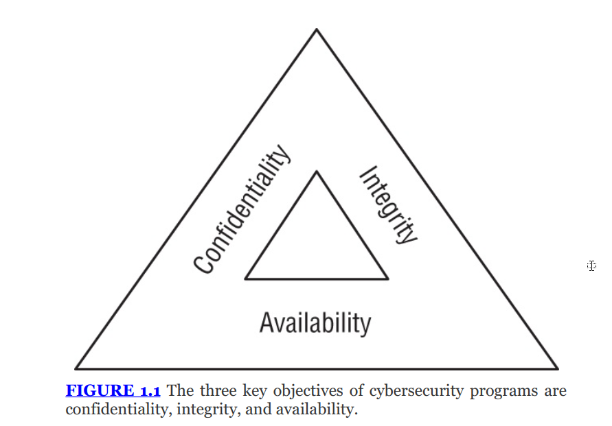

---

# THE COMPTIA SECURITY+ EXAM OBJECTIVES COVERED IN THIS CHAPTER INCLUDE: {#2b67b0eb61a480a39ec2d178efd0eefa}

### Domain 1.0: General Security Concepts {#2b67b0eb61a4808b8ce6f2ba4c8cc34c}

1.1. Compare and contrast various types of security controls.

- Categories (Technical, Managerial, Operational, Physical)
- Control Types (Preventive, Deterrent, Detective,
- Corrective, Compensating, Directive)

1.2. Summarize fundamental security concepts.

- Confidentiality, Integrity, and Availability (CIA)
- Non-repudiation
- Gap analysis

1.4. Explain the importance of using appropriate cryptographic solutions.

- Obfuscation (Tokenization, Data masking)

### Domain 3.0: Security Architecture {#2b67b0eb61a4806bb170f15eeec22868}

3.3. Compare and contrast concepts and strategies to protect data.

- General data considerations (Data states, Data at rest, Data in transit, Data in use)
- Methods to secure data (Geographic restrictions, Encryption, Hashing, Masking, Tokenization, Obfuscation, Segmentation, Permission restrictions)

### Domain 5.0: Security Program Management and Oversight {#2b67b0eb61a48085aa54ff1d80e57d61}

5.2. Explain elements of the risk management process.

- Risk identification

## Cybersecurity objectives {#2b67b0eb61a480c9a0c1dbc73ce0ece5}

### CIA triad quen thuộc: {#2b67b0eb61a48034aee4d4c3aea687a9}

- Confidentiality: unauthorized individuals không thể truy cập những thông tin không thuộc thẩm quyền
	- Biện pháp: Encryption, Access control, Firewall, 2FA
- Integrity: dữ liệu toàn vẹn khong có unauthorized modifications
	- Biện pháp: Hashing, Digital signatures, certificates, non-repudiation
	- Mối đe dọa: Hacker thay đổi dữ liệu hoặc sự cố tự nhiên (vd: tăng điện áp thay đổi dữ liệu)
- Availability: Hệ thống luôn sẵn sàng khi người dùng hợp lệ cần
	- Biện pháp: Fault tolerance, Clustering, Backups, Redundancy, Patching
	- Mối đe dọa: DDoS hoặc thiên tai

Non-repudiation: chống chối bỏ, dùng digital signatures

| **Công nghệ / Hành động**                     | **Mục tiêu bảo mật (Security Goal)**                   |
| --------------------------------------------- | ------------------------------------------------------ |
| **Encryption** (Mã hóa)                       | **Confidentiality** (Bảo mật - Giấu nội dung)          |
| **Hashing / Digital Signature** (Băm / Ký số) | **Integrity** (Toàn vẹn - Chống sửa đổi)               |
| **Redundancy / Backup** (Dự phòng / Sao lưu)  | **Availability** (Sẵn sàng - Chống sập)                |
| **Private Key Signing** (Ký bằng khóa riêng)  | **Non-repudiation** (Chống chối bỏ - "Bút sa gà chết") |

## Data breach risks {#2b67b0eb61a480919f4ae2c444e06fd0}

### DAD triad - mối đe dọa với CIA {#2b67b0eb61a480c2895ae8386c211007}

- Disclosure (tiết lộ) - ngược với confidentiality
	- Data loss or data exfiltration
- Alteration - nghịch với integrity
	- Sửa đổi thông tin trái phép
	- Ví dụ: Hacker sửa đổi giao dịch tài chính, lỗi bit flip do sự cố điện
- Denial - từ chối: nghịch với availability
	- Gián đoạn truy cập người dùng hợp lệ
	- Ví dụ: Tấn công DDoS

Nên áp dụng tư duy CIA và DAD và thực tế để phân tích rủi ro: Ví dụ trong đánh giá rủi ro của website

- Website chứa dữ liệu nhạy cảm không (disclosure),
- Nếu bị sửa (alteration)?
- Nếu bị sập (denial) thì sao?

## Breach impacts {#2b67b0eb61a4806da66de18cd3a5cbfa}

### A. Financial risk {#2b67b0eb61a48086a009d002933a8c5e}

Là thiệt hại tài chính:

- trực tiếp: về chi phí xây dựng lại data center chẳng hạn
- gián tiếp: mất laptop nhưng dữ liệu trong đó giúp đối thủ cạnh tranh

### B. Reputational risk  {#2b67b0eb61a4806582b9ec8abc8815a4}

- Mất đi tin tưởng khách hàng
- Khó đo lường
- Sidebar- identity theft: lộ dữ liệu cá nhân (PII - personally identifiable imformation)\

### C. Strategic risk {#2b67b0eb61a480fb9af4d9ffc1ec7c2e}

- Không đạt được mục tiêu lớn
- Ví dụ:
	- Mất kế hoạch sản phẩm mới vào tay đối thủ
	- Không thể ra mắt sản phẩm đúng hạn
	- Đối thủ ra mắt trước chiếm lĩnh thị trường

### D. Operational risk {#2b67b0eb61a480d5b94ac10b6846d16e}

- Ảnh hưởng tới operation hằng ngày
- Chậm trễ, thủ công thay vì tự động
- Strategic vs operational:
	- Strategic: không thể thực hiện kế hoạch kinh doanh cốt lõi
	- Operational: gây kém hiệu quả hoặc chậm trễ

### E. Compliance risk {#2b67b0eb61a4804f912de1d6dfacb1b5}

- Khiến tổ chức vi phạm pháp luật hoặc quy định

:::tip

Chú ý từ khóa khi thi:
Ví dụ: day-to-day thì là operational; fines/legal → compliance

:::

## Implementing security controls {#2b67b0eb61a48025a2bade964ad83809}

Nên nhớ: risks often cross categories: rủi ro sẽ liên quan tới nhiều mảng. Ví dụ: một vụ data breach lộ thông tin khách hàng dẫn đến:

- Reputational dmg
- Financial damage
- Compliance risk

Control objectives: mục tiêu muốn đạt được

Gap analysis: so sánh trạng thái bảo mật hiện tại và trạng thái mong muốn - khoảng cách chênh lệch chính là gap

### Security control categories {#2b67b0eb61a480d7b1d6fc3b0b919e3d}

CompTIA phân loại các biện pháp kiểm soát dựa trên (mechanism of action)

- Technical controls: sử dụng công nghệ
	- Firewall rules, ACLs, IPS (intrusion prevention system), Encryption
- Operational controls: quy trình thực hiện hằng ngày (day-to-day)
	- User access reviews, log monitoring, vunerability management
- Managerial control: tập trung vào quản trị rủi ro và các thủ tục hành chính
	- Risk acessments, security planning, change management
- Physical controls: Ngăn chặn tiếp cận thực tế
	- Fences (hàng rào), locks (khóa), fire suppression systems

### Security control types (các loại hình kiểm soát bảo mật) {#2b67b0eb61a48005918dcc031b09b711}

- Preventive controls: ngăn chặn trước khi xảy ra, các biện pháp thực tế, cản vật lý
	- firewalls, encryption, guard shack, door lock, onboard policy,
- Deterent controls: răn đe làm nản lòng kẻ tấn công, thường là rào cản tâm lý không phải thực tế
	- Chó dữ, biển cảnh báo, dây thép gai, splash screen, demotion, reception desk,
- Detective controls: nhận diện sự cố đang hoặc đã xảy ra
	- IDS, camera giám sát, system log, review login report, patrol, motion detectors
- Corrective controls: sửa chữa hậu quả sau khi nó đã xảy ra
	- Restoring backups sau khi bị ransomware, backup, policy for reporting issue, contact authorities, fire extinguisher
- Directive controls: hướng dẫn nhân viên cách xử lý đúng
	- Policies, procedures, file storage policy, complaince policy, security policy training, sign: unauthorized personnel only
- Compensating controls: Là biện pháp đặc biệt, được sử dụng khi không thể đáp ứng các biện pháp đã nêu (chi phí, hạn chế kĩ thuật)
	- Vd: bạn cần chạy một hệ điều hành cũ, không còn cập nhật để phục vụ mục đích nào đó, thì cần phải compensating control: cô lập máy tính đó vào một mạng riêng không cho kết nối internet
	- Block instead of patch, separation of duties, require multiple security staff, power generator
	- Khi sự cố xảy ra, những thứ **cố định** (như Công suất thiết kế) là sự đã rồi. Những thứ **biến động** (Nhiên liệu cạn, Dầu nhớt bẩn, Máy nóng) mới là thứ giết chết hệ thống của bạn.

Chuẩn PCI DSS (payment card industry data security standard):

- Là một quy định về compensating control. Để đảm bảo compensating control đạt yêu cầu:
	- Meet the intent and rigor of the original requirement: ý đồ và độ nghiêm ngặt
	- Provide a similar level of defense
	- Must be "above and beyond" other PCI DSS requirements: phải là một mục khác với mục PCI DSS đã yêu cầu
- Trong nhiều trường hợp, tổ chức áp dụng **Compensating controls** như một giải pháp cho các **Temporary exception** (ngoại lệ tạm thời) đối với yêu cầu bảo mật.
- Khi đó, tổ chức cũng nên xây dựng các **Remediation plans** (kế hoạch khắc phục).
- Mục tiêu của kế hoạch này là đưa tổ chức quay trở lại trạng thái **Compliance** (tuân thủ) đúng với nghĩa đen và ý định của biện pháp kiểm soát gốc ban đầu (ví dụ: kế hoạch nâng cấp phần mềm để sau này có thể cài OS mới nhất thay vì cứ phải cô lập máy mãi).

:::tip

Categories khác với types:
- Categories: là cái gì, ai làm - ví dụ: về kĩ thuật, điều hành, hoạt động hằng ngày,…

- Types: thường liên quan tới giai đoạn

Ví dụ đối với camera an ninh: về categories nó có thể là physical control hoặc technical control

 Về types: detective control - do quay để xem lại sau, deterent - để răn đe người khác
Hàng rào - physical, còn types là preventive

:::

### Data protection {#2b67b0eb61a480e0bb69da9b262274f5}

Cần nắm vững bảo vệ tài sản quan trọng nhất: dữ liệu. Các trạng thái của nó:

- Data at rest: lưu trữ trên ổ cứng, USB, cloud
	- Nguy cơ: Mất trộm thiết bị
	- Bảo vệ: FDE
- Data in transit: đang di chuyển qua mạng
	- Bị nghe lén eavesdropping
	- Bảo vệ: TLS
- Data in use: dữ liệu đang xử lý trong CPU or RAM
	- Nguy cơ: kẻ tấn công đã kiểm soát hệ thống có thể đọc nó từ bộ nhớ
	- Để bảo vệ dùng với secure enclave trên điện thoại
	- Còn trên PC/server thì có các công nghệ của intel SGX, Windows VBS (dùng ảo hóa hyper-V để tạo ra máy ảo và cất thông tin vào VBS này), AMD SEV thường dùng cho cloud

### Data encryption {#2b67b0eb61a480c39209fd3f14a581a9}

Để bảo vệ data thì cần encryption

### Data loss prevention {#2b67b0eb61a48078b1f0f2c2176cdba6}

- DLP: Data loss prevention
- Agent-based DLP: cài đặt phần mềm trực tiếp lên máy tính người dùng
	- **Rủi ro:** Bản thân cái Agent này cũng là một phần mềm. Nếu Agent có lỗ hổng bảo mật (ví dụ: Log4j nằm trong Agent), hacker có thể tấn công vào Agent để chiếm quyền điều khiển máy tính đó. Agent trở thành một **bề mặt tấn công (attack surface)** mới.
- Agentless DLP (network based): thiết bị cài đặt trên đường mạng, giám sát lưu lượng ra/vào để chặn các gói tin chứa dữ liệu nhạy cảm không được mã hóa
	- Hệ thống quản lý trung tâm sẽ kết nối trực tiếp đến máy tính cần quản lý thông qua các giao thức chuẩn có sẵn (như SSH, WMI, WinRM) để lấy thông tin.
	- **Lợi ích bảo mật:** Vì không phải cài thêm phần mềm lạ (Agent) vào máy, nên bạn loại bỏ được hoàn toàn rủi ro bị hack qua lỗ hổng của Agent đó. Đây là sự khác biệt chính về vector tấn công.

---

Cơ chế hoạt động của DLP

- Pattern matching: tìm kiếm các mẫu kí tự đặc biệt (ví dụ: định dạng số thẻ tín dụng hoặc số an sinh xã hội) trigger khi thấy thông tin này bị chuyển ra ngoài
	- Ví dụ một nhân viên HR định gửi danh sách lương thưởng của cả công ty về gmail để làm ở nhà. DPL (network based) phát hiện số an sinh xã hội và ngăn chặn gửi đi đồng thời báo về IT security.
- Watermarking: gắn các thẻ điện tử (tags) vào tài liệu nhạy cảm để hệ thống DLP nhận diện, thường dùng trong DRM (digital rights management)
	- Giám đốc soạn thảo văn bản và gán nhãn mật, DLP hoạt động khi văn bản này được upload lên google drive, DLP đọc tag và phát hiện, chặn upload

### Data minimization {#2b67b0eb61a480eeb78ff5f98063a93d}

cách tốt nhất để giảm rủi ro là gửi ít dữ liệu nhạy cảm nhất có thể. Nếu phải gửi hãy biến đổi nó:

- Deidentification: loại bỏ khả năng liên kết dữ liệu với một cá nhân nào đó
- Data obfuscation:
	- Hashing: không phải obfuscation cũng như encryption
		- Obfuscation: làm mờ nhưng người có thẩm quyền sẽ có cách nhận ra dữ liệu cũ
		- Encryption: có thể giải mã để lấy lại dữ liệu cũ
		- Hashing: để là dấu vân tay để xác định tính toàn vẹn của dữ liệu
	- Tokenization: thay thế dữ liệu nhạy cảm ví dụ như số thẻ tín dụng bằng một chuỗi ngẫu nhiên. Dùng bảng lookup table để tra cứu, bảng phải được bảo vệ kỹ
		- Dữ liệu và token không có sự liên quan toán học nào, nó vô nghĩa
		- Thường dựa trên hash function
		- Dùng cho cổng thanh toán, lưu trữ thẻ tín dụng
	- Masking: thay thế một phần dữ liệu bằng ký tự ẩn như `x, *` chỉ để lại một phần thông tin để xác nhận
		- Dùng cho: màn hình CSKH, môi trường test/dev
	- Steganography: giấu tin trong tin. Vd giấu thông điệp bí mật trong file vô hại như ảnh, file mp3, video,…

Lưu ý chút về rainbow table chứa hash của những mật khẩu phổ biến - cái này dùng salt được

### Access restrictions {#2b67b0eb61a48071bb0ad6a35ffd6fc1}

- Geographic restrictions: giới hạn địa lý truy cập
- Permission restriction: giới hạn về quyền
- Segmentation: đặt các hệ thống nhạy cảm vào một mạng riêng biệt, nhưng vẫn có thể giao tiếp ví dụ như chia VLAN cho server
- Isolation: cắt kết nối hoàn toàn
	- ví dụ như máy tính điều khiển nhà máy hạt nhân hoặc hệ thống tên lửa không hề kết nối internet
	- Sandbox: như một VM được isolated để phân tích file nào đó.

## Summary & Exam Essentials {#2b67b0eb61a4802582c7c310d5fa8aee}

- Mục tiêu cốt lõi là **CIA Triad**.
- Các biện pháp kiểm soát (Controls) cần được phối hợp đa dạng: từ _Managerial, Operational, Technical, Physical_ cho đến _Preventive, Detective, Corrective..._

### 1. The Three Core Objectives of Cybersecurity {#2b67b0eb61a48055a777c3df479cbc9c}

Sách khẳng định lại nền tảng của mọi chương trình bảo mật là **CIA Triad**:

- **Confidentiality (Tính bảo mật):** Đảm bảo rằng những cá nhân không được ủy quyền (_unauthorized individuals_) không thể truy cập vào thông tin nhạy cảm.
- **Integrity (Tính toàn vẹn):** Đảm bảo không có sự sửa đổi trái phép (_unauthorized modifications_) đối với thông tin hoặc hệ thống, dù là cố ý (_intentionally_) hay vô ý (_unintentionally_).
- **Availability (Tính sẵn sàng):** Đảm bảo hệ thống và thông tin luôn sẵn sàng đáp ứng nhu cầu của người dùng hợp lệ (_legitimate users_) ngay khi họ cần.

### 2. Nonrepudiation {#2b67b0eb61a48068a173c23ecab0086e}

- **Định nghĩa:** Ngăn chặn một người phủ nhận rằng họ đã thực hiện một hành động (_denying that they took an action_).
- **Cơ chế:** Nếu ai đó thực hiện hành động (như gửi tin nhắn), họ không thể sau đó chối là mình không làm.
- **Ví dụ:** **Digital signatures** (Chữ ký số) là ví dụ phổ biến nhất. Nó cho phép bất kỳ ai cũng có thể xác nhận tin nhắn thực sự đến từ người gửi được xưng danh.

### 3. Security Controls Categorization {#2b67b0eb61a48052aaf9c1a2ed152119}

Sách tóm tắt lại cách phân chia các _Security Controls_ dựa trên hai tiêu chí:

1. **Based on Mechanism of Action (Dựa trên cơ chế hoạt động):**
	- **Managerial** (Quản lý).
	- **Operational** (Vận hành).
	- **Physical** (Vật lý).
	- **Technical** (Kỹ thuật).
2. **Based on Intent (Dựa trên mục đích):**
	- **Preventive** (Phòng ngừa).
	- **Detective** (Phát hiện).
	- **Corrective** (Khắc phục).
	- **Deterrent** (Răn đe).
	- **Compensating** (Bù trừ).
	- **Directive** (Chỉ thị).

### 4. Data Breach Impacts {#2b67b0eb61a48054863bd490aac6014f}

Khi xảy ra **Data breach**, hậu quả rất đa dạng và nghiêm trọng:

- **Direct damages (Thiệt hại trực tiếp):** Tác động tài chính tức thời (_immediate financial repercussions_) như chi phí phản ứng sự cố (_incident response_).
- **Indirect/Long-term damages (Thiệt hại gián tiếp/dài hạn):** Tổn hại danh tiếng (_reputational damage_). Loại này khó đo đếm bằng tiền nhưng ảnh hưởng rất lâu dài.
- **Operational damage (Thiệt hại vận hành):** Nếu sự cố gây mất tính sẵn sàng (_availability damages_), tổ chức không thể truy cập thông tin của chính mình để làm việc.

### 5. Data States {#2b67b0eb61a4807e8c0cf815aa988044}

Dữ liệu phải được bảo vệ ở cả 3 trạng thái:

1. **Data in transit (Dữ liệu đang di chuyển):**
	- Nguy cơ: Kẻ tấn công nghe lén (_eavesdrop_) đường truyền mạng.
	- Bảo vệ: Bắt buộc dùng **Encryption** (Mã hóa).
2. **Data at rest (Dữ liệu đang lưu trữ):**
	- Nguy cơ: Kẻ tấn công xâm nhập kho dữ liệu hoặc trộm thiết bị.
	- Bảo vệ: Dùng **Encryption** cho ổ cứng/database.
3. **Data in use (Dữ liệu đang sử dụng):**
	- Nguy cơ: Dữ liệu dễ bị tổn thương khi đang được xử lý trên hệ thống.
	- Bảo vệ: Bảo vệ trong quá trình xử lý (_data processing activities_).

### 6. Data Loss Prevention - DLP {#2b67b0eb61a480f3ae2fc909b31dbe17}

Hệ thống **DLP** ngăn chặn các nỗ lực tuồn dữ liệu ra ngoài (_data exfiltration attempts_) và thực thi chính sách xử lý thông tin. DLP hoạt động ở 2 cấp độ:

- **Host-based (Tại máy chủ/máy trạm):** Sử dụng các _software agents_ cài trên máy để quét tìm thông tin nhạy cảm lưu trên hệ thống đó.
- **Network-based (Tại mạng):** Giám sát đường truyền mạng, canh chừng các gói tin chứa thông tin nhạy cảm chưa được mã hóa (_unencrypted sensitive information_).

**Công nghệ nhận diện của DLP:**

- **Pattern-matching:** So khớp mẫu (ví dụ: định dạng số thẻ tín dụng).
- **Digital watermarking:** Nhận diện các dấu mờ kỹ thuật số được gắn vào tài liệu.

### 7. Data Minimization {#2b67b0eb61a480f8bc8af40cc34dd403}

Đây là cách giảm rủi ro bằng việc giảm lượng thông tin nhạy cảm mà tổ chức lưu giữ.

- **Cách tốt nhất:** Hủy bỏ dữ liệu không cần thiết.
- **Nếu không thể hủy:** Phải bảo vệ thông tin thông qua **Deidentification** (Phi định danh) và **Data obfuscation** (Làm mờ dữ liệu).

**Các công cụ để thực hiện Obfuscation:**

- **Hashing:** Băm dữ liệu.
- **Tokenization:** Dùng thẻ bài thay thế dữ liệu thật.
- **Masking:** Che giấu các trường nhạy cảm (ví dụ: `***-****-****-1234`).
