---


# THE COMPTIA SECURITY+ EXAM OBJECTIVES COVERED IN THIS CHAPTER INCLUDE: {#2bd7b0eb61a480e58916d2e1a563cba7}


## Domain 2.0: Threats, Vulnerabilities, and Mitigations {#2bd7b0eb61a480288e4fda39d3fcf1e6}


### 2.3. Explain various types of vulnerabilities. {#2bd7b0eb61a480a5a613fd4b105a5d1a}

- Virtualization (Virtual machine (VM) escape, Resource reuse)
- Cloud-specific

## Domain 3.0: Security Architecture {#2bd7b0eb61a480c19db4d68da108a6d5}


### 3.1. Compare and contrast security implications of different architecture models. {#2bd7b0eb61a480b19243ceaa46858af9}

- Architecture and infrastructure concepts (Cloud, (Responsibility matrix, Hybrid considerations, Thirdparty vendors), Infrastructure as code (IaC), Serverless, Microservices, On-premises, Centralized vs. decentralized, Containerization, Virtualization)

### 3.3. Compare and contrast concepts and strategies to protect data. {#2bd7b0eb61a480819871c89fe41250cb}

- General data considerations (Data sovereignty)

## Domain 4.0: Security Operations {#2bd7b0eb61a48098acf1e4e79c844e1a}


### 4.1. Given a scenario, apply common security techniques to computing resources. {#2bd7b0eb61a480abb6f2db286e74e31b}


Hardening targets (Cloud infrastructure)


---


## Exploring the Cloud {#2bd7b0eb61a4807cbca2f2f45466a729}


Định nghĩa của NIST - National Institute of Standard and Technology về Cloud:

- Là mô hình cho phé truy cập mạng thuận tiện, mọi lúc mọi nơi (ubiquitous, convenient, on-demand network access) tới một hồ chứa tài nguyên chia sẻ như mạng, máy chủ, lưu trữ
- Tài nguyên này có thể được cung cấp và giải phóng nhanh chóng với nỗ lực quản lý tối thiểu
- Broad network access: truy cập từ bất cứ đâu
- **Resource pooling (Multitenancy):**
	- Nhiều khách hàng (tenants) cùng chia sẻ một hạ tầng phần cứng vật lý.
	- Khách hàng không biết dữ liệu của mình đang nằm cạnh dữ liệu của ai, nhưng hạ tầng logic được tách biệt.

## Benefits of the cloud {#2bd7b0eb61a4809fa2fcf6fc135c74ff}

- On-demand self-service computing: bạn có thể tự tạo server hoặc tài nguyên ngay khi cần mà không cần gọi điện nhờ nhân viên IT
- Scalability: scale một cách âm thầm (transparent) mà người dùng không cần biết
	- Vertical: làm server mạnh lên nhưng chỉ cần vài cú click chuột
	- Horizontal: thêm nhiều server vào cụm. Ví dụ: web chịu tải 2000 user, khi lên 3000 thì tự thêm server
- Elasticity: khả năng tự mở rộng khi có tải và co lại (contract) khi tải thấp để tiết kiệm chi phí
- Measured service: mọi thứ đều đong đếm bởi nhà cung cấp cloud của bạn. Chỉ cần trả tiền cho những gì bạn dùng
- Agility and flexibility: nhanh chóng, không cần nhiều nỗ lực tốn kém

## Cloud roles {#2bd7b0eb61a480fc9580f829f8c28514}


Có 5 vai trò chính cần phân biệt:

- Cloud service providers (CSP): nhà cung cấp dịch vụ (AWS, Microsoft, Google). Họ sở hữu datacenter và bán dịch vụ
- Cloud consumers: tổ chức/cá nhân sử dụng
- Cloud partners (cloud brokers): bên thứ 3 cung cấp dịch vụ hỗ trợ hoặc tư vấn để khách hàng sử dụng cloud hiệu quả hơn
- Cloud auditors: tổ chức độc lập kiểm toán, đánh giá an ninh của đám mây
- Cloud carriers: bên trung gian cung cấp kết nối mạng giữa provider và consumers

## Cloud service models {#2bd7b0eb61a480fea96af417e1244e2b}


Các service cloud được chia thành 4 types


### Infrastructure as a Service (IaaS) {#2bd7b0eb61a480a19068fafce91bbe3c}

- Mô tả: bạn thuê những viên gạch cơ bản - máy chủ, ổ cứng, mạng - dành cho hệ điều hành, ảo hóa
- Trách nhiệm: nhà cung cấp lo phần cứng, vật lý, điều hòa,… Bạn cài OS, vá lỗi, cài đặt ứng dụng, và bảo mật dữ liệu
- Provider cũng cung cấp các biện pháp bảo mật để tránh người dùng nghe lén thông tin của nhau
- Ví dụ: Amazon EC2, Azure VM, Google Compute Engine (GCP), AWS
- **Trong công nghệ:** Nhà cung cấp (AWS, Azure) cho bạn thuê **Máy chủ ảo (VPS), Ổ cứng, Mạng**. Bạn phải tự cài Windows/Linux, tự cài Database, tự cài phần mềm và lo bảo mật cho nó.
	- _Sản phẩm điển hình:_ Amazon EC2, Google Compute Engine, DigitalOcean Droplet.
	- _Ai dùng:_ SysAdmin, DevOps (những người thích tự do cấu hình mọi thứ).

### Software as a Service (SaaS) {#2bd7b0eb61a4806dbea6fbaa28cc5b45}

- Bạn thuê phần mềm hoàn chỉnh
- Trách nhiệm: nhà cung cấp lo tất cả (phần cứng, phần mềm). Bạn chỉ việc dùng
- Ứng dụng rộng rãi từ email tới ERP và Customer relationship management (CRM)
- Ví dụ: Gmail, SaleForce (CRM), Microsoft365). Người dùng có thể dùng thiết bị thin client (cấu hình thấp) để truy cập
- **Trong công nghệ:** Bạn dùng phần mềm qua trình duyệt web. Không cần cài đặt, không cần lo server nằm ở đâu, dữ liệu lưu thế nào.
	- _Sản phẩm điển hình:_ Gmail, Google Drive, Facebook, Netflix, Zoom, Slack.
	- _Ai dùng:_ Người dùng cuối (End-user).

### Platform as a Service (PaaS) {#2bd7b0eb61a4802288c9cff868231414}

- Điểm giữa của IaaS và SaaS. Dành cho dev chủ yếu là code
- Nhà cung cấp đưa bạn một nền tảng (môi trường chạy code, thư viện). Bạn chỉ cần mang code (ứng dụng) của mình lên chạy mà không cần quan tâm server bên dưới.
- Ví dụ: Google app engine, AWS Elastic Beanstalk
- **Trong công nghệ:** Nhà cung cấp lo sẵn phần cứng, hệ điều hành và các công cụ lập trình (Java, Python, .NET...). Bạn chỉ việc **upload code của bạn lên và chạy**.
	- _Sản phẩm điển hình:_ Heroku, Google App Engine, AWS Elastic Beanstalk.
	- _Ai dùng:_ Developer (Lập trình viên muốn tập trung viết code, không muốn lo cài Win/Linux).

:::tip

- **IaaS:** Quản lý Máy ảo (VM), **Container**, Mạng, Ổ cứng. (Keyword: _Containerization service, Scalability of resources_).

- **PaaS:** Quản lý **Code**, Database, Môi trường phát triển. (Keyword: _Application logic, Developers, No OS access_) - monolithic

- **SaaS:** Dùng phần mềm có sẵn. (Keyword: _End-user, Gmail, Office 365_).

- **FaaS (Function as a Service):**

:::


### Function as a Service (FaaS)/Serverless {#2bd7b0eb61a4804ba560fff29715af01}


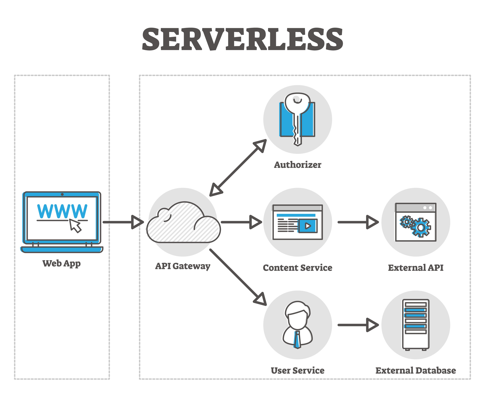

- Bạn tải lên một đoạn code nhỏ. Code này chỉ chạy khi có trigger nào đó và tắt ngay sau đó
	- Những trường hợp cần, chỉ cần chạy một lần mà áp dụng với nhiều khách
	- Ví dụ: _"Mỗi sáng lúc 8h, gửi tin nhắn báo thời tiết vào nhóm chat công ty"_
		- _Khi khách hàng bấm nút 'Nhận mã giảm giá', tạo ra một mã và gửi cho họ"_. Có 1 triệu khách thì áp lực lên server lớn, nếu dùng cloud thì dễ hơn
- Serverless là có server nhưng ẩn đi hoàn toàn (transparent) với khách hàng
- Ví dụ: AWS Lambda. Code chạy để đọc nhiệt độ từ cảm biến IoT
- **Trong công nghệ:** Bạn viết một hàm nhỏ (ví dụ: "Khi có người upload ảnh -&gt; Tự động thu nhỏ ảnh"). Mã lệnh này chỉ chạy khi có ai đó upload ảnh, chạy xong thì tắt ngay lập tức. **Bạn trả tiền theo số lần chạy (từng mili-giây)**, không chạy thì không tốn tiền.
	- _Sản phẩm điển hình:_ AWS Lambda, Google Cloud Functions, Azure Functions.
	- _Ai dùng:_ Architect, Developer (dùng cho các tác vụ nhỏ lẻ, xử lý sự kiện).

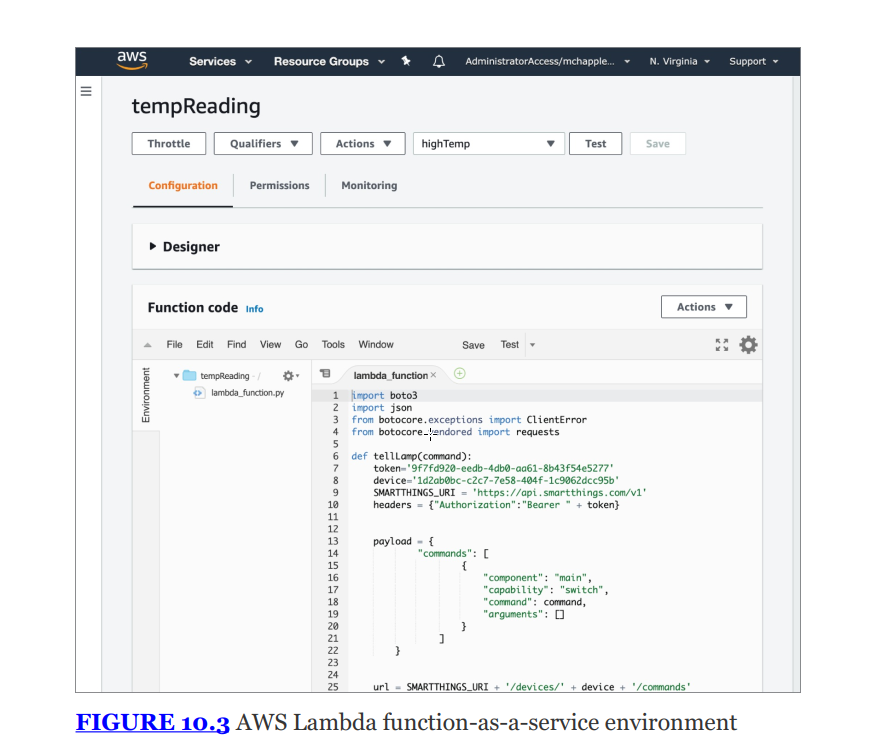


:::tip

Nhược điểm:
- Tốn tiền, tấn công DDoS dạng resource exhaustion - DoW (denial of wallet)

- Serverless không phù hợp cho ứng dụng phức tạp, monolithic hoặc các tác vụ cần chạy trong thời gian dài

- Các functions trong serverless thường giới hạn thời gian chạy. VD: AWS Lambda giới hạn 15 phút.

- Khó quản lý: Ứng dụng bị chia nhỏ thành hàng trăm serverless rời rạc, monitoring, debugging, quản lý trạng thái đều khó hơn rất nhiều

Ưu điểm:

- Không cần quản trị viên hệ thống để cập nhật phần cứng, hệ điều hành hay vá lỗi

- Auto-scaling: tăng giảm sử dụng tùy úy

:::


## Managed services {#2bd7b0eb61a480a19193edc8d1d3ee15}

- Managed services providers (MSPs): các công ty IT bên ngoài giúp quản lý hạ tầng công nghệ (monitoring, cloud cost management, network design) cho tổ chức của bạn
	- Hoạt động on-premises lẫn cloud
- Managed security service providers (MSSPs): Chuyên biệt về **Bảo mật**. Họ cung cấp dịch vụ giám sát an ninh, quản lý tường lửa, quét lỗ hổng và phản ứng sự cố (**incident response**).

## Cloud deployment models {#2bd7b0eb61a480c7ab40cbf6a2849b2a}


Làm thế nào một dịch vụ được chuyển tới khách hàng và resources đó có chia sẻ với người khác không


### Public cloud {#2bd7b0eb61a480ca8992f6d3ded0bdde}

- Mô hình phổ biến nhất (AWS, Azure, GCP)
- Nhà cung cấp xây dựng cơ sở hạ tầng và cung cấp cho bất kỳ khách hàng nào muốn sử dụng theo mô hình multitenant (đa thuê bao - nhiều khác hàng cùng chia sẻ hạ tầng vật lý)
- Các dịch vụ (IaaS, PaaS, SaaS) chạy trên hạ tầng chung

### Private cloud {#2bd7b0eb61a480ec9f91c0a91ca6854a}

- Là hạ tầng đám mây được cung cấp để sử dụng bởi một khách hàng duy nhất (**single customer**).
- Hạ tầng này có thể do chính tổ chức đó tự xây dựng và quản lý (on-premises) hoặc thuê bên thứ ba quản lý.
- Mô hình này chỉ có một khách hàng sử dụng nên có thể excess unused capacity xảy ra.

---


### The Intelligence Community Leverages a “Private Public” Cloud {#2bd7b0eb61a480879b4bddd224a99b3f}

- U.S. intelligence community (IC) là một trong những khách hàng lớn nhất thế giới sử dụng cloud.
- hợp tác với AWS để tạo ra vùng **AWS Commercial Cloud Services (C2S)**. Đây là một ví dụ thú vị: Về mặt kỹ thuật nó giống **Private Cloud** (dành riêng cho IC, air-gapped - ngắt kết nối vật lý với internet), nhưng lại sử dụng công nghệ của **Public Cloud**. Sau này, khi các vùng "Secret" được mở rộng cho nhiều cơ quan chính phủ khác nhau, nó phù hợp với định nghĩa của **Community Cloud** hơn.

### Community cloud {#2bd7b0eb61a48060943eccd45e4f1210}

- chia sẻ đặc điểm của public và private cloud
- Chạy trên môi trường multitenant, nhưng giới hạn thuê là thành viên của cộng đồng có chung sứ mệnh
- _Ví dụ trong sách (Figure 10.4):_ **HathiTrust** là một ví dụ về Community Cloud, nơi các thư viện nghiên cứu học thuật hợp tác để chia sẻ bộ sưu tập số cho sinh viên và giảng viên của các trường thành viên.

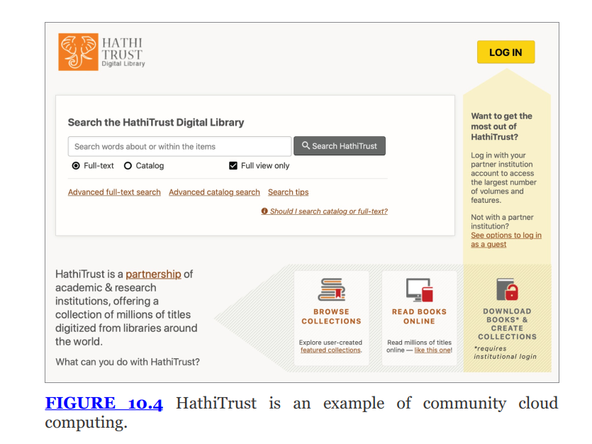


### Hybrid cloud {#2bd7b0eb61a4808da20aeb4ac9f1369b}

- Kết hợp public, private, community cloud
- Không đơn thuần là mua các dịch vụ khác nhau và dùng song song, mà phải có công nghệ để unify chúng thành một nền tảng
- Public cloud bursting: doanh nghiệp chạy trên private cloud nhưng khi nhu cầu tăng, họ tràn sang public cloud để xử lý phần thừa
- Decentralized approach: giúp giảm thiểu SPOF bằng các phân tán thành phần công nghệ
- Vd: **AWS Outposts**. Khách hàng nhận một tủ rack thiết bị từ AWS đặt tại trung tâm dữ liệu của chính họ (on-premises). Thiết bị này do AWS bảo trì nhưng được quản lý thông qua cùng một giao diện với AWS Public Cloud.

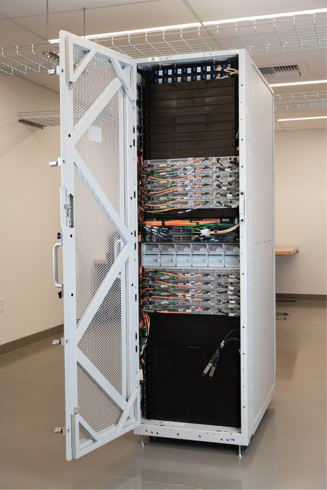


## Shared responsibility model {#2bd7b0eb61a48022b3a0c394b6c94d26}


Là khái niệm quan trọng trong cloud sec, ai là bên chịu trách nhiệm cho từng phần

- Nguyên tắc chung:
	- Bất kể hệ thống đặt ở đâu thì CIA triad vẫn phải đảm bảo
	- Với cloud: trách nhiệm được chia sẻ giữa cloud provider và customer
	- Việc chia sẻ này gọi là shared responsibility model hoặc responsibility matrix

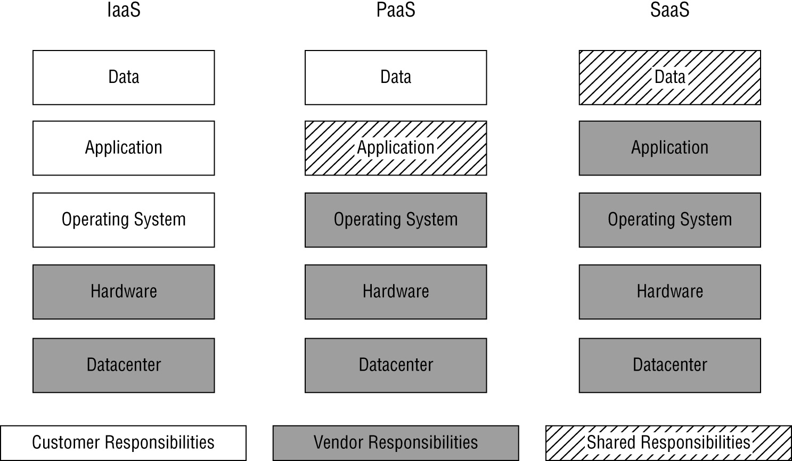


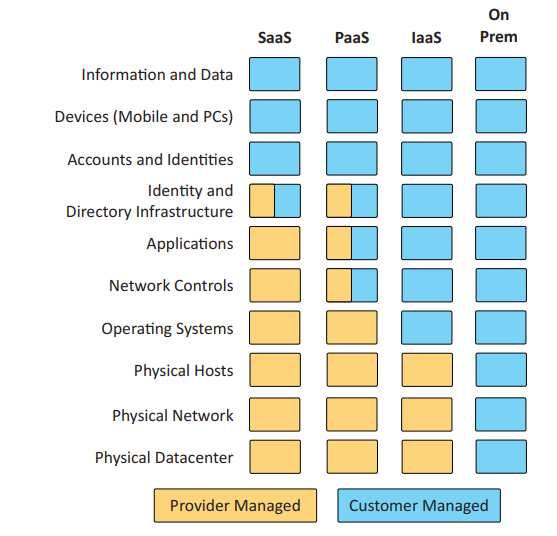


Phân chia trách nhiệm theo các loại dịch vụ đám mây:

- Hardware & datacenter: CSP luôn là bên lo phần này
- IaaS:
	- Provider chịu hardware, datacenter
	- Customer: data, application, OS xảy ra chuyện gì thì phải patch
- PaaS:
	- Provider chịu hardware, datacenter, OS và môi trường chạy application (shared)
	- Customer chịu: data và application (mã nguồn, cấu hình bảo mật của ứng dụng)
- SaaS:
	- Provider: chịu trách nhiệm gần hết các tác vụ
	- Customer: chịu trách nhiệm về data họ đưa lên và configuration of access control cho data đó

Lưu ý: cần ghi rõ ràng sự phân chia trách nhiệm này bằng văn bản, đặc biệt khi cần tuân thủ các quy định như PDI DSS.


## Cloud standards and guidelines {#2bd7b0eb61a48001a70afbc32f8d5c75}


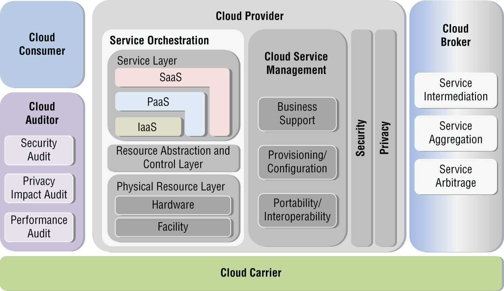


### Chuẩn NIST cloud Reference architecture:  {#2bd7b0eb61a480ed80c1d36aac8780c9}

- Được công bố trong tài liệu NIST SP 500-292
- Cung cấp hệ thống taxonomy cho dịch vụ đám mây với các vai trò như:
	- Cloud consumer
	- Cloud provider:
		- Physical resource layer: là phần cứng thật (server, ổ cứng, dây điện, tòa nhà datacenter)
		- Resource abstraction: là hypervisor/VMware, giúp chia nhỏ server vật lý thành VM hoặc container
		- Service layer: SaaS, PaaS, IaaS
		- Cloud service management: bộ phận quản lý kinh doanh và kỹ thuật
		- Security and privacy: áp dụng ở mọi thứ trong cloud provider
	- Cloud auditor: Security, privacy, performance
	- Cloud broker:
		- service intermediation: môi giới dịch vụ, giúp bạn dùng dịch vụ dễ hơn
		- aggregation: gom nhiều dịch vụ từ nhiều nhà cung cấp lại thành một
		- arbitrage: mua sỉ bán lẻ
	- Cloud carrier: Các nhà mạng viễn thông (ISP) như VNPT, FPT, Viettel…
		- Cung cấp hạ tầng cáp quang, 4g/5g để nối 4 ông trên với nhau.

### Cloud security alliance (CSA) {#2bd7b0eb61a480aba79aef289ad4f358}

- Là tổ chức công nghiệp tập trung phát triển các ‘best practice’ cho bảo mật đám mây
- Cloud controls matrix (CCM): một bảng tính để các tổ chức hiểu biện pháp security controls phù hợp và ánh xạ tới các tiêu chuẩn quy định khác nhau

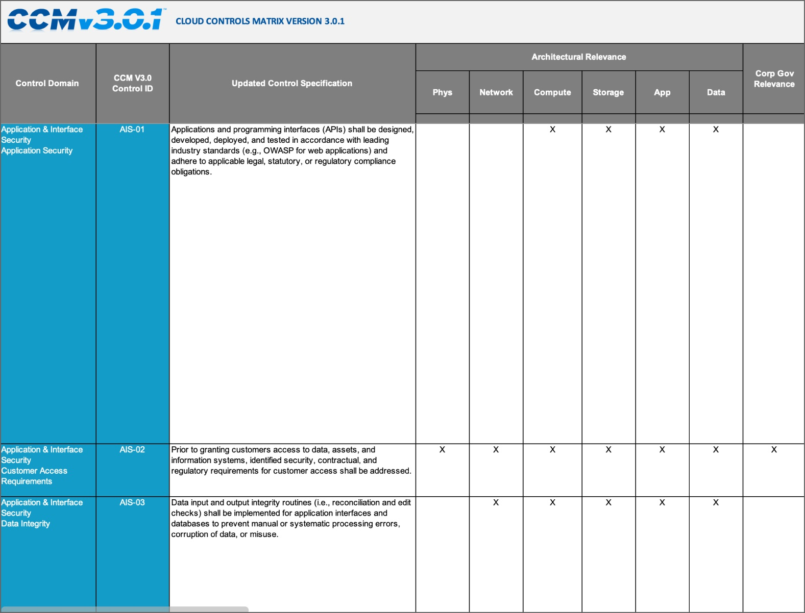


### Edge computing & fog computing {#2bd7b0eb61a48079b7a3f5cad8d8b80e}


Sự bùng nổ của IoT đã thay đổi cách cung cấp dịch vụ điện toán

- Vấn đề: trong các tình huống cảm biến (sensors) đặt ở nơi xa xôi, kết nối mạng kém (vd: nhà máy, cánh đồng, ngoài vũ trụ), việc gửi toàn bộ dữ liệu thô về cloud để xử lý là không hiệu quả và không khả thi
- Edge computing:
	- Giải pháp: đặt processing power ngay tại các cảm biến từ xa hoặc thiết bị đầu cuối (remote sensors)
		- Censor ở đây tùy các tình huống mà được coi như camera, đầu ghi, bóng đèn, điện thoại,…
	- Cho phép preprocess data ngay tại chỗ
	- Edge → xử lý dữ liệu ở biên trước khi về trung tâm
- Fog computing (sương mù)
	- Sử dụng IoT gateway đặt ở khoảng cách vật lý gần với các cảm biến
	- Thay vì cảm biến tự xử lý như edge, cảm biến gửi dữ liệu tới local gateway, gateway này thực hiện preprocess rồi gửi về cloud

Edge xử lý ngay trên thiết bị, fog xử lý tại các trạm trung gian


| **Đặc điểm**                        | **Edge Computing**                                     | **Fog Computing**                                                        |
| ----------------------------------- | ------------------------------------------------------ | ------------------------------------------------------------------------ |
| **Nơi xử lý (Processing Location)** | Trên chính thiết bị/cảm biến (**On the sensor**).      | Trên thiết bị trung gian (**On the IoT Gateway**).                       |
| **Yêu cầu thiết bị đầu cuối**       | Thiết bị phải "thông minh", có chip xử lý mạnh.        | Thiết bị có thể "đơn giản", chỉ cần gửi tin về Gateway.                  |
| **Từ khóa nhận diện**               | "Processing on remote sensors", "Edge of the network". | "IoT gateway", "Close physical proximity", "Preprocessing before cloud". |


## Virtualization {#2bd7b0eb61a48084aa8dd0fd396b5dbf}


Là công nghệ cốt lõi cho phép các nhà cung cấp đám mây vận hành, cho phép nhiều hệ thống khách cùng chia sẻ hạ tầng phần cứng vật lý bên dưới

- Cơ chế hoạt động: trong một trung tâm dữ liệu ảo hóa, phần cứng chạy một hệ điều hành đặc biệt gọi là Hypervisor - trung gian truy cập vào tài nguyên phần cứng
	- VM chạy trên hypervisor, không biết chúng ở trên môi trường ảo
- Isolation: hypervisor có trách nhiệm chính là isolate các VM
	- VMs không thể can thiệp vào hoạt động của nhau
	- VM không thể truy cập, thay đổi thông tin/tài nguyên của VM khác
- Giúp sử dụng tài nguyên phần cứng hiệu quả, giảm thời gian cài đặt và triển khai ứng dụng nhanh hơn

### Hypervisor {#2bd7b0eb61a48038a3a3f96ba5dc49b7}


Thực chất là một phần mềm (firmware) có vai trò trung gian giữa phần cứng vật lý và VMs

- Đánh lừa các hệ điều hành trên máy ảo - mỗi máy ảo cho rằng chúng sở hữu phần cứng vật lý

Gồm 2 loại chính:


### Type 1 (bare-metal hypervisors) {#2bd7b0eb61a4800bb79bfe437985e7d6}

- Bare-metal: cài trực tiếp lên phần cứng, hypervisors ở đây giống như kernel
	- Thay vì quản lý các ứng dụng (như Word, Excel), Kernel của Type 1 Hypervisor quản lý các **Hệ điều hành con (Guest OSs)**.
	- Nó thực hiện các chức năng y hệt Kernel: lập lịch cho CPU (Scheduling), quản lý bộ nhớ (Memory Management), xử lý ngắt (Interrupt handling).
	- _Khác biệt:_ Kernel của Windows/Linux được thiết kế đa dụng (nghe nhạc, lướt web), còn Kernel của ESXi được tối ưu hóa cực đoan chỉ để chia sẻ phần cứng.
- Hoạt động trực tiếp trên phần cứng máy chủ (underlying hardware)
- Là mô hình hiệu quả và phổ biến nhất trong datacenter

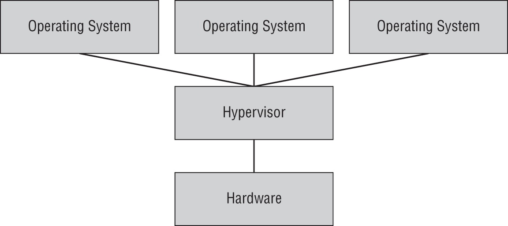


### Type 2 hypervisors {#2bd7b0eb61a4803ea92bc84c412ee82c}

- Chạy như một ứng dụng trên nền host operating system - không phải kernel
	- Để truy cập phần cứng, nó phải cài thêm một "Kernel Driver" hoặc "Kernel Extension" vào Host OS để nhờ vả Kernel của Host OS làm việc hộ.
- Hệ điều hành chủ hỗ trợ hypervisor, hypervisor yêu cầu tài nguyên cho VM từ hđh đó
- Thường dùng cho máy tính cá nhân
- Kém hơn Type 1 vì cần lớp trung gian
- Hyper-V trên windows

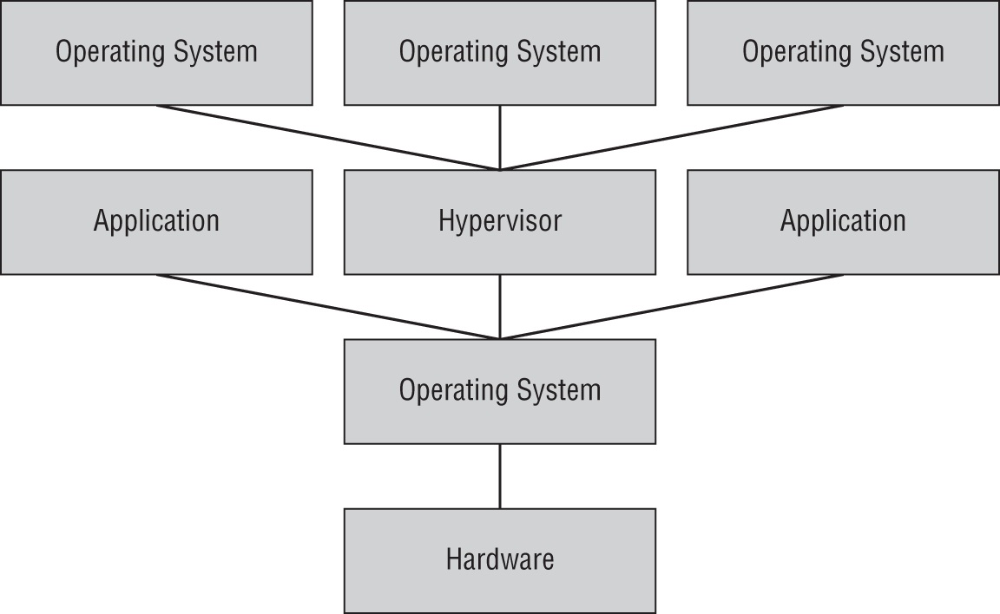


## Cloud infrastructure components {#2bd7b0eb61a480678295e049d8c53135}


Môi trường IaaS cung cấp quyền truy cập linh hoạt vào tài nguyên tính toán (compute capacity), lưu trữ và mạng lưới


## Cloud compute resources {#2bd7b0eb61a480ca8de9ed61e588ca8a}


### Virtualization {#2bd7b0eb61a4808d815dec707e3fae9b}

- Quản trị viên có thể thêm hoặc bớt resource khi nhu cầu thay đổi
- VMs là building block của compute capacity

Sau khi khởi tạo (**provisioned**), bạn tương tác với server ảo giống như server vật lý:

- Sử dụng **SSH** cho Linux IaaS instance (Figure 10.12).
- Sử dụng **Remote Desktop Protocol (RDP)** cho Windows IaaS instance để có giao diện đồ họa (Figure 10.13).

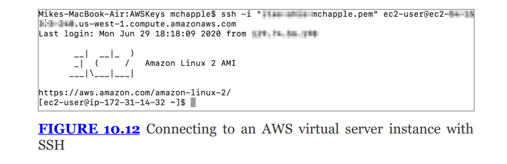


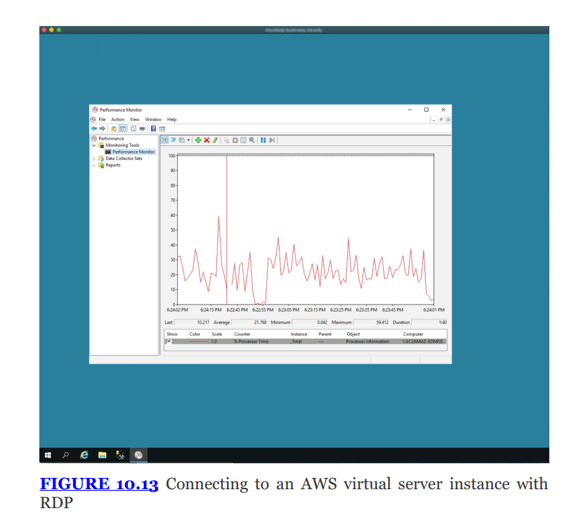


### Containerization {#2bd7b0eb61a480f0abc1cc7b0b64a012}


Containerization cung cấp ảo hóa ở mức độ ứng dụng

- Nó là bao đựng để đựng monolithic hoặc microservices
- Khác với VM (cần hệ điều hành riêng), container đóng gói ứng dụng và trở thành đơn vị ảo hóa di động (portable), có thể chạy trên nhiều nền tảng phần cứng và hệ điều hành khác nhau
- Nền tảng phổ biến: docker, kubernetes
- Security: container phải thực thi isolation để ngăn chặn ứng dụng trong container này tương tác với app thuộc container khác

---


Bảo mật container

- Sử dụng hệ điều hành máy chủ riêng cho container (container-specific host operating systems) với các tính năng được giảm thiểu để giảm attack surface
	- Các hệ điều hành máy chủ truyền thống như Ubuntu, CentOS, WindowServer nhiều phần mềm thừa (compiler, thư viện đồ họa, dịch vụ,…) tạo ra attack surface
	- Hđh cho container là immutable, read-only sau khi khởi động
	- Bảo mật cho hệ điều hành chủ của nó vì chia sẻ chung kernel

	**Ví dụ thực tế:**

	- **AWS Bottlerocket:** Một OS nguồn mở của Amazon chỉ để chạy container. Nó không có trình quản lý gói (package manager), thậm chí không có SSH shell truyền thống, khiến hacker rất khó cài rootkit vào đây.
	- **Google Container-Optimized OS (COS):** Được Google tối ưu để chạy Docker/Kubernetes trên Google Cloud, tự động cập nhật và rất nhẹ.
	- **Talos Linux:** Một OS hiện đại cho Kubernetes, hoàn toàn không có SSH, mọi thao tác quản trị đều qua API.
- Segmenting các container dựa trên risk profile và mục đích sử dụng
	- **Phân đoạn mạng (Network Segmentation):**
		- Sử dụng **Kubernetes Network Policies** để quy định: _"Container Frontend chỉ được phép nói chuyện với Container Backend qua cổng 8080. Cấm tuyệt đối Frontend kết nối trực tiếp đến Database."_
- Đảm bảo an toàn cho managment stack (docker, kubernetes): Container ít khi chạy riêng lẻ, chúng được quản lý bởi kubernetes và docker swarm. . Các công cụ này có quyền lực tối thượng (tạo, xóa, cấp quyền cho container). Nếu hacker chiếm được quyền kiểm soát API của Kubernetes, họ chiếm được cả hệ thống.
- **Monitoring network traffic... (Giám sát lưu lượng mạng...):** Container sinh ra và mất đi rất nhanh, địa chỉ IP thay đổi liên tục. Các tường lửa truyền thống thường "mù" trước lưu lượng giao tiếp nội bộ giữa các container (East-West traffic). Cần các công cụ giám sát chuyên biệt cho môi trường này.

### Phân biệt virtualization và container {#2cc7b0eb61a4807ab182e909be1f0d8a}


| **Đặc điểm**                   | **Virtual Machines (VMs)**                                                          | **Containers**                                                                                           |
| ------------------------------ | ----------------------------------------------------------------------------------- | -------------------------------------------------------------------------------------------------------- |
| **Trọng lượng (Size)**         | **Nặng (Heavyweight)**. Một VM thường tốn vài GB đến vài chục GB dung lượng ổ cứng. | **Nhẹ (Lightweight)**. Một Container thường chỉ tốn vài MB đến vài trăm MB.                              |
| **Tốc độ khởi động**           | **Chậm (Minutes)**. Phải đợi Guest OS boot lên giống như bật máy tính thật.         | **Cực nhanh (Milliseconds/Seconds)**. Vì không cần boot OS, ứng dụng chạy ngay lập tức.                  |
| **Tài nguyên (RAM/CPU)**       | Tốn kém. Dù VM không làm gì, nó vẫn tốn RAM để nuôi Guest OS.                       | Hiệu quả. Chỉ tốn tài nguyên khi ứng dụng thực sự xử lý.                                                 |
| **Tính cô lập (Isolation)**    | **Cao (Strong)**. Các VM tách biệt hoàn toàn. Lỗi ở VM này ít ảnh hưởng VM kia.     | **Thấp hơn (Weaker)**. Do chia sẻ chung Kernel, nếu Kernel bị lỗi, tất cả Container có thể bị ảnh hưởng. |
| **Tính di động (Portability)** | Khá. Nhưng di chuyển file VM dung lượng lớn rất vất vả.                             | Rất cao. "Build once, run anywhere". Chạy nhất quán trên Laptop, Server, Cloud.                          |
| Độ sâu                         | Xài trên phần cứng (type1) hoặc chạy trên                                           | Chia sẻ kernel với OS, không cần cài hệ điều hành, chỉ cần ứng dụng và thư viện là chạy                  |


Trông type 2 hypervisor giống container nhưng hypervisor vẫn tạo ra phần cứng ảo thay vì chạy trên kernel hệ điều hành như container


Về góc độ bảo mật

- VM sec: cô lập, khó VM escape
- Container: kernel exploit  do dùng chung kernel với hđh nên nếu hacker khai thác được lỗ hổng thì nó cũng chiếm được quyền kiểm soát container
	- **Container Breakout:** Tương tự VM Escape, hacker tìm cách thoát khỏi Container để xuống Host OS. Do lớp vỏ bảo vệ của Container "mỏng" hơn VM, việc này về lý thuyết dễ xảy ra hơn.

## Cloud storage resource {#2bd7b0eb61a48092887fdb25e301227d}


### Block storage {#2bd7b0eb61a480fca280e510b5937c50}

- Cấp phát các khối lượng lưu trữ lớn để sử dụng bởi các máy chủ ảo (virtual server instances)
- Hệ điều hành xài chúng như ổ đĩa vật lý thông thường dù là ổ ảo
- VD: AWS elastic block storage (EBS)

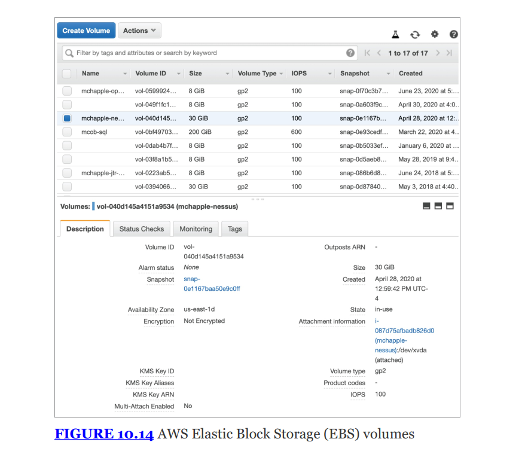

- **Chi phí (Quan trọng):** Bạn trả tiền cho dung lượng đã được cấp phát (**preallocated**), bất kể bạn có lưu dữ liệu vào đó hay không. Ví dụ: Cấp phát ổ 1 TB thì trả tiền cho 1 TB, dù chỉ lưu 500 GB.
- **Lưu ý:** Block storage đắt hơn đáng kể so với Object storage (thường đắt hơn từ 3 đến 10 lần).

### Object storage {#2bd7b0eb61a480e58379fa43321d45bf}

- Cho khách hàng đặt files vào các buckets
- Mỗi file được coi là thực thể độc lập, có thể truy cập qua web hoặc API
- Chi tiết ổ vật lý được ẩn đi với người dùng
- Ví dụ: **AWS Simple Storage Service (S3)** (Figure 10.15).
- **Chi phí:** Bạn chỉ trả tiền cho dung lượng lưu trữ bạn thực sự sử dụng.

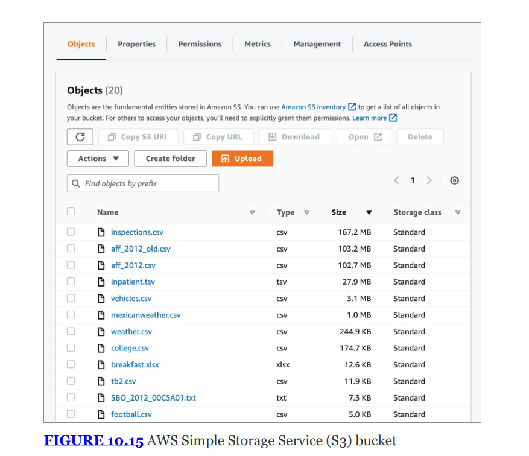


### Cloud storage security considerations {#2bd7b0eb61a4805e9f88edde68b40c87}

- Set permission properly: đặc biệt với object storage
- Consider high availability and durability options: sử dụng khả năng replication của nhà cung cấp hoặc của bạn để đảm bảo dữ liệu an toàn
- Use encryption to protect sensitive data

## Cloud networking {#2bd7b0eb61a480babd4cea7181bacd53}


Mạng đám mây cũng tuân theo mô hình ảo hóa giống như tài nguyên khác (CPU, RAM)

- Người dùng được cấp quyền truy cập vào tài nguyên mạng để kết nối các thành phân hạ tầng và có thể provision bandwith theo nhu cầu
- SDN (software-defined network): cloud network cũng hỗ trợ SDN, cho phép dev tương tác và sửa đổi tài nguyên thông qua APIs thay vì cấu hình phần cứng thủ công
- Software-defined visibility (SDV): cung cấp khả năng nhìn thấy (insight) và giám sát lưu lượng truy cập bên trong các mạng ảo này

### Security groups {#2bd7b0eb61a480529799d20d0e57cdd3}

- Thay thế firewall vật lý truyền thống trên môi trường cloud
- Vấn đề: trong mạng vật lý thì dùng firewall để chặn traffic, nhưng trên cloud thì vì lý do isolation nên không thể để khách hàng truy cập vào firewall vật lý, có thể ảnh hưởng tới khác hàng khác
- Giải pháp: security group
	- Định nghĩa các lưu lượng mạng cho phép (permissible network traffic)
	- Bao gồm rule như firewall

	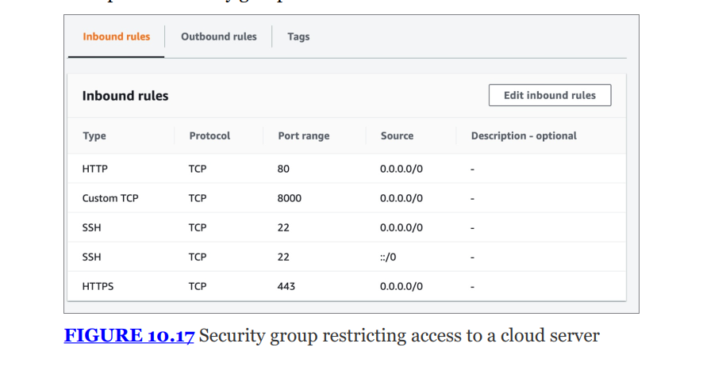


**Lưu ý quan trọng (Exam Note):**

- **Security Groups** hoạt động ở tầng mạng (**Network layer**) của mô hình OSI, giống như tường lửa truyền thống.
- Các nhà cung cấp cũng có **Web Application Firewall (WAF)** hoạt động ở các tầng cao hơn của mô hình OSI.
- Security Groups thường là tính năng miễn phí đi kèm, không tính thêm phí.

## Virtual private cloud (VPC) {#2bd7b0eb61a480a991c6ef0e140dfcb7}


Là đơn vị cơ bản để tổ chức mạng trong đám âmy

- Segmentation: là khái niệm cốt lõi của an ninh mạng. Nó cho phép các hệ thống có mức độ bảo mật khác nhau vào các mạng con (subnets)
- **VLAN vs. VPC:**
	- Trên mạng vật lý, ta dùng **VLAN** (Virtual LAN) để phân đoạn.
	- Trên môi trường đám mây, **VPC** (Virtual Private Cloud) phục vụ mục đích tương tự.
- **Subnets (Mạng con):** Trong VPC, bạn có thể nhóm các hệ thống vào các subnet và chỉ định chúng là **Public** (công khai - được truy cập Internet) hoặc **Private** (riêng tư - không có đường ra Internet trực tiếp).
- **Kết nối nâng cao:**
	- **VPC Endpoints:** Cho phép kết nối VPC với các dịch vụ bảo mật khác của nhà cung cấp.
	- **Transit Gateways:** Mở rộng mô hình này, cho phép kết nối trực tiếp giữa các VPC trên mây với các VLAN dưới on-premise (mô hình Hybrid).
	- _Figure 10.18_ minh họa quá trình tạo VPC và chọn cấu hình subnet.

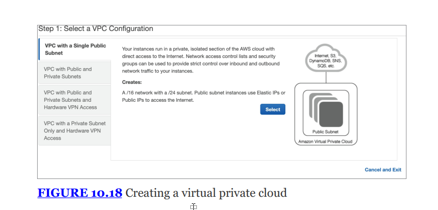


## DevOps and Cloud automation {#2bd7b0eb61a48022bdd2d980276092d5}


Về chuyển dịch mô hình làm việc cũ sang hiện đại

- Mô hình truyền thống (silos)
	- Các nhóm công nghệ thường bị chia thành các tháp rỗng (silos)
	- Ngắt kết nối giữa dev (build) và ops đội vận hành
	- Quy trình cũ: Dev viết code -> Test -> Bàn giao ("hand off") cho Ops -> Ops quản lý server chạy code đó.
- Nhược điểm:
	- Ops bị cô lập khỏi quy trình build nên không hiểu yêu cầu kinh doanh
	- Dev bị cô lập nên tạo ra thiết kế lãng phí tài nguyên
	- Hand off làm giảm sự linh hoạt
	- Tăng thời gian chờ đợi, dẫn đến gộp nhiều bản sửa lỗi nhỏ thành một bản phát hành lớn
- DevOps
	- Phương pháp quản lý hiện đại, kết hợp dev và ops
	- Sử dụng Agile
	- Quá trình kiểm thử và phát hành được tự động hóa cao
	- Thay vì bản cập nhật lớn lâu mới có, họ phát hành hành chục bản cập nhật nhỏ mỗi ngày

### Infrastructure as Code (IaC) {#2bd7b0eb61a4807e81e5ee897c26af99}


Là công nghệ đằng sau phong trào devOps

- IaC là quy trình tự động hóa việc cấp phát, quản lý và hủy bỏ hạ tầng thông qua scripted code thay vì bấm chuột trên giao diện web
	- Terraform, ansible
	- Khi triển khai, cập nhật chỉ cần chạy đoạn code cho tất cả datacenter. Đảm bảo hạ tầng ở datacenter khắp nơi trên thế giới đều giống hệt nhau từng thông số, loại bỏ human error và misconfiguration
	- Dùng on-premise: Trước kia thì system admin phải cần USB đi cài windows/Linux cho máy chủ vật lý, nhưng giờ thì dùng IaC:
		- Virtualization: datacenter dùng VMware Sphere, OpenStack, Nutanix. Các công cụ Iac (terraform, Ansible) kết nối với hệ thống này: viết code Terraform, chạy và nó tự tạo ra 100 VM trên VMware của datacenter mà không cần đụng tay vào giao diện quản lý
		- **Bare Metal (Máy chủ vật lý):** Ngay cả việc cài hệ điều hành lên một con server sắt (chưa có gì) cũng dùng IaC. Các công cụ như **MAAS (Metal as a Service)** hay **Tinkerbell** cho phép định nghĩa cấu hình server bằng code. Khi cắm điện và mạng vào server mới, nó tự động tải OS về và cài đặt theo đúng ý đồ trong code.
	- Dùng trên public cloud: Gần như 100% các công ty công nghệ lớn không tạo server bằng cách click chuột trên web console. Họ dùng IaC (Terraform, CloudFormation) để dựng toàn bộ hệ thống mạng, bảo mật, server chỉ trong vài phút.
	- Dùng trên cả hybrid: là ứng dụng mạnh nhất của IaC. Doanh nghiệp lớn thường không bỏ hết dữ liệu lên Cloud vì lý do bảo mật, nhưng họ lại muốn sự linh hoạt của Cloud.
		- **Cách IaC giải quyết:** Họ viết một bộ code (IaC).
			- Phần dữ liệu nhạy cảm: Code sẽ lệnh cho **Datacenter nội bộ** tạo server lưu trữ.
			- Phần ứng dụng web cho khách hàng: Code sẽ lệnh cho **AWS** tạo server để chạy cho nhanh.
		- Chỉ cần một nút bấm, hạ tầng được dựng lên ở cả 2 nơi cùng lúc.

	
Nếu bạn nghe thuật ngữ **"Software-Defined Data Center" (SDDC)**, đó chính là Datacenter được vận hành cốt lõi bằng **IaC**.

- Lợi ích: mọi thao tác của đội ops làm trên giao diện web của nhà cung cấp đều có thể được thực hiện bằng code
- Công cụ:
	- AWS cung cấp CloudFormation
	- Cho phép định nghĩa yêu cầu hạ tầng dưới dạng JSON (JavaScript Object Notation) hoặc YAML (YAML ain’t Markup Language)

:::tip

Nói thêm chút về mấy loại ngôn ngữ
- JSON là định dạng lưu trữ, trao đổi dữ liệu dạng key: values, ngôn ngữ người

- Markup language: dùng tag để định dạng, sắp xếp văn bản

:::


```yaml
# Đây là cấu hình server
server:
  port: 8080  # Cổng kết nối
  host: localhost
```


```json
{
  "server": {
    "port": 8080,
    "host": "localhost"
  }
}
```


Tóm tắt mối liên hệ


Để xây dựng một hệ thống hiện đại, bạn thường gặp cả 4 ông này cùng lúc:

1. Bạn dùng **Java** hoặc **JavaScript** để viết logic xử lý.
2. Bạn dùng **JSON** để gửi dữ liệu từ Server về Client.
3. Bạn dùng **Markup (HTML)** để hiển thị dữ liệu đó lên màn hình.
4. Bạn dùng **YAML** để cấu hình việc triển khai server (Docker/Kubernetes).

:::tip

### **Ví dụ kết hợp (Để bạn hình dung bức tranh toàn cảnh):**

Giả sử bạn là một **Kiến trúc sư phần mềm** muốn tạo một website bán hàng:

1. Bạn quyết định **MUA** dịch vụ **IaaS** (thuê máy chủ ảo) từ AWS để có quyền kiểm soát cao nhất.

2. Thay vì vào web bấm chuột tạo máy chủ, bạn dùng **IaC** (viết code Terraform) để ra lệnh cho AWS tự động tạo máy chủ đó.

3. Trên máy chủ đó, bạn cài đặt phần mềm.

> Tóm lại: IaC là cái "điều khiển từ xa" thông minh, còn IaaS/PaaS/FaaS là cái "Tivi" mà bạn đang điều khiển.

:::


:::tip

- **Trong thế giới Container (Docker/Kubernetes):** Artifact chính là **Docker Image**. (Đây là loại Artifact phổ biến nhất trong câu hỏi về IaC hiện nay).

- **Trong lập trình Java:** Artifact là file `.jar` hoặc `.war`.

- **Trong lập trình Windows:** Artifact là file `.exe` hoặc `.msi`.

- **Trong lập trình Mobile:** Artifact là file `.apk` (Android) hoặc `.ipa` (iOS).

- **Trong thư viện:** Artifact là gói thư viện (package) như file `.zip` hoặc gói trên NPM/Maven.

:::


### APIs and Microservices {#2bd7b0eb61a48036941feff39dd3d90b}


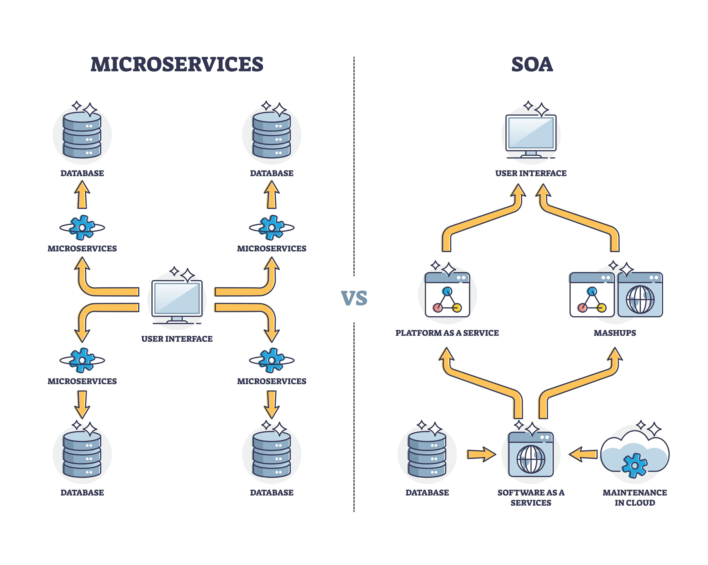

- APIs: IaC phụ thuộc hoàn toàn vào Application Programming Interfaces do cloud provider đưa ra. Dev dùng nó để lập trình việc cấp phát, sửa đổi tài nguyên
- Microservices:
	- Là kiến trúc thiết kế phần mềm thường được triển khai bằng container
	- Tích hợp API đặc biệt hữu ích cho môi trường sử dụng microservices
	- Đây là các dịch vụ cung cấp các chức năng rất nhỏ (**granular functions**), thường thông qua mô hình **Function-as-a-Service**.
	- Các microservices này được thiết kế để giao tiếp với nhau để phản hồi lại các sự kiện (**events**) diễn ra trong môi trường.
		- Liên kết lỏng lẻo: hoạt động độc lập. Nếu thay đổi hoặc nâng cấp dịch vụ (vd: service thanh toán) không hỏng hay ảnh hưởng tới service khác do chúng giao tiếp với nhau qua API không phụ thuộc vào mã nguồn
		- Khác với monolithic

:::tip

1. Ví dụ thực tế: Ứng dụng bán hàng "E-Shop"
Hãy tưởng tượng ứng dụng "E-Shop" được xây dựng theo kiến trúc **Microservices**. Thay vì là một khối phần mềm khổng lồ (Monolith), nó được chia nhỏ thành các dịch vụ độc lập, mỗi dịch vụ là một "Microservice" có database riêng và nhiệm vụ riêng:

1. **Product Service (Dịch vụ Sản phẩm):** Chỉ quản lý danh sách hàng hóa, kho hàng, giá cả.

2. **User Service (Dịch vụ Người dùng):** Chỉ quản lý đăng nhập, thông tin cá nhân, địa chỉ giao hàng.

3. **Order Service (Dịch vụ Đơn hàng):** Chỉ quản lý việc tạo đơn, trạng thái đơn hàng.

4. **Payment Service (Dịch vụ Thanh toán):** Chỉ xử lý thẻ tín dụng, ví điện tử.

**Vấn đề:** Các dịch vụ này nằm trên các máy chủ khác nhau, code biệt lập. Làm sao **Order Service** biết được người dùng còn tiền hay không để tạo đơn?

**Giải pháp:** Chúng nói chuyện với nhau bằng **API**.

2. API đóng vai trò gì ở đây?

Nếu Microservices là các **"phòng ban"**, thì API chính là **"đường dây nóng"** hoặc **"ngôn ngữ giao tiếp"** giữa các phòng ban đó.

Khi bạn bấm nút **"Mua ngay"** chiếc áo thun, một chuỗi hành động sẽ diễn ra thông qua API:

1. **Bước 1:** Ứng dụng trên điện thoại của bạn gọi **Public API** của hệ thống (thường qua một cái cổng gọi là API Gateway) gửi yêu cầu: _"Tôi muốn mua cái áo ID 123"_.

2. **Bước 2:** **Order Service** nhận lệnh. Nó cần biết cái áo đó còn hàng không.

3. **Bước 3 (Giao tiếp nội bộ):** **Order Service** gọi **Internal API** của **Product Service**:

4. **Bước 4:** Nếu còn hàng, **Order Service** lại gọi API của **Payment Service** để trừ tiền.

:::


## Cloud security issues {#2bd7b0eb61a4800c9e9bfb2a4c159b48}


### Availability {#2be7b0eb61a48016a899c21572621f5f}

- Vấn đề: các sự cố về availability vẫn tồn tại trên đám mây như on-premise
- Giải pháp: provider vận hành vận hành ở nhiều geographic regions. Cung cấp cơ chế để sao lưu dữ liệu qua các vùng này hoặc vận hành ở chế độ high availability
	- _Ví dụ:_ Một công ty có thể đặt server web ở mỗi châu lục để phục vụ khách hàng khu vực đó, đồng thời tạo sự đa dạng địa lý (**geographic diversity**) để dự phòng nếu một khu vực lớn bị sự cố.

**Lưu ý quan trọng (Exam Note):** Tính sẵn sàng cao (**High availability**) thường **không được đảm bảo** ở các gói dịch vụ cơ bản (**base-level services**). Bạn thường phải mua thêm hoặc tự cấu hình các dịch vụ HA để tối đa hóa thời gian hoạt động (**uptime**).


:::tip

HA vs fault tolerance
- Fault tolerance: đảm bảo zero downtime

- HA: minimal downtime, hệ thống đảm bảo hoạt động 99% thời gian

:::


### Data sovereignty {#2be7b0eb61a4801db316ffbf6a2eba49}

- Là nguyên tắc quy định dữ liệu phải chịu kiểm soát pháp lý của bất kỳ khu vực tài phán (jurisdiction) nơi nào nó được thu thập, lưu trữ hoặc xử lý
- Rủi ro: khách hàng có thể chịu quy định của pháp luật không liên quan gì tới họ chỉ vì datacenter của provider đặt ở đó
- **Biện pháp của chuyên gia bảo mật:**
	1. Hiểu rõ dữ liệu được lưu trữ và xử lý ở đâu.
	2. Sử dụng mã hóa (**encryption**) với các khóa (**keys**) do chính khách hàng quản lý (nằm ngoài tầm kiểm soát của nhà cung cấp).
	3. Sử dụng các biện pháp kiểm soát vùng. _Ví dụ Figure 10.20:_ Zoom cho phép người dùng chặn việc sử dụng datacenter ở Trung Quốc hoặc Hong Kong.

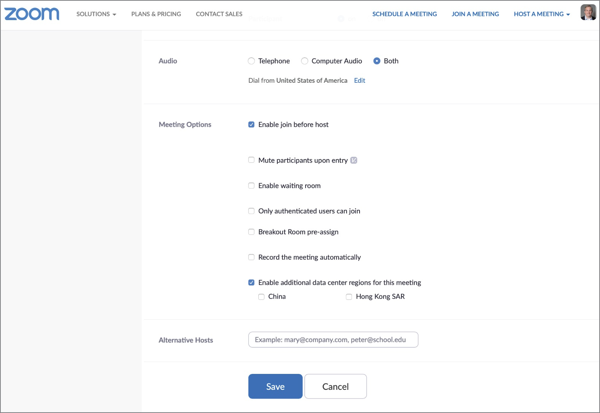


## Virtualization security {#2be7b0eb61a480cead54f2a3389afc8e}


### VM escape {#2be7b0eb61a48076b495e785ccf4b5b2}

- Vấn đề nghiêm trọng nhất
- Kẻ tấn công truy cập vào một máy chủ riêng lẻ sau đó lợi dụng quyền truy cập để xâm nhập vào tài nguyên không được gán cho máy ảo khác hoặc chính hệ thống chủ
- Nguyên nhân: do hypervisor không thực thi tốt việc isolate, cho phép tiến trình trốn thoát

### VM Sprawl -resource reuse {#2be7b0eb61a480749847f59580b7cceb}

- Người dùng IaaS tạo ra các VMs rồi quên hoặc bỏ chúng
- Hậu quả:
	- Chi phí: tích tụ chi phí không cần thiết
	- Bảo mật: vấn đề bảo mật, do không được cập nhật/patch
- **Giải pháp:** Tổ chức cần duy trì nhận thức về các instance (**instance awareness**) để tránh vấn đề này.

| **Khái niệm** | **Tên kỹ thuật**             | **Giải thích đời sống**          | **Đặc điểm**                                                                                        |
| ------------- | ---------------------------- | -------------------------------- | --------------------------------------------------------------------------------------------------- |
| **Khuôn mẫu** | **VM Image** (hoặc Template) | Cái khuôn đúc bánh.              | Là file tĩnh, nằm im trong kho, **không tốn tiền điện**, không xử lý dữ liệu.                       |
| **Thực thể**  | **Instance**                 | Chiếc bánh được đúc ra từ khuôn. | Là máy đang chạy (hoặc đang tồn tại), có CPU, RAM, IP riêng. **Tốn tiền** và **có rủi ro bảo mật**. |


Instance Awareness nghĩa là phải làm gì?


Để "duy trì nhận thức", người quản trị phải trả lời được 3 câu hỏi cho **mọi Instance** đang chạy:

1. **Identity:** Instance này tên là gì? (Ví dụ: `Dev-Test-Server-01`).
2. **Ownership:** Ai là người tạo ra nó? (Ví dụ: `user: nguyen_van_a`).
3. **Lifecycle:** Bao giờ thì nó được phép hủy? (Ví dụ: `Hết hạn: 30/12/2024`).

### Resource reuse {#2be7b0eb61a48038b9cfc7a45ae101f6}

- Khi nhà cung cấp lấy tài nguyên phần cứng từ một khách hàng này và gán cho khách hàng khác
- Nếu dữ liệu không xóa sạch thì vô tình lộ lọt


## Application Security (cloud) {#2be7b0eb61a48047a72cedafeb172cab}


Ứng dụng đám mây cũng gặp lỗi như phần mềm thông thường nhưng có thêm đặc thù

- APIs: ứng dụng đám mây phụ thuộc rất nhiều vào APIs
	- Cần sử dụng secure coding, cần triển khai API inspection (thường thấy trong WAF) để soi xét kĩ các yêu cầu gửi đến API nhằm phát hiện dấu hiệu tấn công
- Secure Web gateways (SWGs)
	- Là lớp bảo mật ứng dụng cho các tổ chức phụ thuộc vào cloud
	- Chức năng: giám sát các web requests từ người dùng nội bộ, đánh giá chúng dựa trên chính sách bảo mật và chặn các yêu cầu vi phạm (content filtering)
	- **Áp dụng cho:** **Toàn bộ (SaaS, PaaS, IaaS)** nhưng ở góc độ **Truy cập mạng (Network Access)**.

	| **Đặc điểm**               | **Firewall (Truyền thống) tương tự security group**                          | **SWG (Secure Web Gateway)**                                                                |
	| -------------------------- | ---------------------------------------------------------------------------- | ------------------------------------------------------------------------------------------- |
	| **Hoạt động ở tầng nào?**  | Tầng Mạng & Vận chuyển (Layer 3 & 4).<br/>_(Chặn theo IP, Port)_             | Tầng Ứng dụng (Layer 7).<br/>_(Hiểu rõ giao thức HTTP/HTTPS, Web)_                          |
	| **Khả năng hiểu nội dung** | Thấp. Chỉ biết gói tin đi từ A đến B.                                        | Cao. Đọc được nội dung trang web, quét virus trong file tải về, giải mã HTTPS.              |
	| **Mục đích chính**         | Bảo vệ **hạ tầng mạng** của công ty (Server, PC) khỏi tấn công từ ngoài vào. | Bảo vệ **người dùng** khi họ truy cập Web (chặn họ bấm link bậy, chặn tải virus về).        |
	| **Chiều dữ liệu**          | Quan trọng cả 2 chiều: Vào (Inbound) và Ra (Outbound).                       | Tập trung mạnh vào chiều **Ra (Outbound)**: Từ nhân viên -> Internet.                       |
	| **Ví dụ hành động**        | "Chặn IP 192.168.1.1 kết nối đến Port 22".                                   | "Chặn nhân viên phòng kế toán truy cập web cờ bạc hoặc upload file Excel lên Google Drive". |


	:::tip
	
	Hiện nay có NGFW (next-gen firewall) nên ranh giới giữa firewall và SWGs vì firewall cũng sử dụng tính năng của SWGs
	Nhưng SWGs là nằm trên cloud khác với firewall nằm ở trước router
	
	:::
	
	


### Cloud-specific vulnerabilities {#2d97b0eb61a4805fb4cbcb45ee59bcba}

- Misconfiguration - rủi lớn nhất
	- 76% tổ chức không bật MFA, để mặc định quyền là public
	- Directory traversal/authentication bypass: lợi dụng cấu hình xác thực yếu để đi vào những thư mục không được phép hoặc đăng nhập không cần mật khẩu
- Attack the service
	- DoS
	- RCE: cho phép hacker chạy từ xa
	- Out of bounds write: viết vào vùng nhớ không được phép gây data corruption, crashing, code execution
	- SLQi
	- VD: Lỗ hổng Log4j. Đây là một thư viện ghi log dùng trong hàng triệu ứng dụng Java trên đám mây (iCloud, Amazon, Twitter...).
	Hacker chỉ cần gửi một dòng tin nhắn chat đơn giản chứa mã độc. Hệ thống Cloud ghi lại tin nhắn đó vào log -> Kích hoạt mã độc -> Hacker chiếm quyền điều khiển server Cloud. Đây là một trong những lỗ hổng lớn nhất lịch sử Internet.

## Governance and auditing of third-party vendors {#2be7b0eb61a48067aa6acb02396cb97c}


Khi outsource lên đám mây, việc quản trị vẫn là trách nhiệm của tổ chức

- Cloud governance
	- Thẩm định (vetting) các nhà cung cấp trước khi hợp tác
	- Quản lý mối quan hệ và giám sát các dấu hiệu cảnh báo sớm về sự mất ổn định của nhà cung cấp
	- Giám sát danh mục hoạt động cloud của tổ chức
- Auditability:
	- Hợp đồng cloud phải bao gồm right to audit
	- Khách hàng có thể tự audit hoặc nhờ bên thứ 3
	- Mục đích: đảm bảo nhà cung cấp đang vận hành an toàn và tuân thủ các nghĩa vụ bảo vệ dữ liệu

## Hardening cloud infrastructure {#2be7b0eb61a4808abc4bc8b172f57640}


Để hardening bảo mật trên đám mây, các công ty có thể chọn giải pháp từ cloud provider, third-party, hoặc cả hai.

- Cloud-native controls: là các công cụ bảo mật do provider (AWS, Azure)
	- Ưu điểm: tích hợp trực tiếp, chi phí thấp, dễ sử dụng
- Third-party solutions:
	- Ưu điểm: quản lý môi trường đa đám mây
	- Nhược: chi phí cao

### Cloud access security brokers {#2be7b0eb61a48000b5bcde2a34abcd02}


Các tổ chức lớn thường dùng tới hàng trăm cloud, khó khăn quản lý

- CASBs: là công cụ phần mềm đóng vai trò trung gian giữa người dùng và CSPs giúp giám sát người dùng và thực thi chính sách bảo mật
- **Áp dụng chính cho:** **SaaS** (Software-as-a-Service).
- **Giải thích:**
	- Mặc dù CASB hiện đại có thể mở rộng sang IaaS/PaaS (để kiểm tra cấu hình - CSPM), nhưng **nguồn gốc và sức mạnh chính** của nó là dành cho **SaaS**.
- Hoạt động theo 2 cách:
	- Inline CASB solutions: nằm trực tiếp trên đường truyền giữa người dùng và cloud (vật lý hoặc logic)
		- Cơ chế: dùng thiết bị phần cứng hoặc agent trên máy trạm để điều hướng request qua CASB
		- Ưu điểm: nhìn thấy request trước khi đến đám mây cho phép chặn các hành vi vi phạm chính sách
	- API-based CABS solutions: không tương tác với người dùng mà với provider thông qua APIs
		- Cơ chế: truy cập trực tiếp vào dịch vụ đám mây để giám sát. Không cấu hình trên máy người dùng
		- Nhược: không thể chặn request vi phạm ngay lập tức, chỉ có thể báo cáo hoặc sửa chữa vi phạm sau khi sự kiện xảy ra

:::tip

Phân biệt CASB và SWGs
- SWGs kiểm soát truy cập web từ trong ra Internet, ngăn chặn truy cập web độc hại, tải malware về.

- CASB:

:::


### Resource policies {#2be7b0eb61a480779d78ef85c92904fe}

- CSP cung cấp resource policies để giới hạn hành động của user.
- **Áp dụng chính cho:** **IaaS** (Infrastructure-as-a-Service) và **PaaS** (Platform-as-a-Service), đắt tiền, quyền hạn.
- Cách tốt để hạn chế thiệt hại do tai nạn, tài khoản bị lộ hoặc malicious insider
- Security groups and resource policies are controls used in IaaS environments

**Phân tích ví dụ Service Control Policy (JSON) trong sách:**
Hình ảnh 3a2b94 hiển thị một đoạn mã JSON quy định quyền hạn:

- **Giới hạn vùng (Region):** Phần đầu (`DenyAllOutsideUSEastEUWest1`) cấm sử dụng tài nguyên bên ngoài vùng `us-east` và `eu-west`. Tuy nhiên, nó dùng `NotAction` để ngoại trừ (cho phép) các dịch vụ toàn cầu như `iam`, `route53`, `cloudfront`, v.v.
- **Giới hạn loại máy chủ (Instance Type):** Phần sau (`DenyLargeInstances`) cấm việc khởi tạo (`RunInstances`) các máy chủ lớn. Nó dùng điều kiện `StringNotLike` với các loại `micro`, `small`, `nano`. Tức là: Chỉ được phép chạy các máy chủ nhỏ (micro, small, nano) để kiểm soát chi phí (**control costs**).

```json
{
	"Statement": [
	{
			"Sid": "DenyAllOutsideUSEastEUWest1",
			"Effect": "Deny",
			"NotAction": [
			"iam:*",
			"organizations:*",
			"route53:*",
			"budgets:*",
			"waf:*",
			"cloudfront:*",
			"globalaccelerator:*",
			"importexport:*",
			"support:*"
			],
			"Resource": "*",
			"Condition": {
			"StringNotEquals": {
			"aws:RequestedRegion": [
			"us-east-1",
			"us-east-2",
			"eu-west-1"
			]
		}
	}
},
{
"Condition": {
"ForAnyValue:StringNotLike": {
"ec2:InstanceType": [
"*.micro",
"*.small",
"*.nano"
]
}
},
"Action": [
"ec2:RunInstances",
"ec2:ModifyInstanceAttribute"
],
"Resource": "arn:aws:ec2:*:*:instance/*",
"Effect": "Deny",
"Sid": "DenyLargeInstances"
}
]
}
```

- Ví dụ: Cross-account access
	- Bạn có tài khoản AWS A (công ty mẹ) AWS B (công ty con). Muốn user công ty A truy cập và S3 bucket của Công ty B
	- Thực tế thì không thể truy cập như vậy nhưng nhờ resource policy lên S3 bucket: cho phép user X từ A đọc dữ liệu của tôi
- vd: Vành đai bảo vệ: có 1 db chứa lương nhân viên và chỉ cho phép IP từ văn phòng công ty truy cập, mọi truy cập kể cả từ admin không có ip đúng cũng bị cấm
- Như vậy Bạn dùng **Resource Policies** khi bạn cần cái tài nguyên đó tự "bảo vệ mình" hoặc tự "mở cửa" cho người ngoài (đối tác, công chúng) mà không cần tạo tài khoản cho họ trong hệ thống của bạn.

### Secret management {#2be7b0eb61a4804cbf6ad31a9d5c4529}


Một khái niệm quan trọng là **Hardware Security Modules (HSMs)**.

- **Định nghĩa:** HSM là các thiết bị máy tính chuyên dụng dùng để quản lý các khóa mã hóa (**encryption keys**) và thực hiện các tác vụ mật mã một cách hiệu quả cao.
- **Lợi ích cốt lõi:** Chúng có thể tạo và quản lý khóa mã hóa mà không bao giờ để lộ khóa đó cho con người thấy. Điều này giảm thiểu tối đa nguy cơ khóa bị đánh cắp (**compromised**).
- Các nhà cung cấp đám mây thường dùng HSM nội bộ và cũng cung cấp dịch vụ HSM cho khách hàng thuê để quản lý khóa riêng của họ.

## Summary {#2be7b0eb61a480e69a1df9264c997215}


Điện toán đám mây thay đổi bối cảnh an ninh mạng. Mặc dù các mục tiêu bảo mật cốt lõi (CIA: Confidentiality, Integrity, Availability) vẫn giữ nguyên, nhưng môi trường thực hiện giờ đây đòi hỏi sự hợp tác với nhà cung cấp dịch vụ (**cloud service providers**) thông qua **shared responsibility model**. Các tổ chức có thể chọn dùng các công cụ có sẵn (**cloud-native**) hoặc bên thứ ba để bảo vệ hệ thống của mình.


## Exam essentials {#2be7b0eb61a48024885ecc3e58f2e4ef}


**Explain the three major cloud service models (3 Mô hình dịch vụ đám mây):**
Trong cách tiếp cận **XaaS (Anything-as-a-Service)**, có 3 mô hình chính:

1. **Infrastructure-as-a-Service (IaaS):** Khách hàng mua và tương tác với các khối xây dựng cơ bản của hạ tầng (CPU, RAM, Network).
2. **Software-as-a-Service (SaaS):** Khách hàng sử dụng ứng dụng được quản lý hoàn toàn chạy trên đám mây (Ví dụ: Gmail, Office 365).
3. **Platform-as-a-Service (PaaS):** Cung cấp nền tảng để khách hàng chạy các ứng dụng do họ tự phát triển mà không cần lo về hạ tầng bên dưới.

**Describe the four major cloud deployment models (4 Mô hình triển khai đám mây):**

1. **Public cloud:** Hạ tầng được chia sẻ cho bất kỳ khách hàng nào muốn sử dụng (mô hình **multitenant** - đa thuê bao).
2. **Private cloud:** Hạ tầng được cung cấp riêng cho một khách hàng duy nhất (**single customer**).
3. **Community cloud:** Chia sẻ đặc điểm của cả public và private. Chạy đa thuê bao nhưng giới hạn cho các thành viên của một cộng đồng cụ thể có chung mối quan tâm.
4. **Hybrid cloud:** Kết hợp giữa public, private và/hoặc community cloud.

**Understand the shared responsibility model of cloud security (Mô hình trách nhiệm chia sẻ):**

- Bảo mật đám mây không phải là việc của riêng ai. Khách hàng và nhà cung cấp phải chia sẻ trách nhiệm.
- Bạn cần hiểu rõ ai chịu trách nhiệm cho phần nào (ví dụ: Nhà cung cấp lo phần cứng, Bạn lo dữ liệu).

**Các lưu ý khác (từ phần đầu trang 3a2b78):**

- **Virtualization issues:** Cần hiểu các lỗ hổng của ảo hóa như **VM escape** (kẻ tấn công thoát khỏi máy ảo để chiếm quyền máy chủ vật lý) và **resource reuse** (tái sử dụng tài nguyên không an toàn).
- **Data sovereignty:** Việc sử dụng dịch vụ đám mây đặt tại các khu vực pháp lý (quốc gia) khác nhau có thể dẫn đến các vấn đề về chủ quyền dữ liệu (luật pháp nơi dữ liệu cư trú).

Implement appropriate security controls (Triển khai kiểm soát bảo mật)


Phần này nói về việc áp dụng kiểm soát dựa trên trách nhiệm và các lớp hạ tầng:

- **Trách nhiệm theo mô hình dịch vụ:**
	- **IaaS (Infrastructure-as-a-Service):** Nhà cung cấp lo phần cứng (dưới lớp OS). Khách hàng chịu trách nhiệm nhiều nhất (từ OS trở lên).
	- **PaaS (Platform-as-a-Service):** Nhà cung cấp lo thêm phần bảo mật cho hệ điều hành (**Operating System**).
	- **SaaS (Software-as-a-Service):** Nhà cung cấp chịu trách nhiệm gần như toàn bộ môi trường. Khách hàng chỉ lo cấu hình quyền truy cập (**access controls**) và dữ liệu (**data**).
- **Các biện pháp kiểm soát cụ thể:**
	- **Storage (Lưu trữ):** Cần xem xét phân quyền (**permissions**), mã hóa (**encryption**), sao chép (**replication**), và tính sẵn sàng cao (**high availability**).
	- **Network (Mạng):** Thiết kế mạng ảo (**virtual networks**) với các subnet công khai (public) và riêng tư (private) để phân đoạn mạng (**segmentation**) phù hợp.
	- **Compute (Tính toán):** Thiết kế **security groups** để hạn chế lưu lượng mạng ra/vào các máy chủ ảo (instances).
