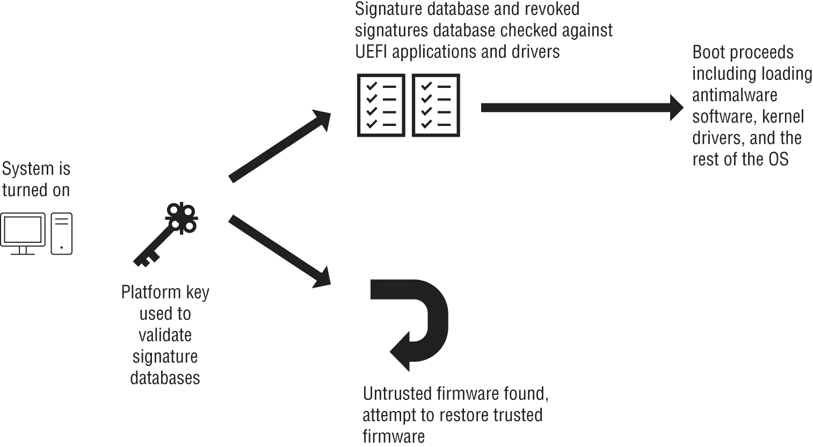
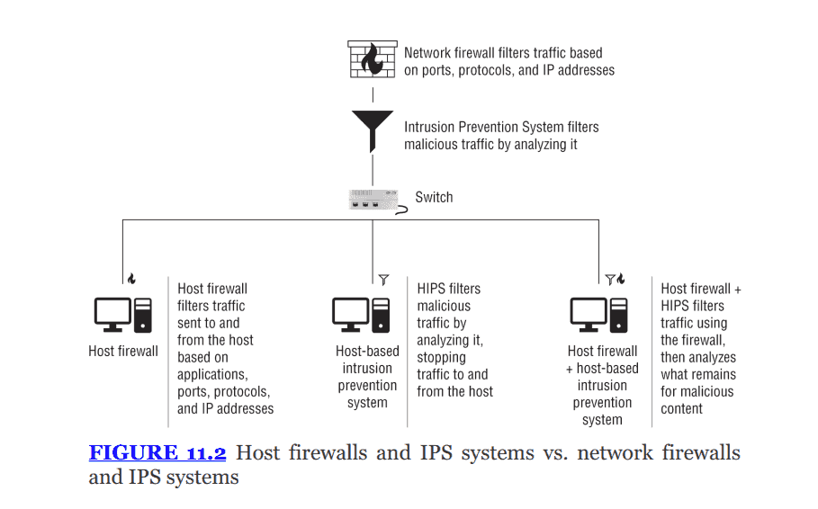
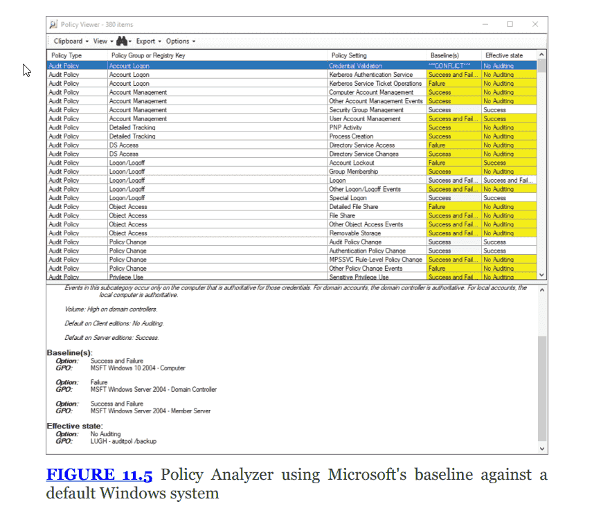
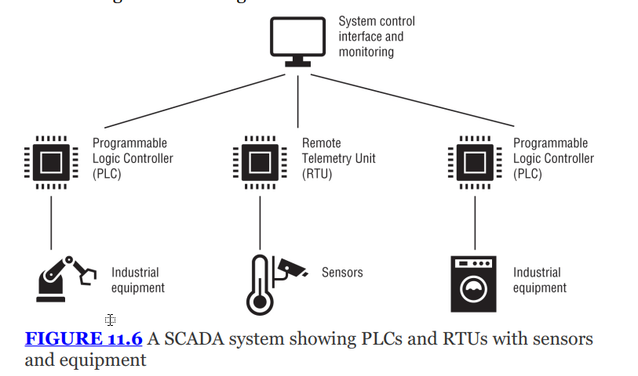

---

# THE COMPTIA SECURITY+ EXAM OBJECTIVES COVERED IN THIS CHAPTER INCLUDE: {#2be7b0eb61a4806695afd345325bd0be}

## Domain 1.0: General Security Concepts {#2be7b0eb61a4808199c3e965e7e868ec}

### 1.4. Explain the importance of using appropriate cryptographic solutions. {#2be7b0eb61a4804ba9cccaceab60f938}

- Tools (Trusted Platform Module (TPM), Hardware security module (HSM), Key management system, Secure enclave)

## Domain 2.0: Threats, Vulnerabilities, and Mitigations {#2be7b0eb61a480b696d0cf438d56c6dc}

### 2.3. Explain various types of vulnerabilities. {#2be7b0eb61a480169af5c3eebf43173c}

- Operating system (OS)-based
- Hardware (Firmware, End-of-life, Legacy)
- Misconfiguration

### 2.5. Explain the purpose of mitigation techniques used to secure the enterprise. {#2be7b0eb61a4808a9ad5e956ac8367e3}

- Patching
- Encryption
- Configuration enforcement
- Decommissioning
- Hardening techniques (Encryption, Installation of endpoint protection, Host-based firewall, Host-based intrusion prevention system (HIPS), Disabling ports/protocols, Default password changes, Removal of unnecessary software)

## Domain 3.0: Security Architecture {#2be7b0eb61a4805eae53c56d305451bd}

### 3.1. Compare and contrast security implications of different architecture models. {#2be7b0eb61a480e4810af66be5efb937}

- Architecture and infrastructure concepts (IoT, Industrial control systems (ICS)/supervisory control and data acquisition (SCADA), Real-time operating system (RTOS), Embedded systems)

## Domain 4.0: Security Operations {#2be7b0eb61a480f0b14cf1155b836aa3}

### 4.1. Given a scenario apply common security techniques to computing resources. {#2be7b0eb61a480d98e64f72e2725e567}

- Secure baselines (Establish, Deploy, Maintain)
- Hardening targets (Workstations, Servers, ICS/SCADA, Embedded systems, RTOS, IoT devices)

### 4.2. Explain the security implications of proper hardware, software, and data asset management. {#2be7b0eb61a480308cadc23f470101a6}

- Acquisition/procurement process
- Assignment/accounting (Ownership, Classification)
- Monitoring/asset tracking (Inventory, Enumeration)
- Disposal/decommissioning (Sanitization, Destruction, Certification, Data retention)

### 4.4. Explain security alerting and monitoring concepts and tools. {#2be7b0eb61a48065a77eccbf1987811d}

- Tools (Antivirus, Data loss prevention (DLP))

### 4.5. Given a scenario, modify enterprise capabilities to enhance security. {#2be7b0eb61a48034b64be5862a8e0691}

- Operating system security (Group Policy, SELinux)
- Endpoint detection and response (EDR)/extended detection and response (XDR)

---

## Introduction {#2be7b0eb61a480cb8b7be61325f1e2ed}

Endpoint security quan trọng vì bảo vệ người dùng cuối, số lượng endpoints (laptop, smartphone, desktop) cũng nhiều hơn rất nhiều so với server/network devices, người dùng cuối sử dụng chúng - gặp nhiều rủi ro

Nội dung trong chương: 

- Lỗ hổng phần cứng và hệ điều hành
- Kỹ thuật bảo vệ endpoint: bảo mật boot process, phát hiện malware, antimalware/antivirus
- Các khái niệm: DLP, system and service hardening, configuration standards
- Quy trình xử lý ổ đĩa/thiết bị lưu trữ hỏng hết sử dụng
- Bảo mật embedded systems, SCADA, ICS, IoT
- Asset management

## Operating system vulnerabilities {#2be7b0eb61a48066b2d4cc59362e0bfc}

Có 4 loại vulnerabilities:

- Vulnerabilities in the operating system (đến từ nội tại):
	- Giải pháp: cần patching, để giảm thiểu attack footprint, tắt bớt các dịch vụ không cần thiết
- Defaults: những thiết lập mặc định
	- Default passwords:
	- Giải pháp: Sử dụng configuration baselines (học sau)
- Configurations: Những thiết lập không đảm bảo an toàn
	- ví dụ như tắt mã hóa để đảm bảo tương thích với phần mềm, dịch vụ cũ
	- Sử dụng Mandatory access control
- Misconfigurations:
	- Thường xảy ra do human error, là con đường phổ biến trên cả endpoint, network, IoT, đặc biệt là cloud
	- Open permission: để quyền dữ liệu là public
		- 6/2017, đối tác thứ 3 của nhà mạng Verizon đã cấu hình sai một thùng chứa dữ liệu (S3 bucket) trên amazon Cloud, để chế độ open khiến 14 triệu hồ sơ khách hàng phơi trước Internet
	- Unsecured admin account: để mật khẩu của admin dễ đoán
		- Giải pháp: vô hiệu hóa đăng nhập trực tiếp bằng tài khoản root
		- Đăng nhập bằng user thường sau đó dùng sudo
	- Insecure protocol: sử dụng các giao thức không bảo mật - telnet, FTP, SMTP, IMAP
		- Telnet → **SSH**
		- FTP → **SFTP**
		- IMAP → **IMAPS**
	- Misconfiguration cũng bao gồm default settings và open ports

**Exam Note (Lưu ý thi):**
Đề cương thi Security+ khá mơ hồ về chủ đề này, chỉ ghi là "OS-based vulnerabilities". Khi học, bạn cần tư duy về việc lựa chọn OS, các **Defaults**, **Security configuration**, và mô hình hỗ trợ (**Support model**) ảnh hưởng thế nào đến an ninh tổ chức.

## Hardware vulnerabilities {#2be7b0eb61a4806891e0f48abf8b9a28}

Lỗ hổng phần cứng khó xử lý hơn phần mềm và thường cần các compensating controls

- Firmware: làm phần mềm nhúng điều khiển thiết bị. Các cuộc tấn công firmware attacks có thể xảy ra qua các bản cập nhật độc hại hoặc tải xuống từ người dùng
	- Mã độc trong firmware tồn tại dai dẳng ngay cả khi cài lại hệ điều hành hoặc ổ cứng. Vd: MoonBounce malware tấn công bị nhớ SPI flash
- EOL & legacy hardware:” Khi thiết bị đạt đến End-of-life, nhà sản xuất ngưng hỗ trợ, nếu không có bản vá, không thể xử lý lỗ hổng

	_Các thuật ngữ vòng đời cần nhớ:_

	- **End of sales:** Ngừng bán, nhưng có thể vẫn còn hàng tồn kho.
	- **End of life:** Ngừng bán, vẫn được hỗ trợ nhưng đang trên lộ trình loại bỏ.
	- **End of support:** Ngừng cung cấp bản cập nhật/hỗ trợ.
	- **Legacy:** Phần cứng/phần mềm cũ, không còn được hỗ trợ.
		- Kịch bản kinh điển về hệ thống legacy, khi quét thì hệ thống sập:
		- Phải Stop the bleeding: dừng quét, tạo một exemption có chữ kí của quản lý
		- Compensating: không thể vá lỗ hổng nên phải compensate bằng cách cho vào VLAN chẳng hạn

## Protecting endpoints {#2be7b0eb61a480f38f53efcdade286e7}

End point là đầu cuối của network tức là smartphone, laptop, server,….

### Preserving boot integrity {#2be7b0eb61a4805eac15d3ea2dc9f21f}

Để bảo mật, boot process phải an toàn ngay từ đầu

- UEFI vs BIOS: Unified extensible firmware interface hiện đại thay thế BIOS (basic input-output system) cũ để cung cấp bảo mật tốt hơn
- Secure boot:
	- Đảm bảo hệ thống chỉ khởi động bằng phần mềm được OEM tin cậy, nếu không sẽ không cho boot
	- hoạt động dựa trên các chứng chỉ số (Certificates) được lưu trong bộ nhớ **firmware UEFI** của bo mạch chủ.
	- Sử dụng dữ liệu chữ ký số signature database để kiểm tra
	- Mục tiêu: tránh rootkit/bootkit
- Measured boot:
	- Nhiệm vụ: ghi chép, báo cáo
	- Khác với secure boot, measured boot đo lường (băm) từng thành phần (firmware, bootloader, drivers) và lưu vào TPM (trusted platform module)
	- Nó không chặn quá trình boot, mà ghi lại trạng thái boot để quản trị viên có thể remote attestion xem hệ thống có bị gì không

Đọc thêm về secure boot trên win 10, 11

[https://learn.microsoft.com/en-us/windows/security/operating-system-security/system-security/secure-the-windows-10-boot-process](https://learn.microsoft.com/en-us/windows/security/operating-system-security/system-security/secure-the-windows-10-boot-process)

### TPM, HSM, KMS, Secure enclave {#2be7b0eb61a480f584dcc813c8ca9e86}

- TPM: là chip gắn sẵn trên máy tính, cung cấp hardware root of trust
	- Rẻ, phổ biến, hàm chết trên mainboard
	- Phục vụ measured boot
	- Chức năng:
		- Remote attestation: xác minh cấu hình phần cứng/mềm
		- Binding: mã hóa dữ liệu gắn liền với thiết bị đó do có endorsement key
		- Sealing: mã hóa dữ liệu và đặt điều kiện cho trạng thái TPM trước khi giải mã, tức là khi quy trình boot không thay đổi thì nó mới cho mở
		- Chống tấn công brute-force: anti-hammering (tấn công từ điển), TPM có lockout mode, sẽ khóa cứng lại không cho mở sau 10, 32 lần nhập mã sai
	- Ví dụ: trong laptop cá nhân, máy chủ phổ thông
	- Khi mã hóa ổ cứng laptops window thì bitlocker có khóa mã lưu trong TPM
- Hardware security module (HSM): là thiết bị rời hoặc thẻ cắm thêm, dùng để tạo, lưu trữ và quản lý khóa kĩ thuật số trong môi trường bảo mật cao. Thường dùng cho servers để giảm tác vụ mật mã
	- Đảm bảo tiêu chuẩn Federal information processing standard (FIPS) 140 or Common criteria (ISO/IEC 15408)
	- Phục vụ trong datacenter, ngân hàng, CA
	- Nó có vi xử lý cực mạnh để gánh vác việc giải mã thay cho CPU của server  (offload CPU overhead) giúp server chạy nhanh hơn
- Key management system (KMS): Là hệ thống quản lý tập trung các khóa và chứng chỉ.
	- Cloud providers thường cung cấp KMS dưới dạng dịch vụ.
	- KMS thường sử dụng HSM sau hậu trường để lưu khóa
		- Tạo khóa cho dịch vụ. Vd: SSL, SSH
		- Key rotation: tự động thay đổi khóa định kỳ
	- Áp dụng với nền tảng cloud: AWS KMS, Azure Key vault, Google cloud KMS
- Secure enclave: là một dạng két sắt riêng biệt trong con chip xử lý chính
	- Bảo vệ dữ liệu in use: tạo ra hộp đen trong phần cứng, dữ liệu được đưa vào hộp này để giải mã và xử lý, không ai có thể nhìn thấy kể cả OS
	- Lưu sinh trắc, phục vụ faceID, thanh toán….
	- Hoạt động riêng biệt với OS (android/iOS)
	- Tác dụng: ngay cả khi điện thoại bị nhiễm virus thì hacker cũng không thể xâm nhập vào vùng này để lấy thông tin sinh trắc
	- Vd: build trên SoC của Apple, Google Titan M, Samsung’s TrustZone và Knox

:::tip

**PUF (Physically Unclonable Functions - Chức năng vật lý không thể sao chép):**
- Hãy tưởng tượng khi sản xuất chip silicon, sẽ có những khiếm khuyết cực nhỏ ngẫu nhiên (giống như vân tay của con người). Không con chip nào giống con chip nào tuyệt đối.

- PUF tận dụng sự khác biệt vật lý ngẫu nhiên này để tạo ra một "dấu vân tay kỹ thuật số" duy nhất cho thiết bị đó. Hacker không thể sao chép chìa khóa này sang thiết bị khác vì cấu trúc vật lý của 2 con chip là khác nhau - endorsement key - EK

- Được áp dụng trên TPM chips và Secure enclave

:::

## Endpoint security tools {#2be7b0eb61a48091b664e32187626f0a}

### Antivirus and antimalware {#2be7b0eb61a480d98ce8d67ed6cd5579}

Là lớp bảo vệ phổ biến nhất trên endpoints. Mặc dù malware ngày càng tinh vi với thủ đoạn che giấu (obfuscation)

- Signature-based detection:
	- Sử dụng hash hoặc patterns để biệt nhận diện file độc hại
	- Hạn chế: kẻ tấn công dùng polymorphism (thay đổi mã độc mỗi khi cài đặt), mã hóa hoặc nén để làm thay đổi chữ ký, khiến phương pháp này kém hiệu quả
- Heuristic/Behavior-based detection
	- Thay vì tìm chữ kí cụ thể, nó quan sát hành động của phần mềm, nếu có hành vi đáng ngờ (vd: ghi đè hệ thống) nó sẽ bị chặn
	- Ưu điểm: có thể phát hiện malware chưa có trước đó
- AI and Machine Learning: (ML)
	- Sử dụng AI/ML để phân tích lượng dữ liệu lớn nhằm tìm ra malware, kết hợp cả phương pháp heuristic và signature

---

Sandboxing: là môi trường cô lập, an toàn để dùng chạy các mã không tin cậy

- **Mục đích:** Để quan sát hành vi của mã độc mà không làm ảnh hưởng đến hệ thống thật. Các nhà nghiên cứu và các công cụ antimalware tự động đều dùng cách này.
- **Lưu ý:** Tác giả malware cũng liên tục phát triển kỹ thuật để phát hiện xem mã độc có đang chạy trong **sandbox** hay không. Nếu phát hiện đang ở trong sandbox, mã độc sẽ "nằm im" không thực hiện hành vi xấu để tránh bị phát hiện.

Cuckoo sandbox là một phần mềm kiểm tra malware tự động. [https://cuckoosandbox.org/](https://cuckoosandbox.org/)

---

Allow lists and deny lists

Cũng là phương pháp để ngăn chặn malicious software, kiểm soát ứng dụng

- Allow list (trước đây là whitelist):
	- Chỉ cho phép các phần mềm trong danh sách được chạy. Mọi thứ khác đều bị chặn
	- Ưu điểm: bảo mật cao
	- Nhược: tốn công sức quản trị và bảo trì
- Deny list/blocklist (black list):
	- Chặn các phần mềm trong danh sách. Mọi thứ khác được chạy
	- Ưu điểm: ít gián đoạn người dùng hơn
	- Nhược: kém an toàn hơn
- **Exam Note (Lưu ý thi):** Kỳ thi Security+ hiện dùng thuật ngữ **Allow list** và **Deny list**. Tuy nhiên, bạn vẫn có thể gặp thuật ngữ cũ là **Whitelist** và **Blacklist** trong thực tế.

### Endpoint detection and response and extended detection and response {#2be7b0eb61a480119d2de86541681ab0}

Khi antimalware truyền thống là không đủ, các tổ chức chuyển sang sử dụng công cụ mạnh hơn:

- EDR
	- Cài đặt agent trên thiết bị đầu cuối để giám sát liên tục
	- Thu thập, correlate và phân tích log/sự kiện: tiến trình nào đang chạy, đang kết nối mạng đi đâu, đang sửa registry nào?
	- Có khả năng tìm kiếm dữ liệu để điều tra, phát hiện IoCs
		- _Ví dụ:_ Một file Word mở lên là bình thường. Nhưng file Word đó lại tự động chạy lệnh PowerShell để tải file từ internet → **Bất thường! (Mặc dù file Word không có virus). → ngừng ngay lập tức**
	- 3 thành phần  chính của EDR tập trung và dữ liệu và hành vi:
		- Data search and Data exploration:
		- Suspicious activity detection:
	- EDR hiện đại có tích hợp công cụ phân tích mã độc như sandboxing nhưng không có malware analysis
	- **Ví dụ sản phẩm EDR nổi tiếng:**
		- **CrowdStrike Falcon Insight:** Rất nổi tiếng về khả năng phát hiện hành vi lạ mà không cần quét virus truyền thống.
		- **SentinelOne Singularity:** Nổi bật với tính năng "Rollback" (nếu bị ransomware mã hóa, nó có thể khôi phục lại file về trạng thái trước đó).
		- **Microsoft Defender for Endpoint (Plan 2):** Tích hợp sâu trong Windows.
- XDR
	- Là phiên bản mở rộng của EDR
	- Không chỉ nhìn vào endpoint mà nhìn vào toàn bộ hệ thống (Cloud, Email, Network, Server...).
	- Sử dụng AI/ML để phân tích dữ liệu từ nhiều nguồn nhằm giúp nhân viên bảo mật phản ứng nhanh hơn.
	- Nó correlate những sự kiện trên thành câu chuyện tấn công

	**Ví dụ sản phẩm XDR nổi tiếng:**

	- **Palo Alto Networks Cortex XDR:** Kết hợp cực tốt dữ liệu từ Firewall (của Palo Alto) và Endpoint để phát hiện tấn công mạng.
	- **Microsoft Defender XDR (trước là Microsoft 365 Defender):** Kết hợp dữ liệu từ Office 365 (Email), Defender for Endpoint (Máy), và Defender for Identity (AD).
	- **Trend Micro Vision One:** Thu thập telemetry từ email, máy chủ, cloud và mạng.

### Data loss prevention {#2be7b0eb61a480a9b71fe8a202134677}

- Bảo vệ dữ liệu khỏi trộm cắp hoặc vô tình bị lộ lọt
- Cài đặt ở endpoint dạng app hoặc client
- Cơ chế:
	- Classification: DLP cần biết dữ liệu nào là quan trọng thông qua gắn nhãn (labeling/tagging)
	- Enforcment: áp dụng chính sách dựa trên dán nhãn. Ví dụ: chặn gửi email chứa số thẻ tín dụng, tự động mã hóa dữ liệu khi gửi ra ngoài
	- Cũng track hành vi người dùng giống như EDR
- Hạn chế (analog hole): DLP hoạt động trên phần mềm nên không thể ngăn chặn hành vi vật lý: như chụp ảnh màn hình bằng điện thoại, chép tay dữ liệu,…

### Network defenses {#2be7b0eb61a480bd94d5ef8c2dcaa33b}

- Host-based firewall:
	- Tích hợp sẵn trong OS (như windows firewall)
	- Lọc traffic dựa trên ứng dụng, IP, port, protocol
	- Hạn chế: chặn đơn giản, không biết nội dung itn
- Host-based intrusion prevention system (HIPS)
	- Phân tích traffic trước khi nó được xử lý bởi ứng dụng/OS
	- Có khả năng phân tích chủ động chặn (active blocking) traffic độc hại
	- Rủi ro: false positive, chặn nhầm traffic hợp lệ
- Host-based intrusion detection system (HIDS)
	- Tương tự HIPS nhưng thụ động
	- Chỉ cảnh báo, không chặn
	- An toàn hơn cho tính availability, không chặn được tấn công real-time

Hình ảnh này minh họa vị trí của các lớp bảo mật:

1. **Network Firewall/IPS:** Lọc traffic ở cổng vào mạng (Network level).
2. **Host Firewall/HIPS:** Lọc traffic ngay tại từng máy tính cá nhân (Host level). Đây là tư duy phòng thủ chiều sâu (**Defense in Depth**) và **Zero Trust** (không tin tưởng traffic dù nó đã lọt qua firewall mạng).

| **Đặc điểm**       | **Host-based Firewall**                                | **Network Firewall**                                   |
| ------------------ | ------------------------------------------------------ | ------------------------------------------------------ |
| **Vị trí**         | Cài đặt trên từng thiết bị (PC, Server).               | Đặt tại biên giới mạng (Router, thiết bị chuyên dụng). |
| **Phạm vi bảo vệ** | Chỉ bảo vệ thiết bị đó.                                | Bảo vệ toàn bộ các thiết bị trong mạng.                |
| **Độ sâu**         | Hiểu rõ về tiến trình và ứng dụng (Application-layer). | Hiểu rõ về luồng mạng tổng thể và tốc độ cao.          |
| **Ví dụ**          | Windows Defender Firewall, iptables (Linux).           | Cisco Firepower, Fortinet FortiGate, Palo Alto.        |

| **Đặc điểm** | **Host-based Firewall**                      | WAF                                                           |
| ------------ | -------------------------------------------- | ------------------------------------------------------------- |
| **Vị trí**   | Cài đặt trên từng thiết bị (PC, Server).     | Đặt trước webserver                                           |
| **Độ sâu**   | Tầng 3, 4                                    | application                                                   |
| Kiểm tra     | Source, des ip, port, giao thức              | Đường dẫn URL, dữ liệu người dùng nhập, cookies, HTTP headers |
| Mục tiêu     | Chặn IP                                      | Chống lại bộ tiêu chuẩn OWASP top 10 (SQLi, XSS,….)           |
| **Ví dụ**    | Windows Defender Firewall, iptables (Linux). | AWS WAF, Cloudflare WAF, ModSecurity.                         |

Khi nói host-based firewall hiểu ứng dụng tức là:

- Nó thấy một gói tin đi ra từ `C:\Program Files\Google\Chrome\chrome.exe`.
- Luật của bạn: "Allow Chrome".
- **Quyết định:** Cho qua.
- Nhưng nó không quan tâm chrome đang gửi nội dung gì, dù có gửi mã hack nhưng đã cho ứng dụng tin cậy qua thì qua

Nhưng đối với WAF thì cần biết nó đang nói gì trong gói tin: 

- Nó không quan tâm thằng gửi là Chrome, Firefox hay Python script.
- Nó đọc nội dung thấy: `POST /login.php?user=' OR 1=1--`.
- **Quyết định:** "Đây là câu lệnh tấn công SQL Injection! **CHẶN NGAY!**"

## Hardening techniques {#2be7b0eb61a480a79860fd5cd097920e}

### Hardening {#2be7b0eb61a480a08d74f29ef233dc90}

- Hardening là quá trình gia cố các thiết lập trên hệ thống hoặc ứng dụng để tăng cường mức độ bảo mật tổng thể giảm thiểu vulnerability
- Attack surface: những nơi/điểm mà hệ thống có thể tấn công
- Benchmark: chấm điểm hardening. Hai tổ chức nổi tiếng cung cấp các tiêu chuẩn này là **Center for Internet Security (CIS)** và **NIST**.

The Security+ exam outline lists encryption, installing endpoint protection, host-based firewalls and host-based intrusion prevention systems, disabling ports and protocols, changing default passwords, and removing unnecessary software as key hardening items you should be able to explain

### Service hardening {#2be7b0eb61a48046b5d8c36da3c9d20c}

Cách nhanh nhất để giảm attack surface là giảm open ports và services

- Disabling ports and protocols:
- Port scanners: kiểm tra cổng đang mở và gia cố chúng
- Rule of thumbs: chỉ mở những cổng dịch vụ cần thiết; cho phép kết nối từ những mạng hệ thống cần tương tác
- Chặn bằng tường lửa là các hiệu quả nhưng tốt nhất vẫn disable luôn cho chắc

| **Port/Protocol**     | **Tên dịch vụ**                   | **Windows**             | **Linux**               |
| --------------------- | --------------------------------- | ----------------------- | ----------------------- |
| **22/TCP**            | **SSH (Secure Shell)**            | Ít gặp (Uncommon)       | Phổ biến (Common)       |
| **53/TCP & UDP**      | **DNS**                           | Phổ biến (trên servers) | Phổ biến (trên servers) |
| **80/TCP**            | **HTTP**                          | Phổ biến                | Phổ biến                |
| **125-139/TCP & UDP** | **NetBIOS**                       | Phổ biến                | Thỉnh thoảng            |
| **389/TCP & UDP**     | **LDAP**                          | Phổ biến (servers)      | Phổ biến (servers)      |
| **443/TCP**           | **HTTPS**                         | Phổ biến (servers)      | Phổ biến (servers)      |
| **3389/TCP & UDP**    | **Remote Desktop Protocol (RDP)** | Phổ biến                | Ít gặp                  |

### Network hardening {#2be7b0eb61a480efa7ecfacc0bd44ef5}

**VLANs (Virtual Local Area Networks):** Kỹ thuật phổ biến để phân đoạn mạng, tách biệt các mức độ tin cậy khác nhau.

- Ví dụ: Đặt các thiết bị **IoT** (thường dễ bị tổn thương) vào một VLAN riêng biệt, được bảo vệ.
- Tách biệt mạng khách (**guest networks**) hoặc điện thoại **VoIP** khỏi các máy trạm làm việc (**workstations**).

### Default passwords {#2be7b0eb61a4802e8f47ffa65c807d0c}

- Mật khẩu mặc định rủi ro, có thể tra cứu trên mạng
- Thay đổi mật khẩu mặt định là bắt buộc
- Vulnerability scanners: các máy quét thường phát hiện ra mật khẩu mặc định

### Removing unnecessary software {#2be7b0eb61a48084a652e04215a2ef01}

- Nguyên tắc: remove tốt hơn disable
	- Ngăn app đó bật lại, cũng không cần patch, monitoring
- Preinstalled software:  Nhiều hệ thống khi mua về đã cài sẵn các phần mềm không mong muốn (bloatware). Các tổ chức thường xóa sạch và cài lại một bản hệ điều hành chuẩn (**fresh operating system image**) chỉ chứa những gì cần thiết cho công việc.

## OS hardening {#2be7b0eb61a48037acafe1e0507149af}

### Benchmark {#2be7b0eb61a480cda6e8ff9d40582961}

- Benchmarks: sử dụng các tiêu chuẩn như CIS benchmark để làm cơ sở:
	- Password history: nhớ 24 mật khẩu gần nhất (không dùng lại)
	- Password age: ≤ 365 ngày nhưng không được là 0
	- Độ phức tạp: dài ít nhất 14 và đảm bảo phức tạp
	- Vô hiệu hóa lưu mật khẩu bằng mã hóa có thể đảo ngược

Tóm tắt quy trình (Baseline Lifecycle)

1. **Select:** Tải CIS Benchmark về.
2. **Tailor (Review - Đáp án C):** Đọc qua, thấy dòng "Disable USB Storage" → Công ty mình cần dùng USB → Gạch bỏ dòng này.
3. **Test (Đáp án A):** Áp dụng bản đã sửa lên máy ảo test → Thấy ổn.
4. **Deploy (Đáp án D):** Dùng Script để đẩy xuống toàn bộ máy thật.

### Hardening the windows registry {#2be7b0eb61a480849195ed8d08c6f0f3}

- Registry là nơi windows theo dõi mọi hoạt động và cấu hình, kẻ tấn công cũng thường nhắm tới
	- Lưu thông số kĩ thuật, cài đặt tùy chọn, driver phần cứng/mềm
	- `HKEY_CURRENT_USER (HKCU)`: Cài đặt riêng cho người dùng đang đăng nhập (ví dụ: hình nền, màu sắc giao diện).
	- `HKEY_LOCAL_MACHINE (HKLM)`: Cài đặt cho toàn bộ máy tính, áp dụng cho mọi user (ví dụ: driver, cài đặt hệ thống).
- Gia cố: cấu hình quyền hạn (permissions) không cho phép qtruy cập registry từ xa (remote registry access), hạn chế truy cập vào công cụ như regedit
- Luôn sao lưu registry trước khi chỉnh sửa

### Window group policy (GPO) {#2be7b0eb61a48002ad85e1d61cbfbc7b}

- Cho phép kiểm soát cài đặt tập trung cho nhiều hệ thống trong miền thông qua group policy objects
	- **Local Group Policy:** Quản lý quy tắc trên một máy tính lẻ (mở bằng lệnh `gpedit.msc`).
	- **Domain Group Policy:** Dùng trong doanh nghiệp có Active Directory. Admin ngồi 1 chỗ có thể áp chính sách cho 1000 máy cùng lúc.
- Có thể áp dụng cục bộ hoặc qua Active diretory
- Công cụ hỗ trợ: security compliance toolkit (SCT) của microsoft giúp so sánh GPO hiện tại với baseliness. Học thêm ở đây: [https://learn.microsoft.com/en-us/windows/security/operating-system-security/device-management/windows-security-configuration-framework/security-compliance-toolkit-10](https://learn.microsoft.com/en-us/windows/security/operating-system-security/device-management/windows-security-configuration-framework/security-compliance-toolkit-10)

Khi bạn vào Group Policy và bật tính năng _"Cấm truy cập Control Panel"_:

1. Windows sẽ ngầm định đi vào Registry.
2. Nó tìm đến đúng cái Key quy định việc hiển thị Control Panel.
3. Nó sửa giá trị từ `0` thành `1`.

**Tóm lại:**

- **Registry** là nơi thực thi mệnh lệnh.
- **Group Policy** là người soạn thảo mệnh lệnh một cách an toàn và dễ hiểu.

### Hardening Linux: SELinux {#2be7b0eb61a48092b99cfeae58adc94b}

SELinux hay Security - Enhanced Linux: 

- Là module bảo mật trong nhân Linux (kernel-based)
- Cung cấp cơ chế MAC (mandatory access control)
- Quyền hạn người dùng dựa trên vai trò, type, domain được labeled cho file/tài nguyên
- AppArmor: một công cụ tương tự SELinux, triển khai MAC và hỗ trợ nhiều Linux distro
- 

### Configuration, standards, and Schemas {#2be7b0eb61a480379e1ee0016a369873}

### Configuration management and baselines {#2be7b0eb61a4808a817de11bd1b725ce}

- Config managment tools:
	- Là công cụ mạnh mẽ giúp quản lý cài đặt bảo mật trên quy mô lớn. Vd: Jamf Pro (cho MacOs), configuration manager (windows), hoặc CPEngine (opensource)
		- Ngoài jamf thì Microsoft có MDM là Intune
	- Đảm bảo các hẹ thống có đúng security settings và báo cáo nếu có hệ thống nào không tuân thủ
- Baseline configurations
	- Là điểm khởi đầu lý tưởng. Bạn tạo một cấu hình chuẩn cho từng loại thiết bị
		- Vd: baseline cho Windows 11 desktop, macOS cho Laptop
	- Configuration enforcement: khi đã có baseline, các công cụ sẽ giám sát sự thay đổi. Nếu hệ thống thay đổi lệch chuẩn, công cụ sẽ tự động chỉnh lại về đúng trạng thái

**Vòng đời của Baseline (Baseline’s life cycle) trong Security+:**

1. **Establishing (Thiết lập):** Thường dựa trên các tiêu chuẩn ngành như **CIS benchmarks**, sau đó điều chỉnh cho phù hợp với tổ chức.
2. **Deploying (Triển khai):** Dùng công cụ quản lý tập trung hoặc thủ công (tùy quy mô).
3. **Maintaining (Duy trì):** Giám sát, cưỡng chế thực thi (**enforcement**) và cập nhật baseline khi nhu cầu thay đổi.

### Patching and patch management {#2be7b0eb61a48034b8c2eb5778987b2e}

- Mục đích: đảm bảo hệ thống up-to-date để loại bỏ lỗ hổng
- Rủi ro: đôi khi chính bản vá mang lỗ hổng, xung đột phần mềm → patch management
- Quy trình testing:
	- Trì hoãn bản vá vài ngày
	- Tổ chức cân nhắc rủi ro vá và không vá
- Công cụ:
	- Microsoft configuration manager hoặc third party
	- Các tính năng quan trọng: reporting, force update, khi nào cần cập nhật

### Encryption {#2be7b0eb61a4809aac92e32bb1d88772}

- Full-disk encryption (PDE):
	- Mã hóa toàn bộ, yêu cầu mã khóa (thường từ TPM, bootloader)
	- Transparent encryption (real-time/on-the-fly): trong suốt, người dùng không nhận ra
	- Điểm yếu: nếu kẻ tấn công xâm nhập được khi máy đang bật và ổ đĩa đang mở, FDE không tác dụng
- Self-encrypting drive (SED): là ổ cứng thực hiện mã hóa ngay tại hardware level và firmware ổ đĩa, giảm tải cho CPU
- **Volume/File/Folder encryption:**
	- Cho phép bảo vệ từng phần cụ thể của ổ đĩa hoặc từng file riêng lẻ. Cung cấp thêm một lớp bảo mật (**additional security**) và các mức độ tin cậy khác nhau so với FDE.
- **Rủi ro:** Nếu mất khóa mã hóa (**encryption key**), dữ liệu coi như mất vĩnh viễn (**unrecoverable**) vì không thể brute-force được các thuật toán mã hóa mạnh hiện nay.

## Securing Embedded and Specialized Systems {#2be7b0eb61a4804d8116e008e190ec29}

### Embedded system {#2be7b0eb61a48010ba68ddecb42ab512}

- Là hệ thống máy tính được đặt vào trong các thiết bị khác (máy móc công nghiệp, đồ gia dụng, ô tô)
- Trước đây chúng thường chuyên biệt và chạy hệ điều hành tùy chỉnh
- Ngày nay mạnh mẽ hơn và có kết nối Internet thường chạy Linux và OS quen thuộc
- Mối lo về bảo mật:
	- Không có baseline configuration
	- Không patch được, lắp xong quên để đó, ngừng hỗ trợ firmware
	- Không có màn hình đăng nhập, không có authentication
	- Hạn chế CPU

Thiếu storage không phải vấn đề bảo mật mà là chức năng, còn log thì có thể truyền qua mạng cũng được

### RTOS (real-time operating system) {#2be7b0eb61a480bf84bbd05fea0378b8}

- Thay vì đợi trong buffer như hđh thông thường, dữ liệu được xử lý ngay lập tức (real-time)
- Mục đích: dùng trong quy trình công nghiệp phản hồi cực nhanh (minimized variance)
- Thường ít được cập nhật, khó kiểm tra lỗi
- Ít và khó patch
- Đa số RTOS khó cài host firewall
- Không thể xài antimalware: bởi vì malware lên chúng cũng không có phổ biến
	- Không tương thích
	- Ảnh hưởng hiệu năng
- Cách phòng thủ:
	- Bảo mật firmware là quan trọng nhất: secure boot, firmware encryption, update firmware an toàn
	- Segmentation
	- Network firewall
	- Jump server

:::tip

- Một Embedded System đơn giản (ví dụ: máy tính bỏ túi) thường chạy **Bare-metal** (code chạy thẳng trên chip, không có OS).

- Một Embedded System phức tạp (ví dụ: robot phẫu thuật) sẽ cài **RTOS** để quản lý nhiều việc cùng lúc.

:::

| **Concern**           | **General Purpose OS (Windows/Linux)**              | **Real-Time OS (Embedded)**                            |
| --------------------- | --------------------------------------------------- | ------------------------------------------------------ |
| **Malware Infection** | **High** (Target of mass malware/ransomware)        | **Low** (Requires highly specialized/targeted attacks) |
| **Patching**          | **Easy** (Automated updates)                        | **Difficult** (Manual firmware flashing)               |
| **Security Agents**   | **Standard** (Antivirus/Firewalls widely available) | **Impossible** (Resources too low/Incompatible)        |

RTOS ít bị nhiễm malware nhưng thường bị lợi dụng lỗ hổng để exploit

- Dễ dính buffer overflow do chạy nhanh → DoS
- Dễ bị lợi dụng làm botnet
- Nó là bàn đạp ở lateral move sang các hệ thống khác

### Addressing embedded system {#2be7b0eb61a4804eb864c44cfa24a8b9}

- Identity: nsx, tài liệu kĩ thuật
- Interface analysis: xác định cách thiết bị giao tiếp (mạng, hay bàn phím vật lý)
- Network interfaces: Nếu có mạng, xác định các dịch vụ đang chạy và cách bảo mật chúng
- Patching: tìm hiểu quy trình vá lỗi
- Incident response:
	- Điều gì xảy ra nếu thiết bị bị hack hoặc phải ngừng hoạt động
	- Có ảnh hưởng đến sức khỏe, tính mạng con người hoặc quy trình vận hành (operational issues)
- Documents lại những nội dung access

### Embedded system types {#2be7b0eb61a480caa176c96a4c3e45ab}

- Medical systems:
	- Máy tạo nhịp tim (pacemakers), máy bơm insulin, thiết bị bệnh viện.
	- **Rủi ro:** Có thể bị tấn công qua Bluetooth hoặc mạng. Rủi ro ảnh hưởng trực tiếp đến tính mạng.
- **Smart meters (Công tơ thông minh):**
	- Theo dõi điện/nước, có kết nối không dây về trung tâm.
	- **Rủi ro:** Lộ thông tin sinh hoạt (privacy), hoặc bị can thiệp vào hệ thống điện lưới.
- **Vehicles (Xe cộ - Cars, Aircraft, Ships):**
	- Xe hiện đại có mạng nội bộ gọi là **Controller Area Network (CAN) bus**.
	- **Rủi ro:** Tin tặc có thể tấn công qua kết nối di động/giải trí để chiếm quyền điều khiển xe (như phanh, lái).
	- _Ví dụ:_ Vụ hack xe Jeep qua mạng không dây là minh chứng điển hình.
- **Drones and Autonomous Vehicles (AVs):**
	- Có thể bị chiếm quyền điều khiển qua mạng không dây (Wireless control hijacking).
- **VoIP systems (Voice over IP):**
	- Điện thoại VoIP thực chất là một thiết bị nhúng chạy OS.
	- **Rủi ro:** Thường có giao diện quản lý web dễ bị tấn công, hoặc bị dùng để nghe lén. Nên tách biệt mạng (Network Segmentation) cho VoIP.
- **Printers / MFPs (Máy in đa năng):**
	- Thường bị bỏ qua nhưng lại có ổ cứng lưu trữ dữ liệu in/scan (Data leakage risk).
	- Có thể bị dùng làm bàn đạp (pivot points) để tấn công sâu hơn vào mạng nội bộ.
- **Surveillance systems (Camera giám sát):**
	- Camera IP thường có giao diện web với mật khẩu mặc định. Đây là mục tiêu tấn công rất phổ biến để nhìn trộm cơ sở vật chất.

### SCADA and ICS {#2be7b0eb61a480db9cf0da6752c1209d}

Phân biệt 2 khái niệm thường dùng thay thế cho nhau nhưng có sự khác biệt

- Industrial control systems (ICSs): thuật ngữ rộng dùng cho tự động hóa công nghiệp
- Supervisory control and data acquisition (SCADA):
	- Loại hình phổ biến nhất của ICS để giám sất, kiểm soát quy trình công nghiệp trên quy mô lớn hoặc khoảng cách xa
	- nhiệm vụ của SCADA là thu thập dữ liệu từ censors trong nhà máy, gửi về trung tâm để người vận hành theo dõi và gửi lệnh điều khiển xuống.
	- chỉ các hệ thống quy mô lớn quản lý phân phối điện và nước, hoặc các hệ thống bao phủ diện rộng

Cấu trúc hệ thống SCADA là kiến trúc kết hợp thu thập dữ liệu, thiết bị điều khiển, máy tính và viễn thông để giám sát và điều chỉnh các quy trình sản xuất quan trọng

- Remote telemetry units (RTUs): thiết bị thu thập dữ liệu (viễn trắc), dùng vi xử lý điều khiển gửi thông tin về ICS/SCADA
- Programmable logic controllers (PLCs): máy tính nồi đồng cối đá điều khiển và thu thập dữ liệu từ máy móc công nghiệp, robot (thường chạy RTOS)
- Dữ liệu từ RTU và PLC gửi về hệ thống giám sát trung tâm để vận hành quản lý
- VD: hệ thống lưới điện quốc gia, nhà máy lọc dầu, hệ thống đường dẫn khí đốt, nhà máy nước,…

**Ứng dụng và Thách thức bảo mật:**

- SCADA/ICS còn được dùng quản lý cơ sở vật chất (như hệ thống **HVAC** - sưởi, thông gió, điều hòa) để đảm bảo nhiệt độ/độ ẩm cho quy trình sản xuất.
- **Vấn đề bảo mật:**
	- Các hệ thống này kết hợp giữa máy tính thông thường (chạy OS phổ thông) và các thiết bị công nghiệp chuyên dụng (giao thức độc quyền).
	- Thách thức lớn nhất là chúng thường được thiết kế không được bảo mật. Giao thức không mã hóa
	- Khó update vì lỗi thì ngừng nguyên hệ thống (mất điện cả khu vực, mất nước,… thiệt hại kinh tế quốc gia)
- Cách xử lý:
	- Segmentation: tắt biệt bằng VLAN và tường lửa - quan trọng nhất
	- Airgap
	- HIPS/allow list: chỉ cho chạy phần mềm điều khiển, cấm hết tất cả những cái khác
	- Physical security: bảo vệ nghiêm ngặt
	- Nếu SCADA bị xâm nhập với tài khoản quản trị viên thì phải dùng account audit (log) để phát hiện những trường hợp đăng nhập bất thường
	- Nếu SCADA chỉ dùng HTTP thì có thể dùng proxy có TLS để kết nối ra ngoài

- **Stuxnet (2010):** Mã độc huyền thoại tấn công vào hệ thống SCADA của nhà máy làm giàu hạt nhân Iran, làm hỏng các máy ly tâm vật lý mà không cần Internet.
- **Ukraine Power Grid Hack (2015):** Hacker chiếm quyền điều khiển SCADA và ngắt điện hàng trăm nghìn hộ dân giữa mùa đông.

:::tip

Tầng 1: OT (Operational Technology) - Hiện trường
Nơi các máy móc thực sự hoạt động.

- **Sensors & Actuators (Cảm biến & Cơ cấu chấp hành):**

- **PLC (Programmable Logic Controller) & RTU (Remote Terminal Unit):**

Tầng 2: Giám sát & Điều khiển (SCADA)

- **HMI (Human Machine Interface):** Các màn hình cảm ứng hoặc bảng điều khiển để kỹ sư nhìn thấy sơ đồ nhà máy, các con số đang nhảy múa.

- **SCADA Server:** Thu thập dữ liệu từ hàng trăm cái PLC gửi về, lưu vào lịch sử, và cho phép kỹ sư ngồi ở phòng lạnh điều khiển đóng/mở van ở cách đó 10km.

Tầng 3: IT (Information Technology) - Quản lý

- Kết nối dữ liệu sản xuất với hệ thống kinh doanh (ERP) để biết hôm nay sản xuất được bao nhiêu sản phẩm, tốn bao nhiêu điện.

:::

### Securing the Internet of Things {#2be7b0eb61a480128efdd1ddf4288429}

- IoT là thuật ngữ chỉ các thiết bị kết nối mạng dùng cho tự động hóa, cảm biến, …
- Thường tích hợp ML để cung cấp tính năng thông minh

Vấn đề

- Poor security practices: Cài đặt mặc định yếu, thiếu tường lửa, dịch vụ bị phơi bày, thiếu mã hóa, xác thực yếu
- Short support lifespans: thiết bị IoT thường không được vá lỗi, hoặc cập nhật lâu dài, khiến chúng dễ bị tấn công sau một thời gian sử dụng
- Vendor data-handling practice issue: Vấn đề về quyền sở hữu dữ liệu, khả năng lộ dữ liệu cho bên thứ ba hoặc chính phủ mà người dùng không biết.

> Ví dụ thực tế (Sidebar): Năm 2018, quân đội Mỹ cấm ứng dụng theo dõi tập luyện (fitness trackers) vì dữ liệu GPS công khai (như trên Strava heatmaps) vô tình làm lộ vị trí và hoạt động của các căn cứ quân sự bí mật. Điều này nhấn mạnh rủi ro về "Data leakage" (rò rỉ dữ liệu).

> Exam Note (Lưu ý cho kỳ thi):  
> Khi chuẩn bị cho kỳ thi, hãy cân nhắc cách bảo mật cho IoT, embedded devices, SCADA và ICS. Hãy nhớ thách thức chính là: thiết bị năng lượng thấp (low-power), chuyên dụng, ít được vá lỗi và có vòng đời rất dài (long lifespans).

### Communication considerations {#2be7b0eb61a4803ca25bceea512e1234}

Nhiều hệ thống nhúng hoạt động ở nơi không có mạng dây hoặc Wi-Fi truyền thống, nên chúng sử dụng các phương thức khác:

1. **Cellular connectivity (Kết nối di động - LTE/5G):**
	- Cần bảo mật để không làm lộ các dịch vụ dễ bị tấn công qua mạng di động.
	- **SIM cloning attacks:** Kẻ tấn công có thể tháo SIM, sao chép để mạo danh thiết bị hoặc dùng trộm cước dữ liệu. Cần bảo vệ vật lý cho khay SIM.
2. **Radio frequency protocols (Giao thức tần số vô tuyến chuyên dụng):**
	- **Zigbee & Z-wave:** Giao thức mạng cho nhà thông minh (home automation), năng lượng thấp, giao tiếp ngang hàng (peer-to-peer).
		- Tiết kiệm năng lượng hơn wifi, một cục pin bé xài 2-3 năm

		| **Đặc điểm**    | **Zigbee**                                          | **Z-Wave**                             |
		| --------------- | --------------------------------------------------- | -------------------------------------- |
		| **Sóng**        | 2.4 GHz (Dễ nhiễu Wi-Fi, xuyên tường kém)           | < 1 GHz (Xuyên tường tốt, không nhiễu) |
		| **Tương thích** | Khá (đôi khi thiết bị hãng A không nhận Hub hãng B) | Tuyệt vời (Rất chặt chẽ)               |
		| **Giá thành**   | Rẻ, nhiều lựa chọn                                  | Đắt hơn                                |
		| **Dùng cho**    | Đèn, ổ cắm, hệ sinh thái giá rẻ                     | Khóa cửa, an ninh, nhà rộng nhiều tầng |

	- **Hạn chế:** Băng thông thấp, tầm phủ sóng ngắn và **bảo mật yếu** hơn so với Wi-Fi/Bluetooth. Chúng thường không có các tính năng giám sát hay quản lý cấp doanh nghiệp.

### Security Constraints of Embedded Systems {#2be7b0eb61a48033bdabee509f6867ee}

Hệ thống embedded có những giới hạn

- Computational power and capacity
	- Vi xử lý yếu, ít RAM/bộ nhớ
	- Không đủ sức mạnh chạy mã hóa, antivirus, firewall
- Network connectivity: air-gapped, khó vá lỗi, giám sát, bảo trì từ xa
- Authentication: không có bàn phím/màn hình, phải tìm mô hình bảo mật khác
- Cost vs implied trust:
	- Thiết bị nhúng có thể rẻ, nhưng chi phí thay thế rất đắt (do gắn liền với máy móc công nghiệp lớn). Do đó, không thể đơn giản là "thay mới" khi có lỗ hổng.
	- **Implied Trust:** Các thiết bị này thường giả định rằng **Physical access = Authorization** (Ai tiếp cận được vật lý với thiết bị thì được quyền điều khiển). Đây là một lỗ hổng lớn.

## Asset management {#2be7b0eb61a480bf9507f8b0d3a98e6e}

Phải biết tổ chức mình đang có gì

- **Life cycle (Vòng đời):** Bắt đầu từ quy trình **procurement** (mua sắm) - nơi các yếu tố bảo mật cần được xem xét.
- **Inventory (Kiểm kê):** Ngay khi mua về, tài sản (phần cứng, phần mềm, dữ liệu) phải được đưa vào danh sách kiểm kê, xác định **owner** (người chịu trách nhiệm) và **classification** (phân loại mức độ nhạy cảm).
- **Rủi ro:** Nếu không có asset inventory, tổ chức sẽ không biết mình mất gì khi có sự cố, hoặc không biết có thiết bị "lạ" nào đang tồn tại.

> Exam Note - Enumeration: Trong đề cương thi Security+, "Enumeration" thường liên quan đến việc quét (scanning) để xác định danh tính thiết bị, trong khi "Asset inventory" là danh sách quản lý. Đôi khi scanning giúp tìm ra các thiết bị chưa có trong inventory.

## Decommission and disposal {#2be7b0eb61a480b1b8b9da9d14d9874b}

### Sanitization Methods (Các phương pháp làm sạch dữ liệu) {#2be7b0eb61a480aa9989d9791b87c44d}

- **Degaussing (Khử từ):** Dùng từ trường cực mạnh để phá hủy dữ liệu trên các thiết bị từ tính như băng từ (tapes) hoặc ổ cứng HDD cũ. Không hiệu quả với SSD/Flash.
- **Wiping (Ghi đè): với hardrive** Ghi đè dữ liệu bằng các chuỗi số 0 và 1 (ví dụ dùng công cụ Darik's Boot and Nuke (DBAN)).
- **Vấn đề với SSD:** SSD sử dụng kỹ thuật **wear-leveling** (cân bằng độ mòn) nên việc ghi đè thông thường có thể bỏ sót các sector dữ liệu. Do đó, wiping truyền thống không an toàn cho SSD.
- **Secure Erase / Encryption:** Với SSD, nên dùng lệnh Secure Erase tích hợp hoặc dùng **Full-disk encryption** (mã hóa toàn bộ ổ đĩa) và sau đó vứt bỏ khóa giải mã (encryption key).
- **Physical Destruction (Hủy vật lý):** Là giải pháp triệt để nhất. Bao gồm: **Shredding** (cắt vụn), **Pulverizing** (nghiền nát), hoặc **Incinerating** (đốt). Thường thuê bên thứ 3 thực hiện.

### Certification and Retention (Chứng nhận và Lưu trữ) {#2be7b0eb61a48059bb0ff77aff855933}

- **Certificates of destruction:** Khi thuê bên thứ 3 hủy ổ cứng, họ phải cung cấp chứng nhận đã hủy để làm bằng chứng kiểm toán.
- **Retention (Lưu trữ):** Đôi khi không được hủy ngay mà phải giữ lại dữ liệu do yêu cầu pháp lý (**legal hold**) hoặc chính sách của công ty.

> Case Study: Sách kể ví dụ về việc dùng lại máy tính cũ (Hand-Me-Downs) mà không wipe ổ cứng, dẫn đến dữ liệu nhạy cảm của người dùng trước bị lộ cho người dùng sau.

## Summary & Exam Essentials {#2be7b0eb61a4801ba3b1ef3fd794340f}

- **Endpoint Security:** Bảo mật điểm cuối bao gồm từ lúc khởi động (**Secure boot**, **TPM**) đến khi vận hành (Antivirus, **EDR**, **XDR**, **DLP**).
- **Operating System & Hardware Vulnerabilities:** Cần hiểu rằng OS và Firmware đều có thể chứa lỗ hổng. Patching và quản lý cấu hình (Configuration management) là mấu chốt.
- **Asset Management Importance:** Quản lý tài sản từ lúc mua đến lúc hủy là bắt buộc để hỗ trợ vận hành và bảo mật.
- **Drive Encryption & Sanitization:** Mã hóa giúp bảo vệ dữ liệu khi mất máy; Sanitization (làm sạch) giúp bảo vệ dữ liệu khi hủy máy.
