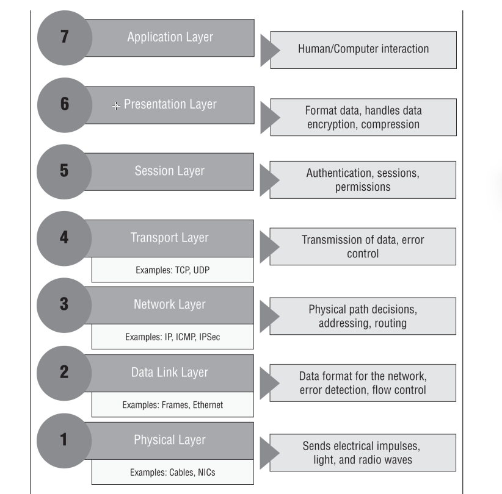
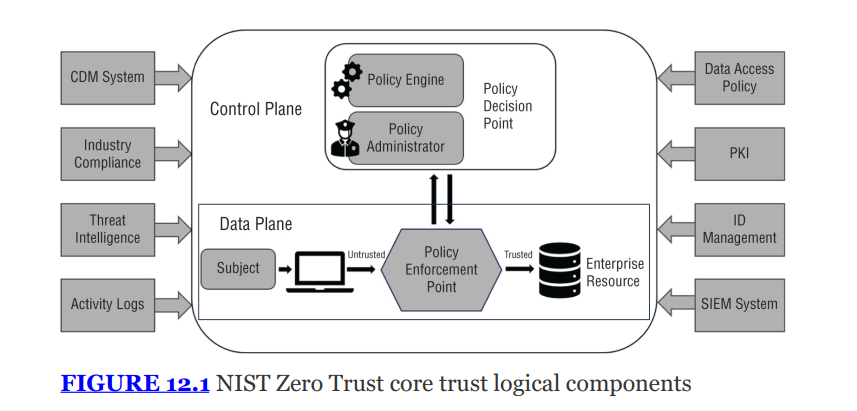
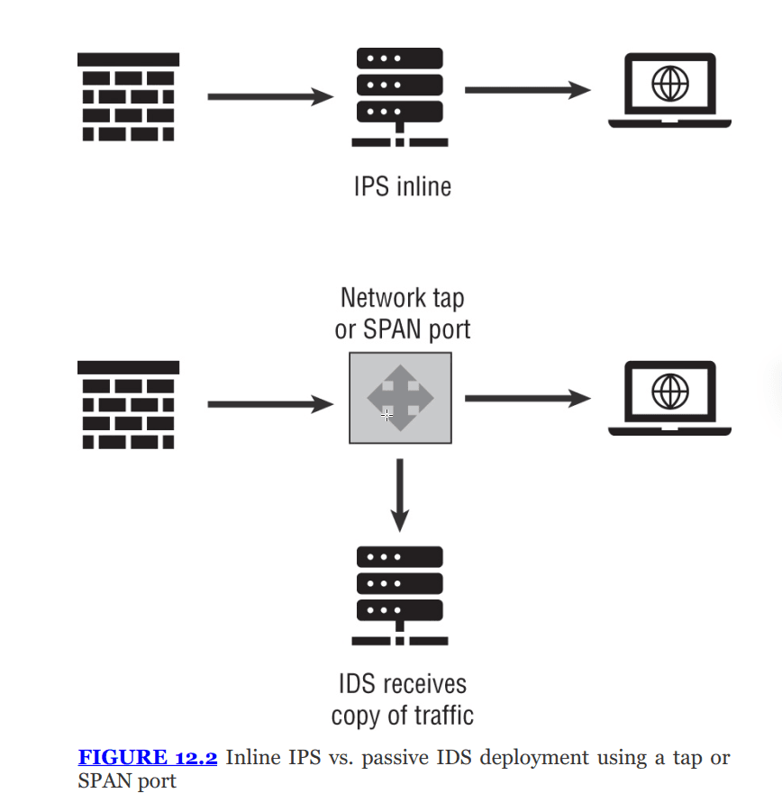
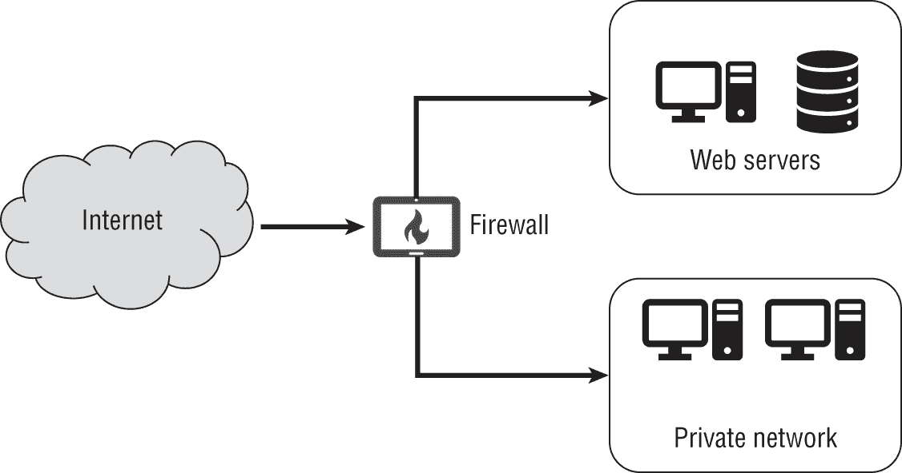
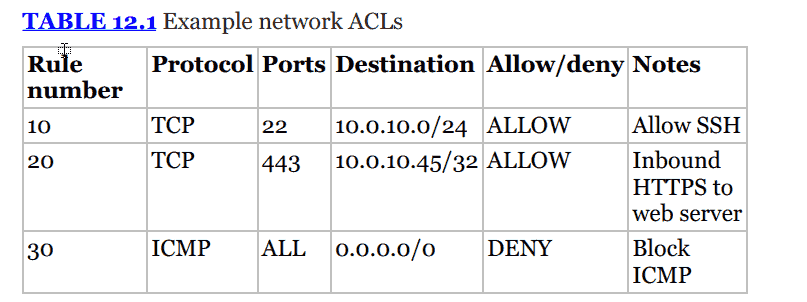
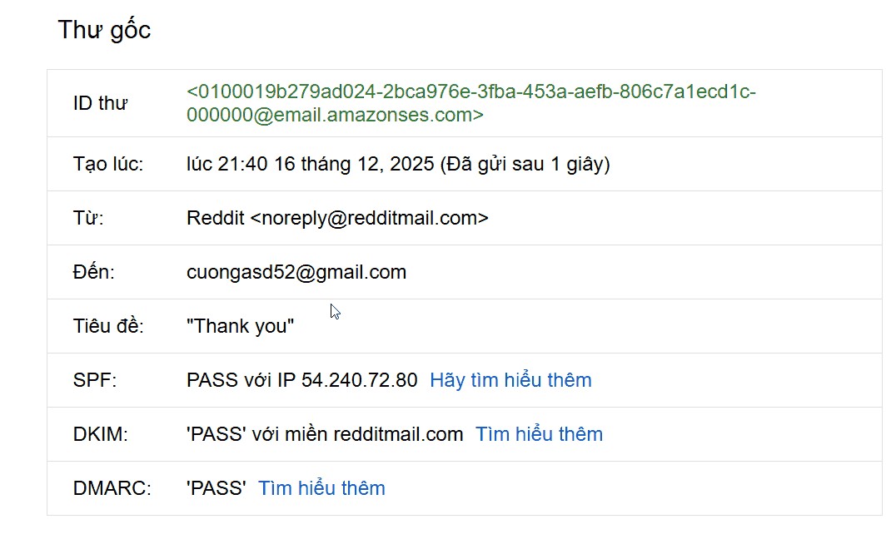
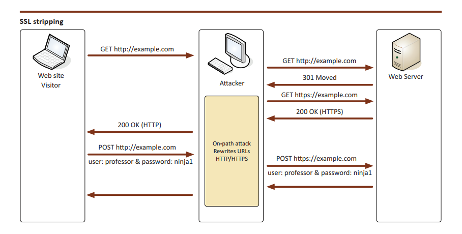

---


# THE COMPTIA SECURITY+ EXAM OBJECTIVES COVERED IN THIS CHAPTER INCLUDE: {#2c17b0eb61a4804eb750fb76374952c5}


## Domain 1.0: General Security Concepts {#2c17b0eb61a480acaad3ce6e99d07b5a}


### 1.2. Summarize fundamental security concepts. {#2c17b0eb61a48039ab24db8aa45d1b3a}

- Zero Trust (Control plane (Adaptive identity, Threat scope reducưtion, Policy-driven access control, Policy Administrator, Policy Engine), Data Plane (Implicit trust zones, Subject/System, Policy Enforcement Point))
- Deception and disruption technology (Honeypot, Honeynet, Honeyfile, Honeytoken)

## Domain 2.0: Threats, Vulnerabilities, and Mitigations {#2c17b0eb61a480309ebec50fc73f1cf6}


### 2.4. Given a scenario, analyze indicators of malicious activity. {#2c17b0eb61a480498776f178757af022}

- Network attacks (Distributed denial-of-service (DDoS) (Amplified, Reflected), Domain Name System (DNS) attacks, Wireless, On-path, Credential replay, Malicious code)

### 2.5. Explain the purpose of mitigation techniques used to secure the enterprise. {#2c17b0eb61a48034818becd2a12a42aa}

- Segmentation
- Access control (Access control list (ACL))

## Domain 3.0: Security Architecture {#2c17b0eb61a480919d9de22f877b2f1f}


### 3.1. Compare and contrast security implications of different architecture models. {#2c17b0eb61a480409f39ff9b36c6e02c}

- Architecture and infrastructure concepts (Network infrastructure (Physical isolation (Air-gapped), Logical segmentation, Software-defined networking (SDN)), High availability)

### 3.2. Given a scenario, apply security principles to secure enterprise infrastructure. {#2c17b0eb61a480cea62ff208c6d7d860}

- Infrastructure considerations (Device placement, Security zones, Attack surface, Connectivity, Failure modes (Fail-open, Fail-closed), Device attribute (Active vs. passive, Inline vs. tap/monitor), Network appliances (Jump server, Proxy server, Intrusion prevention system (IPS)/Intrusion detection system (IDS), Load balancer, Sensors), Port security (802.1X, Extensible Authentication Protocol (EAP)), Firewall types (Web application firewall (WAF), Unified threat management (UTM), Next-generation firewall (NGFW), Layer 4/Layer 7))
- Secure communications/access (Virtual private network (VPN), Remote access, Tunneling, (Transport Layer Security (TLS), Internet protocol security (IPSec)) Software-defined wide area network (SDWAN). Secure access service edge (SASE))
- Selection of effective controls

## Domain 4.0: Security Operations {#2c17b0eb61a480628dedce10f18f2259}


### 4.1. Given a scenario, apply common security techniques to computing resources. {#2c17b0eb61a480a49aade3a9f21fc462}

- Hardening targets (Switches, Routers)

### 4.4. Explain security alerting and monitoring concepts and tools. {#2c17b0eb61a480f8958cfc08119943ac}

- Tools (Simple Network Management Protocol (SNMP) traps)

### 4.5. Given a scenario, modify enterprise capabilities to enhance security. {#2c17b0eb61a4803bb628c179414d0f72}

- Firewall (Rules, Access lists, Ports/protocols, Screened subnets)
- IDS/IPS (Trends, Signatures)
- Web filter (Agent-based, Centralized proxy, Universal Resource Locator (URL) scanning, Content categorization, Block rules, Reputation)
- Implementation of secure protocols (Protocol selection, Port selection, Transport method)
- DNS filtering
- Email Security (Domain-based Message Authentication Reporting and Conformance (DMARC), DomainKeys Identified Mail (DKIM), Sender Policy Framework (SPF), Gateway)
- File integrity monitoring DLP
- Network Access Control (NAC)

---


Nội dung chính của chương:

- Network attack surfaces
- Network segmentation, chia thành security zones
- Các biện pháp bạo vệ: port security, VPNs, tunneling, SDN
- Các thiết bị mạng và bảo mật: Jump servers, load balancers, proxy servers, intrusion detection and prevention
- Quản lý và gia cố mạng (hardening): sử dụng ACLs, DNS filtering
- Secure protocol and secure email
- Dấu hiệu hoạt động độc hại: On-path attack, DDoS, credential replay attacks

---


## Design secure network {#2c17b0eb61a48014b12bd537edb3e882}


Các môi trường mạng đa số dựa trên concep defense-in-depth (layred security).

- Nguyên lý: không có biện pháp bảo mật nào là hoàn hảo. Nếu một lớp bị vượt qua, các lớp còn lại sẽ ngăn chặn quá trình tấn công đó.

:::tip

3 loại control trong DiD
- Administrative controls: dùng security policies, user awareness training, onboarding/offboarding, backgrouncheck)

- Technical/logical controls

- Physical control

Khi một hacker cố gắng đánh cắp dữ liệu

- **Lớp mạng (Network):** Hacker cố gắng quét cổng (scan port). -> **Firewall** chặn lại.

- **Lớp ứng dụng (App):** Hacker gửi email đính kèm mã độc. -> **Email Gateway** chặn lại.

- **Lớp con người (User):** Email lọt qua, nhân viên nhận được nhưng đã được **Đào tạo (Training)** nên không click vào.

- **Lớp thiết bị (Endpoint):** Nhân viên lỡ tay click, nhưng **Antivirus (EDR)** phát hiện và diệt mã độc.

- **Lớp dữ liệu (Data):** Mã độc chạy được nhưng không đọc được file vì file đã bị **Mã hóa (Encryption)**.

- **Lớp vật lý (Physical):** Hacker nản chí, định đột nhập vào phòng server để lấy ổ cứng, nhưng bị **Bảo vệ** chặn lại ở cửa và cửa cần **Thẻ từ** để mở.

:::





### Infrastructure considerations {#2c17b0eb61a480c7a458ec71ad11d07d}


Khi thiết kế hạ tầng, cần cân nhắc yếu tố ảnh hưởng đến chi phí, khả năng quản lý và tính sẵn sàng

- Attack surfaces: là tất cả các điểm mà người dùng không được ủy quyền có thể truy cập (dịch vụ, giao diện quản lý,…). Hiểu rõ attack surface là chìa khóa để thiết kế bảo mật
- Device placement: thiết bị cần đặt ở các vị trí chiến lược như biên mạng (network borders), datacenter border, giữa các network segments/VLANs để kiểm soát lưu lượng tối ưu
- Security zones:
	- Các vùng mạng phân đoạn (vật lý hoặc ảo) được tách biệt dựa trên mức độ tin cậy hoặc độ nhạy cảm của dữ liệu
	- Vd: mạng khác (guest networks), mạng hướng Internet (internet-facing networks - DMZ) và management VLANs dành riêng cho router/switch
- Connectivity considerations: bao gồm cách kết nối internet, redundant connections, tốc độ, loại đường truyền (cáp quang, đồng, không dây)
	- Failure modes: khi một thiết bị bảo mật bị lỗi, nó sẽ hoạt động như thế nào?
		- Fail-closed: chặn tất cả lưu lượng khi lỗi, an toàn hơn, bảo mật, nhưng gián đoạn kinh doanh
		- Fail-open: cho phép tất cả lưu lượng đi qua khi lỗi, nguy hiểm nhưng duy trì kinh doanh
	- Network taps: thiết bị dùng giám sát lưu lượng
		- Active: cần nguồn điện
		- Passive: không cần nguồn điện, thường dùng để copy lưu lượng thay vì tương tác trực tiếp

## Network design concepts {#2c17b0eb61a480c199b3d0c3b118b8cf}


### Physical isolations {#2c17b0eb61a48041bff2fd1631ea88f7}

- Thường được gọi là thiết kế air-gapped
- Ý tưởng: tách biệt hoàn toàn thiết bị, không có kết nối cáp hay mạng nào
- Yêu cầu: phải có sự hiện diện vật lý để truyền dữ liệu (USB), ngăn chặn kẻ tấn công từ xa
- Cảnh báo: when air gaps fails, điển hình là mã độc Stuxnet, nó được thiết kế để vượt air-gapped bằng cách lây nhiễm qua USB, khi kĩ thuật viên cắm USB và hệ thống cô lập, mã độc vẫn tất công được.

### Logical segmentation {#2c17b0eb61a480b5a945d7e8dbb8babc}

- Sử dụng phần mềm hoặc cấu hình thay vì thiết bị vật lý riêng biệt
- Phổ biến nhất là VLANs
- Các packets được gắn thể (tag) để biết chúng thuộc VLAN nào,
- Tấn công vào phân đoạn logic thường cố gắng nhảy qua các rào cản phần mềm để truy cập sang phân đoạn khác

### High availabilty {#2c17b0eb61a4807a8ba0c3dab1f90c7a}

- Khả năng của hệ thống hoạt động liên tục không có thời gian downtime
- Thiết kế HA cho phép nâng cấp, vá lỗi, hoặc chịu lỗi hệ thống mà không gián đoạn dịch vụ
- Giải pháp: clustering, load balancing
- Mục tiêu: loại bỏ các điểm lỗi đơn lẻ SPOF

### Implementing secure protocols {#2c17b0eb61a480c59e57e3add5fc13ef}


Bảo mật luồng giao tiếp bằng cách chọn đúng giao thức và cấu hình

- Secure protocols: sử dụng phiên bản bảo mật thay vì bản thường
	- HTTPS cho HTTP
	- SSH cho telnet
- Port selection:
	- Các giao thức thường có cổng mặc định (ví dụ: HTTPS dùng port 443, HTTP dùng port 80).
	- Một số dịch vụ như Microsoft SQL Server (TCP 1433) dựa vào yêu cầu của client để thiết lập kết nối TLS.
- Transport method: tranh việc downgrade attack sử dụng giao thức hạ cấp, không bảo mật

> Security through obscurity

	- Một số tổ chức đổi port mặc định (chạy web server trên port khác 80) để tránh bị scan
	- Tuy nhiên các công cụ port scan chuyên nghiệp vẫn tìm ra dịch vụ. Đổi port không phải là biện pháp bảo mật mạnh, chỉ giảm noise

### Reputation services {#2c17b0eb61a480fc80bad94cf25650d5}

- Đây là các dịch vụ và luồng dữ liệu theo dõi các địa chỉ IP, tên miền (domains) và máy chủ (hosts) có hành vi độc hại.
- Dữ liệu này thường được kết hợp với _Threat feeds_ (nguồn tin tình báo về mối đe dọa) và giám sát log để chặn hoặc theo dõi các tác nhân nguy hiểm.

### SDN  {#2c17b0eb61a480ba8f6bf5eeb2667d7f}

- Sử dụng cấu hình dựa trên phần mềm để điều khiển mạng thay vì cấu hình thủ công từng thiết bị phần cứng
- SDN tách rời lớp control plane và data plane, cho phép quản lý tập trung và tùy chỉnh linh hoạt
- Về bảo mật: SDN cho phép thay đổi cấu hình động, ví dụ: tự động thêm hệ thống vào _Security zones_ hoặc cách ly chúng khi cần kiểm dịch (_quarantine_).

### SD-WAN (Software-define Wide area network) {#2c17b0eb61a4804d81c9f165792e2f77}

- Là thiết kế mạng diện rộng ảo, kết hợp nhiều dịch vụ kết nối MLPS, 4G/5G, broadband
- Giúp định tuyến lưu lượng thông minh dựa trên ứng dụng và tối ưu chi phí
	- Gộp nhiều đường truyền (4G, 5G, MPLS) thành một đường to
	- **Sự thông minh:** Nó giống như **Google Maps** cho gói tin.
		- Nó nhìn thấy đường Internet đang tắc → Nó lái dữ liệu quan trọng (như Zoom, VoIP) sang đường 4G nhanh hơn.
		- Nó thấy nhân viên đang xem YouTube → Nó đẩy sang đường Internet giá rẻ.
	- **Vấn đề của SD-WAN:** Nó làm rất tốt việc định tuyến (Routing), nhưng nó **thiếu khả năng bảo mật sâu**.
		- _Ví dụ:_ Nếu một chi nhánh kết nối thẳng ra Internet bằng SD-WAN, hacker có thể tấn công vào chi nhánh đó. Do đó, các công ty thường phải dồn lưu lượng về trụ sở chính (Backhaul) để qua Firewall trung tâm rồi mới cho ra Internet. Điều này làm mạng bị chậm (độ trễ cao).
- Lưu ý: MPLS sử dụng "nhãn" (_labels_) để chuyển tiếp dữ liệu thay vì địa chỉ mạng, thường dùng cho các kết nối yêu cầu độ trễ thấp (voice/video). Tuy nhiên, các tổ chức đang dần chuyển từ MPLS sang SD-WAN.

### Secure access service edge (SASE) {#2c17b0eb61a480d8a2e5f3bc02d8faca}

- Do SD-WAN chưa đảm bảo bảo mật
- đoc là sassy - là mô hình kết hợp VPN, SD-WAN và các công cụ bảo mật đám mây như firewalls, CASBs, Zero trust thành một dịch vụ thống nhất: CLOUD-NATIVE

```powershell
SASE = Network (SD-WAN) + Security (SSE)
```


Trong đó phần **Security (SSE - Security Service Edge)** bao gồm 4 món chính mà Security+ hay hỏi:

1. **SWG (Secure Web Gateway):** Chặn nhân viên vào web đen, web độc hại.
2. **CASB (Cloud Access Security Broker):** Kiểm soát việc dùng các app SaaS (ví dụ: chặn nhân viên upload dữ liệu mật lên Google Drive cá nhân).
3. **ZTNA (Zero Trust Network Access):** Thay thế VPN truyền thống. Cấp quyền truy cập cụ thể vào từng ứng dụng, không cho vào toàn bộ mạng.
4. **FWaaS (Firewall as a Service):** Tường lửa thế hệ mới đặt trên mây, không cần mua cục tường lửa phần cứng đặt ở văn phòng nữa.
- Mục tiêu: đảm bảo thiết bị truy cập an toàn bất kể vị trí địa lý

:::tip

Chọn SD-WAN khi vấn đề chính là kết nối và chi phí đường truyền
Chọn SASE khi yêu cầu bảo mật đám mây và làm việc từ xa

:::


### So sánh SDN, SD-WAN {#2cc7b0eb61a4809d9d41e42aa43421fa}

- SDN thuần túy trong intranet
	- Băng thông lớn, độ trễ thấp
	- Dùng OpenFlow
- SD-WAN: áp dụng tư duy SD nhưng cho mạng diện rộng
	- Không làm chủ đường truyền mà thuê của VNPT, Viettel,…

:::tip

Ví dụ thực tế về việc sử dụng SASE
- Bối cảnh: Anh Nam đang làm việc tại quán cà phê với CRM (nội bộ) và Microsoft 365 (public)

- Cách cũ: dùng VPN toàn bộ dữ liệu làm việc hay giải trí đều hút về công ty (backhaul) để đi qua firewall ở đó rồi mới ra mạng

- Dùng SASE:

Ví dụ 2: Chuỗi cửa hàng bán lẻ (Retail Chain) - Tiết kiệm chi phí phần cứng

- **Bối cảnh:** Một chuỗi siêu thị tiện lợi (như Circle K hay WinMart) muốn mở 500 cửa hàng mới trên toàn quốc.

- **Vấn đề:**

- **Cách dùng SASE:**

---

**Ví dụ 3: Kiểm soát dữ liệu nhạy cảm (DLP & CASB)**
• **Bối cảnh:** Công ty cho phép nhân viên dùng các ứng dụng SaaS như Google Drive, Dropbox, Slack để làm việc.
• **Rủi ro:** Một nhân viên sắp nghỉ việc định copy danh sách khách hàng (file Excel) và upload lên Google Drive **cá nhân** của anh ta để mang về.
• **Cách dùng SASE:**
    ◦ Lưu lượng đi qua đám mây SASE sẽ bị soi xét bởi thành phần **CASB (Cloud Access Security Broker)** và **DLP (Data Loss Prevention)**.
    ◦ Hệ thống SASE đủ thông minh để phân biệt:
        ▪ Nếu upload lên `nhanvien@congty.com` (Google Drive công ty) → **CHO PHÉP**.
        ▪ Nếu upload lên `nhanvien@gmail.com` (Google Drive cá nhân) → **CHẶN NGAY LẬP TỨC** và báo động cho Admin.
    ◦ Nó làm được điều này kể cả khi nhân viên đang ngồi ở nhà, không kết nối VPN công ty.

:::


## Network segmentation {#2c17b0eb61a480c5a63bce9437c0a733}


Là khái niệm cốt lõi để chia nhỏ mạng nhằm tăng cường bảo mật

- Concept: chia mạng thành các nhóm logic hoặc vật lý dựa trên ranh giới tin cậy
- VLANs: là công nghệ phổ biến nhất ở layer 2
	- Tạo ra một broadcast domain riêng biệt. Chỉ các thiết bị trong cùng VLAN mới nhận được gói tin broadcast của nhau, giảm nhiễu và ngăn chặn kẻ tấn công lan truyền
- Các kiểu phân vùng mạng cụ thể:
	- Screened subnet (DMZ): vùng mạng chứa các hệ thống cần tiếp xúc với internet (web servers) nhưng được tách biệt với nội bộ
	- Intranets: mạng nội bộ cho nhân viên
	- extranets: mạng mở rộng cho đối tác hoặc khách hàng truy cập (không phải công chúng)

## Zero trust {#2c17b0eb61a4808da2ded58a6e3228a7}

- Nguyên lý cốt lõi: never trust, always verify
	- Khác với mô hình moat and castle, zero trust giả định không có biên giới mạng nào là an toàn
	- Mọi yêu cầu truy cập (trong - ngoài) đều phải được xác thực dựa trên danh tính, quyền hạn, cấu hình hệ thống và tình báo mối đe dọa
- East-west traffic:
	- North-south: ra vào mạng
	- East-west: là trong data center

## Zero trust model {#2c17b0eb61a480779098c69ab3da1fae}




- Subjects: người dùng hoặc thiết bị yêu cầu truy cập
- PDP: là trung tâm đầu não gồm:
	- Policy engine: ra quyết định, nó dùng thuật toán tin cậy (trust algo) để quyết định cho hay không cho truy cập
		- access, deny, revoke
	- Policy administrator: thực hiện quyết định của policy engine
		- giao tiếp với PEP để cho phép hoặc không cho phép
		- Tạo tokens hoặc credentials
- Policy enforment point (PEP): cổng gác: nơi chặn hoặc cho phép lưu lượng đi qua dựa trên chỉ đạo của policy administrator

### Control plane vs data plane trong zero trust {#2c17b0eb61a480b2a71dd0821e211ee5}

- Control plane: nơi ra quyết định và quản lý
	- Adaptive identity: xác thực ngữ cảnh (vị trí, thiết bị, hành vi)
	- Threat scope reduction: giảm thiểu phạm vi tấn công (limited blast radius)
	- Policy-driven access control: là việc thực hiện control theo policy
	- Policy administrator: thực hiện quyết định của policy engine
- Data plane: nơi dữ liệu thực sự di chuyển:
	- Implicit trust zones: vùng tin cậy ngầm định, nơi người dùng được hoạt động sau khi xác thực
	- Subject and systems: thiết bị/người dùng đang tìm kiếm quyền truy cập
	- Policy Enforcement Points, which match the NIST description

### Cơ chế thu nhận thông tin {#2db7b0eb61a480c98847f2cdb779bf14}

- **Cơ chế Automation:** Policy Engine cần "nguyên liệu" (Input Data) để tự động ra quyết định.
- **Các nguồn dữ liệu tiêu chuẩn (Standard Trust Signals):**
	- **User Identity:** (IAM, MFA status).
	- **Device Health:** (EDR, Patch level).
	- **Network Context:** (SIEM logs, Threat Feeds, Geolocation).
- **Ngoại lệ:** Dữ liệu **Vật lý thô (Physical Sensors)** như Infrared, độ ẩm, nhiệt độ... thường ít được dùng trực tiếp trong các quyết định truy cập mạng (Logical Access) vì thiếu ngữ cảnh cụ thể về người dùng.
- Sau khi thu thập thông tin thì policy engine sẽ tổng hợp thông tin trên và tính toán ra confidence level/trust score.
	- Vd: điểm tin cậy là 80/100. Nếu tài nguyên yêu cầu là dữ liệu cần 90 điểm thì từ chối. Nếu tài nguyên là 50 điểm thì grant → probabilistic thay thì deterministic như các phương pháp khác (VPN, MFA)

### Adaptive authentication {#2db7b0eb61a48034a9f6f26c59c22367}


Điều chỉnh độ khó dựa trên ngữ cảnh/rủi ro:

- Location:
- Device posture: OS version, patch, antivirus
- User behavior
- Device identity: unknown vs registered

:::tip

Ví dụ về zero trust trong thực tế
Bối cảnh: Alice ngồi quán cafe, dùng wifi công cộng truy cập ketoan.congty.com

Bước 1: chặn đứng tại cổng (the intercept)

- Hành động: alice gõ địa chỉ web, gói tin của Alice đi đến PEP (data plane là gateway hoặc agent trên máy Alice) chặn lại

Bước 2: Control plane hoạt động

- PEP gửi tín hiệu sang control plane để hỏi PE và PE bắt đầu thu thập trust signals

Bước 3: Ra quyết định

- An toàn: MFA đúng + laptop không virus + vị trí hợp lệ, đúng giờ

- **Tình huống B (Rủi ro):** Alice nhập đúng mật khẩu, NHƯNG phần mềm diệt virus trên máy cô ấy bị tắt.

Bước 4: Kết nối - data plane mở ra, 

- Sau khi control plane duyệt, PEP mở một tunnel mã hóa từ laptop Alice tới server kế toán

- Bây giờ dữ liệu đi qua đường hầm này

- Alice chỉ thấy server kế toán, cô ấy hoàn toàn mù với các server khác (micro-segmentation)

:::


### Tại sao an toàn hơn VPN {#2db7b0eb61a48061b7ddf93e5f4fb4b3}


| **Đặc điểm**        | **VPN truyền thống (Castle & Moat)**                                                                   | **Zero Trust (NIST SP 800-207)**                                                                                                              |
| ------------------- | ------------------------------------------------------------------------------------------------------ | --------------------------------------------------------------------------------------------------------------------------------------------- |
| **Cơ chế**          | Giống vé vào cổng công viên.                                                                           | Giống cửa an ninh sân bay.                                                                                                                    |
| **Control Plane**   | Xác thực 1 lần lúc đăng nhập.                                                                          | **Xác thực liên tục (Continuous Verification).**                                                                                              |
| **Data Plane**      | Sau khi vào cổng, bạn tự do chạy đi chơi đu quay, cầu trượt (Hacker vào được là thấy hết mạng nội bộ). | Bạn chỉ được phép đi từ cửa A đến cửa B. Muốn sang cửa C? Phải kiểm tra an ninh lại từ đầu.                                                   |
| **Nếu lộ mật khẩu** | Hacker vào được VPN -> Vào được cả công ty.                                                            | Hacker có mật khẩu Alice nhưng máy hacker không có chứng chỉ thiết bị (Device Certificate) -> **Policy Engine từ chối** -> Hacker đứng ngoài. |


## Network access control & 802.1X {#2c17b0eb61a4802b9b19d00be6bed0fd}


NAC là một giải pháp bảo mật, sử dụng nhiều công cụ có thể có cả 802.1X để quản lý truy cập, nó hỏi bạn là ai nhưng có ngữ cảnh, làm gì, ở đâu, được phép làm gì

- Xác định xem thiết bị có đủ điều kiện an toàn (patch level, antivirus, settings,…) để vào mạng hay không
	- Nếu không đạt chuẩn, thiết bị bị đưa vào quarantine network để sửa chữa
	- 
- Phương thức triển khai NAC:
	- Agent: cài phần mềm lên máy, cung cấp thông tin chi tiết nhưng phức tạp
	- Agentless: quét qua mạng hoặc trình duyệt, nhẹ hơn nhưng ít chi tiết hơn
	- Time of check:
		- Preadmission: kiểm tra trước khi vào mạng
		- Postadmission: kiểm tra sau khi kết nối (theo dõi hành vi)

**Các tính năng mở rộng của NAC:**

- **Posture Assessment (Kiểm tra sức khỏe thiết bị):** Trước khi cho vào mạng, NAC kiểm tra xem máy tính có cài Antivirus chưa? Windows có update bản vá lỗi mới nhất không? Nếu không -&gt; Đẩy vào vùng cách ly (Quarantine VLAN) để cập nhật.
- **Profiling (Hồ sơ hóa thiết bị):** Tự động nhận diện thiết bị không có người dùng (như Camera IP, máy in, thiết bị IoT) để cấp quyền hạn chế mà không cần đăng nhập user/pass phức tạp.
- **Guest Management:** Cung cấp cổng portal cho khách đăng ký wifi có thời hạn.
- **Remediation (Khắc phục):** Tự động hướng dẫn người dùng sửa lỗi (ví dụ: bật firewall) để được truy cập lại

### 802.1X {#2c17b0eb61a48083be8fd8beeeb7883e}


Là tiêu chuẩn xác thực cho mạng có dây và không dây port-based authentication. Như người bảo vệ kiểm tra giấy tờ (username/password, certifications)


Thành phần chính:

- Supplicant: thiết bị người dùng muốn kết nối
- Authenticator: thiết bị mạng (switch/wireless AP) đóng vai trò người gác cửa
- Authentication server: máy chủ trung tâm (thường dùng giao thức RADIUS/EAP) để kiểm tra thông tin xác thực

## Port security and port-level protections {#2c17b0eb61a48087891bdb9ae984e265}

- Port security:
	- Giới hạn số lượng địa chỉ MAC có thể sử dụng trên một cổng duy nhất
	- Mục đích: ngăn chặn giả mạo MAC (MAC spoofing) và tấn công CAM(content-addressable memory) table overflow. Khi bảng CAM bị đầy, switch có thể bị lỗi và chuyển sang chế độ (fail-open) biến thành Hub, gửi lưu lượng ra tất cả các cổng, giúp kẻ tấn công nghe lén dữ liệu

:::tip

CAM là bộ nhớ sử dụng trong router, khác với RAM, đưa nó dữ liệu trả về địa chỉ.
CAM và TCAM đã học trong sách top-down approach

:::


- Loop prevention:
	- Vòng lặp xảy ra khi mạng cắm sai tạo thành vòng tròn và nghẽn mạng.
	- Spanning tree protocol (STP): giao thức chính để phát hiện và vô hiệu hóa các cổng gây ra vòng lặp
- Broadcast storm prevention: xảy ra khi broadcast được khuếch đại thường do loop, tê liệt mạng. Switch có thể giới hạn tốc độ lưu lượng broadcast để ngăn chặn
- BDPU (bridge protocol data unit) guard: bảo vệ STP, ngăn các thiết bị không được phép (như switch lạ) gửi các gói tin BDPU vào mạng. Nếu phát hiện BDPU trên cổng người dùng, nó sẽ tắt cổng đó
- DHCP snooping: ngăn chặn rouge DHCP server (giả)
	- Switch chỉ cho phép các gói tin cấp phát IP DHCP offer đi ra từ các cổng được tin cậy. Nó cũng kiểm tra xem địa chỉ MAC có nguồn khớp với yêu cầu không để chống giả mạo

## VPN and remote access {#2c27b0eb61a48027b0f5ee8f18791664}


Virtual private network là công nghệ tạo kết nối mạng ảo an toàn qua mạng công cộng

- Tạo một virtual network link khiến các thiết bị đầu cuối hoạt động như thể chúng đang ở trên cùng một mạng cục bộ
- Hai công nghệ VPN:
	- IPSec VPNs: hoạt động ở layer 3
		- Tunnel mode: mã hóa toàn bộ gói tin (cả header và data). Tương thích mọi ứng dụng
		- Transport mode: chỉ mã hóa phần payload, giữ nguyên IP header
		- Thường dùng cho site-to-site (văn phòng công ty kết nối với nhau)
		- Vd:
			- **Doanh nghiệp:** Cisco AnyConnect, Palo Alto GlobalProtect (App cài trên máy), IPsec VPN.
			- Cá nhân: nordVPN, ExpressVPN, wireGuard
	- SSL VPNs: hoạt động ở layer 4/7
		- **Hoạt động tại:**
			- **Layer 7 (Application):** Nếu dùng chế độ **Portal Mode** (Clientless).
				- Không cần cài gì, chỉ cần truy cập web của công ty và sử dụng ứng dụng trong đó
			- **Layer 4 (Transport) bọc Layer 3:** Nếu dùng chế độ **Tunnel Mode** (Client-based).
				- Nó tạo tunnel giống IPsec. Truy cập mọi thứ
				- Dễ qua tường lửa truy cập sâu như IPsec
		- Dùng TLS cho remote access (nhân viên kết nối từ xa tới văn phòng)

| **Đặc điểm**                | **IPsec VPN**                                                                                                                   | **SSL VPN (TLS VPN)**                                                                                                                           |
| --------------------------- | ------------------------------------------------------------------------------------------------------------------------------- | ----------------------------------------------------------------------------------------------------------------------------------------------- |
| **Mô hình chính**           | **Site-to-Site** (Kết nối 2 văn phòng).                                                                                         | **Remote Access** (Người dùng di động kết nối về văn phòng).                                                                                    |
| **Tầng OSI**                | **Layer 3** (Network).                                                                                                          | **Layer 4** (Transport) / Layer 7.                                                                                                              |
| **Cài đặt phía Client**     | **Phức tạp.** Phải cài phần mềm chuyên dụng (VPN Client) và cấu hình đúng tham số (IKE, IPsec policies).                        | **Đơn giản.** Thường chỉ cần trình duyệt Web (Clientless) hoặc app rất nhẹ (AnyConnect, OpenVPN).                                               |
| **Khả năng vượt Tường lửa** | **Kém (Khó tính).** Dùng cổng UDP 500/4500 và giao thức ESP (IP Protocol 50). Nhiều Wifi khách sạn/quán cafe chặn các cổng này. | **Tuyệt vời (Dễ tính).** Dùng cổng **TCP 443** (giống hệt HTTPS). Tường lửa quán cafe tưởng bạn đang lướt web nên cho qua hết.                  |
| **Quyền truy cập**          | **Toàn mạng (Full Network Access).** Khi kết nối xong, máy bạn như được cắm dây trực tiếp vào mạng công ty.                     | **Chi tiết (Granular Access).** Có thể chỉ cho phép bạn dùng Web App, Email chứ không cho ping lung tung (đặc biệt ở chế độ Portal/Clientless). |


Đối với người dùng remote user: hiện tại SSL VPN đang thay thế dần

- IPsec nặng nề, phức tạp hay lỗi, cần phải cài phần mềm: Cisco anyconnect, forticlient)
	- Nhưng vẫn bắt buộc xài với site-to-site hiệu năng cao, ổn định, chuẩn công nghiệp
	- IPsec tích hợp sâu vào hệ điều hành (kernel)
	- Nó nhanh hơn cả tunnel mode của SSL VPN (chạy trên TCP)
		- Nếu mạng lag thì TCP trong tunnel gửi lại, TCP bên ngoài tunnel cũng phải gửi lại gọi là TCP meltdown
		- Dù có chuyển sang UDP thì nó lại mất đi lợi thế giả dạng HTTPs
	- Non-web: gọi qua UDP, quản trị viên chạy server qua SSH
- SSL VPN: nhanh, chỉ cần mở chrome, gõ địa chỉ công ty đăng nhập là vào được
	- Dễ truy cập, dù tường lửa chặn IPsec nhưng SSL VPN thì thông chốt
	- "Web browser", "No client software", hoặc "Web apps" -> Hãy chọn **TLS/SSL VPN**.

---

- Phân loại theo mục đích sử dụng:
	- Site-to-site: Kết nối 2 văn phòng/mạng với nhau (always-on)
	- Remote-access VPN: dành cho nhân viên làm việc từ xa kết nối vào công ty khi as-need
		- Sử dụng cho người dùng bên ngoài vành đai vật lý của tổ chức
		- Khác với 802.1X dùng cho người bên trong vật lý của tổ chức (wifi, cắm port)
- Tunneling decision:
	- Full-tunnel: tất cả lưu lượng mạng của người dùng (kể cả lướt web cá nhân ) đều đi qua VPN về công ty rồi mới ra Internet. An toàn hơn khi dùng wifi công cộng vì kiểm soát mọi thứ
	- Split-tunnel: chỉ lưu lượng truy cập vào tài nguyên nội bộ công ty mới đi qua VPN. Lưu lượng khác, như xem youtube đi ra trực tiếp internet của người dùng → tiết kiệm băng thông công ty nhưng kém bảo mật hơn
- **Exam Note:** Mặc dù sách nói về IPSec và SSL VPNs, trong đề thi bạn có thể thấy thuật ngữ **TLS VPN** thay thế cho SSL VPN (vì SSL đã cũ), và chúng được liệt kê dưới mục **Tunneling**.

---


### Kẻ mới nổi: WireGuard {#2cc7b0eb61a480e2a378dfcd9a37d053}


Hiện nay, cả IPsec và OpenVPN đều đang bị coi là "già cỗi" so với một ngôi sao mới nổi mà NordVPN (NordLynx) hay ExpressVPN (Lightway - _tương tự_) đang dùng.


| **Đặc điểm**       | **IPsec (IKEv2)**                                      | **SSL VPN (OpenVPN)**          | **WireGuard (NordLynx)**                                    |
| ------------------ | ------------------------------------------------------ | ------------------------------ | ----------------------------------------------------------- |
| **Tốc độ**         | Rất Nhanh (Kernel)                                     | Trung bình (User space)        | **Cực Nhanh** (Code tối ưu, mã hóa hiện đại ChaCha20).      |
| **Code Base**      | Rất nặng (Hàng trăm ngàn dòng code). Khó kiểm tra lỗi. | Rất nặng.                      | **Siêu nhẹ** (Chỉ 4.000 dòng code). Rất ít lỗi, dễ bảo trì. |
| **Di động**        | Rất tốt (MOBIKE).                                      | Kém.                           | **Tuyệt vời**. Chuyển mạng trong tích tắc.                  |
| **Vượt Tường lửa** | Kém (Dễ bị chặn port UDP).                             | **Tốt nhất** (Giả dạng HTTPS). | Trung bình (Dùng UDP, cần kỹ thuật obfuscation để giấu).    |


## Network appliances and security tools {#2c47b0eb61a48003b825f54eccc92286}


Nói về việc lựa chọn hình thức triển khai thiết bị trong thiết kế mạng

	- Form factors:
		- Hardware appliances: thiết bị phần cứng chuyên dụng. Ưu điểm: tốc độ xử lý cao do tính chuyên biệt
		- Virtual machines/ software appliances: chạy trên hệ điều hành có sẵn hoặc ảo hóa. Dễ triển khai và mở rộng, nhưng phụ thuộc hạ tầng bên dưới
	- Vendor choices: căn nhắc giữa mã nguồn mở và thương mại (proprietary commercial) - hỗ trợ tốt hơn, tích hợp tính năng và chứng chỉ

## Jump server {#2c47b0eb61a480bdae0acf58f25b9464}

- Còn gọi là jump boxes
- Là hệ thống bảo mật và giám sát chặt chẽ, dùng làm trung gian để quản trị viên truy cập vào các vùng mạng khác nhau.
- Truy cập qua SSH hoặc RDP, quan trọng là phải duy trì audit trail (dấu vết kiểm toán) để phục vụ điều tra sự cố

## Load balancing {#2c47b0eb61a4809e87a0f8917dd6ebb4}

- Mục đích: phân phối lưu lượng đến nhiều hệ thống để tăng hiệu suất, cung cấp tính redundancy, cho phép bảo trì/nâng cấp không gián đoạn
- Load balancer thường đại diện bằng virtual IP
	- Không liên quan tới session persistent mà là high availability
	- Hoạt động như cô nhân viên tiếp tân điều phối cho khách vào phòng nào còn trống
	- **Virtual IP (VIP)** mục đích
		- để chống bị xâm nhập, hacker có Virtual IP chả sao cả
		- Nếu dùng IP gốc thì server hỏng hóc, mạng tê liệt
		- Thay đổi linh hoạt giữa các server
- Các chế độ hoạt động:
	- Active/active: tất cả các máy chủ đều xử lý lưu lượng cùng lúc
	- Active/passive: một số máy chủ để chế độ chờ (backup), chỉ online khi máy chủ chính gặp sự cố
- Thuật toán lập lịch để thực hiện load balancer
	- Round-robin: gửi yêu cầu lần lượt theo danh sách
	- Least connection: gửi đến máy chủ đang có ít kết nối nhất, tức là đếm active sessions và phân chia cho thằng server ít tải nhất
	- Source IP hashing: dùng IP nguồn để định tuyến, giúp một client luôn kết nối vào cùng một server
	- Weighted algorithm: gán trọng số cho máy chủ mạnh hơn để xử lý. Load Balancer (bộ cân bằng tải) sẽ liên tục gửi các gói tin kiểm tra (health check) đến các máy chủ
		- **Server A:** Đang rảnh rỗi. Khi nhận yêu cầu, nó trả lời ngay lập tức. -> Thời gian phản hồi: **2ms** (Rất nhanh).
		- **Server B:** Đang bị quá tải (CPU 99%, RAM đầy). Khi nhận yêu cầu, nó phải xếp hàng đợi xử lý xong các việc cũ mới trả lời được. -> Thời gian phản hồi: **500ms** (Chậm).
- Persistent: (sticky sessions): đảm bảo client duy trì kết nối với cùng một server trong suốt phiên làm việc, đảm bảo trải nghiệm người dùng nhưng có thể khiến tải hông đều
	- Giả sử hệ thống có 3 máy chủ (1,2,3) đứng sau một load balancer:
		- Nếu dùng round-robin thì nếu đang làm việc với máy chủ 1 thì hết giờ sang máy chủ 2, mất thông tin trên giỏ hàng chẳng hạn
		- **Giải pháp (Session Persistence):** Christina cấu hình để Load Balancer "nhớ mặt" khách hàng A. "À, anh A này nãy giờ đang làm việc với Server 1. Vậy tất cả các cú click chuột tiếp theo của anh ấy trong 30 phút tới đều phải chuyển về đúng **Server 1**, không được chuyển đi đâu khác."

### Layer 4 vs. Layer 7 (Lớp 4 và Lớp 7) {#2c47b0eb61a480d396baf8157fdd691c}

- Sự khác biệt quan trọng trong tường lửa (Firewalls) và Load balancers:
	- **Layer 4 (Transport):** Chỉ nhìn thấy IP và Port. Nhanh nhưng ít thông tin.
	- **Layer 7 (Application - NGFW):** Hiểu được ứng dụng (Application awareness). Có thể chặn tấn công ứng dụng cụ thể nhưng tốn tài nguyên CPU/Memory hơn.

## Proxy servers and web filters {#2c47b0eb61a4803a8e0afe9c43022e8d}

- Proxy servers (máy chủ ủy quyền)
	- Nhận yêu cầu và chuyển tiếp chúng, giúp tập trung hóa việc quản lý, lọc và cache dữ liệu
	- Có 2 loại chính:
		- Forward proxies: đặt giữa client và internet. Giấu danh tính client, dùng để kiểm soát nhân viên truy cập web hoặc vượt tường lửa
		- Reverse proxies: đặt giữa internet và serer, dùng để load balancing, cache nội dung và bảo vệ server gốc
- Web filters:
	- Có thể là thiết bị proxy tập trung hoặc phần mềm agents
	- Chức năng: URL scannning, chặn theo content như người lớn, cờ bạc hoặc danh tiếng của trang web

## Data protection and IDS/IPS {#2c47b0eb61a480d2828cf8a8be6826fc}


### DLP {#2c47b0eb61a4801b8703e6fb947fd385}

- Giải phá ngăn chặn dữ liệu nhạy cảm bị gửi ra ngoài mạng (exfiltration)
- DLP thường kết hợp cài agent trên máy trạm và bộ lọc tại biên mạng hoặc email server
- Nó hoạt động dựa trên tagging dữ liệu hoặc quét metadata.
	- Hành động: chặn, gửi cảnh báo, bắt buộc mã hóa

### Intrusion detection/prevention systems {#2c47b0eb61a4802888c0e808d06b9ea8}

- Phát hiện IDS, phát hiện và ngăn chặn IPS
- Phương pháp phát hiện:
	- Signature based: so khớp mẫu/chữ ký đã biết của virus hoặc SQLi, XSS
		- Gặp zero day thì chịu
	- Anomaly-based: Tức là IPS/IDS học cái baseline bình thường của hệ thống, nếu phát hiện hành vi khác base line này thì ngăn chặn
		- Dễ false positive
	- Heuristic-based: dùng thuật toán và quy tắc logic để đoán hành vi xấu, không cần khớp 100% như Signature, không cần so sánh với baseline
		- Tìm kiếm những đoạn mã nguy hiểm.
		- Điểm mạnh: phát hiện biến thể mới của virus cũ
		- Điểm yếu: tốn tài nguyên xử lý
		- UEBA (user and entity behavior analytics) là công cụ specialized với heuristic-based này




### Configuration decisions: inline vs tap, active vs passive {#2c47b0eb61a480528109eafe846c094f}


Khi triển khai thiết bị giám sát, bảo mật, bạn phải chọn cách đấu nối:

- Inline: nằm trên đường truyền
	- Lưu lượng mạng đi xuyên qua thiết bị  (dùng cho IPS, firewall)
	- Ưu điểm: có thể chặn, sửa đổi lưu lượng
	- Nhược điểm: trở thành điểm lỗi, nếu thiết bị chết, mạng có thể mất kết nối (có thể fail-open hoặc fail-closed)
- Tap (monitor): dùng cho IDS
	- Sao chép lưu lượng để kiểm tra, lưu lượng gốc vẫn đi bình thường
	- Ưu điểm: không làm gián đoạn mạng nếu thiết bị bị hỏng. Dùng cho giám sát/phân tích (IDS)
	- Nhược điểm: không thể chặn tấn công trực tiếp
	- Phân loại taps:
		- Active: cần nguồn điện, tái tạo tín hiệu. Mất điện có thể gián đoạn mạng là SPAN (port mirroring)
		- Passive taps: chỉ tách tín hiệu (quang hoặc đồng), thường không cần nguồn hoặc có đường đi thẳng, an toàn hơn về mặt vật lý
			- **Cơ chế (Ví dụ chuẩn nhất là Fiber TAP - Cáp quang):** Bên trong thiết bị này không có chip xử lý, không có mạch điện. Nó chỉ là một hệ thống lăng kính/gương phản xạ (prism/splitter).
			- **Cách hoạt động:** Khi ánh sáng (tín hiệu mạng) đi qua, nó dùng lăng kính để tách luồng sáng đó ra.
				- **70% ánh sáng:** Đi thẳng tiếp đến đích (Server/Router).
				- **30% ánh sáng:** Bị tách ra và rẽ sang cổng Monitor (nơi gắn IDS).

## Firewalls {#2c47b0eb61a480d08792e9a73c7b7a86}


Là thành phần phổ biến nhất trong thiết kế mạng

- Stateless: còn gọi là packet filters:
	- Là loại cơ bản nhất, lọc từng gói tin dựa trên header như IP nguồn/đích, port và giao thức
	- Không quan tâm ngữ cảnh
- Stateful firewalls: (dynamic packet filters)
	- Thông minh hơn, theo dõi state của hội thoại giữa các cổng
	- Sử dụng state table để ghi nhớ kết nối, nếu một yêu cầu đã được cho phép ra ngoài, tường lửa sẽ tự động cho phép phản hồi quay lại mà không cần duyệt gói tin, cung cấp ngữ cảnh tốt hơn
- Các công nghệ tường lửa nâng cao:
	- Next-generation firewall (NGFW):
		- Là thiết bị bảo mật mạng “all in one”
		- Ngoài lọc gói tin nó còn deep packet inspection, tích hợp luôn IDS/IPS, antivirus, và quan trọng nhất là khả năng nhận diện ứng dụng (không chỉ nhìn port)
	- Unified threat management (UTM)
		- Thiết bị quản lý mối đe dọa thống nhất, gồm firewall, IDS/IPS, antimalware, lọc URL/email, DLP, VPN,…
		- Thường là giải pháp out of box (dùng ngay) của các tổ chức vừa và nhỏ
		- Cung cấp giao diện quản lý tập trung với nhiều chức năng

:::tip

The line between UTM and NGFW devices can be confusing, and the market continues to narrow the gaps between devices as each side offers additional features. UTM devices are typically used for an “out of box” solution where they can be quickly deployed and used, often for small to mid-sized organizations. NGFWs typically require more configuration and expertise.

:::


- Web application firewalls:
	- Được thiết kế riêng để chặn, phân tích và áp dụng cho lưu lượng web (HTTP/HTTPS)
	- Bảo vệ chống lại các tấn công ứng dụng web như SQL injection, XSS
	- WAF hiểu rõ nội dung gói tin web nên có thể chặn hoặc sửa đổi dữ liệu độc hại trong thời gian thực
	- Có thể hiểu WAF là firewall kết hợp với IPS
	- Khi gặp Zero-day Web App attack: **Dùng WAF chặn trước (Virtual Patch)** -> **Chờ Vendor ra bản vá** -> **Cài bản vá sau.**

	:::tip
	
	- **WAF:** Cần **Managed Rules** từ vendor để biết **CÁI GÌ** đang được dùng để tấn công (How).
	
	- **NGFW:** Cần **Threat Feeds** để biết **AI** đang tấn công (Who).
	
	:::
	
	


### Firewall rules and ACLs {#2c47b0eb61a48078908fdde7524814b0}


Firewall hoạt động nhờ vào firewall rules:

	- Quyết định lưu lượng nào được qua hoặc chặn
	- Cấu trúc thường bao gồm: source IP, des IP, port, protocol
	- Ví dụ: ALLOW TCP port any from 10.0.10.10/24 to 10.1.1.68/32 to TCP port 80
- Screen subnet (DMZ):
	- Mô hình dùng tường lửa tạo ra 3 vùng: internet (untrusted), mạng nội bộ (secured), công cộng (DMZ/screen subnet). DMZ chứa các web server đẻ người ngoài truy cập được nhưng không thể vào sâu vào mạng nội bộ

		

- ACLs
	- Là danh sách quy tắc truy cập quyền hoặc từ chối
	- Cú pháp Cisco (ví dụ): `access-list 100 permit tcp any host 10.10.10.1 eq http`.
	- Trong bảng ví dụ 12.1:
		- Rule 10: Allow SSH (Port 22).
		- Rule 20: Allow HTTPS (Port 443).
		- Rule 30: Deny ICMP (Chặn ping).
- **Cloud ACLs:** Các dịch vụ đám mây (như AWS VPC) cung cấp _Security groups_ hoạt động tương tự như tường lửa, cho phép gắn thẻ (_tag_) và quản lý theo nhóm.




## Deception and disruption technology {#2c47b0eb61a480b29ee2ddef66a0bb21}


Là nhóm công cụ được thiết kế để thu thập thông tin về kẻ tấn công và làm gián đoạn hoạt động tấn công của chúng

- Honeypots:
	- Các hệ thống cố ý tỏ ra vulnerable nhằm dụ dỗ hacker
	- Thực tế chúng được giám sát cực kỳ chặt chẽ để ghi lại mọi hành động, command, file mà hacker sử dụng
	- Mục đích: thu thập thông tin tình báo về công cụ, kỹ thuật của hacker
- Honeynets: mạng lưới nhiều honeypots
- Honeyfiles:
	- Dùng cho Intrusion detection - nếu hacker tấn công hệ thống thành công thì khả năng cao chúng sẽ tìm thấy honeyfiles mà chúng ta đã giăng ra sẵn
	- Các tệp tin giả mạo chứ dữ liệu có vẻ hấp dẫn (password.txt,…)
	- Nếu ai đó mở hoặc sao chép file này, hệ thống sẽ báo động
- Honeytokens:
	- Là các dữ liệu giả (như bản ghi trong database, email giả) được dùng để theo dõi việc đánh cắp dữ liệu
	- Nếu dữ liệu này xuất hiện bên ngoài tổ chức hoặc bị truy cập, chứng tỏ hệ thống đã bị xâm nhập

## Network security, services, and management {#2c47b0eb61a480b58e67eb32733c47bc}


### Out of band management {#2c47b0eb61a4803da85ec53752b975c9}

- Khái niệm: tách biệt đường truyền quản lý thiết bị khỏi đường truyền dữ liệu thông thường
- Mục đích: đảm bảo QTV vẫn có thể truy cập thiết bị ngay cả khi mạng chính bị tấn công hoặc tắc nghẽn
- Triển khai:
	- Sử dụng cổng vật lý riêng (console port)
	- Sử dụng management VLAN
	- Hoặc một hạ tầng vật lý tách biệt

### DNS {#2c47b0eb61a4809da875d9f665f147f8}

- DNSSEC: DNS security extensions: thêm tính năng xác thực cho DNS, giúp ngăn chặn giả mạo DNS bằng ký điện tử vào các bản ghi, đảm bảo dữ liệu trả về là chính xác
- DNS filtering: dịch vụ chặn truy cập các tên miền độc hại đã biết, hiệu quả với phishing

:::tip

Thông thường khi truy vấn DNS thì server sẽ trả lại IP, tuy nhiên không có cách nào để chứng minh đây là IP hợp lệ
Do đó phải dùng DNSSEC

- DNS không mã hóa dữ liệu, nó chỉ cung cấp tính xác thực

Thành phần:

- RRSIG (RR signature): chữ ký số

- DNSKEY: bản ghi chứa khóa công khai dùng để xác thực RRSIG

- DS (delegation signer): là bản hash của khóa DNSKEY, nhưng lưu ở parent zones

- **NSEC / NSEC3 (Next Secure):** Dùng để chứng minh một tên miền **không tồn tại**.

Tuy nhiên DNSSEC làm dữ liệu gửi đi tăng lên, dẫn đến DNS amplification attack

:::


- Ngoài ra còn có thêm DNS over HTTPS (DoH)
	- Gửi DNS qua HTTPS, port 443
	- Nhược: khó giám sát trong môi trường doanh nghiệp
- DNS over TLS (DoT):
	- gửi bằng TLS, port 853
	- Ưu điểm: admind dễ dàng quản lý

### Email security {#2c47b0eb61a480eeb709c98c59a757cf}


3 tiêu chuẩn để xác thực email cốt lõi để chống giả mạo (xác thực danh tính)

- SPF (sender policy framework): đối với người gửi khi thiết lập những server có thể gửi mail
	- Một bản ghi DNS liệt kê danh sách IP/serer được phép gửi email thay mặt cho tên miền của bạn
	- Nếu email đến từ IP không có trong list nó bị coi là giả
	- VD: công ty dùng Gamil và một phần mềm là Mailchimp. Bạn sẽ cấu hình một bản ghi TXT trong DNS như sau:
	`v=spf1 include:_spf.google.com include:servers.mcsv.net -all`

		**Nghĩa là:** "Chỉ có server của Google và Mailchimp mới được gửi thư bằng đuôi @https://www.google.com/search?q=congty.com. Nếu thằng khác (ví dụ server của hacker) gửi đến, hãy chặn nó lại (`all`)."

- DKIM (Domainkeys indentified mail): server người nhận xác nhận chữ ký của người gửi có đúng không
	- Thêm chữ ký số vào tiêu đề của mail
	- Máy chủ nhận sẽ dùng public key trên DNS ddeer xác minh rằng email thực sự đến từ tổ chức đó và nội dung không bị sửa đổi.
	- VD: khi bạn nhận được email từ ngân hàng, nếu bạn bật chế độ Original message hoặc show header: `DKIM-Signature: v=1; a=rsa-sha256; d=bank.com; ...`

	


	```json
	DKIM-Signature: v=1; a=rsa-sha256; q=dns/txt; c=relaxed/simple; 
	```

- DMARC: (Domain-based massage authentication reporting and conformance)
	- Là sếp - quy định policy: SPF/DKIM thất bại thì làm gì, có chấp nhận không
		- p=none: chỉ theo dõi, không làm gì cả

		```json
		 dmarc=pass (p=QUARANTINE sp=QUARANTINE dis=NONE)
		```

		- p=quarantine: ném vào spam
		- p=reject: từ chối, không cho vào hòm thư
	- Cung cấp báo cáo về ai đang gửi mail dưới danh nghĩa tên miền của bạn

	**Ví dụ thực tế:**

	- Bản ghi DMARC: `v=DMARC1; p=reject; rua=mailto:admin@congty.com`
	- **Nghĩa là:** "Nếu email nào mạo danh công ty tôi (fail SPF/DKIM), hãy **từ chối (reject)** nó ngay lập tức và gửi báo cáo (report) về cho admin."
- Email security gateway (SEG)
	- Spam Filter Appliance, Email Security Appliance.
	- Đứng giữa internet và mail server
	- Thiết bị hoặc dịch vụ đám mây lọc toàn bộ email ra/vào tổ chức
	- Tính năng: chống malware, sandboxing, mã hóa email, tích hợp kiểm tra SPF/DKIM/DMARC
		- Spam, phishing
		- Quét virus/malware trong tệp đính kèm
		- DLP
	- Ví dụ: Công ty mua dịch vụ **Barracuda** hoặc **Proofpoint** (đây là các SEG nổi tiếng).
		- Một nhân viên định gửi email đính kèm file Excel chứa 1000 số thẻ tín dụng khách hàng ra ngoài.
		- Hệ thống SEG phát hiện mẫu số thẻ tín dụng -> **Tự động chặn email** đó lại và báo cho bộ phận IT, dù nhân viên đó có lỡ tay hay cố ý.

	| **Thuật ngữ**    | **Là cái gì?**         | **Nằm ở đâu?**  | **Chức năng chính (Keyword)**                           |
	| ---------------- | ---------------------- | --------------- | ------------------------------------------------------- |
	| **SPF**          | Bản ghi TXT            | DNS Server      | List of authorized **IPs** (Danh sách IP được phép).    |
	| **DKIM**         | Bản ghi TXT            | DNS Server      | **Digital Signature** (Chữ ký số), chống sửa đổi.       |
	| **DMARC**        | Bản ghi TXT            | DNS Server      | **Policy** (Chính sách: Reject/Quarantine) & Reporting. |
	| **Mail Gateway** | **Thiết bị/Appliance** | Cổng mạng (DMZ) | Spam filter, DLP, Antivirus cho mail.                   |


	---


## Secure sockets layer/transport layer security {#2c47b0eb61a48092a002d6735ffe91d9}

- TLS & ephemeral keys:
	- Khóa tạm thời: là khái niệm quan trọng, sử dụng trong trao đổi khóa Diffie-Hellman, mỗi phiên tạo ra một khóa tạm thời duy nhất
	- Perfect forward secrecy (PFS): ngay cả khi khóa bí mật của máy chủ bị lộ trong tương lại, các session trong quá khứ an toàn
- IPv6 security considerations:
	- IPv6 không còn NAT như IPv4 → mất ẩn mình
	- ICMP đóng vai trò quan trọng hơn, nếu không thể chặn toàn bộ ICMP như thói quen trên IPv4
	- Các tính năng (automatic tunneling, configuration) có thể tạo ra lỗ hổng nếu không quản lý kỹ

### SMNP (simple network management protocol) {#2c47b0eb61a480778708f7dbd16f47aa}

- Dùng để giám sát và quản lý thiết bị mạng, có đối tượng được quản lý liệt kê trong MIB (management information base)
- SNMP traps: Là các thông báo lỗi hoặc cảnh báo (như `coldStart`, `linkDown`) mà thiết bị _chủ động_ gửi về máy chủ quản lý (SNMP manager) khi có sự cố, thay vì đợi được hỏi.
- **PRTG và Cacti:** Đây là hai phần mềm huyền thoại trong giới quản trị mạng (Network Admin).
	- **Cacti:** Chuyên vẽ biểu đồ (graphing) lưu lượng mạng theo thời gian thực dựa trên dữ liệu SNMP.
	- **PRTG:** Chuyên giám sát tính khả dụng và băng thông.

### File integrity monitors (FIM) {#2c47b0eb61a4805a8565f5f899dfa8a1}

- Công cụ tiêu biểu: Tripware
- Cách hoạt động: tạo ra một fingerprint/hash của các file hệ thống quan tọng khi ở trạng thái sạch, sau đó quét để so sánh
- Nếu file bị thay đổi, FIM sẽ cảnh báo

### Hardening network devices {#2c47b0eb61a48086b604dd60919a5134}


Tương tự như máy tính, router, switch cũng cần được gia cố

- Benchmarks: sử dụng các hướng dẫn từ CIS (center for internet security) hoặc nhà sản xuất để thiết lập cấu hình an toàn
- Bảo vệ management console: đặt các cổng quản lý VLAN cô lập, chỉ cho phép truy cập qua Jump server hoặc VPN
- Physical sec: tủ mạng (network closets) phải được khóa và giám sát để ngăn chặn truy cập vật lý trái phép

# Secure protocols {#2c47b0eb61a48051a6b3f9d43ded1cb4}


## Using secure protocols {#2c47b0eb61a4801382add0a203dddd89}


Để đảm bảo defense-in-depth nên sử dụng secure protocols. Trong khi network không phải lúc nào cũng end-to-end encryption, nên chọn đúng giao thức giúp ngăn chặn lộ lọt dữ liệu

- Thay thế việc truyền tải plaintext bằng giao thức có mã hóa
- Khi triển khai cần xem xét cấu hình, việc thay đổi port, ảnh hưởng tới công cụ giám sát mạng (có thể chúng sẽ không đọc được dữ liệu mã hóa)

### Common secure protocols {#2c47b0eb61a480528579c128406f1f70}


| **Unsecure Protocol** | **Port (Gốc)** | **Secure Protocol** | **Port (An toàn)** | **Ghi chú**                         |
| --------------------- | -------------- | ------------------- | ------------------ | ----------------------------------- |
| **DNS**               | UDP/TCP 53     | **DNSSEC**          | UDP/TCP 53         | Chỉ xác thực, không mã hóa dữ liệu. |
| **FTP**               | TCP 21         | **FTPS**            | TCP 21/990         | Dùng TLS.                           |
| **FTP**               | TCP 21         | **SFTP**            | TCP 22             | Dùng SSH (dễ qua Firewall hơn).     |
| **HTTP**              | TCP 80         | **HTTPS**           | TCP 443            | Dùng TLS.                           |
| **IMAP**              | TCP 143        | **IMAPS**           | TCP 993            | Dùng TLS cho email.                 |
| **LDAP**              | TCP 389        | **LDAPS**           | TCP 636            | Dùng TLS cho dịch vụ thư mục.       |
| **POP3**              | TCP 110        | **POP3 (Secure)**   | TCP 995            | Dùng TLS cho email.                 |
| **RTP**               | UDP (various)  | **SRTP**            | UDP 5004           | Cho Voice/Video.                    |
| **SNMP**              | UDP 161/162    | **SNMPv3**          | UDP 161/162        | Bản duy nhất có mã hóa.             |
| **Telnet**            | TCP 23         | **SSH**             | TCP 22             | Truy cập từ xa an toàn.             |

- DNSSEC
	- Tập trung vào integrity và authentication
	- Không cung cấp confidentiality
- SNMPv3: cải tiến lớn so với phiên bản trước bằng cách cung cấp xác thực nguồn, toàn vẹn, và bảo mật qua mã hóa
	- Lưu ý: chỉ cấp độ authPriv mới sử dụng mã hóa
	- insecure implementations of SNMPv3 are still possible. Simply using SNMPv3 does not automatically make SNMP information secure.
- SSH (secure shell): dùng thay thế cho telnet trong truy cập console từ xa, sử dụng key để xác thực, cũng được dùng để làm đường hầm cho giao thức khác như SFTP
- HTTPS: giao thức phổ biến nhất, dùng TLS
- SRTP (secure real-time protocol):
	- Phiên bản an toàn của RTP, dùng cho hội nghị truyền hình và VoIP
	- Sử dụng mã hóa và xác thực để giảm thiểu tấn công phát lại và DoS
- NTS (network time security): phiên bản an toàn của NTP, chưa phổ biến, tập trung vào xác thực để đảm bảo thời gian đến từ máy chủ tin cậy
- LDAPS (secure lightweight directory access protocol): là phiên bản TLS của LDAP cung cấp confidentiality và integrity
- Các giao thức cũ như POP và IMAP được bọc trong TLS, trở thành POPS và IMAPS

### S/MIME (secure/multipurpose internet mail extensions):  {#2c47b0eb61a480c58d89d978c52c9e58}

- Cung cấp khả năng mã hóa và ký số cho nội dung email và tệp đính kèm (người dùng ký khác với DKIM là server người gửi ký)
- providing authentication, integrity, nonrepudiation, and confidentiality
	- Mã hóa: chỉ có người nhận mới đọc được
	- Digital signature: authentication, nonrepudiation, integrity
- Nhược: yêu cầu người dùng phải có cert từ CA, phức tạp nên ít được dùng
- Lưu ý: bản thân SMTP không an toàn, các nỗ lực dùng SMTPS không phổ biến bằng việc dùng STARTLS, hoặc bộ khung xác thực như SPF/DKIM/DMARC
- Vd: Trong quân đội hoặc giao dịch tài chính cấp cao: Ông Giám đốc A gửi mật lệnh cho Giám đốc B. Ông A dùng S/MIME để mã hóa.
	- Nếu hacker (hoặc thậm chí quản trị viên hệ thống mail) bắt được gói tin này, họ chỉ thấy một mớ ký tự lộn xộn vô nghĩa. Chỉ khi Giám đốc B mở ra bằng máy tính có cài khóa riêng của mình, email mới giải mã thành văn bản đọc được.
	- Trong Outlook, bạn sẽ thấy biểu tượng **ổ khóa (Padlock)** bên cạnh email này.

### Tại sao đã có STMPS/IMAPS/STARTLS và vẫn cần S/MIME {#2cc7b0eb61a4804cba48db2195559b43}


STMPS/IMAPS/STARTLS chỉ bảo vệ đường vẫn chuyển chứ không phải vệ nội dung

- SMTPS/IMPAS: Khi đến các mail server thì dữ liệu được giải mã để server xử lý
	- Quản trị viên, hacker (nếu hack vào server do lưu bằng plaintext hoặc khóa của server)
- Dùng S/MIME: mã hóa nội dung bức thư bằng khóa của người nhận, bảo vệ khi nó at rest tại server
- Các giao thức bảo vệ kết nối đường truyền email cũ (client - server)
	- **SMTPS (SMTP over SSL):** Cổng **465**. Dùng để gửi thư đi an toàn.
	- **IMAPS (IMAP over SSL):** Cổng **993**. Dùng để nhận thư an toàn (thư vẫn nằm trên server).
	- **POP3S (POP3 over SSL):** Cổng **995**. Dùng để nhận thư an toàn (tải về máy)
- Mới: STARTTLS (explicit TLS):
	- **Cơ chế:** Ban đầu kết nối bằng cổng thường (không mã hóa) như 25 hoặc 587. Sau đó Client hỏi Server: _"Ê, có hỗ trợ mã hóa không?"_. Nếu Server bảo _"Có"_, hai bên sẽ nâng cấp kết nối lên TLS.
	- **Ưu điểm:** Tương thích ngược. Nếu Server bên kia quá cũ không có mã hóa, nó vẫn gửi được thư (nhưng kém an toàn).
	- **Cổng thường dùng:** 587 (SMTP), 143 (IMAP), 110 (POP3).

### File Transfer Protocols {#2c47b0eb61a480b3bf5cca5173249b5a}

- **FTPS:** Thực hiện FTP qua TLS.
- **SFTP:** Thực hiện truyền file qua kênh SSH.
	- Thường được ưa chuộng hơn FTPS vì dễ cấu hình tường lửa hơn (chỉ cần mở port SSH - 22, thay vì nhiều port phức tạp như FTPS).

## IPSec {#2c47b0eb61a480ef98fcff8ba0774acc}


IPSec không phải là một giao thức đơn lẻ mà là một bộ suite giao thức hoạt động ở layer 3 đẻ mã hóa và xác thực gói tin IP


Giao thức đóng gói:

- AH (authentication header):
	- Sử dụng hàm băm, khóa bí mật (shared secret key) để đảm bảo tính toàn vẹn và xác thực người gửi
	- Xác thực toàn bộ gói tin
	- Không mã hóa dữ liệu (playload plaintext)
	- Ít dùng do không thể qua được NAT
	- Số hiệu 51
- ESP (encapsulating security protocol)
	- Cung cấp cả tính toàn vẹn, xác thực (payload) và bảo mật cho toàn bộ hoặc một phần gói tin
		- Confidentiality: AES
		- Integrity: SHA-256
		- Authentication: IKE/Diffie-Hellman
	- Là chuẩn phổ biến nhất
	- Số hiệu 50

Hai chế độ hoạt động (Modes):


A. Transport Mode (Chế độ vận chuyển)

- Mã hóa trên thiết bị cuối (laptop/server)
- **Cơ chế:** Chỉ mã hóa phần **Dữ liệu (Payload)** của gói tin. **Giữ nguyên IP Header gốc**.
	- Giữ nguyên IP gốc để router trên đường đi biết nó chuyển đi đâu

	**Cấu trúc gói tin:**`[IP Header Gốc] + [ESP Header] + [Dữ liệu đã mã hóa]`

	- **Ưu điểm:** Nhẹ hơn một chút (do không tốn thêm header mới).
	- **Nhược điểm:** Lộ địa chỉ IP nguồn và đích thật sự. Hacker biết "Ai đang nói chuyện với Ai", dù không biết nội dung.
- **Sử dụng:** Dùng cho giao tiếp **End-to-End** (Ví dụ: Từ Máy chủ A đến Máy chủ B trong cùng một mạng LAN cần bảo mật cao). Server to server
- **Nhược điểm:** Vì giữ nguyên IP Header, hacker vẫn biết ai đang nói chuyện với ai.

B. Tunnel Mode (Chế độ đường hầm)

- Mã hóa xảy ra trên thiết bị trung gian (router/firewall)
- **Cơ chế:** Mã hóa **Toàn bộ gói tin gốc** (cả Header và Data), sau đó bọc nó vào một **IP Header Mới**.
	- Vì IP gốc đã bị mã hóa thì phải thêm Header mới
	- **Cấu trúc gói tin:**`[IP Header MỚI] + [ESP Header] + [Gói tin IP Gốc đã mã hóa (IP Gốc + Dữ liệu)]`
	- **Ưu điểm:** Bảo mật tuyệt đối danh tính người gửi/nhận thực sự (Hacker chỉ thấy 2 con Router đang nói chuyện với nhau).
	- **Nhược điểm:** Tốn băng thông hơn (Overhead) do gói tin bị phình to ra vì thêm Header mới.
- **Sử dụng:** Dùng cho **VPN (Site-to-Site)** hoặc **Remote Access** (Ví dụ: Từ Router công ty này sang Router công ty kia qua Internet).
- **Ưu điểm:** Hacker chỉ thấy IP của hai cổng VPN Gateway (Header mới), không thấy được IP thật của máy tính bên trong (Header cũ đã bị mã hóa).

Quản lý khóa (Key Management):

- **SA (Security Associations):** Là các tham số thỏa thuận để AH và ESP hoạt động (nhưng không nằm trong đề cương thi chi tiết).
- **ISAKMP:** Khung làm việc (framework) cho trao đổi khóa và xác thực.

Thiết lập kết nối: IKE và SA


Làm sao 2 máy tính chưa từng gặp nhau có thể thống nhất khóa mã hóa? Đó là nhờ **IKE**.

- **IKE (Internet Key Exchange):** Là giao thức dùng để thương lượng (negotiate) xem sẽ dùng thuật toán nào, khóa nào. Nó thường chạy trên cổng **UDP 500**.
- **SA (Security Association):** Sau khi IKE thương lượng xong, hai bên sẽ tạo ra một "hợp đồng" gọi là SA. SA chứa các thông số đã thống nhất (ví dụ: "Chúng ta sẽ dùng AES-256 để mã hóa và SHA-256 để băm nhé").
- Ta coi IKE như người đàm phán, SA là bản hợp đồng trong đó chứa những giao thức mã hóa

| **Thành phần**      | **Tên gọi**   | **Chức năng (Keywords)**                                  |
| ------------------- | ------------- | --------------------------------------------------------- |
| **Giao thức chính** | **AH**        | Integrity, Authentication, **NO Encryption**.             |
|                     | **ESP**       | **Encryption**, Integrity, Authentication.                |
| **Chế độ**          | **Transport** | Mã hóa Payload, giữ IP Header, dùng cho Host-to-Host.     |
|                     | **Tunnel**    | Mã hóa Full Packet, thêm New IP Header, dùng cho **VPN**. |
| **Quản lý khóa**    | **IKE**       | UDP Port 500, đàm phán tạo ra SA.                         |
| **Lớp OSI**         | **Network**   | Layer 3.                                                  |


Ví dụ: Công ty có trụ sở chính tại Hà nội và chi nhánh HCM, Bạn muốn nhân viên ở TPHCM truy cập vào file server ở Hà Nội một cách an toàn thông qua internet công cộng


Quy trình IPsec:

- Khởi tạo IKE (internet key exchange): router HN và HCM bắt tay qua UDP 500 và tạo ra SA (security associations) thỏa thuận chìa khóa mã hóa
- Gửi dữ liệu:
	- Nhân viên HCM gửi file exel lương thưởng về HN
	- Khi gói tin rời máy nhân viên nó là plaintext chạy trong LAN chi nhánh
- Khi đến router thì nó thấy cần đi đến HN nó kích hoạt IPsec Tunnel mode (mã hóa trên router) dùng ESP (cung cấp CIA traid) và thêm header IP để router biết đường đi
	- Tại sao router biết mà sử dụng IPsec cho gói tin này?
		- Có thể sử dụn ACLs hoặc traffic selector: khi thiết lập VPN thì admin sẽ tại một rule rằng nếu thấy gói tin từ HCM về HN thì cho vào IPsec
- Khi Hacker bắt được gói tin thì nó thấy Header IP từ HCM về HN mà không biết bên trong có gì
- Tại điểm đến Router HN dùng khóa đã thỏa thuận để mở

:::tip

Tại sao đã có HTTPs rồi còn cần IPsec
- Vấn đề tầng hoạt động:

- Vấn đề kết nối hạ tầng:

:::


### Routing & Addressing Challenges (Các thách thức khác) {#2c47b0eb61a480299eadeaa01fa3b247}

- **BGP (Border Gateway Protocol):** Thiếu tính năng bảo mật tích hợp, dễ bị tấn công chiếm đoạt định tuyến (_BGP hijacking_). Các tổ chức thường phải thiết kế mạng để giảm thiểu rủi ro này thay vì dựa vào giao thức.
- **DHCP:** Không có giao thức cấp phát IP an toàn thực sự. Việc bảo vệ chống lại tấn công DHCP (như Rogue DHCP) dựa vào các kỹ thuật phát hiện và phản ứng (như DHCP Snooping trên switch).
- **Tấn công:**
1. Hacker cắm một cái Router wifi rẻ tiền (hoặc chạy phần mềm giả lập DHCP) vào mạng công ty.
2. Khi máy nhân viên hét lên xin IP, máy của Hacker **trả lời nhanh hơn** Server thật.
3. Máy nhân viên nhận IP từ Hacker. Hacker trỏ Default Gateway về máy hắn.
4. **Kết quả:** Toàn bộ dữ liệu của nhân viên đi qua máy Hacker trước khi ra internet →Tấn công **Man-in-the-Middle (MitM)**.

**DHCP Snooping** là một tính năng bảo mật trên **Switch (Layer 2)**. Nó đóng vai trò như một "bảo vệ" kiểm duyệt các gói tin DHCP.


Cơ chế hoạt động dựa trên việc phân loại các cổng (Ports) trên Switch thành 2 loại:


A. Trusted Ports (Cổng tin cậy)

- Là cổng được kết nối với **DHCP Server thật** hoặc cổng Uplink (nối lên Router/Core Switch).
- Switch **CHO PHÉP** các gói tin cấp phát IP (DHCP Offer/Ack) đi qua cổng này.

B. Untrusted Ports (Cổng không tin cậy)

- Là tất cả các cổng còn lại (nơi cắm máy tính nhân viên, máy in, wifi access point...).
- Switch **CHẶN** tất cả các gói tin cấp phát IP (DHCP Offer) từ các cổng này.
- Tuy nhiên, nó vẫn cho phép các gói tin "xin IP" (DHCP Discover/Request) đi qua.

---


DHCP Snooping Binding Database (Cực quan trọng)


Đây là "tác dụng phụ" cực kỳ giá trị của DHCP Snooping mà đề thi Sec+ rất thích hỏi.


Khi DHCP Snooping hoạt động, nó sẽ "học" và ghi chép lại một bảng danh sách (Database), bao gồm:

- MAC Address của máy khách.
- IP Address được cấp.
- VLAN ID.
- Cổng (Port) số mấy.

**Tại sao cái bảng này quan trọng?**
Vì nó là nền tảng dữ liệu để chạy 2 tính năng bảo mật nâng cao khác:

1. **Dynamic ARP Inspection (DAI):** Chống tấn công ARP Poisoning. (DAI sẽ nhìn vào bảng DHCP Snooping để xem IP này có đúng là của MAC này không).
2. **IP Source Guard:** Chống giả mạo địa chỉ IP nguồn (IP Spoofing).

# Network attacks {#2c47b0eb61a480ff9641e4bf1139de36}


## On-path attacks {#2c47b0eb61a4804ba452ddbf4b2cfe84}

- Trước đây gọi là MITM
- Cơ chế: kẻ tấn công chen vào giữa kết nối, khiến lưu lượng đi qua chúng để eavesdropping
- Dấu hiệu nhận biết, thay đổi về gateways, đỗ trễ mạng, cảnh báo chứng chỉ số

### ARP poisoning {#2d97b0eb61a480ea870ef7e8e1b1b838}

- Máy tính dùng giao thức ARP để hỏi ai là router có IP này, cho xin MAC (ARP không có khả năng bảo mật)
- Hacker trả lời thay router
- Máy tính tin và gửi dữ liệu cho hacker
- Cách chống:
	- DAI (Dynamic ARP inspection): tính năng trên switch cao cấp như Cisco giúp kiểm tra tính hợp lệ của gói tin ARP
	- Static ARP: Cấu hình gán thủ công địa chỉ MAC của router vào máy tính (nhưng bất tiện)
	- VPN: dùng mạng riêng ảo để mã hóa toàn bộ dữ liệu

### DHCP spoofing (Rogue DHCP Server) {#2d97b0eb61a480a99d86faf8eef4d2cd}

- đối tượng cắm một Rogue DHCP Server, server này cấp IP cho máy bạn nhanh hơn router
- nó nằm trung gian giữa bạn và router để thu thông tin
- Các chống: Dùng DAI (Dynamic ARP inspecting)

### SSL striping (tước SSL/TLS) {#2c47b0eb61a480848da9e86d90e2bd1e}




- Là kỹ thuật on-path tinh vi nhằm vô hiệu hóa HTTPS nằm giữa client và server
- Cũng là downgrade (từ SSL xuống HTTP)
- Quy trình:
	- Người dùng gõ địa chỉ thường là HTTP
	- Server phản hồi yêu cầu redirect sang HTTPS
	- Kẻ tấn công on-path chặn HTTPS đó, thiết lập HTTPS với máy chủ và trả lại giao diện HTTP thường cho người dùng
- **Hậu quả:** Người dùng tưởng mình đang truy cập web bình thường nhưng thực tế mọi dữ liệu (password, thẻ) đều được gửi dưới dạng văn bản rõ (cleartext) qua kẻ tấn công.
- Cách chống: HSTS (HTTP strict transport security)
	- Là một chính sách bảo mật mà máy chủ web gửi cho trình duyệt, bắt buộc trình duyệt chỉ được kết nối qua HTTPS
	- Hạn chế: HSTS hoạt động theo cơ chế “trust on first use”, nếu người dùng truy cập trang web lần đầu tiên (khi chưa có header HSTS), họ vẫn có thể bị tấn công

	**Giải pháp: HSTS Preload List.**


	Các trình duyệt lớn (Chrome, Firefox, Edge...) tích hợp sẵn (hard-coded) một danh sách các trang web lớn (như Google, Facebook, PayPal...). Ngay cả khi bạn cài mới trình duyệt và vào các trang này lần đầu, trình duyệt đã biết sẵn là phải dùng HTTPS rồi.


### Browser-based on-path attacks (MitB) {#2c47b0eb61a480cf8366d3764b9e9af1}

- Thường gọi là man-in-the-browser
- Kẻ tấn công cài đặt mã độc (trojan/malware) hoặc plugin độc hại trực tiếp vào trình duyệt của người dùng trước khi kết nối HTTPS có hiệu lực
- Nguy hiểm: malware nằm trong trình duyệt, nó có thể đọc, sửa dữ liệu sau khi đã giải mã với HTTPS.

### Các loại on-path khác {#2d97b0eb61a4805d9207e1df5d8e3374}

- Evil twins
- ICMP redirect

## DNS attacks {#2c47b0eb61a4800db826f253fddd6e48}


### DNS hijacking {#2c47b0eb61a4809fa2ecf7ad63ddb3b2}

- Cơ chế: thay đổi thông tin đăng ký của tên miền
- Cách thức: kẻ tấn công xâm nhập vào tài khoản quản trị tại nhà đăng ký tên miền, thông qua lỗ hổng kĩ thuật hoặc social engineering
- Chúng kiểm soát toàn bộ tên miền, có thể trỏ web và email sang máy chủ của chúng
- **(Vụ Ngân hàng Brazil):**Hacker không tấn công vào máy chủ ngân hàng. Hacker tấn công vào nhà cung cấp tên miền. Hắn chiếm quyền quản trị và thay đổi bản ghi DNS của **36 tên miền** thuộc ngân hàng Brazil. Trong suốt 6 tiếng đồng hồ, toàn bộ khách hàng gõ địa chỉ web ngân hàng đều truy cập vào máy chủ của hacker. Hacker đã trở thành ngân hàng (The attackers became the bank).

### DNS poisoning {#2c47b0eb61a480709b3dcacb4b81b910}

- Cơ chế: hacker gửi các gói tin giả mạo đến máy chủ DNS
- Hậu quả: khi nạn nhân gõ google.com, nó dẫn đến máy chủ của attackers, vì mã độc nằm trong cache nên tấn công có tính persistent
- **Hậu quả:** Khi bạn gõ `facebook.com`, thay vì đưa bạn đến địa chỉ thật của Facebook, hệ thống (đã bị đầu độc) sẽ đưa bạn đến **trang web giả mạo** của hacker có giao diện y hệt. Bạn nhập mật khẩu -&gt; Mất nick.
- Phòng thủ: DNSSEC

### URL redirection & host file {#2c47b0eb61a48093a882e651fbe6408a}

- URL redirection: chờ người dùng gõ sai chính tả để vào trang giả mà chúng đã tạo sẵn sau đó redirection trang mã độc
- Khi không thể tấn công DNS server, kẻ tấn công có thể sửa đổi file **hosts** trên máy tính nạn nhân (file ánh xạ IP-to-Hostname cục bộ).
- Máy tính luôn kiểm tra file `hosts` trước khi hỏi DNS server, nên đây là cách tấn công rất hiệu quả để chuyển hướng người dùng.

## DDoS {#2c47b0eb61a48035a6f1da5473d65d0a}


Tấn công từ chối dịch vụ phân tích sử dụng mạng lưới máy tính ma để làm tê lệ mục tiêu


### Volumn-based attacks {#2c47b0eb61a480238f48d79dfd12e42c}

- UDP floods:
	- UDP không cần handshake, kẻ tấn công gửi hàng loại gói UDP làm tê liệt mục tiêu
- ICMP floods (ping floods):
	- Gửi dồn dập các gói tin Ping. Dù các hệ điều hành hiện đại có giới hạn tốc độ (_rate-limit_) phản hồi ICMP, nhưng nếu lưu lượng tấn công quá lớn (lớn hơn băng thông đầu vào), mạng vẫn bị nghẽn

### Protocol-based Attacks (Tấn công dựa trên giao thức) {#2c47b0eb61a4808b8f1aebdb60ba52e5}


Tập trung vào việc làm cạn kiệt tài nguyên xử lý (_resources_) của thiết bị mạng/máy chủ.

- **SYN Floods:**
	- Lợi dụng quy trình bắt tay 3 bước của TCP.
	- Kẻ tấn công gửi hàng loạt gói **SYN**. Máy chủ trả lời **SYN-ACK** và chờ phản hồi (bước 3).
	- Kẻ tấn công **không bao giờ gửi gói ACK** cuối cùng. Máy chủ phải duy trì trạng thái chờ (_half-open connection_) cho đến khi bộ nhớ đệm bị đầy và không thể nhận kết nối mới.

### DDoS Amplification & Reflection (Khuếch đại & Phản xạ) {#2c47b0eb61a48051a81cc3932ee9a6ce}

- **Amplified DDoS:** Lợi dụng các giao thức cho phép "hỏi ít, trả lời nhiều" (như DNS). Kẻ tấn công gửi một câu hỏi nhỏ (vài byte) nhưng máy chủ trả về kết quả rất lớn, làm ngập đường truyền mục tiêu.
	- Hacker request đến các máy chủ công cộng
	- Sửa source IP gói tin thành IP của nạn nhân
	- Server gửi một đống về nạn nhân → DDoS
- **Reflected DDoS:** Kẻ tấn công giả mạo IP của nạn nhân (_Spoofed Source IP_). Chúng gửi yêu cầu đến hàng nghìn máy chủ hợp lệ (như DNS, NTP). Các máy chủ này đồng loạt gửi câu trả lời về cho nạn nhân, khiến nạn nhân bị "ngập" trong phản hồi mà họ không hề yêu cầu.

## Other types {#2c47b0eb61a4802aac72e6f329d2cf95}


### Credential replay attacks: {#2c47b0eb61a4805ab245e221c7ada21d}

- Kẻ tấn công chặn bắt được dữ liệu xác thực hợp lệ (như mã băm mật khẩu hoặc vé Kerberos) và dùng nó để gửi lại cho máy chủ nhằm đóng giả nạn nhân.
- **Phòng thủ:** Các hệ thống hiện đại sử dụng _Session IDs_ (định danh phiên) và _Timestamps_ (dấu thời gian) hoặc mã hóa để ngăn chặn việc dùng lại dữ liệu cũ.

### Session hijacking {#2d97b0eb61a480ceaa4cf6ffba8cee34}

- **Session ID & Cookies là gì?**
	- Khi bạn đăng nhập Facebook thành công, Facebook không bắt bạn nhập lại mật khẩu mỗi khi bạn bấm like hay comment - nó cấp cho bạn session ID
- **Cơ chế tấn công (Sidejacking):**
	- **Bước 1:** Nạn nhân đăng nhập vào Server. Server cấp cho nạn nhân một **Session ID** (ví dụ: `3B0027A38FDF37`).
	- **Bước 2:** Hacker (đang đứng On-path hoặc nghe lén Wifi) bắt được gói tin chứa mã Session ID này khi nó bay qua mạng.
	- **Bước 3:** Hacker không cần Username/Password của bạn. Hắn chỉ cần gắn cái Session ID `3B0027A38FDF37` vào trình duyệt của hắn.
	- **Kết quả:** Khi hắn truy cập Server, Server nhìn thấy Session ID hợp lệ và chào mừng: _"Chào mừng bạn quay lại, [Tên nạn nhân]"_. Hacker đã cướp được phiên làm việc của bạn.

> Ví dụ đời thường: Bạn đi xem ca nhạc, sau khi soát vé (đăng nhập), bạn được đóng một cái dấu mộc lên tay (Session ID) để ra vào tự do. Hacker không có vé, nhưng hắn tìm cách copy cái dấu mộc đó lên tay hắn. Bảo vệ nhìn thấy dấu mộc thì cho hắn vào, không cần hỏi vé nữa.

- Phòng chống: dùng HTTPS, set cờ secure, httponly

:::tip

Kỹ thuật hacker dùng để thực hiện session hijacking
- Công cụ:

- Các phòng chống: HTTPS, VPN cá nhân

:::


---


Phân biệt session hijacking và CSRF (session riding)

- Session hijacking: cướp session ID của bạn (dùng XSS, sniffing) - có chìa khóa mở cửa nhà bạn
- CSRF: không cần biết session ID (không có chìa khóa nhà bạn) mà dựa vào việc trình duyệt tự động gửi gòm cookie/session ID mỗi khi gửi request đến trang web. Nó lợi dung bạn đã được authenticate để thực hiện mục đích xấu dưới danh nghĩa bạn (ví dụ: chuyển tiền cho chúng)
	- CSRF có thể dẫn đến session hijacking

### Malicious Code (Mã độc trên mạng) {#2c47b0eb61a480c0bf54ec78cdff27cd}

- Bao gồm **Worms** (Sâu máy tính - tự lây lan qua mạng mà không cần file vật chủ), **Trojans**, và **Ransomware**.
- Dấu hiệu nhận biết: Hệ thống IDS/IPS phát hiện các mẫu (_signatures_) lưu lượng mạng đặc trưng của mã độc.

## Exam Essentials & Summary {#2c47b0eb61a480b3a70fd714cc899cdc}


Phần cuối của tập ảnh là sự tổng hợp lại toàn bộ kiến thức chương Thiết kế Mạng (Chapter 12). Đây là những gì bạn cần nắm vững để đi thi:

1. **Secure Design Foundation:** Hiểu về _Attack surface_, phân vùng mạng (_Segmentation_), và các chế độ hỏng hóc (_Fail-open/Fail-closed_).
2. **Network Appliances:**
	- Biết công dụng của _Jump servers_, _Load balancers_ (Scheduling: Round-robin, Weighted...), _Proxies_, _Firewalls_ (NGFW vs UTM).
	- Sự khác biệt giữa **Inline** (chặn được) và **Passive/Tap** (chỉ giám sát).
3. **Modern Concepts:**
	- **Zero Trust:** Không tin ai, xác thực liên tục, Control/Data plane.
	- **SD-WAN & SASE:** Mô hình mạng hiện đại kết hợp bảo mật đám mây.
4. **Tools & Protocols:**
	- Sử dụng **Secure Protocols** (SSH, HTTPS, DNSSEC, IPSec/TLS VPNs) thay vì bản không an toàn.
	- Dùng **Honeypots/Honeynets** để đánh lừa và thu thập thông tin kẻ tấn công.
	- **NAC & 802.1X:** Kiểm soát thiết bị nào được phép vào mạng.

## Tổng hợp các port và giao thức {#2ce7b0eb61a4807aa11ac560d7403e44}


### 1. Nhóm Truy cập Từ xa & Web (Remote Access & Web) - _Ưu tiên số 1_ {#2ce7b0eb61a48043a6dae547a93caad2}


| **Giao thức** | **Tên đầy đủ**                | **Port**   | **TCP/UDP** | **Ghi chú thi (Exam Note)**                                                              |
| ------------- | ----------------------------- | ---------- | ----------- | ---------------------------------------------------------------------------------------- |
| **FTP**       | File Transfer Protocol        | **20, 21** | TCP         | Port 20 (Data), 21 (Control). Gửi dữ liệu dạng rõ (Cleartext).                           |
| **SSH**       | Secure Shell                  | 22         | TCP         | Thay thế Telnet. Mã hóa kết nối. **SFTP** (Secure FTP) và **SCP** cũng dùng cổng 22 này. |
| **Telnet**    | Telecommunication Network     | 23         | TCP         | **Không bảo mật**. Gửi user/pass dạng rõ. Nếu thấy cổng 23 mở -> Lỗ hổng.                |
| **SMTP**      | Simple Mail Transfer Protocol | **25**     | TCP         | Dùng để **GỬI** thư (Server-to-Server hoặc Client-to-Server).                            |
| **DNS**       | Domain Name System            | **53**     | TCP/UDP     | UDP cho truy vấn (Queries), TCP cho chuyển vùng (Zone transfers).                        |
| **HTTP**      | Hypertext Transfer Protocol   | **80**     | TCP         | Web thường. Không mã hóa.                                                                |
| **HTTPS**     | HTTP Secure                   | **443**    | TCP         | Web an toàn. Sử dụng SSL/TLS.                                                            |
| **RDP**       | Remote Desktop Protocol       | **3389**   | TCP         | Giao thức điều khiển từ xa của Microsoft Windows.                                        |

- Nữ hoàng bị brute-force: RDP (3389) và SSH (22)
	- Là cổng quản trị server, chiếm được cổng là chiếm được server
	- **Brute-force / Password Spraying:** Hacker thử hàng triệu mật khẩu để đăng nhập.
	- **BlueKeep (RDP):** Một lỗ hổng nghiêm trọng cho phép hacker chiếm quyền không cần mật khẩu.
- **80/443 (HTTP/S):** Bị tấn công vào lớp ứng dụng (SQL Injection, XSS, Remote Code Execution).
	- Cổng 8080 là cổng thay thế kinh điển cho HTTTP
	- Thường dùng cho web proxy
	- Nó là cổng mặc định cho nhiều Web Server quản trị hoặc môi trường thử nghiệm (ví dụ: Apache Tomcat, Jenkins).
	- Cổng 8443 là cổng thay thế cho HTTPS
- Cổng DNS (53)
	- **DNS Amplification (DDoS):** Lợi dụng DNS server để khuếch đại tấn công từ chối dịch vụ.
	- **DNS Tunneling:** Hacker giấu dữ liệu ăn cắp bên trong các gói tin DNS để lén gửi ra ngoài (vì tường lửa thường thả cửa cho DNS đi qua).

### 2. Nhóm Email (Email Services) - _Hay bị nhầm lẫn_ {#2ce7b0eb61a480adb040f1c0bed4c3f2}


| **Giao thức** | **Tên đầy đủ**                   | **Port** | **Bảo mật (Secure Port)**        | **Chức năng**                                                        |
| ------------- | -------------------------------- | -------- | -------------------------------- | -------------------------------------------------------------------- |
| **SMTP**      | Simple Mail Transfer Protocol    | **25**   | **587** (TLS) / **465** (SSL cũ) | **GỬI** thư đi.                                                      |
| **POP3**      | Post Office Protocol v3          | **110**  | **995** (SSL/TLS)                | **NHẬN** thư. Tải về máy và xóa trên server.                         |
| **IMAP**      | Internet Message Access Protocol | **143**  | **993** (SSL/TLS)                | **NHẬN** thư. Quản lý thư ngay trên server (đồng bộ nhiều thiết bị). |


### 3. Nhóm Hạ tầng mạng & Quản lý (Infrastructure & Management) {#2ce7b0eb61a48022a681df3556e27b16}


| **Giao thức** | **Port**   | **TCP/UDP** | **Ghi chú thi (Exam Note)**                                                       |
| ------------- | ---------- | ----------- | --------------------------------------------------------------------------------- |
| **TFTP**      | **69**     | **UDP**     | Trivial FTP. Không xác thực, truyền file cấu hình cho router/switch.              |
| **DHCP**      | **67, 68** | UDP         | Cấp IP động. 67 (Server), 68 (Client).                                            |
| **NTP**       | **123**    | UDP         | Đồng bộ thời gian. Quan trọng cho Kerberos và Logs (thời gian phải khớp).         |
| **SNMP**      | **161**    | UDP         | Simple Network Management Protocol. Dùng để **quản lý** thiết bị.                 |
| **SNMP Trap** | **162**    | UDP         | Thiết bị gửi **cảnh báo** (Trap) về cho server quản lý (Câu hỏi 407 bạn vừa làm). |
| **Syslog**    | **514**    | UDP         | Gửi nhật ký hệ thống về server tập trung. (Secure Syslog dùng TCP 6514).          |


**Giải pháp:** Các lệnh `ntp authenticate` và `ntp trusted-key` thiết lập một cơ chế **xác thực bằng mật khẩu (MD5/SHA hash)** giữa Switch và NTP Server.

- Switch sẽ nói: _"Chỉ khi nào bản tin NTP gửi tới có kèm theo chữ ký đúng với Key số 1 mà tôi đang giữ, tôi mới cập nhật giờ. Còn không thì tôi vứt bỏ."_
- Điều này đảm bảo Switch chỉ nhận giờ từ "nguồn tin cậy" (Trusted Source).

### 4. Nhóm Xác thực & Thư mục (Authentication & Directory) {#2ce7b0eb61a480278ac2e2e9d1942f3f}


| **Giao thức** | **Port**       | **Ghi chú thi (Exam Note)**                                                                                          |
| ------------- | -------------- | -------------------------------------------------------------------------------------------------------------------- |
| **TACACS+**   | **49**         | TCP. Cisco proprietary. Mã hóa toàn bộ gói tin. Dùng cho quản trị thiết bị mạng.                                     |
| **Kerberos**  | **88**         | UDP/TCP. Giao thức xác thực của Windows (Active Directory). Dùng "Tickets". Nhạy cảm với thời gian (Time sensitive). |
| **LDAP**      | **389**        | TCP. Truy vấn thư mục (Directory Service). Dạng rõ (Cleartext).                                                      |
| **LDAPS**     | **636**        | TCP. LDAP over SSL. Truy vấn thư mục an toàn.                                                                        |
| **RADIUS**    | **1812, 1813** | UDP. 1812 (Authentication/Authorization), 1813 (Accounting).                                                         |


### 5. Nhóm Chia sẻ File & Windows (File Sharing) {#2ce7b0eb61a480da92f4e4d76e42494c}


| **Giao thức**  | **Port**     | **Ghi chú thi (Exam Note)**                                                                                                |
| -------------- | ------------ | -------------------------------------------------------------------------------------------------------------------------- |
| **NetBIOS**    | **137-139**  | Giao thức cũ của Windows. 137 (Name), 138 (Datagram), 139 (Session).                                                       |
| **SMB / CIFS** | **445**      | Server Message Block. Chia sẻ file/máy in trên Windows (không cần NetBIOS). Hay bị tấn công (WannaCry dùng lỗ hổng ở đây). |
| **FTPS**       | **989, 990** | FTP over SSL. Khác với SFTP (port 22). FTPS dùng cổng riêng (990 cho Control, 989 cho Data).                               |

- Port 445: là vua bị tấn công:
	- wannacry/enternalBlue
	- PsExec: dùng để lateral movement trong mạng nội bộ
	- Đừng bao giờ mở port này ra internet

### 6. Nhóm database và khác  {#2ce7b0eb61a480a2a4ecf4a30c5b5902}


| **Giao thức**  | **Port**       | **Ghi chú**                                                                                     |
| -------------- | -------------- | ----------------------------------------------------------------------------------------------- |
| **SQL Server** | **1433**       | Microsoft SQL Server.                                                                           |
| **MySQL**      | **3306**       | Cơ sở dữ liệu nguồn mở phổ biến.                                                                |
| **Oracle**     | **1521**       | Cơ sở dữ liệu Oracle.                                                                           |
| **SIP**        | **5060, 5061** | VoIP Signaling (thiết lập cuộc gọi). 5060 (không mã hóa), 5061 (TLS).                           |
| **RTP**        | (Dynamic)      | Real-time Transport Protocol. Truyền dữ liệu thoại/video (thường dùng dải port cao ngẫu nhiên). |


**1433 (SQL Server) / 3306 (MySQL):** Nếu lỡ mở ra Internet, hacker sẽ thử đăng nhập `root` / `admin` không mật khẩu hoặc mật khẩu yếu.


### Các cổng "Lạ" thường dùng cho Malware / Backdoor / Trojan {#2ce7b0eb61a480beae44ddc73042f33e}


| **Port**       | **Tên/Malware liên quan**     | **Mức độ nguy hiểm** | **Giải thích**                                                                                                                                |
| -------------- | ----------------------------- | -------------------- | --------------------------------------------------------------------------------------------------------------------------------------------- |
| **4444**       | **Metasploit / Meterpreter**  | ☠️☠️☠️               | Cổng lắng nghe mặc định của Metasploit (Reverse TCP). Dấu hiệu máy bị hack.                                                                   |
| **31337**      | **Back Orifice**              | ☠️☠️                 | Số này đọc là "Elite" (ngôn ngữ Hacker Leet Speak). Là cổng của trojan Back Orifice nổi tiếng thời xưa.                                       |
| **12345**      | **NetBus**                    | ☠️☠️                 | Một trojan điều khiển từ xa (RAT) cổ điển nhưng vẫn hay được nhắc tới trong các bài học lịch sử virus.                                        |
| **6660-6669**  | **IRC (Internet Relay Chat)** | ⚠️⚠️                 | Ngày nay ít người dùng chat IRC, nhưng **Botnet** (mạng máy tính ma) rất thích dùng cổng này để nhận lệnh từ máy chủ C&C (Command & Control). |
| **High Ports** | **Dynamic Ports (49152+)**    | ⚠️                   | Hacker thường cấu hình Malware kết nối ra ngoài bằng các cổng ngẫu nhiên rất cao để lẫn vào traffic thông thường.                             |

- Cổng 4444 là cổng lắng nghe mặc định của Metasploit
	- Khi hacker tấn công thành công một máy tính và cài mã độc (payload) và dods, mã độc này thường được kết nối ngược (reverse shell) về hacker thông qua cổng 4444
	- Meterpreter session
- Để hiểu sâu hơn, bạn cần phân biệt **Bind Shell** và **Reverse Shell**.
	1. **Bind Shell (Hacker -> Victim):** Hacker kết nối trực tiếp vào máy nạn nhân.
		- _Vấn đề:_ Tường lửa doanh nghiệp thường chặn chiều VÀO (Inbound Block). Hacker không vào được.
	2. **Reverse Shell (Victim -> Hacker):** Mã độc trên máy nạn nhân sẽ chủ động kết nối RA máy hacker.
		- _Lợi thế:_ Tường lửa thường lỏng lẻo chiều RA (Outbound Allow) để nhân viên lướt web.
		- _Cổng:_ Hacker sẽ cấu hình máy của hắn lắng nghe ở cổng **4444** (hoặc 80/443 để ngụy trang) và chờ máy nạn nhân kết nối tới.

## Tổng hợp về Host-based và network firewall, IDS, IPS, EDR {#2d17b0eb61a4800092b2d7709b18d5a8}


:::tip

Thực tế: nhà giàu (enterprise, Fintech, ngân hàng) phải tuân thủ ISO, PCI DSS thì sẽ sử dụng riêng biệt từng sản phẩn như WAF, IDS,…
Còn mô hình tiết kiệm thì thường giảm bớt:

- Phương án 1:

- Phương án 2: dùng cloud (AWS/Azure)

- Phương án 3: nhà nghèo

| **Thành phần**          | **Mức độ ưu tiên**          | **Khi nào có thể bỏ qua/gộp?**                                     |
| ----------------------- | --------------------------- | ------------------------------------------------------------------ |
| **Network Firewall**    | **BẮT BUỘC**                | Không thể bỏ. Là lớp cơ bản nhất.                                  |
| **Host-based Firewall** | **BẮT BUỘC**                | Có sẵn trong OS, không tốn tiền, nên bật.                          |
| **WAF**                 | **Rất cao** (nếu có Web)    | Có thể gộp vào NGFW hoặc dùng Cloud WAF.                           |
| **NIPS/NIDS**           | Trung bình                  | Thường gộp vào NGFW. Doanh nghiệp nhỏ thường bỏ qua.               |
| **HIDS/HIPS**           | Cao (cho Server quan trọng) | Thường thay thế bằng Endpoint Protection (Antivirus xịn) hoặc EDR. |

:::


Câu lệnh: `iptables ‐A INPUT ‐p tcp ‐‐dport 22 ‐i eth0 ‐s 10.0.10.0/24 ‐j DROP`

- **`iptables`**: Gọi chương trình tường lửa.
- **`A INPUT`** **(Append to INPUT):** Thêm luật này vào cuối danh sách của chuỗi **INPUT**. Chuỗi INPUT kiểm soát lưu lượng đi **VÀO** chính máy chủ này (phù hợp với yêu cầu "traffic... to the system").
- **`p tcp`** **(Protocol):** SSH sử dụng giao thức **TCP** (đây là điểm quan trọng, SSH không dùng UDP).
- **`-dport 22`** **(Destination Port):** Cổng đích là **22** (cổng mặc định của SSH).
- **`i eth0`** **(Interface):** Áp dụng cho dữ liệu đi vào cổng mạng `eth0`.
- **`s 10.0.10.0/24`** **(Source):** Nguồn gốc của gói tin là từ dải mạng `10.0.10.x`.
- **`j DROP`** **(Jump to DROP):** Hành động là **Vứt bỏ** gói tin ngay lập tức (Chặn).

**`iptables ‐D INPUT... -p udp -dport 21...`**

- Sai hành động: **`D`** là xóa luật.
- Sai cổng: 21 là FTP.

:::tip

Tổng hợp lại thì thế này:
- Network firewall: chặn dựa trên ip và port, điểm yếu là không thấy nội dung packet

- Network IDS, IPS: dựa trên signature để chặn các mã độc

- WAF: biết hoạt động layer application và biết nội dung của các gói tin nên có thể ngăn chặn SQLi, XSS,…

- Host-based firewall: chủ yếu ngăn chặn các outbound connection và lateral movement

- HIPS/HIDS: FIM, monitoring registry, system call. Điểm yếu là chỉ dựa trên rules, hoặc signature (có thể thêm behavior nếu HIPS mới), nếu gặp zero day hoặc fileless thì thua

- EDR: là công nghệ mới (behavior analysis + AI/ML) có thể thay thế HIPS/HIDS, hoạt động rất sâu, data-in-use RAM nơi mà HIDS, HIPS không chạm tới và ngoài ra còn các phản ứng response

- SIEM: thì tổng hợp log từ nhiều nguồn: network firewall, WAF, EDR, IPS, router, server,…

- SOAR: sau khi có alert từ SIEM thì thực hiện automation, xử lý vấn đề theo rule hoặc trong trường hợp admin chưa kịp xửl lý

- Antivirus: chỉ là phần mềm kiểm tra signature (hash) của virus đơn giản

**Sơ đồ mới sẽ rút gọn như sau:**

> Internet --->  NGFW / UTM --->  WAF (Tuỳ chọn)  --->  Host-based

- **NGFW/UTM làm được gì?**

- **Nó thay thế những ai?**

:::


:::tip

Trên windows thì Microsoft denfender: là host-based firewall, antivirus và cũng là HIPS/HIDS
Đối với bản defender for Endpoint thì nó chính thức trở thành một EDR

:::


## Tổng hợp về các loại spoofing {#2d97b0eb61a4807f8f14d7b42e4e1e97}


### MAC spoofing {#2d97b0eb61a480b894c6d9edb131a018}

- Hoạt động ở layer 2, trong mạng LAN/WLAN
- hệ điều hành không đọc MAC từ chip mọi lúc mà nó nạp khi RAM khởi động
- Hacker dùng phần mềm hoặc lệnh trong Linux như `macchanger` để bảo hệ điều hành: đừng dùng số thật mà dùng số này. Switch sau đó sử dụng MAC giả này
- Mục đích:
	- MAC filtering bypass: hacker nghe lén thiết bị nào được whitelist và giả mạo để vào mạng chùa
	- Ẩn danh: để tránh bị QTV truy vết khi thực hiện tấn công
	- Tấn công DoS: giả mạo MAC của chính thiết bị router hoặc server quan trọng

### IP Spoofing {#2d97b0eb61a4800b87bcc125ec6a6234}

- **Cơ chế kỹ thuật:**
	- Một gói tin IP gồm source và des IP
	- Bình thường, máy tính tự điền IP thật của mình vào `Source IP`.
	- **Hành động:** Hacker sửa `Source IP` bị sửa thành IP của một người khác (Nạn nhân).
- **Mục đích sử dụng chính:**
	1. **DDoS (Tấn công từ chối dịch vụ):** Đây là ứng dụng phổ biến nhất. Hacker gửi hàng triệu yêu cầu đến Server A nhưng giả danh là Nạn nhân B. Server A sẽ gửi hàng triệu câu trả lời đổ dồn về Nạn nhân B, làm sập mạng nhà B. (Kỹ thuật này gọi là **DDoS Reflection/Amplification**).
	2. **Đánh lừa tường lửa:** Nếu tường lửa chỉ cho phép IP `1.2.3.4` truy cập, hacker sẽ giả mạo IP `1.2.3.4` để gửi gói tin lọt qua (dù việc nhận phản hồi sẽ khó khăn).
- **Ví dụ đời thường:**

	> Bạn ghét anh hàng xóm (Nạn nhân). Bạn viết 1000 lá thư đặt Pizza, nhưng ở phần "Người gửi/Người thanh toán", bạn ghi địa chỉ của anh hàng xóm.  
	> Kết quả: 1000 tiệm Pizza mang bánh đến nhà anh hàng xóm đòi tiền. Bạn (Hacker) ngồi cười và không bị phát hiện.


### DHCP Spoofing (Rogue DHCP Server) {#2d97b0eb61a480689226f128d08001b4}


**Cấp độ:** Layer 7 (Application - Dịch vụ hạ tầng mạng).
**Phạm vi:** Trong mạng nội bộ (LAN). giả vờ làm gateway

- **Bối cảnh:**
	- Khi bạn vào quán Cafe, máy bạn (Client) sẽ hét lên: _"Cho tôi xin một địa chỉ IP!"_ (Gói tin DHCP Discover).
	- Bình thường, cục Router của quán (DHCP Server thật) sẽ trả lời: _"Của bạn là 192.168.1.10, cổng ra Internet (Gateway) là qua TÔI"_.
- **Cơ chế tấn công:**
	- Hacker cài một phần mềm biến máy hắn thành một **DHCP Server giả**.
	- Khi máy bạn hét lên xin IP, cả Router thật và Hacker đều nghe thấy.
	- **Cuộc đua tốc độ:** Ai trả lời máy bạn **trước**, máy bạn sẽ tin người đó. Hacker thường cấu hình để server giả phản hồi cực nhanh.
- **Nội dung gói tin giả:**
	- Hacker trả lời: _"IP của bạn là 192.168.1.10. Cổng ra Internet (Gateway) là qua_ _**MÁY CỦA TÔI**_ _(IP Hacker), còn máy chủ phân giải tên miền (DNS) cũng là_ _**MÁY CỦA TÔI**_ _luôn"_.
- **Hậu quả:**
	- Máy nạn nhân nhận cấu hình mạng từ Hacker.
	- Mọi truy cập Internet của nạn nhân sẽ đi qua máy Hacker trước rồi mới ra ngoài.
	- Hacker trở thành **Man-in-the-Middle (Kẻ đứng giữa)**: Hắn đọc được tin nhắn, chuyển hướng bạn vào trang web giả mạo (thông qua DNS giả), hoặc chặn internet.
- **Ví dụ đời thường:**

	> Bạn là khách du lịch (Client) vừa xuống sân bay, đang ngơ ngác hỏi đường.  
	> Một gã xe ôm lừa đảo (DHCP Spoofing) chạy đến nhanh hơn nhân viên an ninh, bảo: "Lên xe anh chở đi, anh biết đường" (Cấp Gateway giả).  
	> Sau đó hắn chở bạn đi lòng vòng để trấn lột hoặc đưa vào quán "chặt chém" (MitM Attack).


### Các loại spoofing khác {#2d97b0eb61a48079ac70eec941016b98}


"Spoofing" là hành vi giả dạng thành một ai đó hoặc một cái gì đó khác để lừa đảo.

1. **Email Spoofing:**
	- **Cơ chế:** Chỉnh sửa phần tiêu đề (Header) của email để trường `From:` hiển thị là từ "CEO", "Ngân hàng", hoặc "Đối tác" thay vì địa chỉ thật của hacker.
	- **Mục đích:** Phishing (Lừa đảo qua email).
2. **Caller ID Spoofing (Giả mạo số điện thoại):**
	- **Cơ chế:** Hacker dùng phần mềm VoIP để gọi đến máy bạn, nhưng màn hình điện thoại bạn lại hiện số của "Công an", "Tổng đài Viettel" hoặc số người thân.
	- **Mục đích:** Vishing (Lừa đảo qua giọng nói).
3. **GPS Spoofing:**
	- **Cơ chế:** Hacker phát ra sóng vô tuyến mạnh hơn vệ tinh GPS thật, chứa tọa độ giả.
	- **Ví dụ:** Tàu thuyền bị định vị sai hướng, hoặc người chơi Pokemon GO ngồi ở nhà nhưng giả lập vị trí đang ở Mỹ.
4. **Website Spoofing:**
	- **Cơ chế:** Tạo ra một trang web có giao diện giống hệt trang gốc (Copy source code, logo). Thường kết hợp với _Typosquatting_ (tên miền gần giống).
	- **Mục đích:** Lấy cắp tài khoản đăng nhập.
5. **Extension Spoofing (Giả mạo đuôi file):**
	- **Cơ chế:** Đặt tên file là `tai-lieu.docx.exe`.
	- **Lừa đảo:** Windows mặc định ẩn đuôi file `.exe`, nên người dùng chỉ nhìn thấy `tai-lieu.docx` và tưởng là file Word, bấm vào là dính virus.

## Tổng hợp về poisoning {#2d97b0eb61a48071bac8c36f640f742e}


### ARP poisoning:  {#2d97b0eb61a480489f9ae1dc45fce5b9}

- hacker nằm giữa nhận rằng là người có IP khi được client hỏi router và trả lời lại giá trị MAC
- Hacker trả lời thay router - làm trung gian giữa router và người dùng
- Máy tính tin và gửi dữ liệu cho hacker

### **DNS Poisoning (DNS Cache Poisoning):** {#2d97b0eb61a480129790f8913a00975e}

- **Cơ chế:** Hacker đưa dữ liệu sai vào bộ nhớ đệm của máy chủ DNS hoặc máy tính người dùng.
- **Hậu quả:** Khi người dùng gõ `facebook.com`, hệ thống tự động lái sang IP giả mạo của hacker (như đã bàn ở bài trước).

### **Route Poisoning (Đầu độc định tuyến):** {#2d97b0eb61a4804c8e82d5a607b8643b}

- **Cơ chế:** Dùng trong các giao thức định tuyến (như RIP). Khi một đường mạng bị hỏng, Router sẽ thông báo cho các Router khác biết rằng đường đó có khoảng cách là "vô tận" (metric = 16 trong RIP) để không ai đi vào đó nữa.
- **Biến thể tấn công:** Hacker cố tình bơm thông tin định tuyến sai lệch để lái luồng dữ liệu đi sai đường hoặc gây nghẽn mạng.

### **Web Cache Poisoning:** {#2d97b0eb61a4802c9a47d1abf58fb74f}

- **Cơ chế:** Tấn công vào các máy chủ lưu trữ tạm (Caching Server/CDN). Hacker gửi một yêu cầu web đặc biệt khiến server lưu lại một phản hồi lỗi hoặc chứa mã độc.
- **Hậu quả:** Những người dùng sau đó truy cập vào trang web sẽ bị server phục vụ nội dung độc hại đã được lưu cache đó.
