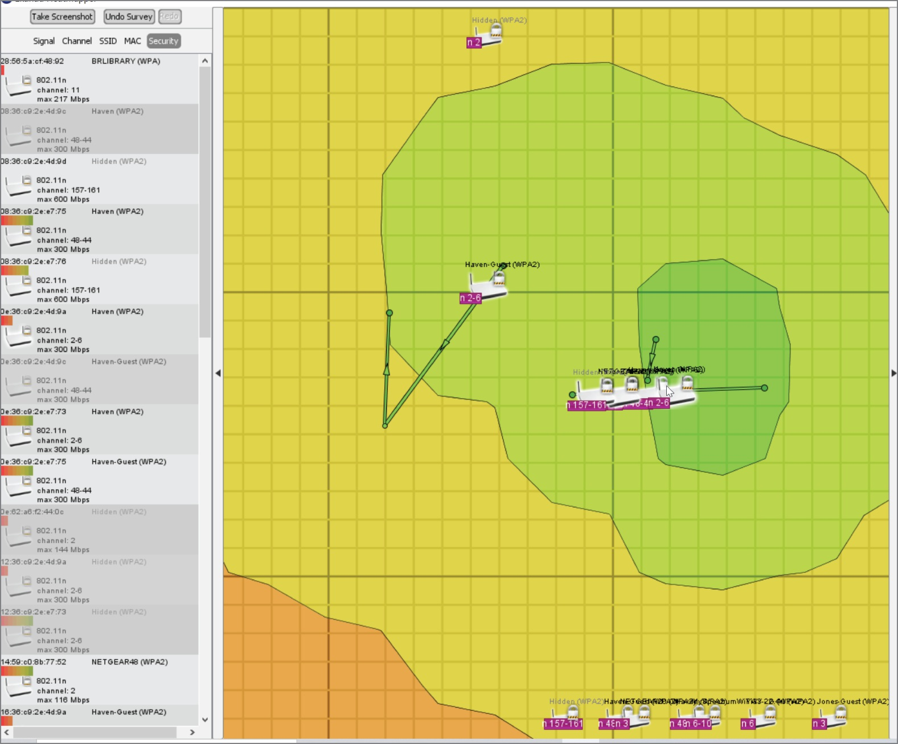
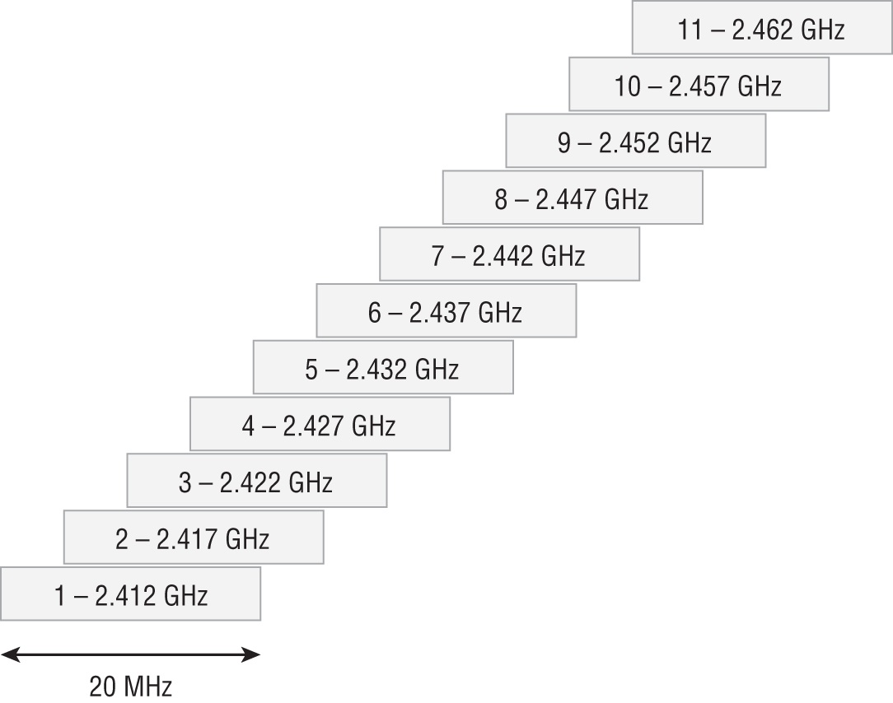

---

# THE COMPTIA SECURITY+ EXAM OBJECTIVES COVERED IN THIS CHAPTER INCLUDE: {#2c47b0eb61a48009b04bdf071749f485}

## Domain 2.0: Threats, Vulnerabilities, and Mitigations {#2c47b0eb61a4800f83c5d01f47aff9e9}

### 2.3. Explain various types of vulnerabilities. {#2c47b0eb61a48057af33dfc2354136b2}

- Mobile device (Side loading, Jailbreaking)

## Domain 3.0: Security Architecture {#2c47b0eb61a48058b42acd126b6bd9c6}

### 3.3. Compare and contrast concepts and strategies to protect data. {#2c47b0eb61a480f68818c0ce0d8b3998}

- General data considerations (Geolocation)

## Domain 4.0: Security Operations {#2c47b0eb61a4802fae4ff0c8e7123525}

### 4.1. Given a scenario, apply common security techniques to computing resources. {#2c47b0eb61a48078be5ec9fc6c2151b5}

- Hardening targets (Mobile devices, Workstations, Switches, Routers, Cloud infrastructure, Servers, ICS/SCADA, Embedded systems, RTOS, IoT devices).
- Wireless devices (Installation considerations (Site surveys, Heat maps))
- Mobile solutions (Mobile device management (MDM), Deployment models (Bring your own device (BYOD), Corporate-owned, personally enabled (COPE), Choose your own device (CYOD)), Connection methods (Cellular, Wi-Fi, Bluetooth))
- Wireless security settings (Wi-Fi Protected Access 3 (WPA3), AAA/Remote Authentication Dial-in User Service (RADIUS), Cryptographic protocols, Authentication protocols

---

## Building secure wireless network {#2c47b0eb61a480fa87bac9c3521c10e3}

## Connection methods {#2c47b0eb61a480e59c42cfc58973db99}

Thiết kế mạng an toàn bắt đầu bằng việc hiểu các loại kết nối

### Cellular {#2c47b0eb61a48033bad1c12bc499c472}

- Cấu trúc: mạng cellular chia các khu vực địa lý thành các cell với độ phủ sóng của tháp phát sóng
- Sử dụng các công nghệ như Long-term evolution và 5G
	- 5G yêu cầu mật độ ăng ten lớn hơn nhiều nhưng cung cấp băng thông và tốc độ cao hơn. Cần chú ý vị trí đặt ăng ten khi thiết kế tòa nhà
- Bảo mật, kết nối Cellular được cung cấp bởi carrier, không phải do tổ chức tự triển khai. Do đó dữ liệu cellular được đối xử như external network

### Wifi {#2c47b0eb61a480f495c9fba0d88bcd34}

- Thuật ngữ wifi bao gồm một loạt các giao thức mạng không dây 2,4Ghz và 5Ghz
- Rủi ro: một trong những mối lo ngại bảo mật quan trọng nhất là tín hiệu Wi-fi lan truyền ra ngoài không gian mà tổ chức sở hữu hoặc kiểm soát

**Bảng 13.1: Các chuẩn Wi-Fi (Wi-Fi Standards)**
Sách liệt kê các thế hệ Wi-Fi kèm theo tốc độ lý thuyết tối đa và tần số:

- **802.11b:** 11 Mbit/s (2.4 GHz).
- **802.11a:** 54 Mbit/s (5 GHz).
- **802.11g:** 54 Mbit/s (2.4 GHz).
- **802.11n (Wi-Fi 4):** 600 Mbit/s (2.4 GHz và 5 GHz).
- **802.11ac (Wi-Fi 5):** 6.9 Gbit/s (5 GHz).
- **802.11ax (Wi-Fi 6 và Wi-Fi 6E):** 9.6 Gbit/s (2.4 GHz, 5 GHz, 6 GHz).
- **802.11be (Wi-Fi 7):** 40+ Gbit/s (2.4 GHz, 5 GHz, 6 GHz).
- **Bảo mật Wi-Fi:** Sử dụng các giao thức như **WPA2** và **WPA3** để mã hóa và xác thực.

Chế độ triển khai:

- Ad hoc mode: các thiết bị nói chuyên trực tiếp với  nhau
- Infrastructure mode: lưu lượng gốc đi qua access point hoặc base station
- SSID (service set identifier): là tên mạng, có thể được broadcast công khai hoặc giữ bí mật

### Bluetooth {#2c47b0eb61a480b3a281fd96ecd7b034}

- Hoạt động ở dải 2.4Ghz, dùng cho kết nối tầm ngắn, 5-30m, công suất thấp
- Mô hình: point-to-point thay vì client-server
- Pairing: quá trình tìm kiếm để kết nối thường yêu cầu mã PIN
- 4 chế độ bảo mật:
	- Security mode 1: không bảo mật
	- Security mode 2: bảo mật cấp dịch vụ (service-level-enforced)
	- Security mode 3: bảo mật cấp liên kết (link-level enforced)
	- Security mode 4: ghép đôi an toàn (standard pairing with secure simple pairing- SSP)
- Rủi ro: bluetooth dễ bị tấn công vì được thiết kế dễ khám phá và sử dụng, mã hóa dựa trên PIN, nếu PIN cố định sẽ kém an toàn và bị nghe lén

### RFID (Radio frequency identification) {#2c47b0eb61a480f8addccf834d7efe87}

- Định nghĩa: công nghệ không dây tầm ngắn sử dụng tag và đầu đọc để trao đổi thông tin
- Các loại tag:
	- Active-tag: có nguồn điện riêng, luôn phát tín hiệu
	- Semi-active tag: có pin để nuôi mạch nhưng chỉ kích hoạt khi có đầu đọc
	- Passive tags: hoàn toàn hoạt động nhờ năng lượng từ sóng của đầu đọc
- Dải tần số:
	- Low-freq: tầm ngắn, dùng cho thẻ ra vào, định danh, không nhất quán trên toàn cầu
	- High-freq: tầm đọc lên tới 1m, dùng cho NFC và thẻ thông in, nhiều thẻ hỗ trợ đọc, ghi
	- Ultra-high-freq: Đọc nhanh nhất, xa nhất và dùng cho kiểm kê kho (inventory), chống trộm
- Rủi ro: RFID có thể bị phá hủy, gỡ bỏ, nhân bản (cloned), sửa đổi, hoặc spoofed. Đầu đọc cũng có thể bị giả mạo
- Ví dụ: _(Rewriting RFID Tags):_ Các nhà nghiên cứu từng phát hiện hệ thống thu phí cầu đường ở California dùng thẻ RFID không bị khóa sau khi ghi, cho phép kẻ tấn công viết lại ID của thiết bị để trốn phí hoặc gán phí cho xe khác.

### GPS (Global positioning system) {#2c47b0eb61a48075bf99dad913305310}

Sử dụng chùm vệ sinh (constellation of satellites) gửi tín hiệu xuống. Thiết bị GPS receiver chỉ nhận tín hiệu để tính toán vị trí, không truyền ngược lại. Ngoài GPS của Mỹ còn có GLONASS của Nga và một số hệ thống khác

- Độ chính xác: khoảng 30 cm
- Ứng dụng: Geofencing (hàng rào địa lý), đồng bộ thời gian mạng (GPS cung cấp tín hiệu thời gian nhất quán)
- Tấn công:
	- Jamming: gây nhiễu
	- Spoofing: giả mạo, từng được dùng để tấn công drone quân sự hoặc làm sai lệch vị trí
- Geolocation: là khả năng xác định vị trí thiết bị. Thường kết hợp với GPS với tên mạng Wi-fi, kết nối bluetooth và cellular để có dữ liệu phong phú hơn (Ví dụ: Apple's Find My dùng cả GPS, Wi-Fi, Bluetooth và Cellular).

### NFC {#2c47b0eb61a48016aa02f108ac1ad98e}

- Tầm ngắn: dưới 10 cm, dùng cho băng thông thấp, kết nối point-to-point
- Ứng dụng: thanh toán các ví
- Bảo mật: yêu cầu kẻ tấn công phải ở rất gần
- Rủi ro: intercepting, replay attacks, spoofing.

### Infrared {#2c47b0eb61a48032b06bd9e9a7cf99c2}

- Yêu cầu tầm nhìn thẳng (line of sight - LoS)
- Tốc độ: hỗ trợ từ rất thấp (SIR - 115kbit/s) đến rất cao (GigaIR - 1 Gbit/s)
- Bảo mật: vì cần tầm nhìn thẳng, IR khó bị bắt gói tin từ xa hoặc từ bên ngoài phòng kín (không xuyên tường như Wifi), tuy nhiên kẻ tấn công vẫn có thể bắt được sóng nếu ở cùng đường thẳng
- **Hiện trạng:** Ít phổ biến trong các hệ thống hiện đại, phần lớn đã bị thay thế bởi Bluetooth và Wi-Fi.
	- SIR, 115 Kbit/s
	- MIR, 1.15 Mbit/s
	- FIR, 4 Mbit/s
	- VFIR, 16 Mbit/s
	- UFIR, 96 Mbit/s
	- GigaIR, 512 Mbit/s-1 Gbit/s

## Wireless network models {#2c47b0eb61a4803baab9eb51101096ba}

4 mô hình kết nối chính mà công nghệ không dây sử dụng: 

- Point-to-point: kết nối 2 node
- Point-to-multipoint: một node trung tâm nối nhiều thiết bị khác
- Mesh: đan xen
- Broadcast: gửi thông tin đến nhiều node mà không quan tâm đến phản hồi (GPS, Radio)

## Attack against wireless networks and devices {#2c47b0eb61a480f48178e54dc3927e0b}

### Evil twins and rogue access points {#2c47b0eb61a4807fa04fd84e40edf968}

- Evil twins: là một AP bất hợp pháp được thiết lập để trông giống hệt một mạng tin cậy, hợp pháp cùng SSID
	- Khi người dùng kết nối nhầm vào evil twin, kẻ tấn công cung cấp kết nối internet để nạn nhân không nghi ngờ, sau đó chặn bắt lưu lượng mạng, đánh cắp mật khẩu hoặc thông tin nhạy cảm thông qua các trang đăng nhập giả mạo
- Rogue access points: là các AP được cắm vào mạng của bạn một cách cố ý hoặc vô ý (nhân viên tự cắm thêm router wifi)
	- Nguy cơ: tạo ra backdoor cho kẻ tấn công xâm nhập, bỏ qua lớp bảo mật của tổ chức
	- Phát hiện: các hệ thống enterprise wireless controller hiện đại và wireless intrusion detection system có thể quét liên tục và phát hiện AP lạ, so sánh với log mạng có dây để xác định xem thiết bị đó có đang cắm vào mạng nội bộ không

### Bluetooth attacks {#2c47b0eb61a480de9474f7d7ffc412f8}

- Bluejacking: gửi các unsolicited messages đến thiết bị có bật bluetooth
- Bluesnarfing: truy cập trái phép vào thiết bị bluetooth để đánh cắp thông tin như danh bạ, dữ liệu
	- Vấn đề bảo mật: Nhiều thiết bị dùng mã PIN dễ đoán, tạo ra một khóa dài hạn, dễ bị tấn công
- Bluetooth impersonation attack (BIAS): tận dụng điểm yếu trong quá trình xác thực của bluetooth - không có mutual authentication để giả mạo thiết bị. Hầu hết các thiết bị bluetooth đều có thể bị
	- Tắt bluetooth khi không sử dụng
- **Fingerprinting (Lấy dấu vân tay thiết bị):** Là kỹ thuật thu thập các thông tin đặc trưng của thiết bị Bluetooth (như địa chỉ MAC, tên thiết bị, phiên bản firmware...) để **định danh duy nhất** thiết bị đó → mất riêng tư

### RF and protocol attacks {#2c47b0eb61a480fe97b0c13aa1afa7ac}

Kẻ tấn công có thể ngắt kết nối của bạn bằng 2 cách:

- Disassociation: gửi các gói tin deauthentication frames giả mạo địa chỉ MAC của nạn nhân để AP, khi AP nhận được nó sẽ ngắt kết nối thiết bị đó
	- Mục đích: buộc người dùng kết nối lại, tạo cơ hội cho kẻ tấn công thu thập dữ liệu handshake để bẻ khóa hoặc lừa vào mạng evil twin
	- Phòng chống: WPA2 thường bị dễ tấn công do frames không mã hóa. WPA3 yêu cầu gói tin được bảo vệ, nên ngăn chặn được
- RF Jamming: chặn toàn bộ lưu lượng trong phạm vi tấn công hoặc tần số bằng cách phát tín hiệu gây nhiễu
	- Lưu ý: jamming là hành vi phát sóng vô tuyến công suất cao để dìm tín hiệu gốc, bị cấm bởi FCC Mỹ
- Deauthentication: giao thức 802.11 (wifi) có management frames dùng để điều khiển kết nối
	- Trước đây, chúng không được mã hóa. Hacker có thể giả mạo địa chỉ và gửi một lệnh deauthenticate đến máy tính - deauther khác với jammer
	- Máy tính tưởng router bảo ngắt nên thoát ra - là một dạng DoS
	- Chuẩn 802.11w (2014) đã yêu cầu mã hóa gói tin để chặn hacker

	| **Đặc điểm**                | **Deauthentication (Deauth)**                          | **Disassociation (Disassoc)**                                  |
	| --------------------------- | ------------------------------------------------------ | -------------------------------------------------------------- |
	| **Cấp độ**                  | Cắt đứt hoàn toàn (Reset toàn bộ).                     | Ngắt kết nối tạm thời (Reset phiên).                           |
	| **Trạng thái sau tấn công** | Phải làm lại từ đầu (Auth + Assoc).                    | Chỉ cần làm lại bước Assoc.                                    |
	| **Độ phổ biến**             | Rất cao (Dùng để hack pass).                           | Thấp hơn (Dùng để lừa đảo/roaming).                            |
	| **Ví dụ đời thực**          | Bảo vệ đuổi bạn ra khỏi tòa nhà và thu lại thẻ ra vào. | Bảo vệ rút dây mạng của bạn, nhưng bạn vẫn ngồi trong tòa nhà. |

	- Nếu đề bài nhắc đến việc ngắt kết nối để **bắt gói tin bắt tay (handshake capture)** nhằm crack password → Chọn **Deauthentication**.
	- Nếu đề bài nhắc đến việc ép người dùng chuyển sang một trạm phát sóng khác (**Evil Twin / Roaming**) $\rightarrow$ Thường là **Disassociation** (dù Deauth cũng làm được việc này).

### Sideloading and jailbreaks {#2c47b0eb61a480d986d8d2213307e9fc}

- Sideloading: quá trình chuyển tệp tin (thường qua USB, thẻ nhớ, bluetooth) để cài đặt ứng dụng từ bên ngoài kho ứng dụng chính thức, chủ yếu ở android trước kia
- Jailbreaking/Rooting: tận dụng lỗ hổng hệ điều hành để leo thang đặc quyền, giành quyền root
	- Cho phép cài ứng dụng lậu, thay đổi cài đặt hệ thống, nhưng đồng thời làm mất đi tính bảo mật

## Designing a network {#2c47b0eb61a480039a13f7ce99034fa2}

Thiết kế mạng wifi đảm bảo cân bằng giữa usability, performance và bảo mật

- Site survey: Đi thực tế xung quanh khu vực để xác định mạng hiện có, cấu trúc vật lý tòa nhà và chỗ đặt AP
- Heatmap: cộng cụ trực quan hiển thị cường độ tín hiệu không dây

### Channel overlap {#2c47b0eb61a48054857eda94d918c913}

- Vấn đề overlap giữa các tín hiệu rất quan trọng, đặc biệt ở băng tần 2.4Ghz
- Mỗi kênh rộng 20MHz, cách nhau 5Mhz, dẫn đến overlap
- Để tránh nhiễu, chỉ nên sử dụng các kênh 1, 6, 11 (Mỹ) vì chúng không chồng nhau
- Ở các quốc gia khác (như Nhật, Indonesia), có thể hỗ trợ thêm kênh 12, 13, 14.

Wifi analyzer software

- Là công cụ tạo heatmap
- Các bộ điều khiển wifi doanh nghiệp có thể tự động điều chỉnh công suất phát để tránh nhiễu hoặc thậm chí áp chế tín hiệu của thiết bị lạ

## Controller and AP security {#2c47b0eb61a4803285f8d3ef5feac341}

Mạng doanh nghiệp thường dựa vào các bộ điều khiển mạng LAN không dây để quản lý AP

- Chức năng: Bộ điều khiển cung cấp trí thông iminh, khả năng giám sát, hỗ trợ mạng không dây định nghĩa bằng phần mềm (SDWN) và các dịch vụ bổ sung như roaming (chuyển vùng) giữa wifi và 5g
- Triển khai: có thể thiết bị phần cứng, cloud hoặc VM/software
- Best practices:
	- Thay đổi cài đặt mặc định.
	- Đặt mật khẩu mạnh
	- Bảo vệ giao diện quản trị bằng cách đặt chúng trên các VLAN riêng biệt
	- Cập nhật patch
	- Các bộ điều khiển hiện đại có tích hợp Threat intelligence, Intrusion prevention

## Wi-fi security standard {#2c47b0eb61a480e49973eb3751829b91}

Tuân thủ chuẩn WPA2, 3

### Wifi protected area 2 {#2c47b0eb61a48072a761cbee9ad0ed61}

- Sử dụng CCMP (counter mode cipher block chaining message authentication code protocol)
- Sử dụng AES, mạnh hơn WEP cũ
- Cung cấp xác thực người dùng và kiểm soát truy cập
- WPA2-Personal, which uses a pre-shared key and is thus often called WPA2-PSK. This allows clients to authenticate without an authentication server infrastructure.
- WPA2-Enterprise relies on a RADIUS authentication server as part of an 802.1X implementation for authentication. Users can thus have unique credentials and be individually identified.
	- Dùng bảo mật 128 bit AES
- Điểm yếu: PSK bắt tay 4 bước có thể bị nghe lén gói tin bắt tay và máy tính mạnh để chạy dictionary attack dò ra mật khẩu offline

### Wifi protected area 3 {#2c47b0eb61a48047937bf752cf0b6414}

- Chuẩn bắt buộc cho wifi từ năm 2020, thay thế WPA2
- WPA3-personal:
	- Thay thế pre-shared key (PSK) bằng SAE (simultaneous authentication of equals)
	- Yêu cầu sự tương tác giữa client và mạng để xác thực, giúp ngăn chặn tấn công từ điển/brute-force ngoại tuyến
	- Hỗ trợ perfect forward secrecy, ngay cả khi mật khẩu bị lộ sau này thì phiên trước đó không bị giải mã vì khóa phiên thay đổi liên tục
- **WPA3-Enterprise:**
	- Cung cấp mã hóa mạnh hơn (tùy chọn chế độ bảo mật **192-bit**).
	- Thêm các kiểm soát xác thực khóa và mã hóa khung mạng (**network frames**) - chống lại disassociation
- OWE (oppotunistic wireless encryption):
	- Dành cho mạng mở (open networks) như wifi công cộng
	- Cung cấp mã hóa dữ liệu mà không cần mật khẩu, giải quyết rủi ro dữ liệu bị xem trộm trên các mạng không dây mở truyền thống
	- Không cung cấp authentication

## Wireless authentication {#2c47b0eb61a480b68a2dc2d6580a6ce5}

Có nhiều lựa chọn để kiểm soát quyền truy cập vào mạng

- Open networks: không cần. Thường dùng captive portal để thu thập thông tin hoặc yêu cầu đồng ý điều khoản trước khi cho truy cập. Dữ liệu trên mạng truyền thống không được mã hóa (trừ khi dùng OWE hoặc HTTPS)
- Pre-shared Keys: sử dụng một mật khẩu chung cho tất cả mọi người (WPA2-personal)
- Enterprise authentication: dựa vào RADIUS server và giao thức EAP để xác thực người dùng với thông tin riêng biệt

### Wireless authentication protocols {#2c47b0eb61a4802b9b5cc65f2fc629f1}

- Mạng doanh nghiệp sử dụng chuẩn IEEE 802.1X để kiểm soát truy cập mạng NAC
- 802.1X tích hợp với máy chủ RADIUS để xác thực. Sau đó, xếp người dùng vào nhóm, vùng mạng (network zones)
- EAP (extensible authentication protocol): là khung giao thức được 802.1X sử dụng (xương sống của wifi doanh nghiệp, có nhiều biến thể:
	- PEAP (protected EAP):
		- Xác thực server bằng cert
		- Tạo ra một TLS tunnel để bảo vệ quá trình xác thực
		- Thường dùng mật khẩu người dùng để xác thực trong đường hầm
	- EAP-FAST (flexible authentication via Secure tunneling):
		- Phát triển bởi Cisco để khắc phục LEAP (lightweight EAP)
		- Thay vì dùng cert như PEAP và EAP-TLS, nó dùng shared secret key nhanh hơn, hỗ trợ cho roaming
	- EAP-TLS:
		- Sử dụng cert trên cả client và server nên cung cấp mutual authentication - bảo mật cao nhất
		- Khó quản lý: do phải cấp cert cho cả người dùng
	- EAP-TTLS (Tunneled transport layer security):
		- Mở rộng từ EAP-TLS nhưng không yêu cầu chứng chỉ từ client
		- Giảm gánh nặng quản lý chứng chỉ nhưng lại yêu cầu cài thêm phần mềm

		| **Giao thức** | **Server Certificate** | **Client Certificate** | **Bảo mật**    | **Keyword quan trọng nhất**                  |
		| ------------- | ---------------------- | ---------------------- | -------------- | -------------------------------------------- |
		| **EAP-TLS**   | **Có**                 | **Có**                 | Cao nhất       | **Mutual Authentication**, Smart Card.       |
		| **PEAP**      | **Có**                 | Không                  | Cao            | **Microsoft**, MS-CHAPv2.                    |
		| **EAP-TTLS**  | **Có**                 | Không                  | Cao            | Cần phần mềm bên thứ 3, hỗ trợ giao thức cũ. |
		| **EAP-FAST**  | Tùy chọn               | Không                  | Trung bình/Cao | **Cisco**, **PAC**, thay thế LEAP.           |

### RADIUS federation {#2c47b0eb61a48099aed4f069f1a53ab7}

- Các máy chủ RADIUS có thể được liên kết cho phép người dùng tổ chức này xác thực vào mạng tổ chức khác
- Ví dụ điển hình: **eduroam** (dịch vụ trong giáo dục đại học), cho phép sinh viên/giảng viên dùng tài khoản trường mình để vào Wi-Fi của các trường khác trên thế giới.

> Exam Note: Bài thi Security+ tập trung vào WPA3, RADIUS, và các giao thức xác thực như PEAP, EAP. Bạn cần hiểu tính năng bảo mật mới của WPA3 so với WPA2 và nắm được khái niệm chung về các giao thức này mà không cần đi quá sâu vào chi tiết kỹ thuật mật mã.

## Managing secure mobile devices {#2c57b0eb61a480f1bb4dd28c38e30bff}

Các phương thức triển khai và quản lý mobile devices đảm bảo tính bảo mật

## Mobile device deployment methods {#2c57b0eb61a480eba853f9bffacec399}

Là quyết định thiết kế quan trọng về việc ai sở hữu và ai kiểm soát thiết bị

- BYOD (Bring Your Own Device):
	- Người dùng mang thiết bị cá nhân của họ đi làm
	- Ưu điểm: chi phí thấp, người dùng thoải mái
	- Nhược: rủi ro, không kiểm soát, không bảo mật, quản lý hạn chế
	- Công ty (MDM) sẽ cài một ứng dụng container trên đó: dữ liệu công ty được lưu ở đó
- CYOD (Choose Your Own Device):
	- Tổ chức sở hữu thiết bị nhưng cho phép người dùng chọn từ các danh sách
	- Ưu điểm: hỗ trợ kĩ thuật tốt hơn, số lượng thiết bị có hạn, mô hình bảo mật dễ hơn BYOD
- COPE (Corporate-Owned, Personally enabled):
	- Thiết bị do công ty sở hữu và quản lý, nhưng cho phép nhân viên sử dụng ở mức cá nhân ở mức hợp lý
	- Cân bằng giữa kiểm soát và linh hoạt
- Corporate-owned: Hoàn toàn sở hữu của công ty
	- Kiểm soát chặt chẽ nhất, như là máy tính ở công ty
	- Thiếu linh hoạt, ít thân thiện với người dùng nhất
- COBO (Company owned, business only:
	- Thiết bị chỉ dùng cho công việc, không có mục đích cá nhân (Ví dụ: máy quét mã vạch, máy tính bảng bảo trì). Không có vùng riêng tư cho người dùng.

	| **Mô hình** | **Kỹ thuật MDM chính**                                              | **Xử lý khi nhân viên nghỉ việc**            |
	| ----------- | ------------------------------------------------------------------- | -------------------------------------------- |
	| **BYOD**    | **Storage Segmentation / Containerization** (Tách biệt dữ liệu).    | **Selective Wipe** (Chỉ xóa dữ liệu cty).    |
	| **CYOD**    | Quản lý vòng đời thiết bị, hỗ trợ phần cứng chuẩn hóa.              | Thu hồi máy, Wipe lại để cấp cho người khác. |
	| **COPE**    | Cấu hình bảo mật nền tảng, cho phép cài App cá nhân (có kiểm soát). | **Full Wipe** (Xóa trắng máy), thu hồi máy.  |
	| **COBO**    | **Whitelisting** (Chỉ cho phép App chỉ định), **Kiosk Mode**.       | Thu hồi máy.                                 |

## Hardening mobile devices {#2c57b0eb61a48010b886e95dd7cc3e7d}

- VDI (virtual desktop infrastructure): thiết bị chỉ là màn hình kết nối vào môi trường máy tính ảo an toàn của công ty, dữ liệu không nằm trên thiết bị thật
- Benchmarks: sử dụng các tiêu chuẩn từ CIS cho iOS, và Android
- Techniques: Cập nhật OS thường xuyên, bật xóa từ xa, yêu cầu mật khẩu mạnh, thiết lập tự động khóa màn hình, tắt kế nối bluetooth khi không dùng

## Mobile device management {#2c57b0eb61a480d18ab0e1adaccce172}

- MDM (Mobile device management): công cụ nhắm mục tiêu cụ thể vào thiết bị như android/iOS
- UEM (Unified endpoint management): quản lý hợp nhất cả thiết bị di động, máy tính để bàn, Laptop,..

Các tính năng bảo mật chính của MDM/UEM: 

- Application management:
	- Kiểm soát việc triển khai ứng dụng tới từng thiết bị (allow or block)
	- Giám sát việc sử dụng ứng dụng
- Content management (MCM):
	- Đảm bảo truy cập an toàn vào tài liệu và phương tiện của tổ chức
	- Khóa dữ liệu kinh doanh trong một không gian được kiểm soát, đặc biệt quan trọng trên BYOD để tách biệt dữ liệu công ty và dữ liệu cá nhân
- Remote-wipe: xóa từ xa
	- Dùng khi thiết bị bị mất, đánh cắp, nhân viên nghỉ việc
	- Phân biệt full device wipe và enterprise wipe
	- Cảnh báo: kẻ tấn công có thể ngắt kết nối mạng hoặc bỏ vào túi chắn sóng (RF-blocking bag), do đó mã hóa thiết bị là quan trọng
- Firmware & Software control:
	- Giám sát các bản cập nhật OTA updates
	- Phát hiện thiết bị rooting và jailbreaking
- Device capabilities control
	- Hạn chế hoặc cấm sử dụng Camera, Microphone, tin nhắn SMS/MMS/RCS  (rich communication services) để chống rò rỉ dữ liệu
	- Chặn tính năng USB OTG (on the go) để ngăn kết nối với thiết bị lưu trữ ngoài
	- Kiểm soát GPS tagging trên ảnh để bảo vệ quyền riêng tư vị trí
- Connectivity contron
	- Giới hạn mạng wifi có thể kết nối
	- Ngăn chặn tham gia mạng ad hoc( mạng tùy biến không dây) là mạng kết nối trực tiếp các thiết bị (laptop, điện thoại, máy tính bảng) với nhau để chia sẻ dữ liệu hoặc Internet **mà không cần router** hay điểm truy cập trung tâm (Access Point)
	- Vô hiệu hóa tethering (chia sẻ mạng), hotspot
	- Kiểm soát bluetooth và NFC

Advanced security implementation

- Geolocation & geofencing: cho phép sử dụng máy tính chỉ khi ở trong tòa nhà,… Xóa thiét bị nếu nó rời khỏi khu vực
	- Thường sử dụng GPS và wifi
	- Cellular: thì phạm vi sai số quá lớn (vài km)
	- **Bluetooth:** Thường dùng cho "iBeacon" hoặc định vị phạm vi cực gần (proximity) trong một căn phòng, chứ không dùng cho geofencing diện rộng (như một quận hay thành phố).
- Authentication:
	- Khóa màn hình, mật khẩu, PIN
	- Biometrics: vân tay, khuôn mặt
	- Context-aware authentication: xác thực dựa trên ngữ cảnh (vị trí, thời gian, hành vi) để quyết định có cho phép đăng nhập hay không
- Containerization: tách biệt không gian làm việc và không gian cá nhân, ứng dụng chạy trong container hoặc wrappeers để ngăn lây nhiễm
- Storage segmentation: Tách biệt vùng lưu trữ dữ liệu cá nhân và doanh nghiệp
- Full-device encryption (FDE):
- Push notification: gửi tin nhắn từ hệ thống quản lý trung tâm đến người dùng để cảnh báo hoặc yêu cầu thực hiện hành động
- Per-application VPN: giữ dữ liệu của ứng dụng an toàn khi sử dụng, tự động kết nối VPN khi ứng dụng cụ thể được mở

## **Summary & Exam Essentials** {#2c57b0eb61a48078bc86d8ce3ad85e23}

- **Thiết kế:** Cần hiểu về **Site surveys** và **Heatmaps**. Biết cách bố trí kênh 2.4 GHz (1, 6, 11).
- **Công nghệ:** Phân biệt rõ **Cellular, Wi-Fi, Bluetooth**. Hiểu ưu nhược điểm từng loại.
- **Bảo mật:** Tập trung vào các tính năng mới của **WPA3** (so với WPA2), hiểu về **RADIUS** và các giao thức **EAP** (PEAP, EAP-TLS...).
- **Quản lý thiết bị:** Phân biệt **BYOD, COPE, CYOD**. Hiểu các rủi ro như **Sideloading, Jailbreaking** và cách dùng **MDM** để giảm thiểu chúng.
