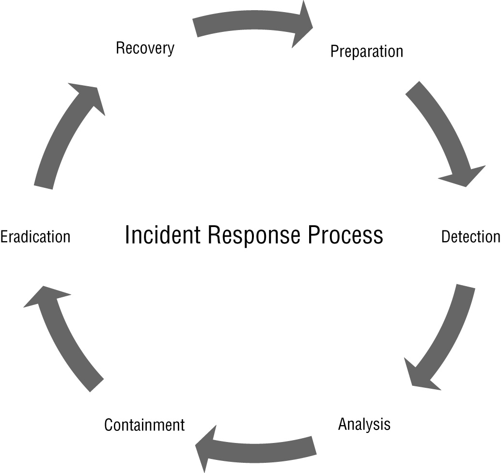
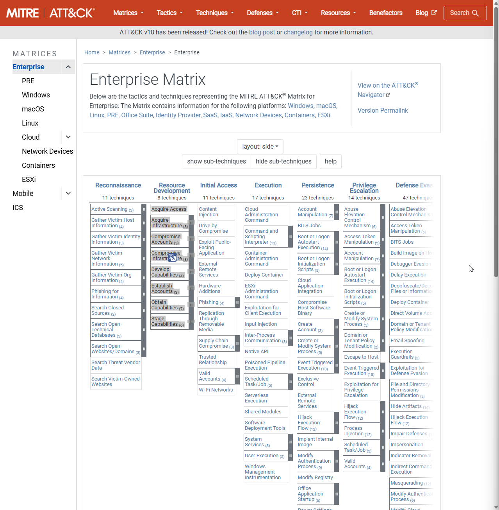
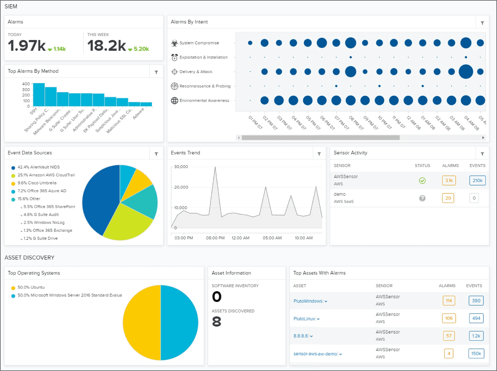
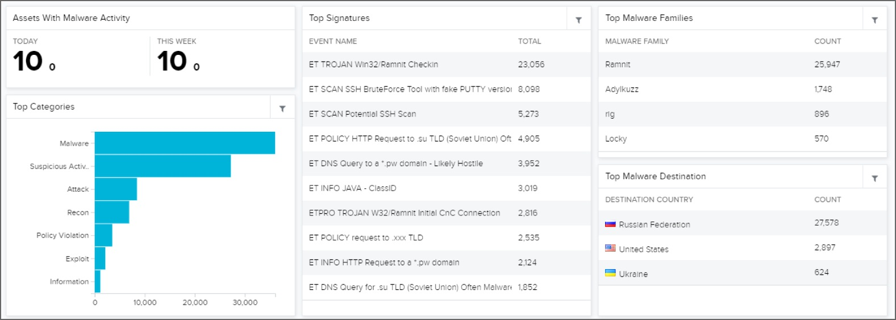
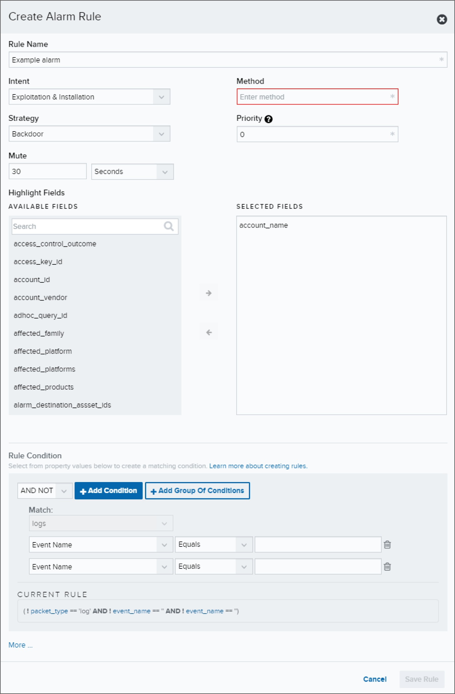
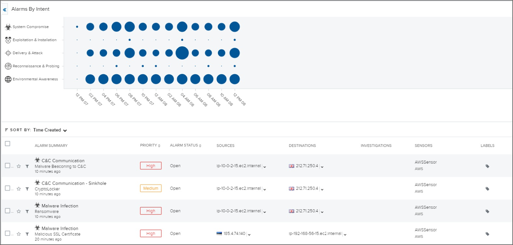
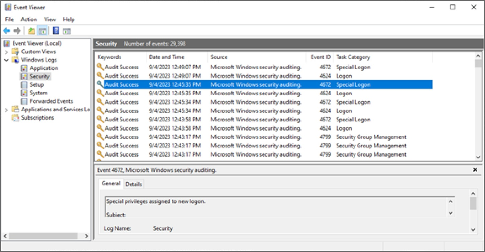
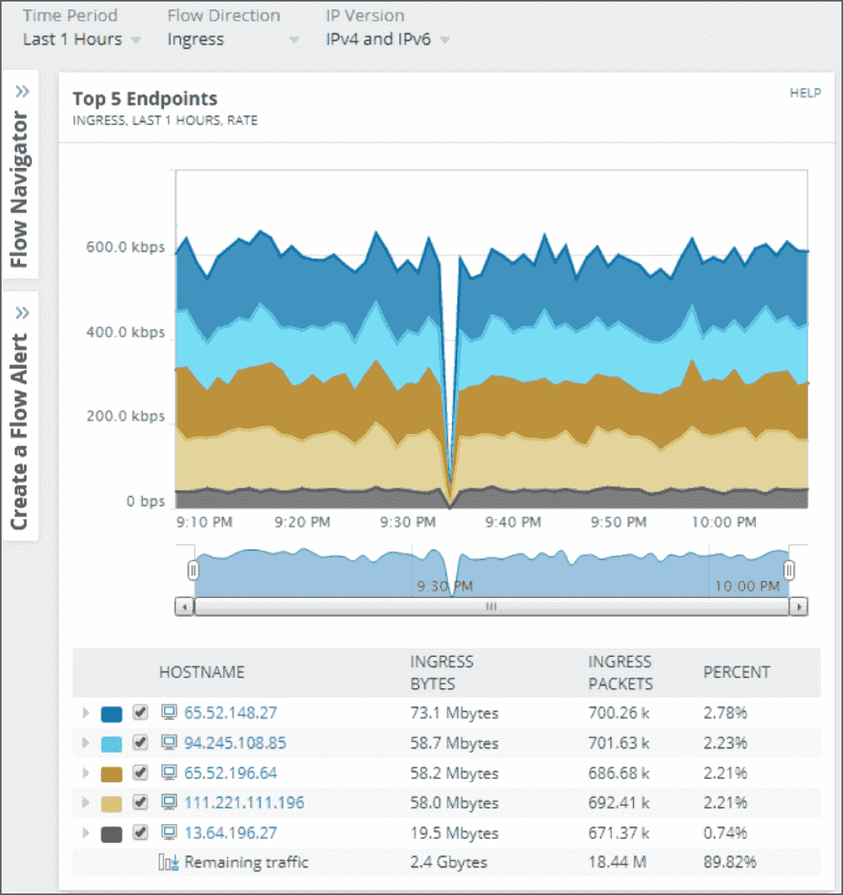
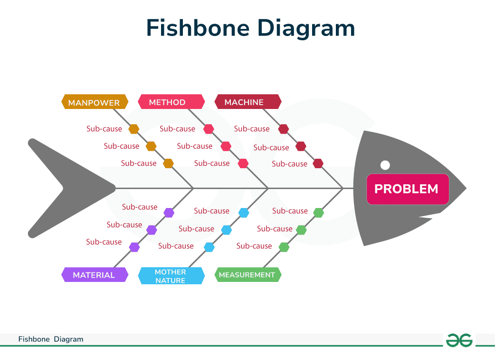

---


# THE COMPTIA SECURITY+ EXAM OBJECTIVES COVERED IN THIS CHAPTER INCLUDE: {#2c57b0eb61a48058869cd1e9bc347f12}


## Domain 2.0: Threats, Vulnerabilities, and Mitigations {#2c57b0eb61a480478fffdb88f7a1c1eb}


### 2.4. Given a scenario, analyze indicators of malicious activity. {#2c57b0eb61a48065a77cdd7b03f5057f}

- Indicators (Account lockout, Concurrent session usage, Blocked content, Impossible travel, Resource consumption, Resource inaccessibility, Out-of-cycle logging, Published/documented, Missing logs)

### 2.5. Explain the purpose of mitigation techniques used to secure the enterprise. {#2c57b0eb61a4807d8d97d125111d79ef}

- Application allow list
- Isolation
- Monitoring

## Domain 4.0: Security Operations {#2c57b0eb61a480488f92fffe015467cf}


### 4.4. Explain security alerting and monitoring concepts and tools. {#2c57b0eb61a480c28579d72a7e91b4df}

- Monitoring computing resources (Systems, Applications, Infrastructure)
- Activities (Log aggregation, Alerting, Scanning, Reporting, Archiving, Alert response and remediation/validation (Quarantine, Alert tuning))
- Tools (Benchmarks, Agents/agentless, Security information and event management (SIEM), NetFlow)

### 4.8. Explain appropriate incident response activities. {#2c57b0eb61a480e19644e61bee83e993}

- Process (Preparation, Detection, Analysis, Containment, Eradication, Recovery, Lessons learned)
- Training
- Testing (Tabletop exercise, Simulation)
- Root cause analysis
- Threat hunting

### 4.9. Given a scenario, use data sources to support an investigation. {#2c57b0eb61a480d898ddc6d70970e592}

- Log data (Firewall logs, Application logs, Endpoint logs, OS-specific security logs, IPS/IDS logs, Network logs, Metadata)
- Data sources (Vulnerability scans, Automated reports, Dashboards, Packet captures)

## Incident response {#2c57b0eb61a48002b641dab31abb5909}

- Incident response (IR) không phải là hành động một lần mà là quá trình liên tục giúp cải thiện an ninh tổ chức thông qua các bài học từ mỗi sự cố
- Phân biệt:
	- Event: là bất cứ observable occurrence, không phải event nào cũng là incident
	- Incident: là hành vi vi phạm chính sách, quy trình hoặc thực tiễn bảo mật

## Incident response process {#2c57b0eb61a480dcb0dacb10976d0e78}





Quy trình incident response có 6 bước:

- Bước 1: Preparation:
	- Giai đoạn nền tảng,
	- xây dựng công cụ, quy trình, thủ thục
	- Thành lập đội ngũ IR
	- Exercises
	- Mua sắm, cấu hình và vận hành công cụ bảo mật
- Bước 2: Detection:
	- Chú ý tới IoCs
	- Sử dụng log analysis và giám sát bảo mật
	- Cần có chương trình báo cáo và nhận thức cho nhân viên
- Bước 3: Analysis: khi một sự kiện được xác định là sự cố
	- Xác định sự kiện liên quan
	- Xác định target và impact
- Bước 4: Containment: ngăn chặn, khoanh vùng sự cố
	- Có thể bao gồm quarantine: đưa hệ thống mạng vào vùng cô lập, ngắt khỏi mạng để không ảnh hưởng tới thiết bị khác
	- Đội ngũ bảo mật thường dùng firewalls, IPS,… để thực hiện bước này nhanh chóng
- Bước 5: Eradication:
	- Thường bao gồm việc wipe hết ổ cứng và rebuild, restore hệ thống từ backups
	- Thường ưu tiên rebuild hơn chỉ là uninstall công cụ tấn công vì rất khó chứng minh hệ thống đã sạch
	- VD: xóa phần mềm độc hại, vô hiệu hóa, xóa tài khoản bị lộ
		- Patch
		- Cập nhật firewall rules
		- Clean-up
- Bước 6: Recovery:
	- Đưa các dịch vụ online trở lại để phục vụ kinh doanh
		- Restore from backups
		- Cài đặt lại hệ điều hành
		- Khởi động lại dịch vụ
		- Nâng cao giám sát
	- Bước này yêu cầu eradication trước đó phải thành công
- Ngoài ra còn có lesson learned:
	- Để đảm bảo không mắc lại lỗi cũ
	- Kết quả có thể là vá lỗi hệ thống hoặc thiết kế lại permissions
	- Thông tin từ đây có thể bổ trợ ngược lại cho preparation
- Lưu ý: sự cố thực tế thường không tuyến tính nên có thể đang quy trình này lại quay lại quy trình trước đó vì phát hiện vấn đề mới

:::tip

- Preparation:

- Detection:

- Analysis:

- Containment:

- Eradication:

- Recovery:

- Lessons learned:

:::


### IR team {#2c57b0eb61a480bc8d44ead257d8be77}


Thành phần:

- Management: chịu trách nhiệm ra quyết định, là cầu nối với lãnh đạo cấp cao.
- Information security staff: lực lượng nòng cốt, có kỹ năng chuyên môn
- Technical experts: sysadmins, dev - là những người hiểu rõ hệ thống
- Communication & PR: quản lý thông tin nội bộ và bên ngoài - truyền thông
- Legal and HR:
	- Tư vấn hợp đồng, vấn đề pháp lý
	- HR: cần thiết nếu sự cố liên quan đến nhân viên nội bộ hoặc điều tra nhân sự
- Law enforment: Chỉ tham gia khi có các cuộc tấn công hoặc yêu cầu cụ thể

### Training & exercises {#2c57b0eb61a48032ac0bfb2d522a97fc}


Có 5 loại hình diễn tập chính:

- Checklist: đọc tài liệu
- Walk-through: nhóm họp lại và đi qua từng bước của kế hoạch
- Tabletop:
	- Dựa trên thảo luận
	- Đội ngũ được đưa ra kịch bản và câu hỏi về các họ phản ứng
	- Giống như một buổi brainstorming
- Simulations:
	- Thực hành thực tế, có thể mô phỏng một chức năng cụ thể hoặc toàn bộ tổ chức
	- Quan trọng: tất cả người tham gia phải biết đây là diễn tập để tránh các hành động ngoài ý muốn
- Parallel/full interruption: hiếm dùng cho IR

### Building incident response plans {#2c57b0eb61a48037ac0cc0173f2d6199}

- Communication plan: kế hoạch truyền thông rất quan trọng. Cần quy định vai trò: ai trả lời báo chí, trả lời với stakeholders, ai quyết định nội dung thông điệp
- Stakeholder management plans: tập trung và cá nhân/tổ chức bị ảnh hưởng, xác định ai cần nhận thông tin gì, họ cần hỗ trợ gì, họ tương tác với quy trình IR như thế nào
- Business continuity (BC) plans:
	- Đảm bảo việc kinh doanh vẫn hoạt động được
	- Vd: chuyển sang hệ thống dự phòng, offload dịch vụ để đảm bảo chức năng kinh doanh không bị dừng lại bởi quy trình IR
	- BC đóng vai trò quan trọng trong các incident lớn
- Disaster recovery plans:
	- Khác với BC, DR plan tập trung vào các thảm họa tự nhiên hoặc do con người gây ra (phá hủy vật chất, cơ sở hạ tầng)
	- Mục tiêu: restoration lại dịch vụ sau khi thảm họa tàn phá

## Policies {#2c57b0eb61a480c8bbead0d607ea79cd}

- Là tuyên bố chính thức của tổ chức, tại sao tổ chức lại vận hành theo cách đó
- Cấu trúc phân cấp tài liệu:
	- Policy: tuyên bố cao cấp, thường ít thay đổi
	- Standards: dựa trên policy để hướng dẫn cụ thể về những gì bắt buộc phải làm
	- Procedures & guidlines: được dùng để thực thi standards, cách làm như thế nào, thường thay đổi cho phù hợp xu thế

## Threat hunting {#2c57b0eb61a4808c90e6f0283d61b174}


Để phát hiện sự cố, ta dùng IoCs, một số IoCs thường gặp:

- Account lockout (khóa tài khoản): do brute-force nên bị khóa
- Concurrent session usage: một tài khoản sử dụng trên nhiều thiết bị hoặc hệ thống
	- Đặc biệt đáng ngờ nếu ở vị trí lạ
- Blocked content: dữ liệu từ DNS filter hoặc các công cụ chặn web cho thấy người dùng cố truy cập domain, IP, content bị cấm. Dù bị chặn lại nhưng đây cũng là dấu hiệu
	- Máy tính không thể vào trang web của phần mềm diệt virus
	- Không thể update windows → hacker muốn ở lại lâu nhất có thể và block bạn không cập nhật được bản patch
- Impossible travel:
	- Xảy ra khi một người dùng kết nối từ 2 địa điểm khác nhau mà khoảng cách địa lý quá xa
	- Vd: login tại Hà Nội lúc 9h sáng và login tại New York lúc 9h15
- Resource consumption:
	- Bao gồm việc đầy ổ cứng, sử dụng băng thông cao bất thường
	- Khác với IoCs khác, chỉ số này đôi khi cần kết hợp với các hành động khác để khẳng định chắc là sự cố
- Out-of-cycle logging
	- Sự kiện xảy ra vào thời điểm bất thường
	- Vd: nhân viên làm việc hành chính lại đăng nhập vào 2h sáng, quy trình cleanup chạy giờ lạ
- Missing logs:
	- Dấu hiệu kẻ tấn công đã xóa log
	- **Giải pháp:** Các tổ chức thường tập trung hóa việc thu thập log (_centralize log collection_) để dù server bị xóa log cục bộ, dữ liệu vẫn còn trên hệ thống giám sát trung tâm.
- Published/documented indicators:
	- Đây là các IoCs được cộng đồng bảo mật phát hiện và chia sẻ
	- Thông qua các threat feeds, hoặc các tổ chức chia sẻ thông tin

## Understanding attacks and incidents {#2c57b0eb61a4801297a5d8016d15d0c1}


Cần hiểu các cuộc tấn công thì cần AF. Các attack frameworks gồm các nội dung:

- Adversaries
- Techniques
- Categorize tactics

### MITRE ATT&CK framework {#2c57b0eb61a480edad46e5b8696e0a44}


MITRE là là một tổ chức phi lợi nhuận vận hành các trung tâm nghiên cứu được chính phủ Mỹ tài trợ

- Họ thu thập, nghiên cứu và chuẩn hóa các kiến thức bảo mật để thế giới dùng chung
- MITRE cũng là tổ chức quản lý danh sách CVE

MITRE ATT&CK: 

- Viết tắt của Adversarial tactics, techniques and common knowledge. Là cơ sở kiến thức về các chiến thuật và kỹ thuật của kẻ tấn công. Bao gồm:
	- Tactics: trả lời câu hỏi tại sao hacker muốn xâm nhập:
		- VD: hacker muốn xâm nhập máy hoặc ăn trộm mật khẩu
		- Có 14 tactics (reconnaissance, execution, persistence, impact,…)
	- Techniques: how - để đạt được mục tiêu thì hacker cần làm như thế nào?
		- Để đạt initial access, hacker dùng phishing chẳng hạn
		- Mỗi kỹ thuật số mã số riêng (T1566 là phishing)
	- Procedures: exactly how - cụ thể của cái how ở trên
		- VD: dùng cobalt strike để gửi email chứa file excel độc hại tới nhân viên A lúc 9 h sáng
- Cấu trúc matrix:
	- Bao gồm mô tả chi tiết cho toàn bộ vòng đời mối đe dọa (threat life cycle): từ trinh sát (reconnaissance), execution, persistence, privilege escalation, impact (14 tactics)
	- Cột dọc: dưới mỗi tactics là techniques dùng để đạt được mục tiêu
	- Cung cấp các matrices cho: enterprise (windows, macOS, Linux, Cloud), Mobile (android, iOS), và pre-attack
		- Matrix là bảng tính sắp xếp các kĩ thuật tấn công vào một trật tự logic để dễ tra cứu

**Ví dụ trong sách (Figure 14.2):**
Mô tả kỹ thuật tấn công vào **Cloud Instance Metadata API** (ID: T1522).

- **Tactic:** Credential Access (Truy cập thông tin xác thực).
- **Mô tả:** Kẻ tấn công truy vấn API metadata của cloud instance để lấy credentials.
- **Detection:** Giám sát các truy vấn bất thường tới API.
- **Mitigation:** Lọc traffic mạng (Filter Network Traffic).

VD: giả sử EDR phát hiện một tiến trình lạ. Thay vì chỉ báo có virus thì nó báo theo chuẩn MITRE

- Phát hiện powershell chạy một lệnh mã hóa base64.
- Mapping vào MITRE:
	- Tactic: execution (thực thi)
	- Technique: T1059.0001 (command and scripting interpreter: powershell)
- Hành động tiếp theo: hacker sửa registry để máy tính khởi động lại thì virus vẫn chạy
	- Tactic: persistence
	- Technique: T1547

**Lợi ích cho đội bảo mật:**

- **Blue Team (Phòng thủ):** Nhìn vào bản đồ Matrix, họ sẽ tô màu đỏ vào các ô mà hệ thống phòng thủ của công ty **CHƯA** chặn được. Từ đó biết lỗ hổng nằm ở đâu. (Ví dụ: "Công ty mình chặn tốt Phishing, nhưng chưa có cơ chế chặn Keylogger").
- **Threat Hunting:** Thay vì đi tìm IP của hacker (dễ thay đổi), họ đi tìm hành vi "T1059.001" (PowerShell chạy lệnh lạ) trên toàn hệ thống.
- **Red Team (Tấn công giả lập):** Dùng Matrix này để lên kịch bản tấn công thử nghiệm xem đội thủ có phát hiện ra không.

Pyramid of pain: chặn được TTP (tactics, techniques, procedures) - khiến hacker đau đớn

	- thay vì chặn ip/domain: hacker có thể dễ dàng thay đổi
	- chặn hash file: hacker sửa một byte code là xong
	- Chặn TTPs: là hành vi cốt lõi, hacker rất khó thay đổi kĩ thuật




### Các framework khác {#2c57b0eb61a4809cb7fdd4f6765de135}


Ngoài MITRE ATT&CK, sách còn đề cập đến 2 mô hình khác thường được dùng (bạn cần nhớ tên để phân biệt):

1. **The Diamond Model:** Mô hình hình thoi dùng để phân tích sự kiện xâm nhập.
2. **Lockheed Martin's Cyber Kill Chain:** Mô hình chuỗi tiêu diệt, mô tả các giai đoạn tấn công tuyến tính.

## Incident response data and tools {#2c57b0eb61a4809bb276d8ff2de238f5}


## Monitoring computing resources {#2c57b0eb61a48016bcd9e144776e7eef}


Monitoring để có data. Có 3 loại monitoring:

- System monitoring:
	- Thực hiện qua system logs hoặc công cụ central management tools, bao gồm những công cụ liên quan đến cloud
	- Thu thập thông tin về tình trạng (health) và performance của hệ thống
- Application monitoring:
	- Sử dụng app logs và giao diện quản lý của ứng dụng
	- Nội dung giám sát phụ thuộc vào những gì ứng dụng đó cung cấp
- Infrastructure monitoring:
	- Các thiết bị hạ tầng như router, switch,… tạo ra logs thông qua giao thức SNMP và syslog

## SIEM - Security information and Event management systems {#2c57b0eb61a4807cb094f7b23dbea1a4}

- Là công cụ giám sát trung tâm quan trọng nhất trong nhiều tổ chức
- Chức năng cốt lõi:
	- Collect& aggregate: thu thập và tổng hợp log từ nhiều nguồn (hệ thống, mạng, hạ tầng)
	- Ingest & compare: nạp dữ liệu và so sánh với dữ liệu khác
	- Correlation & analysis: phân tích tương quan, áp dụng các rules, kỹ thuật phân tích và học máy
	- Packet capture: Ngoài log, SIEM còn có thể capture và phân tích data raw từ network traffic

**Lưu ý (Exam Note):** Bạn có thể gặp các thuật ngữ cũ như **SIM** hoặc **SEM**. Tuy nhiên, **SIEM** là thuật ngữ phổ biến nhất hiện nay bao trùm cả hai khái niệm trên.


:::tip

SIEM - Gom log, chuẩn hóa, tương quan (so sánh với dữ liệu khác nhau - quan trọng nhất), cảnh báo
- Ngoài ra còn capture packet

SOAR: robot phản ứng nhanh

- Orchestration (hợp xướng): kết nối các công cụ bảo mật lại với nhau (firewall nói chuyện với hệ thống email)

- Automation: chạy các playbooks có sẵn để xử lý việc lặp đi lặp lại

- Response: thực thi hành động

SIEM - phát hiện; SOAR - xử lý

:::


| **Đặc điểm**        | **SIEM (Quan sát)**                      | **SOAR (Hành động)**                                          |
| ------------------- | ---------------------------------------- | ------------------------------------------------------------- |
| **Chức năng chính** | Log Collection, Analysis, Alerting.      | Workflow, Automation, Response.                               |
| **Đầu vào**         | Logs, Events, Flows.                     | Alerts (thường từ SIEM gửi sang).                             |
| **Đầu ra**          | Cảnh báo (Alerts), Báo cáo (Reports).    | Hành động (Actions), Vé hỗ trợ (Tickets).                     |
| **Mục tiêu**        | **Nhìn thấy** sự cố (Visibility).        | **Xử lý** sự cố nhanh và giảm tải cho con người (Efficiency). |
| **Từ khóa đi thi**  | Aggregation, Correlation, Log retention. | **Playbook**, Runbook, Orchestration, Automation.             |


## SIEM components {#2c57b0eb61a480a99c2bdd86cfff8155}


### SIEM Dashboards {#2c57b0eb61a4809cae52d5dad45bbde8}




- Là giao diện đầu tiên các nhà phân tích nhìn thấy
- Mục đích: cung cấp cái nhìn trực quan cấp cao (high-level visual representation)
- Giúp nhận diện nhanh vấn đề, abnormal pattern hoặc trend

### Sensors {#2c57b0eb61a4809c9ca0ea312f52955d}

- Để thu thập dữ liệu bổ sung, SIEM dùng các sensors
- Chúng có thể là agents, VMs hoặc thiết bị chuyên dụng
- Vị trí triển khai: đặt tại cloud infrastructure, remote datacenter, hoặc nơi có dữ liệu đặc thù
- Bảo mật: sensors cũng là mục tiêu tấn công, cần được bảo vệ

Lưu ý về sensor của SIEM và sensor trong IoT (cloud)


| **Đặc điểm**       | **SIEM Sensor (Cloud)**                                                    | **Edge Computing Sensor**                                                   |
| ------------------ | -------------------------------------------------------------------------- | --------------------------------------------------------------------------- |
| **Mục tiêu**       | **Visibility** (Khả năng nhìn thấy toàn cục). Thu thập dữ liệu để xem sau. | **Efficiency & Latency** (Hiệu quả & Độ trễ). Xử lý ngay để phản ứng nhanh. |
| **Dữ liệu gửi đi** | Gửi **Dữ liệu thô (Raw Logs)** về trung tâm.                               | Gửi **Kết quả đã xử lý (Insights)** về trung tâm.                           |
| **Băng thông**     | Tốn nhiều băng thông (vì gửi tất cả log).                                  | Tiết kiệm băng thông (chỉ gửi cái cần thiết).                               |
| **Nơi não bộ nằm** | Não nằm ở **Server trung tâm**.                                            | Não nằm ngay tại **Sensor (Edge)**.                                         |


### Log aggregation, correlation, and analysis {#2c57b0eb61a480f5bf56d12e799a1169}

- Correlation: là kỹ thuật khớp nối các điểm dữ liệu khác nhau để tìm ra mối tương quan
	- Ví dụ: Khớp thời gian sự kiện xảy ra + hệ thống nào bị ảnh hưởng + tài khoản người dùng nào liên quan.
- Automated correlation: tự động khớp sự kiện với IoCs để tạo ra bộ dữ liệu hoàn chỉnh phục vụ điều tra
- Log aggregation không chi gồm các dịch vụ hay công cụ SIEM, các công cụ centralized logging tool như syslog-ng, rsyslog,… cung cấp phương thức để centralized log và tiến hành analysis
- Nhiều công cụ security như vậy, ranh giới giữa SIEM và SOAR (securiy orchestration, automation and response) đang mờ dần

## Managing SIEM {#2c57b0eb61a480f6b665d511e2e9fb15}


Để SIEM hoạt động hiệu quả không phải cứ thu thập tất cả thông tin là tốt. Cần có sự tinh chỉnh sao cho phù hợp


### Sensitivity and threhsolds {#2c57b0eb61a48095bc83c5891b9d9384}

- Tổ chức tạo ra lượng dữ liệu khổng lồ. SIEM quá nhạy, nó sẽ báo liên tục
- Thresholds: ví dụ, chỉ báo động khi một sự kiện xảy ra quá X lần, hoặc chỉ khi nó ảnh hưởng đến hệ thống quan trọng
- Quản lý tốt độ nhạy giúp tránh được Alert fatigue

### Trends {#2c57b0eb61a480f4bbafc1d641afd371}




- Trends giúp phát hiện:
	- vấn đề mới đang nhen nhóm,
	- Loại mã độc nào đang phổ biến trong tổ chức

### Rules {#2c57b0eb61a480a0ba41d7c0da087b17}




- Quy tắc là trái tim của các engine cảnh báo, xác định if.. then
- Hành động: có thể đơn giản như gửi alert hoặc programmatic action để thay đổi hạ tầng (ví dụ: chặn IP trên firewall)
- Rủi ro: quy tắc xây dựng kém có thể gây ra false positives hoặc false positives. Nguyên hiểm hơn nếu quy tắc có acitve response bị kích hoạt sai, có thể xảy ra outage

### Alert tuning and alarm {#2c57b0eb61a480fe8af6e38dea7707b6}

- Là quá trình sửa đổi các cảnh báo để chỉ báo đọng các sự kiện thật sự quan trọng
- Bao gồm: setting thresholds, removing noises, xác định hành vi bình thường

**Khái niệm cực kỳ quan trọng (Exam Note): Alert Fatigue (Mệt mỏi vì cảnh báo)**

- Xảy ra khi cảnh báo được gửi quá thường xuyên, quá nhiều.
- **Hậu quả:** Các nhà phân tích sẽ ngừng phản hồi, coi đó là "nhiễu" (_noise_), hoặc dành hàng giờ để đuổi theo các bóng ma (_chasing ghosts_ - dương tính giả).
- Điều này dẫn đến việc **bỏ lỡ sự cố thực sự** khi nó xảy ra. Đây là lý do tại sao _Alert Tuning_ là bắt buộc.




## Log files {#2c57b0eb61a480768581e1ac5df99799}


Log files cung cấp những thông tin đã xảy ra

- Bảo vệ log: những kẻ tấn công cũng nhắm và log để xóa bằng chứng
- Chiến lược: không thể xem hết mọi log thủ công, nên thường gửi log về hệ thống centralized để đảm bảo an toàn và dễ phân tích

### Các loại log quan trọng {#2c57b0eb61a480579f44f1ded1b83f6c}

- Firewall logs:
	- Ghi lại lưu lượng bị chặn
	- Các tường lửa thế hệ mới như NGFW hoặc UTM  có thể cung cấp thông tin chi tiết ở tầng ứng dụng
- IDS/IPS log: cung cấp lưu lượng đã tấn công bị phát hiện hoặc đã bị chặn
- Network logs: Log từ router và switch, ghi lại thay đổi cấu hình, thông tin lưu lượng và network flows
- Application logs: chứa thông tin cài đặt, errors, kiểm tra bản quyền
	- Web server logs (apache, IIS): rất quan trọng để theo dõi ai đã truy cập vào đâu, địa chỉ IP nào yêu cầu. Giúp phát hiện các cuộc tấn công như SQLi
- Endpoint logs: các app đã installed, log của system và các dịch vụ và các log khác
- OS logs:

	

	- Windows: sử dụng event viewer:
		- Application log: lỗi và sự kiện của phần mềm chương trình chạy trên windows
		- Security log: ghi lại đăng nhập thành công/thất bại và các sự kiện kiểm toán
		- System log: vấn đề của hđh
			- Driver lỗi, dịch vụ mạng lỗi, ổ cứng bad sector
		- Setup log: chủ yếu ghi lại quá trình cài đặt và cập nhật windows
	- **Linux:**
		- Thông tin xác thực/đăng nhập thường nằm ở `/var/log/auth.log` (ubuntu) hoặc `/var/log/secure (Red hat)`
		- Thông điệp hệ thống chung nằm ở `/var/log/syslog` (Debian/Ubuntu) hoặc `/var/log/messages` (Red Hat).

	> Công cụ Linux quan trọng (Exam Note): journalctl


		> Nhiều hệ thống Linux hiện đại dùng systemd để quản lý dịch vụ. Công cụ journalctl được dùng để xem logs của systemd (ghi bởi journald).

		- Lệnh cơ bản: `journalctl` (hiện tất cả).
		- Lọc theo lần khởi động cuối: `journalctl -b`.
		- Lọc theo thời gian: `journalctl --since "year-month-day"`.

### Network flows {#2c57b0eb61a480a2a412daa45108517c}


Ngoài log và packet capture, các chuyên gia bảo mật dùng flow data để chẩn đoán

- **So sánh dễ hiểu (Analogy):**
	- _Packet Capture (Wireshark):_ Giống như **bản ghi âm** đầy đủ cuộc gọi (biết rõ họ nói gì). Rất nặng và tốn dung lượng.
	- _Network Flows (NetFlow):_ Giống như **hóa đơn tiền điện thoại** (biết ai gọi cho ai, vào lúc nào, cuộc gọi kéo dài bao lâu, tốn bao nhiêu dữ liệu), nhưng **không biết nội dung** cuộc gọi là gì.
- **Các giao thức Flow phổ biến:**
	- **NetFlow:** Giao thức độc quyền của Cisco, là tiêu chuẩn thực tế (_de facto standard_).
	- **sFlow:** Được hỗ trợ bởi nhiều nhà cung cấp thiết bị khác nhau (broadly implemented).
	- **IPFIX:** Chuẩn mở (_open standard_) dựa trên NetFlow v9.
- **Hạn chế:** Để tiết kiệm tài nguyên xử lý, dữ liệu Flow thường được lấy mẫu (_sampled_). Ví dụ: chỉ ghi lại 1 gói tin trong mỗi 1000 gói tin (tỷ lệ 1000:1). Điều này có thể làm mất độ chi tiết.




## Logging protocols and tools {#2c57b0eb61a480389613cfa0f3316760}


Cách log được chuyển từ máy con về centralized

- Syslog: giao thức tiêu chuẩn trên linux/unix để gửi thông điệp log đến máy chủ lưu trữ
- Rsyslog: phiên bản cải tiến của syslog. Tốc độ nhanh, hỗ trợ gửi log an toàn qua TLS và có thể lưu vào database
- Syslog-ng: một giải pháp thay thế khác, cung cấp khả năng filter nâng cao, log trực tiếp vào CSDL và hỗ trợ TCP/TLS
- NXlog: công cụ đa nền tảng, rất mạnh trong thu thập và chuyển đổi định dạng log để gửi về SIEM

Quyết định giữ log trong bao lâu (_retention_) là bài toán cân bằng giữa: Nhu cầu vận hành vs. Chi phí phần cứng vs. Yêu cầu pháp lý.

- **Thời gian phổ biến:** 30, 45, 90, hoặc 180 ngày.
- **Rủi ro:** Lưu log quá lâu tốn kém chi phí lưu trữ và có thể gây rủi ro pháp lý (_legal challenges_) nếu dữ liệu đó bị yêu cầu mang ra tòa trong các vụ kiện tụng mà tổ chức không mong muốn.

So sánh netflow và packet capture


	| **Đặc điểm**           | **NetFlow**               | **Packet Capture (PCAP)**                           |
	| ---------------------- | ------------------------- | --------------------------------------------------- |
	| **Ẩn dụ**              | Hóa đơn điện thoại        | Băng ghi âm cuộc gọi                                |
	| **Nội dung (Payload)** | **KHÔNG** thấy nội dung   | **CÓ** thấy nội dung                                |
	| **Dung lượng**         | Nhẹ (Metadata only)       | Rất nặng (Full Data)                                |
	| **Mục đích**           | Giám sát băng thông, DDoS | Điều tra sâu (Forensic), tìm Malware, rò rỉ dữ liệu |


## Going beyond log: using metadata {#2c57b0eb61a480418872fe75855cd1fb}


Logs không phải là dữ liệu duy nhất, metadata được tạo ra trong quá trình vận hành hệ thống bình thường và cực kỳ hữu ích trong điều tra sự cố

- Email metadata:
	- Nằm trong headers của email
	- Cung cấp thông tin về: người gửi, người nhận, thời gian gửi, lộ trình email, (paths/systems traveled) và các dấu hiệu spam
- Mobile metadata: thu thập từ điện thoại và thiết bị di động
	- Gồm: call logs, SMS, mức độ sử dụng dữ liệu, thông tin cellular tower và GPS location tracking
	- Dữ liệu địa lý geospatial info: làm cho loại này rất mạnh trong điều tra
- Web metadata:
	- Thường được nhúng trong code của website hoặc giao tiếp HTTP, người dùng thường không thấy
	- Gồm: metatasg, headers, cookies. Dùng cho tracking, quảng cáo hoặc tối ưu tìm kiếm
- File metadata: rất quan trọng trong forensics
	- Cho biết file được tạo khi nào, sửa khi nào, ai sửa, và thiết bị nào tạo ra nó
	- **Ví dụ thực tế:** Một bức ảnh chụp bằng camera kỹ thuật số hoặc điện thoại thường chứa metadata (định dạng EXIF) bao gồm loại máy ảnh (_camera model_) và thậm chí là **GPS location** nơi chụp ảnh.
	- _Công cụ:_ Sách nhắc đến **ExifTool** là công cụ phổ biến để xem loại dữ liệu này.

```json
File Size : 2.0 MB
File Modification Date/Time : 2009:11:28 14:36:02-05:00
Make : Canon
Camera Model Name : Canon PowerShot A610
Orientation : Horizontal (normal)
X Resolution : 180
Y Resolution : 180
Resolution Unit : inches
Modify Date : 2009:08:22 14:52:16
Exposure Time : 1/400
F Number : 4.0
Date/Time Original : 2009:08:22 14:52:16
Create Date : 2009:08:22 14:52:16
Flash : Off, Did not fire
Canon Firmware Version : Firmware Version 1.00
```


## Other data sources {#2c57b0eb61a480e1ad96ec2bc22ed12b}

- Agents: phần mềm chuyên dụng cài trên máy trạm/máy chủ để gửi log về hệ thống trung tâm
- Vulnerability scans: đã học
- Packet captures: wireshark
- Automated reports and dashboards

## Benchmarks and logging {#2c57b0eb61a480e49344c3f916e76c8b}

- **Benchmarks** là các cấu hình tiêu chuẩn an toàn (ví dụ: CIS Benchmarks).
- Trong bối cảnh giám sát (_monitoring_), Benchmark đóng vai trò quy định:
	- Cần bật những loại log nào?
	- Mức độ cảnh báo (_alerting levels_) là bao nhiêu?
	- Những sự kiện quan trọng nào (_critical events_) bắt buộc phải ghi lại?
- Sử dụng benchmark giúp đảm bảo toàn bộ hệ thống quy mô lớn (_at scale_) đều được cấu hình ghi log nhất quán.

## Reporting and Archiving {#2c57b0eb61a480c48b9ed89196b649da}


Sau khi thu thập log, hai hành động quan trọng cuối cùng là Báo cáo và Lưu trữ.

- **Reporting (Báo cáo):** Giúp nhận diện xu hướng (_trends_) và cung cấp cái nhìn sâu sắc về những thay đổi trong log để quản lý giám sát.
- **Archiving (Lưu trữ):**
	- Tổ chức cần xem xét toàn bộ vòng đời của dữ liệu log (_data retention life cycles_).
	- **Mục đích:** Giải phóng dung lượng cho SIEM (vì lưu trên SIEM rất tốn kém tài nguyên xử lý) nhưng vẫn giữ lại dữ liệu để phục vụ nhu cầu pháp lý hoặc tuân thủ (_compliance_).
	- **Retention Timeframes (Khung thời gian lưu trữ):** Thường là 30, 60, 90, hoặc 180 ngày tùy theo chính sách.

> Lưu ý quan trọng (Exam Note):

	- Đề thi Security+ không yêu cầu bạn phải thành thạo cách sử dụng từng công cụ log cụ thể.
	- Thay vào đó, bạn cần tư duy về **"Lý do tại sao" (Why)** bạn cần từng loại log đó (ví dụ: tại sao cần NetFlow, tại sao cần Firewall logs).
	- Bạn cần hiểu sự liên kết: Monitoring -> Log Aggregation -> SIEM -> Analysis -> Incident Response. Hiểu cách các mảnh ghép này phối hợp để giải thích hành vi của tổ chức

## Mitigation and recovery {#2c57b0eb61a4809889c8cdf40ef9cf93}

- Patching: cực kỳ quan trọng
	- Đừng chỉ cập nhật windows, cập nhật cả drivers thiết bị
	- Không phải lúc nào tự động cập nhật cũng tốt
	- Emergency out-of-band updates: có thể có những lỗ hổng zero-day
- Least privilege: chỉ cấp quyền vừa đủ
- Encryption: Các loại encryption FDE, file level, volumn, partition,….
- Monitoring: tổng hợp thông tin từ các thiết bị: sensors, thiết bị khác, server, switch, routers,…
- Configuration enforment:
	- Posture assessment
	- Extensive check
	- Systems out of compliance are quarantined
- Decommissioning

## SOAR (security orchestration, automation and response) {#2c57b0eb61a4802f9a88cfaa2e1207ca}


Nếu SIEM giúp bạn nhìn thấy vấn đề thì SOAR giúp bạn hành động nhanh hơn

- Quản lý quá nhiều công cụ bảo mật rất khó khăn, SOAR ra đời để giải quyết vấn đề đó
- Nó tổng hợp nhiều dữ liệu từ các nguồn
- Tự động hóa các remediation and restoration
- Ví dụ: Thay vì người dùng phải tự đăng nhập vào Firewall để chặn IP, SOAR có thể tự động làm việc đó ngay khi SIEM phát hiện tấn công.

## Containment, mitigation, and recovery techniques {#2c57b0eb61a480088e8bff9e8b0882aa}


Khi sự cố xảy ra thì ưu tiên hàng đầu là chặn đứng nó. Sau đây các cách reconfigure để thực hiện:


### Endpoint security solutions {#2c57b0eb61a48010a8a9e5f2cc3d020a}

- Application allow lists (whitelist): chỉ cho phép các app/file trong danh sách được chạy, ngăn chặn mọi thứ khác
- Application deny list (blacklisting): liệt kê các file/app bị cấm
- Isolation: đưa hệ thống vào không gian được bảo vệ, tách biệt
	- Có thể là ngắt dây mạng, đưa vào isolated VLAN
	- Mục đích: vẫn cho phép kiểm tra, điều tra nhưng không lan mã độc ra ngoài
- Quarantine:
	- Thay vì xóa file nhiễm virus ngay lập tức, hãy đưa nó phần safe zone
	- Giúp điều tra sau này
	- Rủi ro của xóa: Nếu phần mềm diệt virus nhận diện nhầm (_false positive_), việc xóa file hệ thống quan trọng sẽ gây ra thảm họa (như ví dụ trong sách về việc xóa nhầm file Microsoft Office).

### Network and infrastructure level {#2c57b0eb61a480319207ca8e591f6eda}

- Segmentation: thường được thiết lập trước khi sự cố xảy ra, nhưng trong lúc xảy ra sự cố, có thể di chuyển hệ thống bị nhiễm sang segment được bảo vệ chặt chẽ hơn
- Firewall rules change: thêm luật chặn, sửa đổi hoặc xóa luật để chặn traffic độc hại
- Content/URL filtering: chặn truy cập đến trang web độc hại cụ thể, ngăn malware phoning home tới máy chủ C2, hoặc ngăn người dùng nhấn link lừa đảo
- Updating/revoking certs: thu hồi chứng chỉ số nếu khóa riêng tư bị lộ.

:::tip

**Cân nhắc quan trọng (Impact on Forensics):**
Các hành động ngăn chặn (như tắt máy, ngắt mạng) có thể làm thay đổi trạng thái hệ thống và ảnh hưởng đến dữ liệu điều tra số (_forensic data_).
- Bạn phải lựa chọn nhanh: Ưu tiên **Rapid response** (dập tắt tấn công ngay) hay **Forensic data** (giữ nguyên hiện trường để điều tra)?.

:::


### Các công cụ hỗ trợ khác {#2c57b0eb61a4806e9059f6037f152b0b}

- **MDM (Mobile Device Management):** Có thể xóa dữ liệu từ xa (_remote wipe_), định vị thiết bị khi bị mất cắp/tấn công.
- **DLP (Data Loss Prevention):** Ngăn dữ liệu nhạy cảm rời khỏi tổ chức. Trong IR, DLP giúp giảm thiểu rủi ro lộ lọt dữ liệu thêm.

### Root Cause Analysis - RCA {#2c57b0eb61a480adb3c2daa4f3b895f4}


Sau khi đã giảm nhẹ (_mitigated_) và đang trên đà khôi phục, tổ chức cần thực hiện **RCA**.

- **Mục đích:** Xác định nguyên nhân sâu xa để đảm bảo sự cố không tái diễn. Không chỉ sửa triệu chứng, phải sửa tận gốc.
- **Các kỹ thuật RCA phổ biến trong thi Security+:**
	1. **Five Whys (5 câu hỏi Tại sao):** Hỏi "Tại sao" liên tục 5 lần để tìm ra nguyên nhân sâu xa nhất.
		- Liên quan tới phỏng vấn/hỏi nhân viên để tìm lỗi sâu xa
	2. **Event Analysis:** Kiểm tra từng sự kiện đơn lẻ để xem nó là nguyên nhân hay là kết quả.
	3. **Fishbone Diagrams (Biểu đồ xương cá):** * Còn gọi là biểu đồ nguyên nhân - kết quả (_cause and effect_). Giúp xác định xem một sự kiện là nguyên nhân hay tác động.
		1. Vẽ sơ đồ, hình ảnh hóa
		2. Nhắc tới danh mục: man, machines, method
		3. Mục tiêu là brain storming




## Tổng kết chương {#2c57b0eb61a480e6a4b2eff767889843}

1. **Preparation (Chuẩn bị):** Xây dựng team, chính sách, công cụ.
2. **Detection (Phát hiện):** Dùng Logs, SIEM, Threat Hunting.
3. **Analysis (Phân tích):** Xác định sự cố.
4. **Containment (Ngăn chặn):** Isolation, Segmentation.
5. **Eradication (Diệt trừ):** Loại bỏ hoàn toàn mối đe dọa.
6. **Recovery (Khôi phục):** Đưa hệ thống trở lại bình thường.
7. **Lessons Learned:** RCA, cải thiện quy trình cho lần sau.

> Lưu ý ôn thi (Exam Note):  
> Kỳ thi Security+ tập trung nhiều vào các nỗ lực Mitigation (Giảm nhẹ - cách dừng sự cố và bảo vệ hệ thống) hơn là đi sâu vào chi tiết kỹ thuật của việc Recovery (Khôi phục - cách đưa hệ thống về trạng thái bình thường). Hãy chú trọng học kỹ phần Isolation, Segmentation, Access Control Lists (ACLs) và Application Allow Lists.

