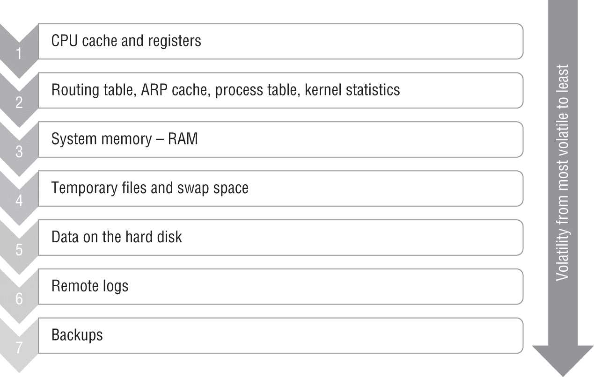
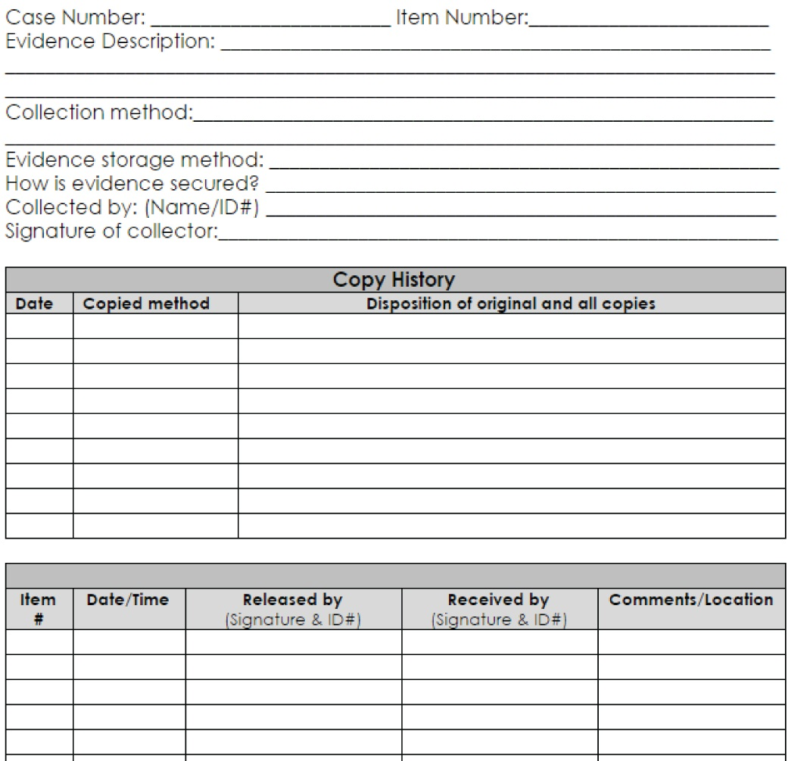
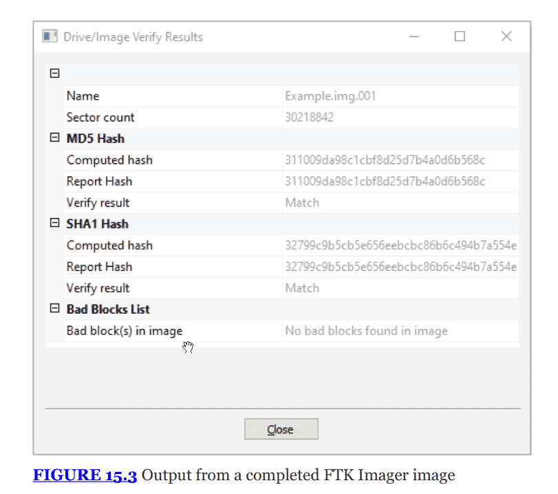
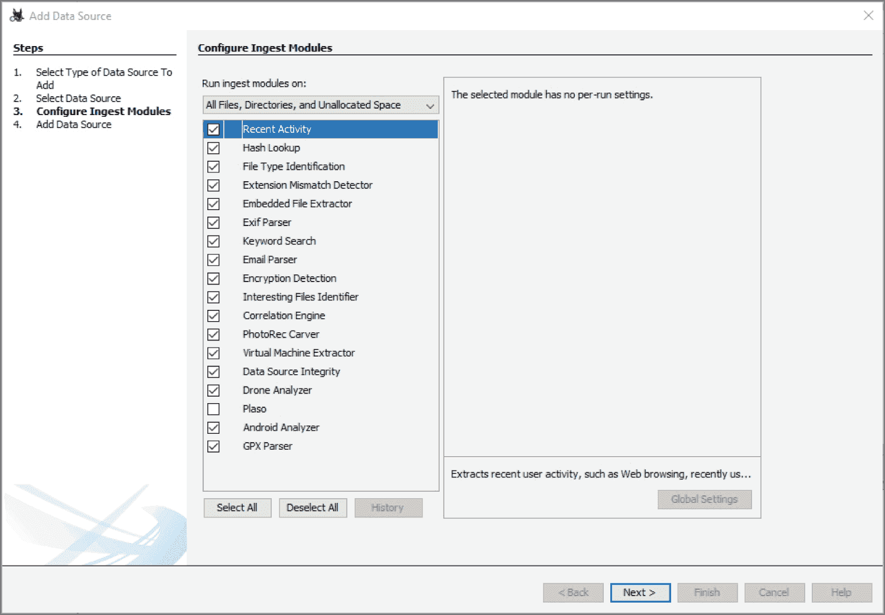
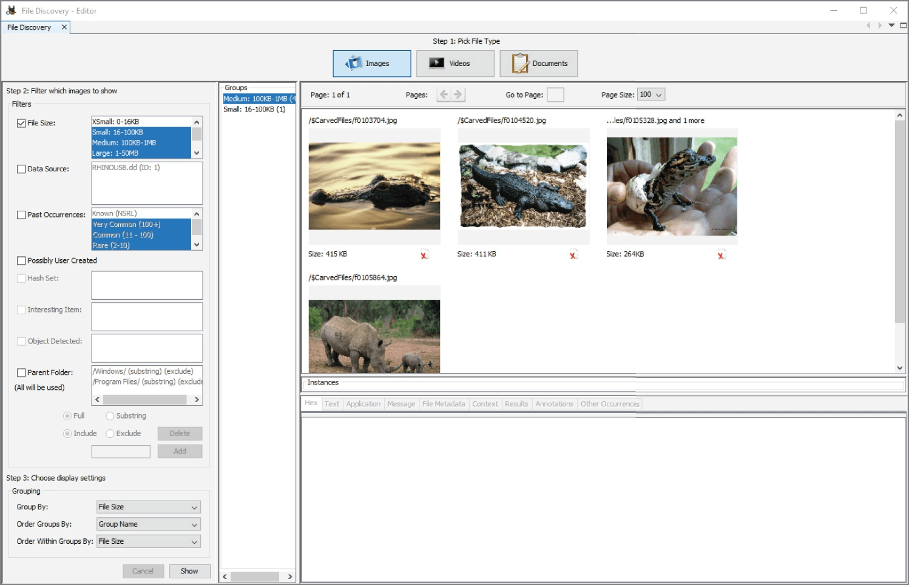
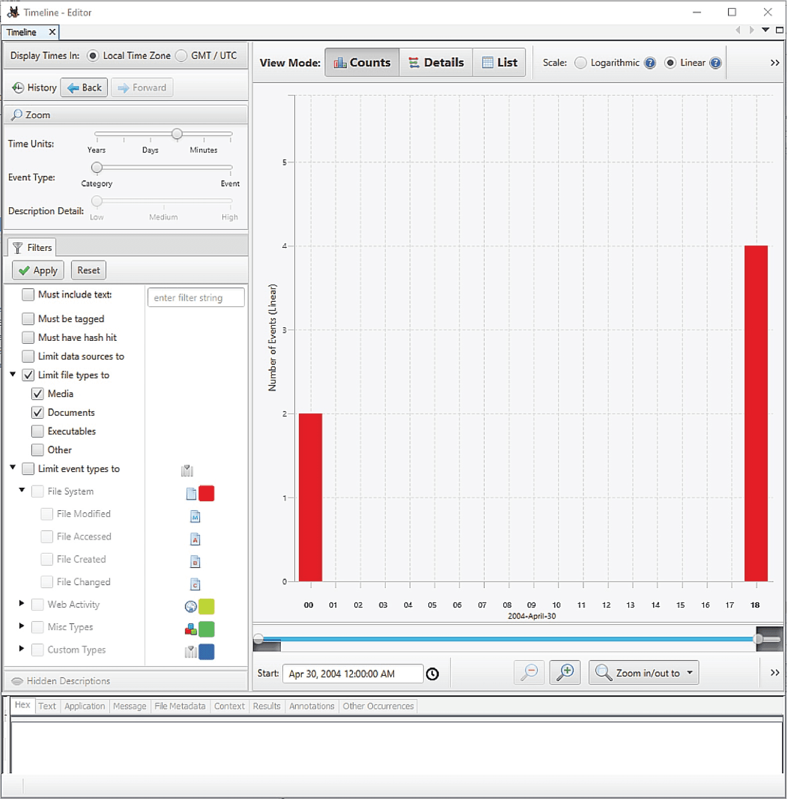

<!-- notion-metadata-start -->
*📅 Published: 2025-12-11 10:47 | 🔄 Last Updated: 2026-05-08 12:07*
<!-- notion-metadata-end -->
---


# THE COMPTIA SECURITY+ EXAM OBJECTIVES COVERED IN THIS CHAPTER INCLUDE: {#2c67b0eb61a4807498a5f0f6ea1197e5}


## Domain 4.0: Security Operations {#2c67b0eb61a4807180fef261b24600bc}


### 4.8. Explain appropriate incident response activities. {#2c67b0eb61a48055a87adc969e55346c}

- Digital forensics (Legal hold, Chain of custody, Acquisition, Reporting, Preservation, E-discovery)

---


## Digital forensics concepts {#2c67b0eb61a4804f96cde41855e89371}


DF cung cấp các công cụ và kĩ thuật để xác định “chuyện gì đã xảy ra” trên hệ thống hoặc thiết bị

- Mục đích sử dụng:
	- Đáp ứng các yêu cầu pháp lý
	- Internal investigation
	- Hỗ trợ quy trình phản ứng sự cố
	- Sử dụng trong intelligence and counterintelligence
- Quy trình cốt lõi:
	- Acquitsition: lấy dữ liệu từ ổ cứng file, bộ nhớ sống và các thiết bị khác. Việc lên kế hoạch thu thập là rất quan trọng để có được bức tranh toàn cảnh
	- Analysis: xem xét dữ liệu chi tiết
	- Documentation: bạn phải ghi lại các mốc thời gian, trình tự sự kiện. Kết luận đưa ra phải dựa trên bằng chứng
- Yếu tố con người: điều tra số không chỉ là kĩ thuật. Việc phỏng vấn các cá nhân liên quan cũng cung cấp những manh mối quan trọng mà máy móc không thấy được

### Legal hold and e-discovery {#2c67b0eb61a480ce8bf3ed4245f543a3}


### Legal hold {#2c67b0eb61a480cf99e6edfd47673910}

- Legal hold hay litigation hold là một thông báo gửi đến tổ chức khi có vụ kiện tụng đang diễn ra hoặc được sự đoán trước
- Yêu cầu: tổ chức phải bảo quản dữ liệu và hồ sơ, ngăn chặn việc chúng bị phá hủy hoặc sửa đổi theo quy trình vận hành thông thường (vd: dừng việc tự động xóa backup cũ, hủy tài liệu giấy)
- Spoilation of evidence:
	- Hành động cố ý, liều lĩnh hoặc cẩu thả làm thay đổi, phá hủy, ngụy tạo hoặc giấu diếm bằng chứng
	- Nếu nhận được legal hold mà vẫn để mất dữ liệu, tổ chức sẽ chịu hậu quả pháp lý nặng nề trước tòa

### E-discovery {#2c67b0eb61a480c5a972eecd911bc062}

- Là quá trình trao đổi/thu thập bằng chứng điện tử giữa các bên trong một vụ kiện
- Mô hình tham chiếu EDRM (electronic discovery reference model) gồm 9 bước chuẩn:
	- Information governance: quản trị thông tin để biết dữ liệu nào đang tồn tại để biết cần trao đổi thông tin gì
	- Identification: xác định thông tin lưu trữ điện tử ESI (Electronically stored infor) cần thiết
	- Preservation: bảo quản để thông tin không bị thay đổi hoặc phá hủy
	- Collection of info: thu thập để xử lý và quản lý
	- Processing: bỏ những thông tin không liên quan cũng như chuẩn bị cho việc review và phân tích thông tin
	- Review data: rà soát để đảm bảo dữ liệu chỉ chứa những gì được yêu cầu, loại bỏ thông tin mật, hoặc không liên quan
	- Analysis: phân tích nội dung, chủ đề và cá nhân liên quan
	- Production: cung cấp thông tin cho bên thứ 3 hoặc bên tham gia tố tụng
	- Presentation: trình bày dữ liệu trước tòa

**Thách thức lớn nhất:** Bước **Preservation** (Bảo quản). Rất khó để ngăn người dùng sửa đổi dữ liệu khi họ vẫn đang làm việc hàng ngày. Các tổ chức thường dùng các công cụ hỗ trợ pháp lý (_legal hold support tools_) hoặc _agents_ trên máy trạm để giúp việc này.


### E-discovery on the clouds {#2c67b0eb61a4804fb2b2cb65940fc8a2}

- **Vấn đề:** Trong môi trường đám mây, bạn không thể cài đặt các thiết bị phần cứng hoặc can thiệp sâu (_intrusive agents_) vào hệ thống của nhà cung cấp dịch vụ (ví dụ: Google, AWS, Microsoft).
- **Giải pháp:** Bạn phải dựa vào các công cụ mà nhà cung cấp Cloud đưa ra.
	- _Ví dụ:_ **Google Vault** hỗ trợ lưu trữ email và e-discovery, giúp tổ chức đáp ứng yêu cầu pháp lý mà không cần quyền truy cập vật lý vào server.

:::tip

Trình tự một vụ kiện tụng/điều tra:
- Legal hold: là một thông báo pháp lý về việc ngừng tiêu hủy dữ liệu, xảy ra đầu tiên, khi công ty biết mình sắp bị kiện, đóng băng quy trình xóa tự động

- Preservation: là hành động kỹ thuật thực tế để thực thi Legal hold ở trên

- Acquisition: là quá trình lấy dữ liệu từ thiết bị nghi vấn sang thiết bị của điều tra viên để phân tích: không làm việc trên ổ cứng gốc, tạo ra một image giống hệt

- Chain of custody: là tờ giấy nhật ký đi kèm với vật chứng: vật chứng ở đâu, đi đâu, về đâu

- E-discovery: là quy trình tìm kiếm, lọc, trích xuất dữ liệu để giao nộp cho tòa án hoặc nguyên đơn/bị đơn → giai đoạn xử lý thông tin phục vụ quá trình tranh tụng

- Vd: tòa yêu cầu đưa ra đoạn chat có nội dung chứa từ “hối lộ” trong năm 2023. Đội ngũ IT dùng phần mềm quét hàng triệu file đã Aquisition, lọc ra file pdf và gửi cho luật sư. Qúa trình tìm kiếm và lọc này gọi là E-discovery

Quy trình

- Sắp có biến -> Ra lệnh cấm xóa (**Legal Hold**).

- Cất dữ liệu vào két sắt (**Preservation**).

- Copy dữ liệu ra để điều tra (**Acquisition**).

- Luôn ghi chép ai đang giữ dữ liệu (**Chain of Custody**).

- Lọc tìm manh mối trong đống dữ liệu đó để nộp tòa (**E-discovery**).

:::


## Conducting digital forensics {#2c67b0eb61a480e49a5dc9a6a686a929}


Forensics data được thu thập bằng các công cụ forensics như disk và memory imagers, image analysis and timelining tools, low-level editors


### Accquiring forensic data {#2c67b0eb61a48004b67ac4081ce97059}


Để thu thập data, việc cần làm là xem xét order of volatility (thu thập dữ liệu từ dễ mất nhất đến bền vững nhất):




- CPU cache and registers: dữ liệu này thay đổi theo từng ms, rất khó thu thập nếu không có phần cứng chuyên dụng
- Ephemeral data: routing tables, ARP cache, process table, thống kê kernel. Dữ liệu này sẽ mất khi tắt máy
- RAM: thông tin về chương trình đang chạy, encryption keys
- Swap and pagefile: vùng nhớ tạm trên ổ cứng để hỗ trợ RAM
- Files and data on disks: dữ liệu ổ cứng, nhớ là capture toàn bộ ổ đĩa thay vì copy chúng vì sẽ xem được những file đã xóa những những artiface còn sót lại
- Remote logs: log đã gửi đi nơi khác
- Backups: dữ liệu đã sao lưu

Common forenciscs locations: Tương tự ở trên

- CPU cache and registers
- Ephemeral data
- RAM
- Swap and pagefiles
- File and data on disk
- OS: window registry
- Devices: smartphones, tablet, IoT,…
- Firmware: less frequently targeted forensics artiface
- Snapshots from VMs
- Network traffic and logs
- Artifacts like devics, printouts, media,…
- **USB Data Blockers:** Khi cắm thiết bị cần điều tra vào máy tính của điều tra viên, cần dùng thiết bị chặn dữ liệu (chỉ cho phép sạc, không cho truyền dữ liệu) hoặc thiết bị **Write Blocker** để đảm bảo không vô tình ghi đè dữ liệu lên bằng chứng.

### Chain-of-custody {#2c67b0eb61a480d1acc0e105cf8ce3b7}


Cho dù loại forensic data được thu thập bằng cách nào, quan trọng nhất vẫn phải đảm bảo chain-of-custody




- Là lịch sử của bằng chứng: ai thu thập, ai xử lý, ai lưu trữ và thời gian nào?
- Mục đích: đảm bảo integrity của bằng chứng
- Quy trình: mỗi khi ổ cứng, thiết bị hoặc vật chứng được chuyển giao từ người này sang người khác, phải có biên bản
- Admissibility: Để bằng chứng được tòa án chấp nhận, nó phải tuân thủ:
	- Relevance
	- Reliability
	- Legally obtained

## Cloud forensics {#2c67b0eb61a480a39d9afad1f338858d}


Điều tra trên cloud khó hơn on-premise, vì bạn không thể thu giữ máy chủ của nhà cung cấp được

- Right-to-audit:
	- Cần quy định rõ trong hợp đồng với CSP về quyền được kiểm tra, điều tra sự cố
		- Đối với CSP thì thường đọc SOC 2 type 2 report trước khi chọn vendor là họ
	- Các tổ chức nhỏ thường phải chấp nhận hợp đồng tiêu chuẩn và chỉ được cung cấp các báo cáo kiểm toán của bên thứ ba thay vì được điều tra trực tiếp
	- IaaS thường khó cho right-to-audit vì ảnh hưởng tới khác hàng của họ và thường dùng third-party audit
- Jurisdiction & venue:
	- Jurisdiction: dữ liệu nằm ở Mỹ, Singapore hay châu âu, luật pháp nơi đặt sẽ chi phối
	- Venue (địa điểm xử án): hợp đồng thường quy định nơi diễn ra vụ kiện. Nếu không chú ý, bạn có thể bay sang bang khác hoặc nước khác để hầu tòa
	- Nexus (mối liên hệ): Khái niệm pháp lý xác định xem một công ty có đủ sự hiện diện vật lý (văn phòng, nhân viên, hoạt động kinh doanh) tại một nơi để bị đánh thuế hoặc chịu sự quản lý của luật pháp nơi đó hay không.
- Data breach notification laws:
	- Quy định thời gian tối đa bạn được phép trì hoãn trước khi thông báo cho khách hàng về vụ lộ lọt dữ liệu
	- Mỗi bang ở Mỹ hoặc mỗi quốc gia có quy định khác nhau, hợp đồng Cloud cần làm rõ trách nhiệm của nhà cung cấp trong việc thông báo cho bạn ngay khi họ bị tấn công

## Acquisition tools {#2c67b0eb61a4809eb0e5d1ed09a4c9ad}


Dùng command `dd` trên Linux. Đây là công cụ cơ bản nhưng mạnh mẽ trên Linux.

- **Cú pháp:** `dd if=<input file> of=<output file> options`
	- `if` (input file): Nguồn dữ liệu (ví dụ: `/dev/sda`).
	- `of` (output file): Nơi lưu file ảnh đĩa (ví dụ: `image.img`).
	- `bs` (block size): Kích thước khối dữ liệu (ví dụ: `bs=4k`).
- **Lưu ý:** Lệnh `dd` rất mạnh, nếu gõ nhầm đích (`of`) đè lên ổ cứng thật thì dữ liệu sẽ mất vĩnh viễn (do đó `dd` còn được nói vui là "disk destroyer").

Ví dụ: để copy ổ đĩa /dev/sda tới file example.img


```json
dd if=/dev/sda of=example.img conv=noerror,sync
```


Lưu ý nếu đã tạo img thì cần phải tạo thêm MD5sum hash của img luôn để đảm bảo img thu được là hợp lệ


```json
dd if=/dev/sda bs=4k conv=sync,noerror | tee example.img |
md5sum> example.md5
```


### Nói thêm về dd {#2c67b0eb61a4804fb3f4c5a0bf8a4cd9}


Lệnh dd sao chép bit-by-bit khác với copy sao chép file hiện hữu

- Sao chép dữ liệu hiện có
- Unallocated spcae (nơi chứa các file bị xóa nhưng chưa bị ghi đè)
- Sao chép cả slack space (vùng thừa đuôi file)

→ Bản sao giống hệt ổ cứng gốc, đảm bảo tính toàn vẹn


Cấu trúc: input file (if) → output file (of)


```json
dd if=[source] of=[des] [tuy chon]
```

- **if (Input File):** Nơi bạn lấy dữ liệu (Ví dụ: ổ cứng của nghi phạm `/dev/sda`).
- **of (Output File):** Nơi bạn lưu dữ liệu (Ví dụ: file ảnh đĩa `image.dd` hoặc ổ cứng dự phòng).
- **bs (Block Size):** Kích thước khối dữ liệu đọc/ghi mỗi lần (Ví dụ: `bs=4k` hoặc `bs=64k` để tăng tốc độ).

Ví dụ cụ thể: tạo forensic image để mang về lab phân tích. Khi bạn thu giữ được USB của nghi phạm /dev/sdb


```json
dd if=/dev/sdb of /evidence/suspect_drive.im bs=64k conv=noerror,sync
```

- `if=/dev/sdb`: Đọc toàn bộ USB (nguồn).
- `of=/evidence/suspect_drive.img`: Ghi thành file ảnh (đích).
- `conv=noerror`: Nếu gặp Bad Sector (lỗi đĩa), **đừng dừng lại**, cứ bỏ qua lỗi và copy tiếp (rất quan trọng để lấy được tối đa dữ liệu).
- `sync`: Nếu có lỗi đọc, hãy chèn số 0 vào chỗ lỗi đó để đảm bảo kích thước file đích vẫn khớp với file nguồn.

Ví dụ: sao chép ổ đĩa sang ổ đĩa


```json
dd if=/dev/sda of=/dev/sdb
```


`/dev/sdb` (ổ đích) sẽ bị ghi đè hoàn toàn. Nếu chọn nhầm ổ, dữ liệu sẽ mất vĩnh viễn (lý do của cái tên Disk Destroyer).
Vd: xóa sạch ổ đĩa


**Lệnh:**`dd if=/dev/zero of=/dev/sda`

- `if=/dev/zero`: Lấy nguồn từ một thiết bị ảo chuyên tạo ra số 0.
- **Kết quả:** Toàn bộ ổ cứng `/dev/sda` sẽ bị lấp đầy bởi số 0. Mọi dữ liệu cũ bị ghi đè và không thể phục hồi.

---


Các công cụ nâng cao, cải tiến của `dd`


Do đó, hãy chú ý đến 2 công cụ này:

- **dcfldd** (Do Bộ Quốc phòng Mỹ phát triển): Có thanh tiến trình, tự động tính hash MD5/SHA trong lúc copy.
- **dc3dd**: Phiên bản nâng cấp khác, có tính năng logging và verify tốt hơn.

> Câu hỏi trắc nghiệm mẫu:  
> Chuyên gia điều tra cần tạo một bản sao bit-by-bit của ổ cứng nghi phạm nhưng muốn đảm bảo rằng quá trình sao chép tạo ra mã băm (hash) ngay lập tức để xác minh tính toàn vẹn. Công cụ nào phù hợp nhất?  
> A. cp  
> B. dd  
> C. dcfldd  
> D. rsync


	**Đáp án:** C (Vì `dcfldd` hỗ trợ hashing on-the-fly, còn `dd` thì phải chạy xong mới hash thủ công được).


### FTK imager (GUI) {#2c67b0eb61a480748bc0e2dbd196dc9a}

- Là công cụ miễn phí phổ biến dùng để tạo disk image và memory capture
- Hỗ trợ nhiều định dạng: raw (dd), E01, (EnCase), AFF
- Memory capture: FTK có thể dump toàn bộ RAM của hệ thống đang chạy ra file để phân tích sau này




:::tip

Ngoài FTK thì còn có EnCasem, Volatility framework, Open source thì có SANS SIFT

:::


## Accquiring network forensics data {#2c67b0eb61a480038568cf79a3b7fbcd}


Dữ liệu mạng là loại ephemeral, nếu bạn không capture gói tin khi nó đang trên đường truyền, nó sẽ biến mất

- Dùng công cụ như wireshark
- Phương pháp thu thập:
	- Sử dụng Taps (thiết bị truy xuất vật lý) hoặc span ports (cổng mirroring trên switch) để sao chép lưu lượng mạng gửi về server thu thập
	- Do dữ liệu quá lớn, hầu hết tổ chức chỉ dựa vào logs và NetFlow thay vì lưu toàn bộ gói tin
	- Ngoài netFlow thì còn có
		- IPFIX là chuẩn quốc tế (IETF) của netflow v9, mở rộng hơn và không phụ thuộc cisco
		- sFlow: một kỹ thuật giám sát khác, thay vì ghi lại toàn bộ thì nó lấy mẫu gói tin để thống kê băng thông và kết nối
		- Chúng đều là những công cụ phân tích lưu lượng mạng
	- Còn NXlog: là nhật ký log, nó ghi ra file log chứ không phân tích lượng mạng

### Other forensic sources {#2c67b0eb61a48043ae8ed7e0d586e1a4}

- Flash media & SSDs:
	- SSD có cơ chế wear leveling để phân phối dữ liệu đều khắp các chip nhớ nhằm tăng tuổi thọ
	- Điều này làm secure delete hoặc khôi phục bộ nhớ trở nên khó lường. Dữ liệu cũ có thể nằm trong các spare cells mà hệ điều hành không thể thấy được nhưng chuyên gia vẫn có thể trích xuất
	- Khắc phục: FDE là cách tốt nhất
- VMs and Containers:
	- VMs: việc thu giữ máy chủ chứa hàng trăm VM là không khả thi
		- Sử dụng snapshots
	- Containers: Rất khó điều tra vì chúng cũng mang tính ephemeral như network data
		- Tài nguyên thường được chia sẻ, ít để lại forensics artifacts hơn so với VM. Cần có kế hoạch giám sát và log chuyên biệt cho môi trường này

## Validating forensic data integrity {#2c67b0eb61a48039b542cafe15ad2cb0}

- Tạo hash: bằng MD5 hoặc SHA1, mã hash này đóng vai trò là checksum
	- MD5 hoặc SHA1 nhanh hơn so với các thuật toán mã hóa không bị collision
	- Việc tạo collision cho dữ liệu khổng lồ (hàng TB) là vô cùng khó khăn
	- Tương thích với các sản phẩm legacy
	- Hiện tại người ta dùng dual hashing: `dcfldd` hoặc các máy imaging chuyên dụng (như Tableau), điều tra viên thường cấu hình để tính **cùng lúc MD5 và SHA1** (hoặc MD5 và SHA256).
- Forensic copy vs logical copy
	- Logical copy: nó bỏ qua unallocated space và file đã xóa
	- Bit-by-bit: bao gồm unallocated space, file đã xóa và metadata
- Write blockers:
	- Để đảm bảo hash không bị thay đổi, write blockers (phần cứng hoặc phần mềm) được áp dụng
	- Nó cho phép đọc dữ liệu từ ổ cứng nhưng ngăn chặn mọi hành động write lên đó ngăn chặn thay đổi dữ liệu và metadata của nó
- Provenance: xuất xứ

## Data recovery {#2c67b0eb61a4806dadc0ed7aa50a1f6a}


Digital forensics cũng bao gồm việc recovery lại những gì kẻ xấu đã xóa

- Cơ chế xóa file: khi delete hệ điều hành chỉ xóa index/pointer trỏ đến file đó và đánh dấu vùng đĩa đó là available dữ liệu thực tế vẫn còn đó.
- Công cụ khôi phục file sẽ quét ổ đĩa để tìm các fragments chưa bị ghi đè dựa trên header hoặc metadata của nó
- Slack space: không gian thừa, lỏng lẻo
	- File được lưu trữ theo blocks, nếu file nhỏ hơn kích thước block, phần dư thừa là slack space
		- Nếu file 100Mb và bị overwrite một phần 25Mb, 75Mb còn lại có thể recover được
- Anti-forensics: để chặn việc khôi phục dùng công cụ secure delete để ghi đè nhiều lần lên vùng dữ liệu đó

### Nói thêm về delete file {#2c67b0eb61a480b099bece98f5855289}

- Hầu hết windows hiện tại xài New Technology file system - NTFS.
- NTFS có bảng CSDL là MFT (master file table) chứa record của tất cả các file trên máy tính gồm: tên, kích thước, ngày, quyền hạn, địa chỉ cluster
- Khi xóa file thì windows đổi flags của record file đó từ `allocated` thành `unallocated` và cập nhật bitmap để báo rằng: clusters từng chiếm này giờ đang trống, có thể ghi đè dữ liệu
- Tức là dữ liệu vẫn ở đó cho đến khi dữ liệu mới được overwrite lên đó

Còn trên Linux: quản lý file dựa trên Inode (index node);

- Inode chứa quyền, chủ sở hữ, địa chỉ khối,… nhưng không chứa tên file
- Filename chính là hardlink (coi lại phần Introduction to Linux) trỏ đến Inode
- Khi xóa thì unlink file và inode giảm link count xuống 1 đơn vị, nếu linkcount về 0 thì inode đó tự do, datablock được coi là available
- Nếu dùng `debugfs` hoặc `extundelete`  thì có thể khôi phục

:::tip

Delete vs Shift+delete trên Windows
- Delete chỉ là di chuyển, không đổi flag trong MFT, chỉ chuyển vào một thư mục Recycle bin

- Shift+delete: là logical delete

Hiện đại trên SSD thì nó sẽ có lệnh TRIM và xóa trắng nhanh sau vài phút, vài giờ nên việc khôi phục gần như là không thể

:::


### Forensic suites and a forensic case example {#2c67b0eb61a48007833fe6ed3f366b7c}


Forensic suites là một bộ giải pháp forensics hoàn chỉnh để phục vụ thu thập data, phân tích và báo cáo. FTK và EnCase là những phương án thương mại phổ biến, còn Autopsy là một open source forensics suite với đa dạng chức năng:

- Importing data:
	- Cho phép nhập nhiều nguồn dữ liệu: raw disk, image, VMs
	- Nguồn dữ liệu: có thể tải dữ liệu mẫu từ NIST CFReDS (Computer forensic reference data sets) để thực hành [https://cfreds.nist.gov/](https://cfreds.nist.gov/)
- Ingestion modules:
	- Sau khi nhập thì autosy chạy các modules để tự động phân tích
	- Vd: exit Parser (đọc thông tin ảnh), email parser, encryption detection, keyword search
	- Trong ví dụ "Rhino Hunt", công cụ tự động tìm thấy các bức ảnh cá sấu (crocodiles) dựa trên các module này.






- Timelines:
	- Đây là tính năng cực kỳ mạnh mẽ. Nó vẽ ra biểu đồ thời gian của các sự kiện hệ thống (file thay đổi, truy cập web, v.v.).
	- Giúp điều tra viên trả lời: "Người dùng đã làm gì vào lúc sự cố xảy ra?" hoặc "Các thay đổi file nào diễn ra gần thời điểm đó?".




**Cảnh báo:** _Timelining_ phụ thuộc hoàn toàn vào độ chính xác của đồng hồ hệ thống. Nếu máy chủ bị sai giờ (NTP lỗi), toàn bộ dòng thời gian điều tra sẽ bị sai lệch.


## Reporting {#2c67b0eb61a48067bcd1edf8b68412d3}


Dù bạn phân tích giỏi đến đâu, nếu không viết được báo cáo tốt, công sức sẽ đổ sông đổ bể. Báo cáo (_The Report_) là sản phẩm quan trọng nhất của quy trình điều tra.

- **Nguyên tắc:** Báo cáo cần hữu ích, chứa thông tin liên quan, nhưng không được sa đà vào quá nhiều chi tiết kỹ thuật khó hiểu (trừ khi để ở phần phụ lục).
- **Cấu trúc một báo cáo tiêu chuẩn (Exam Checklist):**
	1. **Summary:** Tóm tắt cuộc điều tra và các phát hiện chính.
	2. **Outline of process:** Mô tả quy trình, công cụ đã dùng (ví dụ: dùng FTK Imager bản nào, hash MD5 là gì) và các giả định.
	3. **Detailed findings:** Chi tiết phát hiện trên từng thiết bị/ổ cứng. **Độ chính xác (Accuracy)** là tối quan trọng ở đây. Kết luận phải dựa trên bằng chứng (_backed up with evidence_).
	4. **Recommendations:** Đề xuất hoặc kết luận chi tiết hơn phần tóm tắt.

## Digital Forensics and Intelligence {#2c67b0eb61a480fe8783c1ca38cc7f11}


Điều tra số không chỉ dùng cho tòa án hay xử lý sự cố nội bộ, mà còn đóng vai trò lớn trong **Intelligence** (Tình báo) và **Counterintelligence** (Phản gián).

- **Mục đích:**
	- Phân tích các hành động và công nghệ của đối thủ (_adversary actions_).
	- Hiểu rõ hành vi của các công cụ **APT (Advanced Persistent Threat)** - các mối đe dọa dai dẳng nâng cao.
	- Phục vụ cho quốc phòng (_national defense_) hoặc ngăn chặn hoạt động gián điệp của tổ chức khác.
- **Yêu cầu kỹ năng:** Mảng này yêu cầu kỹ thuật cao hơn, bao gồm phá mã hóa (_breaking encryption_), phân tích phần mềm/phần cứng chuyên sâu để tìm ra cách thức hoạt động của công cụ tấn công.

## EXAM ESSENTIALS {#2c67b0eb61a480388d7ff87eb640d0ef}


Dưới đây là tổng hợp các điểm "chết người" mà sách nhấn mạnh bạn phải thuộc lòng cho kỳ thi Security+ (dựa trên các trang _Summary_ và _Exam Essentials_ cuối chương):


### A. Về Quy trình & Pháp lý {#2c67b0eb61a480c5b16ac0d6e290a0a2}

1. **Legal Holds & E-discovery:**
	- Là động lực chính cho hoạt động điều tra.
	- Khi có kiện tụng (hoặc _dự đoán_ sẽ có kiện tụng), phải ban hành **Legal Hold** ngay lập tức để bảo vệ dữ liệu, tránh bị tiêu hủy (_spoliation_).
2. **Chain of Custody (Chuỗi hành trình bằng chứng):**
	- Phải duy trì tài liệu ghi chép ai đang giữ bằng chứng vào mọi thời điểm.
	- Nếu đứt gãy chuỗi này -> Bằng chứng không được chấp nhận tại tòa (_inadmissible in court_).

### B. Về Thu thập dữ liệu (Acquisition) {#2c67b0eb61a48036b484d3a5e872af43}

1. **Order of Volatility (Thứ tự biến động):**
	- Luôn thu thập từ **Dễ mất nhất** đến **Bền vững nhất**.
	- Thứ tự: **CPU/Cache/Registers** -> **RAM** -> **Swap/Pagefile** -> **Disk** -> **Logs/Remote media**.
2. **Forensic Copy vs. Logical Copy:**
	- Phải dùng **Bit-by-bit copy** (như lệnh `dd`) để lấy cả không gian trống (_slack space_) và file đã xóa.
	- Copy/Paste thông thường (Logical) là không đủ cho điều tra.
3. **Data Integrity (Toàn vẹn dữ liệu):**
	- Sử dụng **Hashing** (MD5/SHA1) để chứng minh bản sao giống hệt bản gốc.
	- Sử dụng **Write Blockers** để đảm bảo không ghi đè lên ổ cứng gốc khi đang khám nghiệm.

### C. Về Cloud & Thách thức mới {#2c67b0eb61a4801f842afcd8ba73cefc}

1. **Cloud Forensics:**
	- Khó khăn do không thể tiếp cận vật lý.
	- Phụ thuộc vào hợp đồng (**Right-to-audit clauses**) và công cụ của nhà cung cấp.
	- Lưu ý vấn đề pháp lý về **Jurisdiction** (Thẩm quyền tài phán - dữ liệu nằm ở nước nào?).

### D. Về Incident Response {#2c67b0eb61a480aea0f6f0aa89eb42e3}

1. **IR Process:**
	- Nhớ vòng đời: **Preparation -> Detection -> Analysis -> Containment -> Eradication -> Recovery -> Lessons Learned**.
	- Lưu ý các kỹ thuật ngăn chặn (_Containment_): Isolation (Cô lập), Segmentation (Phân đoạn), Allow/Deny Lists.
