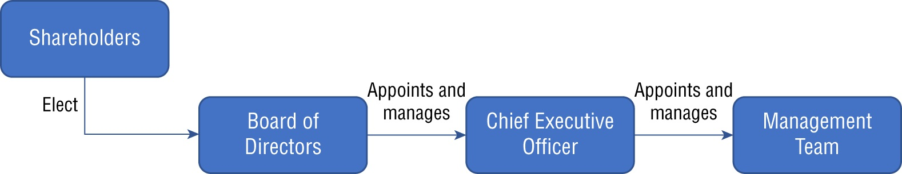
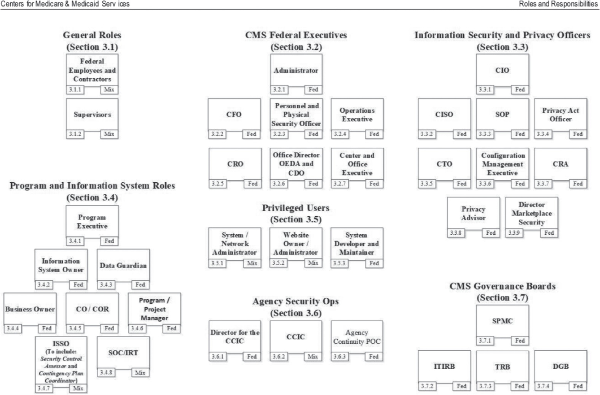
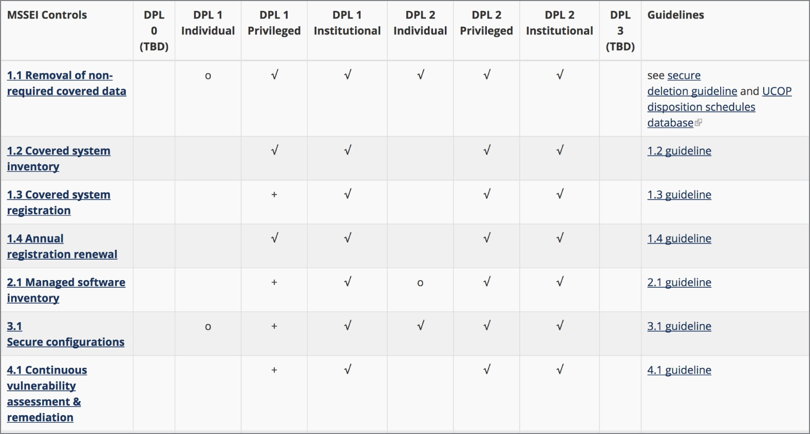
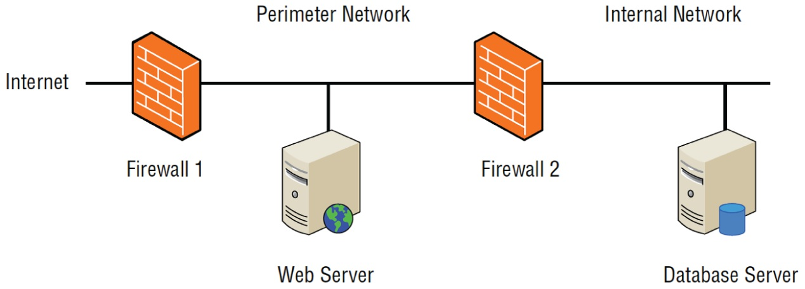
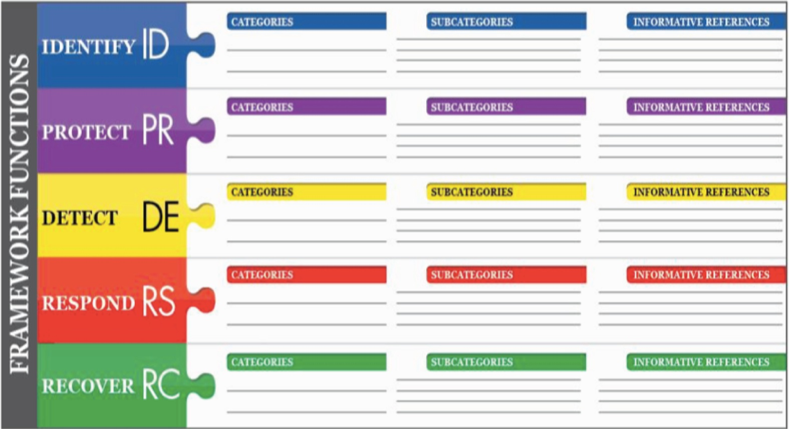
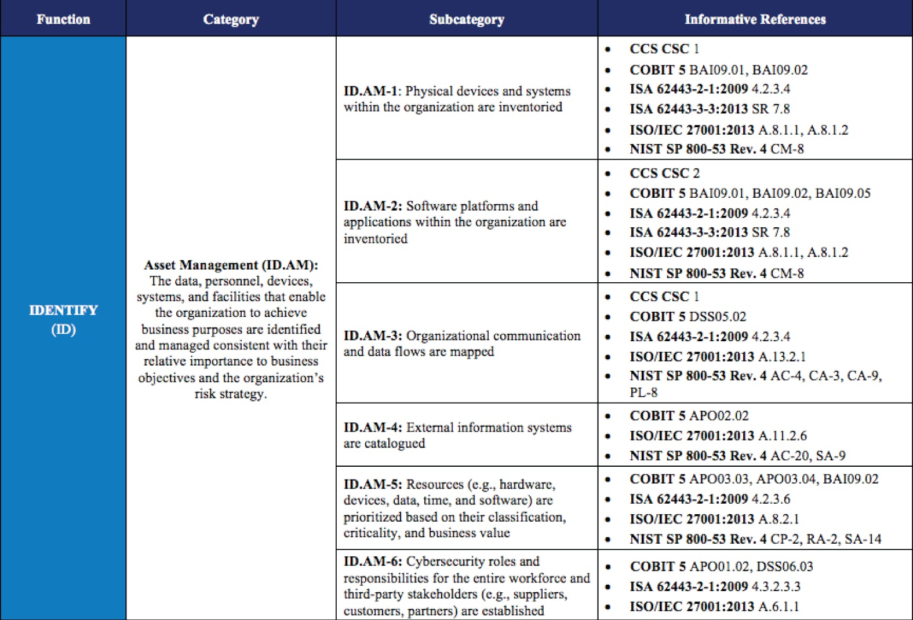
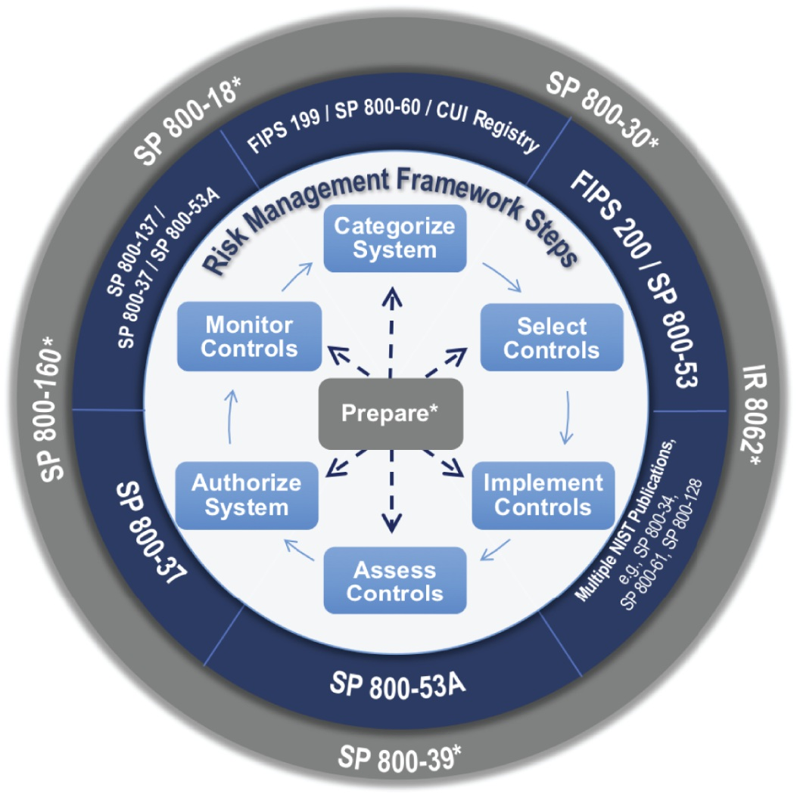
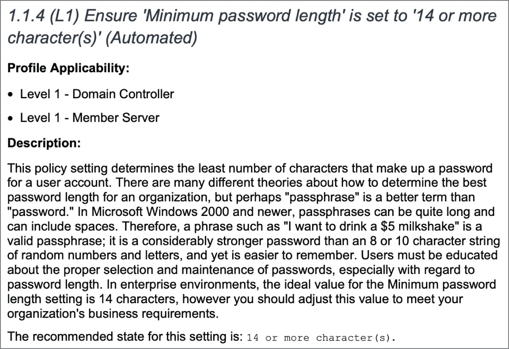

---

# THE COMPTIA SECURITY+ EXAM OBJECTIVES COVERED IN THIS CHAPTER INCLUDE: {#2c67b0eb61a48027bd59e09065ef8205}

## Domain 1.0: General Security Concepts {#2c67b0eb61a480338296fd012d411fac}

### 1.3. Explain the importance of change management processes and the impact to security. {#2c67b0eb61a480cab4aef0f19da7fca6}

- Business processes impacting security operation (Approval process, Ownership, Stakeholders, Impact analysis, Test results, Backout plan, Maintenance window, Standard operating procedure)
- Technical implications (Allow lists/deny lists, Restricted activities, Downtime, Service restart, Application restart, Legacy applications, Dependencies)
- Documentation (Updating diagrams, Updating policies/procedures)
- Version control

## Domain 2.0: Threats, Vulnerabilities, and Mitigations {#2c67b0eb61a48045a3b0d56c3b30f743}

2.5. Explain the purpose of mitigation techniques used to secure the enterprise.

- Least privilege

## Domain 5.0: Security Program Management and Oversight {#2c67b0eb61a4800a8aa9f129b3935c64}

### 5.1. Summarize elements of effective security governance. {#2c67b0eb61a4802c9a95d5ce7fc31b99}

- Guidelines
- Policies (Acceptable use policy (AUP), Information security policies, Business continuity, Disaster recovery, Incident response, Software development lifecycle (SDLC), Change management)
- Standards (Password, Access control, Physical security, Encryption)
- Procedures (Change management,
- Onboarding/offboarding, Playbooks)
- External considerations (Regulatory, Legal, Industry, Local/regional, National, Global)
- Monitoring and revision
- Types of governance structures (Boards, Committees, Government entities, Centralized/decentralized)

### 5.3. Explain the processes associated with third-party risk assessment and management. {#2c67b0eb61a480788f4ef758b975dcbf}

- Vendor assessment (Penetration testing, Right-to-audit clause, Evidence of internal audits, Independent assessments, Supply chain analysis)
- Vendor selection (Due diligence, Conflict of interest)
- Agreement types (Service-level agreement (SLA), Memorandum of agreement (MOA), Memorandum of understanding (MOU), Master service agreement (MSA), Work order (WO)/Statement of Work (SOW), Non-disclosure agreement (NDA), Business partners agreement (BPA))
- Vendor monitoring
- Questionnaires
- Rules of engagement

### 5.4. Summarize elements of effective security compliance. {#2c67b0eb61a480f4a0c8e365a57b6041}

- Compliance reporting (Internal, External)
- Consequences of non-compliance (Fines, Sanctions, Reputational damage, Loss of license, Contractual impacts)
- Compliance monitoring (Due diligence/care, Attestation and acknowledgement, Internal and external, Automation)

### 5.6. Given a scenario, implement security awareness practices. {#2c67b0eb61a48058aee5f36f3961919a}

- Phishing (Campaigns, Recognizing a phishing attempt,
- Responding to reported suspicious messages)
- Anomalous behavior recognition (Risky, Unexpected, Unintentional)
- User guidance and training (Policy/handbooks, Situational awareness, Insider threat, Password management, Removable media and cables, Social engineering, Operational security, Hybrid/remote work environments)
- Reporting and monitoring (Initial, Recurring)
- Development
- Execution

---

## Security governance {#2c67b0eb61a480d69f1dc40739796e47}

Governance là tập hợp các quy trình và biện pháp controls để cho phép tổ chức điều hành công việc hiệu quả

- Mục đích: nếu không có governance tổ chức sẽ rơi vào hỗn loạn, có governance để thực hiện các strategic plans

### Corporate governance {#2c67b0eb61a480f6b385fd682c1e1b30}

- Là cấp độ cao nhất của quản trị trong tổ chức, thiết lập hướng đi chiến lược và giám sát việc thực thi.
- Hierarchical model thường thấy ở public traded corporations:
	- Shareholders: Là chủ sở hữu công ty, số lượng lớn và thường thay đổi, họ không thể trực tiếp điều hành
	- Board of directors:
		- Shareholders bầu ra Hội đồng quản trị
		- Có ultimate authority trong tổ chức
		- Thường là cổ đông lớn hoặc chuyên gia quản trị
		- Best practices: đa số thành viên trong Board nên là independent Directors - không có quan hệ nào khác với công ty ngoài tư cách thành viên hội đồng → khách quan.
			- audit committee thường là một sub-committee trong BoD
	- CEO (chief executive officer):
		- BoD không thể lúc nào cũng họp, họ thuê CEO để quản lý hoạt động hàng ngày (day-to-day operations)
		- CEO được thuê, sa thải và quyết định lương thưởng bởi Board
	- Management team & employees:
		- Flow of governance cascades downward tới quản lý các team và nhân viên là thành viên trong các team đó

	

:::tip

**Lưu ý:**
- Mô hình trên áp dụng cho công ty đại chúng.

- Các tổ chức phi lợi nhuận (**Nonprofit**) hoặc công ty tư nhân (**Privately owned**) có thể có biến thể khác (ví dụ: chủ sở hữu kiêm luôn CEO).

:::

## Governance, Risk and Compliance programs (GRC) {#2c67b0eb61a480b3ac6dd95ae81c4691}

Tổ chức thực hiện việc governance bằng tạo ra chính sách GRC:

- Governance: quản lý tổ chức (như trên)
- Risk management: quản lý rủi ro (sẽ đề cập ở Chapter 17)
- Compliance: tuân thủ luật lệ, quy định

### Information security governance {#2c67b0eb61a4802494e5e960fad5fa7c}

Là sự mở rộng tự nhiên của Corporate Governance

- Delegation: cũng như BoD ủy quyền cho CEO, CEO ủy quyền tài chính cho CFO (chief Financial Officer), vận hành cho COO (Chief Operation Officer), CEO sẽ ủy quyền trách nhiệm bảo mật cho CISO (Chief Information Security Officer) hoặc một giám đốc phụ trách tương đương
- Vai trò của CISO:
	- Làm việc với CEO và các quản lý cấp cao khác để thiết kế và triển khai Information Security Governance framework (ISGF)
	- Mục tiêu: đảm bảo chương trình align với mục tiêu chiến lược của tổ chức
	- Vì CISO không có quyền operational với toàn bộ nhân viên, họ cần management leverage thông qua policies áp dụng cho toàn bộ tổ chức để bắt buộc tuân thủ các yêu cầu bảo mật
- CISO sử dụng các kênh báo cáo hiện có hoặc thiết lập kênh mới, bao gồm cả escalation procedures khi cần sự hỗ trợ từ ban lãnh đạo để giải quyết vấn đề

### Types of Governance structures {#2c67b0eb61a48020bbf0f4c98d76ad45}

- Centralized Governance models:
	- Top-down
	- Một central authority tạo ra policies and standard
	- Các chính sách này được thực hiện trên toàn bộ tổ chức
- Dencentralized Governance models:
	- Sử dụng bottom-up
	- Individual business units được ủy quyền để tự đạt được các mục tiêu an ninh mạng theo cách họ thấy phù hợp

**Các yếu tố khác trong cấu trúc quản trị:**

- Ngoài **Board of Directors**, cấu trúc quản trị có thể bao gồm các ủy ban nội bộ gồm các chuyên gia chuyên môn (**SMEs - Subject Matter Experts**) và quản lý.
- Các cơ quan chính phủ (như **Regulatory agencies**) cũng đóng vai trò trong quản trị của một số tổ chức (ví dụ: Ngân hàng bị quản lý bởi Bộ Tài chính Mỹ).

---

Bổ sung

:::tip

- **Policy (Chính sách):** Là công cụ quản trị chính (**primary governance tools**) cho bất kỳ chương trình an ninh mạng nào. Nó thiết lập các nguyên tắc và quy tắc hướng dẫn việc thực thi bảo mật.

- **Best Practice Frameworks:** Các chính sách thường được xây dựng dựa trên các khung tiêu chuẩn của các nhóm ngành, ví dụ:

- **Compliance Obligations:** Chính sách cũng chịu ảnh hưởng bởi các yêu cầu tuân thủ từ bên ngoài (luật pháp, quy định) mà cơ quan quản lý áp đặt lên tổ chức.

:::

## Understanding policy documents {#2c67b0eb61a48017ab33dde578af46b7}

Một ISPG (information security policy framework) bao gồm series những tài liệu hướng dẫn về chương trình cybersec của tổ chức. Gồm 4 loại tài liệu chính:

- Policies
- Standards
- Procedures
- Guildines

Thực tế thì những ranh giới này có thể bị xóa nhòa, chỉ cần đảm bảo việc thực thi chính xác là được

Có những yếu tố ảnh hưởng tới việc xây dựng chính sách:

- Regulatory and legal requirements:
- Industry-specific considerations:
- Jurisdiction-specific considerations

### Policies {#2c67b0eb61a4806eb9f5d34025e4dce7}

Định nghĩa:

- Là cách high-level statements về ý định của ban quản lý
- Việc tuân thủ policies là bắt buộc

Nội dung cốt lõi:

- Tuyên bố về tầm quan trọng của an ninh mạng với tổ chức
- Yêu cầu tất cả nhân viên phải thực hiện các biện pháp bảo vệ tính CIA của thông tin
- Tuyên bố về quyền sở hữu của thông tin
- Chỉ định CISO hoặc người chịu trách nhiệm về an ninh mạng
- Delegation of authority cho CISO tạo ra Standards, Procedures, Guildlines

Các cách xây dựng Policies:

- High-level (khuyên dùng): đảm bảo tổng quát, flexibility để đảm bảo khi có các thành phần bên dưới thay đổi không cần phải sửa, thêm thắt vào policies
- Detailed (ví dụ như CMS):
	- Centers for Medicare & Medicaid Services (CMS) has a 95-page information security policy
	- Nhanh chóng bị lỗi thời
	- Nhân viên lười cập nhật phiên bản mới

Các loại policies phổ biến:

- Information security policies (ISP): cung cấp thẩm quyền và hướng dẫn high-level
	- **Luật có đổi không?** (Dựa vào Regulations - D).
	- **Hệ thống có bị tấn công không?** (Dựa vào Logs - A).
	- **Nhân viên có làm việc được không?** (Dựa vào Feedback - B).
- Incident response policy (IRP)
- Acceptable use policy (AUP): hướng dẫn về việc sử dụng tài nguyên được phép
	- Được làm gì/cấm với máy tính internet của công ty
	- Không phải là access control (quyền cho đăng nhập/authentication)
- Business continuity and disaster recovery policies (BCDRP)
	- Business continuity: tập trung là quy trình kinh doanh
	- Disaster recovery: khôi phục hoạt động sau thảm họa
- Software development life cycle (SDLC) policy
- Change management change change control policies: quy trình xem xét, phê duyệt và thự chiện các thay đổi hệ thống để quản lý rủi ro

### Standards {#2c67b0eb61a480929885d74f71fb6c81}

- Cung cấp yêu cầu bắt buộc mô tả thực hiện policies
- Thường được phê duyệt ở cấp thấp hơn policy nên thay đổi thường xuyên hơn
- Vd: cách cài đặt cấu hình cụ thể cho hđh, biện pháp kiểm soát thông tin nhạy cảm

Mối quan hệ phân cấp:

	1. Policy: đặt ra mục tiêu cấp cao
	2. Standards: chức chi tiết các kiểm soát bảo mật bắt buộc
	3. Guildlines: cung cấp advice hoặc hướng dẫn tùy chọn cho ai muốn tuân thủ policy và standards

Tầm quan trọng:

- Nếu không tuân theo các best practices sẽ dẫn tới hậu quả, trách nhiệm pháp lý

Các loại standards:

- Password standards: Yêu cầu về độ dài, phức tạp, tái sử dụng
- Access control standards: mô tả vòng đời tài khoản (tạo mới, sử dụng, hủy bỏ), yêu cầu cho nhân viên, nhà thầu, và các tài khoản đặc quyền
- Physical security standards: camera, nhân viên an ninh, kiểm soát khách ra vào
- Encryption standards: mã hóa dữ liệu at rest, in transit, in use

### Procedures {#2c67b0eb61a4806d8439d88216610824}

- Là quy trình chi tiết (step-by-step) mà cá nhân/tổ chức phải tuân theo trong các tình huống cụ thể
- Tương tự như danh sách checklist, đảm bảo tính nhất quán
- Tuân thủ procedures là việc bắt buộc

Các loại procedures phổ biến:

- Change management procedures: hướng dẫn việc tổ chức thực hiện change management activities đảm bảo tuân thủ change management policy của tổ chức ví dụ như: version control và các tools khác
- Onboarding and offboarding procedures: quy trình thêm tài khoản mới và thu hồi khi nhân viên rời đi
- Playbooks: mô tả chi tiết các hành động và đội phản ứng sự cố (IR team) sẽ thực hiện khi xảy ra sự cố cụ thể
	- Khác với procedures thông thường, nó liên quan đến kĩ thuật IT nhiều hơn

:::tip

**Ví dụ thực tế:**
Tài liệu "What to Do if Compromised" của Visa là một ví dụ điển hình về **Procedure** bắt buộc (dù tiêu đề không có chữ procedure). Nó sử dụng ngôn ngữ không thể hiểu sai (như "must") và đưa ra các mốc thời gian/hành động cụ thể:
- Thông báo cho Visa trong vòng 3 ngày.

- Thuê điều tra viên pháp y (**PFI**) trong vòng 5 ngày làm việc.

- Cung cấp báo cáo sơ bộ trong 10 ngày.

- Không có chỗ cho sự diễn giải tùy ý (**interpretation**) trong loại tài liệu này.

:::

### Guildlines {#2c67b0eb61a480c3a827f48dc68d603f}

- Cung cấp best practices và khuyến nghị liên quan đến khái niệm, công nghệ hoặc tác vụ cụ thể
- Điểm khác biệt chính: không giống như policies, standards hay procedures: việc tuân thủ guildlines thường là không bắt buộc

Tính chất optionality:

- Về định nghĩa không bắt buộc, mức độ tùy chọn của guildlines có thể thay đổi phụ thuộc vào văn hóa của tổ chức
- Đôi khi ranh giới giữa procedures và guildlines bị xóa nhòa

**Ví dụ thực tế (Bang Washington):**
Sách đưa ra ví dụ về hướng dẫn chữ ký điện tử của CIO bang Washington. Tài liệu này tuyên bố rõ ràng là không bắt buộc nhưng giúp các cơ quan:

1. Xác định mức độ áp dụng chữ ký điện tử.
2. Cung cấp thông tin để thiết lập chính sách riêng.
3. Cung cấp định hướng (**direction**) chia sẻ chính sách.

## Exceptions and compensating controls {#2c67b0eb61a4803aa171ebaf4e164095}

Khi áp dụng chính sách và tiêu chuẩn mới, chắc chắn sẽ phát sinh các trường hợp không lường trước được, phải có deviation

Quy trình xử lý exeptions như sau:

Khung chính sách cần quy định rõ ai có quyền phê duyệt ngoại lệ. Ví dụ, bang Washington yêu cầu người xin ngoại lệ phải cung cấp văn bản gồm:

- Tiêu chuẩn/yêu cầu cần xin ngoại lệ.
- Lý do không tuân thủ (**Reason for noncompliance**).
- Biện pháp giải trình về mặt kỹ thuật hoặc kinh doanh (**Business and/or technical justification**).
- Phạm vi và thời hạn của ngoại lệ.
- Các rủi ro liên quan.
- Mô tả các biện pháp kiểm soát bổ sung để giảm thiểu rủi ro đó.
- Kế hoạch để đạt được complaince
- Phát hiện những rủi ro chưa được mitigated

### Compensating controls {#2c67b0eb61a4801c9687d42e06c91eea}

Nhiều quy trình ngoại lệ yêu cầu sử dụng Compensating Controls để giảm thiểu rủi ro khi không thể tuân thủ tiêu chuẩn bảo mật gốc.

Ví dụ điển hình: Một tổ chức phải chạy một phiên bản hệ điều hành cũ (đã lỗi thời và có lỗ hổng) vì phần mềm kinh doanh quan trọng chỉ chạy trên đó.

Vấn đề: Chính sách bảo mật cấm dùng OS lỗi thời.

Compensating Control: Tổ chức chọn chạy hệ thống này trên một mạng cô lập (isolated network), không có hoặc rất ít kết nối với các hệ thống khác. Đây là cách thay thế để đạt được mục tiêu bảo mật khi không thể đáp ứng yêu cầu gốc.

Nhiều exception yêu cầu compensating controls để mitigate risk. Với Payment Card Industry Data Security Standard (PCI DSS) gồm 5 criteria:

- Đáp ứng yêu cầu intent và rigor của yêu cầu ban đầu
- Cung cấp mức phòng thủ tương đương
- Phải above and beyond những yêu cầu PCI DSS khác (không chỉ đơn giản là tuân thủ)
- Giải quyết rủi ro bổ sung của việc không tuân thủ
- Giải quyết yêu cầu trong hiện tại và tương lai

## Monitoring and revision {#2c67b0eb61a480938994eed727bb6704}

Việc ban hành chính sách khong phải là đích đến cuối cùng mà con monitoring và sửa đổi

### Policy monitoring {#2c67b0eb61a480c2beffd22a0b9e1e76}

- Là quá trình giám sát liên tục để đánh giá hiệu quả và việc thực thi chính sách:
	- Công cụ: SIEM để giám sát kĩ thuật
	- Hoạt động: thực hiện audits và assessments định kỳ
	- Mục tiêu: xác định xem nhân viên có tuân thủ policies và chính sách có còn phù hợp
	- Phản hồi: thu thập ý kiến nhân viên về policies

### Policy revision {#2c67b0eb61a480f3b359eeff61500a92}

Khi phát hiện vấn đề, sửa đổi là cần thiết:

- Cập nhật policy để phù hợp với yêu cầu mới
- Quan trọng: việc cập nhật phải được thông báo kịp thời tới toàn bộ nhân sự liên quan
- Training lại nếu cần

→ Adaptive and robust security posture

## Change management {#2c67b0eb61a480c4947acc26f48aeec4}

- Triển khai hệ thống là quan trọng nhưng giữ cho nó an toàn theo thời gian còn quan trọng hơn
- Change management giúp giảm thiểu các sự cố outages không lường trước do các thay đổi trái phép gây ra
- Mục tiêu là đảm bảo thay đổi không gây ra gián đoạn. Quy trình này đảm bảo người xem xét, phê duyệt, thử nghiệm và lưu hồ sơ thay đổi.

Unintended side effect:

- Một quản trị viên viết tường lửa có thiện chí nhìn thấy một cổng lạ đang mở trên firewall 2 nằm giữa mạng nội bộ và vành đai, họ đóng cổng này lại
- Hậu quả: server không thể kết nối với db
- Quy trình xử lý sự cố:
	- Helpdesk nhận khiếu nại
	- Dev kiểm tra
	- Quản trị viên db kiểm tra
	- Cuối cùng mới biết do tường lửa chặn
- Nếu có change management: việc đóng cổng này có thể đã được đánh giá tác động trước khi thực hiện và ngăn chặn

**Ảnh hưởng đến CIA Triad:**

- Các thay đổi trái phép ảnh hưởng trực tiếp đến chữ **A (Availability)** trong mô hình CIA.
- Ngoài ra, các thay đổi vội vàng ("cấp cứu") có thể làm suy yếu bảo mật (**Confidentiality/Integrity**). Ví dụ: Admin lười phân quyền chi tiết nên add luôn user vào nhóm "Administrators" để cho xong việc, vi phạm nguyên tắc đặc quyền tối thiểu (**least privilege**).

## Change management processes and controls {#2c67b0eb61a48083b6a5c5acbd2834c0}

### Standard operating procedures for changes {#2c67b0eb61a4808b984ad9d16634dca7}

1. Request the change:
	- Nhân viên xác định nhu cầu và gửi yêu cầu (thường qua ticket/web)
	- Hệ thống ghi lại yêu cầu để theo dõi trạng thái
2. Review the change:
	- Các chuyên gia từ các bộ phận khác nhau thực hiện impact analysis
	- Với các thay đổi lớn, cần sự phê duyệt của Change Advisory Board (CAB)
3. Approve/reject
	- Xem xét, ra quyết định
	- Phải có rollback/backout plan
4. Test the change:
	- Thực hiện trên sandbox/staging
	- Giúp phát hiện các vấn đề không lường trước
5. Schedule and implement:
	- Thực hiện vào maintenance windows, ban đêm, cuối tuần
	- Nếu có sự cố → backout
6. Document the change:
	- Cập nhật tài liệu cấu hình hệ thống
	- Nếu hệ thống bị hỏng, cần xây dựng lại, nhìn document này

**Emergency Changes (Thay đổi khẩn cấp):**

- Trong trường hợp bị tấn công malware hoặc sập hệ thống, admin có thể phải thay đổi ngay lập tức để ngăn chặn sự cố.
- Tuy nhiên, ngay cả trong tình huống này, việc **Document the change** sau đó vẫn bắt buộc để đảm bảo hệ thống có thể được bảo trì hoặc xây dựng lại đúng cách.

### Change types {#2df7b0eb61a480d19392e7d9acb6d2f9}

- Standard change
- Preauthorized change: an toàn và quen thuộc nên không cần change advisory board
- Emergency change

### Technical impact of the changes {#2c67b0eb61a48064b23be441683af815}

Cần xem xét các yếu tố:

- Cần sửa firewall rules, access/deny list
- Cần hoạt chế hoạt động kinh doanh lúc thay đổi
- Có gây downtime cho hệ thống quan trọng
- Có cần khởi động lại dịch vụ/app
- Có ảnh hưởng tới hệ thống legacy?
- Đã xác định hết dependencies chưa?

---

- **Nhiệm vụ sau khi thay đổi (Post-implementation):** Phải cập nhật tài liệu để phản ánh thực tế mới.
- **Các tài liệu cần cập nhật:**
	- **Diagrams:** Sơ đồ mạng, sơ đồ dây.
	- **Procedures (SOPs):** Hướng dẫn vận hành.
	- **Asset Management:** Danh sách tài sản.
	- **Policies:** Chính sách (nếu cần).
- **Cái gì KHÔNG làm sau thay đổi?**
	- **Updating Contracts:** Hợp đồng thường được xử lý bởi bộ phận Mua sắm/Pháp lý ở giai đoạn **Trước** (Pre-change) hoặc trong quá trình lập kế hoạch.

### Version control {#2c67b0eb61a480579ac6d4ffdf5e947e}

- Đảm bảo dev và users dùng đúng phiên bản phần mềm mới nhất
- Quản lý việc đánh số version
- Rất quan trọng với web dev, tránh thay đổi sập website

### Documentation {#2c67b0eb61a48014a321ea0770213b12}

- Xác định baseline (cấu hình hiện tại)
- Hiện nay dùng configuration management system
- Quy tắc: Trước khi đóng một tác vụ thay đổi, phải đảm bảo mọi tài liệu, sơ đồ, chính sách liên quan đã được cập nhật

## Personnel management {#2c67b0eb61a4807c9284cfc4867f745e}

### Least privilege {#2c67b0eb61a48042ad26ccfa2d559a48}

- Nhân viên phải được cấp quyền mức độ tối thiểu đủ để hoàn thành công việc
- Thách thức: khó duy trì trong thực tế vì có trường hợp Privilege creep (nhân viên chuyển từ bộ phận cũ sang mới nhưng giữ quyền ở phòng cũ)

### Separation of duties {#2c67b0eb61a48003809cc6f721ff67c3}

- Chia tách nhiệm vụ nhạy cảm sao cho không một cá nhân nào đủ quyền hạn để tự mình thực hiện trọn vẹn một quy trình quan trọng (ngăn chặn gian lận)
- Vd: Trong kế toán, người có quyền tạo ra một nhà cung cấp mới ("create new vendor") không được phép là người ký séc thanh toán ("issue check"). Nếu muốn ăn cắp tiền, họ buộc phải thông đồng (**collusion**) với người khác -&gt; Giảm rủi ro gian lận.

### Two-person control {#2c67b0eb61a48009b465d10744d69702}

- Tương tự như _Separation of Duties_ nhưng yêu cầu sự tham gia **đồng thời** của hai người để thực hiện một hành động nhạy cảm duy nhất (ví dụ: cần 2 chìa khóa cùng lúc để mở két an toàn).

### Job rotation and mandatory vacations {#2c67b0eb61a4806a8094de1c79916523}

- **Job Rotation (Luân chuyển công việc):**
	- Định kỳ chuyển nhân viên giữ các vai trò nhạy cảm sang vị trí khác.
	- **Mục đích:** Nếu một nhân viên đang gian lận, họ thường phải thực hiện các hành động che giấu liên tục. Khi bị chuyển đi, người mới vào thay thế sẽ dễ dàng phát hiện ra các sai phạm đó.
- **Mandatory Vacations (Nghỉ phép bắt buộc):**
	- Bắt buộc nhân viên nghỉ phép liên tục (thường là 1 tuần trở lên) và thu hồi quyền truy cập trong thời gian đó.
	- Nếu các sai phạm hoặc gian lận đột ngột dừng lại trong tuần nhân viên này nghỉ, đó là dấu hiệu cảnh báo đỏ.

### Các chính sách nhân sự khác {#2c67b0eb61a480b38346e739f2b4a1f1}

- **Clean Desk Space (Bàn làm việc sạch sẽ):** Yêu cầu nhân viên cất giữ an toàn mọi giấy tờ và tài liệu nhạy cảm trước khi rời bàn làm việc để bảo vệ tính bảo mật.
- **Onboarding and Offboarding:**
	- **Onboarding:** Quy trình tuyển dụng cần bao gồm **Background checks** (kiểm tra lý lịch) để phát hiện tiền án hoặc hành vi rủi ro trong quá khứ.
	- **Offboarding:** Khi nhân viên nghỉ việc, cần có quy trình thu hồi tài sản và quyền truy cập một cách trật tự.
- **NDA (Nondisclosure Agreements):** Yêu cầu nhân viên ký cam kết bảo mật thông tin khi được tuyển dụng và nhắc nhở lại khi họ nghỉ việc (qua các buổi phỏng vấn thôi việc - exit interviews).
- **Social Media:** Các chính sách hạn chế hành vi trên mạng xã hội để bảo vệ hình ảnh và thông tin của tổ chức.

## Third-party risk management {#2c67b0eb61a480db89cdfccc50d7e027}

### Vendor selection {#2c67b0eb61a4800e905dc29b545f2088}

Trước khi ký hợp đồng cần thực hiện:

- Due diligence (thẩm định): đánh giá kĩ lưỡng về độ ổn định tài chính, danh tiếng, chât sluownjg sản phẩm và đặc biệt và các biện pháp an ninh của nhà cung cấp
- Conflict of interest: kiểm tra nhà cung cấp có mối quan hệ nào với đối thủ cạnh tranh không

### Vendor assessment {#2c67b0eb61a4809bbf1cc28ece3727ef}

Sau khi chọn cần liên tục đánh giá:

- Pentest: thực hiện tấn công giả lập vào vendor (cần sự cho phép để tìm lỗ hổng)
- Right-to-audit: điều khoản hợp đồng cho phép khách hàng kiểm toán quy trình của vendor
- Evidence of internal audit: Yêu cầu vendor tự cung cấp internal audit của họ
- Independent accessment: yêu cầu các chứng chỉ độc lập như ISO 27001 hoặc báo cáo SOC
- Supply chain analysis: Đánh giá cả các nhà cung cấp _của_ nhà cung cấp (nhà thầu phụ) để hiểu rõ các sự phụ thuộc.
- Thứ tự ưu tiên khi đánh giá Vendor (Vendor Assessment Hierarchy)

	Khi đánh giá một đối tác, chúng ta thường yêu cầu theo thứ tự độ tin cậy giảm dần:

	1. **3rd Party Audit (Tốt nhất):** SOC 2 Type II, ISO 27001 (Độc lập, khách quan).
	2. **Internal Audit Evidence:** Kết quả quét vulnerability, Pen-test nội bộ, chính sách bảo mật (Chi tiết, nhưng chủ quan).
	3. **Self-Assessment Questionnaire (SIG/CAIQ):** Bảng câu hỏi tự điền (Dễ làm, nhưng độ tin cậy thấp nhất).

### Vendor agreement (thỏa thuận/hợp đồng) {#2c67b0eb61a4808f84a7e878d90cfa31}

- MSA (Master service agreement): hợp đồng tổng thể, bao trùm mối quan hệ lâu dài, chứa các điều khoản chung về bảo mật và quyền riêng tư
- SOW (Statement of work), work order: tài liệu chi tiết cho từng dự án cụ thể (thường tham chiếu đến MSA)
- SLA (Service Level Service): quy định các điều kiện dịch vụ cụ thể (như thời gian hoạt động - uptime, thời gian phản hồi) và các remedies (hình phạt) nếu không đạt chuẩn
- MOU (Memorandum of Understanding): biên bản ghi nhớ - văn bản informal dùng ghi lại những ghi nhớ hai bên áp dụng, thường dùng cho các cơ quan không quá khắt khe về pháp lý
- MOA (Memorandum of Agreement): biên bản thỏa thuận - văn bản chính thức (formal), chi tiết hơn MOU, phác thảo chi tiết các điều khoản, vai trò và trách nhiệm pháp lý
- BPA (Business Partners Agreement): thỏa thuận đối tác kinh doanh - ví dụ 2 công ty cùng phát triển một sản phẩm, chia sẻ lợi nhuận và trách nhiệm
- NDA (non-disclosure agreement): không chỉ cho nhân viên, NDA cũng cần thiết cho Vendor nhân viên nếu có tiếp xúc dữ liệu nhạy cảm

Cách nhớ: MSA như đkkh, SOW là kế hoạch ví dụ như trăng mật

MOU: mới gặp nhau, nói lời yêu

MOA đính hôn

BPA: cùng nhau làm gì đó, đi chơi cùng nhau, chia sẻ lợi nhuận

NDA: bí mật của chúng ta

SLA: gia quy, phải đảm bảo các quy định chung, tiêu chí

### Vendor monitoring {#2c67b0eb61a4809da4dfc91210e84b34}

- Thiết lập rule of engagement: quy định rõ giao thức giao tiếp và giải quyết vấn đề
- Performance monitoring: sử dụng các chỉ số KPIs (key performance indicators)
- Compliance and Security monitoring: đảm bảo vendor vẫn tuân thủ pháp luật và security posture

### Winding down {#2c67b0eb61a480bf83cff097e01c6f75}

Mọi mối quan hệ đều có hồi kết. Cần có kế hoạch chuyển đổi trật tự khi:

- Hợp đồng kết thúc hoặc bị hủy bỏ.
- Sản phẩm của vendor đi vào giai đoạn **EOL (End of Life - Ngừng sản xuất)** hoặc **EOSL (End of Service Life - Ngừng hỗ trợ kỹ thuật)**.

## Complying with laws and regulations {#2c67b0eb61a480c9b634fd5a50c74229}

Legislators và Regulators ngày càng quan tâm đến an ninh mạng vì tác động to lớn của nó đối với xã hội

- Trong khi EU có quy đi bảo vệ dữ liệu bao trùm rộng lớn (GDPR) thì Hoa Kỳ đối mặt một mạng lưới chắp vá nhiều quy định khác nhau cho nhiều ngành nghề

### Common Compliance requirements {#2c67b0eb61a4804f8dc8cffe5b125deb}

Compliance liên quan tới các tiêu chuẩn quốc tế (PCI DSS), , trong khi regulatory liên quan tới pháp luật (HIPPA, GDPR, SOX)

- HIPAA (Health Insurance Portability and Accountability Act):
	- Áp dụng cho chăm sóc sức khỏe, bệnh viện, công ty bảo hiểm
	- Bao gồm quy tắc bảo mật và quyền riêng tư cho sức khỏe
- PCI DSS (Payment Card Industry Data Security Standards):
	- Không phải luật mà là contractual obligation
	- Áp dụng cho bất kỳ đơn vị nào lưu trữ, xử lý hoặc truyền tải thông tin thẻ tín dụng/ghi nợ trên toàn cầu
- GLBA (Gramm-Leach-Bliley Act):
	- Áp dụng cho tổ chức ngân hàng tài chính tại Mỹ
	- Yêu cầu phải có chương trình bảo mật chính thức và chỉ định một người chịu trách nhiệm tổng thể
- SOX (Sarbanes-Oxley Act):
	- Áp dụng cho các công ty đại chúng (public traded companies) tại Mỹ
	- Yêu cầu mức độ dảm bảo cao đối với các hệ thống CNTT lưu trữ và xử lý hồ sơ tài chính
- GDPR (General data protection Regulation):
	- Luật bảo vệ quyền riêng tư và dữ liệu của dân cư EU
	- Áp dụng trên toàn thế giới nếu bạn là dân cư EU
- PERPA (Family Educational Right and Privacy Act): Yêu cầu các CSGD tại Mỹ bảo hồ sơ giáo dục của sinh viên
- Data Breach Notification Law: yêu cầu tổ chức phải thông báo cho cá nhân ảnh hưởng khi xảy ra vi phạm dữ liệu. Ở Mỹ, quy định này thay đổi theo từng bang

### Complaince reporting {#2c77b0eb61a480f6aabad57f7630eb94}

Tổ chức cần thực hiện report nội bộ và bên ngoài

- Internal complaince reporting
	- Báo cáo thường xuyên cho ban quản lý hoặc hội đồng quản trị
	- Giúp làm nổi bật trạng thái tuân thủ, xác định gaps và đề xuất cải tiến
	- Mục tiêu: giúp ra quyết định phân bố nguồn lực hiệu quả
- External complaince reporting
	- Là bắt buộc theo quy định hoặc hợp đồng
	- VD: Nội báo cáo cho hội đồng PCI SSC hoặc cung cấp bằng chứng tuân thủ GDPR cho cơ quan bảo vệ dữ liệu
	- Mục tiêu: duy trì vị thế tốt với cơ quan quản lý, tránh hình phạt và xây dựng lòng tin với khách hàng.

### Consequences of non complaince {#2c77b0eb61a480d48010ccb2d078b248}

- Fines and sanctions:
	- Cơ quan quản lý có quyền phạt tiền nặng
	- Ví dụ: Vi phạm **GDPR** có thể bị phạt tới **4% doanh thu toàn cầu hàng năm** hoặc **20 triệu Euro** (tùy mức nào cao hơn).
- Nonfinancial sanctions:
	- Hạn chế hoạt động kinh doanh
	- Ngân hàng không tuân thủ luật chống rửa tiền có thể bị thu hồi giấy phép hoạt động
- Reputational Damage:
- Loss of business/contractual impact
	- VD: bị cắt cổng thanh toán nếu không đạt PCI DSS
- Legal action: Các cá nhân bị ảnh hưởng có thể kiện tổ chức để đòi bồi thường thiệt hại (**sue for damages**).

## Compliance monitoring {#2c77b0eb61a4803ba8d9c6a85d74f74c}

Để đảm bảo tuân thủ liên tục, cần áp dụng:

- Due diligence vs due Care:
	- Due diligence (thẩm định/cẩn trọng): là quá trình nghiên cứu và tìm hiểu liên tục để biết các yêu cầu pháp lý và quy định nào áp dụng cho tổ chức (Cần làm gì)
		- Trước khi công ty sáp nhập với một công ty khác, đội bảo mật thực hiện rà soát toàn bộ hệ thống mạng của đối tác để tìm lỗ hổng.
		- Thực hiện _Risk Assessment_ (Đánh giá rủi ro) để biết hệ thống mình đang yếu ở đâu.
	- Due Care (chăm sóc đúng mực): là nỗ lực liên tục để đảm bảo chính sách và biện pháp đã triển khai hoạt động hiệu quả (thường xuyên chăm sóc)
		- Cài đặt tường lửa (Firewall), bắt buộc nhân viên đổi mật khẩu phức tạp, cài bản vá lỗi (Patching) ngay khi phát hiện.
		- Đào tạo nhân viên về an toàn thông tin.
- Attestation vs. Acknowledgment. Một phần của _Due Care_ liên quan đến nhân sự:
	- **Acknowledgment (Ghi nhận):** Nhân viên xác nhận họ **đã biết** về các yêu cầu tuân thủ.
	- **Attestation (Chứng thực):** Nhân viên xác nhận rằng thực tiễn làm việc của họ **đang tuân thủ** các chính sách đó.

Monitoring Mechanisms (Cơ chế giám sát)

- **Internal monitoring:** Kiểm toán nội bộ, tự kiểm tra.
- **External monitoring:** Kiểm toán bên thứ ba (cung cấp cái nhìn khách quan, không thiên vị - **unbiased view**).
- **Automation:** Với các tổ chức lớn, việc sử dụng công cụ tự động để theo dõi thay đổi quy định và giám sát vi phạm là vô giá, giúp tiết kiệm thời gian và giảm lỗi con người.
	- Để tuân thủ liên tục thì automation là việc quan trọng

## Adopting standard frameworks {#2c77b0eb61a4808e9de7e7b60274527f}

Các framework có sẵn để các tổ chức áp dụng làm roadmap phát triển chương trình của mình

### NIST cybersecurity framework (NIST CSF) {#2c77b0eb61a4802490bef6fbc9ed76bf}

Tuy xuất phát từ chính phủ nhưng NIST CSF được áp dụng rộng rãi trong khối tư nhân vì tính miễn phí và chất lượng cao

- Mục tiêu của CSF
	- Describe current cybersecurity posture
	- Mô tả target state
	- Xác định và ưu tiên các cơ hội cải tiến
	- Đánh giá tiến độ hướng tới target state
	- Giao tiếp internal/external stakeholders về rủi ro cybersec
- 3 thành phần của NIST CSF

	

	1. Framework core: tập hợp 6 chức năng bảo mật áp dụng cho mọi ngành nghề
		- Govern: quản trị - mới thêm từ bản 2.0
		- Identify: hiểu rõ tài sản và rủi ro
		- Protect: triển khai các biện pháp phòng thủ
		- Detect: nhận biết khi sự cố xảy ra
		- Respond: hành động khi có sự cố
		- Recover: khôi phục hoạt động sau khi có sự cố
		- Chi tiết: được chia thành categories, subcategories và các IR như dưới đây
	2. Implementation tiers: Là một dạng maturity model để đánh giá xem tổ chức đang ở mức độ nào
		- Tier 1: Partial, quản lý rủi ro lỏng lẻo, thụ động (reactive), nhận thức rủi ro hạn chế
		- Tier 2: Risk informed, được ban lãnh đạo phê duyệt nhưng chưa có chính sách toàn tổ chức, quản lý rủi ro còn rời rạc
		- Tier 3: Repeatable, chính sách được thiết lập chức thức toàn tổ chức, hiểu rõ vài trò của mình trong ecosystem và có thể cống hiến cho cộng đồng những hiểu biết về rủi ro
		- Tier 4: Adaptive, mức cao nhất. tổ chức liên tục cải tiến dựa trên lessons learned và các predictive indicators

		Framework profiles: mô tả cách một tổ chức cụ thể tiếp nhận các chức năng bảo mật. Tổ chức thường lập 2 hồ sơ:

		- Current profile:
		- Target profile

		→ để tìm ra gap và lấp đầy

		:::tip
		
		Cái vừa tìm hiểu là NIST CSF 1.1. At the time this book went to press, NIST was working on the development of their Cybersecurity Framework 2.0. The new framework is expected to be released in 2024. More information is available at www.nist.gov/cyberframework/updatingnist-cybersecurity-framework-journey-csf-20.
		
		:::
		
		

	### NIST Risk management framework (NIST RMF)

	Ngoài CSF thì NIST còn công bố RMF. Chi tiết ở NIST SP 800-37 Risk Management Framework for Information Systems and Organizations

	- Đối tượng: là tiêu chuẩn bắt buộc với các US federal agencies
	- Quy trình: RMF cung cấp một quy trình 6 hoặc 7 nếu thêm prepare đầu tiên bước chính thức để lựa chọn và đánh giá kiểm soát bảo mật:
		- Categorize system
		- Select controls
		- Implement controls
		- Assess controls: đánh giá hiệu quả
		- Authorize system
		- Monitor controls: giám sát liên tục

:::tip

Phân biệt CSF và RMF. 
- RMF là quy trình chính thức để implement các biện pháp cybersec controls và cybersec systems.

- CSF cung cấp cấu trúc của cybersec controls

:::

| **Đặc điểm**           | **NIST CSF (Framework)**                                           | **NIST RMF (Risk Management)**                                      |
| ---------------------- | ------------------------------------------------------------------ | ------------------------------------------------------------------- |
| **Đối tượng chính**    | Doanh nghiệp tư nhân, hạ tầng trọng yếu (Critical Infrastructure). | Chính phủ liên bang Mỹ (Federal), Quân đội, Nhà thầu chính phủ.     |
| **Tính chất**          | **Tự nguyện (Voluntary)**, linh hoạt.                              | **Bắt buộc (Mandatory)** (Luật FISMA).                              |
| **Trọng tâm**          | Tập trung vào **Kết quả (Outcomes)** và cải thiện năng lực.        | Tập trung vào **Quy trình (Process)** và Tuân thủ (Compliance).     |
| **Cấu trúc**           | Identify - Protect - Detect - Respond - Recover.                   | 7 Bước (Prepare -> Monitor).                                        |
| **Tài liệu liên quan** | NIST CSF 1.1 / 2.0                                                 | **NIST SP 800-37** (Quy trình), **NIST SP 800-53** (Bộ điều khiển). |

## ISO standards {#2c77b0eb61a48020bf51c0ea78395501}

### ISO 27001 {#2c77b0eb61a4805b81d1e4e91827f605}

- Là tiêu chuẩn về hệ thống quản lý an toàn thông tin (ISMS)
- Chứa các yêu cầu/mục tiêu về control objectives bao gồm 14 danh mục:
	- Information security policies
	- Organization of information security
	- Human resource security
	- Asset management
	- Access control
	- Cryptography
	- Physical and environmental security
	- Operations security
	- Communications security
	- System acquisition, development, and maintenance
	- Supplier relationships
	- Information security incident management
	- Information security aspects of business continuity management
	- Compliance with internal requirements, such as policies, and with external requirements, such as laws
- Các tổ chức thường dùng tiêu chuẩn này để lấy cert chứng minh tuân thủ

### ISO 27002 {#2c77b0eb61a48016b28ede47bd95a9fa}

- Đi sâu hơn 27001, mô tả các biện pháp thực tế nên triển khai để đạt được 27001 (how-to)

:::tip

Be careful with the numbering of the ISO standards, particularly ISO 27001 and ISO 27701. They look nearly identical, but it is important to remember that ISO 27001 covers cybersecurity and ISO 27701 covers privacy.

:::

### ISO 31000 {#2c77b0eb61a480709ed1f0d1f669201d}

- Cung cấp hướng dẫn về chương trình quản lý rủi ro
- Áp dụng cho mọi loại risk

### Benchmarks and secure configuration guildes {#2c77b0eb61a480e08e65cb163e03d192}

- Framework là mô tả high-level thì benchmarks đi sâu vào chi tiết thực tế (nitty-gritty details)
- Mục đích: Hướng dẫn cách cấu hình an toàn cho các nền tảng cụ thể (windows, linux, web server, network devices)
- CIS Benchmarks: là nguồn phổ biến nhất
	- **Ví dụ (Hình 16.8):** Tài liệu CIS Benchmark cho Windows Server 2022 dài tới 642 trang. Nó quy định cụ thể: "Độ dài mật khẩu tối thiểu phải là **14 ký tự**". Đây là mức chi tiết mà Framework cấp cao không bao giờ đề cập tới.
- **Ứng dụng:** Các quản trị viên hệ thống dùng tài liệu này để thiết lập thông số kỹ thuật (setting) sao cho đúng chuẩn an toàn ngay từ đầu.

## Security awareness and training {#2c77b0eb61a480288d2bda1bb4e01064}

- Sự thành công của một chương trình bảo mật phụ thuộc vào hành động và không hành động của nhiều người
- Mục tiêu là đảm bảo nhân viên và các bên liên quan hiểu rõ trách nhiệm bảo mật của họ và luôn giữ những trách nhiệm đó ở vị trí top-of-mind

### Sự khác biệt giữa Training và Awareness (Phân biệt quan trọng) {#2c77b0eb61a4804ba3a1c9e566a2cc59}

1. **Security Training (Đào tạo):**
	- Mục đích: Truyền đạt kiến thức mới (**impart new knowledge**).
	- Hình thức: Trang trọng hơn, yêu cầu thời gian ngồi xuống và học (ví dụ: lớp học, module e-learning).
	- Ví dụ: Dạy cách sử dụng phần mềm mã hóa mới.
2. **Security Awareness (Nhận thức):**
	- Mục đích: Nhắc nhở nhân viên về những thông tin họ đã học (**remind employees**).
	- Hình thức: Ít trang trọng (**less formal**), không yêu cầu cam kết thời gian lớn.
	- Công cụ: Poster, video ngắn, email nhắc nhở.
	- Ví dụ: Một tấm áp phích dán ở hành lang nhắc nhở "Không giữ cửa cho người lạ" (Tailgating).

### User training {#2c77b0eb61a48078b3e5ed79a43c013b}

Thường xuyên tổ chức security training để đảm bảo nhân viên hiểu được những risk liên quan đến môi trường máy tính và vai trò của họ trong giảm thiểu risk này, bao gồm computer-based training (CBT)

### Role-based training {#2c77b0eb61a480cbb994e5f07dc437fa}

Không phải ai cũng cần mức đào tạo giống nhau

- System admin: cần đào tạo kĩ thuật chuyên sâu
- Customer service representative: cần ít kĩ thuật nhưng cần tập trung vào social engineering và pretexting attacks

### User guildance and training {#2c77b0eb61a480089eebd16ad319e049}

Các chủ đề cần đào tạo với end-user:

- Phishing simulation: gửi email giả mạo kiểm tra nhân viên
	- Để học qua thực hành
- Anomalous behavior recognition:
	- Đào tạo nhân viên nhận ra hành vi không mong đợi, đáng ngờ
	- Để phát hiện insider threat
	- Gồm
		- Risky: ta thấy nó risk rõ ràng, nhưng không chắc là ý xấu
			- Shadow IT, tắt tường lửa
		- Unexpected: chủ đạo của anomaly, sai lệch với baseline, nó lạ, nhưng chưa nhất thiết là nó sai và chưa chắc nó là risk
			- Một nhân viên truy cập vào 3h sáng (không ngờ tới - không thường thấy)
		- Unintentional: sơ suất người dùng (human error)
			- Nhập sai mật khẩu nhiều lần
			- Lỡ xóa file
- Situational awareness: tương tự ở trên
- Security policies and handbooks: cung cấp thông tin về policies cho nhân viên qua sách…
- Password management:
- Removable media and cables:
- Social engineering
- Operational security: Bảo vệ thông tin trong hoạt động hàng ngày (clean desk, không thảo luận chuyện công ty ở nơi công cộng)
	- Bảo vệ chi tiết vận hành, cấu hình, công cụ của công ty đang xài (không nói về chúng)
- Hybrid/remote work environment: best practices khi làm remote: VPN, bảo mật wifi tại nhà, bảo vệ vật lý cho thiết bị

## Program management {#2c77b0eb61a480eea17cffa080cfeb1b}

### Training frequency: {#2c77b0eb61a48055ad4cfb98a03ff636}

- Cân bằng giữa thời gian đào tạo và lợi ích
- Mô hình phổ biến
	- Initial training
	- Annual refresher training
- **Development (Phát triển nội dung):**
	- Bắt đầu bằng việc đánh giá bối cảnh bảo mật và rủi ro của tổ chức (**Assessment**).
	- Nội dung nên được "may đo" (**tailored**) để giải quyết các thách thức riêng biệt của tổ chức đó.
	- Nên kết hợp các ví dụ thực tế (**real-world examples**) để tăng tính tương tác.
- **Execution (Thực thi):**
	- Sử dụng đa dạng phương pháp: Workshops (hội thảo), e-learning modules, simulations (mô phỏng).
	- Phải đảm bảo mọi nhân viên đều có thể tiếp cận (**accessible**).

### Reporting and monitoring {#2c77b0eb61a480f19529fe28703b361c}

Làm sao để biết chương trình đào tạo có hiệu quả

- Tracking: kiểm tra ai đã tham gia, ai chưa
- Assessment: sử dụng quizzes để kiểm tra kiến thức
- Feedback: thu thập phản hồi
- Trends analysis: phân tích xu hướng theo thời gian.

## Summary & Exam Essentials {#2c77b0eb61a4806c9527dd55915244ca}

Dựa trên hình ảnh tóm tắt cuối cùng (Image_e4bd00), đây là những điểm cốt lõi bạn cần ghi nhớ cho kỳ thi:

- **Governance (Quản trị):** Đảm bảo tổ chức đạt được mục tiêu chiến lược. Có 2 mô hình chính: **Centralized** (tập trung - top-down) và **Decentralized** (phi tập trung - bottom-up).
- **Policy Framework:** Bao gồm 4 cấp độ:
	- **Policies:** Bắt buộc, cấp cao (High-level intent).
	- **Standards:** Bắt buộc, chi tiết kỹ thuật (Detailed implementation).
	- **Procedures:** Bắt buộc, hướng dẫn từng bước (Step-by-step instructions).
	- **Guidelines:** Tùy chọn, lời khuyên (Optional advice).
