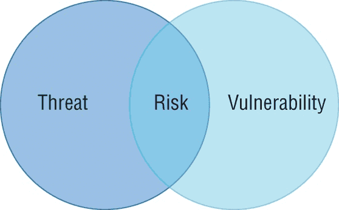
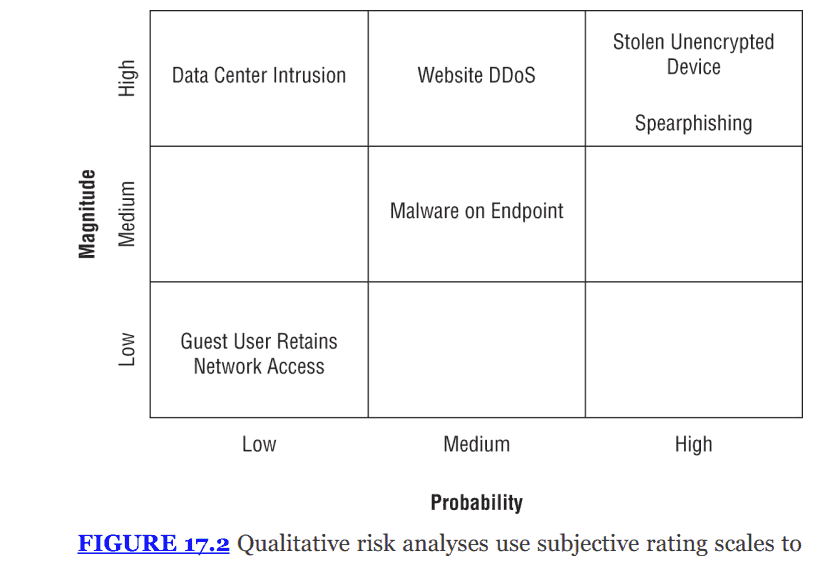
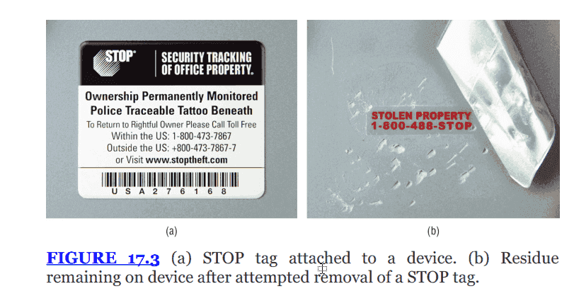
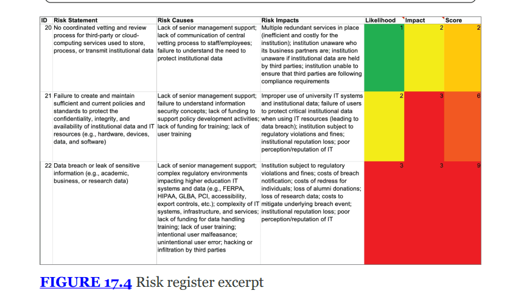
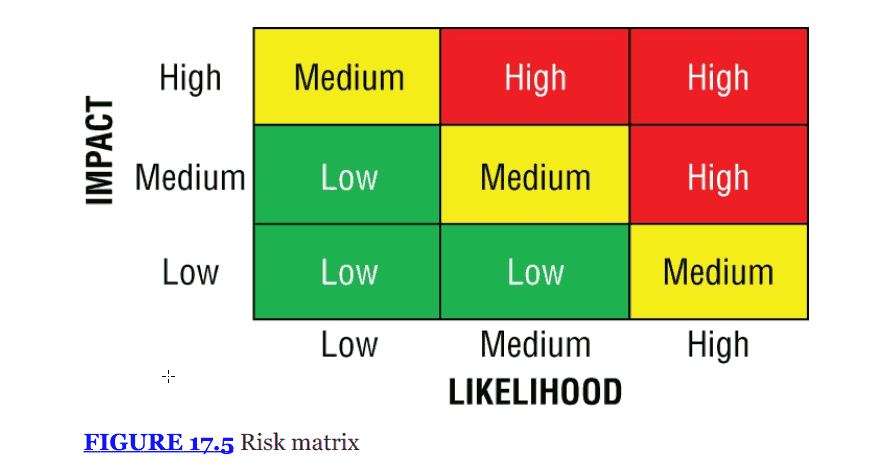
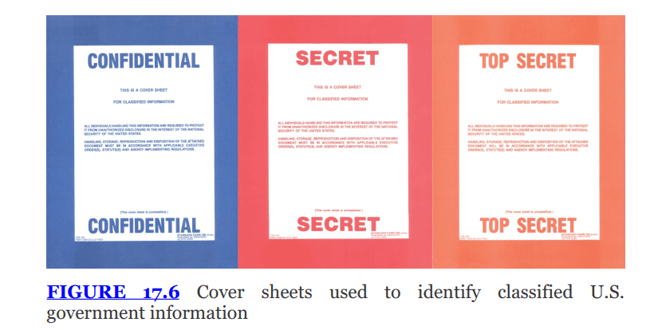

<!-- notion-metadata-start -->
*📅 Published: 2025-12-12 15:46 | 🔄 Last Updated: 2026-05-08 12:10*
<!-- notion-metadata-end -->
---


# THE COMPTIA SECURITY+ EXAM OBJECTIVES COVERED IN THIS CHAPTER INCLUDE: {#2c77b0eb61a480e79f85dc89651543fa}


## Domain 3.0: Security Architecture {#2c77b0eb61a4807b8f48faf0ee0d236b}


### 3.3. Compare and contrast concepts and strategies to protect data. {#2c77b0eb61a4804cace1ec2eabc44ad9}

- Data types (Regulated, Trade secret, Intellectual property, Legal information, Financial information, Human- and non-human-readable)
- Data classifications (Sensitive, Confidential, Public, Restricted, Private, Critical)

## Domain 5.0: Security Program Management and Oversight {#2c77b0eb61a48022a0ded3cc44585587}


### 5.1. Summarize elements of effective security governance. {#2c77b0eb61a480ae97a4c2973ab2d5ed}

- Roles and responsibilities for systems and data (Owners, Controllers, Processors, Custodians/stewards)

### 5.2. Explain elements of the risk management process. {#2c77b0eb61a480de8b86f9e12a26188b}

- Risk identification
- Risk assessment (Ad hoc, Recurring, One-time, Continuous)
- Risk analysis (Qualitative, Quantitative, Single loss expectancy (SLE), Annualized loss expectancy (ALE), Annualized rate of occurrence (ARO), Probability, Likelihood, Exposure factor, Impact)
- Risk Register (Key risk indicators, Risk owners, Risk threshold)
- Risk tolerance
- Risk appetite (Expansionary, Conservative, Neutral)
- Risk management strategies (Transfer, Accept, (Exemption, Exception), Avoid, Mitigate)
- Risk reporting
- Business impact analysis (Recovery time objective (RTO), Recovery point objective (RPO), Mean time to repair (MTTR), Mean time between failures (MTBF))

### 5.4. Summarize elements of effective security compliance. {#2c77b0eb61a480709983dbd1bca63d6f}

- Privacy (Legal implications, (Local/regional, National, Global), Data subject, Controller vs. processor, Ownership, Data inventory and retention, Right to be forgotten)

---


## Analyzing risk {#2c77b0eb61a480d78de7fd2505f610ac}


Trong chương trình quản lý rủi ro của doanh nghiệp (Enterprise risk managment), tổ chức phát hiện risk, phân loại dựa trên severity, từ đó adopt nhiều strategies risk management.


Trước khi đi vào quá trình risk assessment, ta cần phân biệt rõ một số khái niệm:

- Threats: một sự kiện có thể gây hại cho CIA của hệ thống. VD: hacker, bão lũ, mã độc
- Vulnerability: điểm yếu trong hệ thống hoặc trong các controls mà threat có thể đe dọa. Vd: tường lửa mở, phần mềm chưa patched, không có bảo vệ vật lý
- Risk: là intersection giữa threats và vulnerabilities
	- Nếu có threat mà không có vulnerability thì không có rủi ro ngược lại cũng đúng
	- Vd: Một máy chủ mở cổng SSH (port 22) ra internet là một _Vulnerability_. Kẻ tấn công dùng công cụ dò quét là một _Threat_. Sự kết hợp của cả hai tạo nên _Risk_ bị tấn công brute-force.




## Risk identification {#2c77b0eb61a480f4a3c8cd32657b2be5}


Xác định rủi ro đến từ đâu:

- External risk: từ hacker, mã độc, thảm họa thiên nhiên
- Internal risk: nhân viên là insider threat, vô tình làm sai, hỏng hóc thiết bị
- Multiparty risks: Ảnh hưởng đến nhiều tổ chức cùng lúc (ví dụ: mất điện toàn khu vực, hoặc nhà cung cấp dịch vụ đám mây SaaS bị tấn công làm ảnh hưởng đến mọi khách hàng của họ).
- Legacy systems: rủi ro từ phần mềm/hệ thống cũ
- Intellectual property (IP) theft: rủi ro mất cắp trade secret
- Software complaince/licensing: rủi ro pháp lý khi vi phạm bản quyền phần mềm

## Risk assessment {#2c77b0eb61a480689877c07d60a0febc}


Sau khi nhận diện ta đánh giá mức độ nghiêm trọng của risk dựa trên 2 yếu tố:

- Likelihood: xác suất xảy ra tính theo phần trăm
- Impact: mức độ thiệt hại, tính bằng tiền hoặc mức độ ảnh hưởng

Công thức:


```json
RiskSeverity = Likelihood * Impact
```


Công thức này không được tính theo nghĩa đen, hãy nghĩ nó như việc kết hợp giưa likelihood và impact để xác định severity of risk


### Risk assessment methods {#2c77b0eb61a48008b555ebfa13c83cb6}

- One-time risk: đánh giá tại một point-in-time, thường khi bắt đầu dự án hoặc sau một sự cố
- Ad hoc risk assessment: thực hiện khi có sự kiện phát sinh (sáp nhập công ty, thay đổi công nghệ). Làm xong là thôi
- Recurring risk assessment: được lên lịch đều đặn (quý/năm) để theo dõi sự thay đổi của rủi ro theo thời gian
- Continuous risk assessment: theo dõi thời gian thực, thường sử dụng hệ thống tự động để quét mối đe dọa liên tục, giúp phản ứng nhanh nhất

## Risk analysis {#2c77b0eb61a4804cb022cd88f771b312}


Sau khi đánh giá, tiến hành phân tích cụ thể risk. Chia thành 2 loại:

- Quantitative risk analysis: sử dụng dữ liệu số, ra assessment cụ thể
- Qualitative risk analysis: nhiều rủi ro rất khó để quy đổi ra tiền (uy tín, danh dự, tinh thần nhân viên)

### Quantitative risk analysis {#2c77b0eb61a480648925f1f2cef2334f}


Gồm các biến số sau:

- Asset value (AV): giá trị tài sản (tính bằng tiền)
- Exposure Factor (EF): tỉ lệ phần trăm tài sản bị mất đi khi rủi ro xảy ra (cháy kho hàng làm hỏng 50% hàng hóa → Exposure factor: 0.5)
- Single loss expectancy (SLE): số tiền mất đi trong một lần xảy ra sự cố:

```json
SLE = AV * EF
```

- Annualized Rate of occurrence (ARO): số lần rủi ro dự kiến xảy ra trong 1 năm
	- Nếu 2 lần: ARO = 2
	- Nếu 2 năm một lần ARO = 0.5
- Annualized Loss Expectancy (ALE): ⇒ ALE = ARO * SLE (ALE là tiền)

Ví dụ thực tế:

- Tình huống: tấn công DoS vào Email server
- AV: server tạo ra doanh thu $1000 mỗi giờ
- Sự kiện: tấn công kéo dài 3h → giá trị tài sản bị ảnh hưởng trong 3h là $3000
- Mức độ ảnh hưởng: DoS làm giảm 90% khả năng hoạt động → EF = 0.9
- SLE = $3000 * 0.9 = $2700
- ARO: dự kiến một năm bị 3 lần = 3
- ALE tổng thiệt hại năm = 2700 * 3 = $8100

**Ý nghĩa:** Con số **`ALE $8,100`** giúp bạn ra quyết định. Nếu chi phí mua thiết bị chống DoS là $10,000/năm (lớn hơn $8,100), thì về mặt tài chính là **không đáng** để đầu tư (lỗ vốn).


### Quanlitative risk analysis {#2c77b0eb61a480859f92f2d444c2dfe5}


Nhiều rủi ro rất khó quy đổi ra tiền nên phải định tính

- Sử dụng phán đoán chủ quan (subjective judgment) của chuyên gia
- Sử dụng thang đo: Low, Medium, High
- Công cụ: risk matrix
	- trục tung: magnitude (tác động)
	- trục hoành: probability (khả năng)
	- Ví dụ: Stolen unencypted device nằm ở ô high probability và high magnitude nên → rủi ro cực kỳ nghiêm trọng




:::tip

Risk assessment vs risk analysis
- Risk assessment là quá trình tổng thể, tổng thể sức khỏe an ninh của tổ chức như thế nào

- Risk analysis: chỉ là quá trình bên trong risk assessment, tính toán định tính, định lượng mức độ của risk

:::


## Supply chain assessment {#2c77b0eb61a4803cab01ddf22fc14d7a}


Rủi ro không chỉ đến từ nội bộ mà còn từ sản phẩm ta mua về

- Vendor due deligence: Cần thẩm định kĩ nhà cung cấp, đặc biệt CSP, vì họ nắm giữ nhiều thông tin nhạy cảm của tổ chức
- Hardware source authenticity
	- Rủi ro: phần cứng router, server có thể bị can thiệp trong quá trình vận chuyển
	- **Ví dụ thực tế:** Cựu nhân viên NSA Edward Snowden đã tiết lộ rằng chính phủ Mỹ từng chặn các lô hàng phần cứng xuất khẩu để cấy mã độc vào sâu trong thiết bị (firmware/chip) trước khi chúng đến tay khách hàng.
	- **Giải pháp:** Thực hiện đánh giá xác thực nguồn gốc để đảm bảo phần cứng nhận được là nguyên bản và chưa bị can thiệp.

## Risk management {#2c77b0eb61a4807da171ca323c3e102a}


Khi đã có một báo cáo phân tích risk hoàn chỉnh, công ty có thể tiếp tục address risk. Có 4 lựa chọn để xử lý


### Risk mitigation {#2c77b0eb61a480a58b2aec48f276709f}

- Áp dụng các biện pháp kiểm soát bảo mật để giảm bớt khả năng xảy ra (probability) hoặc magnitude của risk
- Là chiến lược phổ biến nhất. Công việc của chuyên gia bảo mật chủ yếu xoay quanh việc thiết kế và triển khai các biện pháp giảm thiểu này
- VD:
	- Rủi ro mất laptop: mua khóa cáp (cable locks) để giảm khả năng bị trộm. Hoặc sử dụng tem đăng ký chống tháo gỡ (STOP tags)
	- Với rủi ro tấn công DDoS: mua thêm băng thông hoặc dịch vụ giảm thiểu DDoS từ bên thứ 3 để hệ thống có thể chịu được tấn công mà không sập




### Risk avoidance {#2c77b0eb61a4809ca8d8dfbb9089faff}

- Thay đổi hoạt động kinh doanh để loại bỏ hoàn toàn khả năng rủi ro xảy ra
- Nhược điểm: thường gây ảnh hưởng tiêu cực lớn đến hoạt động kinh doanh
- VD:
	- Để tránh rủi ro mất laptop: cấm hoàn toàn nhân viên sử dụng laptop (không thực tế)
	- Để tránh rủi ro DDoS: đóng cửa website chuyển qua bán offline

### Risk transference {#2c77b0eb61a48051a570cbc81d8d563e}

- Chuyển gánh nặng của risk sang một thực thể khác (thường là bên bảo hiểm)
- VD: mua bảo hiểm an ninh mạng
	- Lưu ý: bảo hiểm tài sản thông thường có thể bù giá trị cái  laptop bị mất, nhưng thường loại trừ các rủi ro mạng như DDoS. Bạn cần mua gói bảo hiểm chuyên biệt (rider) để được đền bù thiệt hại

### Risk acceptance {#2c77b0eb61a4802b9732d43104a0aceb}

- Quyết định có chủ đích là không làm gì cả và tiếp tục hoạt động bình thường. Chia làm 2 loại
	- Passive acceptance: biết có rủi ro, không làm gì cả, nếu nó nổ ra thì tính sau
	- Active acceptance: biết có rủi ro, chấp nhận không sửa nhưng có contingency plan/money
		- Nghe có vẻ giống mitigation nhưng khác ở thời điểm và ý định:
			- mitigation chủ động can thiệp và lúc ban đầu khi phát hiện sự việc
			- contingency plan để phản ứng sau này để dọn dẹp chứ không phải đối phó
		- Nếu đề bài nói: _"Implement controls to reduce likelihood/impact"_ $\rightarrow$ Chọn **Mitigate**.
		- Nếu đề bài nói: _"Continue operation"_ VÀ _"Set aside funds / Create contingency plan"_ $\rightarrow$ Chọn **Accept** (Active Acceptance).
- Khi nào dùng: khi cost of mitigation lớn hơn loss (SLE, ALE) impact of the risk
- Cảnh báo: chấp nhận rủi ro không có nghĩa là phớt lờ nó. Nếu bạn nói "tôi chấp nhận rủi ro" chỉ vì lười phân tích, đó là **Unmanaged Risk** (Rủi ro không được quản lý), không phải Risk Acceptance.

**Cơ chế quản lý Risk Acceptance:**


Để quản lý việc chấp nhận rủi ro một cách chính quy, tổ chức sử dụng:

1. **Exceptions (Ngoại lệ):** Cho phép vi phạm chính sách trong trường hợp cụ thể nếu rủi ro được chấp nhận.
2. **Exemptions (Miễn trừ):** Tương tự ngoại lệ nhưng thường trang trọng hơn (**more formal**), yêu cầu cấp phê duyệt cao hơn, được ghi chép kỹ lưỡng và có ngày hết hạn (**expiration date**) để xem xét lại sau này.

## Risk tracking {#2c77b0eb61a4808d9018c9a442018b77}


Khi manage risk, bạn sẽ thực hiện các controls để mitigate risk. Một số state của risk đáng chú ý:

- Inherent risk:
	- Là rủi ro ban đầu trước khi triển khai bất kỳ biện pháp nào
	- VD: rủi ro mất cắp dữ liệu khi gửi email không mã hóa qua internet
- Residual risk:
	- Mức độ rủi ro sót lại sau khi áp dụng mitigate, tránh né, hoặc chuyển giao
	- Công thức: inherent risk - controls = residual risk
	- Sau khi giảm thiểu inherent risk thì residual risk có ở ngưỡng để thực hiện risk acceptance không?
- Risk appetite:
	- Mức độ rủi ro tổng thể mà tổ chức sẵn sàng chấp nhận
	- Nguyên tắc: chấp nhận rủi ro cao → lợi nhuận cao, thất bại lớn
- Risk tolerance: khả năng chịu đựng rủi ro mà không bị ảnh hưởng nghiêm trọng thường là range, deviation,…
- Risk threshold:
	- Cụ thể hơn risk appetite: là con số rõ ràng
	- Khi rủi ro vượt mức, nó không thể chấp nhận được và có hành động cụ thể được tiến hành
- Key Risk indicators (KRIs): là metrics để do lường và cung cấp cảnh báo sớm về việc risk gia tăng level, giúp kiểm tra hiệu quả của risk mitigation (tức là nằm trong risk appetite)
	- KPI (key performance indicators): đo lường thành công
	- KRI: đo lường nguy cơ (sắp sập server chưa)
- Risk owner: cá nhân hoặc thực thể có trách nhiệm kiểm soát và theo dõi risk, bao gồm cả việc thực hiện những controls and actions để mitigate nó
	- Giám đốc kinh doanh, giám đốc sản phẩm

### Types of risk appetite {#2c77b0eb61a48030a16dc0b232933fdb}

- Expansionary risk appetites:
	- Sẵn sàng chấp nhận rủi ro cao đổi lấy phần thưởng lớn
	- Thường thấy ở công ty muốn tăng trưởng nóng, đổi mới sáng tạo (start up)
- Neutral risk appetites: cân bằng
- Conservative risk appetite:
	- Tránh né rủi ro, tập trung vào ổn định và bảo vệ tài sản vốn có
	- Ưu tiên an ninh hơn tăng trưởng: ngân hàng, y tế

## Risk tracking tools {#2c77b0eb61a4802abd12cdb890e882e1}


Để track rủi ro, các chuyên gia sử dụng 


### Risk register {#2c77b0eb61a48015b0baecc1c454e80e}

- Là công cụ chính để theo dõi rủi ro
- Là tài liệu dài, chứa chi tiết về từng rủi ro cụ thể
- Các thành phần bắt buộc:
	- Risk owner
	- Risk threshold
	- Key risk indicators (KRIs)

	


### Risk matrix/heatmap {#2c77b0eb61a4801ead20f1be88d968f7}

- Vì Risk Register quá chi tiết đối với lãnh đạo cấp cao, ta dùng **Risk Matrix** để báo cáo.
- Nó tóm tắt rủi ro một cách trực quan bằng màu sắc (Xanh - Vàng - Đỏ) dựa trên 2 trục: **Likelihood** (Khả năng) và **Impact** (Tác động).
- Giúp lãnh đạo nhanh chóng tập trung vào các rủi ro quan trọng nhất (vùng màu đỏ).




## Risk reporting {#2c77b0eb61a4809fabcde15db73ed4bb}


Báo cáo cần được tailored cho phù hợp với người đọc (lãnh đạo, kỹ thuật). Các hình thức báo cáo gồm:

- Regular updates: báo cáo định kỳ về trạng thái rủi ro và hiệu quả kiểm soát
- Dashboard reporting: sử dụng biểu đồ trực quan, cập nhật realtime để theo dõi chỉ số chính
- Ad hoc report: báo cáo đột xuất
- Risk trend analysis: phân tích dữ liệu lịch sử để nắm pattern hoặc xu hướng theo thời gian
- Risk Event reports: tài liệu hóa các sự kiện rủi ro cụ thể đã xảy ra gồm tác động, cách giải quyết

## Disaster recovery planning {#2c77b0eb61a480f8aac5ce88d8cae898}


Khi biện pháp kiểm soát thất bại và thảm họa xảy ra, tổ chức cần có kế hoạch để phục hồi - Disaster recovery planning (DRP) 

- Mục tiêu: khôi phục hoạt động bình thường nhanh nhất

### Disaster types {#2c77b0eb61a480fa921eef4eca8da690}

- Thiên tai: bão, lụt
- Con người: tấn công mạng, lỗi cấu hình
- Insider threat

### Business impact analysis (BIA) {#2c77b0eb61a4807193f0d60814a7dae6}

- Là quy trình chính thức để xác định các chức năng kinh doanh thiết yếu (mission-essential functions) và các hệ thống quan trọng hỗ trợ chúng
	- Các hệ thống critical
- 4 chỉ số quan trọng
	- Mean time between failures (MTBF): đo lường độ tin cậy. Là thời gian trung bình giữa các lần hỏng hóc. Vd: ổ cứng chạy trung bình 5 năm mới hỏng 1 lần
	- Mean time to repair (MTTR): thời gian trung bình để sửa chữa hệ thống
	- Recovery time objective (RTO): thời gian ngừng hoạt động tối đa mà tổ chức có thể chấp nhận được (maximum tolerable downtime - MTD), tức là RTO < MTD. Nếu sửa lâu hơn RTO→ thiệt hại
		- RTO+WRT(work recovery time) ≤MTD
	- **Recovery Point Objective (RPO):** Lượng dữ liệu tối đa mà tổ chức chấp nhận bị mất (tính theo thời gian). Ví dụ: RPO là 4 giờ nghĩa là bạn phải backup dữ liệu ít nhất 4 giờ/lần. Nếu mất điện, bạn chỉ mất tối đa 4 giờ dữ liệu làm việc.
- SPOF:
	- Là bất kỳ thành phần nào (thiết bị, dịch vụ) mà nếu nó hỏng, toàn bộ hệ thống sẽ ngừng hoạt động.
	- **Ví dụ:** Một server chỉ có 1 nguồn điện (power supply).
	- **Giải pháp:** Bổ sung sự dư thừa (**Redundancy**). Ví dụ: Thêm nguồn điện thứ 2, hoặc thêm server thứ 2 vào cụm cluster.

## Privacy {#2c77b0eb61a480cfa9e5e843a1ffc8c8}


### Privacy risks {#2c77b0eb61a480daae36fae206c80f32}

- Chuyên gia bảo mật phải bảo vệ PII (personally identifiable information)
- Vi phạm PII dẫn đến identity theft cho cá nhân và thiệt hại danh tiếng/pháp lý cho tổ chức

### Data inventory {#2c77b0eb61a480a1a187c090dcad2ab5}


Bước đầu tiên bảo vệ dữ liệu là phải biết mình đang có những loại dữ liệu nào, gồm những loại chính sau đây:

- PII: định danh cá nhân (tên, số cmnd/cccd)
- PHI (Protected health information): hồ sơ y tế (tuân thủ HIPAA)
- Financial info: hồ sơ tài chính (tuân thủ, GLBA, PCI DSS)
- IP (intellectual property): trade secret, công thức, mã nguồn đã copyright
- Legal info: hồ sơ pháp lý liên quan tới tố tụng, hợp đồng hoặc quản trị công ty,…
- Regulated info: bất kỳ dữ liệu nào bị quản lý bởi pháp luật

**Lưu ý quan trọng (Exam Note):** Khi kiểm kê, phải tính cả dữ liệu mà con người không đọc được (**non-human-readable**), ví dụ như các file dữ liệu định dạng nhị phân (**binary format**). Dù không đọc được bằng mắt thường, nếu chứa PII, nó vẫn là PII.


Trade secret: thường là Intellectual property, được bảo vệ, bí mật, có giá trị kinh tế


## Information classification {#2c77b0eb61a4806091b7e17d9c9fbb9f}


### Government/military model {#2c77b0eb61a4809cb767cea42bc414b8}

- Top secret: lộ lọt gây exceptionally grave damage
- Secret: serious damage
- Confidential: gây damage
- Unclassified: không cần phân loại bảo mật nhưng không công khai

	


### Business model {#2c77b0eb61a48081ae8fc7eed560161f}


Doanh nghiệp không có chuẩn chung, nhưng dùng:

- Public, private, sensitive, confidential, critical, restricted
- Tùy công ty định nghĩa những từ này khác nhau

## Data roles and responsibilities {#2c77b0eb61a4802e9ad5e346555238ea}


Lưu ý các data privacy roles sau:

- Data owner:
	- Lãnh đạo cấp cao, người chịu trách nhiệm cuối cùng về dữ liệu đó. VP of sales là owner của dữ liệu khách hàng
	- Họ hiểu rõ nhất tác động kinh doanh
		- quyết định quyền truy cập, nhưng quyền delegate quyền kĩ thuật cho người khác
		- Phân loại dữ liệu (gán nhãn dữ liệu)
		- Xác định các yêu cầu bảo mật
- Data controller:
	- Dùng trong GDPR
	- Thực thể quyết định reasons và methods xử lý thông tin cá nhân - tương đương data owner nhưng mang tính pháp lý
		- Pháp lý - quyết định why và how (mục đích) của data cần xử lý
		- Legislation roles so với operational role của data owner
- Data processor:
	- Là bên dịch vụ cung cấp xử lý thông tin thay mặt cho data controller
	- VD: công ty bán lẻ (controller) thuê một công ty dịch vụ tính lương (processor) để trả lương cho nhân viên
- Data stewards (quản gia): thực hiện ý định của data controller/owner. Ủy quyền trách nhiệm quản lý hàng ngày
	- Carry out the data use and security policies (which is created by data owner)
- Data protection officer (DPO - cán bộ bảo vệ dữ liệu):
	- Vai trò bắt buộc trong GDPR
	- Là người chịu trách nhiệm tổng thể về nỗ lực bảo mật quyền riêng tư, hoạt động độc lập để giám sát tuân thủ.
	- the autonomy to carry out their responsibilities without undue oversight.
- **Data Subject (Chủ thể dữ liệu):**
	- Là cá nhân mà dữ liệu đó nói về (khách hàng, nhân viên).
- Data custodians: là những cá nhân, team không có quyền controller, stewardship nhưng có trách nhiệm bảo đảm bảo an toàn cho thông tin
	- Thường là nhân viên kỹ thuật IT, system admin
	- VD: data controller muốn ủy quyền bảo vệ PII cho một team security - custodians

Nếu oversee dữ liệu trong vòng đời của nó là hoạt động của tập thể


## Information life cycle {#2c77b0eb61a48093bcc7e9ef7805a050}


Bảo vệ dữ liệu phải xuyên suốt vòng đời thông tin từ khi nó sinh ra đến khi bị hủy bỏ

- Data minimization: chỉ thu thập lượng thông tin nhỏ nhất cần thiết, ko cần thì ko thu
- Purpose limitation: chỉ sử dụng thông tin cho mục đích ban đầu được chủ thể đồng ý
- Right to be forgotten:
	- Theo GDPR, cá nhân có yêu cầu xóa dữ liệu ủa họ nếu dữ liệu không còn cần thiết hoặc họ rút sự đồng ý
	- Thách thức: rất khó thực hiện, xóa mọi backups
- Data retention (lưu trữ):
	- Giữ dữ liệu trong bao lâu
	- Nguyên tắc: chỉ giữ khi còn cần, phải securely destroyed
	- Giảm lượng dữ liệu lưu trữ là một cách tuyệt vời để **giảm thiểu rủi ro bảo mật** (ít dữ liệu hơn = ít thứ để bị trộm hơn).

## Privacy enhancing technologies {#2c77b0eb61a480008948d862495140ec}


Quy trình làm mờ dữ liệu (data obfuscation) được thực hiện khi không thể xóa dữ liệu, bên cạnh deidentification (phi định danh )

- Hashing:
- Tokenization:
	- Thay dữ liệu nhạy cảm bằng mã ngẫu nhiên và có bảng lookup table
	- **Ứng dụng phổ biến:** Trong thanh toán thẻ tín dụng. Số thẻ thật được lưu trong kho an toàn (vault), còn hệ thống bán hàng chỉ lưu Token. Nếu hacker hack hệ thống bán hàng, họ chỉ lấy được các Token vô nghĩa.
- Data masking:
	- **Cơ chế:** Thay thế một phần dữ liệu nhạy cảm bằng các ký tự vô nghĩa (như dấu `X` hoặc ).
	- **Ví dụ:** Chỉ hiển thị 4 số cuối của thẻ tín dụng (`XXXX-XXXX-XXXX-1234`) trên biên lai thanh toán.

## Privacy and data breach notification {#2c77b0eb61a480c09c0ef4839cf9ba12}


Khi xảy ra sự cố lộ lọt dữ liệu (**Data Breach**), tổ chức phải kích hoạt ngay kế hoạch ứng phó sự cố. Tuy nhiên, vấn đề pháp lý ở đây rất phức tạp:

- **Tại Mỹ:** Không có một luật liên bang chung. Thay vào đó là luật của 50 tiểu bang khác nhau với các yêu cầu khác nhau về thời gian và cách thức thông báo.
- **Tại Châu Âu (GDPR):** Có quy định nghiêm ngặt về việc thông báo cho cơ quan chức năng trong vòng 72 giờ.
- **Lời khuyên:** Do sự chồng chéo phức tạp của các quy định pháp lý (**overlapping requirements**), tổ chức bắt buộc phải tham vấn luật sư (**attorney**) chuyên về lĩnh vực này khi xử lý vi phạm.

## Exam Essentials  {#2c77b0eb61a480eb9758f676c60cd95c}

1. **Risk Identification & Assessment (Nhận diện & Đánh giá):** Giúp tổ chức ưu tiên nỗ lực bảo mật. Rủi ro là giao điểm của **Threat** (Mối đe dọa) và **Vulnerability** (Lỗ hổng).
2. **Risk Analysis (Phân tích):**
	- **Quantitative (Định lượng):** Dùng con số tiền tệ. Nhớ công thức: **SLE = AV * EF** và **ALE = SLE * ARO**.
	- **Qualitative (Định tính):** Dùng thang đo (Low/Med/High) và phán đoán chủ quan.
3. **4 Risk Management Strategies (4 Chiến lược quản lý rủi ro):**
	- **Mitigation:** Giảm thiểu (Cài firewall, antivirus).
	- **Avoidance:** Tránh né (Ngừng hoạt động rủi ro).
	- **Transference:** Chuyển giao (Mua bảo hiểm).
	- **Acceptance:** Chấp nhận (Khi chi phí sửa chữa > giá trị tài sản).
4. **Vendor Risk (Rủi ro nhà cung cấp):** Cần thực hiện Due Diligence (Thẩm định), đánh giá chuỗi cung ứng và xác thực nguồn gốc phần cứng để tránh bị cấy mã độc.
5. **Change Management (Quản lý thay đổi):** Mục tiêu chính là tránh gây ra sự cố ngừng hoạt động (**outages**) do thay đổi tùy tiện.
6. **Privacy & Data Life Cycle:** Bảo vệ dữ liệu từ lúc thu thập (Minimization) -&gt; Sử dụng (Purpose limitation) -&gt; Lưu trữ -&gt; Hủy bỏ (Destruction/Sanitization).
