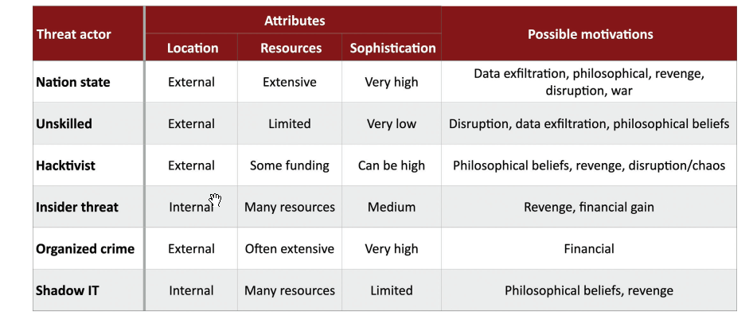
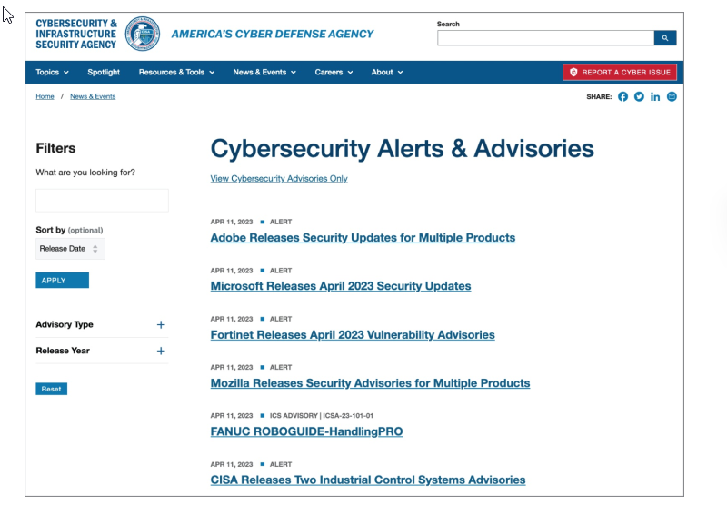

---


# THE COMPTIA SECURITY+ EXAM OBJECTIVES COVERED IN THIS CHAPTER INCLUDE: {#2b67b0eb61a480bfa060cace7a57fd03}


## Domain 2.0: Threats, Vulnerabilities, and Mitigations {#2b67b0eb61a480f99d67da6e2468ccbc}


2.1. Compare and contrast common threat actors and motivations.

- Threat actors (Nation-state, Unskilled attacker, Hacktivist, Insider threat, Organized crime, Shadow IT)
- Attributes of actors (Internal/external, Resources/funding, Level of sophistication/capability)
- Motivations (Data exfiltration, Espionage, Service disruption, Blackmail, Financial gain, Philosophical/political beliefs, Ethical, Revenge, Disruption/chaos, War)

2.2. Explain common threat vectors and attack surfaces.

- Message-based (Email, Short Message Service (SMS), Instant messaging (IM))
- Image-based
- File-based
- Voice call
- Removable device
- Vulnerable software (Client-based vs. agentless)
- Unsupported systems and applications
- Unsecure networks (Wireless, Wired, Bluetooth)
- Open service ports
- Default credentials
- Supply chain (Managed service providers (MSPs), Vendors, Suppliers)

2.3. Explain various types of vulnerabilities.

- Supply chain (Service provider, Hardware provider,
- Software provider)
- Zero-day

## Domain 4.0: Security Operations {#2b67b0eb61a480a68979f4fce87b7d17}


4.3. Explain various activities associated with vulnerability management.

- Identification methods (Threat feed, Open-source intelligence (OSINT), Proprietary/third-party, Information-sharing organization, Dark web)

## Exploring cybersecurity threats {#2b67b0eb61a4800fb613eb2bd2845801}


## Classifying Cybersecurity Threats {#2b67b0eb61a480f8ae2cd95a096c96d7}


Trước khi vào phân loại thì các loại threats sẽ có các attributes:

- Internal vs external:
	- Nhân viên vs người ngoài: hacker, đối thủ
- Level of sophistication/capability: trải rộng từ mức độ thấp đến mức cực cao (tự nghiên cứu lỗ hổng mới)
- Resources/Funding:
	- Nguồn lực vô tận (chính phủ/tổ chức tội phạm)
	- Một số chỉ là hobbyist
- Intent/motivation:
	- Unskilled attacker: tìm cảm giác thrill
	- Competitors: gián điệp doanh nghiệp (corporate espionage)
	- Nation-states: mục tiêu chính trị
	- Organized crime: lợi ích tài chính

---


### The hats hacker wear {#2b67b0eb61a480f59cccc02a64abe7d6}

- Authorized attackers (white-hat):
	- Hành động được cho phép, để tìm lỗ hổng và sửa chữa
	- Người làm pentest
- Unauthorized (black hat): ý đồ xấu, trục lợi
- Semi-authorized (gray hat): xâm nhập hệ thống không được phép nhưng không phải ý đồ xấu, họ vẫn bị khởi tố

## Threat actors {#2b67b0eb61a480289760e446c2548781}


Gồm 6 loại đối tượng chính


Unskilled → hacktivists → organized → nation-state /→ insider → shadow IT → competitors


### Unskiled attackers: script kiddie {#2b67b0eb61a4801f972dddbea1e76569}

- Sử dụng công cụ tải từ internet, kiến thức hạn chế
- Công cụ dễ kiếm và miễn phí
- Số lượng đông đảo và không chọn lọc, ai dính thì    tấn công
- Motivation: muốn chứng tỏ kĩ năng
- Resources: thấp

### Hacktivists: hack để đạt mục tiêu chính trị hoặc xã hội(activist)  {#2b67b0eb61a48084902bdab2ca520421}

- Tin rằng đang làm việc chính nghĩa (crusade), nên khó dùng deterent, coi việc bị bắt là huy chương danh dự
- Kĩ năng: dao động từ nghiệp dư tới chuyên gia
- Tổ chức: thường nặc danh, phân tán, không có lãnh đạo tập trung (anonymous)
- Mục tiêu: Deface website, tấn công tổ chức đi ngược lại quan điểm của họ
- Ví dụ: Edward Snowden tiết lộ mật của NSA

### Organized crime: {#2b67b0eb61a4801cb743dafd5e05fbae}

- Mục đích: tiền
- Đặc điểm:
	- Không quan tâm chính trị hay thể hiện
	- Muốn hoạt động âm thầm
	- có nguồn lực mạnh, kỹ năng từ trung bình đến cao
- Các hoạt động: Ransomeware, lừa đảo thẻ tín dụng, buôn bán trên darkweb, khiêu dâm trẻ em,…

### Nation-state Attackers:  {#2b67b0eb61a48036a5aaea42770a15b5}

- Thuật ngữ: advanced persistent threats
- Đặc điểm: đẳng cấp cao, lâu dài, và nguồn lực vô hạn
- Motivation: Gián điệp chính trị, hoặc đánh cắp tài sản trí tuệ

---


:::tip

APT thường dùng năng lực phát hiện các lỗ hổng Zero-day attacks: tấn công vào lỗ hổng mà nhà sản xuất chưa biết
Ví dụ điển hình: **Stuxnet** (sâu máy tính tấn công lò phản ứng hạt nhân của Iran, được cho là do Mỹ và Israel tạo ra).


:::


---


### Insider threats {#2b67b0eb61a4808c819be523f79404df}

- Nhân viên, nhà thầu, đối tác có quyền truy cập hệ thống hợp pháp
- Lợi thế: có sẵn quyền truy cập và kiến thức về hệ thống
- Motivation: bất mãn, tham tiền, lý do chính trị
- Phòng chống: phối hợp giữa Cybersec và HR

:::tip

The threat of shadow IT
- Nhân viên tự sử dụng các phần mềm/thiết bị không được phê duyệt (DropBox cá nhân để lưu file công việc)

- Thường không có ý đồ xấu

- Rủi ro: dữ liệu nhạy cảm lộ ngoài tầm của tổ chức

:::


### Competitors {#2b67b0eb61a48061abcff4e4873756ca}

- **Hành động:** Gián điệp doanh nghiệp (_corporate espionage_).
- **Mục tiêu:** Đánh cắp thông tin khách hàng, mã nguồn phần mềm (_proprietary software_), hoặc kế hoạch phát triển sản phẩm để giành lợi thế kinh doanh.
- Bán trên darkweb

:::tip

**Tóm tắt nhanh cho kỳ thi:**
- Thấy "Political/Social cause" -> Chọn **Hacktivist**.

- Thấy "Financial gain" + "Criminal" -> Chọn **Organized Crime**.

- Thấy "Sophisticated" + "Government" + "Long-term" -> Chọn **APT / Nation-state**.

- Thấy "Authorized access" -> Chọn **Insider**.

- Thấy "Automated tools" + "Low skill" -> Chọn **Script Kiddie**.

:::





## Attacker movivations {#2b67b0eb61a480a9a17ef52f7a98b0c3}

- Data exfiltration: đánh cắp dữ liệu nhạy cảm hoặc tài sản trí tuệ
- Espionage: gián điệp cho quốc gia hoặc tổ chức
- Service disruption: đánh sập hoặc gián đoạn hệ thống quan trọng (ngân hàng, bệnh viện)
- Blackmail: tống tiền
- Financial gain: organized crime
- Philosophical/political belief: động cơ của hacktivists
- Ethical: white-hat
- Revenge: thường là nhân viên cũ
- Disruption/chaos: chỉ đơn giản là muốn gây hỗn loạn
- War

**Exam Note:** Bạn rất có thể sẽ gặp câu hỏi yêu cầu so sánh các **Threat actors** (tác nhân đe dọa). Hãy nhớ kỹ thuộc tính và động cơ của từng loại (ví dụ: APTs thì kiên trì, Script Kiddie thì thiếu kỹ năng, Organized Crime thì vì tiền).


## Threat vectors and attack surfaces {#2b67b0eb61a48047bb1af36729f29812}


Là 2 khái niệm quan trọng:

- Attack surfaces: là tổng hợp tất cả các hệ thống, ứng dụng, dịch vụ đang chứa vulnerabilities mà kẻ tấn công có thể khai thác. Mục tiêu của chúng ta là giảm attack surface → những cái hở ra đó để hacker tấn công
- Threat vectors: là con đường, phương tiện (means) mà kẻ tấn công sử dụng để khai thác lỗ hổng đó

### Message-based threat vectors {#2b67b0eb61a480fd86d7c7e980e431cc}

- Email: phổ biến nhất - phishing: chỉ cần một người sơ hở là tấn công thành công dù 99 người khác có cảnh giác đi chăng nữa
- SMS&IM: tin nhắn văn bản hoặc ứng dụng chat
- Voice: vishing
- Social media

### Wired networks {#2b67b0eb61a48088886fc1302b18130e}

- Tấn công vật lý vào sảnh chờ, phòng họp khách hàng và cắm laptop vào các network jacks trên tường không được bảo mật
- Họ cũng tìm các thiết bị computer terminal để truy cập
- Bất kỳ khi nào kẻ tấn công chạm được vào thiết bị vật lý coi như thiết bị đó đã bị xâm phạm (compromised)

### Wireless network {#2b67b0eb61a48011bb3afb331076c38a}

- Dễ tấn công hơn có dây
- Bluetooth
- Wifi không bảo mật hoặc cấu hình kém cũng bị rủi ro

### Systems {#2b67b0eb61a4803c9f6cf77f18054d06}

- Các hệ thống cấu hình sai, phần mềm legacy, mở service ports không cần thiết đều là vector tấn công
- Mật khẩu mặc định cũng là lỗi sơ đẳng rất phổ biến

### Files and images {#2b67b0eb61a4801d8f5eeef8692fb103}

- Embedded malicious code vào file văn bản hoặc hình ảnh → người dùng mở
- Hacker giấu mã độc trong file ảnh, đặc biệt dưới dạng SVG (scalable vector graphic) vì thực chất nó là code XML, hoặc chèn mã JavaScript vào ảnh

### Removable devices {#2b67b0eb61a4800f8155d2a3243f328a}

- Phổ biến nhất là USB
- Chúng ném ngoài bãi cỏ, căng tin, chỗ gửi xe, người dùng tò mò về cắm máy
- Có phương thức là giả USB kết nối máy tính giả làm bàn phím: USB rubber ducky
	- Ngay khi được cắm vào, thiết bị này sẽ "gõ" các dòng lệnh độc hại với tốc độ siêu phàm (nhanh hơn con người gõ hàng nghìn lần).
	- Các dòng lệnh này sẽ mở cửa sổ Command Prompt/PowerShell, tải malware về và cài đặt chỉ trong vài giây.

### Cloud {#2b67b0eb61a480e3822bf647a4d3b06e}

- Kẻ tấn công quét các dịch vụ cloud phổ biến để tìm file bị phân quyền sai
- Tìm các API keys và mật khẩu bị vô tình công khai

### Supply chain  {#2b67b0eb61a480158390d02f2b012a47}

- Là kiểu tấn công tinh vi, thay vì tấn công bạn (bảo mật rất tốt) thì nó tấn công nhà cung cấp (có thể bảo mật không bằng)
	- Hardware: can thiệp thiết bị trong quá trình vận chuyển
		- Năm 2022, Cục An ninh nội địa Mỹ đã bắt giữ một CEO của công ty phân phối thiết bị mạng vì mua hàng Trung Quốc dán nhãn Cisco bán cho bệnh viện, quân đội
	- Software: chèn backdoors vào phần mềm trong quá trình cập nhật phần mềm chính thức
		- Vụ SolarWinds (2020): hacker xâm nhập vào quy trình xây dựng phần mềm của hãng và chèn mã độc vào bản cập nhật phần mềm: 18.000 khách hàng, bao gồm: Lầu năm góc, Bộ ngoại giao, Intel, Cisco,… tự tay tải bản cập nhật nhiễm độc
	- MSPs (message service providers): xâm nhập vào công ty cung cấp dịch vụ IT để nhảy sang hệ thống của khách hàng
		- Ví dụ như tạo một kết nối với doanh nghiệp khác, doanh nghiệp bạn có thể bị risk là supply chain attack
		- Năm 2013, Target bị hacker xâm nhập từ công ty nhỏ chuyên sửa chữa điều hòa (công ty này có tài khoản VPN kết nối từ xa vào hệ thống của Target để bảo trì điều hòa) và đánh cắp 40 triệu thẻ tín dụng
- **Exam Note:** Hãy sẵn sàng để xác định và giải thích các **Common threat vectors** và **Attack surfaces**. **Giải pháp:** Quản lý nhà cung cấp chặt chẽ (_Strong vendor management practices_) giúp phát hiện sớm các vấn đề này.

:::tip

**Tóm tắt nhanh cho bạn:**
Bạn cần hình dung bức tranh như sau:
1. **Attacker:** (Script kiddie, APT, Insider...)

2. **Motivation:** (Tiền, Trả thù, Gián điệp...)

3. **Attack Surface:** (Cổng mạng hở, Wifi yếu, Nhân viên ngây thơ...)

4. **Threat Vector:** (Gửi Email Phishing, Cắm USB độc, Leo qua lỗ hổng Cloud...)

:::


| **Tình huống**    | **Attack Surface (Cái bị hở ra / Điểm yếu)**                                                              | **Threat Vector (Phương tiện / Con đường tấn công)**                                                     |
| ----------------- | --------------------------------------------------------------------------------------------------------- | -------------------------------------------------------------------------------------------------------- |
| **Email**         | **Hộp thư (Inbox) và Người dùng (User)**<br/>_(Vì người dùng có thể bấm nhầm, hộp thư nhận mọi email)_    | **Phishing Email / Spam messages**<br/>_(Email lừa đảo chứa link hoặc file đính kèm)_                    |
| **Wireless**      | **Sóng Wifi hoặc Bluetooth**<br/>_(Đang phát sóng ra bãi đỗ xe mà cấu hình bảo mật kém)_                  | **Laptop của Hacker ngồi ngoài bãi xe**<br/>_(Dùng thiết bị bắt sóng để kết nối vào)_                    |
| **USB**           | **Cổng cắm USB trên máy tính**<br/>_(Cổng này đang mở, cho phép nhận thiết bị ngoại vi)_                  | **Malicious USB Drive**<br/>_(Chiếc USB chứa mã độc mà hacker vứt ở bãi xe)_                             |
| **Wired Network** | **Cổng mạng (Network Jack) trên tường**<br/>_(Nằm ở phòng chờ, sảnh lobby chưa bị ngắt)_                  | **Dây cáp mạng & Laptop của Hacker**<br/>_(Hacker cắm dây vào cổng đó)_                                  |
| **Cloud**         | **File lưu trên Cloud / API Keys**<br/>_(Đang bị cấu hình quyền truy cập sai - Improper access controls)_ | **Script quét tự động (Automated Scanning)**<br/>_(Hacker dùng tool quét tìm file hở để tải về)_         |
| **Supply Chain**  | **Phần cứng/Phần mềm nhập từ đối tác**<br/>_(Bạn tin tưởng sử dụng nó trong hệ thống của mình)_           | **Tampering (Can thiệp/Chỉnh sửa)**<br/>_(Hacker cài backdoor vào thiết bị ngay tại nhà máy sản xuất)_   |
| **Files/Images**  | **Trình xem ảnh/văn bản (PDF Reader/Word)**<br/>_(Phần mềm này có thể có lỗ hổng khi xử lý file)_         | **File ảnh/văn bản chứa mã độc (Embedded malicious code)**<br/>_(File được gửi đến để kích hoạt mã độc)_ |


---


Xét ví dụ hệ thống mạng của bạn là một tòa nhà

- **Attack Surface (Bề mặt tấn công):** Là tất cả những chỗ có thể chui vào được.
	- Cửa sổ mở.
	- Cửa chính không khóa.
	- Ống khói.
	- Người giúp việc (nhân viên) có chìa khóa.
	- _Mục tiêu của bạn:_ Đóng cửa sổ, khóa cửa chính -> **Giảm thiểu Attack Surface**.
- **Threat Vector (Vectơ):** Là cách kẻ trộm đi vào qua các chỗ đó.
	- Ném hòn đá buộc thư dọa nạt qua cửa sổ (Vector là hòn đá).
	- Dùng thanh kim loại để cạy cửa chính (Vector là thanh kim loại).
	- Đu dây thừng xuống ống khói (Vector là dây thừng).
	- Giả danh thợ sửa điện để lừa người giúp việc mở cửa (Vector là Social Engineering).

:::tip

Hacker phải thấy được attack surface thì chúng mới tìm cách truy cập bằng threat vector
**Exam Tip:**
- Nếu đề bài hỏi về "Open ports", "Unpatched software", "Employees" -> Đó là **Attack Surface**.

- Nếu đề bài hỏi về "Phishing", "USB drop", "Vishing", "SQL Injection script" -> Đó là **Threat Vector - trông như kĩ thuật**

:::


## Threat data and intelligence {#2b77b0eb61a4809db28cd58bc1684fcd}

- Threat intelligence: Là tập hợp các hoạt động và nguồn lực giúp chuyên gia bảo mật hiểu về những thay đổi trong threat environment
- Mục đích:
	- Xây dựng hệ thống phòng thủ phù hợp (appropriate defenses)
	- Sử dụng cho predictive analysis để nhận diện rủi ro với tổ chức
- Threat feed: là nguồn dữ liệu được cập nhật real-time từ nhà cung cấp (cisco talos, palo alto unit 42,….), cung cấp thông tin up-to-date detail, gồm:
	- IP addresses, hostnames, domains, URLs
	- Email add
	- files hashes (bản băm của file độc hại)
	- Common vulnerability and exposures (CVE) records
	- Indicators of compromise (IoCs): là những dấu hiệu nhận biết (telltale signs) cho thấy một cuộc tấn công đã hoặc đang diễn ra (ví dụ: nhật ký file, mẫu log)

## Sources of threat intelligence {#2b77b0eb61a480988e57f4cc1ab07668}


### Open source intelligence {#2b77b0eb61a480b095f9d1c00c43b4ff}

- Định nghĩa: thông tin tình báo được thu thập từ những nguồn công khai, khổng lồ, miễn phí
- Các nguồn threats nổi tiếng:
	- Senki.org: cung cấp feed miễn phí
	- Open threat exchange (OTX): vận hành bởi AT&T, là cộng đồng chia sẻ threat lớn toàn cầu
	- MISP threat sharing project: dự án mã nguồn mở giúp chuẩn hóa việc chia sẻ dữ liệu đe dọa
	- Threatfeeds.io: danh sách các feed mã nguồn mở
- Vendor websites: các hãng bảo mật lớn thường công bố thông tin nghiên cứu:
	- Microsoft’s threat intelligence blog
	- Cisco security advisories (talos intelligence): cung cấp thông tin nghiên cứu và công cụ tra cứu danh tiếng (reputation lookup tool)
- Public sources:
	- SANS internet storm center: theo dõi các cơn bão mạng
	- VirusTotal: cơ sở dữ liệu khổng lồ về malware (quan trọng để check hash file)
	- Spamhaus project: tập trung vào danh sách chặn (blocklists) như spam, máy tính bị nhiễm botnet, tên miền độc hại
- Government sites:
	- CISA(U.S. Cybersecurity & Infrastructure Agency): Cơ quan an ninh mạng Mỹ)”
	- AIS (automated indicator sharing): chương trình chia sẻ chỉ số tự động của CISA
	- Các cơ quan của quốc gia khác như Cybersec centre của Úc (cyber.gov.au)

	


### The dark web {#2b77b0eb61a4809692f3f3c719fad473}

- Hacker thường dùng dark web để chia sẻ công cụ và bán dữ liệu đánh cắp (stolen credentials)
- Các đội threat intelligence cần giám sát dark web để xem:
	- Tài khoản của công ty mình có bị rao bán không
	- Sự xuất hiện đột ngột của dữ liệu công ty trên đó là dấu hiệu của một vụ tấn công thành công
- Công cụ truy cập tor browser

### Proprietary and closed-source intelligence {#2b77b0eb61a4804182acef989bb75dee}

- Là nguồn trả phí
- Tại sao phải mua?
	- Các hãng có công cụ tùy chỉnh, mô hình phân tích riêng và nguồn tin bí mật (trade secrets)
	- Họ cung cấp dữ liệu được chọn lọc kỹ (curate), giúp giảm bớt việc tự lọc từ OSINT (open source -intel)

## Assessing threat intelligence {#2b77b0eb61a480f8a73bf0ca74c1b7fa}


:::tip

### Câu chuyện: when a threat feed fails

TÌnh huống: một nhà cung cấp hứa update feed liên tục, nhưng thực tế họ cập nhật chậm hơn thị trường. Khi một lỗ hổng Microsoft nghiêm trọng ra đời, mã khai thác có sau 48h nhưng nhà cung cấp này mất hơn 2 tuần mới đưa ra phát hiện → hệ thống khách hàng bị  hiểm

→ cần kiểm tra chéo nhiều nguồn (multiple feeds) để đảm bảo tốc độ phản ứng

:::


Cách đánh giá thông tin tình báo:

- Timely: kịp thời không. Nếu không kịp thời thì có biết cũng vô dụng
- Accurate: chính xác
- Relevant: liên quan

### Threat maps {#2b77b0eb61a4802984f2f31c5f6c71fa}

- Cung cấp cái nhìn trực quan theo địa lý. Ví dụ: check point cyber threat map
- Lưu ý: hãy skeptical, do threat maps chưa chắc đã chính xác
- Vì kẻ tấn công thường đi qua nhiều lớp cloud, VPN, hoặc máy tính bị hack ở nước ngoài để che giấu vị trí thật.

### Confidence levels {#2b77b0eb61a4800f8cd8fca10d3516eb}


Người ta dùng confidence score để xem thông tin chắc chắn tới đâu

1. Confirmed (90-100): đã xác nhận, có nguồn hoặc phân tích chứng minh mối đe dọa là thật
2. Probable (70-89): có khả năng cao. Dựa trên suy luận logic (logical inference) nhưng chưa xác nhận trực tiếp
3. Possible (50-69): có thể. Một số thông tin khớp với phân tích, nhưng chưa được xác nhận
4. Doubtful (30-49): đáng ngờ. Có khả năng nhưng không phải là lựa chọn hợp lý nhất, hoặc chưa thể chứng minh/bác bỏ
5. Improbable (2-29): khó xảy ra. Có khả năng nhưng mâu thuẫn với thông tin khác hoặc không logic
6. Discredited (1): Bác bỏ. Đã được xác nhận là không chính xác.

---


**Tóm tắt cho kỳ thi:**

- Hiểu rõ **OSINT** là gì và các ví dụ (VirusTotal, CISA...).
- Hiểu **IoCs** là gì (IP, Hash, Domain...).
- Nắm vững 3 tiêu chí đánh giá: **Timeliness, Accuracy, Relevance**.
- Nhớ kỹ thang đo **Confidence Levels** (Confirmed -&gt; Discredited).
- Không tin tưởng mù quáng vào **Threat Maps** về mặt vị trí địa lý.

## Threat indicator management and exchange {#2b77b0eb61a480c1bd15f78bdf0df005}


(Quản lý và trao đổi chỉ số đe dọa)


Để chia sẻ thông tin về mối đe dọa thì các tổ chức hoặc phần mềm phải có tiếng nói chung (standadization).


2 tiêu chuẩn cần nhớ


### STIX (Structured threat information expression) {#2b77b0eb61a480318276f35bc2778456}

- Định nghĩa: là ngôn ngữ định dạng chuẩn (ban đầu là XML, phiên bản 2.1 hiện tại dùng JSON) để mô tả thông tin đe dọa.
- Cấu trúc: STIX định nghĩa các domain objects như attack patterns, identities, malware, threat actors
- Mối quan hệ: các đối tượng này liên hệ với nhau qua relationship objects (vd: kẻ tấn công A sử dụng mã độc B)
- Ví dụ:

```json
{
"type": "threat-actor",
"created": "2019-10-20T19:17:05.000Z",
"modified": "2019-10-21T12:22:20.000Z",
"labels": [ "crime-syndicate"],
"name": "Evil Maid, Inc",
"description": "Threat actors with access to hotel rooms",
"aliases": ["Local USB threats"],
"goals": ["Gain physical access to devices", "Acquire data"],
"sophistication": "intermediate",
"resource:level": "government",
"primary_motivation": "organizational-gain"
}
```


### TAXII (trusted automated exchange of intelligence information) {#2b77b0eb61a480439457c152440abafa}

- Định nghĩa: Nếu STIX là gói thông tin thì TAXII là xe vận chuyển (giao thức vận chuyển)
- Cơ chế TAXII là giao thức tầng ứng dụng, hoạt động qua HTTPS. Được thiết kế chuyên biệt để hỗ trợ trao đổi dữ liệu STIX
- Tổ chức quản lý: Cả STIX và TAXII đều được quản lý bởi OASIS (tổ chức phi lợi nhuận quốc tế về tiêu chuẩn thông tin)\
- Coi như STIX là what, TAXII là how

You can read more about both STIX and TAXII in detail at the OASIS GitHub documentation site: https://www.oasisopen.github.io/cti-documentation.


## Conducting your own research {#2b77b0eb61a4804d8a89c1ac787e3b4b}


Bạn không thể chỉ ngồi chờ để có tin mà phải xây dựng bộ research toolkit của mình. Nguồn

- Vendor websites
- Vulnerability feeds
- Academic journals and RFCs
- Conferences: các hội nghị chuyên ngành
- Social media:

> Khi nghiên cứu hãy nhớ lưu s TTPs (tactics, techniques, and procedures) của đối thủ


## Summary {#2b77b0eb61a480fcb47fc8f14fbbd686}


Phần này tóm tắt lại toàn bộ kiến thức cốt lõi của chương về "Threat Landscape" (Bối cảnh đe dọa):

- Hiểu về kẻ tấn công giúp bạn đánh giá rủi ro và chọn **Controls** (biện pháp kiểm soát) phù hợp.
- Các mối đe dọa được phân loại dựa trên: _Internal/External_, _Sophistication_, _Resources_, và _Motivation_.
- Các hình thức tấn công đa dạng: Từ _Unskilled attackers_ (tìm cảm giác mạnh) đến _Nation-state actors_ (vũ khí quân sự/chính trị).
- Các vectơ tấn công phổ biến: _Email, Social media, Physical access, Supply chain, Network-based_.

## Exam essentials {#2b77b0eb61a480f18ce0d0eeba9aac90}

1. **Threat actors differ in several key attributes (Kẻ tấn công khác nhau ở các thuộc tính chính):**
	- Internal vs. External (Trong vs. Ngoài).
	- Sophistication/Capability (Độ tinh vi).
	- Resources/Funding (Nguồn lực/Tiền).
	- Motivation/Intent (Động cơ).
2. **Threat actors come from many different sources (Nguồn gốc kẻ tấn công):**
	- _Unskilled/Script kiddies_ (Dùng tool có sẵn).
	- _Nation-state/APTs_ (Tài trợ bởi chính phủ, kiên trì, kỹ thuật cao).
	- _Hacktivists_ (Động cơ chính trị/xã hội).
	- _Organized crime_ (Động cơ tài chính).
	- _Insiders_ (Nhân viên nội bộ).
	- _Shadow IT_ (Hệ thống không được phê duyệt).
3. **Attackers have varying motivations (Động cơ đa dạng):**
	- _Data exfiltration_ (Lấy dữ liệu).
	- _Espionage_ (Gián điệp).
	- _Service disruption_ (Phá hoại dịch vụ).
	- _Blackmail_ (Tống tiền).
	- _Financial gain_ (Tiền).
	- _Philosophical/Political beliefs_ (Niềm tin chính trị).
	- _Revenge_ (Trả thù).
	- _War_ (Chiến tranh).
4. **Attackers exploit different vectors (Khai thác các vectơ khác nhau):**
	- Internet (Remote), Wireless, Physical access.
	- Email/Social media (để lừa nhân viên).
	- Removable media (USB).
	- Cloud services.
	- Supply chain (Chuỗi cung ứng).
5. **Threat intelligence (Tình báo mối đe dọa):**
	- Cung cấp cái nhìn sâu sắc (_insight_).
	- Sử dụng **IoCs** (Indicators of Compromise) và **Predictive analytics** (Phân tích dự đoán).
	- Kết hợp cả nguồn _Open source_ và _Closed source_.
6. **Supply chain risks (Rủi ro chuỗi cung ứng):**
	- Doanh nghiệp hiện đại phụ thuộc vào phần cứng, phần mềm và dịch vụ Cloud của bên thứ ba.
	- Cần chú ý rủi ro từ: _Outsourced code development_ (thuê ngoài viết code), _Cloud data storage_, và sự tích hợp giữa hệ thống bên trong và bên ngoài.
