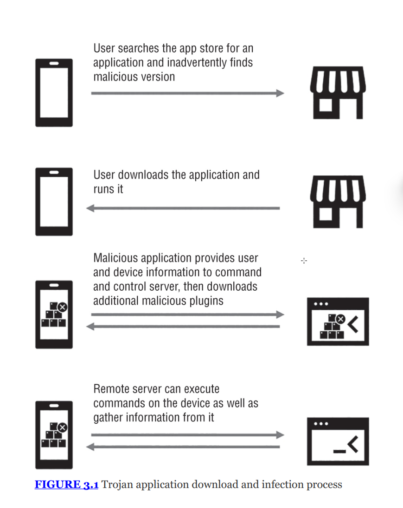
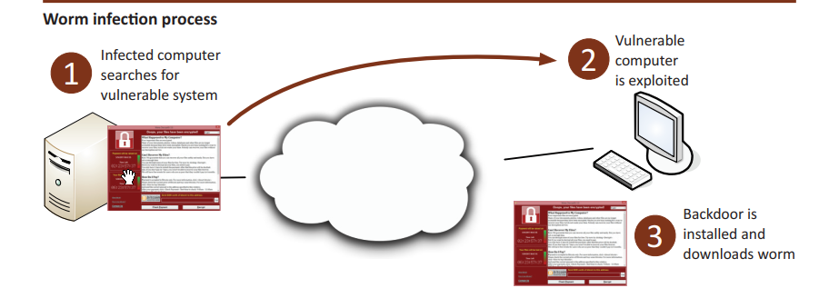
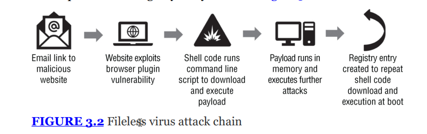
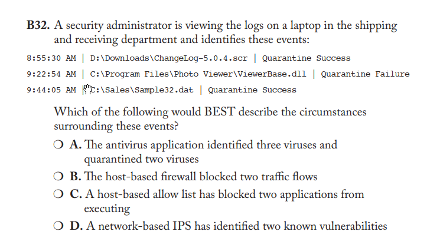

# THE COMPTIA SECURITY+ EXAM OBJECTIVES COVERED IN THIS CHAPTER INCLUDE: {#2b77b0eb61a480498381cd00470e9628}

## Domain 2.0: Threats, Vulnerabilities, and Mitigations {#2b77b0eb61a480b39922cef246601fe0}

2.4. Given a scenario, analyze indicators of malicious activity.

- Malware attacks (Ransomware, Trojan, Worm, Spyware, Bloatware, Virus, Keylogger, Logic bomb, Rootkit)

## Malware - malicious software {#2b77b0eb61a480c1ac2bdf5bba8c4176}

- Định nghĩa: malware là thuật ngữ chung chỉ các phần mềm được thiết kế có chủ đích để gây hại cho hệ thống, thiết bị, mạng hoặc người dùng
- Mục đích: thu thập thông tin bất hợp pháp, thực hiện các hành động mà chủ sở hữu hệ thống không mong muốn
- Các loại phổ biến:
	- Ransomware
	- Trojans
	- Worms
	- Spyware
	- Viruses
	- Keyloggers
	- Rootkits
	- Bloatware
	- Logic bombs
- Mục tiêu chính: kẻ tấn công thường dùng malware để duy trì quyền truy cập (retain access) vào hệ thống sau khi đã xâm nhập được chỗ đứng (foothold)

:::tip

Phân tích chỉ số indicators
- **Cách phân biệt:** Phải nắm rõ đặc điểm riêng biệt (_distinctive characteristics_).

- Hãy chú ý kỹ đến **Indicators of Compromise (IoCs)** liên quan đến từng loại.

:::

### Ransomware {#2b77b0eb61a4806798c0e28e70cfeda5}

Là loại mã độc tống tiền

- Crypto malware: là dạng phổ biến của ransomeware, hoạt động bằng cách mã hóa các file và giữ chúng làm con tin trước khi tiền chuộc được trả
- Các kỹ thuật tống tiền khác:
	- Đe dọa báo cảnh sát vì người dùng chứa phần mềm lậu hoặc nội dung khiêu dâm
	- Đe dọa công khai thông tin nhạy cảm hoặc ảnh nóng (sextortion/doxxing) lấy từ ổ cứng của nạn nhân
- Phương thức lây nhiễm:
	- Phổ biến nhất là qua Phishing
	- Tấn công trực tiếp qua Remote desktop protocol (RDP), vulnerable services, hoặc ứng dụng web

	:::tip
	
	Remote Desktop Protocol (RDP) and TeamViewer are both tools for remote access, but they differ significantly in their intended use cases, compatibility, and configuration requirements.
	- **RDP** is a **protocol** (built into Windows) that excels in Windows-only environments for professional, high-performance connections within a local network.
	
	- **TeamViewer** is a **third-party software** application designed for easy, cross-platform remote support over the internet, even through firewalls and NAT.
	
	:::
	
	

- IoCs của ransomware:
	1. C&C traffic: lưu lượng kết nối đến máy chủ điều khiển (command & control) hoặc các IP độc hại đã biết

		:::tip
		
		Một ví dụ về cuộc tấn công sử dụng máy chủ chỉ huy và kiểm soát C&C Server là cuộc tấn công WannaCry vào tháng 5 năm 2017. WannaCry đã sử dụng một loại phần mềm độc hại ransomware khai thác lỗ hổng trong Windows để lây nhiễm, mã hóa và phá hủy các tệp trên hệ thống của nạn nhân. Phần mềm độc hại được cho là đã “lan rộng” khắp thế giới, tấn công các tổ chức và cá nhân tại hơn 150 quốc gia.
		Khi WannaCry xâm nhập thành công vào hệ thống của nạn nhân, nó sẽ kết nối với máy chủ C&C để nhận lệnh và kiểm soát hệ thống của nạn nhân. Máy chủ C&C của WannaCry đã được cài đặt trên một địa chỉ IP bị lãng quên và được đăng ký với một công ty có tên “[iuqerfsodp9ifjaposdfjhgosurijfaewrwergwea.com](http://iuqerfsodp9ifjaposdfjhgosurijfaewrwergwea.com/)”.
		
		Sau khi các chuyên gia bảo mật phát hiện ra địa chỉ IP của máy chủ C&C của WannaCry, nó đã nhanh chóng bị chính phủ và các nhà cung cấp dịch vụ mạng chặn lại. Tuy nhiên, WannaCry vẫn tiếp tục lây lan và tấn công các hệ thống khác trên toàn thế giới.
		
		Cuộc tấn công WannaCry đã gây ra thiệt hại đáng kể cho nhiều tổ chức, cá nhân trên thế giới. Đây là một ví dụ kinh điển về cách các cuộc tấn công được thực hiện thông qua máy chủ C&C và cách C&C ảnh hưởng đến hệ thống mạng và dữ liệu người dùng.
		
		:::
		
		

	2. Abnormal use of legitimate tools: sử dụng công cụ hợp pháp theo cách bất thường để duy trì quyền kiểm soát
	3. Lateral movement: các process tìm cách tấn công hoặc lấy thông tin từ các hệ thống khác trong cùng mạng lưới
	4. Encryption of files: mã hóa đột ngột
	5. Ransom notes: thông báo đòi tiền chuộc ở màn hình
	6. Data exfiltration: hành vi trích xuất dữ liệu ra ngoài

	---

Cách ứng phó:

- Backups: sao lưu
- Decryption tools: một số loại ransomware đã bị giải mã
- Vấn đề trả tiền: tổ chức có thể cân nhắc vì có khi trả tiền xong đó vẫn khóa
- Cài EDR, XDR

### Trojans {#2b77b0eb61a480c9a0a3c96280960c34}

Là phần mềm ngụy trang dưới vỏ bọc một phần mềm hợp pháp

- Đặc điểm: dựa vào sự thiếu cảnh giác của người dùng để tự tay chạy chúng
- Quy trình lây nhiễm:
	1. Người dùng tìm kiếm ứng dụng trên app store, vô tình thấy phiên bản giả
	2. Người dùng tải về và chạy nó
	3. Ứng dụng độc hại gửi thông tin thiết bị về máy chủ C&C, sau đó tải thêm các plugin độc hại khác. Plug-in giống như add on hoặc extension ví dụ như:
		1. Adobe flash player
		2. java runtime environemtnt
		3. PDF reader plugin

		Plugin thường nguy hiểm vì ít được cập nhật

	4. Máy chủ từ xa có thể thực thi lệnh trên thiết bị hoặc thu thập dữ liệu

	

:::tip

**Ví dụ thực tế - Triada Trojan:**
- Phân phối dưới dạng phiên bản **WhatsApp** đã sửa đổi (mod) với nhiều tính năng nâng cao.

- Khi chạy, nó thu thập Device ID, địa chỉ phần cứng để đăng ký với máy chủ từ xa.

- Sau đó nó tải payload về để hiển thị quảng cáo hoặc tự động đăng ký các dịch vụ trả phí (_paid subscriptions_).

:::

[https://securelist.com/triada-trojan-in-whatsapp-mod/103679/](https://securelist.com/triada-trojan-in-whatsapp-mod/103679/)

[https://securelist.com/malicious-whatsapp-mod-distributed-through-legitimate-apps/107690/](https://securelist.com/malicious-whatsapp-mod-distributed-through-legitimate-apps/107690/)

---

IoCs của trojans

- Signature: chữ ký số của file hoặc ứng dụng độc hại
- C&C connection: kết nối đến IP hoặc hostname lạ
- Unexpected files & folders

---

Remote acess trojans (RATs)

- Là loại trojan cung cấp cho kẻ tấn công quyền truy cập từ xa vào hệ thống
- Thách thức: các công cụ từ xa hợp pháp như (teamviewer, anyDesk,..) cũng có thể bị kẻ tấn công sử dụng như RATs. Gây khó khăn cho phát hiện, dễ gây false positive
- Mitigations:
	- Security awareness training: đào tạo người dùng không tải phần mềm không tin cậy
	- Antimalware/EDR (endpoint detection and response): các công cụ phát hiên hành vi giống RAT
	- Kiểm soát phần mềm: giới hạn quyền cài đặt ứng dụng của user

---

Về backdoor:

- Liên quan đến rootkits, RATs và supply chain attacks
- là một cơ chế Cung cấp quyền truy cập cho kẻ tấn công mà không cần truy cập qua cửa chính
- 2 nguồn gốc backdoor:
	- Developer backdoors: vô tình hoặc cố ý nhưng không ác ý
		- Các lập trình viên thường tạo ra các tài khoản bí mật hoặc đoạn code debug để truy cập nhanh hệ thống mà không cần đăng nhập phức tạp mà khi release quên xóa.
		- **Ví dụ:** Một thiết bị Router wifi có tài khoản mặc định được nhúng cứng trong code (_hardcoded credentials_) là `user: support / pass: admin123` mà người dùng không thể đổi được. Hacker phát hiện ra điều này và dùng nó để xâm nhập hàng loạt thiết bị.\
	- Malicious backdoors: Được tạo ra bởi rootkits, trojan (RATs) hoặc worms
		- Mục đích để duy trì quyền truy cập
			- _Kịch bản:_ Hacker tấn công thành công lần đầu (qua Phishing). Họ biết rằng quản trị viên có thể sẽ đổi mật khẩu hoặc vá lỗ hổng. Vì vậy, họ cài ngay một Backdoor (ví dụ: mở một cổng mạng bí mật, tạo một user ẩn). Lần sau, dù quản trị viên có đổi mật khẩu, Hacker vẫn vào được qua Backdoor này.
		- **Ví dụ:** Hacker dùng Trojan để mở cổng 4444 trên máy chủ. Hacker chỉ cần kết nối vào cổng 4444 là có quyền điều khiển dòng lệnh (CMD/Shell) mà không cần đăng nhập.

		Cơ chế của Backdoor rất đa dạng:

		1. **Mở cổng mạng (Opening Ports):** Malware lắng nghe trên một cổng lạ (ví dụ 12345).
		2. **Reverse Shell/Tunnel:** Như tôi đã giải thích ở phần trước, Backdoor chủ động kết nối ra ngoài máy chủ của hacker để vượt qua Firewall.
		3. **Account Manipulation:** Tạo ra một user mới tên là "Service_Update" và gán quyền Admin, rồi ẩn user này khỏi màn hình đăng nhập.
		4. **Web Shell:** Hacker upload một file script nhỏ (ví dụ `backdoor.php`) lên web server. Bất cứ khi nào hacker truy cập đường link `website.com/backdoor.php?cmd=...`, họ có thể chạy lệnh trên server.

		Backdoor trong Supply Chain (Chuỗi cung ứng)

		Trong phần **Supply Chain** của chương 2, sách có nhắc đến việc **Tampering** (can thiệp).

		- Kẻ tấn công (thường là APTs/Nation-state) chặn lô hàng thiết bị mạng (Router, Server) từ nhà máy.
		- Họ cấy chip gián điệp hoặc cài firmware đã bị sửa đổi có chứa Backdoor.
		- Khi khách hàng nhận máy về dùng, Backdoor đã nằm sẵn trong phần cứng/phần mềm cốt lõi. Đây là loại Backdoor khó phát hiện nhất.

		Cách phát hiện và phòng chống

		- **Code Review:** Để phát hiện Developer Backdoor (tìm các tài khoản hardcoded).
		- **Network Monitoring:** Giám sát lưu lượng mạng để tìm các kết nối lạ (Reverse tunnels) hoặc các cổng đang mở bất thường.
		- **File Integrity Monitoring:** Phát hiện xem các file hệ thống quan trọng có bị Rootkit thay đổi để tạo Backdoor hay không.
		- **Penetration Testing:** Thuê hacker mũ trắng thử tìm cách xâm nhập để phát hiện Backdoor bị bỏ quên.

---

:::tip

Nói thêm về Bots, botnets và C&C
- Bot: là một hệ thống máy tính bị nhiễm malware và chịu sự kiểm soát của kẻ tấn công

- Botnet: mạng lưới nhiều bot

- C&C: kỹ thuật và hệ thống máy chủ để kẻ tấn công ra lệnh cho botnet làm việc. Ví dụ: spam, DDOS

- Cách thức giao tiếp:

- Dấu hiệu nhận biết: hệ thống cố gắng kết nối ra ngoài đến các host không xác định

:::

- Giao thức IRC cổ điển, hoạt động trên cổng 6667
- **Cơ chế hoạt động:** Người dùng kết nối vào một máy chủ IRC, tham gia các "kênh" (channel/phòng chat) và gửi tin nhắn để mọi người trong phòng đều đọc được.

**Tại sao Hacker dùng IRC? (Liên quan đến Botnet):**

- Hacker sử dụng IRC để xây dựng hệ thống **C&C (Command and Control)** cho Botnet.
- _Quy trình:_ Hacker cài malware vào hàng nghìn máy tính (Bots). Các Bots này được lập trình để bí mật kết nối vào một phòng chat IRC cụ thể. Hacker chỉ cần gõ một lệnh vào phòng chat đó (ví dụ: "Tấn công IP X"), tất cả các Bots sẽ đọc được tin nhắn và thực hiện lệnh đồng loạt.
- Ngày nay, IRC ít được dùng hơn do dễ bị tường lửa phát hiện, hacker chuyển sang dùng HTTP/HTTPS (web traffic) để ẩn mình kỹ hơn.

### Worms {#2b77b0eb61a4807cbb8fc131584f3fdb}

Khác biệt với trojan là sâu có thể tự lây lan mà không cần người dùng mở

- Thường khai thác các lỗ hổng trên dịch vụ (vulnerable services) để tự động nhảy từ máy này sang máy khác, hoặc lây lan qua email (tự gửi email cho danh bạ)

Ví dụ về Stuxnet - nation-state-level worm attacks

- Stuxnet (2010): được công nhận rộng rãi là vũ khí mạng (cyber weapon) đầu tiên dưới dạng worm
- Mục tiêu: chương trình hạt nhân của Iran
- Cơ chế:
	- Tự sao chép vào USB (thumb drives) để vượt qua các hệ thống air-gapped (hệ thống tách biệt vật lý, không kết nối internet)
	- Sử dụng kĩ thuật tiên tiến: như trusted digital certification
	- Tìm kiếm các industrial control system (ICSs) để phá hủy các máy ly tâm (centrifuges), đồng thời gửi dữ liệu giả mạo báo cáo rằng mọi thứ vẫn bình thường
- Bài học: vì Stuxnet được thiết kế để vượt qua mạng vật lý, firewalls và network-level controls vẫn là cách tốt nhất để giảm thiểu worm. Nếu thiết bị bị xâm nhập và không thể giao tiếp với thiết bị khác, thì sự lây nhiễm sẽ không lan rộng

---

Worm hiện đại: rasberry robin

- Là worm, tiền trạm cho tấn công ransomware
- Lây nhiễm: ban đầu qua USB chứa file .LNK
- Cơ chế: sử dụng các công cụ có sẵn của windows (built-in windows tools) để thực hiện nhiệm vụ và duy trì sự tồn tại

Dấu hiệu nhận biết worm (IoCs):

- known malicious files
- tải xuống thành phần độc hại từ xa
- Kết nối C&C
- Hành vi độc hại sử dụng lệnh hệ thống (cmd, msiexe)
- Hoạt động tất công trực tiếp từ bàn phím

Cách mitigations:

- Dùng network-level control (firewalls, IPS, network segmentation)
- Patching: vá lỗi để chặn attack surfaces
- Sử dụng Antimalware và EDR (EDR, or Endpoint Detection and Response, is **a cybersecurity technology that uses software to continuously monitor endpoints like laptops, desktops, and mobile devices for threats**.)
- Removal: khó khăn, đôi khi phải cài lại firmware gốc

---

VD về lây nhiễm worm phục vụ wanna cry

- **Scan (Quét):** Máy tính đã bị nhiễm (Máy A) tự động quét mạng Internet để tìm các máy tính khác có lỗ hổng.
- **Exploit (Tấn công):** Khi tìm thấy máy tính nạn nhân (Máy B) có lỗ hổng, nó tấn công ngay lập tức.
- **Backdoor:** Nó cài một cửa hậu (backdoor) lên Máy B và tải bản thân nó sang Máy B. Máy B trở thành "zombie" mới và tiếp tục đi tấn công Máy C, D....

### Spyware {#2b77b0eb61a4803f84dacbae7e22d8a9}

- Định nghĩa: là malware được thiết kế để lấy cắp thông tin về cá nhân, tổ chức hoặc hệ thống
- Hành vi: theo dõi thói quen duyệt web, phần mềm đã cài đặt và gửi báo cáo về máy chủ trung tâm
- Các dạng spyware:
	- Identity theft and fraud: trộm danh tính và lừa đảo
	- Stalkerware: theo dõi bất hợp pháp
	- Commercialized spyware: ví dụ như Pegasus của NSO group (dùng để theo dõi mục tiêu cấp cao)
	- Adware: quảng cáo và điều hướng lượng truy cập
- IoCs của spyware:
	- Các chỉ số liên quan đến truy cập và điều khiển từ xa (remote-acess indicators)
	- Dấu vân tay của phần mềm đã biết (known software file fingerprints)
	- Các quy trình độc hại (malicious processes) ngụy trang thành quy trình hệ thống
	- injection attacks against browsers
- Phòng chống:
	- Anti-virus/malware
	- Biết mình đang install cái gì
	- Backup ở đâu

:::tip

### So sánh spyware vs bloatware

- Spyware mục đích chính là thu thập thông tin người dùng

- Bloatware: là chương trình rác (unwanted program)

:::

### Viruses {#2b77b0eb61a4801d9778c9afd6470295}

- Đặc điểm cốt lõi:
	- Tự sao chép và tự nhân bản khi được kích hoạt
	- Khác với worms: nó không tự lây lan một cách độc lập. Nó cần một cơ chế lây nhiễm như copy vào USB, file share và sự tương tác của con người/hệ thống để chạy
	- Nó cần dính vào một file gì đó, khi người dùng kích hoạt thì nó mới hoạt động
- Cấu trúc: thường có trigger (điều kiện kích hoạt) và payload (hành động phá hoại)
- Các loại virus:
	- _Memory-resident viruses:_ Thường trú trong bộ nhớ RAM.
	- _Non-memory-resident viruses:_ Chạy, lây lan xong thì tắt.
	- _Boot sector viruses:_ Nằm trong sector khởi động của ổ cứng.
	- _Macro viruses:_ Dùng macro trong Word/Excel.
	- _Email viruses:_ Lây qua tệp đính kèm.

---

- Về fileless virus:
	- Là dạng tấn công hiện đại, nguy hiểm
	- Cơ chế: không cần lưu file độc hại lên ổ cứng (no local file storage required)
	- Hoạt động:
		- Lây qua spam email hoặc web độc hại
		- Khai thác lỗ hổng trình duyệt/plugin
		- Tiêm mã trực tiếp vào bộ nhớ (memory resident)
		- Persistence: tạo một mục trong registry để tự động tải lại mã độc khi máy khởi động lại
	- Phòng chống: cập nhật trình duyệt, dùng altimalware để phát hiện hành vi kịch bản (ví dụ giám sát powershell), dùng IPS

		

Giải thích trong hình:

- bạn nhận một mai click vào link này
- Trang web có một đoạn mã ngắn để kiểm tra xem bạn có xài plugin cũ vulnerable không
- Nếu có thì nó tấn công. Bình thường thì trình duyệt không cho web chạy lệnh trên máy tính nhưng do plugin lỗi
- Sau đó hacker kích hoạt cmd, powershell để tải mã độc về, nó không lưu payload trên ổ cứng mà tải vào RAM, mã độc chạy hoàn toàn trên đây
- Sau đó để persistence thì nó tạo một registry và cứ chạy mỗi khi khởi động máy tính.

→ dấu vết: một lệnh trong registry

### Keylogger {#2b77b0eb61a480ffa4ded68f00b5ea76}

- Là malware ghi lại thao tác gõ phím, di chuột hoặc quẹt thẻ tín dụng, cũng là một loại spyware
- Mục đích: lấy cắp thông tin của người dùng để phân tích (thường là mật khẩu tin nhắn)
- Các dạng:
	- Software-based: phần mềm chạy ngầm, capture qua kernel, API
	- Hardware-based: thiết bị vật lý cắm vào cổng USB hoặc bàn phím. Rất rẻ và khó phát hiện bằng phần mềm (lưu ý về việc sinh viên dùng thiết bị này để trộm pass của giáo viên)
- Phòng chống: antimalware, nhưng quan trọng nhất là dùng Multifactore authentication (MFA), MFA không chặn được keylogger ghi lại pass nhưng làm cho cái pass đó vô dụng khi cần biện pháp xác thực thứ 2
- IoCs:
	- File hashes/signatures
	- Hoạt động trích xuất dữ liệu (exfiltration activity) về hệ thống C&C

### Logic bombs {#2b77b0eb61a480d19e8bcc1e6b31cae4}

- Không phải là chương trình độc lập, mà là một đoạn code chèn vào phần mềm khác
- Hoạt động: nằm in chờ đợi đến khi một điều kiện (set conditions) được kích hoạt. (ví dụ ngày giờ cụ thể, khi tên nhân viên bị xóa khỏi hệ thống lương)
- IoCs: rất hiếm và khó phát hiện, yêu cầu phân tích mã nguồn (code analysis)
- Cách phòng chống: change management, dùng phần mềm giám sát file

### Rootkits {#2b77b0eb61a480889afdddc374b9ce1a}

- Là malware được thiết kế đặc biệt để cho phép kẻ tấn công truy cập hệ thống qua backdoor và che giấy (conceal) sự hiện diện của chính nó
- Kỹ thuật:
	- Can thiệp sâu vào hệ điều hành (hooking filesystem drivers)
	- Lây nhiễm vào MBR để khởi động vào trước cả hệ điều hành
- Cách phát hiện: rất khó vì hệ điều hành đã bị nhiễm thì không còn đáng tin cậy
	- Cách tốt nhất: dùng một hệ thống tin cậy bên ngoài để kiểm tra: USB boot
- Lưu ý: một số phần mềm chống gian lận game (anti-cheating) hoặc DRM cũng dùng kỹ thuật giống rootkits, nhưng mục đích là khác nhau
- Migitation:
	- Sử dụng secure boot
	- Patching, privilege management
	- Removal: do độ phức tạp, khuyến nghị chung là cài lại hệ thống, hoặc backup
- IoCs:
	- File hashes/signatures
	- C&C domains, IP address, systems
	- Behavior-based identification: tạo service mới, exe, thay đổi cấu hình (config change), truy cập file, command mới
	- Ports mới mở hoặc tạo reverse proxy tunnels
		- Tường lửa thì chặn bên ngoài vào chứ không chặn bên trong ra
		- Malware khi nhiễm vào máy của nhân viên chủ động tạo một kết nối ra ngoài đến máy chủ của hacker
		- Sau khi kết nối được thiết lập thì hacker sử dụng kết nối này để chui ngược vào trong và gõ lệnh điều khiển
		- Reverse proxy là máy chủ trung gian nhận kết nối từ malware bên trong, giữ kết nối đó luôn mở cho hacker lợi dụng.
- Kỹ thuật phát hiện Rootkits:
	- Kỹ năng forensics:
	- Rootkit thường xâm nhập vào hệ điều hành và sử dụng các hooks để ẩn mình. Do đó, nếu bạn quét virus ngay trên hệ điều hành đang chạy, rootkit sẽ đánh lừa phần mềm diệt virus
	- Giải pháp: tháo ổ cứng ra và kết nối nó vào một hệ thống sạch khác. Khi đó hệ điều hành bị nhiễm sẽ không chạy, root kít không thể kích hoạt cơ chế ẩn mình và sẽ bị lộ diện

## Analyzing Malware (Phân tích mã độc) {#2b77b0eb61a480bc8292f402e0ac52b2}

- **Online analysis tools:** Như **VirusTotal** (check xem file đã bị các trình diệt virus khác phát hiện chưa).
- **Sandbox tools:** Chạy malware trong môi trường cách ly an toàn để xem hành vi của nó.
- **Manual code analysis:** Phân tích thủ công (đặc biệt với script Python, Perl).
- **Strings:** Công cụ tìm kiếm các chuỗi ký tự có thể đọc được trong file thực thi.

### Note on Removing Malware (Lưu ý về gỡ bỏ mã độc) {#2b77b0eb61a4802bb412e29fc270543c}

Sách đưa ra một thực tế quan trọng:

- Rất khó để đảm bảo 100% đã gỡ hết malware phức tạp.
- **Standard practice (Thực hành chuẩn):** Wipe the drive (Xóa sạch ổ cứng) và **Reinstall/Reimage** (Cài lại hệ điều hành) hoặc khôi phục từ bản Backup tốt đã biết. Đừng cố gắng "diệt" virus bằng phần mềm rồi dùng tiếp nếu đó là hệ thống quan trọng.

| **Loại thiết bị** | **Dữ liệu trong Log thường thấy**       | **Hành động (Action) thường thấy** |
| ----------------- | --------------------------------------- | ---------------------------------- |
| **Antivirus**     | `C:\Folder\File.exe` (File Path)        | **Quarantine**, Delete, Clean      |
| **Firewall**      | `Source IP: 10.0.0.1`, `Dest Port: 80`  | **Allow**, **Deny**, Drop          |
| **NIPS/NIDS**     | `Packet Payload`, `Protocol: TCP`       | **Alert**, **Reset Connection**    |
| **System/OS**     | `User: Administrator`, `Event ID: 4624` | **Login Success**, Audit Failure   |

### Lưu ý về phòng chống virus {#2dd7b0eb61a48027aa2dc51602b6b8d3}

**Vendor Diversity (Đa dạng hóa nhà cung cấp)** nhằm mục đích phòng thủ chiều sâu (Defense in Depth).

- Cài nhiều phần mềm để đảm bảo tránh bị lọt lổ hổng
- Nhưng không được cài nhiều diệt virus trên một endpoint
- Đa dạng bằng cách cài một antivirus ở PCs và một ở Server

---

- FIle `.scr` - screen saver, là một file thực thi giống .exe
	- Hacker sử dụng để đánh lừa người dùng
	- Có thể `D:\Downloads\ChangeLog-5.0.4.scr` người dùng tải về này từ mạng
- .dll là kẻ kí sinh: nó cần một chương trình để chạy (.exe)
	- **DLL Injection / Hijacking:** Hacker tạo ra một file `.dll` chứa mã độc, sau đó lừa một chương trình **hợp pháp** (như `notepad.exe` hay `PhotoViewer` trong log) chạy file này.
	- **Trốn tránh:** Vì file `.dll` này được chạy bởi một chương trình uy tín (đã được ký số bởi Microsoft), tường lửa và một số phần mềm bảo mật sẽ bị lừa và cho phép nó hoạt động.
	- Thằng này quarantine failure vì có một chương trình là Photo Viewer đang sử dụng nó (in use)
- `.dat` là file data, định dạng chung chung, có thể chứa bất cứ thứ gì: văn bản, video, game, mã nhị phân, không phải là file chạy được
	- **Obfuscation (Làm rối mã/Che giấu):** Để tránh bị Antivirus phát hiện, hacker xé nhỏ con virus ra.
		- Phần 1: Một file `.exe` rất nhỏ và sạch (Dropper/Loader).
		- Phần 2: Mã độc thực sự (Payload) được mã hóa và giấu trong file `.dat`.
	- **Quy trình:** Khi file `.exe` chạy, nó sẽ đọc file `.dat`, giải mã nó trong RAM và kích hoạt virus. Nếu Antivirus chỉ quét file trên ổ cứng, nó sẽ thấy file `.dat` chỉ là một cục dữ liệu vô nghĩa nên bỏ qua.

	**Trong log của bạn:** `C:\Sales\Sample32.dat`

	- File này có thể chứa dữ liệu bị đánh cắp đang chờ gửi đi, hoặc chứa cấu hình (config) của virus, hoặc là payload mã hóa chờ được kích hoạt.

## Summary {#2b77b0eb61a480d29108f8a0d093d873}

1. **Ransomware:** Mã hóa file (_encrypts files_) và giữ làm con tin để đòi tiền chuộc (thường là tiền ảo).
2. **Trojans:** Ngụy trang (_disguised_) giống như phần mềm hợp pháp nhưng thực hiện hành vi độc hại khi chạy.
3. **Worms:** Tự lây lan (_spread themselves_) qua mạng, dịch vụ lỗ hổng, email mà **không cần** người dùng tương tác.
4. **Viruses:** Tương tự Worm nhưng chỉ lây nhiễm cục bộ và **cần hành động của người dùng** (_require user action_) như chạy ứng dụng để kích hoạt.
5. **Spyware:** Thu thập thông tin (_gather information_) về người dùng/hệ thống và gửi về C&C server.
6. **Keyloggers:** Một dạng chuyên biệt của spyware, ghi lại thao tác bàn phím (_capture keystrokes_). Có cả dạng phần mềm và phần cứng.
7. **Rootkits:** Giúp kẻ tấn công duy trì quyền truy cập (_retain access_) và che giấu hành vi độc hại (_conceal malicious action_).
8. **Logic bombs:** Mã thực thi dưới một điều kiện cụ thể (_specific condition_). Cần xem xét mã nguồn (_reviewing source code_) để phát hiện.
9. **Bloatware:** Phần mềm rác cài sẵn bởi nhà sản xuất. Gây tốn tài nguyên và tạo thêm bề mặt tấn công (_attack surface_). Cách xử lý là gỡ bỏ (_uninstalling_).

**Vũ khí chống Malware:**

- Ngoài công cụ kỹ thuật (Antivirus, EDR, Patching), **Awareness** (Nhận thức bảo mật) là công cụ hiệu quả nhất. Nó giúp ngăn chặn tấn công xảy ra và hạn chế lỗi do con người (_human mistakes_).

## Exam essentials {#2b77b0eb61a4800b9b97c0732ca27b17}

### **A. Understand and explain the different types of malware (Hiểu và giải thích các loại malware)** {#2b77b0eb61a480d49788e4efb4ad50e1}

- Bạn phải phân biệt được các yếu tố đặc trưng (_distinctive elements_) của từng loại: Ransomware, Trojans, Worms, Spyware, Bloatware, Viruses, Keyloggers, Logic bombs, và Rootkits.
- Biết cách nhận diện (_identify_), biện pháp kiểm soát (_controls_), và cách xử lý khi gặp chúng.

### **B. Explain common indicators of malicious activity** {#2b77b0eb61a4805cba74e608d7b7cde8}

- IoCs thay đổi tùy theo loại malware.
- **Ví dụ IoCs phổ biến:**
	- Lưu lượng kết nối C&C (_C&C traffic patterns_).
	- IP, Hostnames, Domains lạ.
	- Sử dụng công cụ hệ thống theo cách bất thường (_unexpected ways_).
	- Di chuyển ngang hàng trong mạng (_Lateral movement_).
	- Tạo file/thư mục lạ.
	- Mã hóa file (_Encryption of files_).
	- Trích xuất dữ liệu (_Data exfiltration_).
- _Lưu ý:_ Chữ ký số (_Signatures_) vẫn được dùng, nhưng kẻ viết malware luôn tìm cách thay đổi để né tránh.

### **C. Understand the methods to mitigate malware** {#2b77b0eb61a4808fa36cc11053cda9eb}

