# THE COMPTIA SECURITY+ EXAM OBJECTIVES COVERED IN THIS CHAPTER INCLUDE: {#2b77b0eb61a480d8acc2d4c212f73ad5}


## Domain 4.0: Security Operations {#2b77b0eb61a48050a551e5a3e8e2e057}


4.3. Explain various activities associated with vulnerability management.

- Identification methods (Vulnerability scan, Penetration testing, Responsible disclosure program, Bug bounty program, System/process audit)
- Analysis (Confirmation, Prioritize, Common Vulnerability Scoring System (CVSS), Common Vulnerabilities and Exposures (CVE), Vulnerability classification, Exposure factor, Environmental variables, Industry/organizational impact, Risk tolerance)
- Vulnerability response and remediation (Patching, Insurance, Segmentation, Compensating controls, Exceptions and exemptions)
- Validation of remediation (Rescanning, Audit, Verification)
- Reporting

4.4. Explain security alerting and monitoring concepts and tools.

- Tools (Security Content Automation Protocol (SCAP), Vulnerability scanners)

4.8. Explain appropriate incident response activities.

- Threat hunting

## Domain 5.0: Security Program Management and Oversight {#2b77b0eb61a48036a22dca8caefd6657}


5.3. Explain processes associated with third-party risk assessment and management.

- Rules of engagement

5.5. Explain types and purposes of audits and assessments.

- Attestation
- Internal (Compliance, Audit committee, Selfassessments)
- External (Regulatory, Examinations, Assessment, Independent third-party audit)
- Penetration testing (Physical, Offensive, Defensive, Integrated, Known environment, Partially known environment, Unknown environment, Reconnaissance, Passive, Active)

## Vulnerability Management {#2b77b0eb61a48038b674eb0407c4521d}


Lỗ hổng mới thường xuyên, hàng ngày xuất hiện. Nên phải có cách để kiểm soát

- Vulnerability management program: là chương trình đóng vai trò thiết yếu trong việc xác định (identifying), ưu tiên (prioritizing), và khắc phục (remediating) các lỗ hổng
- VMP sử dụng Vulnerability scanning: là kĩ thuật sử dụng công cụ tự động để phát hiện lỗ hổng mới

### Identifying scan targets {#2b77b0eb61a480ddb1e9d8088a23fecd}

- Data classification: dữ liệu trên hệ thống thuộc loại gì (mật hay công khai)
- Exposure: hệ thống có tiếp xúc với internet không?
- Services: cung cấp dịch vụ gì
- Environment: môi trường production, test hay development

Asset inventory: quá trình quét giúp xây dựng kho tài sản thông tin. Bạn không thể bảo vệ nếu không biết mình có gì


Asset criticality: xác định xem hệ thống nào quan trọng nhất, để xác định thứ tự ưu tiên quét, vá lỗi


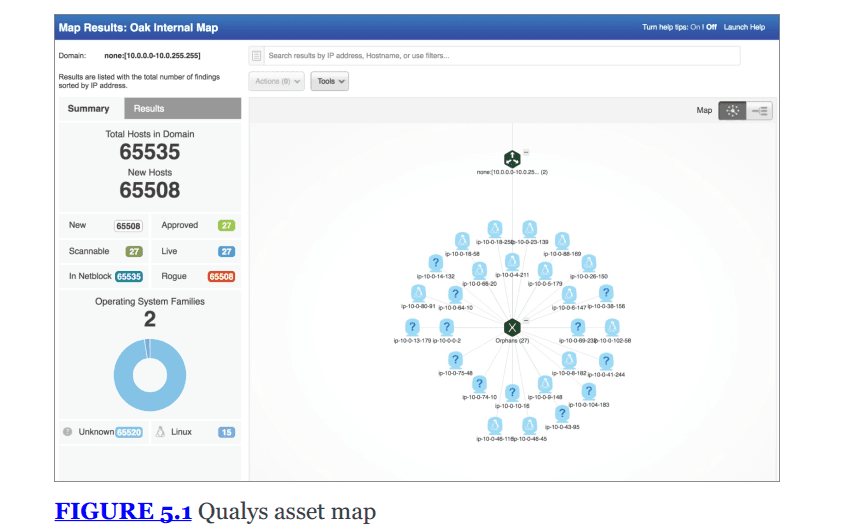


:::tip

Phần mềm Qualys - quản lý bảo mật và tuân thủ (security and compliance) đám mây
**Asset Discovery (Khám phá tài sản)**.
Admin bảo mật nhìn vào đây để trả lời câu hỏi: _"Mạng công ty mình đang có bao nhiêu máy? Có máy lạ nào cắm vào mạng (Rogue device) mà mình không biết hay không?"_

:::


### Determining scan frequency {#2b77b0eb61a4801ca79cfb9ef2a4015a}


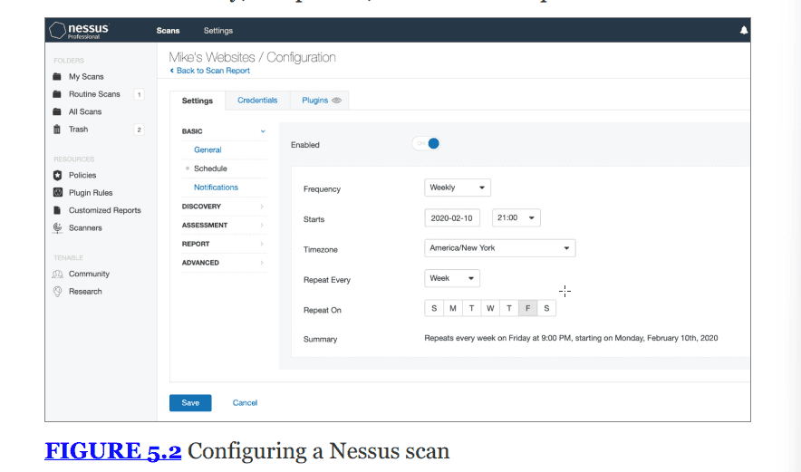

- Automation: quản trị viên nên lập lịch quét thay vì chạy tay
- Risk appetite: mức độ rủi ro mà tổ chức chấp nhận được
	- Nếu sợ thì quét thường xuyên hơn
- Regulatory requirements (yêu cầu pháp lý): các tiêu chuẩn như PDI DSS (thẻ thanh toán), hay FISMA (chính phủ Mỹ) quy định tần suất quét tối thiểu bắt buộc
- Technical constraints: giới hạn của hệ thống (máy quét chỉ chạy được số lượng nhất định mỗi ngày)
- Business constraints: tránh quét vào giờ cao điểm để không làm chậm hệ thống kinh doanh
- Licensing limitations: giấy phép phần mềm có giới hạn trên số lượng IP được quét

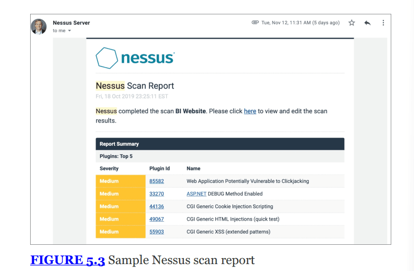


### Configuring vulnerability scans {#2b77b0eb61a480b39bf2ebdfd242bfc6}


Ngoài việc lập lịch thì còn phải biết cách quét như thế nào


### Scan sensivity levels {#2b77b0eb61a480aca31ad4ac13f4d9d8}

- Cần tùy chỉnh các loại kiểm tra (types of checks) để đảm bảo tìm ra lỗi nhưng giảm thiểu khả năng làm gián đoạn hệ thống mục tiêu
- Templates: Các công cụ như Nessus cung cấp sẵn các mẫu quét (scan templates) cho từng mục đích (vd: quét cơ bản, quét malware, quét tuân thủ PCI)

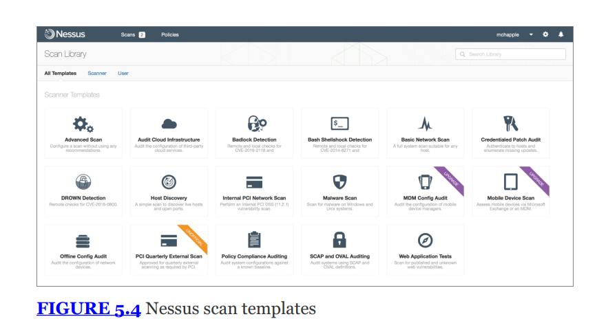


| **Đặc điểm**        | **Nessus (Tenable)**                                                                 | **Qualys**                                                            |
| ------------------- | ------------------------------------------------------------------------------------ | --------------------------------------------------------------------- |
| **Loại hình**       | Phần mềm (Software) / Cài đặt tại chỗ (On-premise).                                  | Dịch vụ đám mây (Cloud-based / SaaS).                                 |
| **Cài đặt**         | Tải về và cài đặt lên máy tính/server.                                               | Đăng nhập qua trình duyệt web. Chỉ cần cài "sensor" nhẹ trong mạng.   |
| **Đối tượng chính** | Chuyên gia bảo mật (Pentesters), Tư vấn viên, Công ty vừa & nhỏ.                     | Doanh nghiệp lớn (Enterprise), Ngân hàng, Tập đoàn đa quốc gia.       |
| **Điểm mạnh**       | Độ chính xác cực cao, ít báo ảo (false positives). Tuyệt vời để "soi" kỹ từng máy.   | Quản lý tài sản (Asset management) tốt, giám sát liên tục quy mô lớn. |
| **Mô hình giá**     | Trả theo giấy phép (License) của máy quét. Quét bao nhiêu IP cũng được (Nessus Pro). | Trả tiền dựa trên số lượng địa chỉ IP (Asset) bạn muốn quét.          |


Ngoài ra còn có OpenVAS


### Plug-ins {#2b77b0eb61a48092ba76ed5add8b3bbf}

- Trong các công cụ quét như Nessus, mỗi bài kiểm tra lỗ hổng cụ thể được gọi là một plug-in
- Các plug-ins được nhóm thành các gia đình (families) dựa trên hệ điều hành hoặc loại thiết bị (windows, cisco, database,…)
- Tối ưu hóa: bạn nên vô hiệu hóa những plug-ins không cần thiết (ví dụ: tắt plug-in linux khi quét window)
	- Tăng tốc độ quét
	- Giảm false positive results

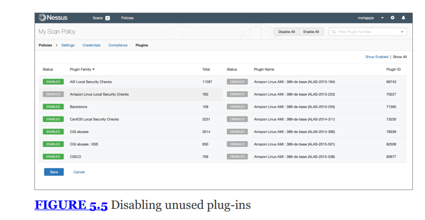


### Intrusive vs non-intrusive scanning {#2b77b0eb61a48069acb6ca635b893158}


Quét dựa trên tác động (intrusiveness)

- Intrusive scans (quét xâm lấn): công cụ quét sẽ thử khai thác lỗ hổng hoặc chạy các bài test nặng
	- Rủi ro: có thể làm sập hệ thống, gián đoạn dịch vụ
		- **Ví dụ:** Thấy lỗ hổng tràn bộ đệm, nó gửi thử mã tràn bộ đệm vào. Nếu máy sập hoặc trả về shell -> Xác nhận có lỗi.
- Non-intrusive: chỉ kiểm tra thụ động, an toàn hơn cho môi trường production
	- **Ví dụ:** Thấy máy chủ chạy "Apache 2.4.1", nó tra từ điển thấy phiên bản này cũ -> Báo lỗi. Nó không thử hack vào.

Giải pháp: luôn quét thử nghiệm trên môi trường test environment trước khi quét trên môi trường production


### Supplementing network scans {#2b77b0eb61a480698f1ec3c18dd2ab57}


Có 2 phương thức quét dựa trên quyền truy cập:


### **Non-credentialed Scans (Quét không xác thực / Quét từ xa)** {#2b77b0eb61a4808a9185efa6fd329a62}

- Mô phỏng góc nhìn của kẻ tấn công bên ngoài (**Attacker's vantage point**).
- **Hạn chế:**
	- Bị chặn bởi Firewalls, IPS.
	- Thiếu chính xác (**Inaccurate view**).
	- Không thể nhìn thấy cấu hình bên trong máy chủ.
	- Dễ dẫn đến **False positive** (Báo lỗi sai) cần quản trị viên tốn thời gian kiểm tra lại.

### **Credentialed Scans (Authenticated scan)** {#2b77b0eb61a480a1b95cd431068abb67}


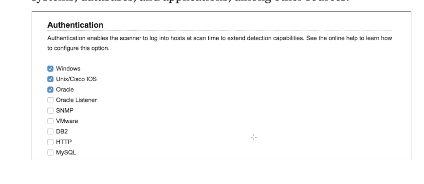

- Quản trị viên cung cấp cho máy quét một tài khoản (**Credentials**) để đăng nhập vào máy chủ mục tiêu.
- **Lợi ích:**
	- Lấy được thông tin cấu hình tin cậy (**Trusted information**).
	- Độ chính xác cao hơn (**Accuracy**). Không cần phải đoán già đoán non
	- Phát hiện được các vấn đề nội tại như: Thiếu bản vá hệ điều hành (**Missing patches**), cấu hình sai database.
- **Ví dụ:** Nếu quét từ xa chỉ thấy cổng 80 mở, quét có xác thực sẽ biết chính xác phiên bản IIS/Apache đang chạy và nó có bản vá lỗi chưa.

:::tip

Exam note: Principle of least privileges: Khi tạo tài khoản cho máy quét đăng nhập, đừng dùng quyền admin cao nhất nếu không cần thiết. Hãy tạo một tài khoản read-only. Điều này giảm thiểu rủi ro nếu tài khoản đó bị lộ

:::


---


**Tóm tắt nhanh cho kỳ thi:**

- **Credentialed Scan** = Quét sâu, chính xác, ít False Positive (nhưng cần tài khoản).
- **Non-credentialed Scan** = Quét ngoài, giống hacker, hay bị Firewall chặn.
- **Intrusive Scan** = Nguy hiểm, có thể làm sập mạng.
- **Asset Criticality + Risk Appetite** = Quyết định tần suất quét.

:::tip

**Ví dụ thực tế:**
1. **Non-intrusive + Credentialed Scan (Phổ biến nhất & Khuyên dùng):**

2. **Non-intrusive + Non-credentialed Scan:**

3. **Intrusive + Non-credentialed Scan:**

:::


1. Tại sao Credentialed Scan lại thu được nhiều thông tin hơn?**:**


Khi bạn cung cấp Username/Password (Credentials) cho công cụ quét (như Nessus), nó sẽ thực hiện các việc sau mà người đứng ngoài không làm được:

1. **Truy cập Registry/File System:**
	- _Ví dụ:_ Máy chủ của bạn cài phần mềm **Adobe Reader** phiên bản cũ (có lỗ hổng). Phần mềm này **không mở cổng mạng** (không kết nối internet trực tiếp), nên đứng từ ngoài quét Port sẽ không bao giờ thấy.
	- _Credentialed Scan:_ Đăng nhập vào -> Đọc danh sách phần mềm đã cài trong Control Panel/Registry -> Phát hiện ngay Adobe Reader cũ -> Báo lỗi.
2. **Kiểm tra bản vá (Patch verification):**
	- _Ví dụ:_ Microsoft vừa ra bản vá lỗi cho Windows.
	- _Credentialed Scan:_ Đăng nhập vào -> Kiểm tra lịch sử Windows Update -> Thấy thiếu bản KB123456 -> Báo lỗi "Missing Patch".
3. **Kiểm tra cấu hình (Configuration Audit):**
	- _Ví dụ:_ Policy mật khẩu.
	- _Credentialed Scan:_ Đọc Local Security Policy -> Thấy dòng "Minimum password length = 0" -> Báo lỗi "Chính sách mật khẩu yếu".

**Tóm lại:** Credentialed Scan nhìn thấy **toàn bộ nội tạng** của hệ thống (Client-side vulnerabilities), còn Non-credentialed chỉ thấy **lớp da bên ngoài** (Network-side vulnerabilities).


---


:::tip

2. Tại sao KHÔNG dùng combo "Intrusive + Credentialed"?
Về lý thuyết, bạn _có thể_ làm điều này, nhưng trong thực tế vận hành (Operations), người ta **cực lực tránh**. Tại sao?

Hãy quay lại bảng phân loại:

- **Credentialed:** Tôi đã có chìa khóa vào nhà.

- **Intrusive:** Tôi sẽ đập cửa kính để xem kính có vỡ không.

**Lý do 1: Rủi ro sập hệ thống (High Risk of Crash)**

- **Intrusive Scan** thường hoạt động bằng cách gửi dữ liệu rác hoặc mã khai thác (exploit code) để cố làm tràn bộ nhớ (Buffer Overflow) dịch vụ nhằm xem nó có lỗi không.

- Nếu bạn chạy mã này khi **đang đăng nhập với quyền Admin** (Credentialed), hậu quả sẽ nghiêm trọng hơn nhiều so với việc tấn công từ ngoài. Bạn có thể làm sập nhân hệ điều hành (Kernel Panic/Blue Screen of Death), xóa nhầm file hệ thống hoặc làm hỏng cơ sở dữ liệu (Corruption).

- _Mục tiêu của Vulnerability Management_ là phát hiện lỗi để sửa, chứ không phải đánh sập máy chủ của công ty.

**Lý do 2: Sự thừa thãi (Redundancy) - "Tại sao phải đập kính?"**

- Nếu bạn đã có **Credentials** (đã vào được nhà), bạn chỉ cần nhìn cái tem trên cửa kính: _"Kính này là loại A, đời 2010"_.

- Bạn tra từ điển và biết: _"Kính đời 2010 rất dễ vỡ"_.

- > Bạn **KẾT LUẬN LUÔN** là nó có lỗ hổng. Việc đập nó vỡ khi biết nó có thể vỡ là không cần thiết

**Kết luận:**
Combo tiêu chuẩn vàng (Gold Standard) cho quét lỗ hổng định kỳ là: **Credentialed + Non-intrusive**.

- Nó cho thông tin chi tiết nhất (nhờ Credentialed).

- Nó an toàn nhất cho hệ thống Production (nhờ Non-intrusive).

**Intrusive Scan** thường chỉ dùng trong **Penetration Testing** (khi Pentester muốn chứng minh cho sếp thấy là "lỗi này hack được thật đấy") và thường thực hiện cẩn thận trên từng mục tiêu, chứ không chạy tự động đại trà.

:::


### Agent-based scanning {#2b87b0eb61a480c89ddde97f682f801d}

- Thay vì kết nối đến máy chủ (serer-based scanning), bạn cài đặt một phần mềm nhỏ (agent) trực tiếp trên mục tiêu.???
- Cơ chế: agent sẽ quét cấu hình từ bên trong ra và báo cáo kết quả về nền tảng quản lý trung tâm
- Lưu ý: Các quản trị viên hệ thống thường e ngại cài đặt agent vì sợ làm chậm máy, hoặc gây mất ổn định. Nên thử nghiệm ở quy mô nhỏ (pilot deployment) trước khi cài đặt đại trà

| **Đặc điểm**           | **Agent-based Scanning (Quét lỗ hổng)**         | **Agent-based DLP (Chống mất dữ liệu)**               |
| ---------------------- | ----------------------------------------------- | ----------------------------------------------------- |
| **Mục tiêu chính**     | Tìm lỗi phần mềm, bản vá thiếu (Vulnerability). | Ngăn chặn hành vi trộm/lộ dữ liệu (Data Leak).        |
| **Đối tượng quan tâm** | Hệ điều hành, phần mềm cài trên máy.            | File tài liệu (Word, Excel, PDF...), USB, Email, Web. |
| **Cơ chế**             | Thu thập thông tin -> Gửi báo cáo.              | Giám sát hành vi -> Chặn (Block) hoặc Cảnh báo.       |
| **Ảnh hưởng máy**      | Thường nhẹ, chỉ chạy khi quét.                  | Có thể nặng hơn vì phải soi từng file bạn mở/copy.    |
| **Ví dụ**              | Qualys Cloud Agent, Nessus Agent.               | Symantec DLP, McAfee DLP, Forcepoint.                 |


:::tip

Pentest thiên về chiều sâu
Scan thiên về chiều rộng

:::


## Scan perspective {#2b87b0eb61a4802381baee23ccd2d4df}

- External scan:
	- Máy quét đặt trên internet
	- Mô phỏng góc nhìn kẻ tấn công
	- Cho thấy những gì tường lửa cho phép qua
- Internal scan
	- Đặt trong mạng nội bộ
	- Mô phỏng góc nhìn của malicious insider
- Datacenter/Agent scan: cho thấy trạng thái thực tế của máy chủ khi không bị firewall che

**Note Sidebar - PCI DSS:** Tiêu chuẩn thẻ thanh toán yêu cầu phải thực hiện cả quét nội bộ (tự làm) và quét bên ngoài (bởi một nhà cung cấp được phê duyệt - **ASV: Approved Scanning Vendor**).

- **Platform Management:** Các nền tảng hiện đại (như Qualys) cho phép chọn "Scanner Appliance" (thiết bị quét) để quyết định quét từ đâu (Internal hay External). (Xem **Figure 5.7**).

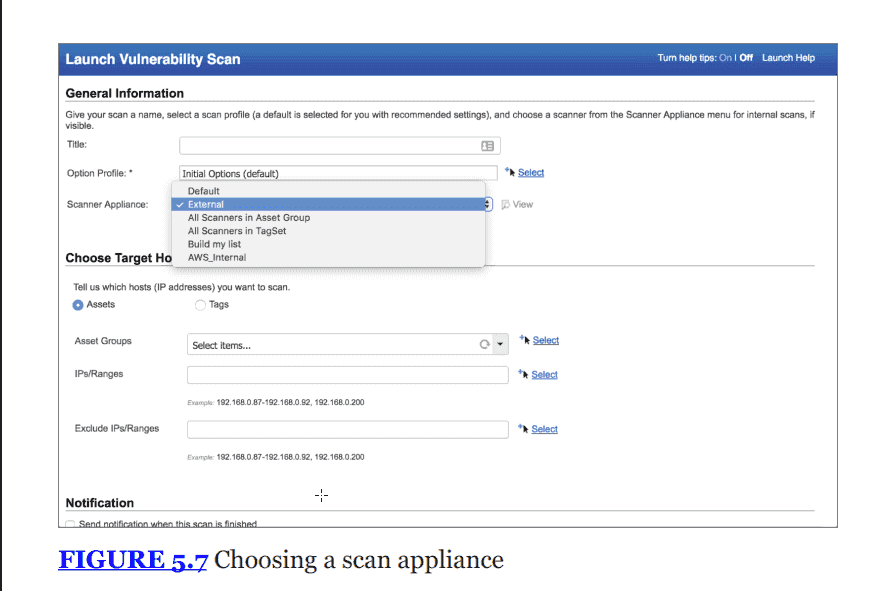


## Scanner maintainance {#2b87b0eb61a48047bce2c777bd3d40b4}


### Scanner software {#2b87b0eb61a48008b22ad6a1013e9acb}

- Cập nhật phần mềm quét - vì chính nó cũng có thể có lỗi bảo mật và để thêm tính năng mới
	- Scanner vulnerability: lỗ hổng XSS trên phiên bản cũ của Nessus

	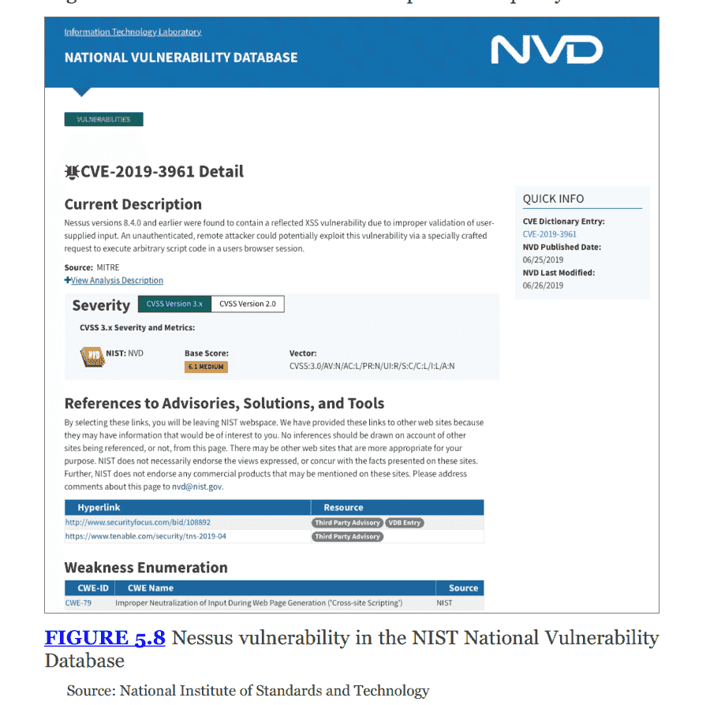

- Vulnerability plug-in feeds: cập nhật cơ sở dữ liệu nhận diện lỗ hổng
	- Các nhà nghiên cứu tìm ra lỗ hổng mới mỗi tuần
	- Cần cấu hình máy quét tự động cập nhật (automatic updates) các plug-ins này hàng ngày

## Security content automation protocol (SCAP) {#2b87b0eb61a480f3a353c7914b6b39a6}


Giao thức tự động hóa nội dung bảo mật - là nỗ lực của cộng đồng bảo mật cho các công cụ bảo mật nói chuyện với nhau. Bạn phải thuộc các thành phần sau của SCAP


Các công cụ quét như OpenSCAP, Nessus, Qualys sẽ sử dụng các tập tin cấu hình mẫu (security baselines, viết bằng định dạng XCCDF trong SCAP) để quét hệ thống của bạn

- So sánh cấu hình hiện tại với NIST 800-53 và báo cáo xem bạn tuân thủ bao nhiêu

**Từ khóa:** Cứ thấy **"NIST checklist"**, **"security configuration checklist"**, **"automation benchmark"** → Chọn **SCAP**.


- CCE (Common configuration enumeration): chuẩn đặt tên cho các vấn đề về cấu hình hệ thống

(system configuration issue)

	- Ví dụ:
		- **Tình huống:** Máy tính của bạn cho phép mật khẩu chỉ có 3 ký tự (quá yếu).
		- **Mã CCE:** `CCE-26569-4`
		- **Mô tả:** "Configure Minimum Password Length to 14 Characters or More" (Cấu hình độ dài mật khẩu tối thiểu phải là 14 ký tự trở lên).
- CPE (Common platform enumeration): chuẩn đặt tên hệ điều hành, ứng dụng, thiết bị. Vd: Windows 10 enterprise
	- **Windows 10 bản Enterprise:** `cpe:/o:microsoft:windows_10:-:enterprise`
	- **Trình duyệt Firefox bản 88.0:** `cpe:/a:mozilla:firefox:88.0`
	- **Phần cứng Router Cisco:** `cpe:/h:cisco:2800_router`
- CVE (Common vulnerabilities and Exposures): chuẩn đặt tên cho lỗ hổng phần mềm. Vd: CVE-2021-44228. CompTIA dùng chuẩn cũ là Common vulnerability enumeration
	- **Lỗ hổng:** Log4Shell (lỗ hổng cực kỳ nghiêm trọng năm 2021).
	- **Mã CVE:** `CVE-2021-44228`
	- **Mô tả:** Lỗ hổng trong thư viện Apache Log4j cho phép hacker chiếm quyền điều khiển từ xa.
- CVSS (Common vulnerability scoring system): hệ thống chấm điểm đo lường mức độ nghiêm trọng của CVE. Thang từ 0-10
	- **Vector (Chuỗi tính điểm):** `CVSS:3.1/AV:N/AC:L/PR:N/UI:N/S:C/C:H/I:H/A:H`
	- _Giải nghĩa nhanh:_ Tấn công qua mạng (AV:N), không cần quyền (PR:N), phá hủy hoàn toàn (C:H/I:H/A:H).
- **XCCDF (Extensible Configuration Checklist Description Format):** Ngôn ngữ để viết các danh sách kiểm tra bảo mật (Checklists). Là một file dạng xml chứa danh sách chính sách bảo mật mà tổ chức muốn kiểm tra

	**Ví dụ thực tế:**

	- Bạn tải về một file XCCDF có tên: _CIS_Benchmark_for_Windows_10.xml_.
	- Bên trong file đó viết (bằng ngôn ngữ máy):
		1. _Câu hỏi 1:_ Mật khẩu có đủ 14 ký tự không? (Tham chiếu đến CCE-26569-4).
		2. _Câu hỏi 2:_ Đã tắt AutoRun chưa?
		3. _Câu hỏi 3:_ Đã cập nhật bản vá mới nhất chưa?
- **OVAL (Open Vulnerability and Assessment Language):** Ngôn ngữ kỹ thuật để mô tả quy trình kiểm tra/test máy tính. OVAL mà mã lệnh cụ thể để thực hiện XCCDF

	**Ví dụ thực tế:**

	- Một đoạn code XML OVAL sẽ thực hiện lệnh:
		- _Bước 1:_ Mở Registry của Windows.
		- _Bước 2:_ Tìm đến khóa `HKEY_LOCAL_MACHINE\...\MinPasswordLength`.
		- _Bước 3:_ Đọc giá trị. Nếu giá trị < 14 thì trả về kết quả `FAIL` (Trượt), nếu >= 14 thì `PASS` (Đạt).

---


Ví dụ thực tế: 


Hãy tưởng tượng bạn là một Admin muốn kiểm tra bảo mật cho 100 máy tính.

1. Bạn tải về một file **SCAP Benchmark** (thường do chính phủ hoặc hãng phần mềm cung cấp). File này chứa **XCCDF** (danh sách yêu cầu) và **OVAL** (cách kiểm tra).
2. Bạn nạp file này vào một **SCAP Scanner** (ví dụ: Nessus, OpenSCAP).
3. Scanner chạy, sử dụng **CPE** để nhận diện xem máy là Windows hay Linux.
4. Scanner dùng **OVAL** để kiểm tra từng mục.
5. Scanner phát hiện lỗi, nó gán mã **CVE** (nếu là lỗi phần mềm) hoặc **CCE** (nếu là lỗi cấu hình).
6. Nó chấm điểm nguy hiểm dựa trên **CVSS**.
7. Cuối cùng, nó xuất ra báo cáo. Bạn đọc báo cáo và biết chính xác cần vá cái gì.

## Vunerability scanning tools {#2b87b0eb61a480ea8f66cf7e723da321}


### Infrastructure vulnerability scanning {#2b87b0eb61a480ef92c7f6abec025328}


Dùng để quét server:

- Teneble Nessus: nổi tiếng và lâu đời nhất
- Qualys: mạnh về mô hình đám mây (SaaS), dùng các appliances tại chỗ hoặc trên cloud
- Rapid7 Nexpose: một đối thủ thương mại lớn khác
- OpenVAS: công cụ mã nguồn mở, là lựa chọn thay thế các phiên bản thương mại đắt tiền

### Application testing {#2b87b0eb61a480198123e755195535c1}


Dùng trong quy trình phát triển phần mềm DevSecOps. Có 3 kỹ thuật chính:

1. Static testing: phân tích mã nguồn mà không chạy chương trình. Giúp chỉ ra đúng dòng code bị lỗi cho lập trình viên
2. Dynamic testing (DAST): chạy chương trình lên và kiểm tra các giao diện interfaces của nó với các đầu vào khác nhau để tìm lỗi
3. Interactive testing (IAST): kết hợp cả hai (vừa chạy vừa phân tích code)

### Web application testing {#2b87b0eb61a4807a9cffef36931808b8}


Đây là công cụ chuyên tìm kiếm lỗi web như SQL injection, XSS, CSRF

- Nikto: công cụ mã nguồn mở, giao diện dòng lệnh (CMD int). Miễn phí nhưng hơi khó dùng

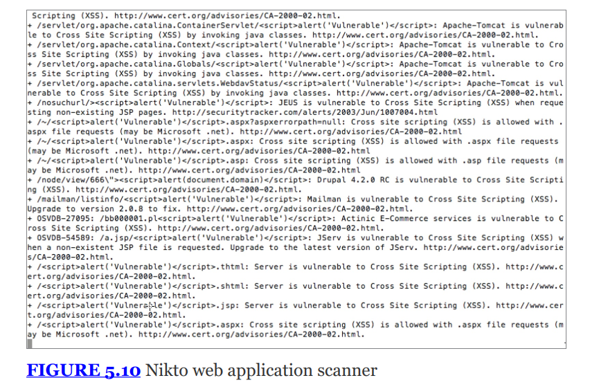

- Arachi: một công cụ mã nguồn mở khác, có GUI và hỗ trợ đa nền tảng
- Acunetix: sản phẩm thương mại cao cấp
- **Lưu ý:** Các máy quét hạ tầng (Nessus, Qualys) cũng có tính năng quét web, nhưng thường không chuyên sâu bằng các công cụ dedicated này.

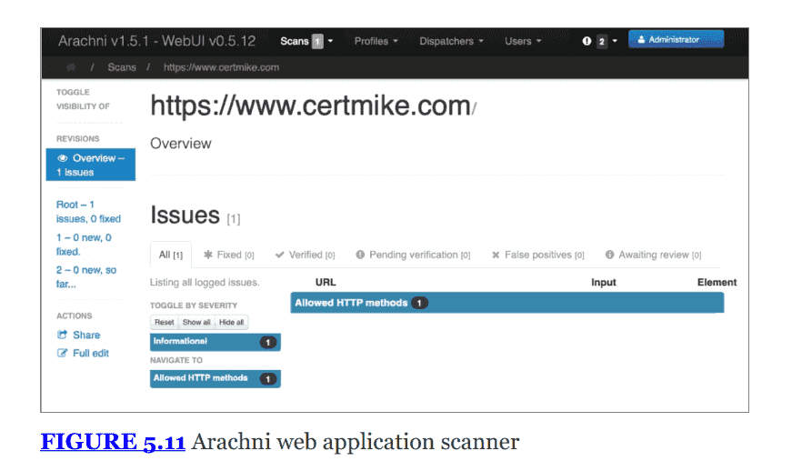


## Reviewing and interpreting scan reports {#2b87b0eb61a4808787f1c23da1900039}


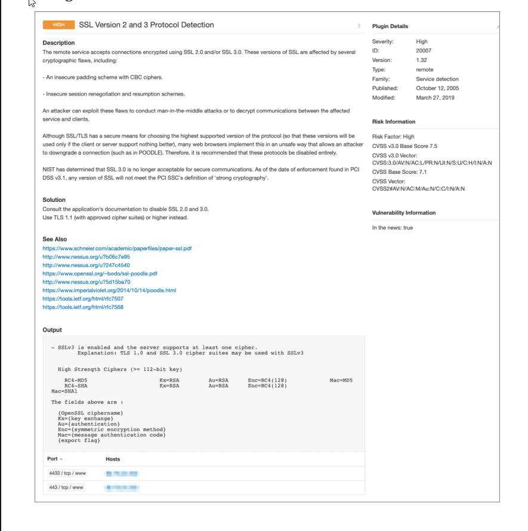


Sau khi quét xong bạn nhận được một báo cáo. 

1. Name of the vulnerability: tên lỗ hổng
2. Severity: mức low, medium, high, critical. Trong hình là high
3. Description: mô tả
4. Remediation: cách hướng dẫn sửa lỗi, tắt SSL v2/v3
5. See also: cung cấp các references. Dẫn link tới bài blog, tài liệu của nhà cung cáp, các tài liệu chuẩn IETF để đọc thêm
6. Output: phần giá trị cho chuyên gia phân tích. Hiển thị chính xác những gì máy quét được từ hệ thống
	- Máy quét gửi lệnh Helllo và server gửi lại SSLv2 -= > là bằng chứng thép xác nhận lỗ hổng và loại bỏ false positive
7. Port/host: cho biết nằm ở port nào và host nào
8. RIsk information: risk factor: high
	1. Cung cấp CVSS base score vaf chuỗi ký tự đặc biệt là CVSS vector

---


**Tóm tắt trọng tâm:**

- **SCAP Components:** Phân biệt được **CVE** (Tên lỗi) vs **CVSS** (Điểm số) vs **CPE** (Tên sản phẩm).
- **Tools:** Nhớ tên các công cụ (Nessus/Qualys = Network; Nikto/Arachni/Acunetix = Web; OpenVAS = Free Network).
- **Perspective:** External (Hacker) vs Internal (Insider) vs Agent (Real state).
- **Maintenance:** Update Feed hàng ngày.

---


## Understanding CVSS {#2b87b0eb61a48031b619f2722a5222ad}


| **Đặc điểm**        | **Vulnerability Feed**               | **Threat Feed**                                 |
| ------------------- | ------------------------------------ | ----------------------------------------------- |
| **Đối tượng**       | **Lỗi** phần mềm (Internal Weakness) | **Tác nhân** bên ngoài (External Threat)        |
| **Dữ liệu ví dụ**   | CVE-2021-44228, CVSS 10.0            | IP: 192.168.1.50, Hash: a1b2...e4f              |
| **Tính chất**       | Tĩnh (Static), tuổi thọ dài          | Động (Dynamic), tuổi thọ ngắn (IP đổi liên tục) |
| **Hành động**       | Vá (Patch), Cấu hình lại             | Chặn (Block) trên Firewall/IPS                  |
| **Ví dụ điển hình** | NVD, MITRE CVE                       | AlienVault OTX, VirusTotal                      |

- CVSS (common vulnerability scoring system) là tiêu chuẩn công nghiệp để đánh giá mức độ nghiêm trọng của lỗ hổng bảo mật
- Thang điểm: từ 0 tới 10
- Exam note: Hãy nhớ CVSS là một phần của SCAP, cung cấp điểm số để ưu tiên phá lỗi nào trước
- cách tính điểm CVSS dựa trên **8 chỉ số (Metrics)**. Các chỉ số này chia làm 3 nhóm:
	- Base: AV, AC, scope, UI, PR
	- Temporal: exploit code maturity, remediation level, report confidence
	- Environmental: CIA

	Điểm tính ở dưới đây là điểm base


### Exploitability: AV, AC, PR, UI {#2b87b0eb61a480a78b3cf668fee5af38}

1. Attack vector metrics:  (AV) mô tả kẻ tấn công phải tấn công ở đâu và như thế nào
	- Network (N): chỉ cần từ xa. 0.85
	- Adjacent (A): cùng mạng LAN, mạng vật lý bluetooth/wifi. 0.62
	- Local: phải truy cập được vào máy tính đó mới hack được. 0.55
	- Physical: phải chạm tay vào thiết bị (ví dụ cắm USB) 0.2

	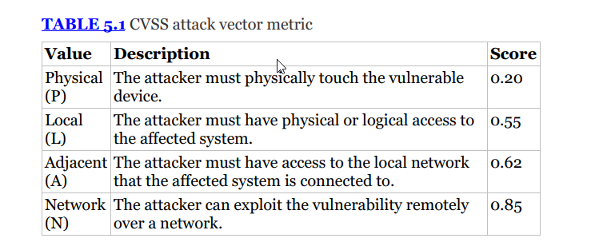

2. Attack comlexity (AC)
	- High (H): khó, cần một điều kiện đặc biệt nào đó mới thực hiện được. Ví dụ: nạn nhân chạy một tiến trình cụ thể nào đó. 0.44
	- Low (L): Dễ, không cần đợi hay làm gì đặc biệt. 0.77

	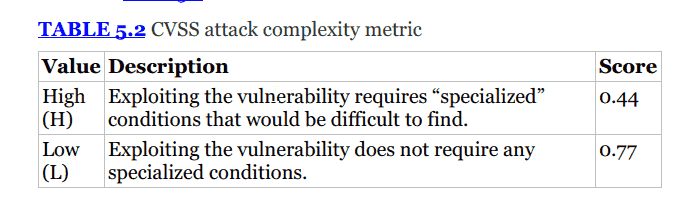

3. Privileges required metric (PR): cần đăng nhập trước hay không
	- None (N): không cần tài khoản. 0.85
	- Low (L): cần tài khoản người dùng (basic user): 0.62 hoặc 0.68 nếu thay đổi scope liên quan tới phần scope ở dưới
	- High (H): cần tài khoản admin. 0.27 hoặc 0.50 nếu đã đổi scope (liên quan tới phần mềm khác)

	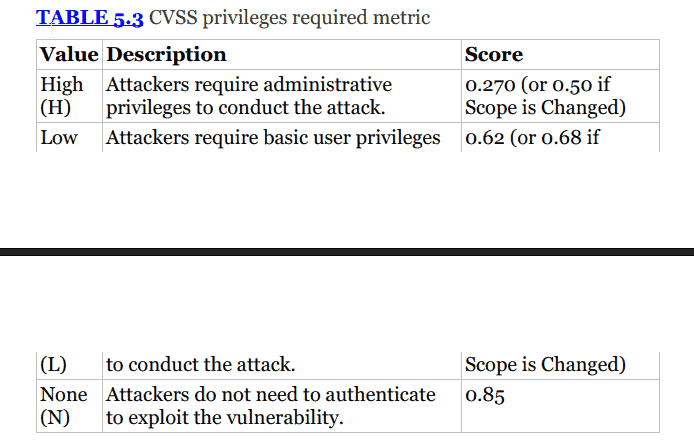

4. User interactions metrics (UI): có cần người giúp sức không
	- **None (N):** Không cần. Tấn công tự động xảy ra. 0.85
	- **Required (R):** Cần nạn nhân click vào link, mở file, hoặc cài đặt gì đó (_Social Engineering_). 0.62

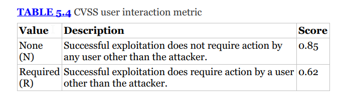


### Impact: CIA metrics {#2b87b0eb61a4801799a1d00b28e2152e}


Liên quan tới CIA triad, mỗi yếu tố đều có N, L, H, mức điểm lần lượt là 0.56, 0.22, 0.00

- **Confidentiality (C):** Lộ dữ liệu bí mật.

	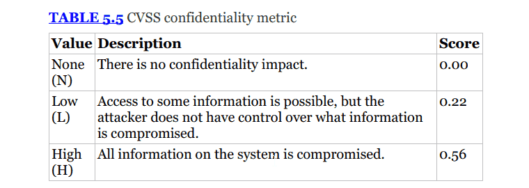


	Low: có thể compromised một phần nhưng không kiểm soát được phần bị compromised đó

- **Integrity (I):** Dữ liệu bị sửa đổi trái phép.

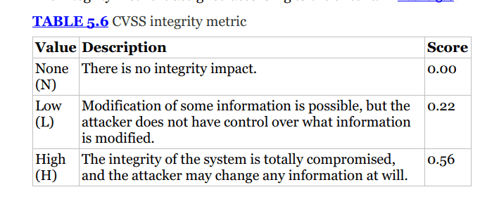


Low: modification một phần, nhưng hacker không kiểm soát được phần đã modified

- **Availability (A):** Hệ thống bị sập hoặc từ chối dịch vụ.

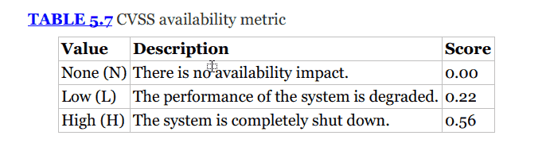


Low: system bị hư hao


### **Chỉ số đặc biệt: Scope Metric (S)** {#2b87b0eb61a4807589b9fe23d3182bb5}

1. **Scope (S):** Phạm vi ảnh hưởng không chấm điểm, nó liên quan tới privileges required metric rồi
	- **Unchanged (U):** Lỗ hổng chỉ ảnh hưởng đến chính phần mềm bị lỗi.
	- **Changed (C):** Nguy hiểm hơn. Lỗ hổng ở phần mềm A nhưng làm ảnh hưởng sang phần mềm B hoặc hệ điều hành bên dưới (Ví dụ: Từ máy ảo thoát ra chiếm quyền máy chủ vật lý - _VM Escape_).

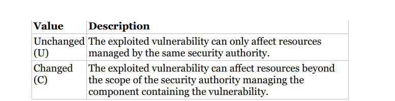


## Interpreting the CVSS vector {#2b87b0eb61a480b19c25ea25055e1e86}


Trong báo cáo quét, bạn sẽ thấy một chuỗi ký tự dài ngoằng như:
`CVSS:3.0/AV:N/AC:L/PR:N/UI:N/S:U/C:H/I:N/A:N`

- **CVSS:3.0:** Phiên bản CVSS.
- **AV:N** (Attack Vector: Network) -&gt; Tấn công qua mạng. 0.85
- **AC:L** (Attack Complexity: Low) -&gt; Dễ thực hiện. 0.77
- **PR:N** (Privileges Required: None) -&gt; Không cần đăng nhập. 0.85
- **UI:N** (User Interaction: None) -&gt; Không cần nạn nhân click. 0.85
- **S:U** (Scope: Unchanged) -&gt; Không lan sang thành phần khác.
- **C:H** (Confidentiality: High) -&gt; Mất dữ liệu nghiêm trọng. 0.56
- **I:N, A:N** -&gt; Không ảnh hưởng toàn vẹn và tính sẵn sàng.

### Summarizing CVSS score {#2b87b0eb61a480b5a085ffeb91ddcf48}

1. **Tính Impact Sub-Score (ISS):** Tổng hợp mức độ mất mát của C, I, A.
	- Công thức: $ISS = 1 - [(1-C) \times (1-I) \times (1-A)]$
	- Trong ví dụ trên thì ISS =0.56

	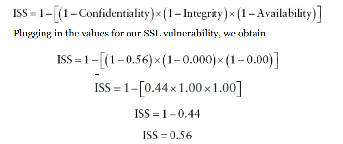

2. **Tính Impact Score:** Điều chỉnh điểm ISS dựa trên việc **Scope** có thay đổi hay không. (Nếu Scope Changed, điểm phạt nặng hơn).

	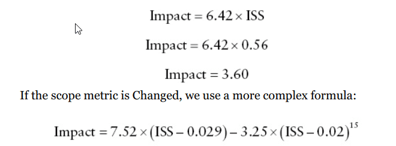

3. **Tính Exploitability Score:** Nhân các hệ số AV, AC, PR, UI lại với nhau.

	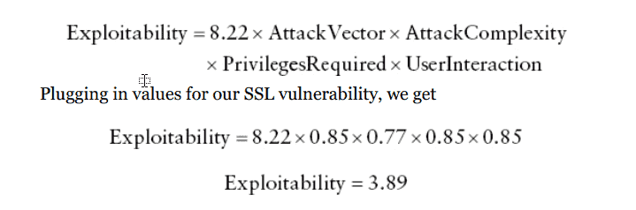

4. **Tính Base Score:** Cộng điểm Impact và Exploitability lại (theo quy tắc làm tròn).Quan trọng (Exam Note): Bạn KHÔNG CẦN phải học thuộc lòng công thức toán học phức tạp hay ngồi bấm máy tính trong phòng thi.
	- Nếu impact score bằng không thì tổng cũng bằng 0
	- Nếu scope không đổi, tính base score = impact + exploitability
	- Nếu scope đổi, base score = (impact + exploitability)*1.08
	- Nếu tổng điểm cao hơn 10, làm tròn bằng 10

Sách nhấn mạnh: "The good news is that you don't need to perform these calculations by hand." Bạn chỉ cần hiểu ý nghĩa của các chỉ số (ví dụ: AV:N thì điểm cao hơn AV:L) và biết dùng trang web NIST CVSS Calculator trong thực tế.


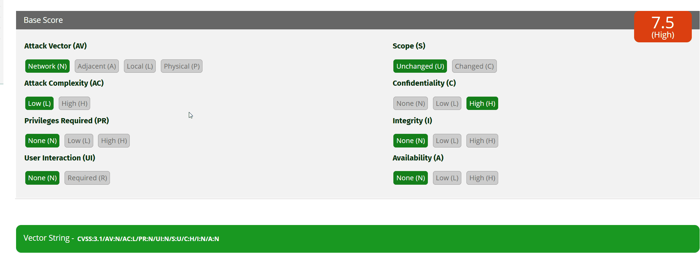


[https://www.first.org/cvss/calculator/3-1](https://www.first.org/cvss/calculator/3-1) của NIST để tính điểm CVSS


Ngoài base score còn có temporal score, và environmental score


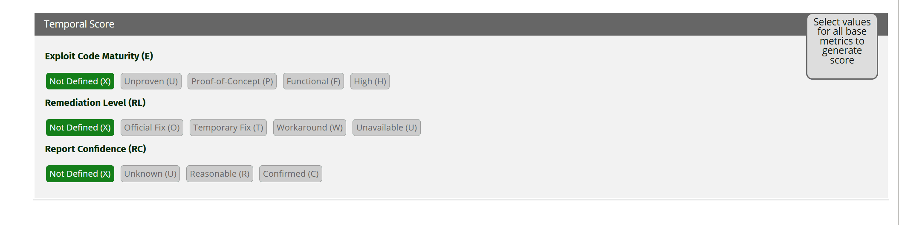


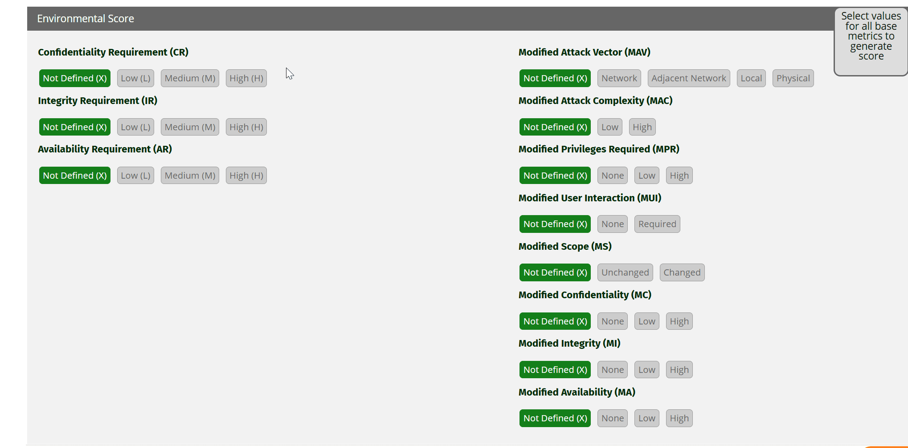


### Categorizing CVSS base score {#2b87b0eb61a48063a37ccc6da456ad6e}


| **CVSS Score** | **Rating (Mức độ)** |
| -------------- | ------------------- |
| **0.0**        | **None**            |
| **0.1 – 3.9**  | **Low**             |
| **4.0 – 6.9**  | **Medium**          |
| **7.0 – 8.9**  | **High**            |
| **9.0 – 10.0** | **Critical**        |


Lỗ hổng ở trên tính ra 7.5 vậy nó ở mức high


## Confirmation of scan results {#2b87b0eb61a480abaac4de59806ecb03}


Cybersec analyst sau khi thấy kết quả scan thì tiếp tục thực hiện investigation để xác nhận xem lỗ hổng có thật không


### False positive {#2b87b0eb61a480139330fb8f9df7a2c7}

- Báo lỗi nhưng thực tế không có
- Nguyên nhân
	- Máy quét không đủ quyền kiểm tra sâu
	- Lỗi plug-in
	- Cấu hình hệ thống đặc biệt khiến máy hiểu nhầm
- **Ví dụ:** Máy quét báo server thiếu bản vá X. Nhưng thực tế server đã cài bản vá đó rồi, nhưng bản vá này không thay đổi số phiên bản (version number) của file, khiến máy quét nhìn nhầm.

### False negative {#2b87b0eb61a4804e94abeccecae58770}

- Có lỗi hổng những máy báo không - là lỗi nguy hiểm nhất

### True positive/negative {#2b87b0eb61a480339ed7e988f26c397c}


Máy thực hiện đúng 


**Exam Note:** Hãy tập trung vào chủ đề **False Positives** và **False Negatives**. Bạn cần hiểu rõ các loại lỗi này và chuẩn bị tinh thần để nhận diện chúng trong các câu hỏi tình huống (_scenarios_) của bài thi.


### Verifying process {#2b87b0eb61a480b2a00dcb101daab092}


Làm sao để biết là false positive hay false negative

- Simple verification: kiểm tra xem bản vá đã được cài đặt chưa, phiên bản hệ điều hành có cũ không
- Complex verification: Đôi khi phải thực hiện công cụ phức tạp, mô phỏng exploit
	- Vd: để xác minh SQL injection, bạn phải tự tay nhập mã độc trên web và xem database phản hồi thế nào
- Teamwork: cần phối hợp với database administrator, system engineer, dev - những người hiểu về hệ thống đó để đánh giá

### Reconciling scan result {#2b87b0eb61a480f4a421c87978f750d6}


Không nên chỉ dựa vào một nguồn tin duy nhất, nên đối chiếu báo cáo với các nguồn dữ liệu khác

- Log reviews: xem nhật ký từ máy chủ, thiết bị mạng. Có dấu hiệu nào cho thấy ai đó đang cố khai thác lỗ hổng không
- SIEM (security information and Event management): Hệ thống SIEM giúp tương quan các dòng log từ nhiều nguồn để cung cấp thông tin tình báo hành động được (actionable intelligence)
- Configuration management systems: Hệ thống quản lý cấu hình như (SCCM, Ansible) chứa thông tin chính xác về hệ điều hành và phần mềm đã cài đặt. So sánh báo cáo của máy quét với dữ liệu của hệ thống này để tìm ra sự sai lệch.

:::tip

Sau khi vulnerability scan phát hiện lỗ hổng:
- Phân tích: xem xét các CVE được đề cập tới trong phần References trước khi thực hiện bất cứ solution nào

- Sau khi có đủ thông tin mới quyết định thực hiện solution nào, không phải nhắm mắt thực hiện solutions được kết quả scan đề xuất

:::


## Vulnerability classification {#2b87b0eb61a480c2a4d6d2738eca853c}


Phân loại các lỗ hổng cụ thể như sau:


### Patch management (Quản lý bản vá) {#2b87b0eb61a480aca822e25d9c69fcf5}


Một trong những cảnh báo phổ biến nhất từ máy quát lỗ hổng là: Hệ thống đang chạy phiên bản cũ và thiếu bản vá bảo mật

- Vấn đề: Các tổ chức thường bỏ bê việc vá lỗi do thiếu nguồn lực
- Ví dụ: trong báo cáo tại hình 5.13 cho thấy một máy chủ window bị dính lỗ hổng thực thi từ ra (RCE)
- RCE là lỗ hổng cho phép attacker chạy cmd hoặc script tùy ý trên hệ thống bị tấn công.

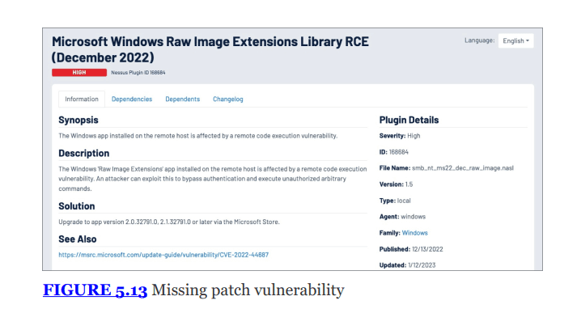

- Giải pháp: báo cáo chỉ rõ cách sửa rất đơn giản là update app version
- Tầm quan trọng: Việc quản lý bản vá là cốt lõi của bảo mật, nó áp dụng cho tất cả hệ điều hành, ứng dụng và firmware

:::tip

Firmware là loại phần mềm gắn chặt vào phần cứng, nó tương tác với phần cứng để điều khiển thiết bị

:::


| **Tiêu chí**            | **Software (Phần mềm)**                                                       | **Firmware (Phần trụn)**                                                                                                                 |
| ----------------------- | ----------------------------------------------------------------------------- | ---------------------------------------------------------------------------------------------------------------------------------------- |
| **Vị trí lưu trữ**      | Ổ cứng (HDD, SSD), có thể xóa/ghi dễ dàng.                                    | Chip nhớ đặc biệt (ROM/Flash) gắn trên bo mạch.                                                                                          |
| **Mục đích**            | Tương tác với **Người dùng** (User) để làm việc cụ thể (soạn thảo, lướt web). | Tương tác với **Phần cứng** (Hardware) để điều khiển thiết bị.                                                                           |
| **Tần suất cập nhật**   | Rất thường xuyên (Update Windows, App mỗi ngày/tuần).                         | Rất hiếm khi. Chỉ cập nhật để sửa lỗi nghiêm trọng hoặc thêm tính năng phần cứng.                                                        |
| **Độ khó khi thay đổi** | Dễ. Cài sai thì gỡ ra cài lại.                                                | Khó & Rủi ro. Cập nhật firmware gọi là **"Flashing"**. Nếu làm sai, thiết bị có thể hỏng hoàn toàn (**Bricking** - biến thành cục gạch). |
| **Kích thước**          | Thường lớn (vài trăm MB đến hàng chục GB).                                    | Rất nhỏ (vài KB đến vài MB).                                                                                                             |
| **Ví dụ**               | Chrome, Word, Photoshop, Windows 10, Games.                                   | BIOS/UEFI máy tính, phần mềm điều khiển remote TV, phần mềm trong máy giặt, điều khiển đèn giao thông.                                   |


Tại sao firmware lại là mục tiêu tấn công:

- **Rất khó phát hiện:** Các phần mềm diệt virus thông thường (Antivirus) thường chỉ quét ổ cứng (nơi chứa Software), ít khi quét sâu vào chip ROM (nơi chứa Firmware). Hacker rất thích cấy mã độc vào Firmware vì cài lại Windows cũng không hết virus.
- **IoT (Internet of Things):** Camera an ninh, router wifi, máy chấm công... đều chạy Firmware. Hacker thường tấn công vào các thiết bị này vì người dùng rất lười update Firmware cho chúng (dẫn đến các lỗi CVE cũ vẫn còn tồn tại).
- **Cập nhật:** Trong các báo cáo của Nessus, bạn sẽ thường thấy cảnh báo: _"Cisco Router IOS version outdated"_ (Phiên bản hệ điều hành router lỗi thời). Đó chính là yêu cầu bạn phải update Firmware cho router.

### Legacy platform {#2b87b0eb61a4801ea97dd8b52d9d6b60}


Đây là vấn đề nghiêm trọng hơn cả thiếu bản vá: Hệ điều hành hay phần mềm đã hết vòng đời hỗ trợ

- Rủi ro: khi nhà sản xuất ngừng hỗ trợ, họ sẽ không phát hành bản vá và bảo mật nữa. Dù có lỗ hổng mới được tìm thấy cũng không quan tâm
- Ví dụ: như window serer 2003 (đã ngừng hỗ trợ từ 2015) nếu còn dùng thì tự hại mình
- Giải pháp:
	- Upgrade: tốn kém
	- Compensating controls: (security control types đã học ở chương 1) nếu có dùng thì phải cô lập hệ thống (không kết nối internet hay máy khác), giám sát chặt chẽ

:::tip

Remember that good vulnerability response and remediation practices include patching, insurance, segmentation, compensating controls, exceptions, and exemptions.

:::


### Weak configurations {#2b87b0eb61a480d7a13ff49b5b44ec48}


Máy quét không chỉ tìm lỗi phần mềm, nó còn soi các thiết lập cấu hình sai (_misconfigurations_). Các lỗi phổ biến:

1. **Default Settings:** Để nguyên cấu hình mặc định (ví dụ: trang quản trị admin được bật sẵn thay vì tắt đi).
2. **Default Credentials:** Dùng tài khoản mặc định `admin/admin` hoặc tài khoản root không có mật khẩu.
3. **Open Ports:** Mở các cổng dịch vụ không cần thiết (ví dụ: mở cổng Telnet ra internet).
4. **Open Permissions:** Phân quyền lỏng lẻo, cho phép user thường truy cập dữ liệu nhạy cảm (vi phạm nguyên tắc _Least Privilege_).

### Error messages and debug modes {#2b87b0eb61a48016b6fbf6f244d97c07}

- Vấn đề: các dev thường bật debug để sửa lỗi khi code. Chế độ này hiển thị rất nhiều thông tin chi tiết về hệ thống (cấu trúc db, đường dẫn file, phiên bản server) khi có lỗi xảy ra
- Rủi ro: Nếu quên tắt chế độ này trên môi trường production, hacker có thể cố tình gây lỗi để thu thập thông tin.

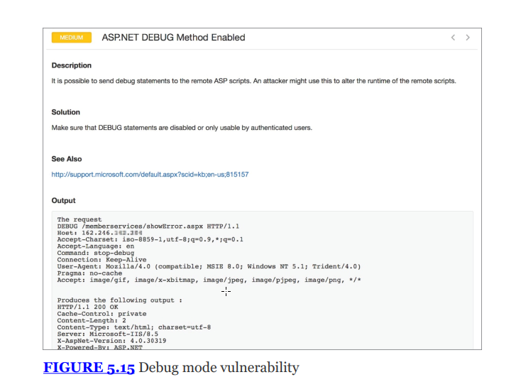

- Giải pháp: tắt debug mode trên các hệ thống public-facing. Chỉ bật trong môi trường cô lập

### Insecure protocols {#2b87b0eb61a480b19a98e3117d1010e8}


Máy quét sẽ la lên nếu thấy bạn dùng các giao thức truyền tin không mã hóa (_unencrypted_).

- **Telnet & FTP:** Hai "tội đồ" phổ biến nhất. Chúng truyền username/password dưới dạng văn bản rõ (_cleartext_). Bất kỳ ai nghe lén trên mạng (_sniffing_) đều lấy được mật khẩu. (Xem **Figure 5.16**: FTP Cleartext Authentication).
- **Giải pháp:**
	- Thay Telnet bằng **SSH (Secure Shell)**.
	- Thay FTP bằng **SFTP** (SSH File Transfer Protocol) hoặc **FTPS** (FTP over SSL)./

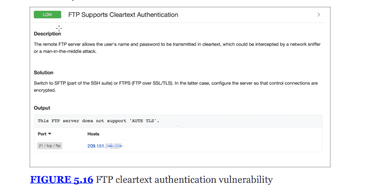


### Weak encryption {#2b87b0eb61a480a79c68de23b1ae2c82}


Ngay cả khi bạn dùng mã hóa (như SSL/TLS), nếu cấu hình kém thì vẫn bị coi là lỗ hổng.

- **Vấn đề:** Sử dụng thuật toán cũ kỹ, dễ bị bẻ khóa.
- **Ví dụ (Figure 5.17):** Máy chủ hỗ trợ mã hóa **RC4** (đã bị coi là không an toàn). Hoặc dùng key quá ngắn.
- **Giải pháp:** Cấu hình lại máy chủ Web để chỉ chấp nhận các thuật toán mạnh như **AES** và giao thức **TLS 1.2/1.3**.

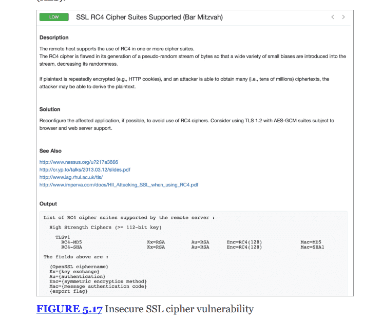


---


**Tóm tắt nhanh cho kỳ thi:**

- Thấy **"Legacy / End of Life"** -&gt; Rủi ro lớn nhất là **No updates/patches available**.
- Thấy **"Telnet/FTP"** -&gt; Rủi ro là **Cleartext credentials** -&gt; Giải pháp là **SSH/SFTP**.
- Thấy **"Debug Mode"** -&gt; Rủi ro là **Information Disclosure** (Lộ thông tin cấu hình).
- Thấy **"Default credentials"** -&gt; Rủi ro **Weak Configuration**.

## Penentration testing {#2b87b0eb61a480208cdff8b81938525a}

- Pentest lấp đầy khoảng trống giữa việc "dùng công cụ quét tự động" và "tấn công thực tế".
- Nó là quá trình đánh giá an ninh bằng cách mô phỏng hành vi của kẻ tấn công thực thụ, chủ động tìm kiếm lỗ hổng

:::tip

Trong quy trình chuẩn của một bài Penetration Test (ví dụ theo PTES hoặc NIST), nó bao gồm nhiều giai đoạn:
1. **Reconnaissance (Trinh sát):** Đây chính là **OSINT**. Hacker/Pentester phải thu thập thông tin từ nguồn mở để tìm IP, domain, email...

2. **Scanning (Quét):** Đây là **Vulnerability Scanning**. Dùng tool để quét cổng, quét lỗi.

3. **Exploitation (Khai thác):** Tấn công thử vào lỗi để xem có vào được không.

4. **Reporting:** Báo cáo.

Pentest trên dịch vụ cloud thì phải báo cho CSP biết

:::


### Adopting the hacker mindset {#2b87b0eb61a48058b500c3ab5a0d298f}

- Defender: tập trung vào CIA triad, triển khai các biện pháp kiểm soát (security controls) để bảo vệ hệ thống trước đe dọa
- Pentest: tư duy ngược. Thay vì cố bảo vệ tất cả, họ chỉ cần tìm một lỗ hổng duy nhất để khai thác và đạt được mục tiêu. → hacker mindset

Ví dụ: 

- _Security Assessment (Đánh giá bảo mật):_ Kiểm tra xem camera có hoạt động không, khóa cửa có tốt không, chuông báo động có kêu không.
- _Penetration Test:_ Không cần kiểm tra tất cả. Tester chỉ cần ném gạch vỡ kính cửa sổ lúc nửa đêm, lấy đồ và tẩu thoát mà không bị bắt.

> Quy luật quan trọng:

	- **Defenders** phải thắng **mọi lần** (_win every time_).
	- **Attackers** chỉ cần thắng **một lần duy nhất** (_win only once_).

### Reasons and benefits of pentesting {#2b87b0eb61a4803aaf7fe6ee56c207ae}


Tại sao đã có Firewalls, IPS, SIEM, Vulnerability scanners rồi mà vẫn tốn tiền thuê pentest?

- Visibility: pentest cung cấp cái nhìn về trạng thái bảo mật mà các công cụ tự động không thấy được. Nó đặt câu hỏi: “Nếu tôi là hacker, tôi có thể dùng thông tin này để làm gì?”
- **Knowledge (Kiến thức):** Giúp tổ chức biết được liệu một kẻ tấn công với kỹ năng tương đương có thể xâm nhập được không. Nếu Pentester không thể giành được chỗ đứng (_gain a foothold_), tổ chức có thể tự tin hơn về hệ thống phòng thủ.
- **Blueprint for remediation:** Nếu Pentest thành công, nó cung cấp bản kế hoạch chi tiết để khắc phục lỗ hổng.

### Pentest types {#2b87b0eb61a4808e829cc1892292207d}


4 loại:

- **Physical penetration testing:** Tập trung vào kiểm soát vật lý.
	- _Ví dụ:_ Cạy khóa, trèo rào, lừa bảo vệ để vào tòa nhà, vô hiệu hóa camera.
- **Offensive penetration testing:** Cách tiếp cận chủ động (_proactive_).
	- Mục tiêu: Mô phỏng tấn công thực tế để xem tổ chức có phát hiện và phản ứng kịp không.
- **Defensive penetration testing:** Tập trung vào khả năng phòng thủ.
	- Đánh giá hiệu quả của chính sách và công nghệ bảo mật.
- **Integrated penetration testing:** Kết hợp cả tấn công và phòng thủ. Các chuyên gia tấn công và phòng thủ phối hợp chặt chẽ với nhau (thường gọi là _Purple Teaming_).

### Environmental knowledge classifications {#2b87b0eb61a48050b9a1efa2624bc061}


Khi bắt đầu pentest, cần xác định xem tester biết bao nhiêu về mục tiêu. Có 3 loại (thường gọi là whitebox, black box, và gray box)

1. **Known environment (White box):**
	- Tester được cung cấp **đầy đủ thông tin** (_full knowledge_): sơ đồ mạng, mã nguồn, tài khoản đăng nhập, cấu hình.
	- _Ưu điểm:_ Hiệu quả cao, tìm được lỗi sâu bên trong, không tốn thời gian dò tìm.
	- _Nhược điểm:_ Không mô phỏng chính xác góc nhìn của hacker bên ngoài (vì hacker đâu có sẵn sơ đồ mạng).
2. **Unknown environment (Black box):**
	- Tester **không được cung cấp gì cả** (_no access or information_). Họ phải tự thu thập thông tin (_gather information_) từ đầu.
	- _Ưu điểm:_ Mô phỏng thực tế nhất (_realistic view_) những gì một hacker bên ngoài sẽ làm.
	- _Nhược điểm:_ Tốn thời gian (_time-consuming_) và có thể bỏ sót các lỗi sâu bên trong.
3. **Partially known environment (Gray box):**
	- Lai giữa hai loại trên. Tester biết một số thông tin nhưng không hết (ví dụ: không có quyền Admin). Cân bằng giữa thời gian và độ chính xác.

> Exam Note: Hãy chắc chắn bạn phân biệt được 4 loại hình (Types: Physical, Offensive...) và 3 loại phân loại kiến thức (Classification: Known, Unknown, Partially known).


### Rules of engagement - RoE (nguyên tắc tham chiến) {#2b87b0eb61a48005ac01c05c8113310f}


Trước khi thực hiện pentest phải có luật chơi - RoE

- Timeline: khi nào test (tránh sập mạng khi giờ cao điểm)
- Locations/systems: IP nào, ứng dụng nào. Đặc biệt với cloud/SaaS cần xin phép nhà cung cấp
- Data handling: xử lý dữ liệu thu thập được ra sao (Mã hóa, xóa sau khi xong)
- Behaviors: kẻ phòng thủ nên làm gì? (Có nên chặn IP của tester hay không hay để yên cho test)
- Resources: cam kết nguồn lực hỗ trợ/trong white box hoặc gray box, sự giúp đỡ của admin, dev, chuyên gia xây dựng hệ thống là quan trọng
- Legal concerns:
- Communication: Báo cáo thế nào? (Hàng ngày hay khi xong việc? Nếu thấy lỗ hổng Critical thì báo ngay hay đợi?).

### Permission {#2b87b0eb61a480ee95c4fe107027e453}


CỰC KỲ quan trọng

- Các công cụ và kỹ thuật Pentest là **bất hợp pháp** (_illegal_) nếu không có sự cho phép.
- **"Get out of jail free" card:** Bạn phải có văn bản ủy quyền có chữ ký (_signed agreement_) của lãnh đạo cấp cao nhất. Nếu bị bảo vệ bắt hoặc công an sờ gáy, bạn đưa giấy này ra để chứng minh mình đang làm việc hợp pháp.

Pentester cũng phải giao tiếp, trao đổi với công ty (khách hàng) về những vấn đề liên quan có thể xảy ra trong quá trình pentest để đảm bảo thống nhất


## Reconnaissance {#2b87b0eb61a480cea1bbd30ffe0d758d}


Quá trình đầu tiên của pentest là trinh sát, gồm 2 loại:

- **Passive reconnaissance (Trinh sát thụ động):**
	- Thu thập tin mà **KHÔNG tương tác trực tiếp** (_without directly engaging_) với mục tiêu.
	- _Kỹ thuật:_ **OSINT** (Open Source Intelligence), tra cứu **WHOIS**, **DNS**, tìm kiếm trên web.
	- _Đặc điểm:_ Mục tiêu không biết mình đang bị soi mói.
- **Active reconnaissance (Trinh sát chủ động):**
	- Tương tác trực tiếp (_directly engage_) với hệ thống mục tiêu.
	- _Kỹ thuật:_ **Port scanning** (quét cổng), **Footprinting**, **Vulnerability scanning**.
	- _Đặc điểm:_ Hệ thống mục tiêu sẽ ghi nhận log, có thể bị Firewall/IDS phát hiện.
- Ngoài ra còn có wireless reconnaissance
	- Là tìm mạng wifi để xâm nhập mà không cần bước chân vào tòa nhà
	- War driving: Lái xe ô tô đi xung quanh mục tiêu, sử dụng anten độ nhạy cao để bắt sóng và vẽ bản đồ các mạng wifi
	- War flying: sử dụng drone/UAVs để làm việc tương tự từ trên cao
	- War walking: là biến thể (đi bộ dò sóng)

### Nói thêm một chút về Nmap (port scanning) {#2b87b0eb61a48072828acbc4329e537f}


Khi scanner gửi gói tin SYN

- Server mở: gửi lại SYNACK
- Server đóng: trả lại RST (reset - từ chối), không có dịch vụ nhưng máy chủ đang bật
- Bị filtered: server im lặng → có firewall chặn gói tin

## Threat Hunting (Săn lùng mối đe dọa) {#2b87b0eb61a4803c9426dd6b011d9584}


Sách kết thúc chương bằng khái niệm **Threat Hunting**.

- **Khác biệt với Pentest:**
	- _Pentest:_ Giả lập tấn công để tìm lỗ hổng.
	- _Threat Hunting:_ Giả định rằng **hệ thống ĐÃ bị xâm nhập rồi** (_Presumption of compromise_).
- **Mục đích:** Chủ động tìm kiếm bằng chứng (_evidence_) của kẻ tấn công đang ẩn nấp trong mạng mà các công cụ tự động (như Antivirus/SIEM) đã bỏ sót.
- **Hoạt động:** Sử dụng _Intelligence fusion_ (tổng hợp tình báo) để truy vết hành vi của kẻ tấn công.

---


**Tóm tắt nhanh cho kỳ thi:**

- **Known environment** = White box (Biết hết).
- **Unknown environment** = Black box (Mù tịt, giống hacker thật).
- **Passive Recon** = Không chạm vào hệ thống (Google, Whois).
- **Active Recon** = Chạm vào hệ thống (Port scan).
- **RoE** = Tài liệu quy định luật chơi, phạm vi, thời gian.
- **Threat Hunting** = Đi tìm kẻ địch đã chui vào nhà ("Presumption of compromise").

**Sn1per:** Đây là một công cụ tự động hóa cho quy trình **Penetration Testing** (thu thập thông tin, quét lỗ hổng). Nó dùng để tấn công thử nghiệm vào server, chứ không dùng để phân tích virus.


## Running the test {#2b97b0eb61a480a8b3e0e37c8cd24d08}


Sau khi trinh sát xong thì pentester sẽ bắt tay tấn công thực sự. Quy trình này mô phỏng các giai đoạn trong Cyber kill chain (chapter 14). Có 4 giai đoạn cần nắm:

- Initial access:  truy cập ban đầu
	- Lúc kẻ tấn công khai thác (exploit a vulnerability) để lần đầu tiên đặt chân vào tổ chức
	- Vd: gửi mail phishing để lấy mật khẩu, hoặc khai thác lỗ hổng trên web server
- Privilege escalation: leo thang đặc quyền
	- Sau khi vào được (thường là quyền user thấp), kẻ tấn công dùng kĩ thuật hacking để nâng quyền cao hơn
	- Mục tiêu: đạt quyền root/admin
- Pivoting/lateral movement (di chuyển ngang hàng)
	- Từ máy tính bị hack ban đầu, kẻ tấn công dùng nó làm bàn đạp để nhảy sang các hệ thống khác trong mạng
	- Vd: hack máy lễ tân → pivot sang máy kế toán → pivot sang server
- Persistent
	- Cài đặt backdoor (cửa hậu) hoặc cơ chế khác để đảm bảo nếu quản trị viên có patch lỗ hổng thì vẫn quay lại được

	---


**Exploitation Frameworks (Khung khai thác)**

- Để thực hiện các bước trên hiệu quả, Pentester sử dụng các bộ công cụ gọi là _Exploitation frameworks_.
- **Metasploit:** Là cái tên nổi tiếng nhất. Nó cung cấp một nền tảng mô-đun hóa (_modular approach_), chứa sẵn hàng nghìn mã khai thác (exploits) và payload để tấn công tự động - hộp đồ nghề của hacker (giống của trộm)

```json
Thay vì viết 1000 dòng code, Pentester chỉ cần gõ vài lệnh:

use exploit/windows/smb/ms17_010_eternalblue (Chọn lỗ hổng EternalBlue).

set RHOSTS 192.168.1.50 (Chọn mục tiêu là máy IP .50).

set PAYLOAD windows/x64/meterpreter/reverse_tcp (Chọn payload điều khiển từ xa).

exploit (Bùm! Tấn công bắt đầu).
```


## Cleaning Up (Dọn dẹp) {#2b97b0eb61a480b9a148faa4d5f4522c}


Đây là bước phân biệt giữa một Pentester chuyên nghiệp và một Hacker mũ đen:

- **Tại sao phải dọn dẹp?** Để trả lại nguyên trạng cho hệ thống khách hàng.
- **Các hoạt động dọn dẹp (Close-out activities):**
	- Gỡ bỏ các công cụ đã cài đặt (_remove tools_).
	- Xóa các cơ chế duy trì (_persistence mechanisms_) như Backdoor, tài khoản user đã tạo.
	- Xóa các dấu vết (_traces_) trong log file (nếu được yêu cầu hoặc để mô phỏng hành vi xóa dấu vết).
- **Báo cáo (Close-out report):** Cung cấp chi tiết về các lỗ hổng đã tìm thấy và lời khuyên (_advice_) để cải thiện bảo mật.

## Audits and assessments {#2b97b0eb61a480af8e88d96ac1f9a173}


In this section, you will learn about the three major components of a security assessment program:

- Security tests
- Security assessments
- Security audits

### Responsible disclosure program {#2b97b0eb61a480ccbe7ce00dbbfc6f99}

- Vấn đề: khi một nhà nghiên cứu bảo mật độc lập tìm thấy lỗ hổng trong sản phẩm của bạn. Họ nên công bố ngay (bạn có thể bị hack) hoặc im lặng?
- **Responsible disclosure:** Là cơ chế cho phép nhà nghiên cứu chia sẻ thông tin lỗ hổng **một cách an toàn** (_securely share information_) với nhà sản xuất trước khi công bố rộng rãi.
	- Mục đích: Cho nhà sản xuất thời gian để sửa lỗi (_timely remediation_).
- **Bug Bounty Programs (Chương trình săn lỗi nhận thưởng):**
	- Là một dạng của _Responsible disclosure_ nhưng có thêm yếu tố **thưởng tiền** (_financial rewards/bounties_).
	- Khuyến khích cộng đồng hacker mũ trắng (_outsiders_) tham gia tìm lỗi cho tổ chức.

### Security tests {#2b97b0eb61a4802e9b3ac190bcb2ef05}


Là bài kiểm tra kĩ thuật cụ thể (như quét lỗ hổng, pentest, kiểm tra thủ công) để xác minh một sec control có hoạt động hiệu quả không:

- Assessment gồm nhiều tests
- Audit: có thể sử dụng kết quả của tests và assessments làm bằng chứng

Các yếu tố ảnh hưởng tới thiết kế bài test:

- _Availability:_ Nguồn lực có sẵn không?
- _Criticality:_ Hệ thống quan trọng đến mức nào?
- _Sensitivity:_ Dữ liệu nhạy cảm ra sao?
- _Likelihood:_ Khả năng lỗi kỹ thuật hoặc cấu hình sai.
- _Impact:_ Tác động đến kinh doanh nếu test làm sập hệ thống.

ACSLI 


### Security assessment {#2b97b0eb61a4800ab32fff9973b66cb3}

- Định nghĩa: là quá trình đánh giá toàn diện về bảo mật của hệ thống, ứng dụng hoặc môi trường
- Bao gồm:
	- Scan
	- Pentest
	- Xem xét threat environment
- Kết quả:
	- Một báo cáo đánh giá gửi cho ban quản lý, ngôn ngữ non-tech và đưa ra khuyến nghị
- Người thực hiện: internal hoặc outsourcing

### Security audits {#2b97b0eb61a4801e9ac1d281c70f284b}


Phân biệt sec audits và sec assessment

- **Security Assessment:** Do đội ngũ bảo mật thực hiện để tìm lỗi và sửa. Mang tính chất nội bộ, cải tiến.
- **Security Audit:** Do **Kiểm toán viên độc lập** (_independent auditors_) thực hiện.
	- Mục đích: chứng minh hiệu quả của các biện pháp kiểm soát cho bên thứ ba (như cổ đông hoặc đơn vị nhà nước)
	- Đặc điểm: audit không thiên vị (impartial/unbiased), không có xung đột lợi ích
	- Kết quả: một báo cáo kiểm toán, thường dẫn đến một attestation (chứng thực - chính thống)
- Các loại kiểm toán:
	- Internal: báo cáo cho CEO hoặc Audit committee, độc lập với IT/Sec → tự kiểm tra compliance
	- External: do công ty kiểm toán bên ngoài (big four: EY, Deloitte, PwC, KPMG) thực hiện
		- Có giá trị pháp lý, uy tín cao
		- Thường do nhà đầu tư/cơ quan quản lý hoặc chính tổ chức yêu cầu
	- Independent 3rd party audits: là một dạng external
		- Khác biệt: khác hàng hoặc cơ quan quản lý yêu cầu tổ chức phải đi thuê kiểm toán
		- Ví dụ: Ngân hàng A thuê công ty B làm phần mềm. Ngân hàng A yêu cầu công ty B phải thuê kiểm toán độc lập để chứng minh phần mềm an toàn.

### Auditing standard {#2b97b0eb61a480458a3ec060bbd9ed86}


Để kết quả kiểm toán có thể được chấp nhận rộng rãi, nó phải theo tiêu chuẩn. Dưới đây là một số chuẩn quan trọng:


### **SSAE 18 (Statement on Standards for Attestation Engagements no.18)** {#2b97b0eb61a480439145c19b578b3962}

- Là tiêu chuẩn của Hiệp hội Kế toán công chứng Mỹ (AICPA).
- Dùng để kiểm toán các tổ chức cung cấp dịch vụ (_service organizations_).
- Báo cáo đầu ra gọi là **SOC reports** (Service Organization Controls).

> Exam Note: Dù sách không đi sâu vào SOC 1, SOC 2, SOC 3 ở đoạn này, nhưng trong thực tế SOC 2 là cái phổ biến nhất cho dân Security.


Phân biệt SOC: Service Organization Control: liên quan đến audit, compliance


Security Operations Center: trung tâm xử lý an ninh.


Ví dụ: Bạn là công ty A cần thuê công ty B (AWS, Azure hoặc một công ty làm dịch vụ tính lương) để xử lý dữ liệu cho bạn

- Làm sao biết B bảo mật tốt? Phải thuê một công ty autidt C để kiểm tra hệ thống dựa trên SSAE 18
- Bên audit sẽ ra kết quả là các báo cáo SOC (system and Organization Controls) 1, 2, 3

| **Loại báo cáo** | **Đối tượng đọc**                                              | **Mục đích chính**                                                                         | **Ví dụ**                                                                                                        |
| ---------------- | -------------------------------------------------------------- | ------------------------------------------------------------------------------------------ | ---------------------------------------------------------------------------------------------------------------- |
| **SOC 1**        | Kế toán, Kiểm toán tài chính                                   | Tập trung vào kiểm soát **Báo cáo tài chính** (_Financial Reporting_).                     | Công ty tính lương (Payroll service). Nếu họ sai, sổ sách kế toán của bạn sẽ sai.                                |
| **SOC 2**        | **Chuyên gia bảo mật (Security Pros)**, Đối tác quản lý rủi ro | Tập trung vào **Trust Services Criteria** (Bảo mật, Tính sẵn sàng, Toàn vẹn, Riêng tư...). | AWS, Google Cloud. Chứng minh họ bảo mật dữ liệu của bạn an toàn. **(Đây là cái thi Security+ hỏi nhiều nhất)**. |
| **SOC 3**        | Công chúng (**Public**)                                        | Là phiên bản tóm tắt "Marketing" của SOC 2. Không chứa chi tiết kỹ thuật nhạy cảm.         | Treo trên website để khách hàng thấy "Chúng tôi có chứng chỉ bảo mật".                                           |


Dân bảo mật đọc SOC2


Nói thêm về Type I và Type II

- **Type I** = Ảnh chụp Báo cáo tại 1 thời điểm nhất định
- **Type II** = Video Báo cáo theo thời gian.
- Type II giá trị hơn

### **COBIT (Control Objectives for Information and Related Technologies)** {#2b97b0eb61a480828cd6f6cc0086643d}

- Là một khung quản trị (_framework_) do **ISACA (**Information Systems Audit and Control Association) phát triển.
- Tập trung vào việc kết nối mục tiêu kinh doanh với mục tiêu IT.
- Dùng để thiết lập các mục tiêu kiểm soát (_control objectives_).
- **Chủ sở hữu:** Tổ chức **ISACA** (nơi cấp chứng chỉ CISA, CISM).
- **Trọng tâm:** **Quản trị CNTT (IT Governance)**.
- **Mục tiêu:** COBIT không đi sâu vào kỹ thuật như "cấu hình firewall thế nào". Nó tập trung vào việc **kết nối mục tiêu của IT với mục tiêu của Kinh doanh** (_Aligning IT with Business goals_).
- **Cấu trúc:** Nó chia CNTT thành 4 lĩnh vực lớn:
	1. Plan and Organize (Lên kế hoạch).
	2. Acquire and Implement (Mua sắm & Triển khai).
	3. Deliver and Support (Vận hành & Hỗ trợ).
	4. Monitor and Evaluate (Giám sát & Đánh giá).

> Khi nào chọn COBIT?  
> Nếu câu hỏi nhắc đến việc "Ban giám đốc muốn đảm bảo IT mang lại giá trị cho doanh nghiệp" hoặc "Khung quản trị (Governance framework)" -&gt; Chọn COBIT.


### **ISO 27001** {#2b97b0eb61a48081a9cfc68cb8b8fd03}

- Tiêu chuẩn quốc tế về Quản lý An toàn thông tin (ISMS).
- Tổ chức đạt chứng chỉ ISO 27001 nghĩa là họ đã tuân thủ các quy trình bảo mật chuẩn mực.
- **ISO 27001 (Requirements):**
	- Đây là tiêu chuẩn để **chứng nhận** (_certification_).
	- Nó đưa ra các yêu cầu bắt buộc để xây dựng một **ISMS** (Information Security Management System - Hệ thống quản lý an toàn thông tin).
	- Công ty bạn sẽ thi lấy chứng chỉ ISO 27001.
- **ISO 27002 (Guidelines):**
	- Đây là hướng dẫn thực hành (_Code of practice_).
	- Nó liệt kê chi tiết các biện pháp kiểm soát (_security controls_) cụ thể mà bạn **nên** làm để hỗ trợ cho ISO 27001.
	- _Ví dụ:_ ISO 27001 yêu cầu "Phải kiểm soát truy cập". ISO 27002 sẽ hướng dẫn chi tiết: "Nên dùng mật khẩu mạnh, nên khóa cửa phòng server, nên dùng thẻ từ...".
- **ISO 27701:** Tiêu chuẩn mở rộng về quản lý thông tin riêng tư (Privacy) - giống như GDPR.
GDPR ([General Data Protection Regulation](https://www.google.com/search?q=General%20Data%20Protection%20Regulation&oq=GDPR&gs_lcrp=EgZjaHJvbWUyBggAEEUYOdIBCDEzOTdqMGo0qAIAsAIB&sourceid=chrome&ie=UTF-8&ved=2ahUKEwjhzbzf-ZORAxXyklYBHS6fBZ4QgK4QegYIAQgAEAM)) is a comprehensive data privacy and security law created by the European Union that applies to organizations that handle the personal data of EU residents

> So sánh vui:

	- **ISO 27001** là **Đề bài thi** (Bạn phải làm được những điều này để đỗ) - Thứ cần làm
	- **ISO 27002** là **Sách giáo khoa/Sách giải** (Hướng dẫn chi tiết cách làm để đáp ứng đề bài) - chi tiết cách làm

Các phân biệt

- Muốn kiểm tra nhà cung cấp dịch vụ (cloud/vendor) → báo cáo SOC 2 Type II của SSAE 18
- Muốn xây dựng hệ thống bảo mật để lấy ISO 27001
- **Bạn muốn quản trị bộ phận IT sao cho hợp ý Sếp và hỗ trợ kinh doanh?** -&gt; Dùng khung **COBIT**.

---


**Tóm tắt nhanh cho kỳ thi:**

- **Responsible Disclosure:** Báo lỗi an toàn cho vendor.
- **Bug Bounty:** Báo lỗi nhận tiền.
- **Assessment:** Tự khám bệnh để chữa (Internal focus).
- **Audit:** Người khác khám để cấp giấy chứng nhận (External focus/Compliance).
- **SSAE 18 / SOC:** Chuẩn kiểm toán cho nhà cung cấp dịch vụ.
- **COBIT:** Khung quản trị IT.
- **ISO 27001:** Chuẩn quốc tế về ISMS.

## Vulnerability life cycle {#2b97b0eb61a480f89232f09fa9186d08}


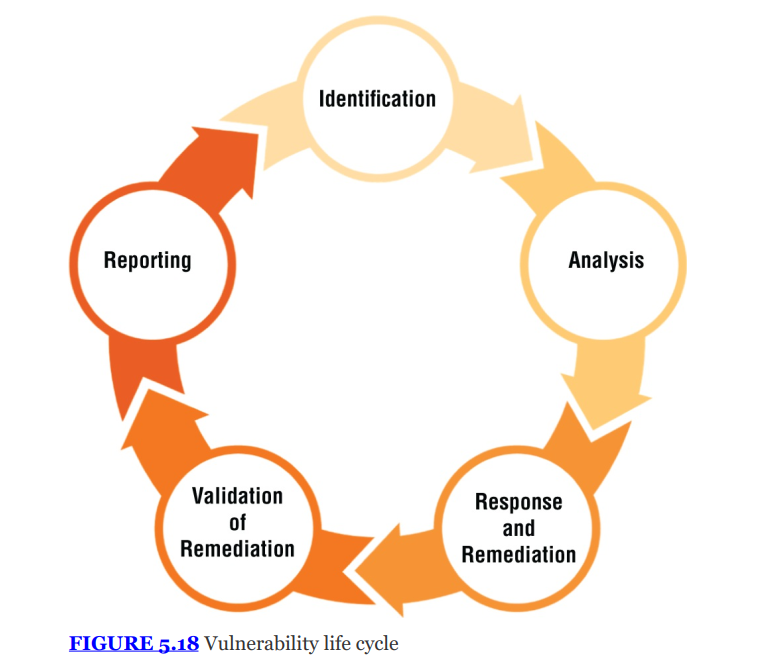

1. **Identification (Xác định):**
	- Phát hiện lỗ hổng thông qua _Vulnerability scans_, _Penetration tests_, hoặc các chương trình _Responsible disclosure/Bug bounty_.
2. **Analysis (Phân tích):**
	- Xác nhận lỗ hổng (loại bỏ False positives).
	- Phân loại và ưu tiên (_Prioritizing_) dựa trên điểm số CVSS, mức độ rủi ro (_Risk tolerance_), và tầm quan trọng của hệ thống.
3. **Response and Remediation (Phản hồi và Khắc phục):**
	- Đây là lúc hành động. Có 4 lựa chọn xử lý rủi ro chính:
		- **Patching:** Vá lỗi (cách tốt nhất).
		- **Segmentation:** Cô lập hệ thống.
		- **Compensating controls:** Dùng Firewall/IPS chặn.
		- **Exceptions/Exemptions:** Chấp nhận rủi ro (_Risk acceptance_) nếu chi phí sửa quá cao hoặc không thể sửa.
4. **Validation of Remediation (Xác nhận khắc phục):**
	- Sau khi sửa xong, **phải quét lại** (_rescanning_) để chắc chắn lỗ hổng đã biến mất.
5. **Reporting (Báo cáo):**
	- Gửi báo cáo cho các bên liên quan (_Stakeholders_).
	- Báo cáo không chỉ là danh sách lỗi, mà còn phải nêu bật xu hướng (_trends_) và đề xuất cải tiến quy trình.

## Summary {#2b97b0eb61a4809588e2c9931dbf95d4}


Phần này tóm tắt lại toàn bộ kiến thức của Chapter 5:

- Security assessment là chìa khóa để duy trì các biện pháp kiểm soát hiệu quả.
- **Vulnerability Scanning:** Tìm lỗi tự động (patch management, weak configurations).
- **Penetration Testing:** Đóng vai hacker tấn công (Offensive operations) để tìm lỗi sâu hơn.
- **Threat Hunting:** Giả định hệ thống đã bị hack (_presume compromise_) và đi tìm bằng chứng.
- **Audits:** Kiểm tra độc lập để lấy chứng nhận (Attestation).

## Exam Essentials {#2b97b0eb61a4802e8731ca1e0d22187c}


Đây là những kiến thức "bỏ túi" bắt buộc phải nhớ:

1. **Many vulnerabilities exist (Lỗ hổng có khắp nơi):**
	- On-premises (tại chỗ) và Cloud.
	- OS, Applications, Firmware.
	- Các lỗi phổ biến: _Weak configuration_, _Unsecured root accounts_, _Weak encryption_, _Default settings_, _Open ports_.
2. **False Positive vs. False Negative:**
	- _False Positive:_ Báo lỗi nhưng không có -> Gây phiền.
	- _False Negative:_ Báo sạch nhưng có lỗi -> Nguy hiểm.
3. **Vulnerability Scans vs. Penetration Testing:**
	- _Vuln Scan:_ Tự động, tìm lỗi đã biết (_known issues_), có thể Credentialed/Non-credentialed, Intrusive/Non-intrusive. Dùng CVSS để chấm điểm.
	- _Pentest:_ Thủ công, mô phỏng hacker, khai thác lỗi (_exploit_). Quy trình: _Reconnaissance_ -> _Initial access_ -> _Privilege escalation_ -> _Lateral movement_ -> _Persistence_ -> _Cleanup_.
4. **Security Audits:**
	- Kiểm tra sự tuân thủ (_compliance_).
	- Có thể là Internal hoặc Third-party.
	- Kết quả là _Attestation_.
5. **Vulnerability Life Cycle:** Nhớ 3 giai đoạn chính: _Identification_ -&gt; _Analysis_ -&gt; _Remediation_.
