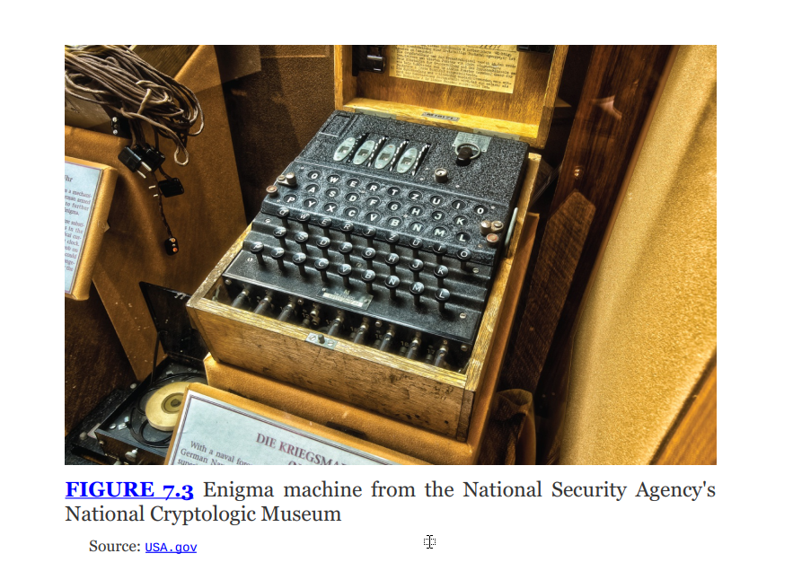
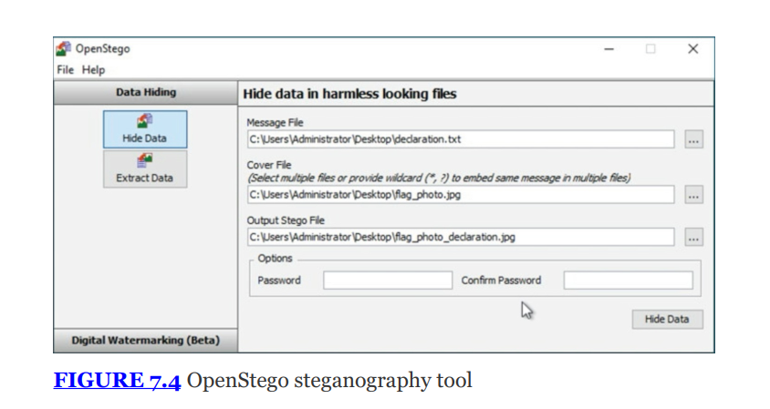
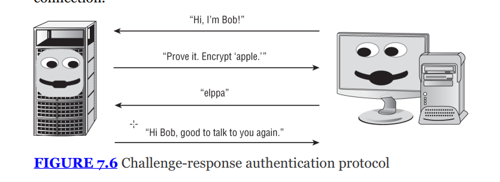
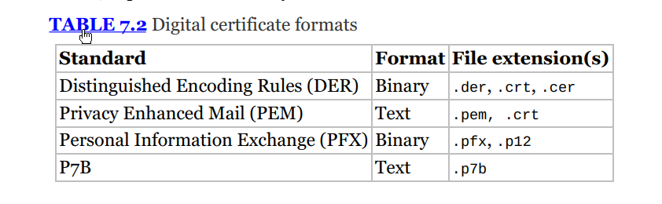

# THE COMPTIA SECURITY+ EXAM OBJECTIVES COVERED IN THIS CHAPTER INCLUDE: {#2bc7b0eb61a480bd9927e1775a02c0cb}

## Domain 1.0: General Security Concepts {#2bc7b0eb61a4807e9f03f508a2475722}

1.4. Explain the importance of using appropriate cryptographic solutions.

- Public key infrastructure (PKI) (Public key, Private key, Key escrow)
- Encryption (Level (Full-disk, Partition, File, Volume, Database, Record), Transport/communication, Asymmetric, Symmetric, Key exchange, Algorithms, Key length)
- Obfuscation (Steganography)
- Hashing
- Salting
- Digital signatures
- Key stretching
- Blockchain
- Open public ledger
- Certificates (Certificate authorities, Certificate revocation lists (CRLs), Online Certificate Status Protocol (OCSP), Self-signed, Third-party, Root of trust, Certificate signing request (CSR) generation, Wildcard)

## Domain 2.0: Threats, Vulnerabilities, and Mitigations {#2bc7b0eb61a480418229eaaf700c893b}

2.3. Explain various types of vulnerabilities.

- Cryptographic

2.4. Given a scenario, analyze indicators of malicious activity.

- Cryptographic attacks (Downgrade, Collision, Birthday)

---

## An Overview of Cryptography {#2bc7b0eb61a4802cab5befa55a536017}

- Định nghĩa:
	- Encryption: biến đổi plaintext thành cypher text sử dụng encryption key
	- Decryption: quá trình ngược lại

### Historical cryptography {#2bc7b0eb61a4801694fad6503ba64fe5}

Có hai loại cơ bản:

- Substitution
- Transposition

### Substitution {#2bc7b0eb61a480a48280f011e966c335}

Đại diện là Caesar và ROT13

- ROT13:
	- Là biến thể của Caesar
	- Dịch chuyển 13, vì bảng chữ cái tiếng Anh 26 chữ nên giải mã và mã hóa dùng chung thuật toán

### Polyalphabetic substitution {#2bc7b0eb61a480529996f41f688d6d98}

**Giải pháp - Vigenère Cipher:**

- Sử dụng một từ khóa (_keyword_) để chọn bảng thay thế.
- Ví dụ: Keyword là "APPLE". Chữ cái đầu dùng bảng A, chữ thứ 2 dùng bảng P... .
- Điều này làm xáo trộn tần suất chữ cái, khó giải mã hơn Caesar.

### **Transposition Ciphers (Mật mã hoán vị)** {#2bc7b0eb61a4809e8d5ad9fda0c0785d}

- **Cơ chế:** Không thay đổi chữ cái, chỉ **đảo lộn vị trí** của chúng (_scrambling/rearranging_).
- **Columnar Transposition (Hoán vị cột):**
	- Viết thông điệp thành các hàng ngang.
	- Sau đó đọc lại theo chiều dọc (cột) để tạo ra bản mã. (Xem **Figure 7.2**).

### **The Enigma Machine (Máy Enigma)** {#2bc7b0eb61a4805ea189ca2f7e0df8fe}

- Được Đức Quốc xã dùng trong Thế chiến II.
- Là một máy cơ điện (_electromechanical_) sử dụng hệ thống bánh răng quay (_rotary dials_) để thực hiện phép thế đa bảng phức tạp.
- Alan Turing và đội ngũ tại Bletchley Park đã phá mã thành công (chiến dịch Ultra), góp phần kết thúc chiến tranh.

## Obfuscation (Steganography) {#2bc7b0eb61a48010bad0fa5fd4dcbcdf}

- **Cryptography:** Làm cho thông điệp trở nên **vô nghĩa** (ai cũng thấy file mã hóa nhưng không đọc được).
- **Steganography:** Làm cho thông điệp trở nên **vô hình** (_hide messages in plain sight_).
	- Giấu tin mật vào trong một bức ảnh, file nhạc, hoặc video bình thường.
	- **Cơ chế:** Thay đổi các bit ít quan trọng nhất (_least significant bits - LSB_) của file ảnh. Mắt thường nhìn vào ảnh vẫn thấy đẹp như thường, nhưng máy tính đọc bit sẽ thấy thông điệp ẩn.
- **Ứng dụng:**
	- _Hợp pháp:_ Digital watermarking (đóng dấu bản quyền số).
	- _Bất hợp pháp:_ Gián điệp, tội phạm dùng để truyền tin bí mật.
- **Công cụ:** OpenStego (Xem **Figure 7.4**).

## Goals of cryptography {#2bc7b0eb61a480648ba0ca170cc2baff}

Tương ứng với CIA triad

- Confidentiality
- Integrity
- Authentication (chính ra là availability)
- Non-repudiation

### Confidentiality {#2bc7b0eb61a480e58e28e7a8135b9096}

Là mục tiêu được nhắc đến nhiều nhất

- Symmetric encyption
- Asymmetric encryption

### Data states {#2bc7b0eb61a480e1a082cd2de98f663b}

Phải biết bảo vệ data ở 3 trạng thái

- Data at rest: ở trên ổ cứng, SSD
- Data in transit: đang vận chuyển trên network
	- Còn gọi là data in motion, on the wire
	- Bảo vệ bằng TLS
	- Nguy cơ: bị nghe lén
- Data in use: đang xử lý trong RAM or CPU
	- Là trạng thái khó bảo vệ nhất, nếu hệ điều hành không cách ly tốt, tiến trình này có thể đọc bộ nhớ của tiến trình kia
- Obfuscation: không phải mã hóa, làm cho mã nguồn khó đọc, thường dùng để bảo vệ tài sản trí tuệ. Cho ví dụ và phân biệt obfuscation với steganography
- Steganography (giấu tin): giấu tin trong ảnh, video, ….  nhìn vào thì như bình thường
- Obfuscation: vẫn nhìn thấy nhưng làm cho thông tin trở nên khó hiểu, chả có nghĩa gì (làm mờ, gây rối). Lập trình viên đổi tên biến từ `CalculateSalary()` thành `a()`. Khi hacker đọc code, họ thấy hàm `a()` nhưng không hiểu nó làm gì.

### Encrypting data at rest (on disk) {#2bc7b0eb61a480879699c5c9b94ebd92}

- **Full-disk encryption (FDE):**
	- Mã hóa toàn bộ ổ cứng, bao gồm cả hệ điều hành.
	- _Ưu điểm:_ Tự động, người dùng không cần làm gì thêm. Bảo vệ tốt khi mất máy.
	- _Nhược điểm:_ Khi máy đã khởi động (_booted_), toàn bộ dữ liệu được giải mã và truy cập được. Nếu hacker xâm nhập khi máy đang chạy, FDE không có tác dụng..
- **Partition encryption (Mã hóa phân vùng):**
	- Chỉ mã hóa một phân vùng ổ cứng cụ thể (ví dụ ổ D:), chừa lại ổ C: không mã hóa.
	- Hữu ích cho hệ thống chạy song song 2 hệ điều hành (_dual-boot systems_).
- **File-level encryption:**
	- Mã hóa từng file riêng lẻ.
	- _Ưu điểm:_ Rất chi tiết (_granular_). Kể cả khi ổ cứng đang mở, user A không thể đọc file của user B nếu không có key.
- **Volume encryption:**
	- Mã hóa một "tập" (_volume_) lưu trữ, có thể chứa nhiều file và thư mục. Là điểm giữa của Partition và File-level.

### Encrypting Database Data (Mã hóa dữ liệu Cơ sở dữ liệu) {#2bc7b0eb61a480158758d077473c57a2}

Dữ liệu nhạy cảm trong Database cần được bảo vệ kỹ hơn:

1. **Transparent Data Encryption (TDE):** Mã hóa toàn bộ database. Ứng dụng không cần sửa code, database tự động mã hóa khi ghi xuống đĩa và giải mã khi đọc lên. Dùng 2 khóa:
	- DEK (Database encryption key);  là chìa khóa mã hóa dữ liệu trên db, lưu ngay trên db nhưng bị mã hóa
	- Certificate/Master key: là chìa khóa mã hóa DEK. Lưu ở db riêng (master) hoặc trong HSM
2. **Column-level Encryption (CLE):** Chỉ mã hóa các cột cụ thể (ví dụ: cột số thẻ tín dụng, cột số Social Security).
3. **Record-level encryption:** Mã hóa từng dòng (_row_) dữ liệu. Đây là mức độ chi tiết nhất (_more granular_), cho phép kiểm soát ai được xem dòng nào.

### Integrity {#2bc7b0eb61a4804eada2e4125c6d113a}

- Mục đích: đảm bảo dữ liệu không bị thay đổi
- Cơ chế:
	- Sử dụng hashing để tạo ra digital footprint
	- Sử dụng digital signature vừa đảm bảo integrity và non-repudiation
- Integrity không ngăn chặn sự thay đổi, nó chỉ phát hiện sự thay đổi

### Authentication {#2bc7b0eb61a480b6b5c5f4a48d236553}

- **Mục đích:** Xác minh danh tính (_verifies the claimed identity_).
- **Cơ chế Challenge-Response (Thách thức - Phản hồi):**
	- _Ví dụ (Figure 7.6):_ Alice muốn biết người kia có phải Bob không.
	- Alice gửi một câu đố (Challenge): "Hãy mã hóa chữ 'apple'".
	- Bob dùng **Shared Secret Key** (Khóa bí mật mà chỉ Bob và Alice biết) để mã hóa và gửi lại (Response): "elppa".
	- Alice giải mã thấy đúng → Tin đó là Bob.

### Non-repudiation {#2bc7b0eb61a4804daf2dcce2caf5054a}

- **Mục đích:** Ngăn chặn người gửi chối bay chối biến là "Tôi không gửi tin nhắn đó" (_prevents denying_).
- **Cơ chế:**
	- Phải sử dụng **Asymmetric Cryptosystems** (Hệ thống bất đối xứng / Khóa công khai).
	- Dùng **Digital Signatures**.
- **Quy tắc vàng (Cực quan trọng cho bài thi):**
	- **Secret key / Symmetric key** (Khóa đối xứng) **KHÔNG** cung cấp tính năng Non-repudiation. (Vì 2 người cùng giữ 1 khóa, người này có thể giả mạo người kia).
	- Chỉ có **Public key / Asymmetric** mới làm được điều này (Vì Private key là duy nhất của mỗi người).

## Modern cryptography {#2bc7b0eb61a4801b9547d34e623e0fa9}

### **Kerckhoffs' Principle (Nguyên lý Kerckhoffs)** {#2bc7b0eb61a480919f2ff1fd243dbd81}

Đây là nguyên lý vàng: _"The enemy knows the system"_ (Kẻ thù biết hệ thống hoạt động thế nào).

- Một hệ thống mật mã chỉ an toàn nếu mọi thứ về nó đều được công khai, **ngoại trừ chìa khóa**.
- Điều này cho phép cộng đồng cùng kiểm tra và tìm lỗi (_public scrutiny_), làm cho thuật toán mạnh hơn.

## Symmetric encryption {#2bc7b0eb61a480678ff8d99aa998a0b9}

- Cơ chế: sử dụng một khóa bí mật dùng chung cho các bên
- Ưu điểm:
	- Nhanh: gấp 1000-10000 lần so với asymmetric
	- Thích hợp để mã hóa dữ liệu lớn
- Nhược:
	- Key exchange: out-of-band phải gửi khóa bằng một kênh khác để nói chuyện bí mật
	- Dẫn đến scalability: nếu có n người muốn nói chuyện riêng với nhau sẽ cần tới n(n-1)/2 khóa
	- Không hỗ trợ non-repudiation

## Asymmetric encryption {#2bc7b0eb61a4807b8754db9046b3b394}

- Tên khác: public key encryption
- Cơ chế:
	- Sử dụng 2 khóa công khai và bí mật
	- Mã hóa bằng khóa này thì chỉ mở được bằng khóa kia
- Ưu điểm:
	- Key exchange: in-band - tức là dùng chung kênh giao tiếp
	- Scalability
	- Non-repudiation and authentication
- Nhược: chậm

## Hybrid encryption {#2bc7b0eb61a480e1bec8d6b0c03f48ce}

- Kết hợp ưu điểm của cả hai loại symmetric và asymmetric
- Dùng **Asymmetric** (chậm nhưng an toàn) để trao đổi khóa và xác thực ban đầu.
- Sau khi hai bên đã có khóa chung an toàn, chuyển sang dùng **Symmetric** (nhanh) để mã hóa dữ liệu truyền đi.
	- Khóa Symmetric lúc này được gọi là **Session Key** (Khóa phiên).

### Key Length (Độ dài khóa) {#2bc7b0eb61a4805e9454d0dd338c9397}

- Độ dài khóa quyết định sức mạnh của hệ thống (_work function_). Khóa càng dài càng khó phá.
- **Sự phát triển của sức mạnh máy tính** (Định luật Moore) buộc chúng ta phải tăng độ dài khóa theo thời gian.
- **Ví dụ:**
	- Ngày xưa: **DES 56-bit** là an toàn. Nay đã bị phá vỡ dễ dàng.
	- Ngày nay: Hệ thống Symmetric hiện đại dùng ít nhất **128-bit** (AES). Asymmetric (RSA) cần **2048-bit** trở lên.

| **Đặc điểm**        | **Symmetric (Đối xứng)**       | **Asymmetric (Bất đối xứng)** |
| ------------------- | ------------------------------ | ----------------------------- |
| **Số lượng khóa**   | 1 (Shared Secret)              | 2 (Public + Private)          |
| **Tốc độ**          | Nhanh (Fast)                   | Chậm (Slow)                   |
| **Quản lý khóa**    | Khó (Scalability kém)          | Dễ (Scalability tốt)          |
| **Trao đổi khóa**   | Khó (Cần kênh an toàn)         | Dễ (Công khai Public Key)     |
| **Mục đích chính**  | Mã hóa dữ liệu lớn (Bulk data) | Trao đổi khóa, Chữ ký số      |
| **Confidentiality** | Có                             | Có                            |
| **Non-repudiation** | Không                          | Có                            |

## Hashing {#2bc7b0eb61a480cb9c0cf1188961fcd2}

## Symmetric cryptography {#2bc7b0eb61a480d0832bf5ab0b02188e}

Giới thiệu về quản lý khóa (key management practices): tạo, phân phối, lưu trữ, hủy bỏ và khôi phục khóa đối xứng

### Creation and distribution {#2bc7b0eb61a480ecb530c2a0caa6b3bc}

Vấn đề là key exchange sao cho an toàn:

- Offline distribution:
	- Gặp mặt trực tiếp và đưa key
	- Đơn giản về kỹ thuật, nhưng chậm và tốn kém vẫn có rủi ro vật lý
- Public key encryption: sử dụng mã hóa asymmetric để thiết lập kết nối an toàn sau đó chuyển khóa → cách SSL/TLS hoạt động
- Diffie-Hellman key exchange:
	- Đây là thuật toán trao đổi khóa mang tính cách mạng (ra đời năm 1976).
		- **Ông A làm:** Lấy `Public Key của B` kết hợp với `Private Key của A`.
		- **Ông B làm:** Lấy `Public Key của A` kết hợp với `Private Key của B`.
		- **Kết quả kỳ diệu:** Cả hai ông, dù làm hai phép tính khác nhau, nhưng lại **ra cùng một kết quả số học**.
	- _Cơ chế:_ Cho phép hai người (Richard và Sue) chưa từng gặp nhau, không có kênh liên lạc an toàn trước đó, có thể cùng nhau tạo ra một khóa bí mật chung (_shared secret key_) ngay trên môi trường công cộng mà hacker nghe lén cũng không biết được khóa đó là gì.
	- _Toán học:_ Dựa vào độ khó của bài toán Logarithm rời rạc. (Xem hộp "About the Diffie-Hellman Algorithm").
1. The communicating parties (we'll call them Richard and Sue) agree on two large numbers: p (which is a prime number) and g (which is an integer) such that 1 &lt; g &lt; p.
2. Richard chooses a random large integer r and performs the following calculation:

	$$
	R = g^r \mod p
	$$

3. Sue chooses a random large integer s and performs the following calculation:

	$$
	 S = g^s \mod p
	$$

4. Richard sends R to Sue and Sue sends S to Richard.

	$$
	K = S^r \mod p
	$$

5. Richard then performs the following calculation:
6. Sue then performs the following calculation:

	$$
		K = R^s \mod p
	$$

7. At this point, Richard and Sue both have the same value, K, and can use this for secret key communication between them.

### Symmetric cryptography algorithms {#2bc7b0eb61a480fba309d985475880b2}

### **A. Data Encryption Standard (DES)** {#2bc7b0eb61a480e0bf3ed58a428c58e9}

- **Lịch sử:** Được chính phủ Mỹ công bố năm 1977.
- **Độ dài khóa:** 56-bit.
- **Tình trạng:** Đã bị coi là **không an toàn** (_insecure_) do khóa quá ngắn, dễ bị bẻ gãy bởi sức mạnh máy tính hiện đại.

### **B. Triple DES (3DES)** {#2bc7b0eb61a480538b0bfeb1453848df}

- **Cơ chế:** Dùng thuật toán DES chạy 3 lần liên tiếp với 3 khóa khác nhau để tăng độ mạnh.
- **Tình trạng:** An toàn hơn DES, nhưng hiện tại cũng bị coi là không an toàn và đã bị loại bỏ (_deprecated_) vào năm 2023.

### **C. Advanced Encryption Standard (AES)** {#2bc7b0eb61a48018aa39d18799d66d3a}

- **Lịch sử:** Được NIST chọn làm chuẩn thay thế DES vào năm 2001 (thuật toán gốc tên là Rijndael).
- **Độ dài khóa:** Hỗ trợ 128, 192, và 256 bits.
- **Tình trạng:** Là tiêu chuẩn vàng hiện nay (_most widely used_), được dùng trong Wifi (WPA2), HTTPS (TLS), mã hóa ổ cứng. Rất an toàn và nhanh.

## Storage and destruction of symmetric keys {#2bc7b0eb61a48094b764ef3dd39ab41b}

- Quy tắc 1: không bao giờ lưu khóa cùng chỗ dữ liệu bị mã hóa (never store encryption key on the same system)
- Split knowledge: chia khóa làm 2 phần và cho 2 người giữ
- Key update: Khi người dùng rời tổ chức, phải thay đổi khóa và mã hóa lại dữ liệu → điểm yếu của symmetric vì rất tốn công

### Key escrow and recovery {#2bc7b0eb61a4801a9e73d48ebd4597f3}

Ký quỹ và khôi phục

- **Vấn đề:** Nếu nhân viên nghỉ việc hoặc làm mất khóa, dữ liệu công ty sẽ bị mất vĩnh viễn vì không ai giải mã được.
- **Giải pháp - Key Escrow:** Gửi một bản sao của khóa cho bên thứ 3 (hoặc két sắt của công ty) giữ hộ để dùng trong trường hợp khẩn cấp.
- **MPO (Recovery Agents):** Trong hệ thống PKI của Microsoft, có những tài khoản quản trị đặc biệt gọi là Recovery Agents có thể giải mã dữ liệu của user khi cần.

## Asymmetric Cryptography {#2bc7b0eb61a48009bdeefd63f51d9368}

### RSA Algorithm (Thuật toán RSA) {#2bc7b0eb61a480a3b1d1c203742e2832}

- **Tên gọi:** Viết tắt của 3 người sáng tạo: **R**ivest, **S**hamir, **A**dleman (1977).
- **Độ phổ biến:** Là tiêu chuẩn toàn cầu (_worldwide standard_) cho mã hóa khóa công khai.
- **Nguyên lý toán học:** Dựa trên độ khó của việc phân tích thừa số nguyên tố các số lớn (_factoring large prime numbers_).
- **Ứng dụng:** Dùng để trao đổi khóa Symmetric, Chữ ký số, và mã hóa email (PGP).

### **Key Length (Độ dài khóa - Khung quan trọng)** {#2bc7b0eb61a48026a84ee77c8d5b7be1}

- Độ dài khóa quyết định độ an toàn.
- **Quy luật Moore:** Sức mạnh máy tính tăng gấp đôi mỗi 2 năm → Khóa phải dài hơn theo thời gian.
- **RSA:** Yêu cầu khóa dài hơn nhiều so với Symmetric (ví dụ: RSA 1024-bit chỉ an toàn tương đương với Elliptic Curve 160-bit).
- **Cloud Computing:** Kẻ tấn công có thể thuê sức mạnh tính toán đám mây giá rẻ để bẻ khóa, do đó cần chọn khóa đủ dài để chống lại điều này.

### Elliptic curve cryptography -ECC {#2bc7b0eb61a480f9bdd7f80c24e88daa}

- Ra đời năm 1985, bởi Neal Koblitz và Victor Miller
- Nguyên lý: dựa trên toán logarit rời rạc trên đường cong elliptic
- **Ưu điểm vượt trội:**
	- Cung cấp độ bảo mật tương đương RSA nhưng với **khóa ngắn hơn rất nhiều**. (Ví dụ: ECC 160-bit ~ RSA 1024-bit).
	- **Hiệu suất cao:** Tốn ít tài nguyên tính toán và pin hơn.
- **Ứng dụng:** Lý tưởng cho các thiết bị di động (_mobile devices_), IoT, Smart cards nơi tài nguyên hạn chế.

### Hash Functions (Hàm băm) {#2bc7b0eb61a4807aaac9e4b9da0355ba}

Đây là công cụ để đảm bảo **Integrity** (Tính toàn vẹn).

- **Định nghĩa:**) đầu ra cóo định gọi là **Message Digest** (hoặc _hash value, fingerprint_).
- **Tính chất bắt buộc (5 yêu cầu):**
	1. Input dài bao nhiêu cũng được.
	2. Output luôn có độ dài cố định.
	3. Dễ tính toán (_easy to compute_).
	4. **One-way (Một chiều):** Không thể suy ngược lại input từ output.
	5. **Collision free (Không va chạm):** Cực kỳ khó để tìm ra 2 input khác nhau mà có cùng 1 output.

**Mục đích sử dụng:**

1. **Kiểm tra toàn vẹn:** So sánh Hash của file tải về với Hash gốc. Nếu khác nhau → File đã bị sửa đổi.
2. **Lưu trữ mật khẩu:** Hệ thống không lưu mật khẩu rõ, chỉ lưu Hash của mật khẩu.
3. **Digital Signatures:** Dùng trong quy trình ký số.

---

### Common Hash Algorithms (Các thuật toán băm phổ biến) {#2bc7b0eb61a480e39fe2ccfcd35c840f}

### **SHA (Secure Hash Algorithm)** {#2bc7b0eb61a4808a89ecd7956337a71f}

Được NIST và chính phủ Mỹ chuẩn hóa.

- **SHA-1:** Tạo ra digest 160-bit. Đã bị coi là **không an toàn** (_insecure_) do điểm yếu va chạm.
- **SHA-2:** Bản nâng cấp an toàn. Các biến thể phổ biến:
	- **SHA-256:** Digest 256-bit. Dùng trong Bitcoin, SSL.
	- **SHA-512:** Digest 512-bit.
- **SHA-3 (Keccak):** Chuẩn mới nhất (2015), dùng kiến trúc khác với SHA-2, an toàn hơn.

### **MD5 (Message Digest 5)** {#2bc7b0eb61a480e48bfffe514d2cb938}

- Tạo ra digest 128-bit.
- **Tình trạng:** Đã bị phá vỡ hoàn toàn (_subject to collisions_). Không nên dùng cho bảo mật nghiêm ngặt, chỉ dùng để check lỗi file đơn giản.

## Digital Signatures {#2bc7b0eb61a480c7b9c7d5db0e5d3518}

Quá trình tạo ký số

- Hashing: Alice tạo một message digest của tin nhắn gốc bằng thuật toán SHA
- Signing: mã hóa hash đó bằng private key của Alice → digital signature
- Appending: gửi kèm message (dạng plaintext) với digital signature
- Sending: gửi cho Bob

Bob nhận được:

- Dùng public key của Alice giải mã và nhận được digest
- Băm message dạng plaintext đã nhận được và so sánh với digest
- Nếu giống nhau thì integrity đảm bảo và ngược lại

:::tip

Digital signature không mã hóa message. Muốn mã hóa message để đảm bảo tính confidentiality thì Alice dùng khóa công khai của Bob để mã hóa message

:::

## HMAC {#2bc7b0eb61a480ec87f9cc7600ada9eb}

- Là phép lai giữa Hashing và symmetric key
- Mục đích: đảm bảo integrity và authentication
- Hạn chế: không cung cấp authentication
- Ứng dụng: dùng trong IPSec, SSL/TLS

### Which key should i use {#2bc7b0eb61a480fa84e9f2e9a176eaed}

- Muốn mã hóa tin nhắn: dùng khóa công khai của người nhận
- Muốn giải mã tin nhắn: dùng khóa cá nhân của mình
- Muốn kiểm tra chữ ký: dùng khóa công khai của người gửi
- Muốn ký số: dùng khóa bí mật của mình

## Public key infrastructure {#2bc7b0eb61a480f68ceec167992dcab8}

- Vai trò: PKI là hệ thống phân cấp các mối quan hệ tin cậy (hierarchy of trust relationship) giúp kết hợp symmetric, asymmetric và hashing để tạo nên hybrid cryptography
- Mục đích: cho phép những người chưa từng quen biết nhau có thể giao tiếp an toàn

## Certificates {#2bc7b0eb61a4802eae6af7f6311e67c2}

### Digital cert {#2bc7b0eb61a480efa6fbf88e81adcf01}

- Chứng chỉ điện tử để xác minh danh tuinh
- Nó liên kết danh tính của chủ sở hữu (người, máy chủ, email) với public key của họ.
- Được ký số bởi CA (certificate authority)
- Tuân theo tiêu chuẩn quốc tết X.509

:::tip

Các thành phần trong X.509
- **Version:** Phiên bản X.509.

- **Serial number:** Số sê-ri duy nhất do CA cấp.

- **Signature algorithm identifier:** Thuật toán dùng để ký.

- **Issuer name:** Tên của CA cấp phát (Ví dụ: DigiCert, Let's Encrypt).

- **Validity period:** Thời hạn sử dụng (Start date - End date).

- **Subject's Common Name (CN):** Tên chủ sở hữu (Ví dụ: `www.google.com` hoặc `Bob Smith`).

- **Subject Alternative Names (SANs):** Các tên miền phụ hoặc IP khác được bảo vệ bởi cùng chứng chỉ này.

- **Subject's Public Key:** Phần quan trọng nhất ("the meat"), chứa Public Key của chủ sở hữu.

:::

Khi đăng ký mới thì cần các thông tin DN (distinguished name)

- Country (C), State (ST), City (L), Organization (O), Unit (OU), common name (CN) và email
- Không có field số điện thoại

### Wildcard certificates {#2bc7b0eb61a4800ab927ed03e4a08b9f}

- chứng chỉ dùng cho nhiều tên miền con
- Ký hiệu bằng dấu sao . Ví dụ: `.certmike.com` sẽ bảo vệ cho `www.certmike.com`, `mail.certmike.com`, `secure.certmike.com`.
- **Lưu ý:** Chỉ bảo vệ được 1 cấp subdomain (Ví dụ: `www.cissp.certmike.com` sẽ không hợp lệ).

## Certificate authorities (CAs) {#2bc7b0eb61a480be82c2c0da874e095a}

- Là bên thứ 3 đứng ra xác nhận danh tính
- **Các CA lớn:** IdenTrust, AWS, DigiCert, Sectigo, GlobalSign, Let's Encrypt, GoDaddy.
- **Trust Model (Mô hình tin cậy):** Trình duyệt web (Chrome, Firefox) được cài sẵn danh sách các **Root CA** uy tín. Nếu một chứng chỉ được ký bởi Root CA này, trình duyệt sẽ tự động tin tưởng.

### Registration Authorities {#2bc7b0eb61a4803e83f5ca4f8020d5f1}

- Là trợ lý của CA
- Xác minh danh tính người dùng trước khi CA cấp chứng chỉ

### CA hierarchy {#2bc7b0eb61a48014a129dcc90afe458f}

- Root CA: CA cao nhất, tự ký chứng chỉ cho mình, Private key của Root CA quan trọng, chỉ lưu offline
- Intermediate CAs: được Root CA ủy quyền. Thường hoạt động online
	- Hoạt động online 24/7
	- trực tiếp nhận CSR và cấp cert cho người dùng/thiết bị
	- Lợi ích: nếu bị hack thiệt hạng được khoanh vùng mà không ảnh hưởng tới root CA
- Certificate Chaining: trình duyệt kiểm tra chuỗi tin cậy từ chứng chỉ web → intermediate CA → root CA

**Internal CAs (CA nội bộ):**

- Tổ chức có thể tự dựng CA riêng để cấp chứng chỉ nội bộ (Self-signed).
- Tiết kiệm tiền, nhưng trình duyệt bên ngoài sẽ báo lỗi "Không tin cậy" (_Untrusted_).
- Xài như nào:
	- Dev dùng self-signed cert để test HTTPS mà không cần mua chứng chỉ xịn
	- IoT/Router cũ: một số router wifi quản trị qua web thường dùng self-signed cert
	- **Nhược điểm:** Khi truy cập, trình duyệt sẽ hiện cảnh báo đỏ lòm: **"Your connection is not private"**. Người dùng phải bấm "Advanced → Proceed anyway" mới vào được.
- Nhược điểm:
	- thiếu chain of trust dẫn đến lỗi root of trust validation failed
	- Trình duyệt báo untrusted
	- Dữ liệu vẫn được mã hóa, nhưng authentication không đảm bảo

## Certificate Generation and Destruction (Tạo và Hủy chứng chỉ) {#2bc7b0eb61a48019bdc1e1a80322da18}

### **Enrollment (Đăng ký)** {#2bc7b0eb61a48088a5e9fae1f8379ae6}

- Quy trình chứng minh danh tính để xin cấp chứng chỉ.
- **CSR (Certificate Signing Request):** Đây là file yêu cầu xin cấp chứng chỉ.
	- Bạn tạo cặp khóa (Public/Private).
	- Bạn gửi **Public Key** của bạn kèm thông tin cá nhân trong file **CSR** gửi lên CA.
	- CA xác minh xong sẽ ký vào CSR và trả về file Certificate `.crt`.

### **Verification (Xác minh)** {#2bc7b0eb61a480fe9d53dfecb1810b46}

- **Domain Validation (DV):** Xác minh đơn giản (chứng minh bạn sở hữu tên miền qua email/DNS).
- **Extended Validation (EV):** Xác minh kỹ lưỡng (kiểm tra giấy phép kinh doanh). Chứng chỉ EV có độ tin cậy cao nhất.

### **Revocation (Thu hồi)** {#2bc7b0eb61a4800fa7e7dd03dc70dd06}

Đôi khi chứng chỉ phải bị hủy trước thời hạn (do lộ Private Key hoặc nhân viên nghỉ việc).

1. **CRL (Certificate Revocation List):**
	- Danh sách đen các số sê-ri chứng chỉ bị thu hồi.
	- **Nhược điểm:** Có độ trễ (_latency_). Browser phải tải cả danh sách về, tốn băng thông.

	:::tip
	
	- **Phân biệt hai cái chết của Certificate:**
	
	- **Quy tắc:** CRL chỉ chứa các chứng chỉ **đáng lẽ vẫn còn hạn nhưng bị hủy bỏ**.
	
	:::
	
	

2. **OCSP (Online Certificate Status Protocol):**
	- Kiểm tra trạng thái thời gian thực (_real-time_).
	- Browser gửi số sê-ri lên máy chủ OCSP của CA và nhận câu trả lời: Good/Revoked/Unknown.
	- **Nhược điểm:** Gây quá tải cho máy chủ CA và lộ quyền riêng tư (CA biết user đang vào web nào).
3. **Certificate Stapling:**
	- Web Server (của mình) tự đi hỏi OCSP server định kỳ, lấy bản xác nhận có chữ ký số và đính kèm (_staples_) vào quá trình bắt tay với người dùng.
		- Coi như server ghim OCSP response với cert của mình đỡ mất công client đi hỏi
	- Giúp giảm tải cho CA và bảo vệ quyền riêng tư người dùng.

:::tip

- The Online Certificate Status Protocol (OCSP) provides realtime checking of a digital certificate's status using a remote server.

- Certificate stapling attaches a current OCSP response to the certificate to allow the client to validate the certificate without contacting the OCSP server.

- Certificate revocation lists (CRLs) are a slower, outdated approach to managing certificate status.

- Certificate pinning is used to provide an expected key, not to manage certificate status

:::

### Quy trình xin cấp chứng chỉ (CSR) {#2d87b0eb61a480e3862bd191bdb6abf2}

- Tạo cặp khóa và gửi yêu cầu (applicant);
	- Người xin cấp tạo ra một cặp khóa: private key và public key
	- Tạo file CSR chứa: public key + thông tin định danh (tên miền, tên công ty) và gửi cho CA
- Xác thực: CA
	- CA nhận CSR và kiểm tra để xác minh bạn là chủ sở hữu. VD: gửi email xác nhận về cho bạn hoặc yêu cầu bạn tạo một bản ghi DNS đặc biệt
- Ký và cấp hát:
	- Sau khi xác minh xong thì CA dùng private key của CA để ký điện tử lên chứng chỉ của bạn
	- CA gửi lại file chứng chỉ hoàn chỉnh cho bạn
	- Bạn cài nó lên web server

## Certificate Formats {#2bc7b0eb61a4806bb64cefa85420a535}

Bạn cần nhớ các đuôi file này cho bài thi:

- **DER (Distinguished Encoding Rules):** Định dạng Binary (nhị phân). Đuôi: `.der`, `.crt`, `.cer`.
- **PEM (Privacy Enhanced Mail):** Định dạng Text (ASCII), thường bắt đầu bằng `----BEGIN CERTIFICATE-----`. Đuôi: `.pem`, `.crt`.
- **PFX / P12 (Personal Information Exchange):** Định dạng Binary của Windows, chứa cả Public Key và Private Key (thường dùng để backup/chuyển khóa). Đuôi: `.pfx`, `.p12`.
- **P7B:** Định dạng Text cũng của windows, chỉ chứa Certificates và Chain, không chứa Private Key.

## Cần nhớ {#2bc7b0eb61a48038b472d754f365ef53}

:::tip

- **CSR:** Bạn gửi cái này cho CA để xin chứng chỉ.

- **OCSP Stapling:** Web Server tự chứng minh mình "sạch" thay vì bắt User đi hỏi CA.

- **Wildcard (*):** Chỉ bảo vệ 1 cấp subdomain.

- **Root CA:** Luôn giữ Offline.

- **PFX/P12:** Chứa Private Key (cần bảo vệ kỹ).

:::

## Asymmetric Key Management {#2bc7b0eb61a48019b3dac6a5c0a45005}

Trong hệ thống PKI quản lý khóa còn quan trọng hơn cả thuật toán

### Choosing encryption system {#2bc7b0eb61a4803bafc9f4c417415d77}

- Avoid security through obscurity:
	- Không dùng thuật toán bí mật (proprietary) hay các hệ thống hộp đen
	- Nên chọn thuật toán công khai đã được công nhận là an toàn

### Chọn khóa và entropy {#2bc7b0eb61a480749023f14a58feb590}

- Chọn khóa cân bằng giữa bảo mật và hiệu suất
- Entropy: phải đảm bảo tính ngẫu nhiên, tránh sử dụng weak keys (đã biết)

### Protecting private key {#2bc7b0eb61a480068d4df26063587c79}

- Giữ bí mật tuyệt đối
- Nếu lộ thì nguy hiểm

### Key lifecycle {#2bc7b0eb61a48004a664f9fb7c5a0b1b}

- Key rotation:
	- Cần thay đổi khóa sau một khoảng thời gian useful life
	- Sử dụng lâu tạo ra nhiều dữ liệu mã hóa, khiến hacker có data và thời gian để phân tích
- Key backups and escrow:
	- Back up: bắt buộc
	- Escrow: gửi khóa cho bên thứ 3 để khôi phục trong trường hợp bị mất

### Hardware security modules - HSMs {#2bc7b0eb61a4803aaa4fdbf282024444}

- Chức năng: là thiết bị chuyên dụng lưu trữ và quản lý khóa trong môi trường doanh nghiệp
- Loại:
	- Thiết bị cá nhân: YubiKey (USB token) để lưu khóa cá nhân
	- Thiết bị doanh nghiệp
	- Cloud-based HSMs: AWS, Azure cung cấp HSM cho thuê (IaaS)

	:::tip
	
	IaaS (infrastructure as a Service)
	- Định nghĩa: bạn thuê cơ sở hạ tầng thô (máy chủ ảo, đường mạng, ổ cứng lưu trữ). Nhà cung cấp chỉ lo phần cứng mạng, còn lại bạn chịu
	
	- Vd: như việc thuê xe ô tô, người ta cung cấp xe, bạn tự lái, tự đổ xăng
	
	- **Trong CNTT:**
	
	- **Trách nhiệm bảo mật:** Bạn chịu trách nhiệm rất lớn (bảo mật hệ điều hành, tường lửa, ứng dụng, dữ liệu).
	
	SaaS - Software as a Service
	
	- Định nghĩa: thuê phần mềm đã hoàn thiện và sử dụng luôn
	
	- Vd: giống như đi taxi hoặc grab
	
	- **Trong CNTT:**
	
	- **Trách nhiệm bảo mật:** Nhà cung cấp lo hết việc bảo mật hệ thống. Bạn chỉ chịu trách nhiệm bảo vệ **Mật khẩu** và **Dữ liệu** của mình (chia sẻ cho ai).
	
	:::
	
	

	---

	### Một khái niệm ở giữa: PaaS (Platform as a Service)

	Để bức tranh hoàn chỉnh, còn một cái nằm giữa IaaS và SaaS gọi là **PaaS (Nền tảng như một dịch vụ)**.

	- **Ví dụ:** Giống như bạn **Thuê taxi nhưng bạn là người lái**. Nhà xe lo xăng xe, bảo dưỡng, bạn chỉ việc leo lên lái đi đâu tùy thích.
	- **IT:** Dành cho lập trình viên (Heroku, Google App Engine). Bạn chỉ cần up code lên, nhà cung cấp lo hệ điều hành và môi trường chạy code.

	| **Đặc điểm**        | **IaaS (Hạ tầng)**                                          | **SaaS (Phần mềm)**                                          |
	| ------------------- | ----------------------------------------------------------- | ------------------------------------------------------------ |
	| **Bạn quản lý**     | Hệ điều hành, Ứng dụng, Dữ liệu, Runtime, Middleware.       | Chỉ quản lý **Dữ liệu** và **Quyền truy cập** (User Access). |
	| **Nhà cung cấp lo** | Phần cứng (Server), Lưu trữ (Storage), Mạng vật lý, Ảo hóa. | **TẤT CẢ** (từ phần cứng đến phần mềm ứng dụng).             |
	| **Độ linh hoạt**    | Cao nhất (Muốn cài gì thì cài).                             | Thấp (Dùng theo tính năng họ cung cấp).                      |
	| **Kỹ năng cần có**  | Quản trị mạng, quản trị hệ thống (SysAdmin).                | Người dùng cuối (End-user) hoặc Admin quản lý user.          |
	| **Ví dụ điển hình** | AWS EC2, DigitalOcean, Azure VM.                            | Gmail, Office 365, Zoom, **Qualys**.                         |

## Cryptographic attacks {#2bc7b0eb61a48026b0e1cd6015b21118}

### Brute-force {#2bc7b0eb61a4807e97d3e4ffadcaa114}

- Cơ chế: thử tất cả
- Chắc chắn thành công, nhưng lâu

### Frequency analysis {#2bc7b0eb61a4800880f7cf2681ff4739}

- Cơ chế: tìm mẫu lặp lại

### Known Plain Text {#2bc7b0eb61a480b48d80c58f95b0994b}

- **Cơ chế:** Kẻ tấn công có trong tay một cặp **[Bản rõ]** và **[Bản mã]** tương ứng. Từ đó, họ cố gắng tìm ra **Khóa**.
- **Ví dụ lịch sử:** Trong Thế chiến II, quân Đồng minh biết rằng mọi tin nhắn của Đức đều kết thúc bằng "Heil Hitler". Họ dùng đoạn văn bản rõ này để phá khóa máy Enigma.

### **Chosen Plain Text** {#2bc7b0eb61a48014b7f3c1a14c73339e}

- **Cơ chế:** lừa nạn nhân mã hóa plaintext hacker đã chọn
- **Mục đích:** Kẻ tấn công quan sát xem "Đầu vào A" sẽ tạo ra "Đầu ra B" như thế nào, từ đó suy ngược ra khóa.

### **Related Key Attack (Tấn công khóa liên quan)** {#2bc7b0eb61a4806ba04bc965c43f8528}

- **Cơ chế:** Tương tự như Chosen Plain Text, nhưng kẻ tấn công có thể thu thập được các bản mã được mã hóa bởi hai khóa khác nhau (như public key và private key) nhưng có liên quan toán học với nhau.

### **Birthday Attack (Tấn công sinh nhật) - QUAN TRỌNG** {#2bc7b0eb61a480be89d7e91d118bc4a4}

- **Mục tiêu:** Tấn công vào **Hash functions** (Hàm băm) để tìm ra sự va chạm (**Collision**).
- **Nghịch lý sinh nhật (Birthday Paradox):**
	- Hỏi: Cần bao nhiêu người trong phòng để xác suất có 2 người trùng ngày sinh nhật là 50%?
	- Trả lời: Chỉ cần **23 người** (con số nhỏ đáng ngạc nhiên so với 365 ngày).

**Ý nghĩa trong mật mã:** Để tìm ra 2 tin nhắn khác nhau có cùng một mã Hash (Collision), bạn không cần thử hết $2^{128}$ khả năng. Bạn chỉ cần thử khoảng $\sqrt{2^n} \space$ lần tương đương  $ 2^{64}$ lần với MD5. Điều này làm cho việc phá hàm băm dễ hơn nhiều so với tưởng tượng.

### **Downgrade Attack (Tấn công hạ cấp)** {#2bc7b0eb61a480459d3ac403e967be06}

- **Mục tiêu:** Lừa người dùng hoặc hệ thống chuyển sang sử dụng một phiên bản giao thức yếu hơn, kém bảo mật hơn.
- **Ví dụ:** Kẻ tấn công đứng giữa (Man-in-the-middle) can thiệp vào quá trình bắt tay TLS, ép máy chủ và trình duyệt sử dụng phiên bản SSL 3.0 cũ kỹ (có nhiều lỗ hổng) thay vì TLS 1.3 mới nhất.

### Hashing, Salting, and Key Stretching {#2bc7b0eb61a48065ba33fe40e894e054}

- Rainbow table: bảng ánh xạ những mật khẩu phổ biến
- Key stretching: ví dụ như PasswordBased Key Derivation Function v2 (PBKDF2) 
dùng hàng ngàn lần salt + hashing để tạo key

### Exploiting weak keys {#2bc7b0eb61a480839d82e263ec2688de}

- Những thuật toán mạnh như AES nhưng lại dùng key yếu (số bé) thì cũng dễ bị giải mã.
- Ví dụ: trong WEP (wireless equivalent privacy) protocol sử dụng RC4 - yếu. Nên giờ không được xài nữa

### Exploiting Human error {#2bc7b0eb61a48025af7bca8624c2e073}

Lỗi con người mới là nguyên nhân lớn nhất gây ra lỗ hổng mã hóa

- **Gửi nhầm:** Gửi email mật nhưng không mã hóa (_in the clear_).
- **Mất khóa:** Để lộ khóa bí mật.
- **Cấu hình sai:** Sử dụng thuật toán yếu hoặc đã bị loại bỏ (_deprecated algorithms_) như DES, WEP.

## Emerging issues in cryptography {#2bc7b0eb61a4807880f6f5f1c7b275df}

### **A. Tor and the Dark Web** {#2bc7b0eb61a4807fbd3ff7ecec627b1c}

- **Tor (The Onion Router):** Mạng lưới giúp ẩn danh người dùng bằng cách định tuyến lưu lượng qua nhiều lớp máy chủ trung gian được mã hóa.
- **Dark Web:** Các trang web ẩn chỉ truy cập được qua Tor.
- Perfect forward secrecy (PFS): nếu khóa phiên hiện tại bị lộ, các phiên làm việc trong quá khứ vẫn an toàn

### **B. Blockchain** {#2bc7b0eb61a480658647f35a6dcdf332}

- **Cơ chế:** Là một cuốn sổ cái công khai (_open public ledger_) phân tán.
- Quy trình: mỗi cá nhân đều có một bản sao của ledger này, để theo dõi giao dịch, không ai có quyền tối cao
	- Request: bạn tạo một yêu cầu chuyển tiền bitcoin, tạo một lệnh giao dịch
	- Broadcast: lệnh giao dịch không gửi đến máy chủ trung tâm nào. Nó chuyển tới tất cả các node trong mạng lưới
	- Verification: các máy tính trong mạng sẽ kiểm tra bạn có đủ tiền để chuyển không, nếu đúng thì họ chấp nhận giao dịch này vào một block
	- Hashing: là bước quan trọng nhất
		- Hệ thống sẽ lấy dữ liệu của khối hiện tại + hash của khối trước đó để tạo ra một mã băm mới duy nhất
		- chính là ý nghĩa của chain
	- Add to chain: khối mới được nối đuôi vào chuỗi khối hiện tại trên tất cả máy tính, giao dịch hoàn tất.
	- Immutability:
		- Hacker muốn xâm nhập và lấy dữ liệu khối 50. Nếu sửa thì dữ liệu thay đổi → hash thay đổi, dãy bị đứt gãy.
		- Các máy tính khác trong mạng thấy chuỗi của hacker khác với bản sao của họ nên từ chối và loại bỏ chuỗi giả mạo
- **Bảo mật:** Dựa trên Hashing. Mỗi khối (block) chứa Hash của khối liền trước nó. Nếu ai đó sửa đổi dữ liệu trong quá khứ, Hash sẽ thay đổi và làm hỏng toàn bộ chuỗi phía sau → Đảm bảo tính toàn vẹn (_Integrity_).
- Ứng dụng: bitcoin, chuỗi cung ứng, hồ sơ sở hữu tài sản
	- Thanh toán: không cần ngân hàng (swift)
	- Supply chain monitoring
	- Digital identification: lưu trữ hộ chiếu, bằng lái xe an toàn
	- Digital voting: đảm bảo lá phiếu chính xác.

### **C. Lightweight Cryptography (Mật mã hạng nhẹ)** {#2bc7b0eb61a48088a9b1d3a1315e5471}

- Dành cho các thiết bị IoT, cảm biến, thẻ thông minh có nguồn điện và CPU hạn chế.
- Cần các thuật toán tốn ít năng lượng nhưng vẫn đủ mạnh (ví dụ: Elliptic Curve), độ trễ thấp

### **D. Homomorphic Encryption (Mã hóa đồng hình)** {#2bc7b0eb61a480888283e12096c7d9cb}

- **Khái niệm:** Cho phép thực hiện tính toán trên dữ liệu **đang được mã hóa** mà không cần giải mã nó ra.
- **Ví dụ:** Bạn gửi dữ liệu lương (đã mã hóa) lên Cloud. Cloud tính tổng lương và trả về kết quả (vẫn mã hóa). Cloud không bao giờ biết lương cụ thể là bao nhiêu.

### **E. Quantum Computing (Máy tính lượng tử)** {#2bc7b0eb61a4803a82f6c092b6e19e06}

- **Nguy cơ:** Máy tính lượng tử có sức mạnh tính toán vượt trội, có thể bẻ gãy các thuật toán Asymmetric hiện tại (như RSA, ECC) trong tích tắc.
- **Post-Quantum Cryptography:** Là lĩnh vực nghiên cứu các thuật toán mới có khả năng chống lại máy tính lượng tử.

---

**Tóm tắt trọng tâm cho kỳ thi:**

- **Collision:** Hai input khác nhau ra cùng một Hash. Liên quan đến **Birthday Attack**.
- **Rainbow Table:** Bảng tra cứu Hash tính sẵn để phá mật khẩu (liên quan đến **Salting** để chống lại).
- **Key Stretching (PBKDF2, Bcrypt):** Làm cho quá trình băm chậm đi để chống lại Brute-force/Rainbow table.
- **Quantum Computing:** Đe dọa RSA/ECC.
- **Homomorphic:** Tính toán trên dữ liệu mã hóa. - đồng hình, đồng cấu

## Summary & Exam Essentials (Tổng kết chương) {#2bc7b0eb61a480a5ad6ac673d6b51462}

Đây là những điểm cốt lõi bạn cần thuộc lòng để thi:

1. **Goals of Cryptography:** Nhớ 4 mục tiêu: Confidentiality (Bảo mật), Integrity (Toàn vẹn), Authentication (Xác thực), Non-repudiation (Chống chối bỏ).
2. **Symmetric vs. Asymmetric:**
	- _Symmetric:_ 1 khóa chung, nhanh, dùng cho dữ liệu lớn (Bulk), khó trao đổi khóa.
	- _Asymmetric:_ 2 khóa (Public/Private), chậm, dùng để trao đổi khóa và ký số, dễ mở rộng (Scalable).
3. **Digital Signatures:** Cung cấp Non-repudiation. Ký bằng Private Key, kiểm tra bằng Public Key.
4. **Digital Certificates:** Dùng để phân phối Public Key một cách tin cậy. Được ký bởi CA.
5. **Emerging Issues:** Hiểu khái niệm cơ bản về Tor (PFS), Blockchain (Immutable ledger), Quantum, Homomorphic.
6. **Attacks:** Phân biệt được Rainbow Table (cần Salt), Birthday Attack (tìm Collision), Downgrade Attack.
