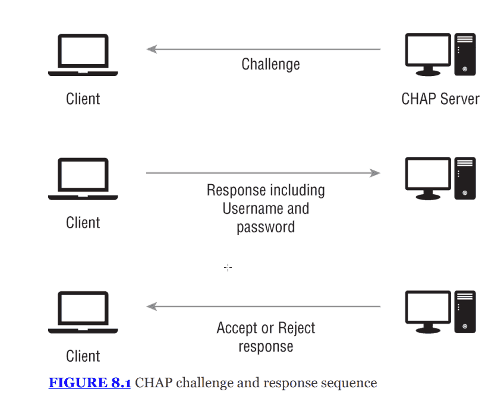
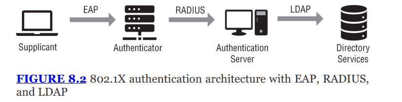
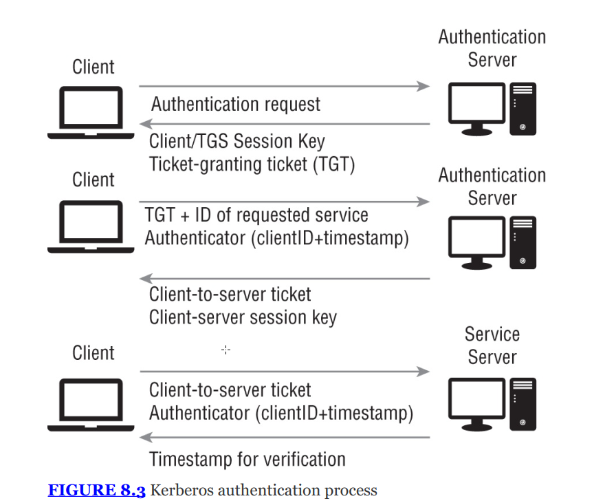
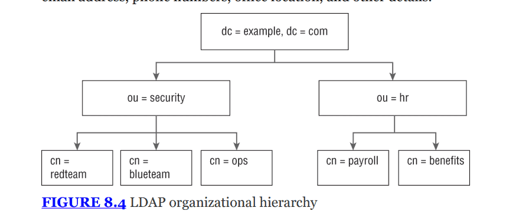
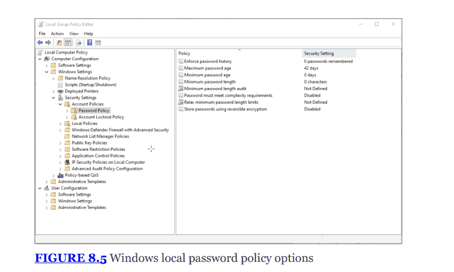
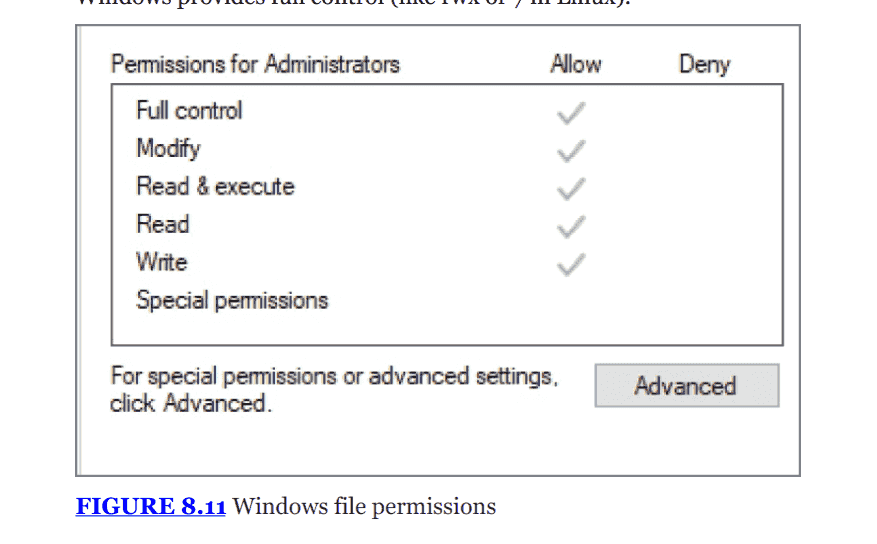

---

# THE COMPTIA SECURITY+ EXAM OBJECTIVES COVERED IN THIS CHAPTER INCLUDE: {#2bc7b0eb61a4808aae4cc96874c572b1}

## Domain 1.0: General Security Concepts {#2bc7b0eb61a48016bbb0ec7973e0b8ac}

### 1.2. Summarize fundamental security concepts. {#2bc7b0eb61a480b98bf4ec71c6127520}

- Authentication, Authorization, and Accounting (AAA) (Authenticating people, Authenticating systems, Authorization models)

## Domain 2.0: Threats, Vulnerabilities, and Mitigations {#2bc7b0eb61a480b89a29e1713b027702}

### 2.5. Explain the purpose of mitigation techniques used to secure the enterprise. {#2bc7b0eb61a48039b0dbeaa5c9772827}

- Access control (Access control list (ACL), Permissions)

## Domain 4.0: Security Operations  {#2bc7b0eb61a4801685c7cdaf9161ee3a}

### 4.6. Given a scenario, implement and maintain identity and access management. {#2bc7b0eb61a480968033e9efdc116a64}

- Provisioning/de-provisioning user accounts
- Permission assignments and implications
- Identity proofing
- Federation
- Single sign-on (SSO) (Lightweight Directory Access
- Protocol (LDAP)), Open authorization (OAuth),
- Security Assertions Markup Language (SAML)
- Interoperability
- Attestation
- Access controls (Mandatory, Discretionary, Role-based,
- Rule-based, Attribute-based, Time-of-day restrictions, Least privilege)
- Multifactor authentication (Implementations (Biometrics, Hard/soft authentication tokens, Security keys), Factors (Something you know, Something you have, Something you are, Somewhere you are))
- Password concepts (Password best practices (length, complexity, reuse, expiration, age), Password managers, Passwordless)
- Privileged access management tools (Just-in-time permissions, password vaulting, ephemeral credentials)

Identity and access management (IAM) là một trong những nội dung quan trọng nhất là nền tảng của bảo mật hiện đại. Nó trả lời câu hỏi: “Ai đang truy cập và được phép làm gì?”

---

## Identity {#2bc7b0eb61a4804c81d5eaa2a706ab07}

- Identity là tập hợp các claims về một chủ thể
- Subject: là con người, nhưng cũng có thể là ứng dụng, thiết bị, hệ thống hoặc tổ chức
- Attributes vs traits:
	- Identity thường liên kết với các thông tin về chủ thể
	- Attributes: Là những thông tin có thể thay đổi và có thể liên quan tới identity, ví dụ: tên, tuổi, vị trí đại lý, chức danh
	- Traits: là những đặc điểm cố hữu: màu mắt, chiều cao, vân tay

### Methods to claim an identity {#2bc7b0eb61a480338f77c6d43e3646d6}

- Username: phổ biến nhất
	- username chỉ để claim, không phải là authentication factor - ko đáng tin
- Certificates:
	- Có thể lưu trên hệ thống hoặc thiết bị lưu trữ
	- Thường dùng để định danh cho hệ thống (systems) hoặc thiết bị (devices) bên cạnh con người
- Tokens: là thiết bị vật lý như USB, Bluetooth có khả năng sinh ra mã code hoặc chứa thông tin để trình diện danh tính
- SSH keys:
	- Là đại diện mật mã của danh tính
	- Thường dùng để thay thế cho cặp username/password truyền thống, đặc biệt trong hệ quản trị LInux/Server
- Smartcards:
	- Sử dụng chip nhúng
	- Có thể là thẻ tiếp xúc (physical chip reader) hoặc contactless
	- Có thể tự sinh cặp khóa trên thẻ

:::tip

### Lost key pair

Sai lầm phổ biến:

- Dev vô tình upload private keys lên các kho mã nguồn công khai (github)

- Quản lý mật khẩu kém

- Sử dụng SSH không có mật khẩu

- Hậu quả: hacker phát hiện lộ mật khẩu rất nhanh → nguy hiểm

- Phòng chống:

:::

### AAA {#2bc7b0eb61a480269b85fed522f544d0}

- Authentication: Bạn có đúng là người bạn nói không
- Authorization: Quyền hạn thực sự của bạn
- Accounting: giám sát, theo dõi tài nguyên sử dụng (băng thông, login time, data sent, logout time,….)

AAA là nguyên lý hoạt động (triết lý) để kiểm soát việc truy cập vào tài nguyên mạng

- Xác định xem họ có đúng là người họ khai báo không dựa trên:
	- Identity: người dùng khai báo họ là ai
	- Authentication: đưa ra bằng chứng xác thực identity đó
- Thực tế là các centralized database này là RADIUS hoặc TACACS+
- Cơ chế: khi kĩ thuật viên gõ mật khẩu vào switch, switch không tự kiểm tra mật khẩu và gửi đến một AAA server. Máy chủ này kiểm tra với active directory “cho phép” hoặc “từ chối”

### NAC {#2dd7b0eb61a480538435ce9d3665c11c}

Network access control quản lý quy trình. Sử dụng 802.1X, MAC address, Profiling, posture assessment để quyết định xem thiết bị có an toàn để vào mạng không

## Authentication technologies {#2bc7b0eb61a48049a824ea51f251cd78}

### CHAP (Challenge Handshake authentication protocol) {#2bc7b0eb61a480a980d5d88a3bbc7a52}

- Mục đích: cung cấp bảo mật tốt hơn giao thức PAP (Password authentication protocol - gửi mật khẩu dạng plaintext)
- **CHAP / MS-CHAPv2:** Là giao thức cũ. Thường dùng trong VPN hoặc xác thực PPP.

**Cơ chế (Figure 8.1):**

1. Server gửi một **Challenge** (thách thức) ngẫu nhiên cho Client.
2. Client dùng mật khẩu của mình để mã hóa Challenge đó và gửi lại (**Response**).
3. Server kiểm tra, nếu đúng thì cho phép truy cập.
4. _Ưu điểm:_ Mật khẩu không bao giờ được gửi qua mạng, chỉ có kết quả mã hóa được gửi đi.

Dùng băm MD5 băm (share secret + nonce)

### 802.1X {#2bc7b0eb61a48006bec0d2804efb50c0}

tên đầy đủ Port-based Network access control (PNAC)

- Là tiêu chuẩn IEEE là một chuẩn của NAC  (network access control)
- Dùng cho port-based: cả wired và wireless
- Kiến trúc
	- Supplicant: thiết bị muốn kết nối (laptop, điện thoại)
	- Authenticator: thiết bị mạng (switch, access point)
	- Authentication server: máy chủ xác thực (thường là RADIUS)

		:::tip
		
		Kịch bản 1: Nhân viên kết nối wifi doanh nghiệp
		1. Nhân viên A bật laptop kết nối mạng wifi, laptop không hỏi mật khẩu mà hiện bảng đăng nhập yêu cầu nhập username/passoword của công ty
		
		2. Thông tin này được bọc trong PEAP
		
		3. Access point (authenticator): chuyển tiếp tới RADIUS server, RADIUS kiểm tra với active derectory
		
		4. Tùy theo role nhân viên mà được đăng nhập vào các mạng khác nhau.
		
		:::
		
		

		:::tip
		
		Kịch bản 2: ngân hàng, khu quân sự (EAP-TLS)
		- Tại sảnh giao dịch ngân hàng, có các ổ cắm mạng trên tường để máy in, máy tính làm việc.
		
		- Ban đầu các port này mặc định khóa sử dụng 802.1x
		
		- Máy tính của giao dịch viên đã có chứng chỉ số, hợp lệ nên được vào
		
		- Hacker khi cắm vào port bị yêu cầu chứng chỉ, không có thì không vào được
		
		:::
		
		

		Ngoài ra EAP có tính extensible ở chỗ nó sử dụng cho Eduroam trong các trường đại học có thể vào được mạng trường đại học khác nhau bằng chính tài khoản của trường mình

### EAP (extensible authentication protocol) {#2cc7b0eb61a48098851ef4c09574521f}

- Là protocol xác thực, dùng cho mạng không dây trong 802.1X
- Có nhiều biến thể EAP-TLS, EAP-TTLS, LEAP (sẽ nghiên cứu trong chapter 13)

---

### RADIUS - remote authentication dial-in user device {#2bc7b0eb61a480b2b25bf4f30fb1d495}

- Là hệ thống AAA phổ biến nhất cho thiết bị mạng
- Giao thức: dùng UDP
- Bảo mật: chỉ mã hóa mật khẩu, các thông tin khác truyền rõ, vì vậy phải chạy trong đường hầm IPSec

### TACAC+ (terminal access controller access control system plus) {#2bc7b0eb61a480678b71ec1723c067fa}

- Là giao thức của Cisco
- Dùng TCP
- Mã hóa toàn bộ gói tin
- Tính năng: tách biệt authentication, authorization, accoungting (trong khi radius) gộp chung. Cho phép kiểm soát lệnh chi tiết

### Kerberos {#2bc7b0eb61a48004b80cd6995b1af64d}

- Giao thức xác thực mặc định trong windows domain (active directory)
- Môi trường: dùng cho mạng không tin cậy
- Thành phần:
	- KDC (Key distribution center)
	- TGT (ticket-granting ticker): vé để xin vé
- Cơ chế:
	- Client muốn đăng nhập → KDC cấp cho 1 cái TGT
	- Muốn truy cập file Server → client đưa TGT cho KDC → KDC cấp server ticket
	- Client đưa service ticket cho file server → truy cập thành công
- Ưu điểm: SSO - single sign on - đăng nhập 1 lần, không gửi password qua mạng, chống nghe lén
- Nhược: phụ thuộc vào thời gian thực, nếu đồng hồ sai lệch quá 5 phút sẽ bị lỗi

---

### Phân biệt 802.1X, TACACS+ và Kerberos {#2cc7b0eb61a48073bac5e7eeb15b2cda}

- Đều thực hiện authentication nhưng ở vị trí khác nhau
- 802.1X nằm tại biên mạng, để xác thực xem có cho đăng nhập mạng không
	- Dùng cert (EAP) để cho đăng nhập, nhờ RADIUS kiểm tra
	- Đối tượng là tất cả người dùng vào mạng → để có mạng
- Kerberos nằm trong mạng nôi bộ, đặc biệt là môi trường windows (active directory)
	- Giúp thực hiện SSO, một lần đăng nhập cả ngày
	- Nhạy với thời gian, dùng ticket
	- Đối tượng: người dùng windows domain (AD) → để có tài nguyên phần cứng
- TACACS+sử dụng cho quản trị viên để cấu hình router, thiết bị mạng liên quan tới cisco
	- Kiểm soát nhân viên IT đang làm gì trên thiết bị
	- Đối tượng: quản trị viên hệ thống mạng → để quản lý thiết bị mạng (router, switch)

Hãy xem cách 3 ông này phối hợp trong một ngày làm việc của một IT Admin:

1. **7:55 AM (802.1X):** Admin đến công ty, cắm dây mạng vào laptop. Switch chặn cổng lại. Laptop gửi thông tin xác thực qua **802.1X**. Switch mở cổng. Admin vào được mạng LAN.
2. **8:00 AM (Kerberos):** Admin đăng nhập vào Windows. Windows Domain Controller (KDC) cấp cho Admin một vé TGT. Admin dùng vé này truy cập vào File Server để lấy tài liệu cấu hình mà không cần nhập lại mật khẩu.
3. **8:15 AM (TACACS+):** Admin mở PuTTY để SSH vào Router công ty nhằm chặn một IP lạ. Router dùng giao thức **TACACS+** để hỏi Server xem Admin có quyền chạy lệnh `block ip` hay không. Server trả lời "OK".

## Directory services {#2bc7b0eb61a48064b71bc57c0e3c6e09}

- LDAP (lightweight directory access protocol): là giao thức để truy cập và quản lý các thư mục thông tin tập trung (danh bạ điện thoại của công ty)
- Cấu trúc hình cây:
	- dc (domain component): tên miền
	- ou (organization unit): phòng ban (HR, security)
	- cn (common name): tên đối tượng (user, máy in)
- LDAP thường được dùng làm backend cho các hệ thống SSO
- Nổi tiếng nhất là: Microsoft active directory

:::tip

- Directory server là một CSDL đặc biệt được thiết kế để lưu trữ, sắp xếp và cung cấp thông tin về các đối tượng trong mạng (người dùng, máy tính, máy in, server,…)

- Giúp quản trị viên quản lý tập trung: chỉ cần tạo tài khoản một lần server directory service thì có thể đăng nhập bất cứ máy nào

- Giao thức ở đây là LDAP (lightweight directory access protocol)

- Về Microsoft Active directory (AD): cực kỳ phổ biến 90%

---

Tổng hợp lại:

1. Authentication - Kerberos

2. Tra cứu: LDAP

3. Phân giải (resolution) - DNS

4. **Xác thực Wifi/VPN - RADIUS:**

:::

## SSO and federation {#2bc7b0eb61a48061b5b5f223fc52a581}

### SSO {#2bc7b0eb61a48035bffad4f4556033d6}

- Người dùng đăng nhập 1 lần, và truy cập được nhiều hệ thống khác nhau mà không cần đăng nhập
- Phạm vi: trong nội bộ một tổ chức hoặc một security domain
- Công nghệ:
	- Kerberos: SSO cho nội bộ
	- SAML SSO cho doanh nghiệp
		- Dùng để đăng nhập một lần vào các ứng dụng lớn như Salesforce, Office 365, Zoom, VPN.
		- _Cơ chế:_ Dựa trên XML (hơi cũ và nặng nề nhưng cực bảo mật).
		- Công ty mua nhiều SaaS như Zoom, Slack, SaleForce, Jira
			- Thay vì nhập user/pass của Zoom, bạn bấm vào nút **"Sign in with SSO****"** (hoặc "Company Login").
			- Zoom sẽ "đá" (redirect) bạn về trang đăng nhập của công ty (ví dụ: trang Microsoft Azure AD hoặc Okta).
			- Bạn nhập mật khẩu công ty 1 lần duy nhất.
			- Hệ thống công ty gửi một "tờ giấy thông hành" (SAML Assertion) cho Zoom bảo là: _"Anh này đúng là nhân viên của tôi, cho anh ấy vào đi"_.
			- Bạn đăng nhập thành công vào Zoom, rồi sau đó vào Slack, Jira... mà không cần nhập lại mật khẩu.
	- OpenID: SSO cho người dùng nhiều nhất
		- **Trùm cuối SSO cho người dùng phổ thông (Consumer) & Mobile App.**
		- Chính là cái nút "Log in with Google", "Log in with Facebook", "Log in with Apple".

### Federation {#2bc7b0eb61a480028c43f4a0123ff956}

- Là một cách để đạt được SSO với nhiều tổ chức (trên cloud/web)
- Cho phép sử dụng danh tính của tổ chức này để đăng nhập vào hệ thống của tổ chức khác (vd: dùng gmail để đăng nhập vào spotify)
- Các bên tham gia:
	- IdP (Identity provider): nơi giữ tài khoản (Google, Facebook, Active directory công ty)
	- Service provider (SP)/relying party (RP): nơi cung cấp dịch vụ (spotify, zoom, saleforces,…)
- SP tin tưởng IdP, Sp chuyển hướng sang IdP để đăng nhập, IdP xác thực xong sẽ gửi một giấy chứng nhận (attestation) cho SP

Các chuẩn Federation phổ biến:

- SAML (security assertion markup language):
	- Dựa trên XML dùng cho SSO
	- Thường dùng cho doanh nghiệp và web-based app
- OpenID Connect (OIDC):
	- Dựa trên JSON/REST, thường chạy trên nền OAuth 2.0 để chuyển giao thông tin xác thực
	- Dùng cho authentication người dùng.
	- Ví dụ: “Log in with Google”
- OAuth: (open authorization):
	- Dùng cho phân quyền (authorization)
	- Cho phép ứng dụng bên thứ 3 truy cập vào tài nguyên của bạn mà không cần biết mật khẩu
	- Không phải SSO chuẩn nhưng được các

---

**Tóm tắt nhanh cho kỳ thi:**

- **RADIUS:** UDP, chỉ mã hóa password.
- **TACACS+:** TCP, mã hóa toàn bộ, của Cisco.
- **Kerberos:** Windows, dùng Ticket, nhạy cảm với thời gian.
- **SAML:** XML, Enterprise SSO.
- **OAuth:** Phân quyền (Authorization).
- **OpenID:** Xác thực (Authentication).

## Authentication methods {#2bc7b0eb61a480708f81c009fba5064c}

Sau khi tuyên bố danh tính, bạn phải chứng minh nó

### Password {#2bc7b0eb61a48047b00ad65fbb44bcb7}

- Như đã nói ở trên, username không phải authentication factor mà chỉ là claims. Ta dùng password ứng với username để thực hiện authentication
- Phổ biến nhất, nhưng có lỗ hổng
- Dễ bị đánh cắp, brute-force, reused
- Khuyến nghị của NIST:
	- Nhấn mạnh độ dài hơn là độ phức tạp → entropy
	- Không cần ký tự đặc biệt
	- Cho phép copy-paste  to allow password managers to work properly
	- Loại bỏ password hint
	- Kiểm tra mật khẩu bị lộ thay vì bắt đổi mật khẩu định kỳ vô cớ

	

### Password managers {#2bc7b0eb61a480a4a9e9c4adc2d9100f}

- Vai trò: giúp quản lý nhiều mật khẩu, mật khẩu dài, khó nhớ
- LastPass, 1Password, Bitwarden
- Rủi ro: Năm 2022 lastPast bị tấn công
	- kẻ tấn công lấy được bản sao dữ liệu (vault data) của khách hàng
	- Ngay cả công ty bảo mật cũng bị hack. Nên bảo vệ master password của bạn

### MFA - multifactor authentication {#2bc7b0eb61a480148964f6f471ca0e2d}

Để khắc phục điểm yếu của mật khẩu, cần nhớ 4 nhân tố

- Something you know: mật khẩu, mã pin, câu hỏi bảo mật
- Something you have: smartcards, USB token (YubiKey), điện thoại (để nhận OTP).
- Something you are: Sinh trắc học (vân tay, mống mắt, giọng nói)
- Somewhere you are: vị trí địa lý (IP, GPS)
- MFA: kết hợp 2 loại nhân tố trở lên
	- Password + PIN = Sai (Vì cả 2 đều là "Something you know").
	- Password + Fingerprint = Đúng (Know + Are).

### **One-Time Passwords - OTP (Mật khẩu dùng một lần)** {#2bc7b0eb61a4800794bad746cc72964f}

- Là một dạng của "Something you have".
- **HOTP (HMAC-based OTP):** Dựa trên sự kiện (bấm nút trên token thì nhảy số mới).
- **TOTP (Time-based OTP):** Dựa trên thời gian (Google Authenticator, thay đổi mỗi 30 giây). An toàn và phổ biến hơn.

---

Attacking OTP

- SMS OTP:
	- SIM swapping (Clone SIM): hacker lừa nhà mạng chuyển đổi số điện thoại của bạn sang SIM của hắn → nhận OTP
	- VoIP: chuyển hướng cuộc gọi/tin nhắn
	- Mitigation: tránh dùng SMS OTP cho tài khoản quan trọng, hãy dùng TOTP hoặc Yubikey
- MFA fatigue (Spam OTP):
	- Hacker có mật khẩu của bạn, liên tục gửi đăng nhập
	- Điện thoại bạn báo _Ping! Ping! Ping!_ liên tục.
	- Bạn bực mình hoặc lỡ tay bấm "Approve" cho xong chuyện -> Hacker vào được.

### Passwordless authentication {#2bc7b0eb61a480ca92afe3eabd4404f5}

- Xu hướng mới hiện tại loại bỏ hoàn toàn mật khẩu
- FIDO2/WebAuthn: chuẩn xác thực web không mật khẩu
- Cơ chế: thay vì gõ pass, bạn cắm USB token hoặc quét vân tay trên điện thoại. Hệ thống sẽ dùng public key cryptography để xác thực thiết bị của bạn
	- Đưa cho người dùng security key (yubikey)
- Lợi ích: chống phishing cực tốt vì không có mật khẩu để mà lừa

Hardware token dùng cho MFA:

- Thường là móc khóa có màn hình LCD nhỏ như RSA securID
- Hiện lên hình 6 số OTP mỗi 30-60s
- Nhìn vào màn hình và gõ 6 số đó vào máy tính
- Có thể bị phishing

Security key:

- Dùng cho passwordless và MFA
- USB nhỏ như Yubikey, Google Titan không có màn hình
- Có chip mã hóa phức tạp (FIDO2/U2F), không hiện số
- Cắm vào cổng USB, chạm ngón tay vào đó, không cần gõ nhìn
- Không bị phishing (do có check domain)

### Biometrics {#2bc7b0eb61a48094888af589093a3c6b}

- Là something you are trong MFA
- Fingerprints
	- Phổ biến nhất trên windows, android, iPhone cũ
- Retina scanning
	- Quét blood vessels ở đáy mắt
	- Nhược điểm: ít được chấp nhận vì người dùng phải ghé sát → vệ sinh, sức khỏe
- Iris recognition
	- Quét hoa văn của tròn đen bằng tia hồng ngoại
	- Ưu điểm: xa hơn retina, dễ chấp nhận hơn (SAMSUNG)
- Facial recognition
	- FaceID
- Voice recognition
	- Âm thanh, nhịp điệu
- Vein recognition
	- Quét mạng lưới mạch máu dưới da (thường là bàn tay).
	- **Ưu điểm:** Khó làm giả hơn vân tay, không cần chạm trực tiếp (vệ sinh hơn), không bị ảnh hưởng bởi da bẩn/trầy xước.
- **Gait Analysis (Phân tích dáng đi)**
	- Nhận diện người qua cách họ bước đi.

### Evaluating biometrics {#2bc7b0eb61a48044a93ed5d10d07e71c}

- False rejection rate (FRR) - type I error
	- Tỷ lệ từ chối sai: người dùng hợp lệ nhưng máy không nhận ra
	- Hậu quả: phiền toái
- False acceptance rate (FAR) - type II error:
	- Tỷ lệ chấp nhận sai: người khác mở được
	- Hậu quả: lỗ hổng bảo mật nghiêm trọng
- **Crossover Error Rate (CER):**
	- Điểm giao nhau nơi FRR = FAR.
	- **CER càng thấp, hệ thống càng chính xác.**
	- Dùng CER để so sánh 2 hệ thống sinh trắc học với nhau.

## Accounts {#2bc7b0eb61a480a98c9bcc8d935bbca9}

- Để xác thực và phân quyền thì cần tài khoản
- Chứa thông tin user, rights và permission
- Có 5 loại accounts
1. User accounts: dành cho con người cụ thể. Quyền hạn có thể từ cơ bản đến nâng cao
2. Privileged/Administrative accounts: root (linux), administrator (windows)
3. Shared/generic accounts:
	- Nhiều người dùng chung (guest, training,….)
	- Rủi ro: non-repudiation nên thường bị cấm xài như thế này
4. Guest accounts: dành cho người dùng tạm thời, quyền hạn hạn chế
5. Service accounts: dành cho ứng dụng/phần mềm chạy nền (automated services), không dùng để đăng nhập tương tác
	1. Dùng cho các dịch vụ liên kết với nhau
	2. Không có giao diện đăng nhập

### Provisioning and deprovisioning (cấp và thu hồi) {#2bc7b0eb61a48045b8f7e6a303af4544}

- Provisioning:
	- Quy trình tạo tài khoản và gán quyền thường diễn ra khi nhân viên onboard
	- Gồm: identity proofing, yêu cầu giấy tờ ID
- Deprovisioning:
	- Khi nhân viên nghỉ
	- Ngăn chặn tài khoản ma
	- Lưu ý: nên xóa thay vì disable
- Permission creep (leo thang quyền hạn theo thời gian)
	- xảy ra khi nhân viên qua nhiều cương vị, nhận thêm quyền mới nhưng không bị thu hồi quyền cũ
	- Vi phạm least privilege
	- Giải pháp: access review định kỳ

### Privileged access management - PAM {#2bc7b0eb61a4806f8e88c919ef373446}

- Just-in-time (JIT) permission:
	- Quyền hạn chỉ được cấp khi cần thiết trong khoảng thời gian ngắn
	- Sau đó thì thu hồi
- Password vaulting:
	- Admin không cần biết mật khẩu của server
	- Khi cần đăng nhập, admin vào két (vault) để mượn quyền. hệ thống tự đăng nhập và ghi log lại phiên làm việc
- Ephemeral account: (tài khoản phù du)
	- Tài khoản tạm thời thực hiện nhiệm vụ cụ thể và sau đó tự hủy

### Access control schemes {#2bc7b0eb61a4800395d7c0c54ba26b60}

Là phần lý thuyết quan trọng nhất. Phân biệt rõ 5 mô hình:

### Mandatory access control - MAC: Kiểm soát truy cập bắt buộc {#2bc7b0eb61a4801a8a24c11ea8379074}

- Dựa trên nhãn bảo mật (security labels) như: “Top secret”, “Secret”, “unclassified”
- Quyền truy cập được quy định bởi hệ điều hành hoặc chính sách trung tâm.
- Người dùng không có quyền tự ý chia sẻ file cho người khác
- Cứng nhắc và an toàn nhất
- Ứng dụng: quân đội, chính phủ, hệ thống bảo mật cao (SELinux)

:::tip

Phân biệt MAC - media access control (computer network) , mandatory access control (sec+) , message authentication code (hashing - cryptography)

:::

### Discretionary access control - DAC - Kiểm soát truy cập tùy quyền {#2bc7b0eb61a480dd9555c5c6d432bd74}

- Dựa trên owner - linux thấy rõ điều này
- Người tạo ra file có quyền quyết định ai xem, ai sửa
- Linh hoạt nhưng kém an toàn hơn MAC
- Ứng dụng: hệ điều hành thông thường (windows, linux cá nhân)

### Role-based access control - RBAC (kiểm soát truy cập dựa trên vai trò) {#2bc7b0eb61a4801fbdc0c374c0438f4a}

- Quyền hạn gán cho role của từng người dùng
	- Role assignment
	- Role authorization:
	- Permission authorization: chỉ được xài trong role
- Dễ quản lý trong doanh nghiệp lớn
- Ứng dụng: doanh nghiệp

### Attribute-based access control - ABAC (kiểm soát truy cập dựa trên thuộc tính) {#2bc7b0eb61a480cc8ebef01327c4af85}

- Quyền truy cập dựa trên nhiều thuộc tính
	- _Subject attributes:_ Ai đang truy cập? (User type).
	- _Object attributes:_ Tài nguyên là gì? (File type).
	- _Environmental attributes:_ Ở đâu? Khi nào? (Time of day, Location).
- **Ưu điểm:** Rất linh hoạt (**Flexible**), chi tiết
- **Nhược điểm:** Phức tạp để quản lý (_complex to manage well_).
	- Đối với nhân viên hay di chuyển thì vấn đề environmental attributes sẽ ảnh hưởng làm họ không truy cập được
- **Ví dụ:** "Cho phép nhân viên (Subject) truy cập file lương (Object) CHỈ KHI đang ở văn phòng (Environment) và trong giờ hành chính".

### Rule-based access control (RuBAC) {#2bc7b0eb61a480de8bf9c5503aeb8356}

Có thể bị nhầm với RBAC 

- Role-based: con người
- Rule-based: quy tắc cứng nhắc
	- Tạo nhưng rule lâu lâu mới yêu cầu ví dụ như lâu lâu có người xin access một file nào đó thì dùng được
- Cơ chế: sử dụng tập hợp rules hoặc danh sách kiểm soát truy cập (ACLs) áp dụng cho các đối tượng
- Ví dụ: firewall ruleset - chặn IP blabla

---

Ngoài những access controls kể trên, còn có 2 concepts ở dưới chúng

### **Time-of-Day Restrictions (Hạn chế theo giờ)** {#2bc7b0eb61a480498caae65c92fa886a}

- Giới hạn thời gian hoạt động. Ví dụ: Nhân viên chỉ được đăng nhập từ 8h sáng đến 5h chiều.
- Giúp ngăn chặn lạm dụng tài khoản ngoài giờ làm việc.

### **Least Privilege (Đặc quyền tối thiểu)** {#2bc7b0eb61a480848bc9cc3f3435d9b7}

- **Nguyên tắc vàng:** Chỉ cấp cho người dùng những quyền hạn tối thiểu cần thiết để họ làm xong việc của mình (_minimum set of permissions necessary_).

## Filesystem permission {#2bc7b0eb61a480818d7ffcd50bf3771c}

Cách phân quyền trên hệ điều hành Linux và Windows

### **Linux Filesystem Permissions** {#2bc7b0eb61a480c58b93dab3a4b4be13}

- Sử dụng 3 ký tự: `r` (Read - Đọc), `w` (Write - Ghi), `x` (Execute - Thực thi).
- Áp dụng cho 3 nhóm đối tượng: **User** (Chủ sở hữu), **Group** (Nhóm), **Others** (Người khác).
- **Biểu diễn số (Numeric representation):**
	- Read = 4
	- Write = 2: để có thể xóa một file thì người dùng phải có quyền write ở folder chứa file đó
	- Execute = 1
	- _Ví dụ:_ `rwx` = 4+2+1 = 7. `rw-` = 4+2 = 6.
	- Lệnh `chmod 755 filename` nghĩa là: User (7 - Full), Group (5 - Read/Execute), Others (5 - Read/Execute).

### **Windows Filesystem Permissions** {#2bc7b0eb61a4801e82a8f0911105e7a4}

- Sử dụng giao diện đồ họa (GUI) hoặc dòng lệnh.
- Các quyền cơ bản:
	- **Full control:** Toàn quyền.
	- **Modify: cho toàn bộ quyền (rwx, list folder content, delete), ngoại trừ:**
		- change permission
		- take ownership
	- **Read & execute:** Xem + Chạy chương trình (nhưng không được sửa).
	- **Read:** Chỉ xem.
	- **Write:** Chỉ ghi.

	| **Quyền hạn (Permissions)** | **Xem & Mở** | **Chạy (.exe)** | **Sửa nội dung** | **Tạo mới** | **Xóa** | **Đổi quyền (ACL)** | **Đổi chủ (Owner)** |
	| --------------------------- | ------------ | --------------- | ---------------- | ----------- | ------- | ------------------- | ------------------- |
	| **Read**                    | ✅            | ❌               | ❌                | ❌           | ❌       | ❌                   | ❌                   |
	| **Read & Execute**          | ✅            | ✅               | ❌                | ❌           | ❌       | ❌                   | ❌                   |
	| **Write**                   | ❌            | ❌               | ✅                | ✅           | ❌       | ❌                   | ❌                   |
	| **Modify**                  | ✅            | ✅               | ✅                | ✅           | ✅       | ❌                   | ❌                   |
	| **Full Control**            | ✅            | ✅               | ✅                | ✅           | ✅       | ✅                   | ✅                   |

	

> Cảnh báo: Quyền hệ thống tập tin yếu (weak filesystem permissions) thường là nguyên nhân của các cuộc tấn công như Directory Traversal (đã học ở Chapter 6).

## Summary  {#2bc7b0eb61a48047afcdf9a2847c0083}

**IAM là yếu tố then chốt:**

- **Authentication:** Chứng minh danh tính (Something you know, have, are, somewhere you are).
- **Authorization:** Cấp quyền dựa trên danh tính đó.
- **Account Types:** User, Guest, Service, Privileged.

**Các công nghệ xác thực:**

- **RADIUS/TACACS+:** Dùng cho thiết bị mạng.
- **LDAP:** Dịch vụ thư mục.
- **Kerberos:** SSO trong Windows.
- **Federation (SAML, OAuth, OIDC):** SSO trên web/cloud.

**Access Control Models:**

- **MAC:** Dựa trên nhãn (Bảo mật cao).
- **DAC:** Dựa trên chủ sở hữu (Linh hoạt).
- **RBAC:** Dựa trên vai trò (Dễ quản lý).
- **ABAC:** Dựa trên thuộc tính (Chi tiết nhất).

---

## Exam Essentials {#2bc7b0eb61a480ceaaace85644a71cd8}

1. **Single Sign-On (SSO) & Federation:**
	- SSO giúp đăng nhập 1 lần dùng nhiều hệ thống.
	- Federation dùng IdP (Identity Provider) để xác thực cho SP (Service Provider).
	- Công nghệ: SAML, OAuth, LDAP.
2. **Passwords & MFA:**
	- Password length > Complexity.
	- MFA = Kết hợp 2/4 factors khác loại.
		- MFA thì hardware token là mạnh nhất
		- Tới app token rồi tới SMS (dễ bị lừa)
	- Passwordless (FIDO2) đang lên ngôi.
3. **Account Management:**
	- Quản lý vòng đời: Provisioning -> Maintenance -> Deprovisioning.
	- PAM (Privileged Access Management): Dùng cho tài khoản Admin (JIT, Vaulting).
4. **Access Control Schemes:**
	- Phân biệt được MAC, DAC, RBAC, ABAC, Rule-based.
