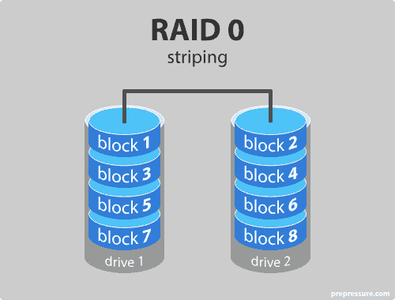
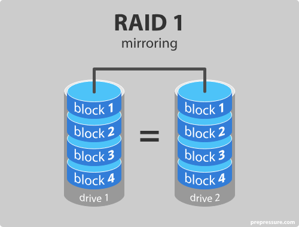
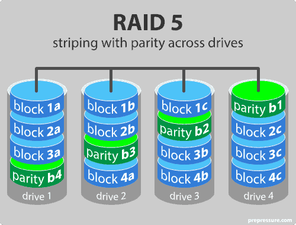
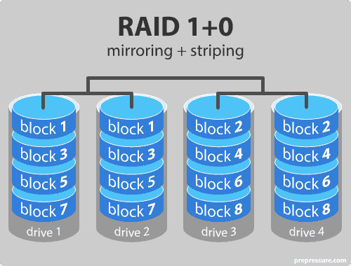

<!-- notion-metadata-start -->
*📅 Published: 2025-12-02 10:09 | 🔄 Last Updated: 2026-05-08 12:00*
<!-- notion-metadata-end -->
---

# THE COMPTIA SECURITY+ EXAM OBJECTIVES COVERED IN THIS CHAPTER INCLUDE: {#2bd7b0eb61a48057b4a1e47af35be150}

## Domain 1.0: General Security Concepts {#2bd7b0eb61a480a48873c9e39600a556}

### 1.2. Summarize fundamental security concepts. {#2bd7b0eb61a480bc8c15e1a6636abf8e}

- Physical security (Bollards, Access control vestibule, Fencing, Video surveillance, Security guard, Access badge, Lighting, Sensors)

## Domain 2.0: Threats, Vulnerabilities, and Mitigations {#2bd7b0eb61a4804684bdf50d0ff01517}

### 2.4. Given a scenario, analyze indicators of malicious activity. {#2bd7b0eb61a480e08ddbd86e31035910}

- Physical attacks (Brute force, Radio frequency identification (RFID) cloning, Environmental)

## Domain 3.0: Security Architecture {#2bd7b0eb61a480aea207ce2d63bfd02d}

### 3.1. Compare and contrast security implications of different architecture models. {#2bd7b0eb61a480e8a755ef4ec1a8ec44}

- Considerations (Availability, Resilience, Cost, Responsiveness, Scalability, Ease of deployment, Risk transference, Ease of recovery, Patch availability, Inability to patch, Power, Compute)

### 3.4. Explain the importance of resilience and recovery in security architecture. {#2bd7b0eb61a48010a6d2fb10f147c8b7}

- High availability (Load balancing vs. clustering)
- Site considerations (Hot, Cold, Warm, Geographic dispersion)
- Platform diversity
- Multi-cloud systems
- Continuity of operations
- Capacity planning (People, Technology, Infrastructure)
- Testing (Tabletop exercises, Fail over, Simulation, Parallel processing)
- Backups (Onsite/offsite, Frequency, Encryption, Snapshots, Recovery, Replication, Journaling)
- Power (Generators, Uninterruptible power supply (UPS))

---

## Resilience and Recovery in Security Architectures {#2bd7b0eb61a480a3b064ee5de0af636a}

Availability thường bị xem nhẹ so với confidentiality và integrity

- Continuity of operations: xử lý loss off access to facility, loss of personnel and loss of services
	- Con người, cơ sở vật chất, dịch vụ
	- Là mục tiêu thiết kế nhằm đảm bảo hoạt động ngay cả khi hệ thống bị sự cố đơn lẻ hay thiên tai
	- Không phải lúc nào cũng áp dụng tất cả biện pháp mà sử dụng cân nhắc Cost + maintainance + risks
- Redundancy: là cách phổ biến để đảm bảo resilience, sử dụng nhiều hơn một hệ thống

### Assessing failure and design elements {#2bd7b0eb61a4801894f4eab60d37d92e}

- Single point of failure
	- Nếu bị hỏng thì toàn bộ hệ thống ngừng hoạt động
	- Phải được loại bỏ (bù đắp/dự phòng) hoặc ghi chép lại trong thiết kế

### Common element for redundancy {#2bd7b0eb61a48089b4bac4fa6e558a26}

- Geographic dispersion:
	- Rule of thumb: datacenter nên cách nhau ít nhất 145 km
	- Nếu có thiên tai thì khoảng cách 90 km là chưa đủ
- Server separation:
	- Tránh đặt tất cả hệ thống vào một tủ để tránh SPOF
	- Rủi ro: hỏng PDU: power distribution unit

### Implementing redundancy {#2bd7b0eb61a4802dbcd1c8fdf23061f9}

- Multipath: sử dụng nhiều đường dẫn mạng
- Redundant network devices: nhiều router, firewall, IPS
	- Load balancing: nhiều hệ thống phục vụ như một service
	- Clustering:
		- Nhóm các máy tính lại thực hiện một tác vụ (như web front-end, hoặc các node tính toán)
		- Nhiều hệ thống hoạt động như một hệ thống duy nhất
- Protection of power: dùng UPS, máy phát điện, dual-supply (2 nguồn), managed PDU: thiết bị quản lý nguồn thông minh trong rack
- Systems and storage redundancy:
- Platform diversity:
	- sử dụng nhiều công nghệ, dịch vụ của nhiều vendor
	- nhược: tốn chi phí

### Architectural considerations and security {#2bd7b0eb61a480afa1b3fc3a1d890281}

Các yếu tố cần cân nhắc khi thiết kế

- Availability: xây dựng dựa trên yêu cầu của tổ chức nhưng cân bằng với yếu tố khác
- Resilience: khả chịu đựng gián đoạn nhưng không mất tính sẵn sàng
- Cost
- Responsiveness:
- Scalability:
	- Vertically: máy to hơn, mạnh hơn
	- Horizontally: nhiều máy hơn
- Ease of deployment
- Risk transference: chuyển giao rủi ro qua bảo hiểm hoặc hợp đồng
- Ease of recovery: một phần của tính sẵn sàng
- Patch availability and vendor support: xem xét nhà cung cấp có hỗ trợ không và tần suất bản vá
- Inability to patch: trong trường hợp yêu cầu high availability quá cao khiến hệ thống không thể dừng để vá lỗi
- Power consumption: chi phí vận hành (opEx) trong thiết kế datacenter
- Compute requirements: chi phí thay thế (on-premises) hoặc chi phí cloud

## Storage resiliency {#2bd7b0eb61a480f9bdfcdca01df02a8d}

### RAID {#2bd7b0eb61a48087ba28c8e8d52f2c93}

Một cách để đảm bảo storage resiliency là RAID (Redundant arrays of inexpensive disks). Các mức độ RAID phổ biến nhất

- RAID 0: Striping
	- Dữ liệu được chia nhỏ và ghi rải rác trên tất cả ổ cứng (striping)
	- Ưu điểm: tốc độ I/O tốt hơn; sử dụng toàn bộ dung lượng đĩa
	- Nhược: not fault tolenrance. Nếu một ổ hỏng thì mất toàn bộ data

- RAID 1: mirroring
	- Dữ liệu được sao chép sang ổ khác
	- Ưu điểm: tốc độ cao (đọc từ nhiều ổ); dữ liệu còn nếu một ô hỏng
	- Nhược: tốn dung lượng gấp đôi

- RAID 5: striping with parity, cần ít nhất 3 ổ và hoạt động tới 16 ổ
	- Dữ liệu được ghi rải rác, nhưng dành dung lượng tương đương 1 ổ để lưu thông tin kiểm tra lỗi (parity/checksum). Parity cũng được rải đều trên các đĩa
	- Ưu điểm: đọc nhanh; chịu được lỗi hỏng 1 đĩa
	- Nhược: ghi chậm; và chịu chỉ được 1 đĩa lỗi duy nhất; rebuild lại array chậm

- RAID 10 (mirroring and striping)
	- Kết hợp RAID 1 và RAID 0: mirror trước sau đó stripe
	- Ưu điểm: kết hợp ưu điểm RIAD 1 (an toàn) và RAID 0 (nhanh)
	- Nhược: nhược điểm của RAID 1 và 0
	- Có thể ghi là RIAD 1 + 0

### Backup types and strategies {#2bd7b0eb61a4804d8f90e7a3671b4149}

Ngoài bảo vệ ở cấp độ ổ đĩa (RAID), cần thêm các biện pháp backups để tránh mất dữ liệu do nguyên nhân khác

- Full backup: sao chép toàn bộ → tốn dung lượng
- Incremental backup: chỉ sao chép những thay đổi kể từ lần back up gần nhất (bất kể là full hay incremental)
	- Sao lưu nhanh, ít tốn bộ nhớ. Nhưng recovery chậm vì phải khôi phục bản full trước rồi lần lượt từng bản incremental
- Differential backup: sao chép những thay đổi từ lần full backup gần nhất

**Kịch bản:**

- Chủ nhật: Full Backup (Dữ liệu A).
- Thứ 2: Thêm dữ liệu B.
- Thứ 3: Thêm dữ liệu C.
- Thứ 4: Thêm dữ liệu D.

| **Loại Backup**  | **Dữ liệu trong bản Backup Thứ 4**                  | **Để khôi phục dữ liệu đến Thứ 4 cần gì?**                           | **Tổng số bản**         |
| ---------------- | --------------------------------------------------- | -------------------------------------------------------------------- | ----------------------- |
| **Differential** | Chứa cả **B + C + D** (Tất cả thay đổi từ Chủ nhật) | Tape Chủ nhật (A) + Tape Thứ 4 (B+C+D)                               | **2 (Đáp án chuẩn)**    |
| **Incremental**  | Chỉ chứa **D** (Thay đổi từ Thứ 3)                  | Tape Chủ nhật (A) + Tape Thứ 2 (B) + Tape Thứ 3 (C) + Tape Thứ 4 (D) | **4 (Đáp án của sách)** |

### Replication and journaling {#2bd7b0eb61a480b1ba3acc9821ad097d}

- Replication: sao chép live data sang một vị trí khác, dùng trong datacenter
	- Có thể là synchronous (thời gian thực ) hot site hoặc asynchronous (có độ trễ) warm site
	- Giúp ích cho thiết kế High availability, load balancing và disaster recovery
	- Dân kỹ thuật thuần túy thường nói: "Replication là HA (High Availability), không phải Backup".
	- Nhưng trong các bài thi (đặc biệt là CompTIA Security+), họ thường gộp chung Replication vào các chiến lược "Backup & Recovery".
- Journaling:
	- Tạo một log các thay đổi, thường dùng cho db
	- Cho phép khôi phục lại tại một thời điểm cụ thể (point-in-time)
	- Lưu ý: Journaling không thay thế hoàn toàn backup vì quá trình replay các transaction để phục hồi tốn rất nhiều thời gian

Khi gặp câu hỏi dạng này, hãy phân tích theo thứ tự ưu tiên về tốc độ **RTO** như sau (theo logic của sách):

1. **Replication / Hot Site:** Nhanh nhất (Gần như tức thì - Instant). Do không cần copy dữ liệu lại, chỉ cần chuyển hướng truy cập.
2. **Snapshots:** Rất nhanh (Vài phút). Do chỉ cần hoàn tác các thay đổi trên đĩa.
3. **Disk-based Backup (Full/Differential/Incremental):** Trung bình (Vài giờ). Phải copy dữ liệu từ ổ backup sang ổ chính.
4. **Tape (Băng từ):** Chậm nhất (Vài ngày).

### Recovery objectives: RPO& RTO  {#2bd7b0eb61a480d7b813e9790451c528}

Quy trình phục hồi được định hướng bởi 2 chỉ số quan trọng

- RPO (recovery point objective): xác định lượng dữ liệu bị mất tối đa cho phép
	- RPO quyết định tần suất backup, càng thấp thì càng backup thường xuyên
- RTO (recovery time objective): xác định thời gian tối đa hệ thống được ngừng hoạt động để phục hồi
	- RTO càng ngắn, chọn phương pháp phục hồi nhanh

### Snapshots and images {#2bd7b0eb61a4800bb568d85a79004d46}

Ngoài backup file truyền thống, công nghệ ảo hóa mang lại các khái niệm mới:

- Snapshot: ghi lại toàn bộ của hệ thống hoặc VM tại một thời điểm
	- Thường dùng trước khi cài bản vá hoặc nâng cấp để có thể rollback nếu nó lỗi
- Images: thường chỉ một bản sao hoàn chỉnh ở cấp độ bit của ổ đĩa
	- Dùng để triển khai nhanh các server có cấu hình phức tạp
	- Nhìn chung tương đồng với snapshot nhưng nhấn mạnh về server, system
	- Full backup, snapshot, images có thể mang nghĩa tương đồng
- Forensic images: sử dụng công nghệ tương tự image nhưng với yêu cầu khắt khe hơn về data validation để làm bằng chứng pháp lý
- **Non-persistent systems (VDI):** Sử dụng "gold master image". Khi người dùng tắt máy, hệ thống sẽ reset về trạng thái gốc của gold master, đảm bảo trải nghiệm nhất quán.

### Backup media & storage options  {#2bd7b0eb61a480618b60c3ed4092cfe3}

- Tape: chi phí thấp, chậm. Phổ biến trong doanh nghiệp lớn (tape robots) để lưu trữ lâu dài
- Disk (HDD/SSD): đắt hơn tape nhưng nhanh hơn. Dùng trong NAS (network attached storage), SAN (storage Area Network)
- **Optical/Flash (USB, microSD):** Ít phổ biến ở quy mô doanh nghiệp lớn

:::tip

NAS là một [thiết bị lưu trữ](https://thegioimaychu.vn/storage/?utm_source=tmblog&utm_medium=inlinekwd) dữ liệu cấp file được gắn vào mạng TCP/IP, thường là Ethernet. Nó thường sử dụng các giao thức NFS hoặc CIFS, mặc dù chúng cũng có thể chạy trên các giao thức khác, chẳng hạn như HTTP.
NAS hiện diện trên hệ điều hành như một thư mục dùng chung. Nhân viên truy cập các file từ NAS giống như họ làm việc với bất kỳ file nào khác trên mạng. NAS phụ thuộc vào mạng LAN, nếu LAN không hoạt động thì NAS cũng vậy.

:::

:::tip

SAN là một mạng hiệu suất cao dành riêng cho [hệ thống lưu trữ](https://thegioimaychu.vn/storage/?utm_source=tmblog&utm_medium=inlinekwd) theo block hợp nhất. Hệ thống mạng tốc độ cao kết nối các thiết bị lưu trữ, thiết bị chuyển mạch và máy chủ lưu trữ. Hệ thống SAN doanh nghiệp cao cấp cũng có thể bao gồm các thiết bị “SAN Director” để đạt hiệu suất cao hơn và sử dụng hiệu quả các tài nguyên.
Máy chủ kết nối với mạng SAN bằng bộ HBA (Host Bus Adapter). Máy chủ nhận diện thiết bị SAN như một bộ lưu trữ được gắn cục bộ, vì vậy nhiều máy chủ có thể chia sẻ một nhóm lưu trữ. SAN không phụ thuộc vào mạng LAN và giảm áp lực lên mạng cục bộ bằng cách giảm tải dữ liệu trực tiếp từ các máy chủ được gắn vào.

:::

Hai kiến trúc lưu trữ xử lý dữ liệu khác nhau: NAS xử lý dữ liệu dựa trên file và SAN xử lý dữ liệu dựa trên khối (block).

---

Mô hình truy cập dữ liệu:

- Online: dữ liệu có sẵn ngay, đắt
- Offline: an toàn, chi phí duy trì thấp, nhưng tốn công sức truy hồi
- Nearlin: không sẵn sàng ngay lập tức nhưng có thể truy xuất trong thời gian hợp lý, không cần người can thiệp. Vd: tape robots tự động load băng từ

---

### Cloud và off-site backups {#2bd7b0eb61a480f79e4ae279b3d9b176}

- Với xu hướng infrastructure as code, ảo hóa và container, chúng ta không còn backup toàn bộ hệ thống máy chủ như tước. Thay vào đó ta dùng backup Code định nghĩa hệ thống và data quan trọng
- Off-site storage:
	- Là một hình thức đa dạng địa lý
	- Tránh việc thảm họa xảy ra tại trụ sở chính phá hủy luôn cả bản backup
	- Bad practice: nhân viên mang ổ cứng backup về nhà → mất, hư hỏng, không đủ khoảng cách an toàn 90miles
- Cloud considerations:
	- Bandwith: có phục hồi kịp khi cần không
	- Cost: Amazon S3 Glacier có phí lưu trữ rẻ nhưng retrieval cost cao, và lấy chậm
	- Reliability: nhà cung cấp cloud có độ bên dữ liệu cao hơn nhiều so với tự vận hành

## Security for backups {#2bd7b0eb61a480329d87d67c0764982e}

Bản thân hệ thống backup cũng cần được bảo vệ

- New security models: khi dùng bên thứ 3 (cloud), cần tách biệt tài khoản quản trị (separations of accounts)
- Encryption:
	- Data at rest
	- Data in transit (khi truyền qua mạng)
	- Quan trọng: việc quản lý khóa giải mã.

## Response and Recovery controls {#2bd7b0eb61a48034aaa9c4434bf6fa96}

Khi sự cố xảy ra và tổ chức cần thực hiện các biện pháp để phản ứng lại. Một khái niệm quan trọng ở đây là Non-persistent

- Non-persistent: khả năng tạo ra các hệ thống hoặc dịch vụ, sử dụng xong rồi tắt bỏ (spin up and shut down)
	- Revert to a known state: trong môi trường Cloud hoặc VDI (virtual deskop infrastructure), hệ thống có thể tự quay về trạng thái “sạch” ban đầu sau khi khởi động hoặc log off.
	- Last-known good configuration: các hệ điều hành như windows thường tạo các restore point trước khi cài patch. Nếu patch lỗi, hệ thống có thể quay lại cấu hình tốt nhất
- Live boot media:
	- Khi hệ điều hành chính bị hỏng nặng hoặc nghi ngờ nhiễm, bạn có thể dùng USB/DVD chứa OS để khởi động
	- Kỹ thuật này giúp truy cập phần cứng và ổ đĩa để sửa chữa hoặc quét virus từ một môi trường tin cậy

## Scalability {#2bd7b0eb61a48012a077c611d3de39ef}

Để đảm bảo tính sẵn sàng, và khả năng phục hồi, hệ thống phải có khả năng mở rộng khi tải tăng cao hoặc khi cố sự cố

- Vertical Scalability:
	- Làm hệ thống mạnh hơn
	- Nhược: đắt, có giới hạn vật lý. Thường dùng cho ứng dụng lớn không chạy trên máy nhỏ
- Horizontal scalability:
	- Thêm nhiều hệ thống nhỏ hơn
	- Ưu điểm: linh hoạt, thêm bớt máy chủ tùy theo nhu cầu thực tế. Dễ dàng nâng cấp hoặc vá lỗi mà không gây gián đoạn
	- This approach also provides opportunities for transparent upgrades, patching, and even incident response

## Site resilience {#2bd7b0eb61a4809aabc6cd2c242c4de4}

Là trọng tâm của kế hoạch phục hồi thảm họa (disaster recovery - DR). Trường hợp datacenter của bạn bị sập, sẽ chuyển sang đâu:

- Hot sites:
	- Có đầy đủ cơ sở hạ tầng và live data
	- Thường hoạt động song song hoặc sẵn sàng chuyển đổi ngay lập tức
	- Đặc điểm: đắt nhất, thời gian phục hồi nhanh nhất. Nhân sự thường trực sẵn sàng
- Warm sites:
	- Có hệ thống phần cứng/mềm cần thiết những không có live data
	- Cần thời gian để nạp dữ liệu backup vào
	- Đặc điểm: cân bằng giữa chi phí và phục hồi
- Cold sites:
	- Chỉ có không gian, nguồn điện và kết nối mạng cơ bản
	- Không có thiết bị, dữ liệu
	- Khi thảm họa xảy ra, bạn phải mang máy chủ đến hoặc đi mua máy mới lắp vào
	- Đặc điểm: rẻ nhưng lâu, khó phục hồi nhất

> **Lưu ý quan trọng về nhân sự (Staffing):**  
> Sách đưa ra ví dụ đau lòng về sự kiện 9/11: Một số công ty có hệ thống DR tốt nhưng không thể vận hành vì nhân viên của họ đã thiệt mạng trong thảm họa. Do đó, kế hoạch DR phải tính đến việc **con người** có sẵn sàng hay không, không chỉ là máy móc.

### Quy trình phục hồi sau thảm họa {#2bd7b0eb61a4807d9875f87b29bda92e}

### Quy trình phục hồi sau thảm họa {#2cb7b0eb61a48060ba2df9dfc0e8891a}

Trước hết phải đảm bảo key để recover hoạt động

1. Restore network connectivity (kết nối mạng và máy chủ bastion hoặc shell host)
2. Network security devices: firewall, IPS
3. Storage and db services:
4. Critical operational servers:
5. Logging and monitoring service:
6. Các services còn lại

	:::tip
	
	### Bastion
	
	- Là gateway duy nhất cho phép QTV hệ thống kết nối từ internet vào các máy chủ nằm trong private network để bảo trì
	
	- Nằm trong vùng DMZ (demilitarized zone) hoặc một public subnet, có địa chỉ ip công cộng
	
	- Cơ chế: bạn SSH vào Bastion host, sau đó bạn mới jump vào các server CSDL, ứng dụng,…
	
	- Vì thế nó còn được gọi là jump server
	
	Đặc điểm bảo mật (hardening):
	
	- Tối giản: chỉ cài đặt những gì thật sự cần OS, SSH daemon), không chạy web server, không chứa dữ liệu nhạy cảm
	
	- Kiểm soát truy cập: thường giới hạn IP nguồn (chỉ IP văn phòng bạn mới kết nối được)
	
	- Giám sát: ghi lại mọi câu lệnh (command logging) để phục vụ audit
	
	- MFA: bắt buộc xác thực 2 lớp khi đăng nhập
	
	- **Ví dụ:** Bạn có một Database Server nằm ẩn (không có Public IP) trên AWS. Để sửa lỗi, bạn SSH vào Bastion Host (có Public IP), sau đó từ Bastion gõ lệnh kết nối vào Database Server.
	
	:::
	
	

	:::tip
	
	### Shell host
	
	Bastion là chốt bảo vệ thì Shell host như máy trạm làm việc từ xa
	
	- Mục đích: cung cấp cho người dùng môi trường hệ điều hành (Linux/Unix) để chạy các tác vụ, script, hoặc duy trì kết nối Internet liên tục
	
	- Lịch sử: khái niệm này rất phổ biến vào những năm 90 và 2000.
	
	- Các nhà cung cấp (ISP) bán các "Shell Account" để người dùng có thể chạy IRC Bouncer (giữ nick chat online 24/7), lưu trữ file, hoặc chạy các bot đơn giản.
	
	- **Hiện đại:** Ngày nay, Shell Host thường được các lập trình viên sử dụng như một môi trường phát triển (Dev Environment) trên mây.
	
	Đặc điểm
	
	- **Đa năng:** Được cài sẵn nhiều công cụ như trình biên dịch (gcc, python, nodejs), trình soạn thảo văn bản (vim, nano), công cụ mạng (curl, wget).
	
	- **Tính bền vững (Persistence):** Bạn có thể chạy một chương trình (ví dụ dùng `tmux` hoặc `screen`), ngắt kết nối, rồi hôm sau quay lại thì chương trình đó vẫn đang chạy.
	
	- **Đường hầm (Tunneling):** Dùng để vượt tường lửa hoặc làm proxy (SOCKS proxy) để duyệt web an toàn từ mạng công cộng (như quán cafe).
	
	---
	
	Bây giờ người ta ít dùng shell host vì cloud computing
	
	- Thay vì mua một Shell Account, giờ đây bạn có thể thuê một VPS (Virtual Private Server) giá rẻ (như EC2 t2.micro, DigitalOcean Droplet) và nó chính là Shell Host riêng của bạn.
	
	- Các công cụ như **AWS CloudShell** hay **Google Cloud Shell** đã tích hợp sẵn Shell Host vào trình duyệt để bạn quản lý hạ tầng mây.
	
	:::
	
	

### Cloud & geographic dispersion {#2bd7b0eb61a480f38622f8b7d01191b3}

- Geographic dispersion: phân tách hệ thống ra nhiều vị trí để tránh việc một thảm họa tự nhiên (bão, động đất,…) đánh sập tất cả
- Cloud operations:
	- Xu hướng hiện tại là dùng cloud thay vì xây dựng hot/warm site vật lý
	- Cloud cho phép triển khai hạ tầng ở nhiều vùng khác nhau. Có thể xây dựng hạ tầng dạng code và chỉ bật lên khi cần thiết (thay vì cần nuôi thêm một hot site vật lý 24/7)
- Multicloud: sử dụng nhiều nhà cung cấp đám mây khác nhau (vừa dùng AWS vừa dùng Azure), nhưng tốn tiền

## Capacity planning for Resilience and recovery {#2bd7b0eb61a480fa9a68e6dd99a03761}

### Capacity planning {#2bd7b0eb61a480bb9afff022ff555df4}

Để đảm bảo Resilience bảo phải tính toán 3 yếu tố:

- People: đảm bảo đủ nhân sự và kỹ năng. Có thể thuê dịch vụ bên thứ 3 hoặc tư vấn viên trong thảm họa
- Technology: khả năng chịu tải của web server, load balancer
- Infrastructure: băng thông mạng, dung lượng lưu trữ,…

### Testing resilience and recovery controls and designs {#2bd7b0eb61a480beab31e23ad0f2e76c}

Kế hoạch chỉ là lý thuyết suông nếu không được test. Sec+ có 4 loại kiểm thử xếp theo mức độ ảnh hưởng như sau:

- Tabletop exercises (diễn tập bàn giấy):
	- Các bên ngồi thảo luận về kế hoạch
	- Ưu điểm: không gây gián đoạn (least disruptive)
	- Nhược: ít thực tế, khó phát hiện lỗi kĩ thuật
- Simulation exercises: Mô phỏng
	- Nhân viên thực hiện các thao tác giả định thực tế (drills)
	- Mục đích: giúp nhân viên quen với quy trình
- Parallel processing: xử lý song song
	- Bật hệ thống dự phòng (backup sites) và cho chạy song song với hệ thống chính để kiểm tra
	- Rủi ro: có thể gây gián đoạn nếu xử lý dữ liệu bị xung đột
- Failover exercises: (chuyển đổi dự phòng):
	- Cắt hệ thống chính và chuyển hoàn toàn sang hệ thống dự phòng
	- Đặc điểm: rủi ro cao nhất vì có thể gây sập thật, nhưng test thực tế và tin cậy nhất

# Physical security controls {#2bd7b0eb61a4804c9873ef0a05cd9cca}

## Site security {#2bd7b0eb61a4803d9594cfd73c6aa7e0}

Nếu attackers có thể tiếp cận vật lý thì chúng có thể vượt qua hầu hết technical control, do đó physical security được thiết kế theo lớp (defense-in-depth):

### Outside {#2bd7b0eb61a4803bb782c4edc067a234}

- Industrial camouflage:
	- Sử dụng nguyên tắc security through obscurity
	- Ví dụ: datacenter hoặc call center thường đặt ở các tòa nhà có bề ngoài bình thường, không có biển hiệu nổi bật gì

### Perimeter {#2bd7b0eb61a48058b0f5e25c80adfd15}

- Fencing: sử dụng hàng rào
	- Vừa là physical (categories) vừa là deterent (types)
- Bollards: cọc chắn xe
	- Là trụ bê tông, kim loại trước lối vào
	- Ngăn chặn xe bom, xe lao vào tòa nhà trong khi vẫn cho người đi bộ qua lại
	- Có thể nâng hạ tự động
- Lighting:
	- Ngăn ngừa tội phạm và giúp nhân viên thấy an toàn
	- Nên loại bỏ góc tối để camera thuận tiện quan sát
- Drone defense:
	- Có thể do thám, thả vật thể lạ, chặn tín hiệu
	- Hệ thống phát hiện qua tín hiệu RF, acoustic, hoặc infrared
	- Việc bắn hạ drone hoặc gây nhiễm (jamming) có thể vi phạm pháp luật vì drone được coi là tài sản

### Entry points and access control {#2bd7b0eb61a4800094a6deb82eb1ccd6}

- Access badge:
	- Sử dụng công nghệ RFID hoặc dải từ (magnetic stripe)
	- Rủi ro: thẻ có thể bị làm giả hoặc bị social engineering (mượn, trộm)
- Access control vestibules (mantraps): (tiền sảnh)
	- Phòng nhỏ với 2 lớp cửa, cửa thứ nhất phải đóng lại thì cửa thứ hai mới mở được
	- Tác dụng: ngăn chặn piggbacking/tailgating (kẻ xấu đi theo sau lưng người được phép để đi vào)
- Locks:
	- Các loại: Khóa chìa, khóa số, khóa sinh trắc học (biometric), khóa dây (cable locks - dùng cho laptop).
	- _Thực tế:_ Sách nhắc một câu kinh điển: **"Locks keep honest people honest"** (Khóa chỉ giữ người ngay thẳng). Với kẻ tấn công quyết tâm, khóa chỉ có tác dụng trì hoãn (delay) chứ không ngăn cản tuyệt đối.

### Active monitoring & suppression {#2bd7b0eb61a48016968cd1b49038caf2}

Ngoài việc ngăn chặn, hệ thống còn cần khả năng phát hiện và xử lý sự cố môi trường:

- Alarm: cẩn thận với báo động giả
- Fire suppression systems:
	- Wet pipe: ống lúc nào cũng có nước
	- Dry pipe: trong ống chứa khí nén, khi nhiệt kích hoạt, khí thoát ra rồi nước mới chảy vào, dùng cho nơi lạnh (tránh nước đóng băng trong ống)
	- Pre-action: hai bước kích hoạt (khói + nhiệt). Tránh phun nhầm do tai nạn, rất tốt cho data center
	- Deluge: Đầu phun luôn mở. Khi kích hoạt nước phun toàn khu vực (nơi có nguy cơ cháy cao)
		- Gaseous/chemical agent: dùng khí trơ hoặc hóa chất để dập lửa mà không làm hỏng thiết bị như nước.

### Guard {#2bd7b0eb61a480fe9237cb578b7dd038}

- Ưu điểm: có khả năng phán đoán con người, linh hoạt xử lý tình huống
- Visitor logs: bảo vệ có log quản lý người ra/vào
- Nhược điểm: chi phí, human error, social engineering

### Video surveillance, cameras {#2bd7b0eb61a480489575fcef4579afe4}

- Video survellance: dùng để giám sát thời gian thực hoặc ghi hình làm bằng chứng
- closed-circuit television (CCTV), which displays what the camera is seeing on a screen
	- PTZ camera: xoay (pan), nghiêng (tilt), phóng to (zoom)
	- Advance feature:
		- Motion recognition: ghi hình khi phát hiện có di chuyển
		- Object detection: phát hiện vật cụ thể

---

### Sensors {#2bd7b0eb61a4808ca17ff3915db61ef9}

Có 4 loại sensor phổ biến

- Infrared: PIR
	- Phát hiện sự thay đổi nhiệt độ/bức xạ nhiệt (người đi vào phòng lạnh)
	- Rẻ, phổ biến, dùng cho open space
	- kém hiệu quả nếu môi trường quá nóng, không nhìn xuyên tường được, không nhìn xuyên tường được
	- Dùng cho motion detectors
- Pressure sensors:
	- Phát hiện thay đổi trọng lượng (vd: thanh cảm ứng cửa ra vào, nền sàn).
	- Hiện nay ít phổ biến
- Microwave sensors:
	- Phát sóng viba đo phản xạ (như radar) dùng hiệu ứng Doppler
	- Nhạy hơn hồng ngoại, xuyên qua vật liệu mỏng, không phụ thuộc nhiệt độ
	- Đắt, có thể xuyên tường nên báo động giả do chuyển động ngoài phòng
	- Thường dùng để xác định movement trong không gian rộng mở
- Ultrasonic:
	- Dùng sóng âm thanh, đo khoảng cách (proximity detection), do chuyển động, va chạm
	- Có thể bị nhiễu điều hòa/gió, tiếng ồn trong không gian mở, rất nhạy
	- Không dùng cho nơi có quạt, rèm cửa

## Detecting physical attacks {#2bd7b0eb61a480d1a7bccca002406973}

Khác với tấn công network-based attacks thường để lại log điện tử, các dấu hiệu của tấn công vật lý thường yêu cầu quan sát trực tiếp hoặc qua camera

- Brute-force: dùng vũ lực
	- Phá cửa, cắt khóa,…
	- Dấu hiệu: cửa bị mở, khóa bị cắt
- RFID (sao chép thẻ RFID)
	- Tấn công bằng cách sao chép tín hiệu từ thẻ từ của nhân viên hợp lệ
	- Khó khăn: rất khó phát hiện nếu không quan sát thấy
- Environmental attacks:
	- Mục tiêu: hệ thống sưởi, làm mát, chữa cháy
	- Ví dụ: cố tình kích hoạt hệ thống phun nước để làm hỏng máy chủ, tắt máy lạnh để gây quá nhiệt
	- Thách thức: khó phân biệt tấn công có chủ đích với hỏng hóc thông thường

## Exam Essentials (Kiến thức cốt lõi cho kỳ thi) {#2bd7b0eb61a480438d68e063d9c94fc0}

Đây là phần tóm tắt cực kỳ quan trọng, cô đọng lại toàn bộ nội dung chúng ta đã đi qua. Bạn cần đảm bảo hiểu rõ từng điểm dưới đây để trả lời câu hỏi thi:

### A. Redundancy builds resilience (Dự phòng xây dựng tính kiên cường) {#2bd7b0eb61a480648a5ad73bad166771}

- **Availability (Tính sẵn sàng):** Được đảm bảo thông qua các hệ thống, mạng và datacenter dự phòng.
- **Các kỹ thuật:**
	- **Geographic dispersal:** Phân tán địa lý để tránh thảm họa vùng.
	- **Load balancers & Clustering:** Cân bằng tải và phân cụm máy chủ.
	- **Power protection:** Bảo vệ nguồn điện (UPS, máy phát).
	- **RAID:** Dự phòng ổ cứng.
	- **Platform diversity:** Đa dạng hóa công nghệ để tránh lỗi hệ thống diện rộng từ một nhà cung cấp.

### B. Architectural Considerations (Cân nhắc kiến trúc) {#2bd7b0eb61a480a98993ddc95c053d22}

- Khi thiết kế, bạn phải cân bằng giữa các yếu tố: **Availability**, **Resilience**, **Cost** (chi phí), **Responsiveness** (độ phản hồi), **Scalability** (khả năng mở rộng), và **Ease of recovery** (độ dễ phục hồi).

### C. Backups Strategy (Chiến lược Sao lưu) {#2bd7b0eb61a480feafa3ca61f63db949}

- Mục tiêu là đáp ứng nhu cầu phục hồi của tổ chức (RPO/RTO).
- **Offsite backups:** Ưu tiên lưu trữ bản sao ở xa để tránh mất dữ liệu khi site chính gặp thảm họa.
- **Công nghệ:** Snapshots, journaling, và replication.
- **Bảo mật:** Bắt buộc phải dùng **Encryption** (mã hóa) cho bản backup cả khi lưu trữ (at rest) và khi di chuyển (in-transit).

### D. Response and Recovery (Phản ứng và Phục hồi) {#2bd7b0eb61a480c6a5e6ff275092d668}

- **Site types:** Phải phân biệt rõ **Hot site** (sẵn sàng ngay), **Warm site** (có máy, chưa có data/staff), và **Cold site** (chỉ có điện/mạng).
- **Restoration order:** Thứ tự phục hồi được định trước dựa trên mức độ quan trọng và sự phụ thuộc (dependency) của hệ thống (thường là Mạng -&gt; Bảo mật -&gt; Storage -&gt; Server...).
- **Testing:** Các bài diễn tập như **Tabletop** (thảo luận), **Walkthroughs**, **Simulations**, và **Failover** (chuyển đổi thật) giúp đảm bảo kế hoạch hoạt động đúng thực tế.

### E. Physical Security Controls (Kiểm soát an ninh vật lý) {#2bd7b0eb61a48064a44dc40394ef2f3f}

- Đây là lớp phòng thủ đầu tiên (**First line of defense**).
- **Controls:** Hàng rào (Fences), chiếu sáng (Lighting), cọc chắn xe (Bollards), phòng đệm (Mantrap/Vestibules), Camera.
- **Access:** Khóa (Locks), thẻ (Badges), bảo vệ (Guards).
- **Sensors:** Phải chọn loại cảm biến phù hợp với môi trường (Hồng ngoại, siêu âm, áp lực, vi sóng).
