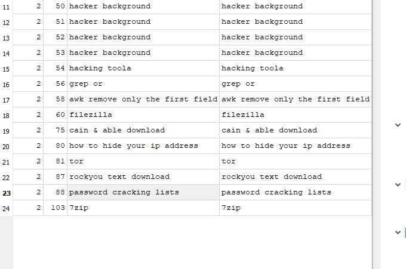
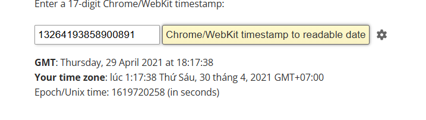
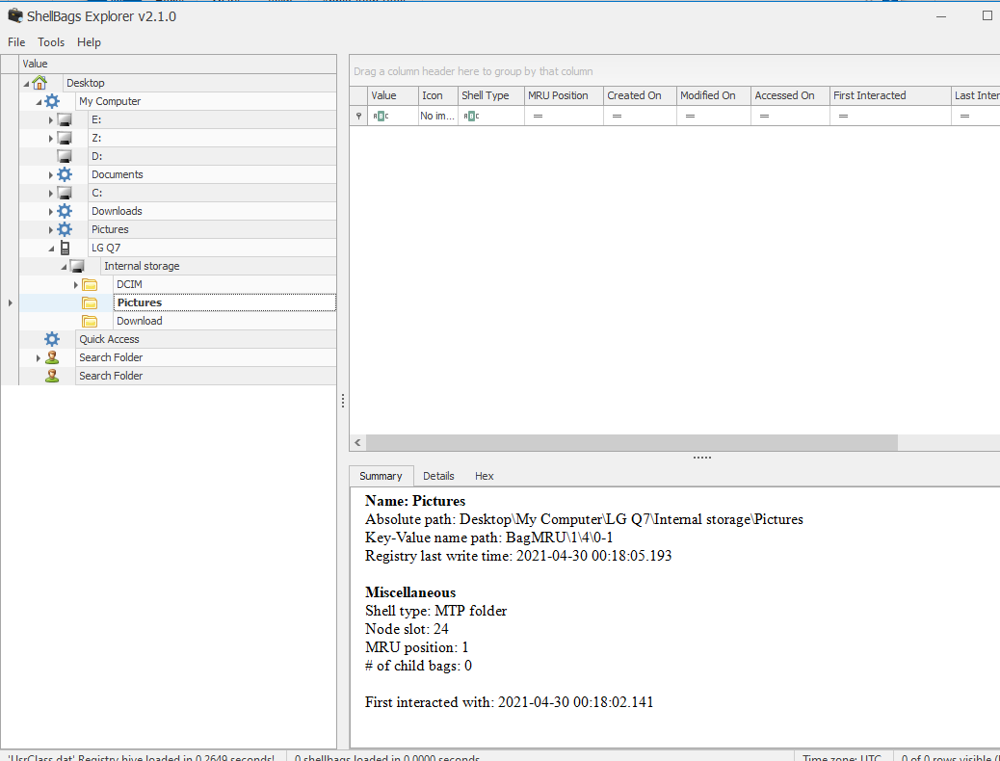

```c++
bettercap
bettercap --check-updates
bettercap -S
bettercap -X --no-spoofing
bettercap -version
bettercap -eval "caplets.update; ui.update; q"
bettercap -caplet http-ui
ipconfig
nmap -Sp 10.0.2.15
nmap -Sp 10.0.2.1-254
nmap -sP 10.0.2.1-254
ping 10.0.2.2.
ping 10.0.2.2
exit
sdelete
ipconfig
ipconfig /cleardns
ipconfig /flushdns
exit
sdelete
exit
ipconfig /flushdns
ping dfir.science
nmap dfir.science
dir
cd .\Documents\
dir
sdelete .\accountNum
sdelete .\accountNum.zip
exit
cd E:\FTK_Imager_Lite_3.1.1
& '.\FTK Imager.exe'
exit

```


### Q1 What is the MD5 hash value of the suspect disk? {#34a7b0eb61a48013b63fd2a66aa4d5d2}


9471e69c95d8909ae60ddff30d50ffa1


### Q2 What phrase did the suspect search for on 2021-04-29 18:17:38 UTC? (three words, two spaces in between) {#34a7b0eb61a4805ebe75c00692f5cc02}


**Lịch sử duyệt Web:** Thường nằm ở `AppData \ Local \ Google \ Chrome \ User Data \ Default \ History` (hoặc Edge/Firefox tương tự). 








https://mail.protonmail.com/inbox/bny065irncZH3RBv_sI_lHrGx1CbOBXKt5wZ6GXq0LvlHedpUeCyJeS7fdkiCKb1g1WwdSUU3qspWA6bjyQkLA==


```c++
import datetime

def date_from_webkit(webkit_timestamp):
    # 1. Define the Epoch as UTC
    # Using datetime.UTC is the modern, non-deprecated way (Python 3.11+)
    epoch_start = datetime.datetime(1601, 1, 1, tzinfo=datetime.timezone.utc)

    # 2. Add the microseconds
    delta = datetime.timedelta(microseconds=int(webkit_timestamp))
    utc_time = epoch_start + delta

    # 3. Print both UTC and Local time for clarity
    print(f"UTC Time:   {utc_time.strftime('%Y-%m-%d %H:%M:%S.%f')}")
    print(f"Local Time: {utc_time.astimezone().strftime('%Y-%m-%d %H:%M:%S.%f')}")

# Usage
try:
    inTime = input('Enter a WebKit timestamp: ').strip()
    if inTime:
        date_from_webkit(inTime)
except ValueError:
    print("Please enter a valid numeric timestamp.")
```


### Q3 What is the IPv4 address of the FTP server the suspect connected to? {#34a7b0eb61a480eb84b2d34c9f67d2b4}


192.168.1.20


Tìm trong Filezilla is **a free, open-source, and cross-platform File Transfer Protocol (FTP) client used to transfer files between a local computer and a remote web serve**


### Q4 What date and time was a password list deleted in UTC? (YYYY-MM-DD HH:MM:SS UTC) {#34a7b0eb61a480229b4beb2bdb109e67}


2021-04-29 18:22


### Q5 How many times was Tor Browser ran on the suspect's computer? (number only) {#34a7b0eb61a48032a407e52edfc39936}


Chỉ install không có nhấn


### Q6 What is the suspect's email address? {#34a7b0eb61a480f79ac0f76f38978301}


Dùng browsing history view của nirsoft. Ta có thể dùng cả của SQL db lite


Inbox | dreammaker82@protonmail.com | ProtonMail


### Q7 What is the FQDN did the suspect port scan? {#34a7b0eb61a480629e01f474ec234240}


dfir.science


```c++
bettercap
bettercap --check-updates
bettercap -S
bettercap -X --no-spoofing
bettercap -version
bettercap -eval "caplets.update; ui.update; q"
bettercap -caplet http-ui
ipconfig
nmap -Sp 10.0.2.15
nmap -Sp 10.0.2.1-254
nmap -sP 10.0.2.1-254
ping 10.0.2.2.
ping 10.0.2.2
exit
sdelete
ipconfig
ipconfig /cleardns
ipconfig /flushdns
exit
sdelete
exit
ipconfig /flushdns
ping dfir.science
nmap dfir.science
dir
cd .\Documents\
dir
sdelete .\accountNum
sdelete .\accountNum.zip
exit
cd E:\FTK_Imager_Lite_3.1.1
& '.\FTK Imager.exe'
exit

```


### Q8 What country was picture "20210429_152043.jpg" allegedly taken in? {#34a7b0eb61a48048a029d3372f48be73}


Dùng Exiftool ta được


```c++

C:\forensics\tools\exiftool-13.57_64>"exiftool(-k).exe" "C:\Users\cuong_nguyen\Desktop\CyberDefender\[root]\Users\John Doe\Pictures\Contact\20210429_151535.jpg"
ExifTool Version Number         : 13.57
File Name                       : 20210429_151535.jpg
Directory                       : C:/Users/cuong_nguyen/Desktop/CyberDefender/[root]/Users/John Doe/Pictures/Contact
File Size                       : 9.4 MB
File Modification Date/Time     : 2021:04:29 22:15:36+07:00
File Access Date/Time           : 2026:04:22 23:17:13+07:00
File Creation Date/Time         : 2021:04:30 07:18:31+07:00
File Permissions                : -rw-rw-rw-
File Type                       : JPEG
File Type Extension             : jpg
MIME Type                       : image/jpeg
Exif Byte Order                 : Big-endian (Motorola, MM)
Camera Model Name               : LM-Q725K
Orientation                     : Rotate 90 CW
Modify Date                     : 2021:04:29 15:15:35
Y Cb Cr Positioning             : Centered
Warning                         : [minor] Unrecognized MakerNotes
ISO                             : 50
Exposure Program                : Not Defined
F Number                        : 2.2
Exposure Time                   : 1/127
Sensing Method                  : One-chip color area
Sub Sec Time Digitized          : 862265
Sub Sec Time Original           : 862265
Sub Sec Time                    : 862265
Focal Length                    : 3.7 mm
Flash                           : Off, Did not fire
Metering Mode                   : Center-weighted average
Scene Capture Type              : Standard
User Comment                    : 0   AC original_brightness(114.4) bright_enhenced_level(0.0) brightness_shift(1.4) brightness_high_level(192), contrast_enhanced_level(18.9) isOutdoor(1) lux(228.5) FM0 CR0 Prmid2 mxDrkA0.01 mxBrtA0.09 mxPkNSat4.21 dr0.00 br34.11 wdr0.00 wbr23.49 sbr17.43 ldr0.00 lp51.0 [f0] 011111111bfalic 00000
Interoperability Index          : R98 - DCF basic file (sRGB)
Interoperability Version        : 0100
Create Date                     : 2021:04:29 15:15:35
Exposure Compensation           : 0
Digital Zoom Ratio              : 1
Exif Image Height               : 3120
White Balance                   : Auto
Date/Time Original              : 2021:04:29 15:15:35
Brightness Value                : 0
Exif Image Width                : 4160
Exposure Mode                   : Auto
Aperture Value                  : 2.2
Components Configuration        : Y, Cb, Cr, -
Color Space                     : sRGB
Scene Type                      : Directly photographed
Shutter Speed Value             : 1/127
Exif Version                    : 0220
Flashpix Version                : 0100
Resolution Unit                 : inches
GPS Altitude Ref                : Unknown (2.2)
X Resolution                    : 72
Y Resolution                    : 72
Make                            : LG Electronics
Thumbnail Offset                : 11247
Thumbnail Length                : 23283
Compression                     : JPEG (old-style)
Image Width                     : 4160
Image Height                    : 3120
Encoding Process                : Baseline DCT, Huffman coding
Bits Per Sample                 : 8
Color Components                : 3
Y Cb Cr Sub Sampling            : YCbCr4:2:0 (2 2)
Aperture                        : 2.2
Image Size                      : 4160x3120
Megapixels                      : 13.0
Shutter Speed                   : 1/127
Create Date                     : 2021:04:29 15:15:35.862265
Date/Time Original              : 2021:04:29 15:15:35.862265
Modify Date                     : 2021:04:29 15:15:35.862265
Thumbnail Image                 : (Binary data 23283 bytes, use -b option to extract)
GPS Altitude                    : 0 m Above Sea Level
Focal Length 35mm Equiv         : 3.7 mm
Light Value                     : 10.3
-- press ENTER --
```


Zambia


### Q9 What is the parent folder name picture "20210429_151535.jpg" was in before the suspect copy it to "contact" folder on his desktop? {#34a7b0eb61a4809d802ded7bc0da0aa4}


Ta dùng shellbag explorer. So sánh thời gian xác định Camera





### Q10 A Windows password hashes for an account are below. What is the user's password? Anon:1001:aad3b435b51404eeaad3b435b51404ee:3DE1A36F6DDB8E036DFD75E8E20C4AF4::: {#34a7b0eb61a4801fb424e16d4c5a925c}


NTLM hash không có salt. Có thể dùng rainbow attack được. Để recover ta vào trang web giải mã hash bất kỳ như là hashes dot com


AFR1CA!


### Q11 What is the user "John Doe's" Windows login password? {#34a7b0eb61a480558872cbc896b16a32}


`mimikatz # lsadump::sam /system:C:\Users\cuong_nguyen\Desktop\CyberDefender\[root]\Windows\System32\config\SYSTEM /sam:C:\Users\cuong_nguyen\Desktop\CyberDefender [root]\Windows\System32\config\SAM

RID  : 000003e9 (1001)
User : John Doe
  Hash NTLM: ecf53750b76cc9a62057ca85ff4c850e`


