---


[https://cyberdefenders.org/blueteam-ctf-challenges/africanfalls/](https://cyberdefenders.org/blueteam-ctf-challenges/africanfalls/)


### Q1 What is the MD5 hash value of the suspect disk? {#34a7b0eb61a48013b63fd2a66aa4d5d2}


Whenever the evidence is collected using disk acquisition tools, a log file is typically generated alongside with it. By extracting the lab file, i found a file named `DiskDrigger.ad1.txt` which holds the MD5 hash information.


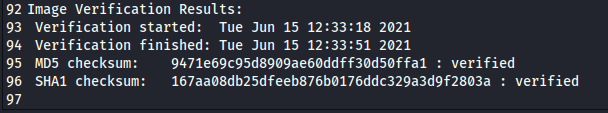


> `9471e69c95d8909ae60ddff30d50ffa1`


### Q2 What phrase did the suspect search for on 2021-04-29 18:17:38 UTC? (three words, two spaces in between) {#34a7b0eb61a4805ebe75c00692f5cc02}


This question requires some browser forensics investigation skills. 


Loading the evidence file into FTK imager and inspecting the users folders reveals that there is only one user on this machine: `John Doe.`


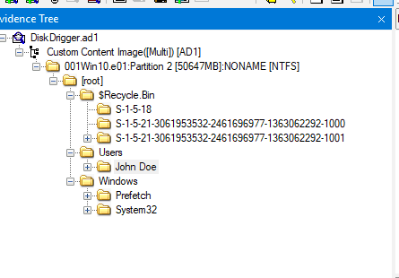


I then searched for the browser that’s on the machine, identifying Google Chrome and Brave


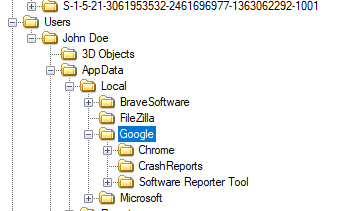


The Chrome history file is stored at `Users\John Doe\AppData \ Local \ Google \ Chrome \ User Data \ Default \ History` (the similar path applies to Brave - a chromium-based web browser) . And by utilizing BrowsingHistoryView (Nirsoft) to read the history file, we can retrieve the answer


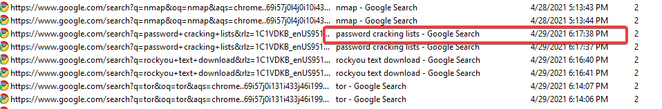


> `password cracking lists`


I also applied the similar method with Brave:


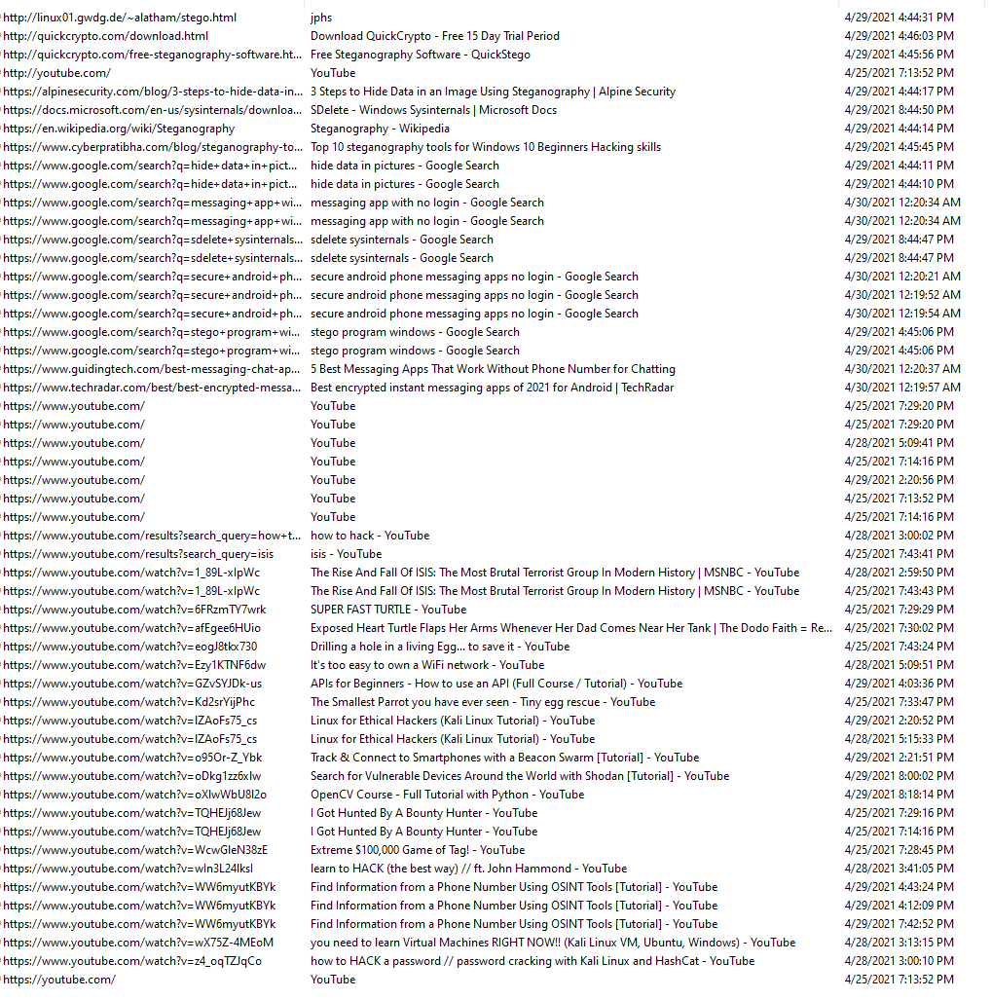


It appears the user was researching how to crack passwords using Hashcat and how to use SDelete (a Sysinternals tool).


### Q3 What is the IPv4 address of the FTP server the suspect connected to? {#34a7b0eb61a480eb84b2d34c9f67d2b4}


From previous question, we also found that Filezilla is install on the host.


Filezilla is a free, open-source, and cross-platform File Transfer Protocol (FTP) client used to transfer files between a local computer and a remote web server.


By reviewing the FileZilla configuration file: filezilla.xml


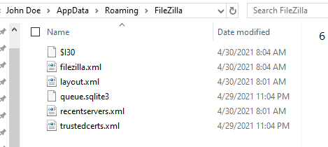


We get the answer:


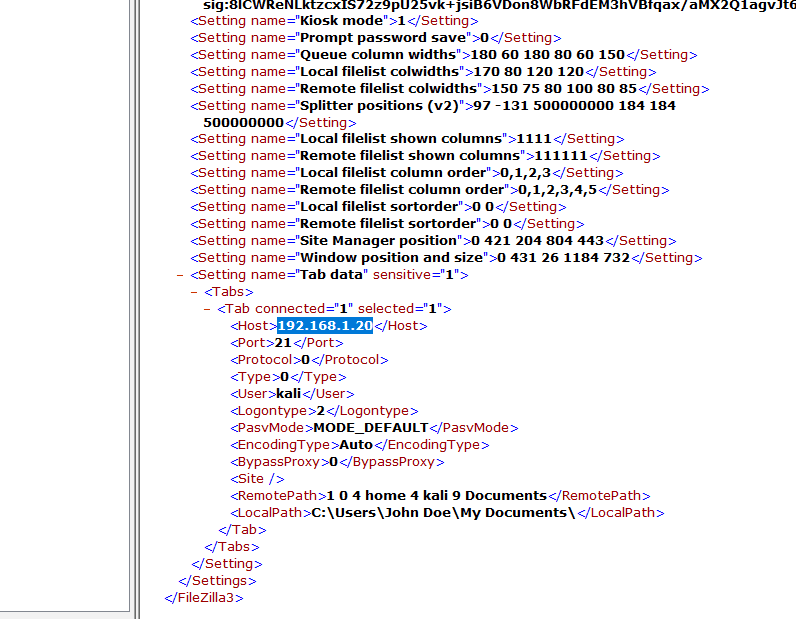


> `192.168.1.20`


### Q4 What date and time was a password list deleted in UTC? (YYYY-MM-DD HH:MM:SS UTC) {#34a7b0eb61a480229b4beb2bdb109e67}


When a file is deleted, Windows splits it into two separate components:

- The `$I` stands for Information. This file holds the metadata about the deleted file.
	- **Original File Size:** How big the file was before it was deleted.
	- **Deletion Timestamp:** The exact date and time the user deleted the file (stored in UTC format).
	- **Original File Path:** The exact location where the file used to live on the hard drive (e.g., `C:\Users\John\Documents\report.docx`).
- The `$R` stands for Recovery or Raw Data. This file holds the actual content of the file you deleted.

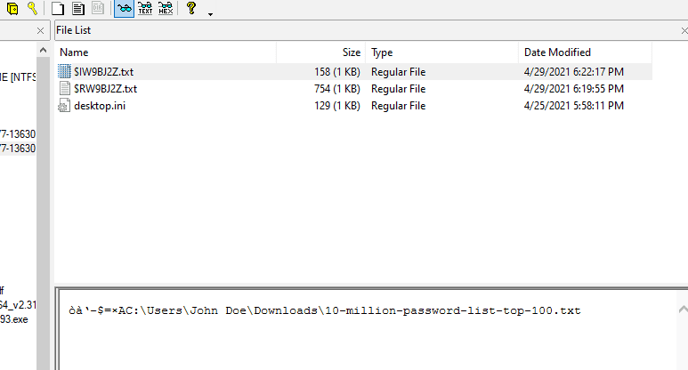


By looking at the $I file, the answer must be:


> `2021-04-29 18:22`


### Q5 How many times was Tor Browser ran on the suspect's computer? (number only) {#34a7b0eb61a48032a407e52edfc39936}


To find evidence of execution, the most reliable artifact is prefetch which resides in `C:\Windows\Prefetch`


For this question i used WinPrefetchView (also bt NirSoft):


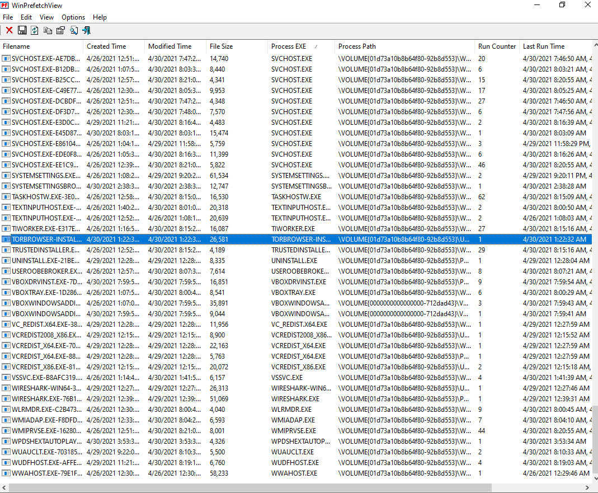


I found evidence of the installer, but no sign of the Tor browser actually being executed. Therefore, the answer should be:


> 0


### Q6 What is the suspect's email address? {#34a7b0eb61a480f79ac0f76f38978301}


Scrolling through John Doe's browsing history again reveals access to a ProtonMail inbox:


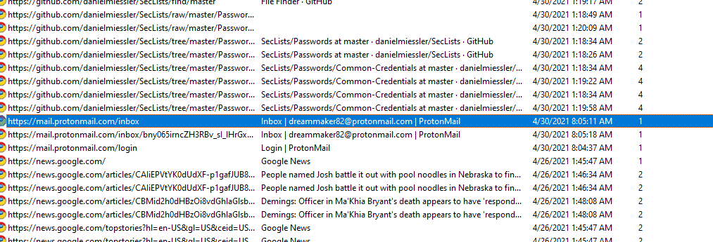


> dreammaker82@protonmail.com


### Q7 What is the FQDN did the suspect port scan? {#34a7b0eb61a480629e01f474ec234240}


`ConsoleHost_history.txt` is a legitimate, default PowerShell file that acts as a log, storing up to 4,096 of the most recently executed commands for user convenience. 


Path: `C:\Users\<Username>\AppData\Roaming\Microsoft\Windows\PowerShell\PSReadLine\ConsoleHost_history.txt`


**Forensic significance:** It allows investigators to determine exactly what commands the user or attacker executed in PowerShell.


```c++
bettercap
bettercap --check-updates
bettercap -S
bettercap -X --no-spoofing
bettercap -version
bettercap -eval "caplets.update; ui.update; q"
bettercap -caplet http-ui
ipconfig
nmap -Sp 10.0.2.15
nmap -Sp 10.0.2.1-254
nmap -sP 10.0.2.1-254
ping 10.0.2.2.
ping 10.0.2.2
exit
sdelete
ipconfig
ipconfig /cleardns
ipconfig /flushdns
exit
sdelete
exit
ipconfig /flushdns
ping dfir.science
nmap dfir.science
dir
cd .\Documents\
dir
sdelete .\accountNum
sdelete .\accountNum.zip
exit
cd E:\FTK_Imager_Lite_3.1.1
& '.\FTK Imager.exe'
exit

```


> dfir.science


### Q8 What country was picture "20210429_152043.jpg" allegedly taken in? {#34a7b0eb61a48048a029d3372f48be73}


Using ExifTool with the `-a` flag to extract the image metadata.


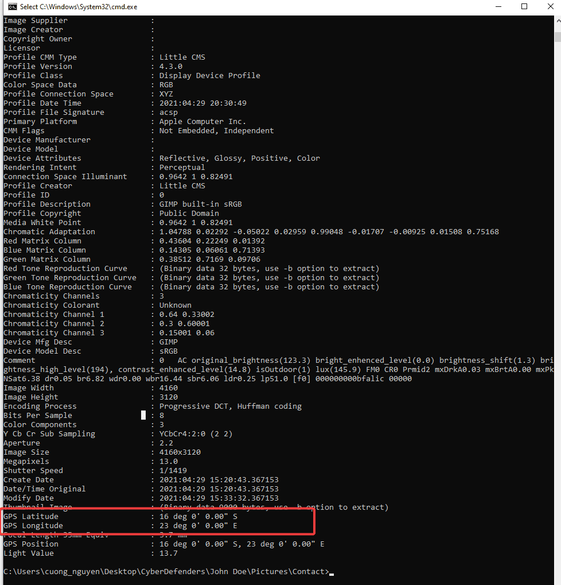


Search for the GPS coordinates results in:


> Zambia


### Q9 What is the parent folder name picture "20210429_151535.jpg" was in before the suspect copy it to "contact" folder on his desktop? {#34a7b0eb61a4809d802ded7bc0da0aa4}


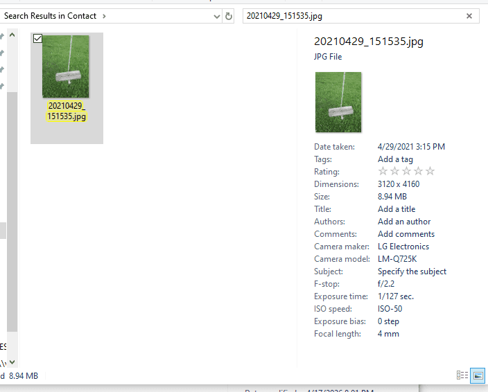


I searched on google for the device model:


It’s the LG Q7 - a smartphone. The image was captured on the phone and then imported to the PC. To confirm the origin folder, i used shellbags explorer


Shellbags indicates the folder that the user had interacted with. So every folder the user touched, is stored in shellbags. There are 2 types of shellbags based on type of folder being accessed:

- `NTUSER.dat` : tracks interactions with **network locations**, **mapped network drives**, and sometimes folders located directly on the user's Desktop.
- `USRCLASS.dat` : records interactions with the **local file system** and **removable media**.

USRCLASS proves to be more useful in this case


Using ShellBags Explorer, we can see the interaction time alligns perfectly with our hypothesis


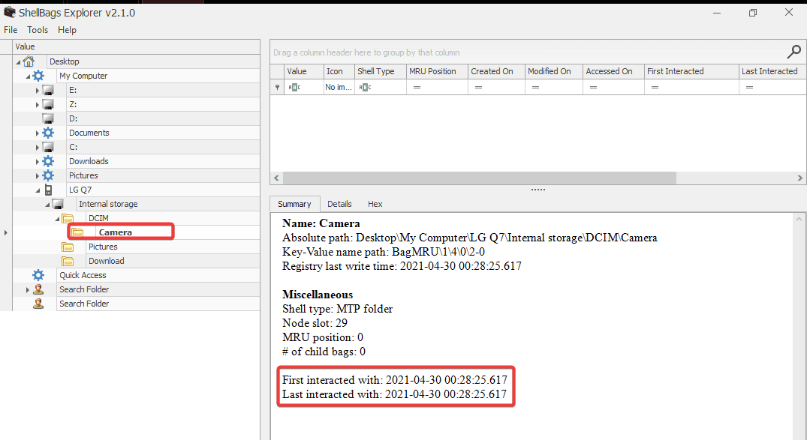


So the answer should be: 


> Camera


### Q10 A Windows password hashes for an account are below. What is the user's password?Anon:1001:aad3b435b51404eeaad3b435b51404ee:3DE1A36F6DDB8E036DFD75E8E20C4AF4::: {#34a7b0eb61a4801fb424e16d4c5a925c}


NTLM hashes are not salted. Therefore, a rainbow table attack can be used. To recover the password, you can use any online hash decryption website, such as [hashes.com](http://hashes.com/).


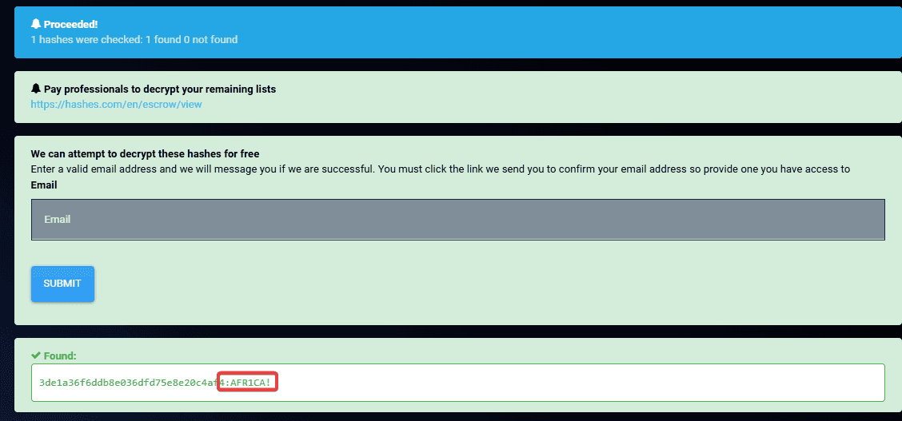


> AFR1CA!


### Q11 What is the user "John Doe's" Windows login password? {#34a7b0eb61a480558872cbc896b16a32}


I used mimikatz to extract the NTLM hash from SAM hive:


```sql
mimikatz # lsadump::sam /system:C:\Users\cuong_nguyen\Desktop\CyberDefender\[root]\Windows\System32\config\SYSTEM /sam:C:\Users\cuong_nguyen\Desktop\CyberDefender [root]\Windows\System32\config\SAM
```


`RID  : 000003e9 (1001)
User : John Doe
  Hash NTLM: ecf53750b76cc9a62057ca85ff4c850e`


And navigated to [hashes.com](http://hashes.com/) to decrypt the hash:


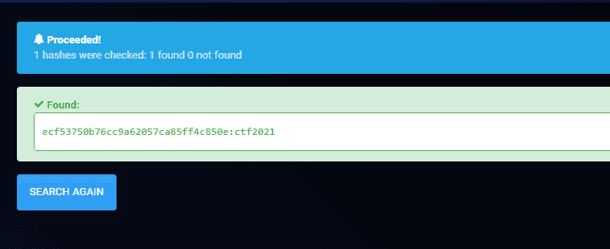


> ctf2021

