---


[https://cyberdefenders.org/blueteam-ctf-challenges/corporatesecrets/](https://cyberdefenders.org/blueteam-ctf-challenges/corporatesecrets/)


Q1 What is the current build number on the system?


16299


Q2 How many users are there? 6


Q3 What is the CRC64 hash of the file "fruit_apricot.jpg"?

- Click chuột phải vào file đó.
- Chọn mục **7-Zip** (Hoặc Show more options -&gt; 7-Zip nếu dùng Windows 11).
- Chọn **CRC SHA** &gt; Chọn **CRC-64**.

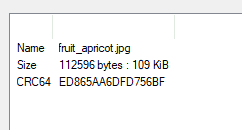


CRC64 là checksum để kiểm tra lỗi.


Q4 What is the logical size of the file "strawberry.jpg" in bytes?


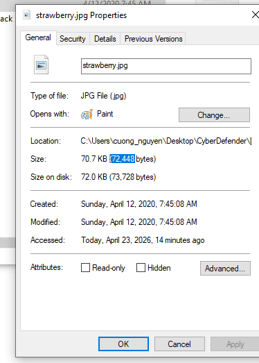


Q5 What is the processor architecture of the system? (one word)


ControlSet001\Control\Session Manager\Environment


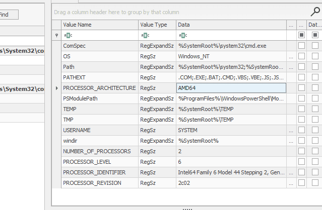


Q6 Which user has a photo of a dog in their recycling bin?


ta tìm thấy con chó là của user: 10051


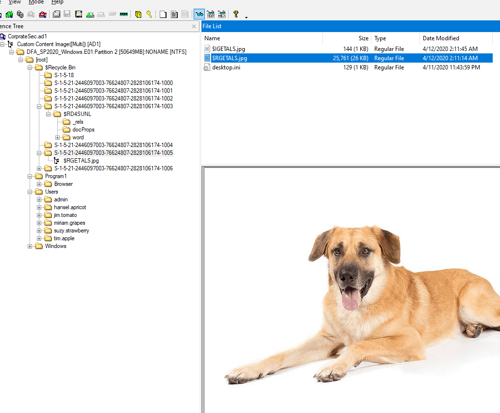


Navigate tới: `SOFTWARE\Microsoft\Windows NT\CurrentVersion\ProfileList`.


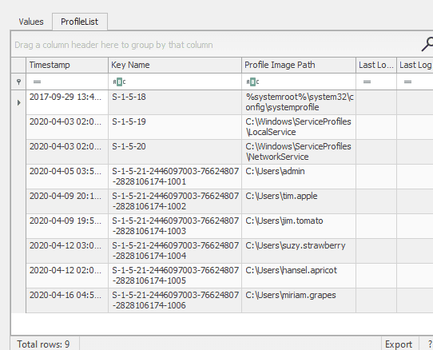


Ta biết là hansel.apricot


Q7 What type of file is "vegetable"? Provide the extension without a dot.


Parent Path
.\Users\miriam.grapes\Pictures\


Dùng exiftool ta nhận được


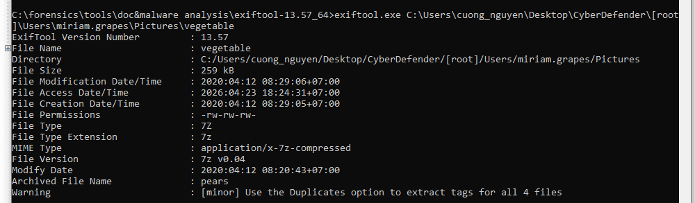


7z


Q8 What type of girls does Miriam Grapes design phones for (Target audience)?


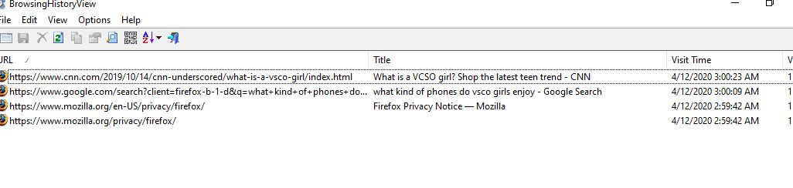


Q9 What is the name of the device?


Data
DESKTOP-3A4NLVQ


Q10 What is the SID of the machine?


Key Name
S-1-5-21-2446097003-76624807-2828106174


Q11 How many web browsers are present?


firefox, chrome, tor, internet explorer, omni


### Q12 How many super secret CEO plans does Tim have? (Dr. Doofenshmirtz Type Beat) {#34b7b0eb61a480558b6fcc75a374205f}


4


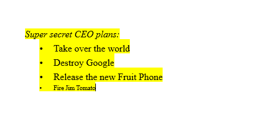


### Q13 Which employee does Tim plan to fire? (He's Dead, Tim. Enter the full name - two words - space separated) {#34b7b0eb61a48079a709f29f13d45a6c}


### Q14 What was the last used username? (I didn't start this conversation, but I'm ending it!) {#34b7b0eb61a480a4996cf87ef7a0c8cc}


Kiểm tra lại 
C:\Users\jim.tomato


### Q15 What was the role of the employee Tim was flirting with? {#34b7b0eb61a4805d9112cf9ec1ee7ea3}


### Q16 What is the SID of the user "suzy.strawberry"? {#34b7b0eb61a4801d9595e1c76b0eff36}


### Q17 List the file path for the install location of the Tor Browser. {#34b7b0eb61a480a1a276d4627c53a510}


C:\Program1


### Q18 What was the URL for the Youtube video watched by Jim? {#34b7b0eb61a4801887aef2eb933f784f}


[https://www.youtube.com/watch?v=Y-CsIqTFEyY](https://www.youtube.com/watch?v=Y-CsIqTFEyY)


Dùng history của chrome


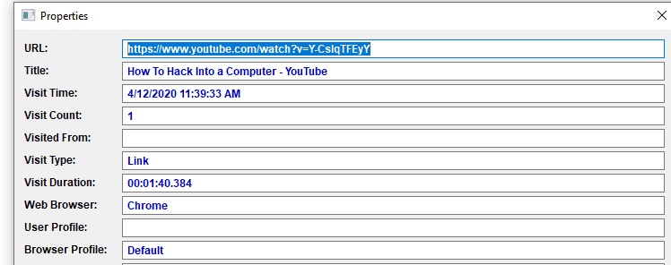


Q19 Which user installed LibreCAD on the system?


miriam.grapes


Dùng MFT


### Q20 How many times "admin" logged into the system? {#34b7b0eb61a480419bb4d15fa4467f41}


vào SAM account


### Q21 What is the name of the DHCP domain the device was connected to? {#34b7b0eb61a48030a7b5f7bbb572c5b9}


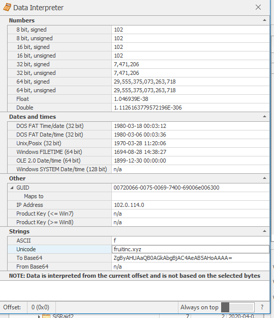


fruitinc.xyz


Q22 What time did Tim download his background image? (Oh Boy 3AM . Answer in MM/DD/YYYY HH:MM format (UTC).)


04/05/2020 03:49


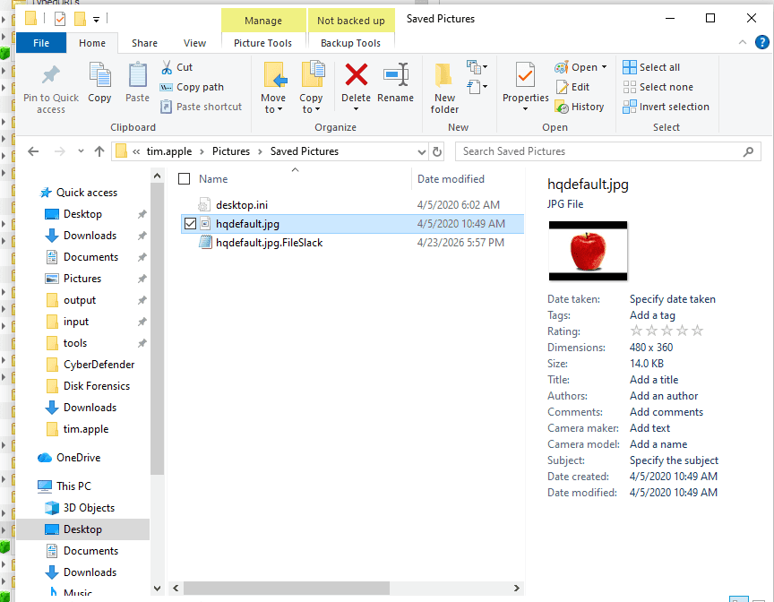


Q23 How many times did Jim launch the Tor Browser?


C:\Users\jim.tomato\AppData\Roaming\Microsoft\Windows\Start Menu\Programs\Start Tor Browser.lnk C:\Tor Browser\Browser\firefox.exe 


### Q24 There is a png photo of an iPhone in Grapes's files. Find it and provide the SHA-1 hash. {#34b7b0eb61a480548111d664290748cd}


**Loại A: Nhồi nhét cấu trúc (File Appending / EOF)**

- **Cách hoạt động:** Hacker lấy một file ảnh hợp lệ, kéo xuống tận cùng của file đó (End of File - EOF) và dán (append) mã vạch (hex) của một file khác (ví dụ: một file `.zip`, `.exe` hoặc đoạn text) vào ngay bên dưới.
- **Kết quả:** Trình xem ảnh vẫn mở bức ảnh lên bình thường vì nó sẽ ngừng đọc khi gặp cờ "Kết thúc ảnh", bỏ qua đoạn mã độc đính kèm phía sau.

**Loại B: Giấu tin vào điểm ảnh (True Steganography)**

- **Cách hoạt động:** Dữ liệu bị băm nhỏ và giấu vào các bit màu của bức ảnh.
- **Định dạng PNG/BMP (Lossless):** Thường dùng kỹ thuật **LSB (Least Significant Bit)**. Hacker thay đổi bit cuối cùng của mỗi điểm ảnh (pixel). Mắt người không thể nhận ra sự khác biệt về màu sắc, nhưng các đoạn bit đó ghép lại sẽ thành một file bí mật.
- **Định dạng JPG (Lossy):** Vì JPG nén ảnh bằng cách vứt bỏ dữ liệu thừa, nếu dùng LSB thì file bí mật sẽ bị hỏng. Thay vào đó, chúng giấu tin vào các hệ số nén (DCT coefficients).
- **Định dạng WebP:** Có thể áp dụng cả hai cách trên (tùy thuộc vào WebP đang nén lossy hay lossless), hoặc giấu vào thẻ metadata (EXIF/XMP).

Cách xử lý

- **Quét cấu trúc (Loại A):** * Dùng `binwalk` trên máy Kali.
	- Nếu muốn làm trên Windows, hãy mở file đó bằng **`HxD`** (Hex Editor mà bạn có ở thư mục `Miscellaneous`). Cuộn xuống cuối cùng xem có đoạn text nào dạng rõ, hoặc có header lạ nào bị dính ở đuôi không.
- **Giải mã Pixel (Loại B):**
	- Nếu là JPG/WebP: Dùng công cụ **`steghide`** (trên máy Kali) để thử extract. Lệnh: `steghide extract -sf samplePhone.webp` (Nó có thể đòi mật khẩu).
	- Nếu là PNG: Dùng công cụ **`zsteg`** trên máy Kali. Nó chuyên trị LSB.

Dùng binwalk


	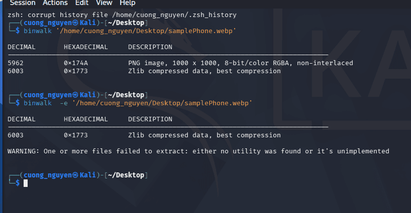


	ta thấy có một file ảnh được giấu ở vị trí 0x174A tương đương 5962


	dùng dd:


	```c++
	dd if =samplePhone.webp of=hidden_image.png bs=1 skip=5962
	```


	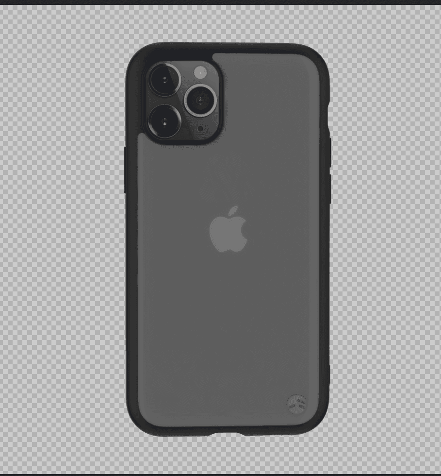


	537fe19a560ba3578d2f9095dc2f591489ff2cde


### Q25 When was the last time a docx file was opened on the device? (An apple a day keeps the docx away. Answer in UTC, YYYY-MM-DD HH:MM:SS) {#34b7b0eb61a4801c9c39ff7e9d48e171}


Extension Last Opened
2020-04-11 23:23:36


Vào recentdocs của jim.tomato


### Q26 How many entries does the MFT of the filesystem have? {#34b7b0eb61a48044a5bfd60bb389751e}


219904


Dùng mfpdump.py


### Q27 Tim wanted to fire an employee because they were ......?(Be careful what you wish for) {#34b7b0eb61a4800e92b8edb9507432e9}


stinky


### Q28 What cloud service was a Startup item for the user admin? {#34b7b0eb61a48005aed5c879c025697e}


Vào key run của admin


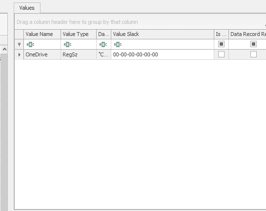


### Q29 Which Firefox prefetch file has the most runtimes? (Flag format is ) {#34b7b0eb61a480b5889ae60e6872b035}


Source Filename
FIREFOX.EXE-A606B53C.pf/21


### Q30 What was the last IP address the machine was connected to? {#34b7b0eb61a4808fab71dc9f7ef7d5ae}


192.168.2.242


Không tìm được kết quả này


### Q31 Which user had the most items pinned to their taskbar? {#34b7b0eb61a48063b2b6d47e75cc5733}


C:\Users\USERNAME\AppData\Roaming\Microsoft\Internet Explorer\Quick Launch\User Pinned\TaskBar


Lần lượt tìm cho những người dùng khác


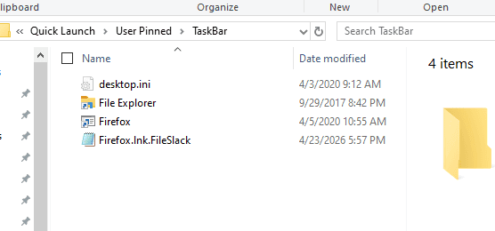


admin


### Q32 What was the last run date of the executable with an MFT record number of 164885? (Format: MM/DD/YYYY HH:MM:SS (UTC).) {#34b7b0eb61a480098f13dca5c106612c}


Dùng mFT để tìm file, sau đó dùng prefetch xác định thời gian cuối cùng chạy


04/12/2020 02:32:09


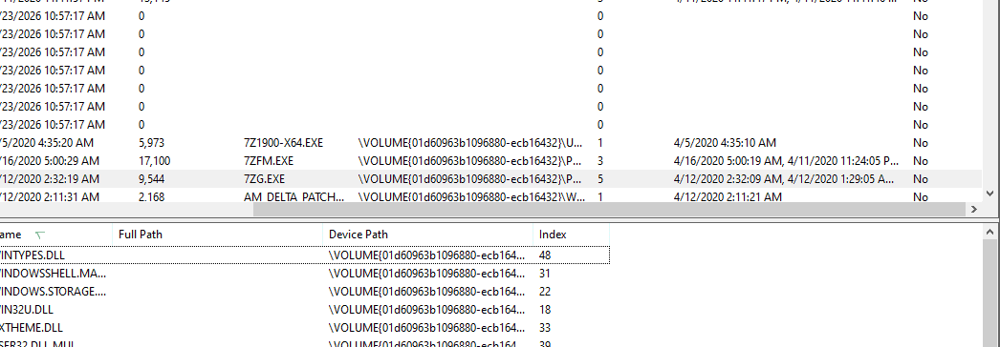


### Q33 What is the log file sequence number for the file "fruit_Assortment.jpg"? {#34b7b0eb61a480bc9050f787919fca78}


1276820064


Dùng MFT 


### Q34 Jim has some dirt on the company stored in a docx file. Find it, the flag is the fourth secret, in the format of &lt;"The flag is a sentence you put in quotes"&gt;. (Secrets, secrets are no fun) {#34b7b0eb61a480828e86f58facb7722a}


ta tìm trong recycle bin phát hiện một số file nghi vấn 


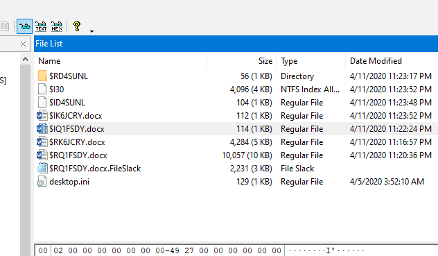


Kiểm tra bằng binwalk


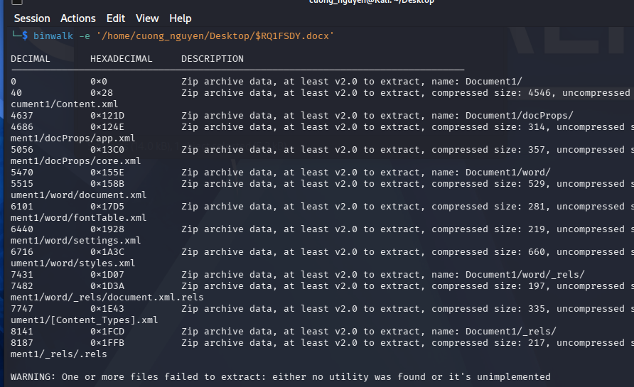


Tiếp tục kiểm tra bằng exitftool phát hiện file xml là file docx


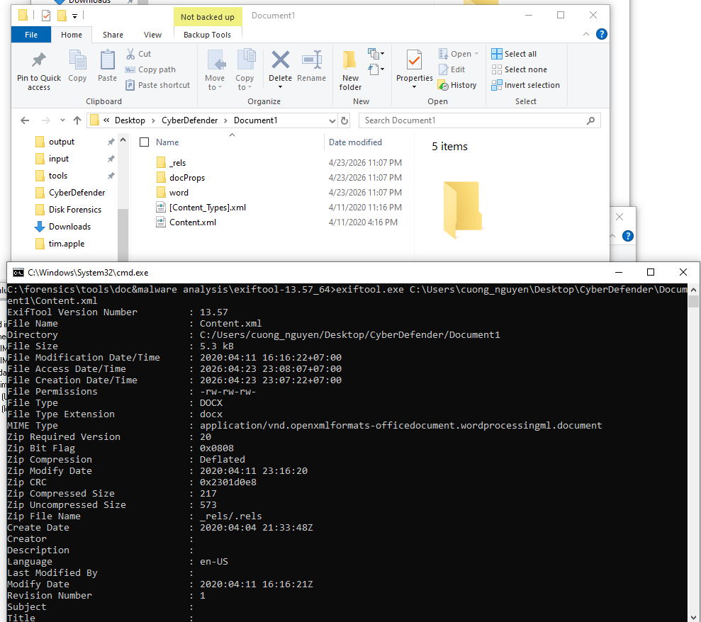


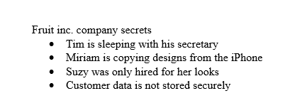


Customer data is not stored securely 


### Q35 In the company Slack, what is threatened to be deactivated if the user gets their email deactivated? {#34b7b0eb61a480bdaeb4e56126c09c94}


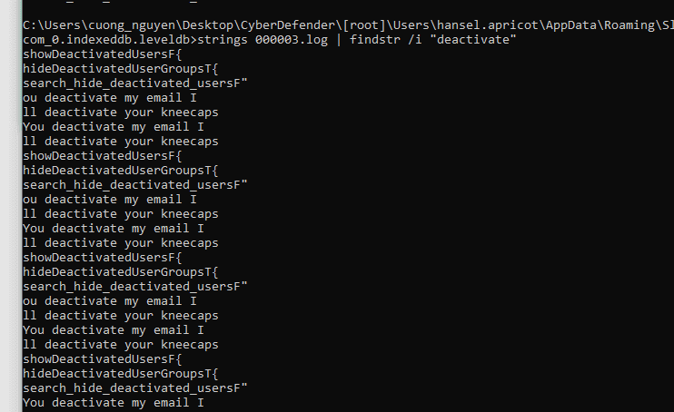


kneecaps

