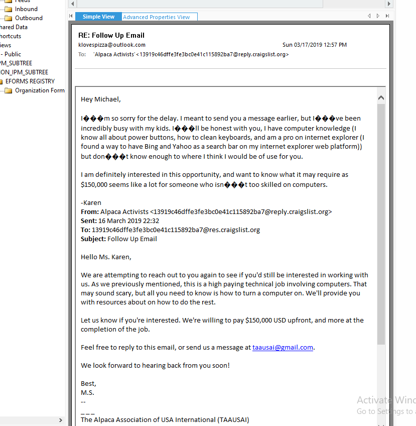
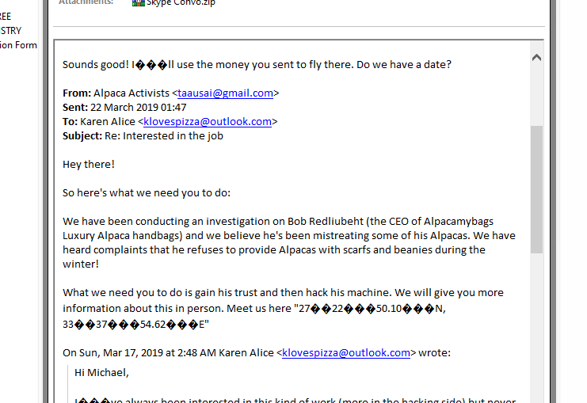
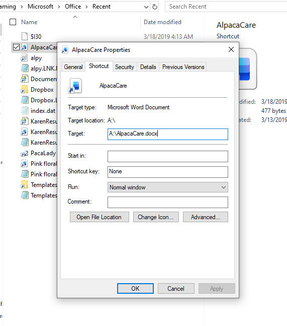
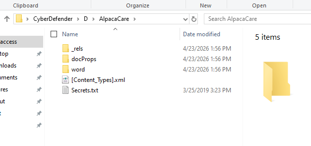

Data
TOTALLYNOTAHACK

### Q1 What is the administrator's username? {#34b7b0eb61a480bb8d50dbbbc80ae2d6}

karen

### Q2 What is the OS's build number? {#34b7b0eb61a48021b683fbf1a933effb}

16299

Microsoft\Windows NT\CurrentVersion

### Q3 What is the hostname of the computer? {#34b7b0eb61a48015ad92c247b42722f3}

TOTALLYNOTAHACK

ControlSet001\Control\ComputerName\ComputerName

### Q4 A messaging application was used to communicate with a fellow Alpaca enthusiest. What is the name of the software? {#34b7b0eb61a480679930e6d8f6151122}

Skype

### Q5 What is the zip code of the administrator's post? {#34b7b0eb61a480bf930ede3f8a4c70e8}

Tìm trong autofill của chrome

### Q6 What are the initials of the person who contacted the admin user from TAAUSAI? {#34b7b0eb61a48065bd5ccdefec27a53d}

### Q7 How much money was TAAUSAI willing to pay upfront? {#34b7b0eb61a480a79d9ac0bbfb8e10df}

150000

### Q8 What country is the admin user meeting the hacker group in? {#34b7b0eb61a480148c0cc88afbe270f2}

Tọa độ **27°22'50.10"N, 33°37'54.62"E**

một công trình nghệ thuật trên đất (land art) khổng lồ tọa lạc giữa sa mạc Sahara thuộc Ai Cập, gần bờ Biển Đỏ và thị trấn Hurghada. Tác phẩm này được nhóm nghệ sĩ [D.A.ST](http://d.a.st/). Arteam (gồm Danae Stratou, Alexandra Stratou và Stella Constantinides) thiết kế và hoàn thành vào tháng 3 năm 1997.

### Q9 What is the machine's timezone? (Use the three-letter abbreviation) {#34b7b0eb61a480b380dec4a103c705ca}

UTC

### Q10 When was AlpacaCare.docx last accessed? {#34b7b0eb61a480c6a758fe55b9f9048f}

2019-03-17 21:52

Dùng MFT tại ổ D

### Q11 There was a second partition on the drive. What is the letter assigned to it? {#34b7b0eb61a480749c6de3c55fc07fff}

Trong FTK imager thì ổ Tên là PacaLady.

Trong chỗ này cũng có link tới ổ đó

Có thể dùng **SYSTEM\MountedDevices”**

### Q12 What is the answer to the question Company's manager asked Karen? {#34b7b0eb61a4801c8d47fc5f911a937e}

TheCardCriesNoMore

### Q13 What is the job position offered to Karen? (3 words, 2 spaces in between) {#34b7b0eb61a480758468f01e224dff23}

Cyber Security Analyst

### Q14 When was the admin user password last changed? {#34b7b0eb61a480459fbfd3444ab66670}

Dùng SAM hives vào `SAM` &gt; `Domains` &gt; `Account` &gt; `Users`.

Last Password Change
2019-03-21 19:13:09

03/21/2019 19:13:09

### Q15 What version of Chrome is installed on the machine? {#34b7b0eb61a480d7bd76ead040943f09}

72.0.3626.121

ta tìm last version trong C:\Users\cuong_nguyen\Desktop\CyberDefender\[root]\Users\Karen\AppData\Local\Google\Chrome\User Data

### Q16 What is the URL used to download Skype? {#34b7b0eb61a480199e62c9d06d852cdc}

https://download.skype.com/s4l/download/win/Skype-8.41.0.54.exe

Trong file tải về từ internet sẽ có zone.identifier để biết tải về từ nguồn nào và referer từ đâu

### Q17 What is the domain name of the website Karen browsed on Alpaca care that the file AlpacaCare.docx is based on? {#34b7b0eb61a4802d8817e1c4a55696f8}

các File office docx, xlsx, pptx thực chất là một file zip chứa thư mục, hình ảnh và hàng loạt mã xml.

Có thể dùng 7zip để extract

http://palominoalpacafarm.com/"

Trong tiêu đề file nếu hover cũng có.

