---

[https://cyberdefenders.org/blueteam-ctf-challenges/hireme/](https://cyberdefenders.org/blueteam-ctf-challenges/hireme/)

## Scenario {#3607b0eb61a480b5b795df6311b54044}

Karen is a security professional looking for a new job. A company called "TAAUSAI"  offered her a position and asked her to complete a couple of tasks to prove her technical competency. As a soc analyst Analyze the provided disk image and answer the questions based on your understanding of the cases she was assigned to investigate.

## Questions {#3607b0eb61a4805b808dcbc7a6c4b7b8}

### Q1 What is the administrator's username? {#34b7b0eb61a480bb8d50dbbbc80ae2d6}

Initial inspection of the evidence image reveals only one user profile: Karen.

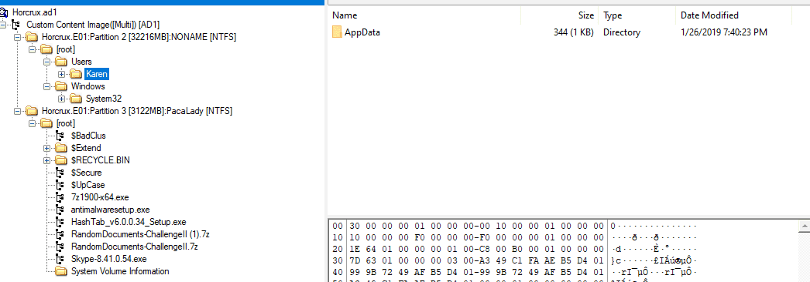

I also used regripper to check the SAM hive:

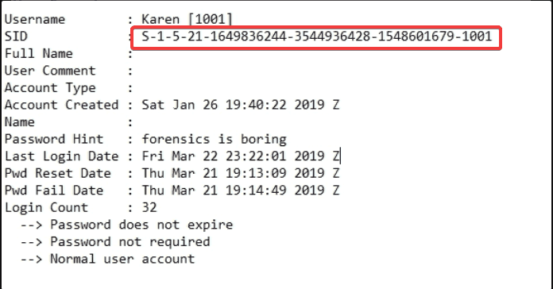

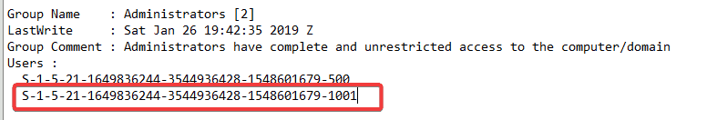

We can see here that Karen was added to Administrators group. So the answer is:

> `karen`

### Q2 What is the OS's build number? {#34b7b0eb61a48021b683fbf1a933effb}

The build number can be identified by navigating to the registry path:`Microsoft\Windows NT\CurrentVersion`

> 16299

### Q3 What is the hostname of the computer? {#34b7b0eb61a48015ad92c247b42722f3}

The hostname is located within the `SYSTEM` hive under: `ControlSet001\Control\ComputerName\ComputerName`

> TOTALLYNOTAHACK

### Q4 A messaging application was used to communicate with a fellow Alpaca enthusiest. What is the name of the software? {#34b7b0eb61a480679930e6d8f6151122}

Inspecting the user’s chrome history reveals that she installed Skype and also accessed Outlook

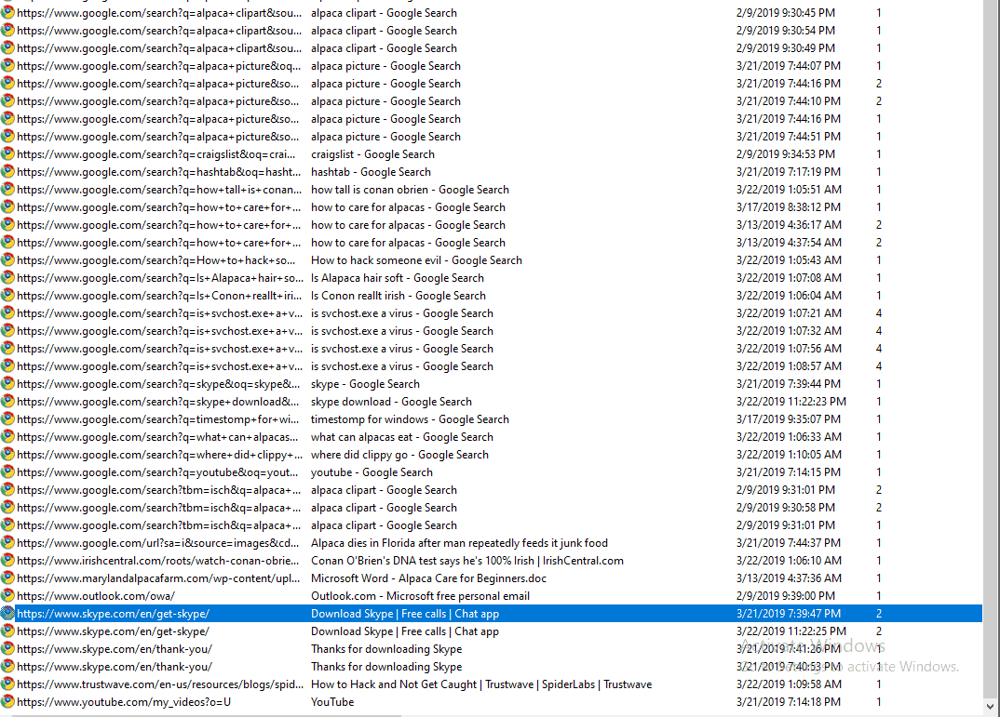

Skype is a messaging app, so the answer is:

> Skype

### Q5 What is the zip code of the administrator's post? {#34b7b0eb61a480bf930ede3f8a4c70e8}

The Chrome browser's Autofill feature frequently stores user information, including names, addresses, phone numbers, and zip codes. Navigating to the `Web Data` file located in the same directory as the Chrome history database and browsingthe `autofill` table via DB Browser for SQLite,  we can see the saved zip code.

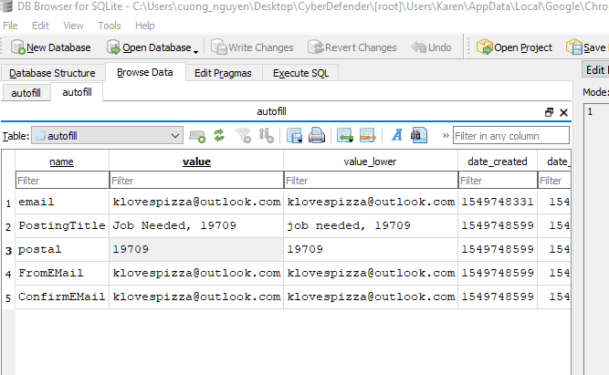

> 19709

### Q6 What are the initials of the person who contacted the admin user from TAAUSAI? {#34b7b0eb61a48065bd5ccdefec27a53d}

Follow the prior findings, we already know that Karen also used Outlook. By heading to `C\Users\Karen\AppData\Local\Microsoft\Outlook` , we can retrieve `klovespizza@outlook.com.ost`

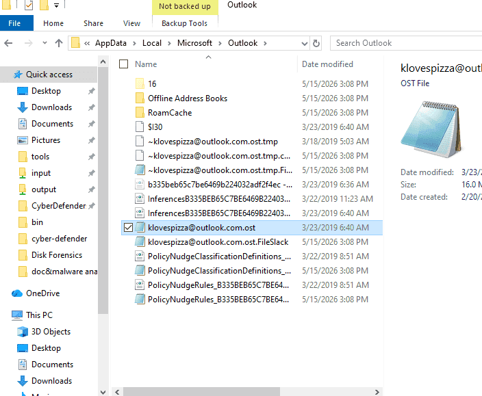

Using Outlook forensics tool to open the ost file. In this case, i used Kernel OST viewer and skimmed through the inbox.

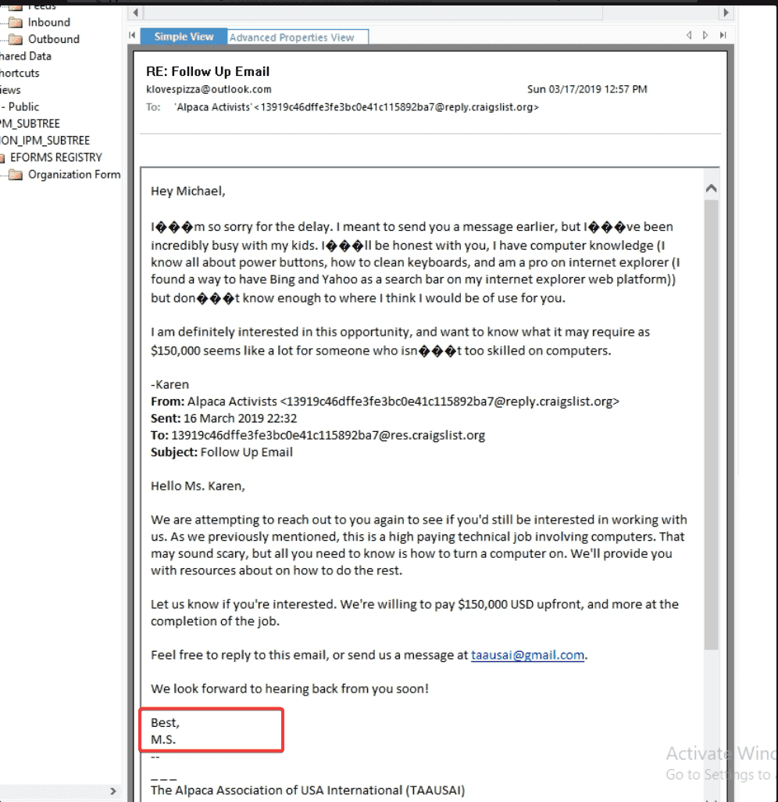

> MS

### Q7 How much money was TAAUSAI willing to pay upfront? {#34b7b0eb61a480a79d9ac0bbfb8e10df}

Returning to the email  discovered in the `.ost` file, the offer terms are explicitly stated.

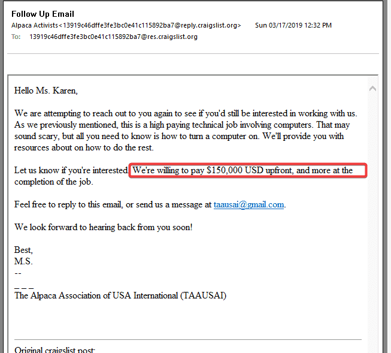

150000

### Q8 What country is the admin user meeting the hacker group in? {#34b7b0eb61a480148c0cc88afbe270f2}

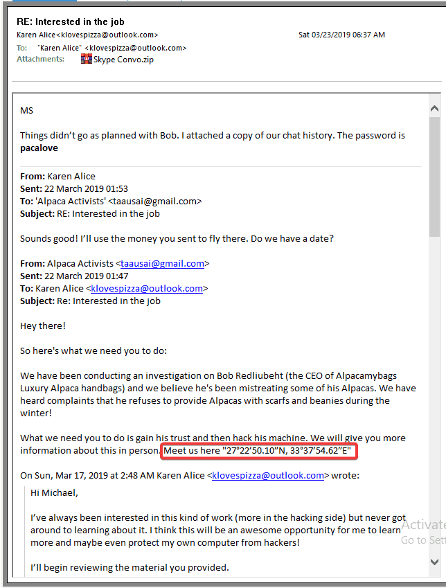

The coordinate is: 27°22'50.10"N, 33°37'54.62"E. I did a gogle search and get the result: These coordinates point to the **Desert Breath**, a massive 1-million-square-foot land art installation located **in the Red Sea Governorate of the Eastern Egyptian Desert, near Hurghada**.

_Desert Breath_ is a land art project created by the D.A.ST. Arteam. The team was founded in 1995 by Danae Stratou (installation artist), Alexandra Stratou (industrial designer & architect) and Stella Constantinides (architect) for the purpose of creating this specific project.

> Egypt

### Q9 What is the machine's timezone? (Use the three-letter abbreviation) {#34b7b0eb61a480b380dec4a103c705ca}

The timezone configuration can be identified by inspecting the `TimeZoneInformation` key within the `SYSTEM` registry hive.

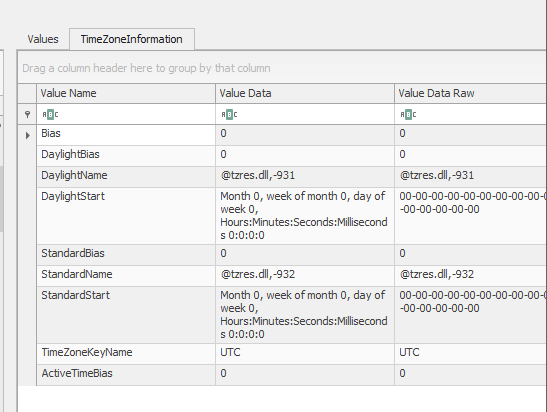

> UTC

### Q10 When was AlpacaCare.docx last accessed? {#34b7b0eb61a480c6a758fe55b9f9048f}

I extracted the $MFT file and used mftEcmd.exe to parse it and retrieve the result:

> 2019-03-17 21:52

### Q11 There was a second partition on the drive. What is the letter assigned to it? {#34b7b0eb61a480749c6de3c55fc07fff}

The evidence image is known to consist of 2 primary partitions:

- Multi
- PacaLady

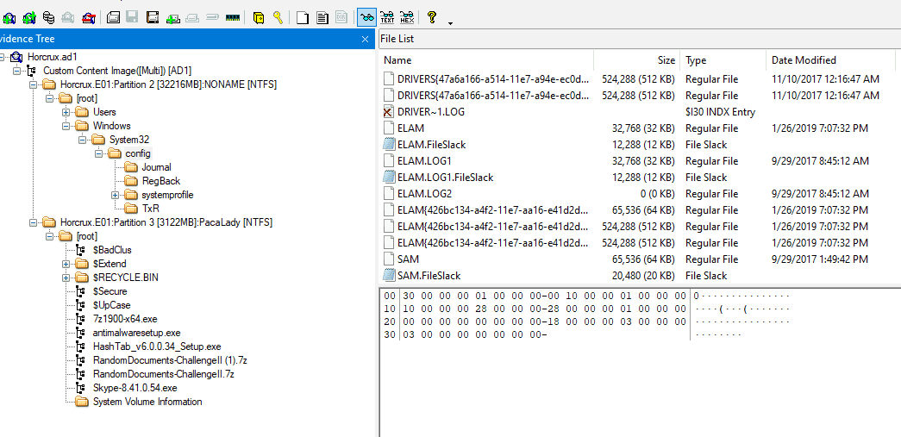

I scoured through the drive and finally headed to`C:\Usres\Karen\AppData\Roaming\Microsoft\Office\Recent` and found the answer:

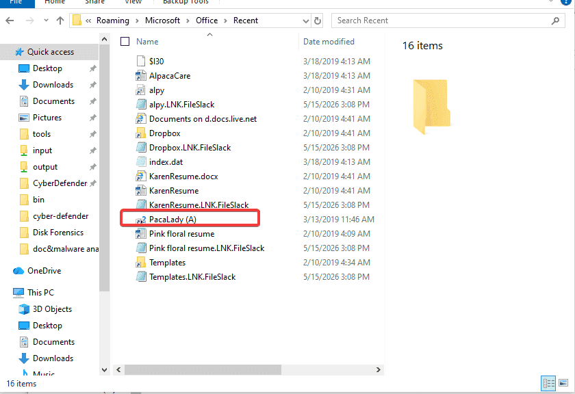

Alternative method: navigating to SYSTEM\MountedDevices” also reveals the answer:

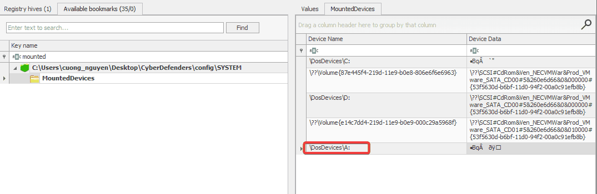

> A

### Q12 What is the answer to the question Company's manager asked Karen? {#34b7b0eb61a4801c8d47fc5f911a937e}

Back to Outlook we go:

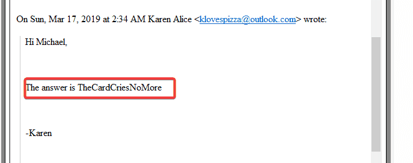

TheCardCriesNoMore

### Q13 What is the job position offered to Karen? (3 words, 2 spaces in between) {#34b7b0eb61a480758468f01e224dff23}

The exact job title is explicitly stated within the recruiter's email confirming Karen's correct answer.

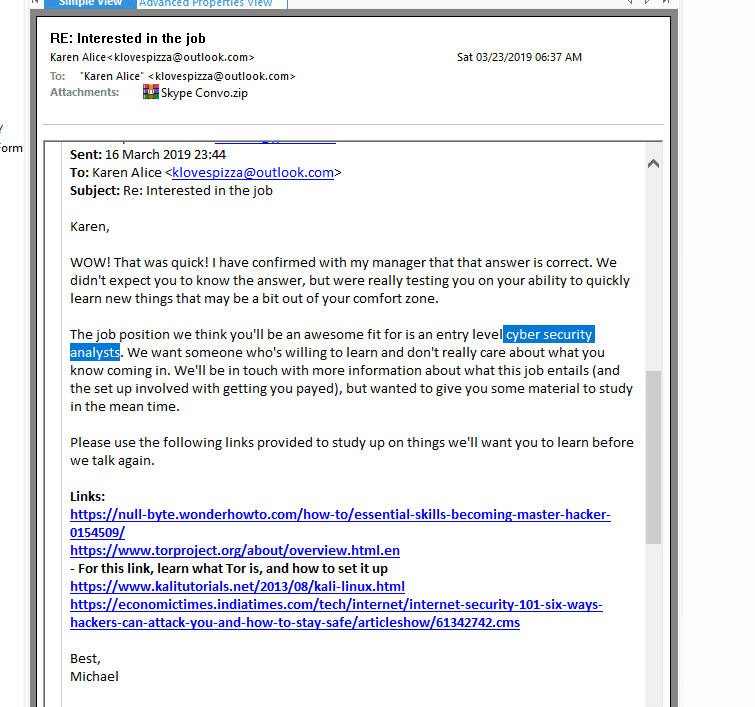

> Cyber Security Analyst

### Q14 When was the admin user password last changed? {#34b7b0eb61a480459fbfd3444ab66670}

In registry explorer: navigating to `SAM` &gt; `Domains` &gt; `Account` &gt; `Users`.

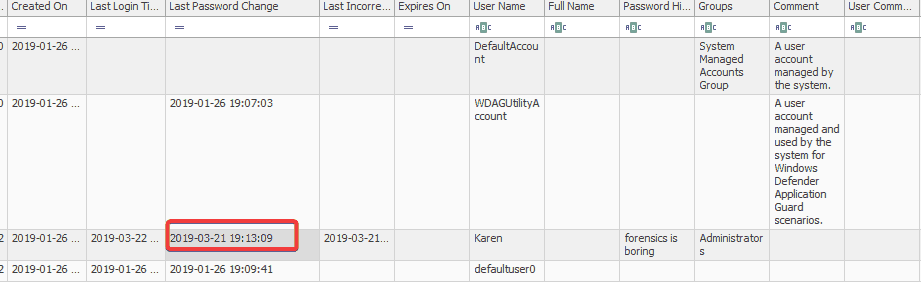

> 03/21/2019 19:13:09

### Q15 What version of Chrome is installed on the machine? {#34b7b0eb61a480d7bd76ead040943f09}

By reviewing the [root]\Users\Karen\AppData\Local\Google\Chrome\User Data\LastVersion

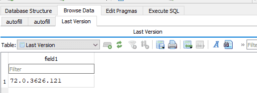

We can also get the answer by checkuing the Uninstall key within SOFTWARE hive.

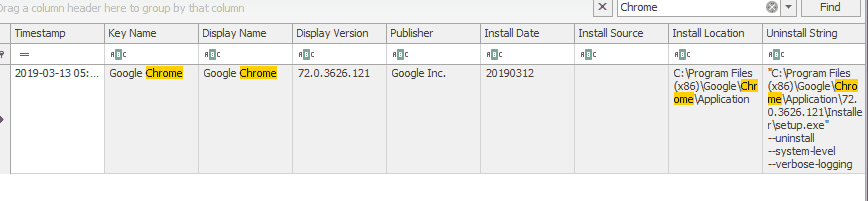

> 72.0.3626.121

### Q16 What is the URL used to download Skype? {#34b7b0eb61a480199e62c9d06d852cdc}

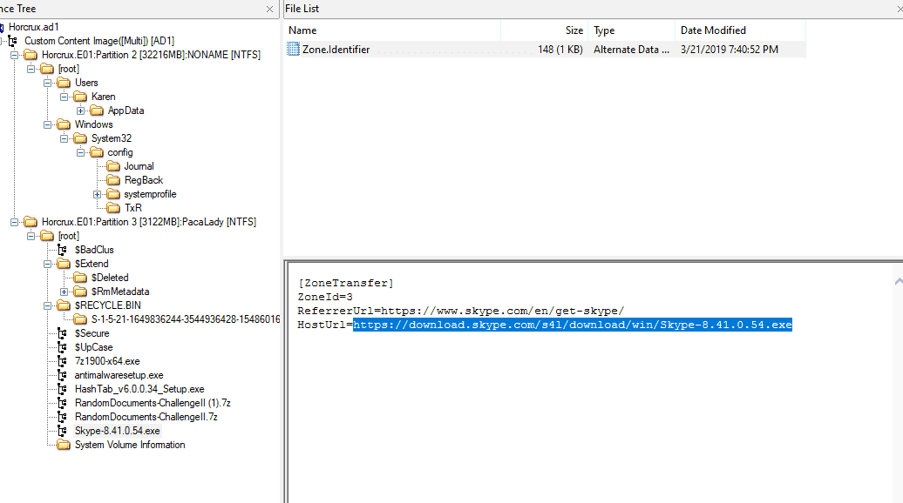

When a file is downloaded from the internet, Windows generates an Alternate Data Stream (ADS) named `Zone.Identifier` to flag the file's origin. Examining the contents of the `Zone.Identifier` stream attached to the Skype installer exposes the direct download URL.

> https://download.skype.com/s4l/download/win/Skype-8.41.0.54.exe

### Q17 What is the domain name of the website Karen browsed on Alpaca care that the file AlpacaCare.docx is based on? {#34b7b0eb61a4802d8817e1c4a55696f8}

Modern Office documents (`.docx`, `.xlsx`, `.pptx`) are effectively ZIP archives containing structured XML and media files. Using a utility like 7-Zip to extract the document's contents allows for the inspection of its internal structure.

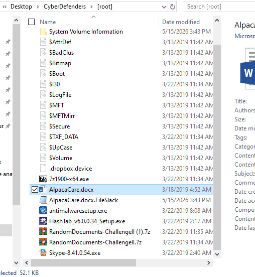

Scouring through the folder and finally heading to \word\_rels

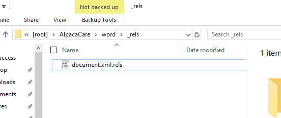

I found the answer

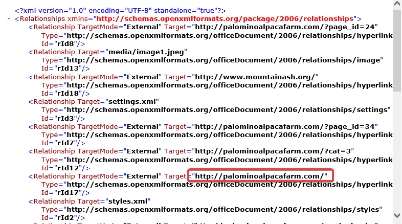

Or just hover in the header of the docx file and you’ll find the answer:

> http://palominoalpacafarm.com/"

