---

[https://cyberdefenders.org/blueteam-ctf-challenges/hunter/](https://cyberdefenders.org/blueteam-ctf-challenges/hunter/)

### Q1 What is  he computer name of the suspect machine? {#34c7b0eb61a480e49a08faa563cb0756}

Data
4ORENSICS

### Q2 What is the computer IP? {#34c7b0eb61a48054b6dccab199423a0f}

Data
10.0.2.15

### Q3 What was the DHCP LeaseObtainedTime? {#34c7b0eb61a48071b1f5e03aebfb50d7}

06/21/2016 05:58:06

_**21/06/2016 02:24:12 UTC**_

Đổi kết quả

### Q4 What is the computer SID? {#34c7b0eb61a4803f96eccf64a1f5d51e}

Key Name
S-1-5-21-2489440558-2754304563-710705792-1001

### Q5 What is the Operating System(OS) version? {#34c7b0eb61a48048a62fe9d2452dbb40}

### Q6 What was the computer timezone? {#34c7b0eb61a480d3b228f9855b0b505a}

UTC-07:00

### Q7 How many times did this user log on to the computer? {#34c7b0eb61a48098a718c351815dac8d}

3

Dùng SAM

### Q8 When was the last login time for the discovered account? Format: one-space between date and time {#34c7b0eb61a48062a72ffef3ebe47a2d}

2016-06-21 01:42

### Q9 There was a “Network Scanner” running on this computer, what was it? And when was the last time the suspect used it? Format: program.exe,YYYY-MM-DD HH:MM:SS UTC {#34c7b0eb61a4802aafa8c7f24e192c3e}

_**ZENMAP.EXE,2016–06–21 12:08:13 UTC**_

Dùng prefetch là ra

### Q10 When did the port scan end? (Example: Sat Jan 23 hh:mm:ss 2016) {#34c7b0eb61a4801f8432ea06f8818b1f}

Ta tìm được trong user hunter một thư mục .zenmap, tìm trong đó dẫn đến thông tin ở desktop file 

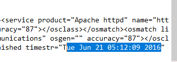

Tue Jun 21 05:12:09 2016

### Q11 How many ports were scanned? {#34c7b0eb61a480a9be0de078953d97cf}

1000

### Q12 What ports were found "open"?(comma-separated, ascending) {#34c7b0eb61a480439634ee891d0046d9}

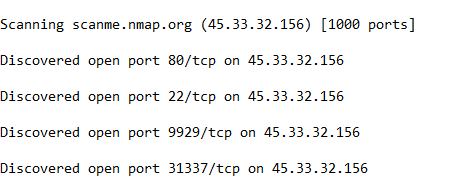

### Q13 What was the version of the network scanner running on this computer? {#34c7b0eb61a480a4a66af359927e9179}

7.12

### Q14 The employee engaged in a Skype conversation with someone. What is the skype username of the other party? {#34c7b0eb61a480e89f1ecb33ea26e34d}

tài khoản là hunterehpt

tìm main.db, My skype received files

share.xml

Ta có thể dùng SkyLogView của nirsoft.

linux-rul3z

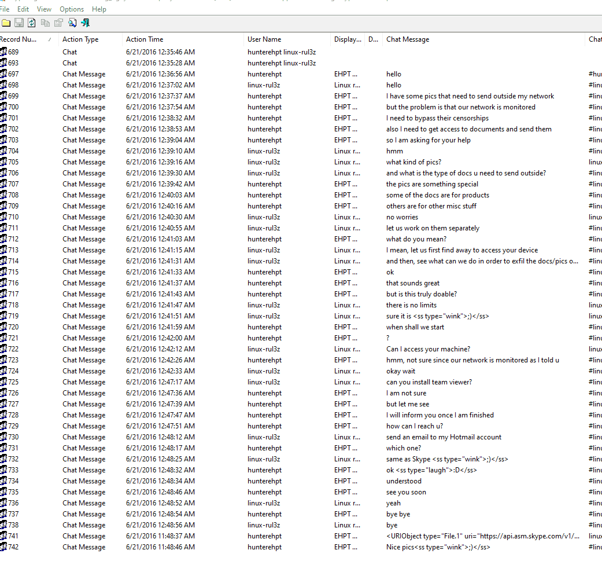

### Q15 What is the name of the application both parties agreed to use to exfiltrate data and provide remote access for the external attacker in their Skype conversation? {#34c7b0eb61a48059b437d50cdb830602}

teamviewer

### Q16 What is the Gmail email address of the suspect employee? {#34c7b0eb61a4808dad18ee4041c9b5ab}

[ehptmsgs@gmail.com](mailto:ehptmsgs@gmail.com)

Ta tìm kiếm trong main.db dùng sql lite

Có thể dùng pst

### Q17 It looks like the suspect user deleted an important diagram after his conversation with the external attacker. What is the file name of the deleted diagram? {#34c7b0eb61a480098d39fd8d64029f21}

home-network-design-networking-for-a-single-family-home-case-house-arkko-1433-x-792.jpg

### Q18 The user Documents' directory contained a PDF file discussing data exfiltration techniques. What is the name of the file? {#34c7b0eb61a4800fa331c1be929f5c1d}

Ryan_VanAntwerp_thesis.pdf

### Q19 What was the name of the Disk Encryption application Installed on the victim system? (two words space separated) {#34c7b0eb61a480b5a27add3eb76385c9}

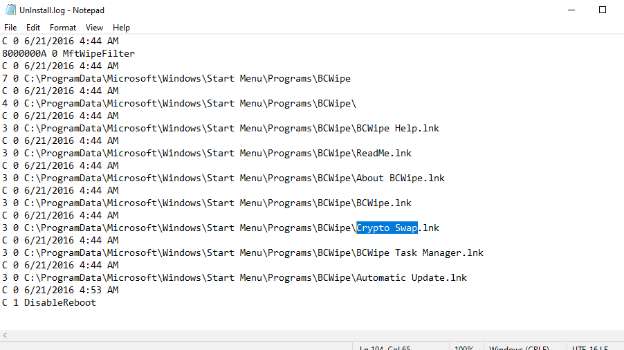

Tìm trong uninstall.log của  C:\Users\cuong_nguyen\Desktop\CyberDefender\[root]\Program Files (x86)\Jetico\BCWipe\ phát hiện 

### Q20 What are the serial numbers of the two identified USB storage? {#34c7b0eb61a48003913ec1cbd899fda7}

Serial Number
07B20C03C80830A9

Serial Number
AAI6UXDKZDV8E9OU

Q21 One of the installed applications is a file shredder. What is the name of the application? (two words space separated)

jetico bcwipe

### Q22 How many prefetch files were discovered on the system? {#34c7b0eb61a480dbbf94e9fadb5e071a}

174

Phải dùng pecmd

### Q23 How many times was the file shredder application executed? {#34c7b0eb61a4803ea13df0d922b0688b}

5

### Q24 Using prefetch, determine when was the last time ZENMAP.EXE-56B17C4C.pf was executed? {#34c7b0eb61a48017b92fc35d5d2d233d}

06/21/2016 12:08:13 PM

### Q25 A JAR file for an offensive traffic manipulation tool was executed. What is the absolute path of the file? {#34c7b0eb61a480da8b43d1f95a93cf1a}

`C:\Users\Hunter\Downloads\burpsuite_free_v1.7.03.jar`

### Q26 The suspect employee tried to exfiltrate data by sending it as an email attachment. What is the name of the suspected attachment? {#34c7b0eb61a480fc96bacdfec44af93b}

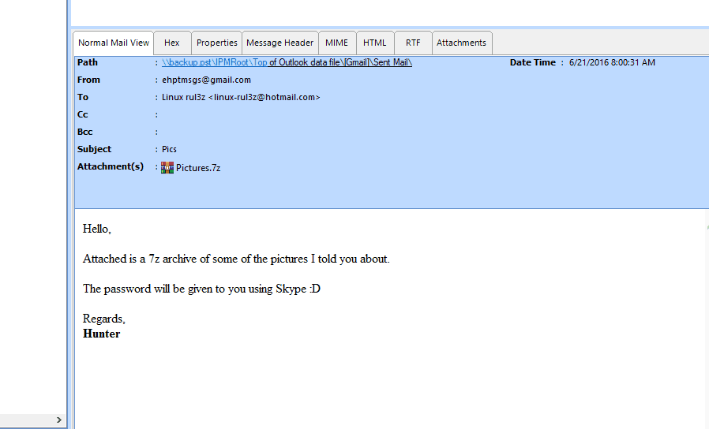

### Q27 Shellbags shows that the employee created a folder to include all the data he will exfiltrate. What is the full path of that folder? {#34c7b0eb61a48035993ef09bb8f47022}

C:\users\hunter\Pictures\Exfil

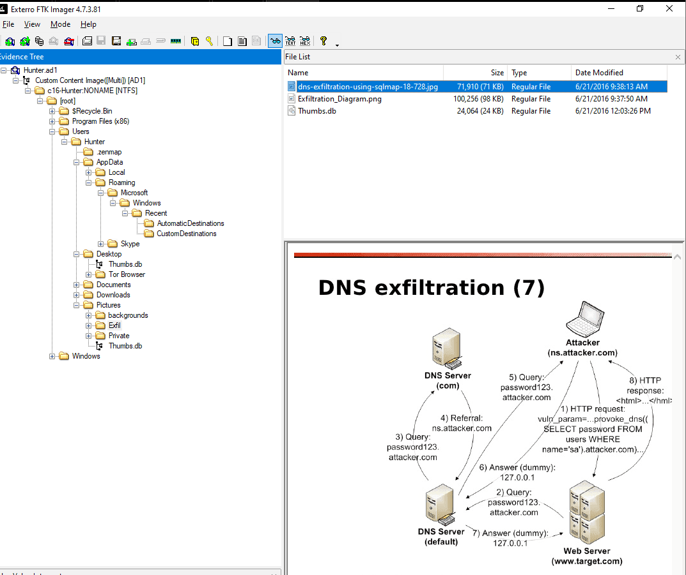

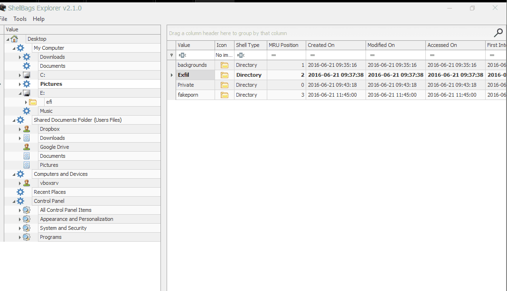

### Q28 The user deleted two JPG files from the system and moved them to $Recycle-Bin. What is the file name that has the resolution of 1920x1200? {#34c7b0eb61a4805aae0be63e912a4a8b}

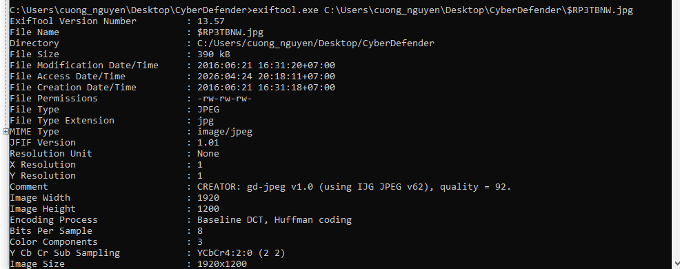

$RP3TBNW.jpg là tên file bị xóa

- **Cơ chế:** Khi người dùng mở một thư mục chứa ảnh và để chế độ xem icon (Thumbnail), Windows sẽ tự động tạo ra một bản sao thu nhỏ của bức ảnh đó và lưu vào file `Thumbs.db` (hoặc thư mục `Explorer\ThumbCache`). **Điều tuyệt vời là nó lưu kèm luôn cả Tên file gốc!**
- **Hành động:** Bạn hãy trích xuất (Export) file `Thumbs.db` này ra ngoài, sau đó dùng công cụ **Thumbs Viewer** hoặc **Thumbcache Viewer**. Công cụ này sẽ hiển thị cho bạn ảnh thu nhỏ ghép cặp với tên gốc. Hãy so khớp dung lượng hoặc hình ảnh để tìm ra tên của `$RBIQP2G.jpg` và `$RP3TBNW.jpg`.

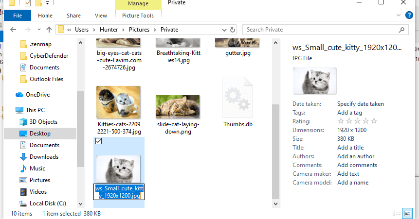

ws_Small_cute_kitty_1920x1200.jpg

### Q29 Provide the name of the directory where information about jump lists items (created automatically by the system) is stored? {#34c7b0eb61a48006abe2cea2d09944de}

AutomaticDestinations

### Q30 Using JUMP LIST analysis, provide the full path of the application with the AppID of "aa28770954eaeaaa" used to bypass network security monitoring controls. {#34c7b0eb61a480a29481ddc028bfa555}

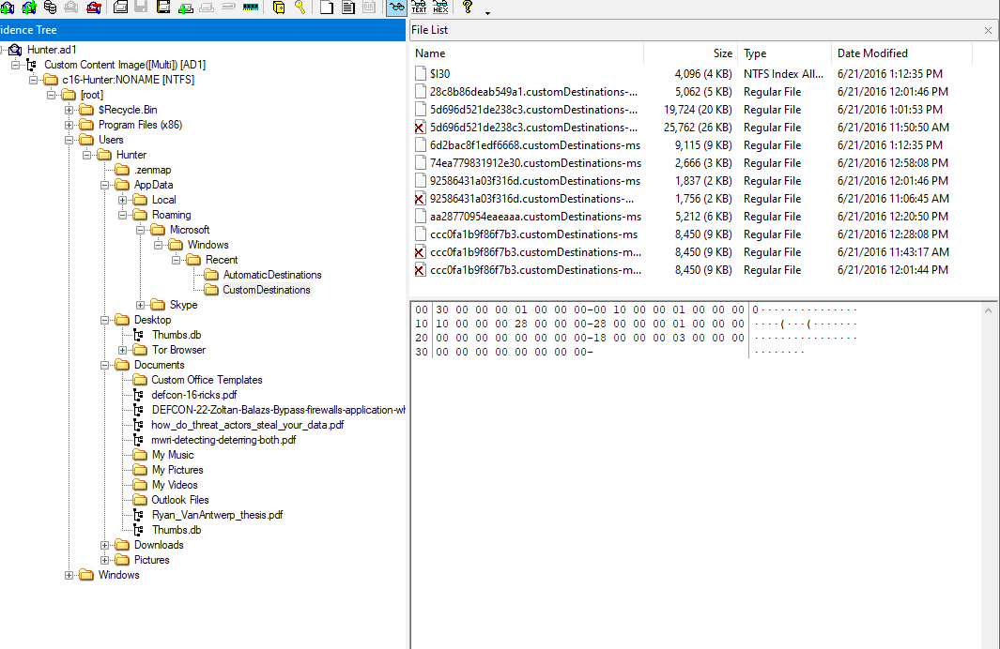

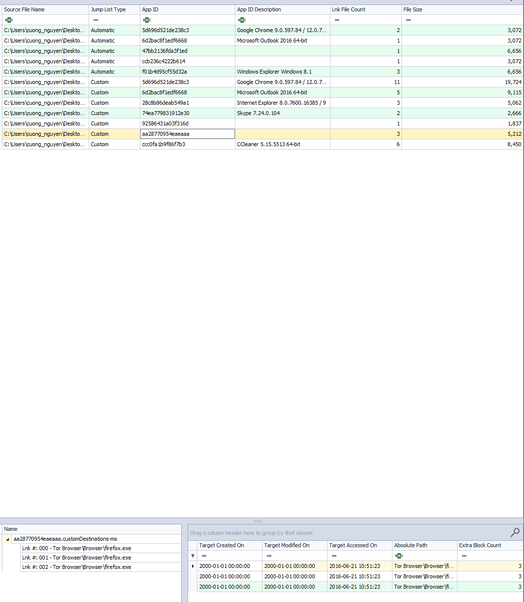

C:\Users\Hunter\Desktop\Tor Browser\Browser\firefox.exe

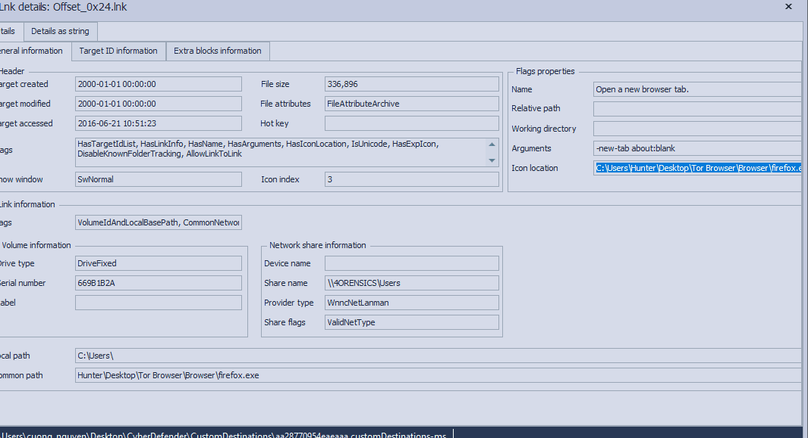

# Tổng kết {#34c7b0eb61a4806a914dc4f83ca19013}

### **Ý nghĩa DFIR Jumplist quan trọng:** {#34c7b0eb61a480918fb7fff5dd22238f}

1. **Bằng chứng mở file/URL:** Nó cho biết chính xác User nào đã dùng Phần mềm nào để mở File/Trang web nào.
2. **Chống lại Anti-Forensics (Kẻ thù của BCWipe):** Giả sử kẻ tấn công (Hunter) đã dùng `BCWipe` để xóa file nhạy cảm, hoặc xóa sạch Lịch sử duyệt web (Browser History). Lịch sử trong trình duyệt có thể mất, nhưng **Jump List của Windows thì thường vẫn còn lưu lại đường dẫn đó!** Nó hoạt động độc lập với ứng dụng.
3. **Hỗ trợ dựng Timeline:** Mỗi dòng trong Jump List thực chất là một file `.lnk` (Shortcut) ẩn, chứa đầy đủ thời gian MAC (Modified, Accessed, Created) giúp bạn biết chính xác thời điểm mục tiêu bị truy cập.

### Shellbags quan trọng {#34c7b0eb61a480828931e6029fb7a581}

- khóa Registry (nằm trong `NTUSER.DAT` và `UsrClass.dat`) dùng để **ghi nhớ sở thích hiển thị thư mục** của người dùng.
- Chứng minh hành vi chủ động: **BẤT KỲ thư mục nào bạn từng mở, dù chỉ MỘT LẦN duy nhất**.

